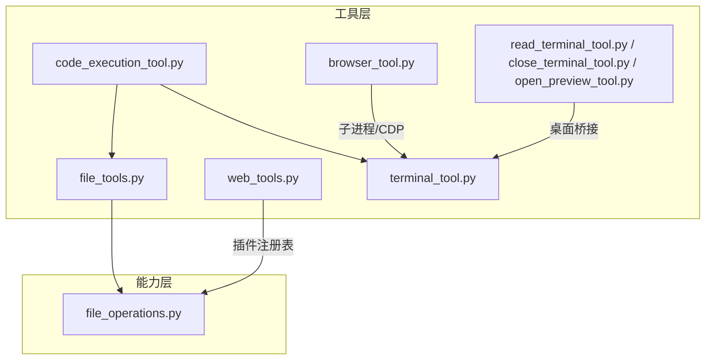
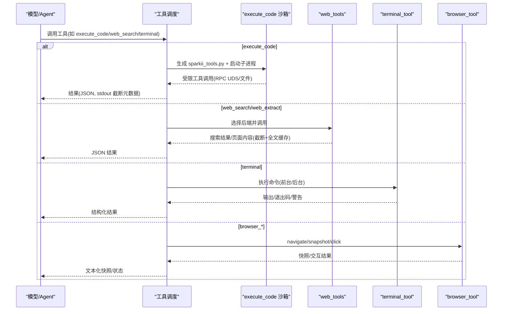
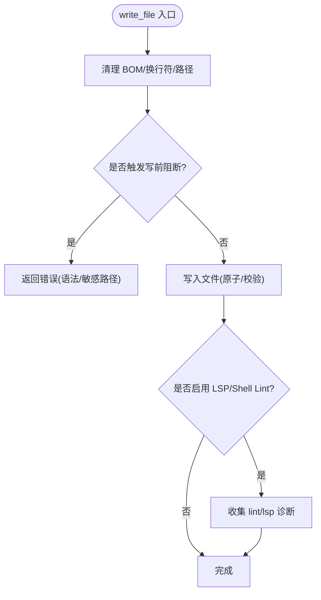
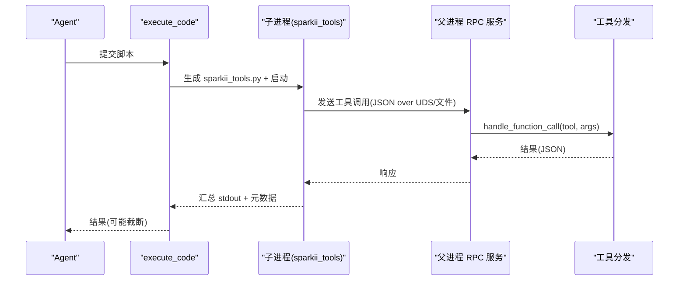
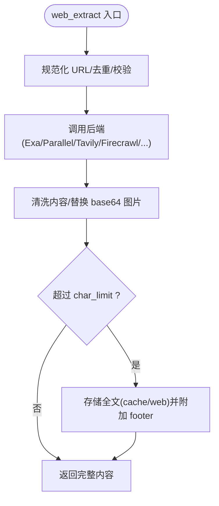
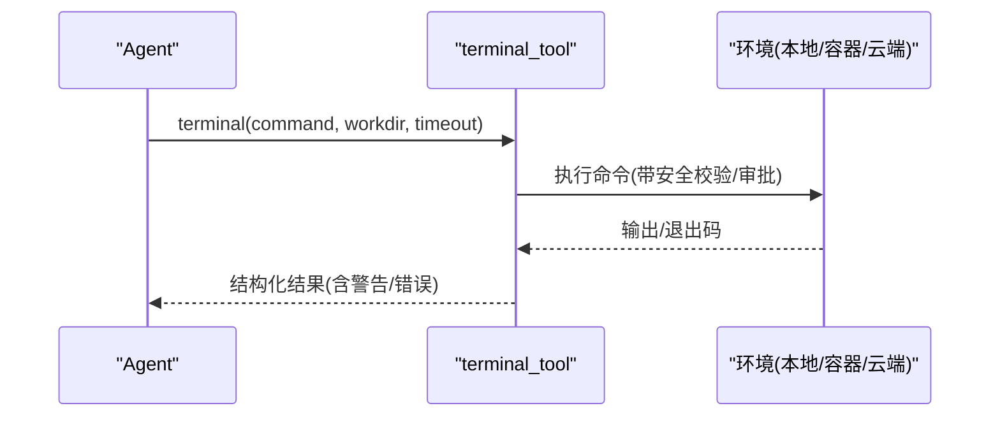
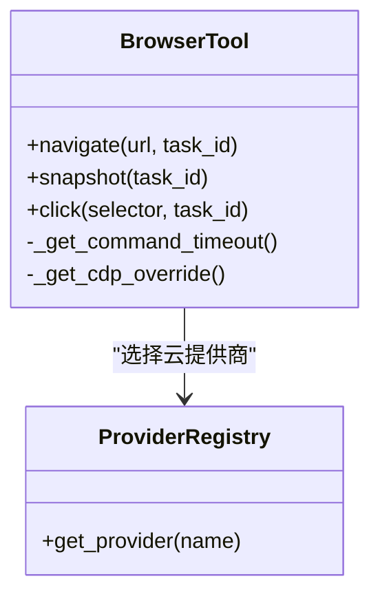
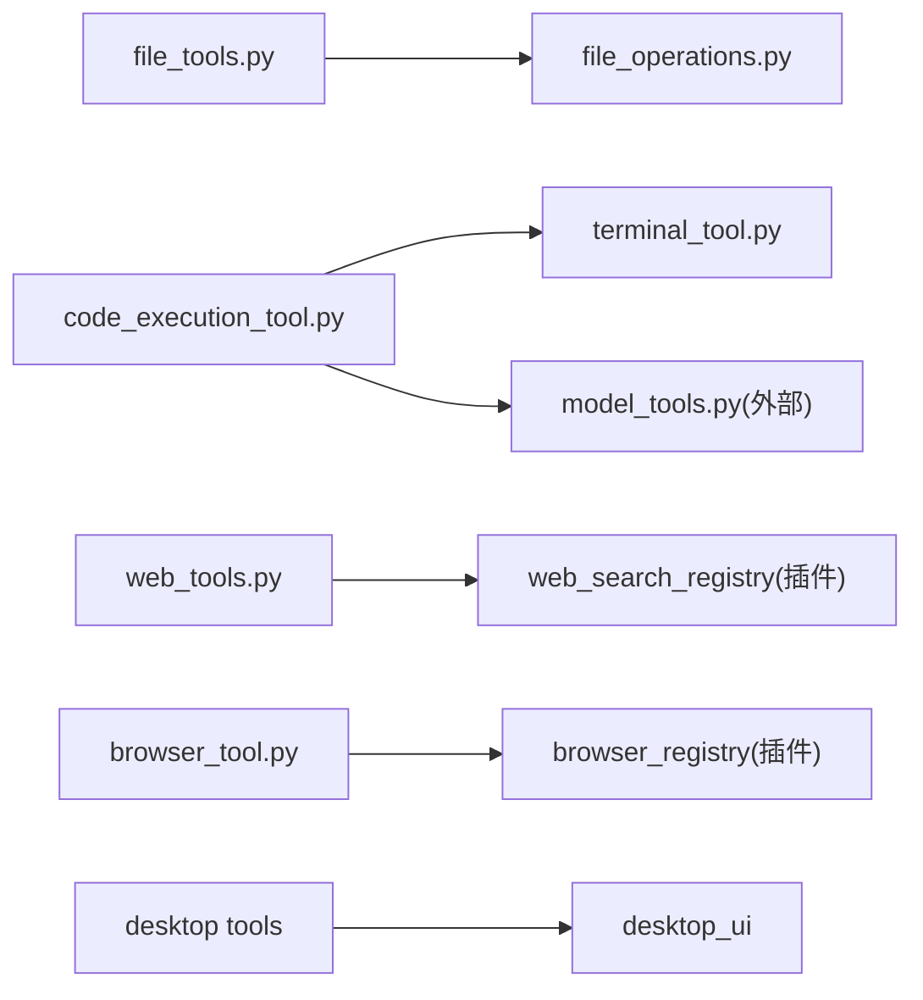

# 内置工具集

<cite>
**本文引用的文件**
- [tools/file_operations.py](file://tools/file_operations.py)
- [tools/file_tools.py](file://tools/file_tools.py)
- [tools/code_execution_tool.py](file://tools/code_execution_tool.py)
- [tools/web_tools.py](file://tools/web_tools.py)
- [tools/terminal_tool.py](file://tools/terminal_tool.py)
- [tools/read_terminal_tool.py](file://tools/read_terminal_tool.py)
- [tools/close_terminal_tool.py](file://tools/close_terminal_tool.py)
- [tools/open_preview_tool.py](file://tools/open_preview_tool.py)
- [tools/browser_tool.py](file://tools/browser_tool.py)
</cite>

## 目录
1. [简介](#简介)
2. [项目结构](#项目结构)
3. [核心组件](#核心组件)
4. [架构总览](#架构总览)
5. [详细组件分析](#详细组件分析)
6. [依赖关系分析](#依赖关系分析)
7. [性能考量](#性能考量)
8. [故障排查指南](#故障排查指南)
9. [结论](#结论)
10. [附录](#附录)

## 简介
本文件为 Sparkii Agent 的内置工具集提供系统化、可操作的文档。内容覆盖以下类别：
- 文件操作工具：read_file、write_file、patch（含 V4A）、search_files 等
- 代码执行工具：execute_code（沙箱内受限工具调用）
- 网络请求工具：web_search、web_extract（多后端自动选择与可用性校验）
- 终端工具：terminal、read_terminal、close_terminal
- 浏览器工具：browser_navigate/snapshot/click 等（Browser Use/Browserbase/Firecrawl/本地 Chromium）
- 预览工具：open_preview（桌面端预览面板）

文档将说明每个工具的参数定义、返回值格式、错误处理机制，以及安全限制、执行环境隔离、依赖检查与可用性验证的实现细节，并给出最佳实践与性能优化建议。

## 项目结构
Sparkii 的工具实现按职责分层组织：
- 通用能力抽象与底层实现：tools/file_operations.py
- 面向 LLM 的工具封装与安全策略：tools/file_tools.py
- 代码执行沙箱与 RPC：tools/code_execution_tool.py
- 网络搜索与内容提取：tools/web_tools.py
- 终端执行与环境管理：tools/terminal_tool.py
- 桌面端 UI 工具：tools/read_terminal_tool.py、tools/close_terminal_tool.py、tools/open_preview_tool.py
- 浏览器自动化：tools/browser_tool.py

**图表来源**
- [tools/file_tools.py:1-120](file://tools/file_tools.py#L1-L120)
- [tools/file_operations.py:450-515](file://tools/file_operations.py#L450-L515)
- [tools/code_execution_tool.py:60-78](file://tools/code_execution_tool.py#L60-L78)
- [tools/web_tools.py:159-173](file://tools/web_tools.py#L159-L173)
- [tools/terminal_tool.py:1-35](file://tools/terminal_tool.py#L1-L35)
- [tools/browser_tool.py:1-50](file://tools/browser_tool.py#L1-L50)

**章节来源**
- [tools/file_operations.py:450-515](file://tools/file_operations.py#L450-L515)
- [tools/file_tools.py:1-120](file://tools/file_tools.py#L1-L120)
- [tools/code_execution_tool.py:60-78](file://tools/code_execution_tool.py#L60-L78)
- [tools/web_tools.py:159-173](file://tools/web_tools.py#L159-L173)
- [tools/terminal_tool.py:1-35](file://tools/terminal_tool.py#L1-L35)
- [tools/browser_tool.py:1-50](file://tools/browser_tool.py#L1-L50)

## 核心组件
- 文件操作抽象与实现：统一 read/write/patch/search，跨终端后端（local/docker/ssh/modal/daytona/vercel_sandbox），支持分页、BOM/换行符保留、Lint/LSP 诊断、写路径拒绝列表。
- 代码执行沙箱：generate sparkii_tools.py 并在受限环境中运行，仅允许有限工具集合，环境变量清洗，RPC（UDS/文件）通信，输出截断与元数据。
- 网络工具：多后端（Exa/Parallel/Tavily/Firecrawl/SearXNG/Brave-free/ddgs/xai）自动选择与可用性探测；extract 页面内容截断与全文缓存；URL 安全校验。
- 终端工具：多后端命令执行、后台任务、磁盘用量告警、sudo 交互、危险命令审批、工作目录安全校验。
- 浏览器工具：本地 headless Chromium 或云提供商（Browser Use/Browserbase/Firecrawl），会话隔离、快照摘要、CDP 监督器、超时与提示。
- 桌面 UI 工具：read_terminal、close_terminal、open_preview，通过桌面桥事件驱动。

**章节来源**
- [tools/file_operations.py:150-800](file://tools/file_operations.py#L150-L800)
- [tools/code_execution_tool.py:60-78](file://tools/code_execution_tool.py#L60-L78)
- [tools/web_tools.py:223-352](file://tools/web_tools.py#L223-L352)
- [tools/terminal_tool.py:118-203](file://tools/terminal_tool.py#L118-L203)
- [tools/browser_tool.py:259-343](file://tools/browser_tool.py#L259-L343)
- [tools/read_terminal_tool.py:20-76](file://tools/read_terminal_tool.py#L20-L76)
- [tools/close_terminal_tool.py:21-53](file://tools/close_terminal_tool.py#L21-L53)
- [tools/open_preview_tool.py:19-53](file://tools/open_preview_tool.py#L19-L53)

## 架构总览
下图展示工具调用从模型到具体实现的典型流程，包括沙箱、网络、终端与浏览器路径。

**图表来源**
- [tools/code_execution_tool.py:329-464](file://tools/code_execution_tool.py#L329-L464)
- [tools/web_tools.py:618-739](file://tools/web_tools.py#L618-L739)
- [tools/terminal_tool.py:1-35](file://tools/terminal_tool.py#L1-L35)
- [tools/browser_tool.py:1-50](file://tools/browser_tool.py#L1-L50)

## 详细组件分析

### 文件操作工具（read_file、write_file、patch、search_files）
- 功能要点
  - read_file：分页读取（offset/limit），检测二进制/图片，返回 base64（当后端支持），BOM/换行符保留，超大文件截断与提示。
  - write_file：创建目录、写入前 Lint（JSON/YAML/TOML/Python 等），LSP 语义诊断，写后校验，敏感路径拒绝。
  - patch：模糊替换与 V4A 多文件补丁，diff 与 no_change 标记，LSP 诊断。
  - search_files：内容/文件名搜索，上下文行，结果压缩与截断，过滤设备/敏感路径。
- 参数与返回
  - read_file(path, offset=1, limit=2000) → ReadResult 字典（content、total_lines、file_size、truncated、is_binary/is_image、mime_type、dimensions、error 等）
  - write_file(path, content, pre_content=None) → WriteResult 字典（bytes_written、dirs_created、verified、lint、lsp_diagnostics、error/warning）
  - patch_replace(path, old_string, new_string, replace_all=False) → PatchResult 字典（success、diff、files_modified/created/deleted、lint、lsp_diagnostics、no_change/note）
  - search_files(pattern, target="content", path=".", file_glob=None, limit=50, offset=0, output_mode="content", context=0) → SearchResult 字典（matches/files/counts、total_count、truncated、limit_reason、warning/error）
- 安全与限制
  - 写路径拒绝列表（系统/凭证目录），敏感系统路径保护，受保护的指令文件（AGENTS.md 等）强制审批。
  - 设备路径拦截（/dev/*、/proc/* 敏感项），工作目录安全校验，相对路径越界警告。
- 错误处理
  - 统一 tool_error 包装，区分“不可用 linter”、“权限不足”、“路径被拒”、“搜索超时”等。
- 依赖检查与可用性
  - 通过 LINTERS_INPROC 与 shell linters 组合；LSP 可用时跳过冗余 shell lint。
  - 搜索使用 rg/grep，解析输出并分离诊断信息。

**图表来源**
- [tools/file_operations.py:150-800](file://tools/file_operations.py#L150-L800)
- [tools/file_tools.py:641-800](file://tools/file_tools.py#L641-L800)

**章节来源**
- [tools/file_operations.py:150-800](file://tools/file_operations.py#L150-L800)
- [tools/file_tools.py:1-120](file://tools/file_tools.py#L1-L120)
- [tools/file_tools.py:641-800](file://tools/file_tools.py#L641-L800)

### 代码执行工具（execute_code）
- 功能要点
  - 在受限沙箱中运行模型生成的 Python 脚本，通过 RPC（本地 UDS 或远程文件）调用有限工具集合。
  - 允许工具：web_search、web_extract、read_file、write_file、search_files、patch、terminal。
  - 环境变量清洗：阻止密钥泄露，仅放行必要变量；Windows 特殊变量白名单。
  - 输出截断：stdout/stderr 字节上限，头尾截取并附带元数据。
- 参数与返回
  - 输入：command（脚本内容）、timeout、workdir 等由上层封装；内部通过 sparkii_tools.py 暴露受限函数。
  - 返回：JSON 字符串（包含 stdout、metadata、可能的 warning）。
- 安全与限制
  - 沙箱工具白名单、禁止 terminal 的 background/pty/notify_on_complete/watch_patterns 等危险参数。
  - 令牌鉴权（SPARKII_RPC_TOKEN），失败返回 Unauthorized。
- 依赖检查与可用性
  - check_sandbox_requirements() 探测终端配置与 Vercel 沙箱要求。
- 常见错误与建议
  - 导入不在沙箱的工具、误用 json.loads、第三方包缺失等，提供修复提示。

**图表来源**
- [tools/code_execution_tool.py:329-464](file://tools/code_execution_tool.py#L329-L464)
- [tools/code_execution_tool.py:645-779](file://tools/code_execution_tool.py#L645-L779)

**章节来源**
- [tools/code_execution_tool.py:60-78](file://tools/code_execution_tool.py#L60-L78)
- [tools/code_execution_tool.py:329-464](file://tools/code_execution_tool.py#L329-L464)
- [tools/code_execution_tool.py:645-779](file://tools/code_execution_tool.py#L645-L779)

### 网络请求工具（web_search、web_extract）
- 功能要点
  - 多后端自动选择：Exa、Parallel、Tavily、Firecrawl、SearXNG、Brave-free、ddgs、xai；支持 per-capability 覆盖（search_backend/extract_backend）。
  - web_search：返回 URL、标题、描述等元数据；限制结果数量。
  - web_extract：抽取干净页面内容（markdown/text），超长页面 head+tail 截断，全文存储于 cache/web，footer 指示如何 read_file 读取省略部分；替换 inline base64 图片为占位符。
- 参数与返回
  - web_search(query, limit=5) → JSON {success, data.web[]}
  - web_extract(urls, format=None, char_limit=None) → JSON {results:[{url,title,content,error}]}
- 安全与限制
  - URL 安全校验（敏感查询参数、注入防护），隐藏 base64 图片避免 token 爆炸。
  - 最大存储字符限制（2MB），防止磁盘滥用。
- 依赖检查与可用性
  - _is_backend_available() 探测 API Key/包存在性；_ensure_web_plugins_loaded() 确保插件注册表就绪。

**图表来源**
- [tools/web_tools.py:618-739](file://tools/web_tools.py#L618-L739)
- [tools/web_tools.py:742-800](file://tools/web_tools.py#L742-L800)
- [tools/web_tools.py:480-576](file://tools/web_tools.py#L480-L576)

**章节来源**
- [tools/web_tools.py:223-352](file://tools/web_tools.py#L223-L352)
- [tools/web_tools.py:618-739](file://tools/web_tools.py#L618-L739)
- [tools/web_tools.py:742-800](file://tools/web_tools.py#L742-L800)
- [tools/web_tools.py:480-576](file://tools/web_tools.py#L480-L576)

### 终端工具（terminal、read_terminal、close_terminal）
- 功能要点
  - terminal：在多种后端执行命令（local/docker/ssh/modal/daytona/vercel_sandbox），支持前台/后台任务、超时、工作目录安全校验、sudo 交互、危险命令审批。
  - read_terminal：读取桌面端内置终端面板内容（分页）。
  - close_terminal：关闭后台进程的只读标签页（不终止进程）。
- 参数与返回
  - terminal(command, timeout=None, workdir=None, ...) → {output, exit_code, warnings/errors}
  - read_terminal(start_line=None, count=None) → {total_lines, start, end, viewport_rows, cursor_row, text}
  - close_terminal(process_id) → {success, message}
- 安全与限制
  - 工作目录白名单字符校验，拒绝 shell 元字符；敏感系统路径写保护；sudo 密码缓存与作用域隔离。
  - 磁盘用量阈值告警（可配置）。
- 依赖检查与可用性
  - Vercel Sandbox 运行时与认证校验；终端最大前台超时限制。

**图表来源**
- [tools/terminal_tool.py:118-203](file://tools/terminal_tool.py#L118-L203)
- [tools/read_terminal_tool.py:20-76](file://tools/read_terminal_tool.py#L20-L76)
- [tools/close_terminal_tool.py:21-53](file://tools/close_terminal_tool.py#L21-L53)

**章节来源**
- [tools/terminal_tool.py:118-203](file://tools/terminal_tool.py#L118-L203)
- [tools/read_terminal_tool.py:20-76](file://tools/read_terminal_tool.py#L20-L76)
- [tools/close_terminal_tool.py:21-53](file://tools/close_terminal_tool.py#L21-L53)

### 浏览器工具（browser_use、open_preview 等）
- 功能要点
  - 支持本地 headless Chromium 与云提供商（Browser Use/Browserbase/Firecrawl），会话隔离，基于无障碍树（ariaSnapshot）的文本快照。
  - open_preview：在桌面端预览面板打开 URL/本地开发服务器/文件。
- 参数与返回
  - browser_navigate(url, task_id) → {status, snapshot?}
  - browser_snapshot(task_id) → {snapshot_text, truncated?, full_path?}
  - browser_click(selector, task_id) → {status, error?}
  - open_preview(url, label="") → {success, url, label}
- 安全与限制
  - 子进程环境变量清洗，仅透传必要键；CDP 端点发现与超时；对话框策略与超时配置。
- 依赖检查与可用性
  - 自动发现 Node/agent-browser 路径；Homebrew 版本化 Node 支持；CDP 覆盖优先。

**图表来源**
- [tools/browser_tool.py:259-343](file://tools/browser_tool.py#L259-L343)
- [tools/browser_tool.py:519-556](file://tools/browser_tool.py#L519-L556)
- [tools/open_preview_tool.py:19-53](file://tools/open_preview_tool.py#L19-L53)

**章节来源**
- [tools/browser_tool.py:259-343](file://tools/browser_tool.py#L259-L343)
- [tools/browser_tool.py:519-556](file://tools/browser_tool.py#L519-L556)
- [tools/open_preview_tool.py:19-53](file://tools/open_preview_tool.py#L19-L53)

## 依赖关系分析
- 文件工具依赖 file_operations 抽象与 binary_extensions、file_state、redact 等。
- 代码执行依赖 terminal_tool 的环境管理与 model_tools 的工具分发。
- 网络工具依赖插件注册表（web_search_registry）与各 vendor provider。
- 浏览器工具依赖 agent-browser CLI、CDP 监督器与插件注册表（browser_registry）。
- 桌面工具依赖 desktop_ui 桥与 process_registry。

**图表来源**
- [tools/file_tools.py:1-120](file://tools/file_tools.py#L1-L120)
- [tools/code_execution_tool.py:645-779](file://tools/code_execution_tool.py#L645-L779)
- [tools/web_tools.py:159-173](file://tools/web_tools.py#L159-L173)
- [tools/browser_tool.py:159-177](file://tools/browser_tool.py#L159-L177)

**章节来源**
- [tools/file_tools.py:1-120](file://tools/file_tools.py#L1-L120)
- [tools/code_execution_tool.py:645-779](file://tools/code_execution_tool.py#L645-L779)
- [tools/web_tools.py:159-173](file://tools/web_tools.py#L159-L173)
- [tools/browser_tool.py:159-177](file://tools/browser_tool.py#L159-L177)

## 性能考量
- 文件读取：分页与字符预算控制，避免大文件阻塞；line-number 渲染与单行长度限制；搜索输出压缩（path-grouped）。
- 代码执行：stdout/stderr 字节上限，头尾截取；RPC 轮询退避；沙箱工具调用次数限制。
- 网络提取：char_limit 控制，全文缓存至 cache/web；base64 图片替换减少 token 消耗。
- 终端：前台超时上限、磁盘用量缓存告警、sudo 密码缓存作用域隔离。
- 浏览器：命令超时缓存、首次打开更大超时、截图清理节流、CDP 监督器按需启动。

[本节为通用指导，无需特定文件引用]

## 故障排查指南
- 文件写入失败
  - 检查敏感路径拒绝与受保护指令文件；确认 Lint/LSP 诊断；查看 write_file 返回的 error/warning。
  - 参考：[tools/file_operations.py:150-800](file://tools/file_operations.py#L150-L800)、[tools/file_tools.py:641-800](file://tools/file_tools.py#L641-L800)
- 代码执行异常
  - 确认沙箱允许工具、环境变量清洗、RPC 令牌；查看 stderr 提示（import 错误、模块缺失、类型错误）。
  - 参考：[tools/code_execution_tool.py:377-429](file://tools/code_execution_tool.py#L377-L429)、[tools/code_execution_tool.py:645-779](file://tools/code_execution_tool.py#L645-L779)
- 网络搜索/提取失败
  - 检查后端可用性（API Key/包）、插件注册表；确认 URL 安全；查看截断 footer 与缓存路径。
  - 参考：[tools/web_tools.py:223-352](file://tools/web_tools.py#L223-L352)、[tools/web_tools.py:618-739](file://tools/web_tools.py#L618-L739)
- 终端执行问题
  - 检查工作目录安全、sudo 交互、危险命令审批、Vercel 运行时配置；查看磁盘用量告警。
  - 参考：[tools/terminal_tool.py:118-203](file://tools/terminal_tool.py#L118-L203)
- 浏览器超时/连接失败
  - 检查 CDP 覆盖、agent-browser 安装、Node 路径；查看超时提示与日志。
  - 参考：[tools/browser_tool.py:259-343](file://tools/browser_tool.py#L259-L343)、[tools/browser_tool.py:519-556](file://tools/browser_tool.py#L519-L556)

**章节来源**
- [tools/file_operations.py:150-800](file://tools/file_operations.py#L150-L800)
- [tools/file_tools.py:641-800](file://tools/file_tools.py#L641-L800)
- [tools/code_execution_tool.py:377-429](file://tools/code_execution_tool.py#L377-L429)
- [tools/code_execution_tool.py:645-779](file://tools/code_execution_tool.py#L645-L779)
- [tools/web_tools.py:223-352](file://tools/web_tools.py#L223-L352)
- [tools/web_tools.py:618-739](file://tools/web_tools.py#L618-L739)
- [tools/terminal_tool.py:118-203](file://tools/terminal_tool.py#L118-L203)
- [tools/browser_tool.py:259-343](file://tools/browser_tool.py#L259-L343)
- [tools/browser_tool.py:519-556](file://tools/browser_tool.py#L519-L556)

## 结论
Sparkii 的内置工具集以模块化、可插拔的方式提供强大的文件、代码执行、网络、终端、浏览器与桌面 UI 能力。通过严格的安全策略（路径拒绝、敏感信息保护、沙箱白名单）、完善的可用性探测（插件注册表、后端能力检查）与性能优化（分页、截断、缓存、超时），可在多环境下稳定高效地支撑 Agent 的任务执行。建议在实际使用中遵循分页读取、合理设置 char_limit/timeout、利用 LSP 诊断与沙箱受限工具，以获得最佳体验与安全性。

[本节为总结，无需特定文件引用]

## 附录
- 常用最佳实践
  - 文件操作：优先使用 patch 进行精准修改；对大文件使用 read_file 分页；关注 Lint/LSP 诊断。
  - 代码执行：仅在沙箱允许的范围内调用工具；避免大量 stdout；必要时拆分任务。
  - 网络请求：明确指定 backend（search/extract）；合理使用 char_limit；利用全文缓存定位省略部分。
  - 终端：设置合理超时；谨慎使用 sudo；关注磁盘用量告警。
  - 浏览器：首次打开预留更长超时；使用 ariaSnapshot 文本快照；必要时开启 CDP 监督器。
  - 桌面 UI：使用 read_terminal/close_terminal/open_preview 提升交互效率。

[本节为通用指导，无需特定文件引用]