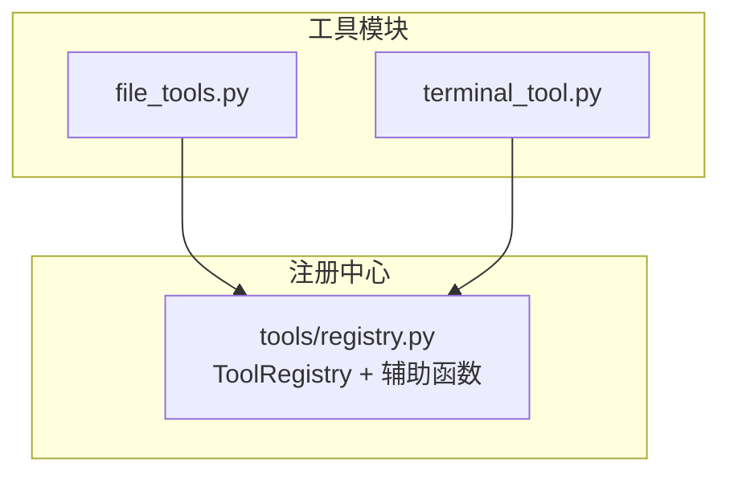
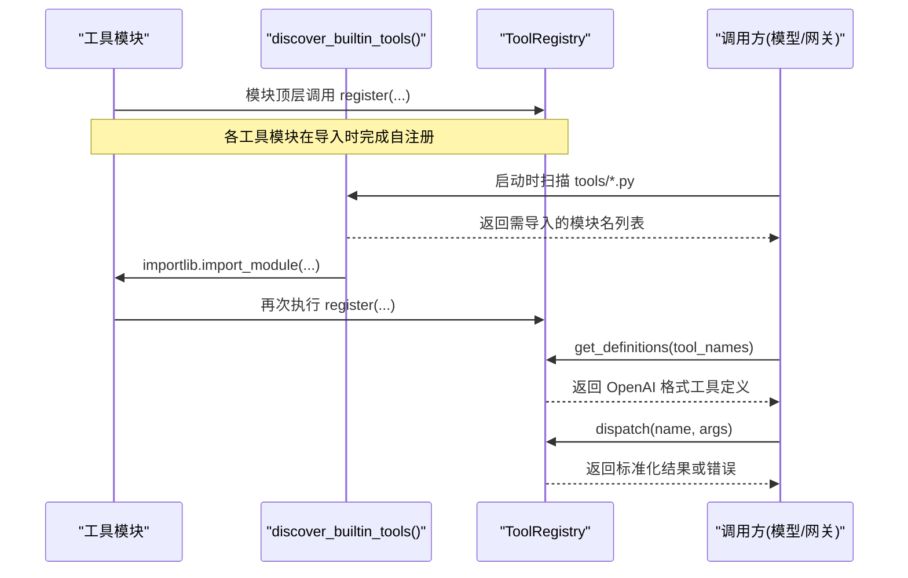
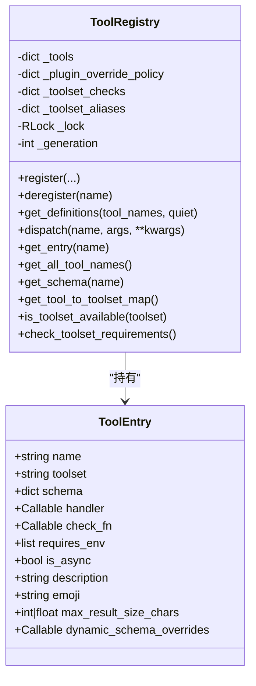
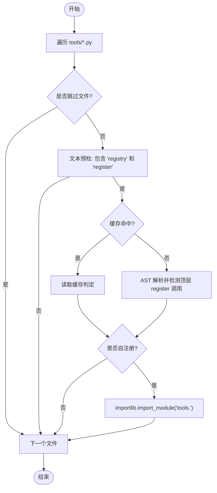
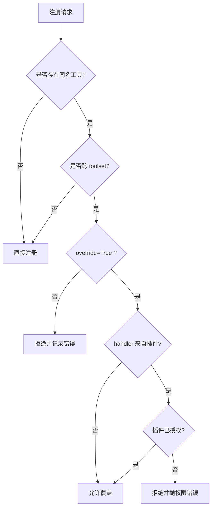
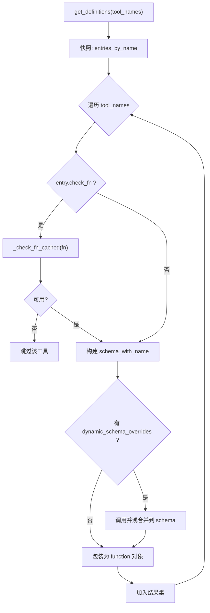
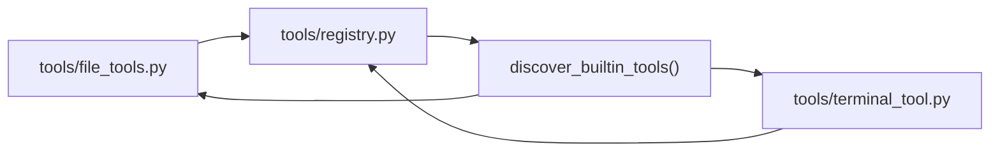

# 工具注册系统

<cite>
**本文引用的文件**
- [tools/registry.py](file://tools/registry.py)
- [tools/file_tools.py](file://tools/file_tools.py)
- [tools/terminal_tool.py](file://tools/terminal_tool.py)
</cite>

## 目录
1. [简介](#简介)
2. [项目结构](#项目结构)
3. [核心组件](#核心组件)
4. [架构总览](#架构总览)
5. [详细组件分析](#详细组件分析)
6. [依赖关系分析](#依赖关系分析)
7. [性能考量](#性能考量)
8. [故障排查指南](#故障排查指南)
9. [结论](#结论)
10. [附录：自定义工具开发指南](#附录自定义工具开发指南)

## 简介
本文件面向 Sparkii Agent 的工具注册系统，围绕 ToolRegistry 类展开，系统性说明工具发现机制、动态加载、注册表管理、线程安全设计、注册参数与校验、覆盖与安全策略、定义获取流程（含 schema 生成与动态覆盖）、卸载与清理机制，以及自定义工具开发的接口规范、测试方法与部署步骤。目标是帮助开发者在不深入源码的情况下也能正确扩展与治理工具集。

## 项目结构
Sparkii Agent 将“工具”以模块为单位组织在 tools/ 目录下，每个工具模块在模块顶层通过 registry.register() 声明自身（schema、handler、toolset、check_fn 等）。运行时由 discover_builtin_tools() 扫描并导入这些模块，完成自动发现与注册；ToolRegistry 提供统一的查询、分发与生命周期管理能力。

图表来源
- [tools/registry.py:108-159](file://tools/registry.py#L108-L159)
- [tools/file_tools.py:2617-2621](file://tools/file_tools.py#L2617-L2621)
- [tools/terminal_tool.py:1-200](file://tools/terminal_tool.py#L1-L200)

章节来源
- [tools/registry.py:108-159](file://tools/registry.py#L108-L159)
- [tools/file_tools.py:2617-2621](file://tools/file_tools.py#L2617-L2621)

## 核心组件
- ToolEntry：单条工具的元数据容器，包含 name、toolset、schema、handler、check_fn、requires_env、is_async、description、emoji、max_result_size_chars、dynamic_schema_overrides 等字段。
- ToolRegistry：全局单例，维护工具映射、toolset 检查函数、别名、插件覆盖策略、并发锁与版本代计数，提供注册、注销、定义获取、分发、查询等能力。
- 工具发现：discover_builtin_tools() 对 tools/*.py 进行 AST 扫描，识别顶层调用 registry.register() 的模块，缓存判定结果，按需 import 触发模块级注册。
- check_fn 缓存：对外部环境探测（如 Docker/Playwright）做 TTL 与“最近成功宽限”保护，避免瞬时失败导致工具被误剔除。
- 工具响应规范化：_normalize_handler_result() 统一返回字符串或受支持的多模态信封，并对错误体长度做上限截断。

章节来源
- [tools/registry.py:201-230](file://tools/registry.py#L201-L230)
- [tools/registry.py:414-436](file://tools/registry.py#L414-L436)
- [tools/registry.py:108-159](file://tools/registry.py#L108-L159)
- [tools/registry.py:257-387](file://tools/registry.py#L257-L387)
- [tools/registry.py:770-834](file://tools/registry.py#L770-L834)

## 架构总览
下图展示从“工具模块声明”到“运行时发现与注册”，再到“定义获取与分发”的整体流程。

图表来源
- [tools/registry.py:108-159](file://tools/registry.py#L108-L159)
- [tools/registry.py:562-644](file://tools/registry.py#L562-L644)
- [tools/registry.py:717-764](file://tools/registry.py#L717-L764)
- [tools/registry.py:801-834](file://tools/registry.py#L801-L834)

## 详细组件分析

### ToolRegistry 类与线程安全
- 数据结构
  - _tools: 名称到 ToolEntry 的映射
  - _plugin_override_policy: 插件命名空间到是否允许覆盖内置工具的权限映射
  - _toolset_checks/_toolset_aliases: toolset 维度的检查函数与别名
  - _lock: RLock 用于序列化写操作
  - _generation: 单调递增版本号，供外部缓存失效使用
- 关键方法
  - register(): 注册工具，支持同名跨 toolset 覆盖（需显式 override=True 且满足插件策略）
  - deregister(): 注销工具，带所有权校验（插件不能随意删除非自有工具），清理空 toolset 的检查与别名
  - get_definitions(): 按 tool_names 生成 OpenAI function 定义，应用 check_fn 过滤与 dynamic_schema_overrides
  - dispatch(): 同步/异步调度 handler，统一异常捕获与结果规范化
  - 查询辅助: get_entry/get_all_tool_names/get_schema/get_tool_to_toolset_map/is_toolset_available/check_toolset_requirements 等

图表来源
- [tools/registry.py:201-230](file://tools/registry.py#L201-L230)
- [tools/registry.py:414-436](file://tools/registry.py#L414-L436)
- [tools/registry.py:562-711](file://tools/registry.py#L562-L711)
- [tools/registry.py:717-951](file://tools/registry.py#L717-L951)

章节来源
- [tools/registry.py:414-436](file://tools/registry.py#L414-L436)
- [tools/registry.py:562-711](file://tools/registry.py#L562-L711)
- [tools/registry.py:717-951](file://tools/registry.py#L717-L951)

### 工具发现与动态加载
- 扫描策略：遍历 tools/*.py，跳过 __init__.py、registry.py、mcp_tool.py；对每个文件先做文本预检（包含 registry 与 register），再 AST 解析确认存在顶层 registry.register(...) 调用。
- 缓存机制：基于 (mtime_ns, size) 的磁盘缓存，命中则跳过 AST 解析；未命中或缓存损坏则回退全量扫描。写入为“尽力而为”的原子写入，多进程安全。
- 动态导入：仅导入被判定为“自注册”的模块，从而触发模块顶层的 registry.register()。

图表来源
- [tools/registry.py:84-105](file://tools/registry.py#L84-L105)
- [tools/registry.py:108-159](file://tools/registry.py#L108-L159)
- [tools/registry.py:162-199](file://tools/registry.py#L162-L199)

章节来源
- [tools/registry.py:84-105](file://tools/registry.py#L84-L105)
- [tools/registry.py:108-159](file://tools/registry.py#L108-L159)
- [tools/registry.py:162-199](file://tools/registry.py#L162-L199)

### register() 参数与配置
- name: 工具唯一标识
- toolset: 所属工具集（如 file、terminal 等）
- schema: OpenAI function 风格的 JSON Schema，必须包含 name/description/parameters
- handler: 处理函数，接收 args dict，可同步或异步（is_async=True）
- check_fn: 可选的环境可用性检查函数，返回布尔值；结果会被 TTL 缓存并在“最近成功宽限”内抑制瞬态失败
- requires_env: 可选的环境变量清单，用于 UI/诊断展示
- is_async: 是否异步处理器
- description/emoji: 描述与图标
- max_result_size_chars: 结果大小限制（字符数）
- dynamic_schema_overrides: 可选零参回调，每次 get_definitions() 时合并到 schema（例如根据当前配置动态调整描述/限制）
- override: 是否允许覆盖已有同名工具（跨 toolset 覆盖需要显式开启）

章节来源
- [tools/registry.py:562-644](file://tools/registry.py#L562-L644)
- [tools/file_tools.py:2617-2621](file://tools/file_tools.py#L2617-L2621)

### 工具覆盖机制与安全策略
- 覆盖规则
  - 若同名工具已存在且 toolset 不同，默认拒绝注册并记录错误
  - 设置 override=True 可显式覆盖；对于插件定义的 handler，还需通过“插件覆盖策略”授权
- 插件授权
  - 通过 register_plugin_override_policy(module_namespace, allowed) 绑定插件命名空间的覆盖权限
  - 覆盖决策绑定到 handler 定义时的模块命名空间，不受调用时机/线程影响
  - 未授权的插件尝试覆盖会抛出 PermissionError 并记录日志
- 注销保护
  - deregister() 同样受所有权约束：插件不能删除非自有工具，除非具备 operator opt-in
  - MCP 工具集（toolset 以 mcp- 开头）豁免该约束，因为动态刷新需要“先删后加”

图表来源
- [tools/registry.py:562-644](file://tools/registry.py#L562-L644)
- [tools/registry.py:513-544](file://tools/registry.py#L513-L544)
- [tools/registry.py:646-711](file://tools/registry.py#L646-L711)

章节来源
- [tools/registry.py:513-544](file://tools/registry.py#L513-L544)
- [tools/registry.py:562-644](file://tools/registry.py#L562-L644)
- [tools/registry.py:646-711](file://tools/registry.py#L646-L711)

### 工具定义获取流程（schema 生成、动态覆盖与缓存）
- 过滤：仅包含 check_fn 返回 True 或无 check_fn 的工具
- 合并：为每个工具确保 schema.name 存在；若定义了 dynamic_schema_overrides，则在 get_definitions() 时调用并浅合并到 schema
- 封装：最终输出 {"type": "function", "function": schema_with_name} 列表
- 缓存：check_fn 结果采用 TTL 缓存（约 30 秒）+ “最近成功宽限”（约 60 秒）抑制瞬态失败；同时支持 per-call 本地缓存减少重复探测

图表来源
- [tools/registry.py:717-764](file://tools/registry.py#L717-L764)
- [tools/registry.py:312-387](file://tools/registry.py#L312-L387)

章节来源
- [tools/registry.py:717-764](file://tools/registry.py#L717-L764)
- [tools/registry.py:312-387](file://tools/registry.py#L312-L387)

### 工具卸载与清理机制
- deregister(name)：移除工具条目；若该 toolset 下再无其他工具，则清理对应的 toolset 检查函数与别名映射
- 所有权校验：插件不得删除非自有工具（MCP 工具集除外）
- 版本代：每次变更都会递增 _generation，便于外部缓存失效

章节来源
- [tools/registry.py:646-711](file://tools/registry.py#L646-L711)

### 分发与结果规范化
- dispatch(name, args, **kwargs)：查找 entry，同步/异步执行 handler，统一捕获异常并以结构化错误返回
- 结果规范化：仅接受字符串或多模态信封；其他类型将被转换为错误消息
- 错误体截断：对错误体长度进行上限控制，防止上下文膨胀

章节来源
- [tools/registry.py:801-834](file://tools/registry.py#L801-L834)

## 依赖关系分析
- 工具模块依赖 registry.register() 完成自注册
- 发现阶段依赖 AST 解析与 importlib 动态导入
- 运行时依赖 check_fn 缓存与工具集别名/检查函数
- 示例：file_tools.py 在模块末尾调用 registry.register() 注册 read_file/write_file/patch/search_files 等工具

图表来源
- [tools/file_tools.py:2617-2621](file://tools/file_tools.py#L2617-L2621)
- [tools/registry.py:108-159](file://tools/registry.py#L108-L159)

章节来源
- [tools/file_tools.py:2617-2621](file://tools/file_tools.py#L2617-L2621)
- [tools/registry.py:108-159](file://tools/registry.py#L108-L159)

## 性能考量
- 工具发现缓存：基于文件 mtime 与 size 的磁盘缓存，避免重复 AST 解析
- check_fn 缓存：TTL 与“最近成功宽限”降低频繁外部探测开销，同时容忍短暂抖动
- 结果尺寸限制：max_result_size_chars 与错误体截断防止大响应拖慢链路
- 快照与只读路径：get_definitions/dispatch 等热点路径尽量使用快照与局部缓存，减少锁竞争

[本节为通用性能建议，不直接分析具体代码行]

## 故障排查指南
- 工具不可用
  - 检查 check_fn 是否失败（查看日志中关于 check_fn 失败的警告）
  - 确认环境变量是否满足 requires_env
  - 必要时调用 invalidate_check_fn_cache() 清除缓存
- 注册被拒绝
  - 跨 toolset 覆盖需设置 override=True
  - 插件覆盖需 operator opt-in（allow_tool_override）
- 注销失败
  - 插件无权删除非自有工具；MCP 工具集除外
- 结果异常
  - 确保 handler 返回字符串或多模态信封；否则会被转为错误消息
  - 检查错误体长度是否被截断

章节来源
- [tools/registry.py:312-387](file://tools/registry.py#L312-L387)
- [tools/registry.py:562-644](file://tools/registry.py#L562-L644)
- [tools/registry.py:646-711](file://tools/registry.py#L646-L711)
- [tools/registry.py:770-834](file://tools/registry.py#L770-L834)

## 结论
ToolRegistry 提供了稳定、可扩展且安全的工具注册与分发基础设施。通过 AST 驱动的工具发现、TTL 化的 check_fn 缓存、严格的覆盖与注销权限控制、以及统一的响应规范化，系统在易用性与安全性之间取得良好平衡。配合 dynamic_schema_overrides 与 toolset 别名，可灵活适配运行时配置与多租户场景。

[本节为总结性内容，不直接分析具体代码行]

## 附录：自定义工具开发指南

### 接口规范
- 在 tools/ 下新增模块，定义 JSON Schema（name/description/parameters）与 handler
- 在模块顶层调用 registry.register(...)，填写必要参数：
  - name、toolset、schema、handler
  - check_fn（如需环境探测）
  - requires_env（列出所需环境变量）
  - is_async（异步处理器设为 True）
  - description/emoji（可选）
  - max_result_size_chars（可选）
  - dynamic_schema_overrides（可选，用于运行时动态修正 schema）
  - override（仅在有意覆盖内置工具时使用，并满足插件策略）

章节来源
- [tools/registry.py:562-644](file://tools/registry.py#L562-L644)
- [tools/file_tools.py:2617-2621](file://tools/file_tools.py#L2617-L2621)

### 测试方法
- 单元测试：直接调用 registry.get_definitions() 验证 schema 与 availability
- 集成测试：通过 registry.dispatch(name, args) 执行 handler，验证返回结构与错误处理
- 覆盖与权限：验证 override 与插件策略行为是否符合预期
- 缓存行为：验证 check_fn 的 TTL 与“最近成功宽限”逻辑

[本节为通用测试建议，不直接分析具体代码行]

### 部署步骤
- 将新工具模块放入 tools/ 目录
- 重启服务或触发工具发现流程，使 discover_builtin_tools() 扫描并导入
- 如需覆盖内置工具，确保已在配置中启用 allow_tool_override，并设置 override=True
- 发布前检查 requires_env 与环境变量配置，确保 check_fn 能通过

章节来源
- [tools/registry.py:108-159](file://tools/registry.py#L108-L159)
- [tools/registry.py:513-544](file://tools/registry.py#L513-L544)