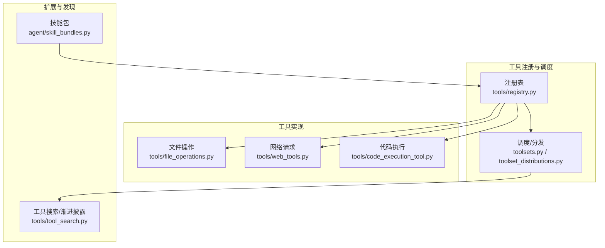
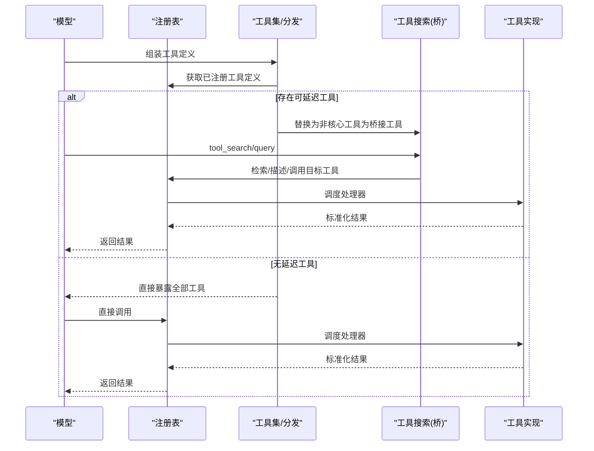
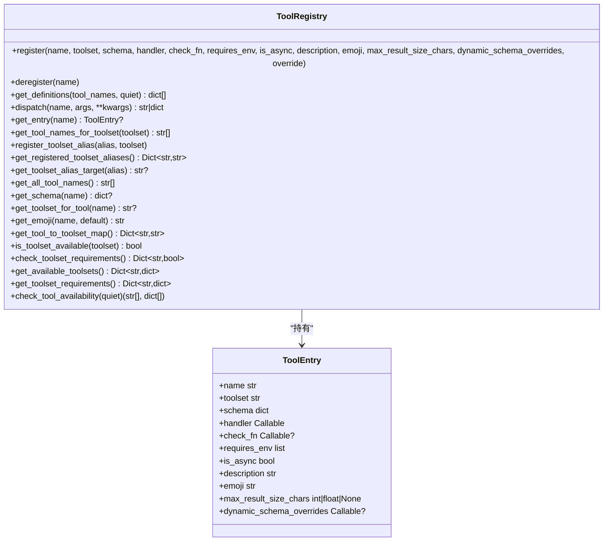
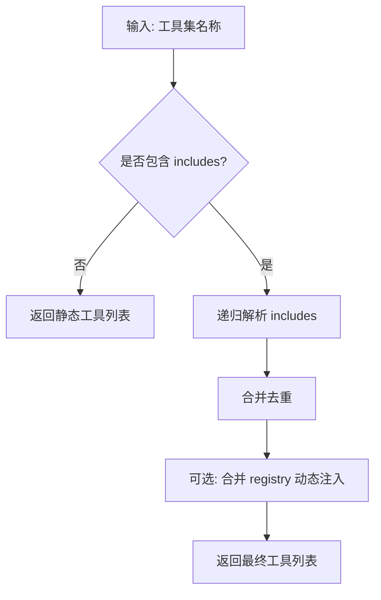
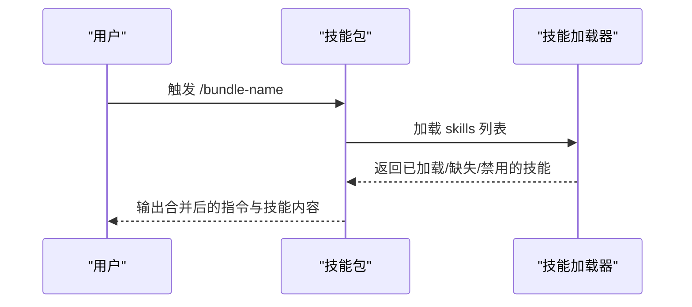
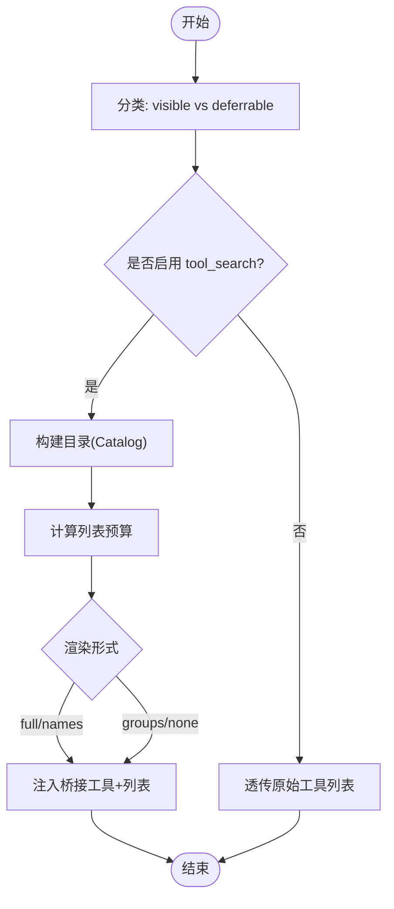
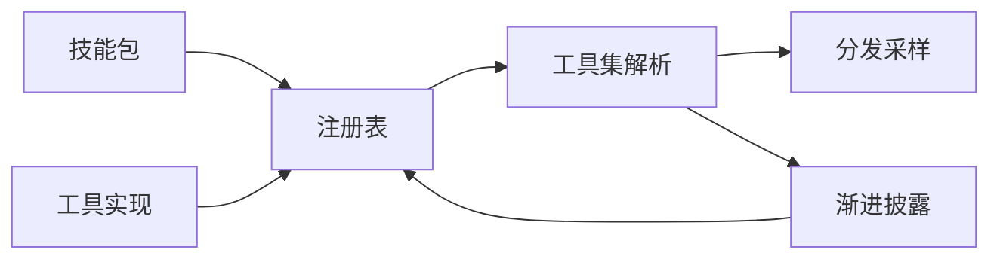

# 工具生态系统

<cite>
**本文引用的文件**
- [tools/registry.py](file://tools/registry.py)
- [toolsets.py](file://toolsets.py)
- [toolset_distributions.py](file://toolset_distributions.py)
- [agent/skill_bundles.py](file://agent/skill_bundles.py)
- [tools/tool_search.py](file://tools/tool_search.py)
- [tools/file_operations.py](file://tools/file_operations.py)
- [tools/web_tools.py](file://tools/web_tools.py)
- [tools/code_execution_tool.py](file://tools/code_execution_tool.py)
</cite>

## 目录
1. [简介](#简介)
2. [项目结构](#项目结构)
3. [核心组件](#核心组件)
4. [架构总览](#架构总览)
5. [详细组件分析](#详细组件分析)
6. [依赖关系分析](#依赖关系分析)
7. [性能考量](#性能考量)
8. [故障排查指南](#故障排查指南)
9. [结论](#结论)
10. [附录](#附录)

## 简介
本文件系统性梳理 Sparkii Agent 的工具生态系统，覆盖以下主题：
- 内置工具清单与能力概览（文件操作、代码执行、网络请求、数据库/平台集成等）
- 可扩展工具集系统：注册机制、参数校验、错误处理、结果缓存
- 工具集分发与管理：官方/社区/自定义安装更新思路
- 技能包（Skill Bundles）：将多个技能组合为完整解决方案
- 工具开发指南：接口规范、安全考虑、测试方法
- 工具搜索、发现与推荐机制的实现细节

## 项目结构
Sparkii 的工具生态围绕“注册表 + 工具集 + 分发 + 技能包 + 渐进式披露”的体系组织：
- 注册表：集中管理所有工具的元数据、处理器、可用性检查与调度
- 工具集：按场景或平台聚合工具集合，支持组合与别名
- 分发：基于概率分布对工具集进行采样，用于批量任务或工作流
- 技能包：通过 YAML 声明式组合多个技能，一键加载
- 渐进式披露（工具搜索）：在模型可见的工具列表中，按需延迟加载非核心工具，降低上下文开销

图表来源
- [tools/registry.py:414-955](file://tools/registry.py#L414-L955)
- [toolsets.py:103-641](file://toolsets.py#L103-L641)
- [toolset_distributions.py:29-214](file://toolset_distributions.py#L29-L214)
- [agent/skill_bundles.py:1-439](file://agent/skill_bundles.py#L1-L439)
- [tools/tool_search.py:1-800](file://tools/tool_search.py#L1-L800)

章节来源
- [tools/registry.py:414-955](file://tools/registry.py#L414-L955)
- [toolsets.py:103-641](file://toolsets.py#L103-L641)
- [toolset_distributions.py:29-214](file://toolset_distributions.py#L29-L214)
- [agent/skill_bundles.py:1-439](file://agent/skill_bundles.py#L1-L439)
- [tools/tool_search.py:1-800](file://tools/tool_search.py#L1-L800)

## 核心组件
- 工具注册表（ToolRegistry）
  - 维护工具名称到 ToolEntry 的映射，包含 schema、handler、check_fn、requires_env、is_async、描述、emoji、最大结果大小、动态 schema 覆盖等
  - 提供注册、注销、查询、调度、可用性与需求检查、工具集别名等能力
  - 对 check_fn 调用进行 TTL 缓存与瞬态失败宽容，避免外部状态抖动导致工具不可用
- 工具集（Toolsets）
  - 定义场景化/平台化的工具组合，支持 includes 组合与 registry 动态注入
  - 提供 get_toolset、resolve_toolset、bundle_non_core_tools 等解析能力
- 工具集分发（Distributions）
  - 以概率形式选择工具集，适用于批量生成、评测或工作流采样
- 技能包（Skill Bundles）
  - 通过 YAML 声明式组合多个技能，统一注入用户消息，支持禁用与缺失提示
- 工具搜索与渐进披露（Tool Search）
  - 将非核心工具替换为桥接工具（tool_search、tool_describe、tool_call），按需检索并加载具体工具，控制上下文预算

章节来源
- [tools/registry.py:201-955](file://tools/registry.py#L201-L955)
- [toolsets.py:103-800](file://toolsets.py#L103-L800)
- [toolset_distributions.py:29-359](file://toolset_distributions.py#L29-L359)
- [agent/skill_bundles.py:1-439](file://agent/skill_bundles.py#L1-L439)
- [tools/tool_search.py:1-800](file://tools/tool_search.py#L1-L800)

## 架构总览
下图展示从工具注册到调度的关键路径，以及渐进式披露如何影响模型可见的工具列表。

图表来源
- [tools/tool_search.py:772-800](file://tools/tool_search.py#L772-L800)
- [tools/registry.py:801-834](file://tools/registry.py#L801-L834)
- [toolsets.py:645-800](file://toolsets.py#L645-L800)

## 详细组件分析

### 工具注册表（ToolRegistry）
- 注册流程
  - 每个工具模块在导入时调用 registry.register(...) 声明 schema、处理器、可用性检查、环境变量要求、异步标记、描述、emoji、最大结果大小、动态 schema 覆盖等
  - 跨工具集覆盖受策略保护，插件需显式 opt-in 才能覆盖内置工具
- 可用性检查与缓存
  - check_fn 用于探测外部依赖（如 Docker、Playwright、浏览器二进制等）
  - 使用 TTL 缓存与“最近成功宽限期”，避免瞬时失败导致工具被误判为不可用
- 调度与结果规范化
  - dispatch 自动桥接异步处理器，捕获异常并以统一 error 格式返回
  - 结果会被规范化为字符串或多模态信封，防止下游无法处理的类型污染
- 工具集与别名
  - 支持工具集别名注册，便于 MCP 工具集或插件工具集的命名映射
  - 提供工具集可用性、需求、工具名映射等查询接口

图表来源
- [tools/registry.py:201-955](file://tools/registry.py#L201-L955)

章节来源
- [tools/registry.py:201-955](file://tools/registry.py#L201-L955)

### 工具集与分发（Toolsets & Distributions）
- 工具集定义
  - 内置工具集涵盖 Web、终端、文件、浏览器、TTS、计划与记忆、会话搜索、代码执行、委托、Home Assistant、看板、Discord、Spotify、Yuanbao、飞书文档/评论等
  - 支持 includes 组合，例如调试工具集包含 web 与 file；安全模式排除终端
  - 平台相关工具集（sparkii-*）复用核心工具集，并叠加平台专属工具
- 工具集解析
  - get_toolset 支持合并 registry 动态注入的工具
  - resolve_toolset 递归展开 includes，支持 all/* 别名
  - bundle_non_core_tools 计算平台包的非核心增量，便于禁用时仅移除平台特有工具
- 分发
  - 预置多种分布（default、image_gen、research、science、development、safe、balanced、minimal、terminal_only、terminal_web、creative、reasoning、browser_use、browser_only、browser_tasks、terminal_tasks、mixed_tasks）
  - 根据概率独立抽样工具集，保证至少一个工具集被选中

图表来源
- [toolsets.py:645-800](file://toolsets.py#L645-L800)
- [toolsets.py:103-641](file://toolsets.py#L103-L641)
- [toolset_distributions.py:241-282](file://toolset_distributions.py#L241-L282)

章节来源
- [toolsets.py:103-800](file://toolsets.py#L103-L800)
- [toolset_distributions.py:29-359](file://toolset_distributions.py#L29-L359)

### 技能包（Skill Bundles）
- 概念
  - 通过 YAML 文件将多个技能组合为一个斜杠命令，一次性加载多个技能的完整内容到单条用户消息中
- 存储与扫描
  - 位于 SPARKII_HOME/skill-bundles/*.yaml，支持环境变量覆盖目录
  - 扫描时按文件名 slug 规范化，冲突时保留首个（字母序）
- 构建与执行
  - build_bundle_invocation_message 负责加载技能、应用禁用策略、统计缺失/禁用项，并拼接头部说明与技能体
  - 支持额外指令与用户指令注入
- 生命周期
  - save_bundle/delete_bundle/list_bundles/reload_bundles 提供完整的 CRUD 与变更差异

图表来源
- [agent/skill_bundles.py:168-369](file://agent/skill_bundles.py#L168-L369)

章节来源
- [agent/skill_bundles.py:1-439](file://agent/skill_bundles.py#L1-L439)

### 工具搜索与渐进披露（Tool Search）
- 设计目标
  - 核心工具始终可见；MCP 与插件工具可延迟加载，减少上下文占用
  - 三层披露：全量列表 -> 仅名称列表 -> 服务器级摘要（当工具数量巨大时）
- 分类与装配
  - classify_tools 将工具分为 visible 与 deferrable
  - assemble_tool_defs 根据配置决定是否启用桥接工具，并生成 tool_search/describe/call 三件套
- 目录与检索
  - build_catalog 构建 CatalogEntry，包含 name、description、schema、source、source_name 及预分词 tokens
  - search_catalog 使用 BM25 评分，回退到子串匹配，确保常见查询有效
- 预算控制
  - listing_token_budget 基于 context_length 与 threshold_pct 限制嵌入列表的 token 数
  - 渲染降级策略：full -> names -> mixed/groups -> none

图表来源
- [tools/tool_search.py:230-312](file://tools/tool_search.py#L230-L312)
- [tools/tool_search.py:375-473](file://tools/tool_search.py#L375-L473)
- [tools/tool_search.py:512-626](file://tools/tool_search.py#L512-L626)
- [tools/tool_search.py:772-800](file://tools/tool_search.py#L772-L800)

章节来源
- [tools/tool_search.py:1-800](file://tools/tool_search.py#L1-L800)

### 典型工具实现要点

#### 文件操作（File Operations）
- 跨终端后端统一 API，底层通过 shell 命令封装
- 安全与健壮性
  - 写路径拒绝列表（敏感系统/凭据文件）
  - 行尾检测与归一化（CRLF/LF），BOM 处理
  - 读取时清理终端围栏与转义序列
- 结果对象
  - ReadResult/WriteResult 携带 content、truncated、verified、lint、lsp_diagnostics、error 等字段

章节来源
- [tools/file_operations.py:1-200](file://tools/file_operations.py#L1-L200)

#### 网络请求（Web Tools）
- 多后端兼容：Exa、Firecrawl、Parallel、Tavily、SearXNG、Brave-free、DDGS、xAI 等
- 后端选择与环境变量解析，支持托管网关与 OAuth
- 提取与压缩：智能摘要、Markdown 摘要以减少 token 使用
- 安全：URL 安全检查、敏感查询参数过滤

章节来源
- [tools/web_tools.py:1-200](file://tools/web_tools.py#L1-L200)

#### 代码执行（Code Execution）
- 程序化工具调用（PTC）：LLM 编写 Python 脚本，通过 UDS 或文件 RPC 调用工具
- 沙箱限制：仅允许有限工具（web_search、web_extract、read_file、write_file、search_files、patch、terminal）
- 资源限制：超时、最大工具调用次数、标准输出截断
- 环境隔离：严格的环境变量白名单与敏感信息清洗

章节来源
- [tools/code_execution_tool.py:1-200](file://tools/code_execution_tool.py#L1-L200)

## 依赖关系分析
- 注册表依赖
  - 工具模块在导入时自注册，避免循环依赖
  - 工具集解析可合并 registry 动态注入的工具
- 渐进披露依赖
  - 依赖注册表查询工具所属工具集（mcp-* 或 plugin）
  - 依赖工具集名称映射与别名解析
- 技能包依赖
  - 依赖技能加载器与禁用策略，支持平台维度禁用
- 工具实现依赖
  - 文件操作依赖终端后端与安全策略
  - 网络工具依赖提供商插件与配置层
  - 代码执行依赖进程管理与 RPC 传输

图表来源
- [tools/registry.py:414-955](file://tools/registry.py#L414-L955)
- [toolsets.py:645-800](file://toolsets.py#L645-L800)
- [tools/tool_search.py:230-312](file://tools/tool_search.py#L230-L312)
- [agent/skill_bundles.py:168-369](file://agent/skill_bundles.py#L168-L369)

章节来源
- [tools/registry.py:414-955](file://tools/registry.py#L414-L955)
- [toolsets.py:645-800](file://toolsets.py#L645-L800)
- [tools/tool_search.py:230-312](file://tools/tool_search.py#L230-L312)
- [agent/skill_bundles.py:168-369](file://agent/skill_bundles.py#L168-L369)

## 性能考量
- 注册表
  - check_fn 调用采用 TTL 缓存与瞬态失败宽限，减少重复探测开销
  - 工具定义生成时对动态 schema 覆盖进行异常保护，避免阻塞
- 渐进披露
  - 通过 chars/4 估算 token 成本，控制列表嵌入预算
  - 大工具集（如 Cloudflare 数千工具）自动降级为服务器级摘要，避免上下文爆炸
- 文件操作
  - 行尾/BOM 处理与终端围栏清理，减少噪声与错误
- 代码执行
  - 标准输出截断与元数据标注，避免过长输出影响上下文
- 网络工具
  - 多后端并行与重试策略（由插件层实现），本地缓存客户端实例

[本节为通用性能讨论，不直接分析具体文件]

## 故障排查指南
- 工具不可用
  - 检查 check_fn 是否因外部依赖未就绪而失败（Docker、Playwright、浏览器二进制等）
  - 查看注册表的 check_fn 缓存与最近成功时间，确认是否为瞬态失败
- 工具被意外屏蔽
  - 确认工具是否属于可延迟工具（MCP/plugin），是否在渐进披露中被替换为桥接工具
  - 检查工具集别名与 includes 组合是否正确
- 技能包加载失败
  - 检查 YAML 语法与必填字段（name、skills）
  - 确认技能未被全局或平台禁用
- 代码执行异常
  - 检查沙箱允许工具列表与环境变量白名单
  - 关注标准输出截断与错误日志

章节来源
- [tools/registry.py:233-384](file://tools/registry.py#L233-L384)
- [tools/tool_search.py:230-312](file://tools/tool_search.py#L230-L312)
- [agent/skill_bundles.py:116-165](file://agent/skill_bundles.py#L116-L165)
- [tools/code_execution_tool.py:60-79](file://tools/code_execution_tool.py#L60-L79)

## 结论
Sparkii Agent 的工具生态系统以注册表为核心，结合工具集、分发、技能包与渐进式披露，实现了高内聚、低耦合、可扩展且安全的工具管理能力。通过严格的可用性检查、结果规范化与上下文预算控制，系统在大规模工具场景下仍能保持高效与稳定。开发者可基于统一的注册接口与工具集机制快速扩展能力，并通过技能包与分发策略灵活组合解决方案。

[本节为总结性内容，不直接分析具体文件]

## 附录

### 内置工具清单与功能说明（节选）
以下为部分核心工具类别与代表性工具（完整列表请参考工具集定义与注册表）：
- 文件操作：read_file、write_file、patch、search_files
- 代码执行：execute_code、delegate_task
- 网络请求：web_search、web_extract
- 浏览器自动化：browser_navigate、browser_snapshot、browser_click、browser_type、browser_scroll、browser_back、browser_press、browser_get_images、browser_vision、browser_console、browser_cdp、browser_dialog
- 文本转语音：text_to_speech
- 视觉与图像生成：vision_analyze、image_generate
- 视频生成：bfl_flux3_* 系列工具
- 计划与记忆：todo、memory
- 会话搜索：session_search
- 澄清交互：clarify
- 定时任务：cronjob
- 智能家居：homeassistant（ha_list_entities、ha_get_state、ha_list_services、ha_call_service）
- 看板协作：kanban_* 系列工具
- 桌面 UI：read_terminal、close_terminal、open_preview、read_preview、focus_pane、react_to_message
- 平台集成：discord、spotify、yuanbao、feishu_doc、feishu_drive 等

章节来源
- [toolsets.py:31-88](file://toolsets.py#L31-L88)
- [toolsets.py:103-641](file://toolsets.py#L103-L641)

### 工具开发指南
- 接口规范
  - 在工具模块顶层调用 registry.register(...) 声明 schema、handler、check_fn、requires_env、is_async、description、emoji、max_result_size_chars、dynamic_schema_overrides、override
  - 处理器应返回 JSON 字符串或多模态信封，错误使用 tool_error，成功使用 tool_result
- 安全考虑
  - 使用 check_fn 探测外部依赖，避免在不可用环境下暴露工具
  - 文件写入遵循拒绝列表，网络请求进行 URL 安全检查
  - 代码执行沙箱限制工具与环境变量，防止越权
- 测试方法
  - 单元测试可 mock 注册表与工具处理器，验证 schema 与结果形状
  - 集成测试可模拟外部依赖（如 Docker、浏览器）并验证可用性检查
  - 针对渐进披露，验证 tool_search/describe/call 的行为与预算控制

章节来源
- [tools/registry.py:562-644](file://tools/registry.py#L562-L644)
- [tools/registry.py:974-1002](file://tools/registry.py#L974-L1002)
- [tools/file_operations.py:48-153](file://tools/file_operations.py#L48-L153)
- [tools/web_tools.py:121-200](file://tools/web_tools.py#L121-L200)
- [tools/code_execution_tool.py:60-79](file://tools/code_execution_tool.py#L60-L79)