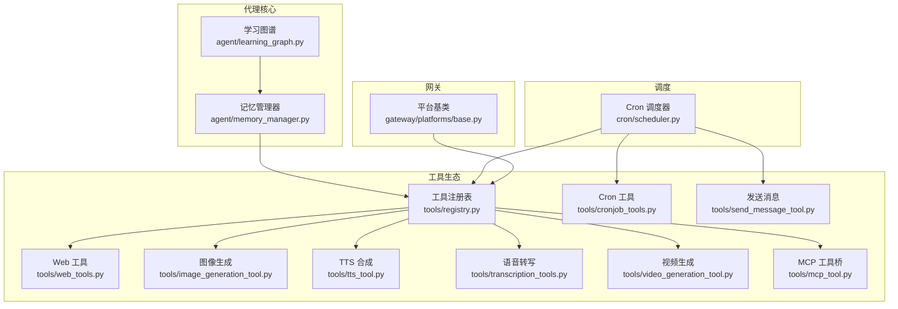
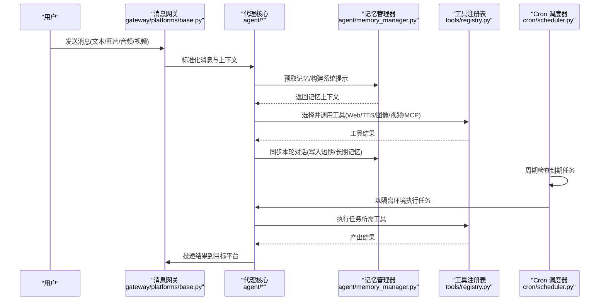
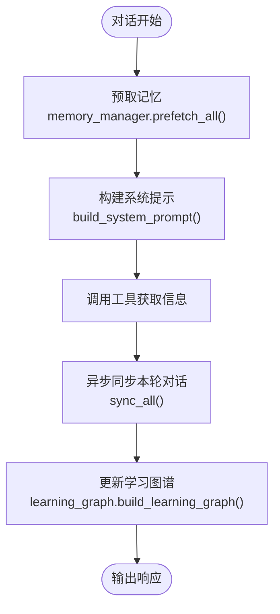
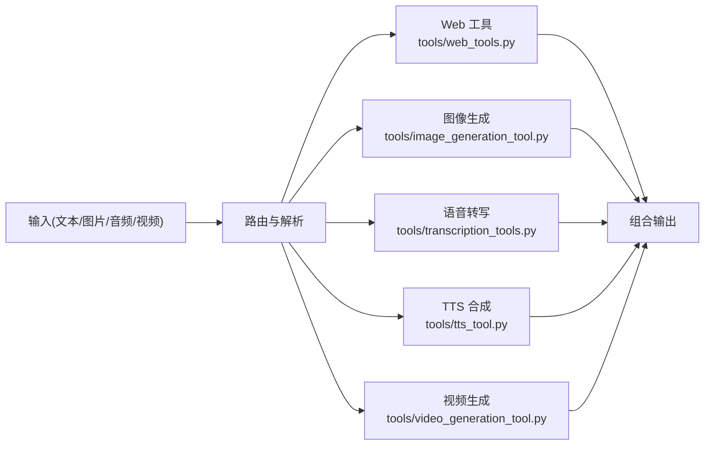
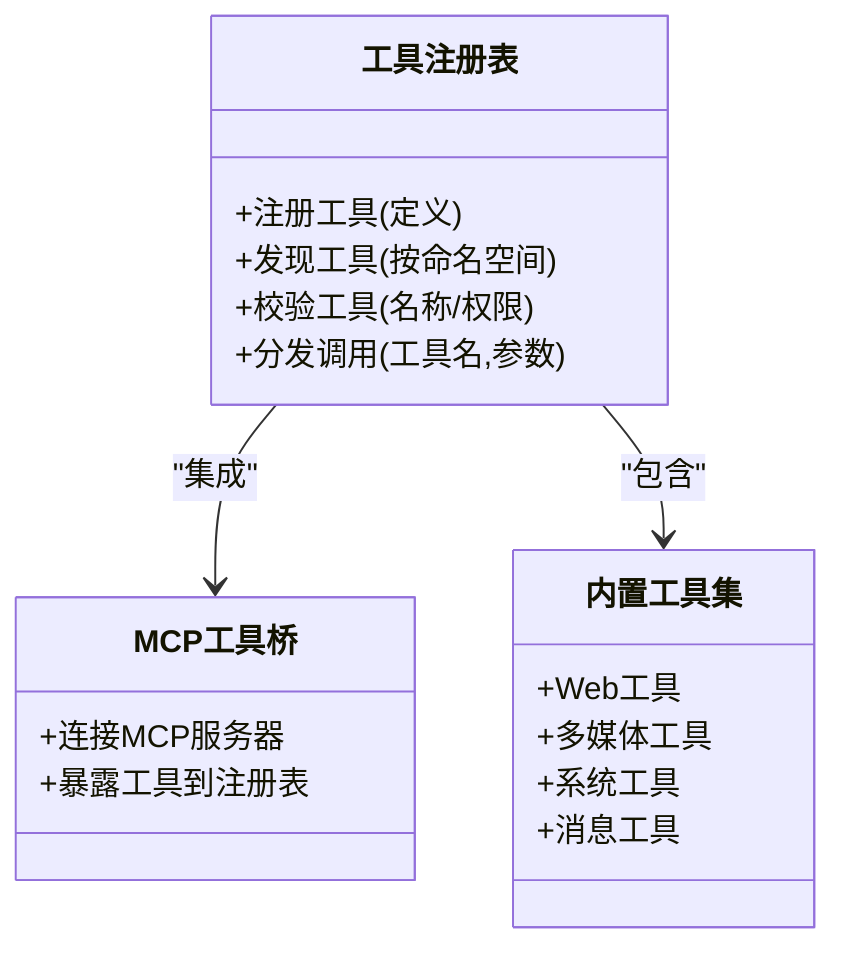
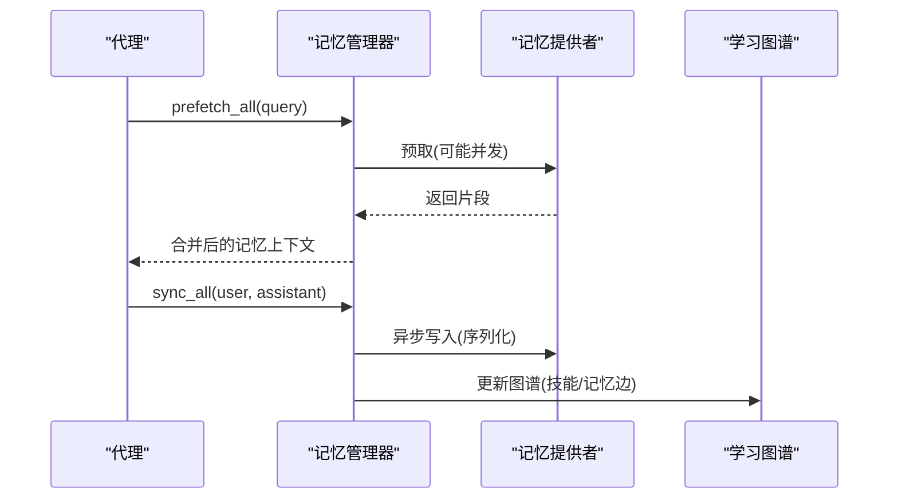
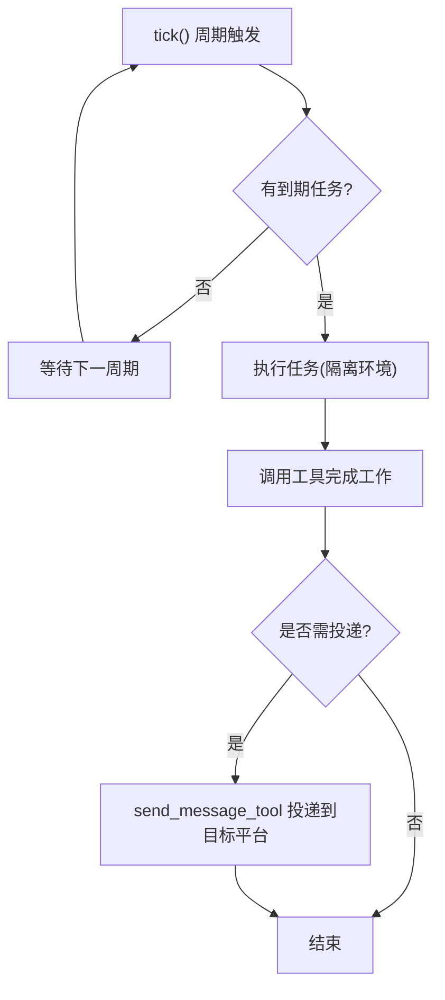
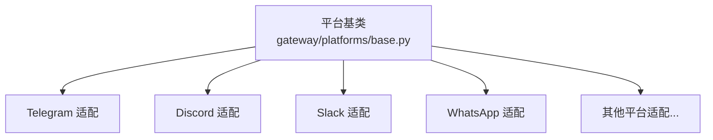
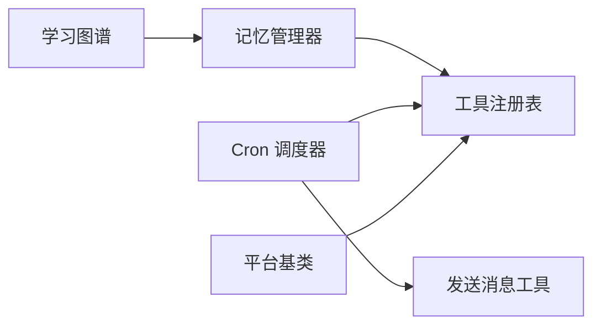

# 核心特性

<cite>
**本文引用的文件**
- [README.md](file://README.md)
- [agent/memory_manager.py](file://agent/memory_manager.py)
- [agent/learning_graph.py](file://agent/learning_graph.py)
- [cron/scheduler.py](file://cron/scheduler.py)
- [gateway/platforms/base.py](file://gateway/platforms/base.py)
- [tools/cronjob_tools.py](file://tools/cronjob_tools.py)
- [tools/send_message_tool.py](file://tools/send_message_tool.py)
- [tools/web_tools.py](file://tools/web_tools.py)
- [tools/image_generation_tool.py](file://tools/image_generation_tool.py)
- [tools/transcription_tools.py](file://tools/transcription_tools.py)
- [tools/tts_tool.py](file://tools/tts_tool.py)
- [tools/video_generation_tool.py](file://tools/video_generation_tool.py)
- [tools/mcp_tool.py](file://tools/mcp_tool.py)
- [tools/registry.py](file://tools/registry.py)
</cite>

## 目录
1. [简介](#简介)
2. [项目结构](#项目结构)
3. [核心组件](#核心组件)
4. [架构总览](#架构总览)
5. [详细组件分析](#详细组件分析)
6. [依赖关系分析](#依赖关系分析)
7. [性能考量](#性能考量)
8. [故障排查指南](#故障排查指南)
9. [结论](#结论)
10. [附录：使用示例与配置方法](#附录：使用示例与配置方法)

## 简介
Sparkii Agent 是一个具备“内置学习循环”的自改进 AI 代理。它能在对话中自动创建技能、在运行中优化自身能力，并通过长期记忆与用户画像构建持续进化；同时提供多模态处理（文本、图像、音频、视频）、强大的工具生态（40+ 内置工具与可扩展体系）、Cron 调度自动化以及跨平台消息网关（Telegram、Discord、Slack、WhatsApp 等）。本章节聚焦这些核心特性的整体概览与价值主张。

**章节来源**
- [README.md:19-31](file://README.md#L19-L31)

## 项目结构
从仓库布局看，Sparkii Agent 采用分层模块化设计：
- agent：代理核心逻辑（记忆编排、学习图谱、会话上下文、工具执行桥接等）
- cron：定时任务调度与执行
- gateway：多平台消息网关与平台适配层
- tools：工具集与扩展点（含 MCP、Web、媒体生成、TTS、语音转写等）
- sparkii_cli：命令行入口与配置管理
- plugins：插件化能力（模型提供商、平台、记忆、MCP 等）

**图示来源**
- [agent/memory_manager.py:364-503](file://agent/memory_manager.py#L364-L503)
- [agent/learning_graph.py:254-323](file://agent/learning_graph.py#L254-L323)
- [cron/scheduler.py:1-10](file://cron/scheduler.py#L1-L10)
- [gateway/platforms/base.py:1-200](file://gateway/platforms/base.py#L1-L200)
- [tools/registry.py:1-200](file://tools/registry.py#L1-L200)

**章节来源**
- [README.md:19-31](file://README.md#L19-L31)

## 核心组件
- 记忆系统：统一编排内置与外部记忆提供者，支持预取、同步、流式清理与工具注入。
- 学习图谱：将“已学技能”和“记忆片段”组织为可查询的知识图，辅助可视化与检索。
- Cron 调度：周期检查到期任务，隔离执行环境，安全投递结果到各平台。
- 多平台网关：通过平台基类抽象不同消息平台的接入与消息格式转换。
- 工具生态：集中注册与分发，覆盖 Web、多媒体、TTS、语音转写、MCP 等。

**章节来源**
- [agent/memory_manager.py:364-503](file://agent/memory_manager.py#L364-L503)
- [agent/learning_graph.py:254-323](file://agent/learning_graph.py#L254-L323)
- [cron/scheduler.py:1-10](file://cron/scheduler.py#L1-L10)
- [gateway/platforms/base.py:1-200](file://gateway/platforms/base.py#L1-L200)
- [tools/registry.py:1-200](file://tools/registry.py#L1-L200)

## 架构总览
下图展示了从消息输入到工具执行、记忆更新、学习图谱演进与定时任务调度的端到端流程。

**图示来源**
- [gateway/platforms/base.py:1-200](file://gateway/platforms/base.py#L1-L200)
- [agent/memory_manager.py:525-694](file://agent/memory_manager.py#L525-L694)
- [tools/registry.py:1-200](file://tools/registry.py#L1-L200)
- [cron/scheduler.py:1-10](file://cron/scheduler.py#L1-L10)

## 详细组件分析

### 自改进学习循环与技能自动创建
- 学习图谱聚合“已学技能”和“记忆卡片”，基于相关技能声明与词法重叠建立边，形成知识网络。
- 记忆管理器在每轮对话后异步同步内容，避免阻塞主流程；对外部提供者设置超时与后台队列，保证稳定性。
- 学习面板展示节点密度、类别分布、记忆与技能的关联，便于观察“学到了什么”。

**图示来源**
- [agent/memory_manager.py:525-694](file://agent/memory_manager.py#L525-L694)
- [agent/learning_graph.py:254-323](file://agent/learning_graph.py#L254-L323)

**章节来源**
- [agent/memory_manager.py:364-503](file://agent/memory_manager.py#L364-L503)
- [agent/learning_graph.py:254-323](file://agent/learning_graph.py#L254-L323)

### 多模态处理能力（文本、图像、音频、视频）
- 文本：通过 Web 搜索与网页抓取工具进行信息检索与摘要。
- 图像：图像生成工具支持文生图，结合视觉工具进行理解。
- 音频：语音转写工具将语音转为文本；TTS 工具将文本转为语音。
- 视频：视频生成工具根据描述生成短视频。

**图示来源**
- [tools/web_tools.py:1-200](file://tools/web_tools.py#L1-L200)
- [tools/image_generation_tool.py:1-200](file://tools/image_generation_tool.py#L1-L200)
- [tools/transcription_tools.py:1-200](file://tools/transcription_tools.py#L1-L200)
- [tools/tts_tool.py:1-200](file://tools/tts_tool.py#L1-L200)
- [tools/video_generation_tool.py:1-200](file://tools/video_generation_tool.py#L1-L200)

**章节来源**
- [tools/web_tools.py:1-200](file://tools/web_tools.py#L1-L200)
- [tools/image_generation_tool.py:1-200](file://tools/image_generation_tool.py#L1-L200)
- [tools/transcription_tools.py:1-200](file://tools/transcription_tools.py#L1-L200)
- [tools/tts_tool.py:1-200](file://tools/tts_tool.py#L1-L200)
- [tools/video_generation_tool.py:1-200](file://tools/video_generation_tool.py#L1-L200)

### 强大的工具生态系统（40+ 内置工具与可扩展体系）
- 工具注册表统一管理工具定义与分发，确保名称冲突与权限控制。
- 支持 MCP（Model Context Protocol）工具桥接，扩展第三方能力。
- 内置工具覆盖 Web、文件、终端、代码执行、看板、消息、TTS、音视频生成等。

**图示来源**
- [tools/registry.py:1-200](file://tools/registry.py#L1-L200)
- [tools/mcp_tool.py:1-200](file://tools/mcp_tool.py#L1-L200)

**章节来源**
- [tools/registry.py:1-200](file://tools/registry.py#L1-L200)
- [tools/mcp_tool.py:1-200](file://tools/mcp_tool.py#L1-L200)

### 记忆系统设计（短期/长期记忆、用户画像、语义索引）
- 记忆管理器协调多个提供者，支持预取与异步同步，避免阻塞。
- 学习图谱将 MEMORY.md / USER.md 的内容切分为“记忆卡片”，并与技能建立关联。
- 流式清理器确保内部记忆上下文不会泄露到 UI。

**图示来源**
- [agent/memory_manager.py:525-694](file://agent/memory_manager.py#L525-L694)
- [agent/learning_graph.py:193-245](file://agent/learning_graph.py#L193-L245)

**章节来源**
- [agent/memory_manager.py:364-503](file://agent/memory_manager.py#L364-L503)
- [agent/learning_graph.py:193-245](file://agent/learning_graph.py#L193-L245)

### 调度自动化（Cron 调度器、定时任务、跨平台投递）
- Cron 调度器周期性检查到期任务，使用线程池并行执行，隔离工作目录与环境变量。
- 支持静默标记、失败摘要、镜像投递到原会话，以及多种平台的目标地址映射。
- 通过工具创建与管理任务，限制敏感工具集，保障安全。

**图示来源**
- [cron/scheduler.py:1-10](file://cron/scheduler.py#L1-L10)
- [tools/cronjob_tools.py:1-200](file://tools/cronjob_tools.py#L1-L200)
- [tools/send_message_tool.py:1-200](file://tools/send_message_tool.py#L1-L200)

**章节来源**
- [cron/scheduler.py:1-10](file://cron/scheduler.py#L1-L10)
- [tools/cronjob_tools.py:1-200](file://tools/cronjob_tools.py#L1-L200)
- [tools/send_message_tool.py:1-200](file://tools/send_message_tool.py#L1-L200)

### 多平台网关支持（Telegram、Discord、Slack、WhatsApp 等）
- 平台基类抽象消息收发、富文本渲染、速率限制与错误处理。
- 具体平台实现负责协议适配、认证与消息格式转换。
- 支持通过环境变量或配置指定“家频道/邮箱”作为默认投递目标。

**图示来源**
- [gateway/platforms/base.py:1-200](file://gateway/platforms/base.py#L1-L200)

**章节来源**
- [gateway/platforms/base.py:1-200](file://gateway/platforms/base.py#L1-L200)

## 依赖关系分析
- 记忆管理器依赖工具注册表以注入记忆相关工具，并在每轮对话后异步同步。
- Cron 调度器依赖工具注册表执行任务，并通过发送消息工具投递结果。
- 平台基类与工具注册表解耦，使网关能专注于消息协议适配。
- 学习图谱读取本地记忆文件与技能元数据，不直接依赖运行时工具。

**图示来源**
- [agent/memory_manager.py:364-503](file://agent/memory_manager.py#L364-L503)
- [cron/scheduler.py:1-10](file://cron/scheduler.py#L1-L10)
- [gateway/platforms/base.py:1-200](file://gateway/platforms/base.py#L1-L200)
- [tools/registry.py:1-200](file://tools/registry.py#L1-L200)
- [tools/send_message_tool.py:1-200](file://tools/send_message_tool.py#L1-L200)
- [agent/learning_graph.py:254-323](file://agent/learning_graph.py#L254-L323)

**章节来源**
- [agent/memory_manager.py:364-503](file://agent/memory_manager.py#L364-L503)
- [cron/scheduler.py:1-10](file://cron/scheduler.py#L1-L10)
- [gateway/platforms/base.py:1-200](file://gateway/platforms/base.py#L1-L200)
- [tools/registry.py:1-200](file://tools/registry.py#L1-L200)
- [tools/send_message_tool.py:1-200](file://tools/send_message_tool.py#L1-L200)
- [agent/learning_graph.py:254-323](file://agent/learning_graph.py#L254-L323)

## 性能考量
- 记忆预取与同步采用后台线程与单工作线程序列化，避免阻塞主对话路径。
- Cron 任务使用并行与顺序双池，保证高吞吐的同时维护环境变量一致性。
- 流式记忆上下文清理防止内存泄漏与 UI 污染。
- 工具注册表与平台适配层解耦，降低耦合度与扩展成本。

[本节为通用指导，无需特定文件引用]

## 故障排查指南
- 记忆提供者超时：外部提供者预取超时将被跳过并记录日志，检查网络与凭据。
- Cron 任务中断：进程关闭时强制终止工具子进程，任务状态会被标记为中断，避免误报成功。
- 工具名称冲突：核心工具名称保留，外部提供者不得覆盖，否则被拒绝并记录警告。
- 平台投递失败：检查目标平台配置与环境变量，确认家频道/邮箱设置正确。

**章节来源**
- [agent/memory_manager.py:547-595](file://agent/memory_manager.py#L547-L595)
- [cron/scheduler.py:397-461](file://cron/scheduler.py#L397-L461)
- [agent/memory_manager.py:430-465](file://agent/memory_manager.py#L430-L465)

## 结论
Sparkii Agent 通过记忆系统、学习图谱、工具生态、Cron 调度与多平台网关，构建了“自改进”的闭环能力。它在保持高性能与稳定性的同时，提供了丰富的扩展点与跨平台集成，适合个人与团队在不同场景下部署与定制。

[本节为总结性内容，无需特定文件引用]

## 附录：使用示例与配置方法
- 启动聊天与网关
  - CLI：sparkii
  - 网关：sparkii gateway setup + sparkii gateway start
  - 参考：[README.md:107-118](file://README.md#L107-L118)

- 切换模型与工具
  - 模型：sparkii model
  - 工具：sparkii tools
  - 参考：[README.md:107-118](file://README.md#L107-L118)

- 记忆与学习
  - 记忆预取与同步由代理自动完成；可通过配置启用/禁用 memory 工具集。
  - 学习图谱用于可视化“已学技能”与“记忆卡片”的关系。
  - 参考：[agent/memory_manager.py:83-107](file://agent/memory_manager.py#L83-L107)、[agent/learning_graph.py:254-323](file://agent/learning_graph.py#L254-L323)

- Cron 任务
  - 使用 cronjob 工具创建/管理任务；支持 deliver=all 或指定平台与频道。
  - 参考：[tools/cronjob_tools.py:1-200](file://tools/cronjob_tools.py#L1-L200)、[cron/scheduler.py:255-283](file://cron/scheduler.py#L255-L283)

- 多平台网关
  - 通过平台基类与具体适配接入 Telegram、Discord、Slack、WhatsApp 等。
  - 参考：[gateway/platforms/base.py:1-200](file://gateway/platforms/base.py#L1-L200)

- 多模态工具
  - Web 搜索与抓取：tools/web_tools.py
  - 图像生成：tools/image_generation_tool.py
  - 语音转写：tools/transcription_tools.py
  - TTS 合成：tools/tts_tool.py
  - 视频生成：tools/video_generation_tool.py
  - 参考对应文件路径

[本节为操作指引，引用具体文件路径以便进一步查阅]