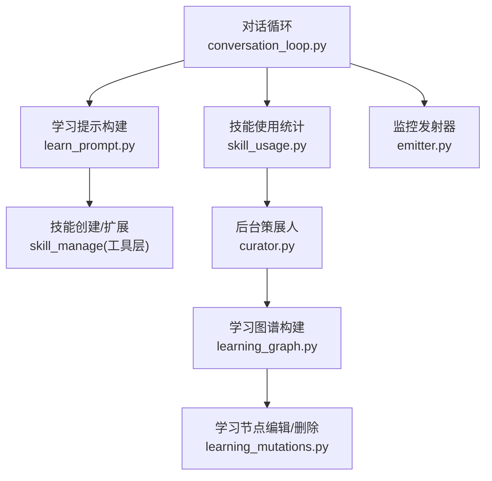
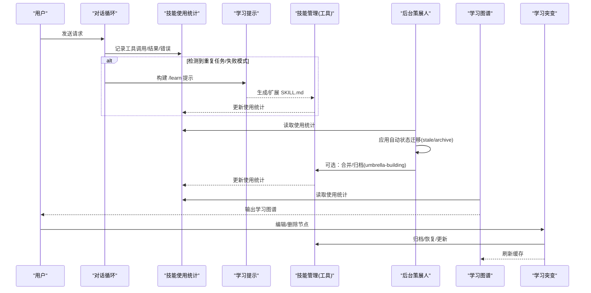
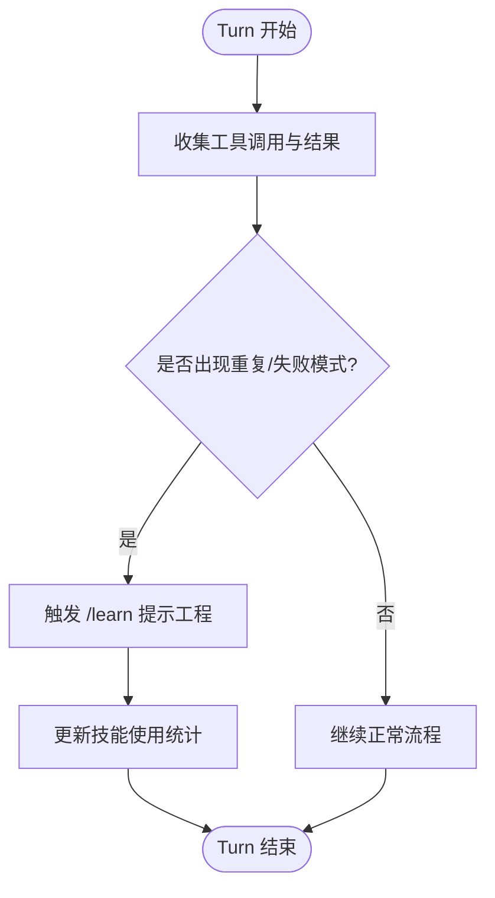
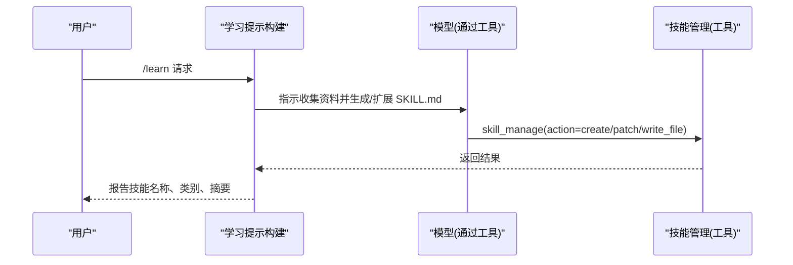
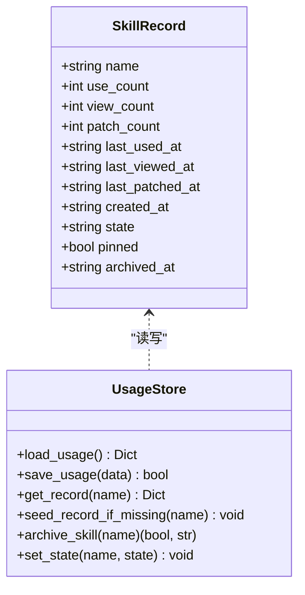
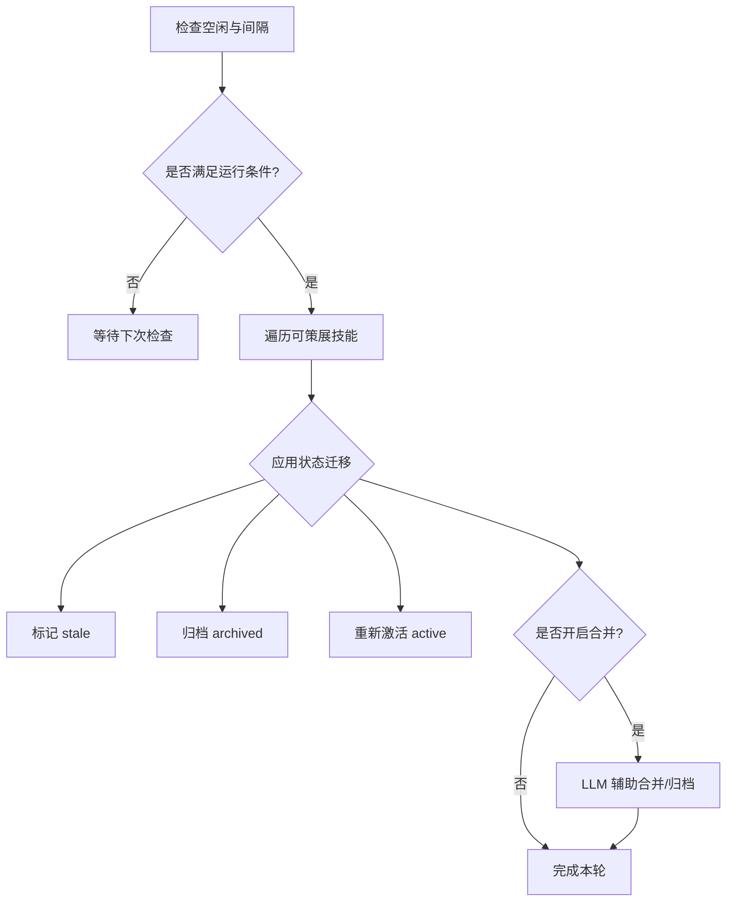
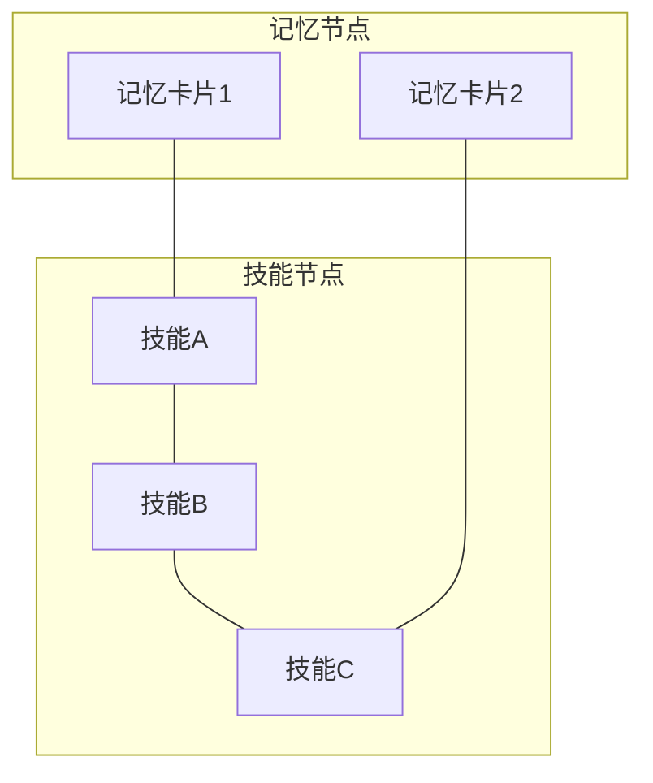
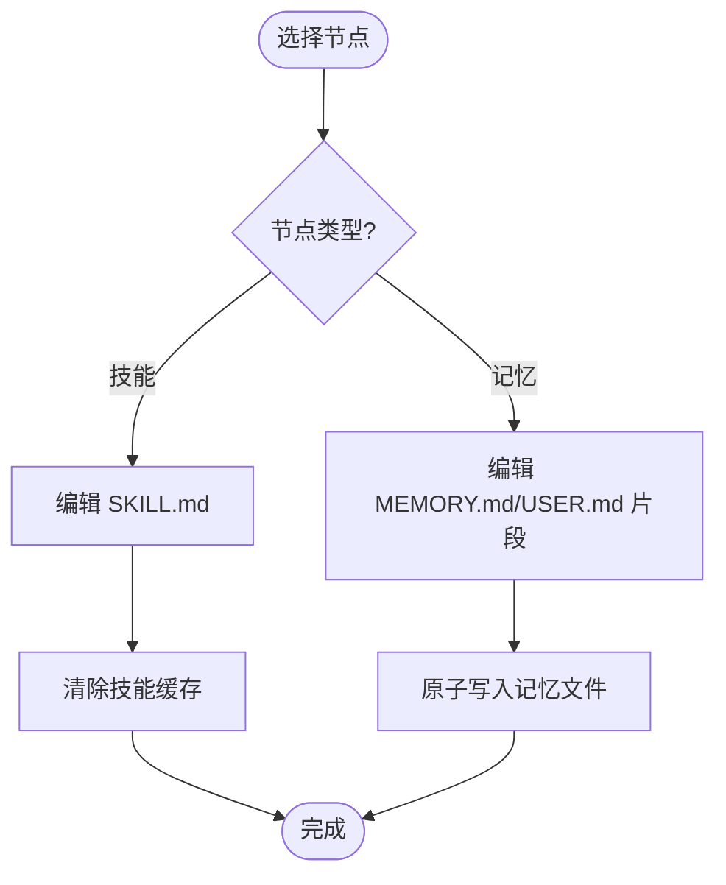
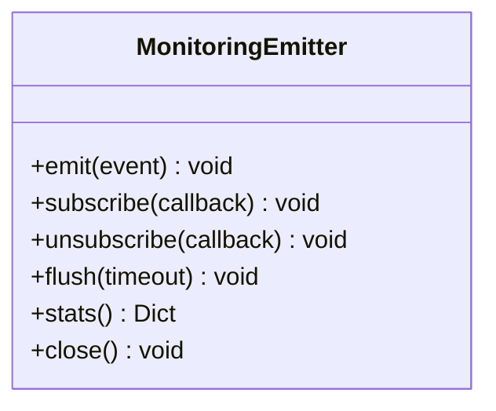
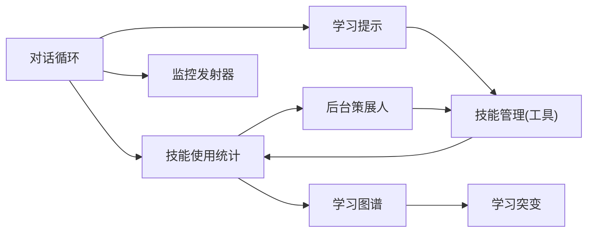

# 学习循环机制

<cite>
**本文引用的文件**
- [agent/conversation_loop.py](file://agent/conversation_loop.py)
- [agent/learn_prompt.py](file://agent/learn_prompt.py)
- [agent/learning_graph.py](file://agent/learning_graph.py)
- [agent/learning_mutations.py](file://agent/learning_mutations.py)
- [agent/curator.py](file://agent/curator.py)
- [tools/skill_usage.py](file://tools/skill_usage.py)
- [agent/monitoring/emitter.py](file://agent/monitoring/emitter.py)
</cite>

## 目录
1. [简介](#简介)
2. [项目结构](#项目结构)
3. [核心组件](#核心组件)
4. [架构总览](#架构总览)
5. [详细组件分析](#详细组件分析)
6. [依赖关系分析](#依赖关系分析)
7. [性能考量](#性能考量)
8. [故障排除指南](#故障排除指南)
9. [结论](#结论)
10. [附录：配置与调优](#附录：配置与调优)

## 简介
本文件系统性阐述 Hermes Agent 的“学习循环”机制，覆盖以下目标：
- 对话循环如何自动识别用户交互模式（意图提取、行为分析、技能需求检测）
- 学习触发条件（重复任务识别、成功模式检测、失败模式分析）
- 学习突变系统（技能变更的原子操作、版本控制与回滚机制）
- 学习提示工程（从对话历史中提取可重用知识片段）
- 配置参数与调优选项（优化学习算法的性能与准确性）
- 故障排除与监控指标说明

## 项目结构
围绕学习循环的关键模块分布如下：
- 对话循环与运行时编排：conversation_loop.py
- 学习提示构建：learn_prompt.py
- 学习可视化图与记忆关联：learning_graph.py
- 学习节点编辑/删除（突变入口）：learning_mutations.py
- 后台技能生命周期管理（学习触发与聚合）：curator.py
- 技能使用遥测与状态机：skill_usage.py
- 监控事件发射器（非阻塞指标通道）：emitter.py

图表来源
- [agent/conversation_loop.py:1-120](file://agent/conversation_loop.py#L1-L120)
- [agent/learn_prompt.py:165-238](file://agent/learn_prompt.py#L165-L238)
- [tools/skill_usage.py:1-100](file://tools/skill_usage.py#L1-L100)
- [agent/curator.py:1-120](file://agent/curator.py#L1-L120)
- [agent/learning_graph.py:254-323](file://agent/learning_graph.py#L254-L323)
- [agent/learning_mutations.py:1-120](file://agent/learning_mutations.py#L1-L120)
- [agent/monitoring/emitter.py:1-80](file://agent/monitoring/emitter.py#L1-L80)

章节来源
- [agent/conversation_loop.py:1-120](file://agent/conversation_loop.py#L1-L120)
- [agent/learn_prompt.py:165-238](file://agent/learn_prompt.py#L165-L238)
- [tools/skill_usage.py:1-100](file://tools/skill_usage.py#L1-L100)
- [agent/curator.py:1-120](file://agent/curator.py#L1-L120)
- [agent/learning_graph.py:254-323](file://agent/learning_graph.py#L254-L323)
- [agent/learning_mutations.py:1-120](file://agent/learning_mutations.py#L1-L120)
- [agent/monitoring/emitter.py:1-80](file://agent/monitoring/emitter.py#L1-L80)

## 核心组件
- 对话循环：驱动一次用户请求的完整处理流程，包含上下文压缩、重试、工具调度、最终化等。它在学习循环中扮演“信号源”角色，记录工具调用、结果与错误，为后续学习触发提供数据基础。
- 学习提示工程：将用户的“/learn”请求转化为结构化指令，指导模型收集资料并生成或扩展 SKILL.md，遵循严格的作者规范与安全卫生规则。
- 技能使用统计：以侧车 JSON 文件持久化每个技能的用量、时间戳、状态（active/stale/archived/pinned），并提供原子写入与锁保护。
- 后台策展人：周期性检查空闲时间与上次运行间隔，执行确定性状态迁移（stale/archive）并可触发 LLM 辅助的合并/归档（umbrella-building）。
- 学习图谱：将“已学习技能”和“记忆卡片”组织为图，支持可视化与语义边（基于词法重叠）连接。
- 学习突变：对“技能”和“记忆”节点进行编辑/删除的原子操作，支持归档恢复与缓存清理。
- 监控发射器：非阻塞的事件队列与分发线程，用于观测学习循环关键指标（如技能变更、状态迁移、错误率）。

章节来源
- [agent/conversation_loop.py:1-120](file://agent/conversation_loop.py#L1-L120)
- [agent/learn_prompt.py:165-238](file://agent/learn_prompt.py#L165-L238)
- [tools/skill_usage.py:1-100](file://tools/skill_usage.py#L1-L100)
- [agent/curator.py:1-120](file://agent/curator.py#L1-L120)
- [agent/learning_graph.py:254-323](file://agent/learning_graph.py#L254-L323)
- [agent/learning_mutations.py:1-120](file://agent/learning_mutations.py#L1-L120)
- [agent/monitoring/emitter.py:1-80](file://agent/monitoring/emitter.py#L1-L80)

## 架构总览
学习循环由“在线对话循环 + 后台策展人 + 技能使用统计 + 学习图谱 + 学习突变”构成闭环：
- 在线路径：对话循环捕获工具调用与结果，更新技能使用统计；当检测到重复任务或失败模式时，可通过 /learn 触发学习提示工程，生成或扩展技能。
- 后台路径：策展人根据使用统计的时间戳与阈值，自动标记 stale 或 archive，并在开启合并模式时执行 LLM 辅助的 umbrella-building。
- 可视化与干预：学习图谱展示已学习技能与记忆的关联；学习突变允许用户对节点进行编辑/删除，并支持归档恢复。

图表来源
- [agent/conversation_loop.py:1-120](file://agent/conversation_loop.py#L1-L120)
- [agent/learn_prompt.py:165-238](file://agent/learn_prompt.py#L165-L238)
- [tools/skill_usage.py:662-705](file://tools/skill_usage.py#L662-L705)
- [agent/curator.py:305-383](file://agent/curator.py#L305-L383)
- [agent/learning_graph.py:254-323](file://agent/learning_graph.py#L254-L323)
- [agent/learning_mutations.py:124-186](file://agent/learning_mutations.py#L124-L186)

## 详细组件分析

### 对话循环中的学习信号采集
- 意图提取与行为分析：对话循环在每次 turn 中记录工具调用、参数、结果与错误，结合上下文压缩与重试策略，形成稳定的行为轨迹。这些轨迹是识别重复任务与失败模式的依据。
- 技能需求检测：当同一工具序列频繁出现或某类错误反复发生，循环可将该模式抽象为“需要技能”的信号，并通过 /learn 提示工程引导模型生成或扩展相应技能。

图表来源
- [agent/conversation_loop.py:1-120](file://agent/conversation_loop.py#L1-L120)
- [tools/skill_usage.py:662-705](file://tools/skill_usage.py#L662-L705)

章节来源
- [agent/conversation_loop.py:1-120](file://agent/conversation_loop.py#L1-L120)

### 学习提示工程（/learn）
- 输入：用户的自由文本请求（可能包含路径、URL、对话历史引用、粘贴笔记等）
- 处理：构建标准化提示，要求模型按 Hermes 技能作者规范生成或扩展 SKILL.md；对于大型语料采用“知识库布局”（索引+按需加载 references/）
- 安全：内置“来源卫生”规则，过滤不可信注入字符，避免将外部文档指令混入技能内容

图表来源
- [agent/learn_prompt.py:165-238](file://agent/learn_prompt.py#L165-L238)

章节来源
- [agent/learn_prompt.py:165-238](file://agent/learn_prompt.py#L165-L238)

### 技能使用统计与生命周期
- 侧车 JSON：~/.sparkii/skills/.usage.json，键为技能名，值为使用计数、时间戳、状态、是否 pinned 等
- 原子写入：使用临时文件 + os.replace，保证并发安全
- 生命周期状态：active -> stale -> archived；pinned 跳过自动迁移
- 受保护内置技能：某些内置技能（如 plan）永远不被归档或合并

图表来源
- [tools/skill_usage.py:644-705](file://tools/skill_usage.py#L644-L705)
- [tools/skill_usage.py:743-771](file://tools/skill_usage.py#L743-L771)

章节来源
- [tools/skill_usage.py:1-100](file://tools/skill_usage.py#L1-L100)
- [tools/skill_usage.py:644-705](file://tools/skill_usage.py#L644-L705)
- [tools/skill_usage.py:743-771](file://tools/skill_usage.py#L743-L771)

### 后台策展人（学习触发与聚合）
- 触发条件：空闲时间达到阈值且距离上次运行超过 interval_hours；首次运行延迟一个周期以避免误触发
- 自动迁移：根据 last_activity_at 或 created_at 计算 stale/archive 阈值，标记或归档技能；cron 引用技能受保护
- 合并模式：可选 LLM 辅助的 umbrella-building，将重叠技能合并为类级技能，归档子技能或降级为 references/templates/scripts

图表来源
- [agent/curator.py:233-283](file://agent/curator.py#L233-L283)
- [agent/curator.py:305-383](file://agent/curator.py#L305-L383)
- [agent/curator.py:417-570](file://agent/curator.py#L417-L570)

章节来源
- [agent/curator.py:233-283](file://agent/curator.py#L233-L283)
- [agent/curator.py:305-383](file://agent/curator.py#L305-L383)
- [agent/curator.py:417-570](file://agent/curator.py#L417-L570)

### 学习图谱（可视化与记忆关联）
- 节点：已学习技能（非 base 安装且有 agent 创建或使用信号）、记忆卡片（MEMORY.md/USER.md 分段）
- 边：技能间 related_skills；记忆与技能基于词法重叠建立边
- 输出：节点列表、边列表、聚类统计、内存节点数量、学习技能数量等

图表来源
- [agent/learning_graph.py:125-168](file://agent/learning_graph.py#L125-L168)
- [agent/learning_graph.py:193-245](file://agent/learning_graph.py#L193-L245)
- [agent/learning_graph.py:254-323](file://agent/learning_graph.py#L254-L323)

章节来源
- [agent/learning_graph.py:125-168](file://agent/learning_graph.py#L125-L168)
- [agent/learning_graph.py:193-245](file://agent/learning_graph.py#L193-L245)
- [agent/learning_graph.py:254-323](file://agent/learning_graph.py#L254-L323)

### 学习突变（编辑/删除/归档/恢复）
- 节点类型：技能（name）、记忆（memory:<source>:<index>）
- 编辑：原子写入，清空技能缓存以确保一致性
- 删除：技能归档（可恢复），记忆重写文件
- 恢复：通过 curator restore 命令恢复归档技能

图表来源
- [agent/learning_mutations.py:86-118](file://agent/learning_mutations.py#L86-L118)
- [agent/learning_mutations.py:124-186](file://agent/learning_mutations.py#L124-L186)
- [agent/learning_mutations.py:192-207](file://agent/learning_mutations.py#L192-L207)

章节来源
- [agent/learning_mutations.py:86-118](file://agent/learning_mutations.py#L86-L118)
- [agent/learning_mutations.py:124-186](file://agent/learning_mutations.py#L124-L186)
- [agent/learning_mutations.py:192-207](file://agent/learning_mutations.py#L192-L207)

### 监控指标与可观测性
- 发射器：非阻塞队列 + 后台分发线程，emit() 微秒级返回，永不阻塞主路径
- 指标：队列长度、已分发数、丢弃数、订阅者数量
- 用途：观测学习循环关键事件（技能变更、状态迁移、错误率），便于性能分析与故障定位

图表来源
- [agent/monitoring/emitter.py:36-158](file://agent/monitoring/emitter.py#L36-L158)

章节来源
- [agent/monitoring/emitter.py:1-80](file://agent/monitoring/emitter.py#L1-L80)
- [agent/monitoring/emitter.py:36-158](file://agent/monitoring/emitter.py#L36-L158)

## 依赖关系分析
- 对话循环依赖工具调度与上下文压缩，间接影响学习信号的准确性
- 学习提示工程依赖技能作者规范与安全规则，确保生成的技能可被系统正确路由与加载
- 技能使用统计是策展人与图谱的共同数据源，其原子性与一致性至关重要
- 策展人依赖使用统计的时间戳与阈值，决定自动化维护策略
- 学习图谱依赖技能元数据与记忆文件，提供可视化与语义关联
- 学习突变依赖技能管理与记忆存储，确保变更的原子性与可恢复性
- 监控发射器独立于业务逻辑，提供非阻塞的可观测性

图表来源
- [agent/conversation_loop.py:1-120](file://agent/conversation_loop.py#L1-L120)
- [agent/learn_prompt.py:165-238](file://agent/learn_prompt.py#L165-L238)
- [tools/skill_usage.py:662-705](file://tools/skill_usage.py#L662-L705)
- [agent/curator.py:305-383](file://agent/curator.py#L305-L383)
- [agent/learning_graph.py:254-323](file://agent/learning_graph.py#L254-L323)
- [agent/learning_mutations.py:124-186](file://agent/learning_mutations.py#L124-L186)
- [agent/monitoring/emitter.py:36-158](file://agent/monitoring/emitter.py#L36-L158)

章节来源
- [agent/conversation_loop.py:1-120](file://agent/conversation_loop.py#L1-L120)
- [agent/learn_prompt.py:165-238](file://agent/learn_prompt.py#L165-L238)
- [tools/skill_usage.py:662-705](file://tools/skill_usage.py#L662-L705)
- [agent/curator.py:305-383](file://agent/curator.py#L305-L383)
- [agent/learning_graph.py:254-323](file://agent/learning_graph.py#L254-L323)
- [agent/learning_mutations.py:124-186](file://agent/learning_mutations.py#L124-L186)
- [agent/monitoring/emitter.py:36-158](file://agent/monitoring/emitter.py#L36-L158)

## 性能考量
- 对话循环：上下文压缩与重试策略影响 token 消耗与响应时延；应避免不必要的模型调用
- 学习提示工程：知识库布局按需加载 references/，降低上下文压力；严格的前置校验减少无效生成
- 技能使用统计：原子写入与锁保护避免竞争；侧车 JSON 体积小，读写开销低
- 后台策展人：默认关闭合并模式以减少 LLM 成本；仅在高价值场景启用 umbrella-building
- 学习图谱：基于词法重叠的边构建轻量高效；大图场景下注意去重与限制边数
- 学习突变：原子写入与缓存清理确保一致性；归档恢复成本低
- 监控发射器：非阻塞队列与批量分发，避免热点路径阻塞

[本节为通用性能讨论，不直接分析具体文件]

## 故障排除指南
- 技能未生效：检查 SKILL.md 前缀描述是否 ≤60 字符；确认路由匹配与平台声明
- 学习未触发：确认对话循环是否正确记录工具调用与结果；检查 /learn 提示是否被正确构建与执行
- 策展人未运行：检查 enabled、paused、interval_hours、min_idle_hours 配置；查看 .curator_state 与日志
- 技能归档误判：确认是否被 cron 引用或 pinned；检查 last_activity_at 与阈值
- 学习图谱异常：检查 MEMORY.md/USER.md 分隔符与标题格式；确认技能元数据与 related_skills
- 监控指标缺失：确认 emitter 已启用并有订阅者；检查队列丢弃与分发状态

章节来源
- [agent/curator.py:138-218](file://agent/curator.py#L138-L218)
- [agent/curator.py:233-283](file://agent/curator.py#L233-L283)
- [tools/skill_usage.py:662-705](file://tools/skill_usage.py#L662-L705)
- [agent/learning_graph.py:193-245](file://agent/learning_graph.py#L193-L245)
- [agent/monitoring/emitter.py:36-158](file://agent/monitoring/emitter.py#L36-L158)

## 结论
Hermes Agent 的学习循环通过对话循环采集行为信号、学习提示工程生成可复用技能、技能使用统计驱动后台策展人的自动化维护、学习图谱提供可视化与语义关联、学习突变支持安全干预，形成完整的“感知-决策-执行-反馈”闭环。通过合理配置与调优，可在保证性能与准确性的同时，持续提升系统的自适应能力。

[本节为总结性内容，不直接分析具体文件]

## 附录：配置与调优
- 策展人配置（位于 ~/.sparkii/config.yaml 的 curator.*）：
  - enabled: 是否启用（默认 true）
  - interval_hours: 运行间隔（默认 168 小时）
  - min_idle_hours: 最小空闲小时（默认 2）
  - stale_after_days: 标记 stale 的天数（默认 30）
  - archive_after_days: 归档的天数（默认 90）
  - prune_builtins: 是否允许归档内置技能（默认 true）
  - consolidate: 是否启用 LLM 辅助合并（默认 false）
- 调优建议：
  - 高频使用场景：缩短 interval_hours，提高响应速度
  - 资源受限环境：关闭 consolidate，减少 LLM 成本
  - 高可靠性要求：启用 prune_builtins=false，保护内置技能
  - 监控增强：启用 emitter 并接入 OTLP 导出器，观察队列丢弃与分发状态

章节来源
- [agent/curator.py:138-218](file://agent/curator.py#L138-L218)
- [agent/monitoring/emitter.py:36-158](file://agent/monitoring/emitter.py#L36-L158)