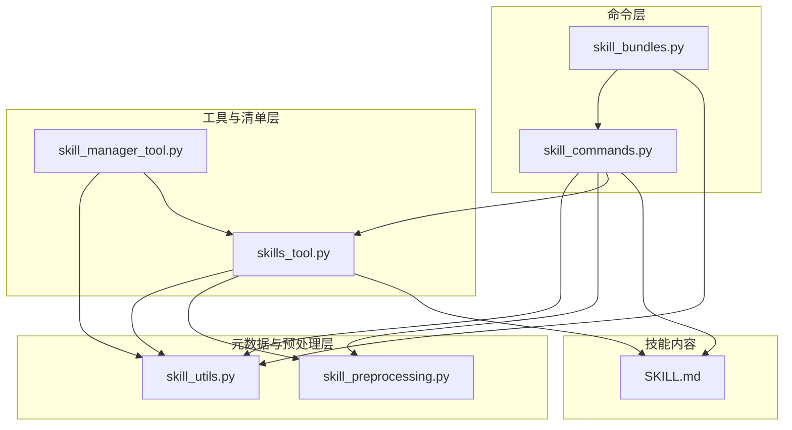
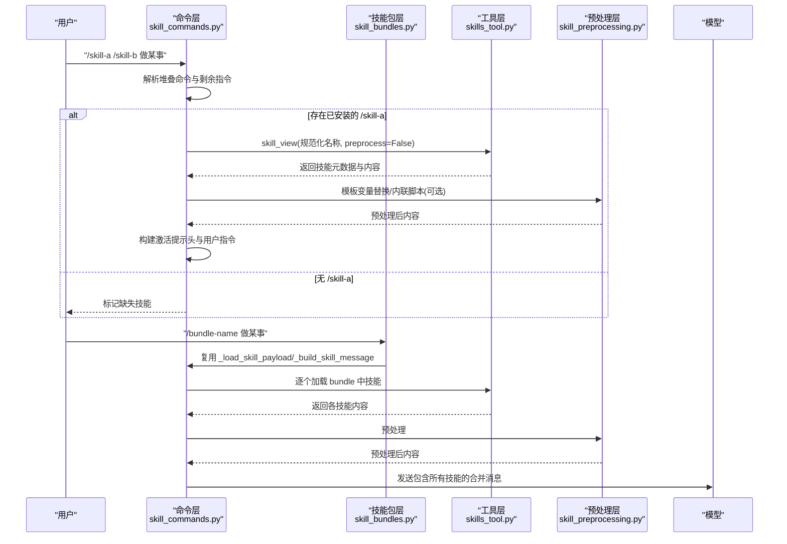
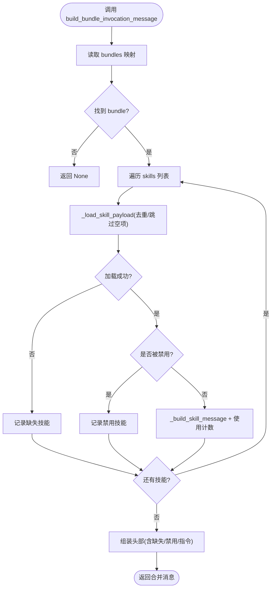
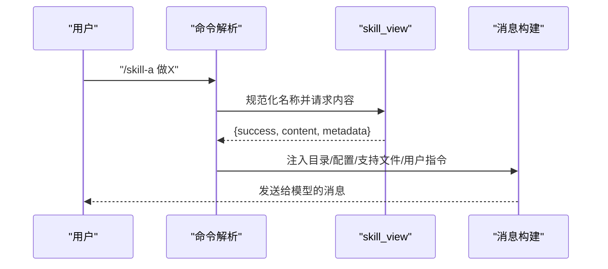
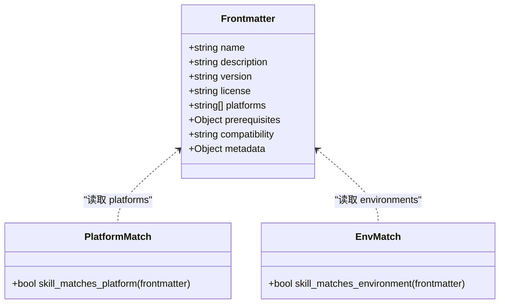
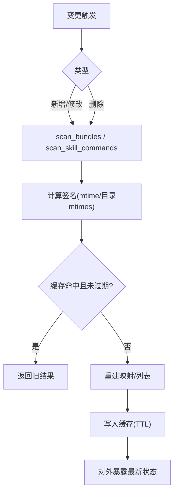
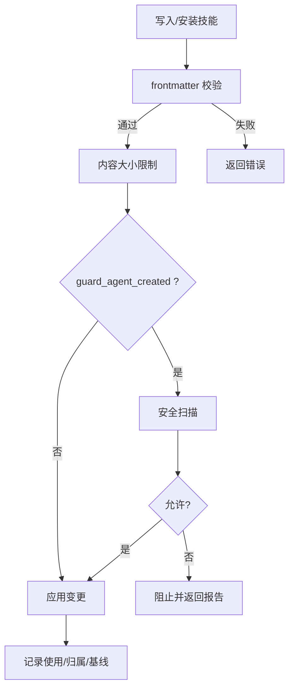
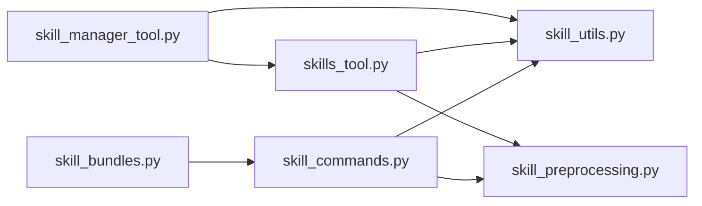

# 技能管理系统

<cite>
**本文引用的文件**
- [agent/skill_bundles.py](file://agent/skill_bundles.py)
- [agent/skill_commands.py](file://agent/skill_commands.py)
- [agent/skill_utils.py](file://agent/skill_utils.py)
- [agent/skill_preprocessing.py](file://agent/skill_preprocessing.py)
- [tools/skills_tool.py](file://tools/skills_tool.py)
- [tools/skill_manager_tool.py](file://tools/skill_manager_tool.py)
- [skills/autonomous-ai-agents/sparkii-agent/SKILL.md](file://skills/autonomous-ai-agents/sparkii-agent/SKILL.md)
</cite>

## 目录
1. [简介](#简介)
2. [项目结构](#项目结构)
3. [核心组件](#核心组件)
4. [架构总览](#架构总览)
5. [详细组件分析](#详细组件分析)
6. [依赖关系分析](#依赖关系分析)
7. [性能考量](#性能考量)
8. [故障排查指南](#故障排查指南)
9. [结论](#结论)
10. [附录](#附录)

## 简介
本文件面向 Sparkii Agent 的技能管理系统，系统性说明技能包（Skill Bundles）的架构设计、技能发现与加载流程、依赖与配置管理、生命周期管理（安装/更新/卸载/热重载）、验证系统（语法检查、依赖解析、安全扫描），以及技能开发最佳实践、打包分发与企业级部署集成方案。文档以代码为依据，提供可视化图示与可操作的排错指引，帮助开发者快速掌握并扩展技能生态。

## 项目结构
技能管理由“命令层”“元数据与预处理层”“工具与清单层”“技能包层”共同组成：
- 命令层：负责斜杠命令解析、堆叠调用、消息构建与用户指令提取
- 元数据与预处理层：负责 SKILL.md frontmatter 解析、平台与环境匹配、模板变量替换与内联脚本执行
- 工具与清单层：负责技能列表、视图加载、前置条件检查、缓存与增量扫描
- 技能包层：将多个技能聚合为一次性加载的“包”，统一注入提示头与运行上下文

**图表来源**
- [agent/skill_commands.py:1-120](file://agent/skill_commands.py#L1-L120)
- [agent/skill_bundles.py:1-120](file://agent/skill_bundles.py#L1-L120)
- [agent/skill_utils.py:170-220](file://agent/skill_utils.py#L170-L220)
- [agent/skill_preprocessing.py:1-63](file://agent/skill_preprocessing.py#L1-L63)
- [tools/skills_tool.py:673-781](file://tools/skills_tool.py#L673-L781)
- [tools/skill_manager_tool.py:566-620](file://tools/skill_manager_tool.py#L566-L620)
- [skills/autonomous-ai-agents/sparkii-agent/SKILL.md:1-13](file://skills/autonomous-ai-agents/sparkii-agent/SKILL.md#L1-L13)

**章节来源**
- [agent/skill_commands.py:1-120](file://agent/skill_commands.py#L1-L120)
- [agent/skill_bundles.py:1-120](file://agent/skill_bundles.py#L1-L120)
- [agent/skill_utils.py:170-220](file://agent/skill_utils.py#L170-L220)
- [agent/skill_preprocessing.py:1-63](file://agent/skill_preprocessing.py#L1-L63)
- [tools/skills_tool.py:673-781](file://tools/skills_tool.py#L673-L781)
- [tools/skill_manager_tool.py:566-620](file://tools/skill_manager_tool.py#L566-L620)
- [skills/autonomous-ai-agents/sparkii-agent/SKILL.md:1-13](file://skills/autonomous-ai-agents/sparkii-agent/SKILL.md#L1-L13)

## 核心组件
- 斜杠命令与消息构建：统一处理单技能、多技能堆叠与技能包的激活提示头，确保记忆提供者仅存储用户真实指令
- 技能包（Bundle）：YAML 定义一组技能，按 slug 注册斜杠命令，支持描述、附加指令、缺失/禁用技能提示
- 元数据与预处理：解析 SKILL.md frontmatter，进行平台与环境过滤、模板变量替换、内联脚本执行
- 技能清单与视图：扫描本地与外部技能目录，提供轻量列表与按需加载完整内容，内置缓存与 TTL
- 技能管理与安全：创建/编辑/删除技能，校验 frontmatter 与大小限制，可选安全扫描与后台审查保护

**章节来源**
- [agent/skill_commands.py:271-371](file://agent/skill_commands.py#L271-L371)
- [agent/skill_bundles.py:168-244](file://agent/skill_bundles.py#L168-L244)
- [agent/skill_utils.py:174-220](file://agent/skill_utils.py#L174-L220)
- [tools/skills_tool.py:673-781](file://tools/skills_tool.py#L673-L781)
- [tools/skill_manager_tool.py:566-620](file://tools/skill_manager_tool.py#L566-L620)

## 架构总览
下图展示从用户输入到最终模型可见消息的端到端流程，包括单技能、堆叠技能与技能包三种路径。

**图表来源**
- [agent/skill_commands.py:569-744](file://agent/skill_commands.py#L569-L744)
- [agent/skill_bundles.py:253-368](file://agent/skill_bundles.py#L253-L368)
- [tools/skills_tool.py:673-781](file://tools/skills_tool.py#L673-L781)
- [agent/skill_preprocessing.py:39-63](file://agent/skill_preprocessing.py#L39-L63)

## 详细组件分析

### 技能包（Skill Bundles）
- 存储位置与命名：位于 SPARKII_HOME/skill-bundles/*.yaml；文件名或 name 字段作为 slug 来源，自动标准化为小写连字符形式
- 冲突解决：若 bundle 与 skill 同名，bundle 优先；斜杠命令分派先查 bundle 再查 skill
- 扫描与缓存：基于目录与文件 mtime 的轻量刷新策略，避免重复 IO
- 构建消息：为每个成员技能生成激活块，汇总缺失/禁用信息，注入 bundle 指令与用户指令
- CRUD：save_bundle/delete_bundle/get_bundle 提供文件级操作并刷新缓存

**图表来源**
- [agent/skill_bundles.py:253-368](file://agent/skill_bundles.py#L253-L368)
- [agent/skill_commands.py:271-371](file://agent/skill_commands.py#L271-L371)

**章节来源**
- [agent/skill_bundles.py:66-165](file://agent/skill_bundles.py#L66-L165)
- [agent/skill_bundles.py:168-244](file://agent/skill_bundles.py#L168-L244)
- [agent/skill_bundles.py:253-368](file://agent/skill_bundles.py#L253-L368)
- [agent/skill_bundles.py:376-439](file://agent/skill_bundles.py#L376-L439)

### 斜杠命令与堆叠调用
- 单技能：通过 _load_skill_payload 获取技能内容，注入目录、配置、支持文件提示与用户指令
- 堆叠技能：最多消费 N 个前导 /skill 令牌，复用 bundle 风格的激活标记，便于记忆提供者正确提取用户指令
- 命令键解析：下划线与连字符互通，兼容 Telegram 等平台命令名差异
- 平台/环境过滤：在扫描阶段排除不兼容或不相关的技能，但显式加载不受限

**图表来源**
- [agent/skill_commands.py:192-229](file://agent/skill_commands.py#L192-L229)
- [agent/skill_commands.py:569-613](file://agent/skill_commands.py#L569-L613)
- [tools/skills_tool.py:673-781](file://tools/skills_tool.py#L673-L781)

**章节来源**
- [agent/skill_commands.py:73-166](file://agent/skill_commands.py#L73-L166)
- [agent/skill_commands.py:374-467](file://agent/skill_commands.py#L374-L467)
- [agent/skill_commands.py:550-744](file://agent/skill_commands.py#L550-L744)

### 元数据格式与分类系统（SKILL.md frontmatter）
- 必需字段：name、description；可选：version、license、platforms、prerequisites、compatibility、metadata
- 平台与环境：
  - platforms：macos/linux/windows，Termux/Android 特殊兼容
  - environments：kanban/docker/s6，用于“呈现时”过滤，不影响显式加载
- 组织镜像：_org/<org_id>/ 下的技能受同步客户端保护，支持基线与提案机制
- 示例参考：sparkii-agent 技能展示了完整的 frontmatter 与路由表

**图表来源**
- [agent/skill_utils.py:174-220](file://agent/skill_utils.py#L174-L220)
- [agent/skill_utils.py:226-271](file://agent/skill_utils.py#L226-L271)
- [agent/skill_utils.py:289-387](file://agent/skill_utils.py#L289-L387)
- [skills/autonomous-ai-agents/sparkii-agent/SKILL.md:1-13](file://skills/autonomous-ai-agents/sparkii-agent/SKILL.md#L1-L13)

**章节来源**
- [agent/skill_utils.py:174-220](file://agent/skill_utils.py#L174-L220)
- [agent/skill_utils.py:226-271](file://agent/skill_utils.py#L226-L271)
- [agent/skill_utils.py:289-387](file://agent/skill_utils.py#L289-L387)
- [skills/autonomous-ai-agents/sparkii-agent/SKILL.md:1-13](file://skills/autonomous-ai-agents/sparkii-agent/SKILL.md#L1-L13)

### 生命周期管理（安装/更新/卸载/热重载）
- 安装与更新：通过 CLI/Hub 安装至 SPARKII_HOME/skills；外部目录通过 skills.external_dirs 配置纳入扫描
- 卸载：删除对应目录或文件；后台审查模式禁止对非托管/外部/受保护技能删除
- 热重载：reload_skills/reload_bundles 基于 mtime 与 TTL 的增量刷新，保持系统提示缓存稳定
- 预加载：CLI/TUI 启动时可预加载若干技能，忽略禁用列表需额外门控

**图表来源**
- [agent/skill_bundles.py:95-113](file://agent/skill_bundles.py#L95-L113)
- [agent/skill_bundles.py:168-205](file://agent/skill_bundles.py#L168-L205)
- [agent/skill_commands.py:485-547](file://agent/skill_commands.py#L485-L547)
- [tools/skills_tool.py:91-138](file://tools/skills_tool.py#L91-L138)
- [tools/skills_tool.py:673-781](file://tools/skills_tool.py#L673-L781)

**章节来源**
- [agent/skill_bundles.py:221-244](file://agent/skill_bundles.py#L221-L244)
- [agent/skill_commands.py:485-547](file://agent/skill_commands.py#L485-L547)
- [tools/skills_tool.py:91-138](file://tools/skills_tool.py#L91-L138)
- [tools/skills_tool.py:673-781](file://tools/skills_tool.py#L673-L781)

### 验证系统（语法检查/依赖解析/安全扫描）
- 语法检查：frontmatter YAML 解析失败回退为简单 key:value；严格校验必填字段与长度限制
- 依赖解析：
  - 平台与环境：扫描阶段过滤，显式加载不受限
  - 前置条件：prerequisites.env_vars/commands 与 required_environment_variables 归一化与提示
- 安全扫描：
  - 可选 guard_agent_created：对代理创建的技能进行扫描与阻断
  - 后台审查：读前写保护、外部目录只读、受保护/内置/Hub 技能保护
  - 删除防护：拒绝符号链接/结点的递归删除，防止越界

**图表来源**
- [tools/skill_manager_tool.py:566-620](file://tools/skill_manager_tool.py#L566-L620)
- [tools/skill_manager_tool.py:125-149](file://tools/skill_manager_tool.py#L125-L149)
- [tools/skill_manager_tool.py:213-271](file://tools/skill_manager_tool.py#L213-L271)
- [tools/skill_manager_tool.py:301-421](file://tools/skill_manager_tool.py#L301-L421)
- [tools/skills_tool.py:275-406](file://tools/skills_tool.py#L275-L406)

**章节来源**
- [tools/skill_manager_tool.py:566-620](file://tools/skill_manager_tool.py#L566-L620)
- [tools/skill_manager_tool.py:125-149](file://tools/skill_manager_tool.py#L125-L149)
- [tools/skill_manager_tool.py:213-271](file://tools/skill_manager_tool.py#L213-L271)
- [tools/skill_manager_tool.py:301-421](file://tools/skill_manager_tool.py#L301-L421)
- [tools/skills_tool.py:275-406](file://tools/skills_tool.py#L275-L406)

### 技能开发最佳实践
- 命名约定：name 使用小写字母、数字、连字符、点、下划线，首字符字母或数字；slug 标准化避免冲突
- 错误处理：frontmatter 必须闭合；描述长度受限；过大内容拆分到 references/templates/scripts/assets
- 性能优化：
  - 使用 platform/environments 减少无关技能出现
  - 利用模板变量与内联脚本动态生成内容，控制输出上限
  - 合理使用堆叠技能，避免过多技能导致上下文膨胀
- 安全与合规：遵循 secrets 在 .env、配置在 config.yaml；避免硬编码路径；谨慎使用内联脚本

**章节来源**
- [tools/skill_manager_tool.py:527-563](file://tools/skill_manager_tool.py#L527-L563)
- [tools/skill_manager_tool.py:623-635](file://tools/skill_manager_tool.py#L623-L635)
- [agent/skill_preprocessing.py:39-63](file://agent/skill_preprocessing.py#L39-L63)
- [agent/skill_preprocessing.py:65-103](file://agent/skill_preprocessing.py#L65-L103)
- [tools/skills_tool.py:275-406](file://tools/skills_tool.py#L275-L406)

### 打包与分发及企业级集成
- 本地与外部目录：SPARKII_HOME/skills 为主目录；skills.external_dirs 支持多源聚合
- 组织共享：_org/<org_id>/ 镜像目录，支持基线比对与自动/手动提案
- Hub 安装与更新：通过 CLI/Hub 安装，变更通过 mtime+TTL 刷新
- 企业部署：
  - 通过 external_dirs 集中管理技能集
  - 使用 disabled/platform_disabled 按平台屏蔽敏感技能
  - 启用 guard_agent_created 强化代理创建内容的审计
  - 结合 cron/gateway 等场景使用 environments 标签精准呈现

**章节来源**
- [agent/skill_utils.py:499-580](file://agent/skill_utils.py#L499-L580)
- [agent/skill_utils.py:70-99](file://agent/skill_utils.py#L70-L99)
- [tools/skill_manager_tool.py:665-696](file://tools/skill_manager_tool.py#L665-L696)
- [tools/skills_tool.py:673-781](file://tools/skills_tool.py#L673-L781)

## 依赖关系分析
- 模块耦合：
  - skill_commands 依赖 skill_utils（frontmatter/平台/环境/禁用集合）与 skill_preprocessing（模板/内联脚本）
  - skill_bundles 复用 skill_commands 的加载与消息构建逻辑
  - skills_tool 提供清单与视图，驱动 skill_commands 的加载
  - skill_manager_tool 负责创建/编辑/删除，并调用安全扫描与所有权守卫
- 外部依赖：
  - 配置文件：config.yaml（skills.disabled/platform_disabled/external_dirs）
  - 环境变量：SPARKII_PLATFORM、SPARKII_SESSION_PLATFORM、SPARKII_INTERACTIVE 等
  - 文件系统：SPARKII_HOME/skills、skill-bundles、_org 镜像

**图表来源**
- [agent/skill_commands.py:15-19](file://agent/skill_commands.py#L15-L19)
- [agent/skill_bundles.py:284-289](file://agent/skill_bundles.py#L284-L289)
- [tools/skills_tool.py:84-87](file://tools/skills_tool.py#L84-L87)
- [tools/skill_manager_tool.py:46-51](file://tools/skill_manager_tool.py#L46-L51)

**章节来源**
- [agent/skill_commands.py:15-19](file://agent/skill_commands.py#L15-L19)
- [agent/skill_bundles.py:284-289](file://agent/skill_bundles.py#L284-L289)
- [tools/skills_tool.py:84-87](file://tools/skills_tool.py#L84-L87)
- [tools/skill_manager_tool.py:46-51](file://tools/skill_manager_tool.py#L46-L51)

## 性能考量
- 扫描与缓存：
  - 技能清单使用签名（目录与子目录最大 mtime）+ TTL 缓存，避免全量重扫
  - 技能包基于目录与文件 mtime 的轻量刷新
- 预处理开销：
  - 模板变量替换与内联脚本默认关闭或可控超时，避免阻塞
- 上下文控制：
  - 堆叠技能限制数量，避免过长提示
  - 支持文件按需加载，减少初始负载

[本节为通用指导，无需特定文件引用]

## 故障排查指南
- 无法识别斜杠命令：
  - 检查 slug 标准化与冲突（bundle 优先于 skill）
  - 确认平台/环境过滤是否隐藏了技能
- 技能加载为空或缺失：
  - 查看 _load_skill_payload 返回值与 missing 列表
  - 确认技能是否存在于本地或 external_dirs
- 前端显示异常：
  - 检查 extract_user_instruction_from_skill_message 是否能正确提取用户指令
- 安全扫描阻断：
  - 查看扫描报告，调整内容或关闭 guard_agent_created（不推荐）
- 删除失败：
  - 检查是否为符号链接/结点、是否在已知根目录下、是否受后台审查保护

**章节来源**
- [agent/skill_commands.py:550-566](file://agent/skill_commands.py#L550-L566)
- [agent/skill_commands.py:192-229](file://agent/skill_commands.py#L192-L229)
- [tools/skill_manager_tool.py:213-271](file://tools/skill_manager_tool.py#L213-L271)
- [tools/skill_manager_tool.py:301-421](file://tools/skill_manager_tool.py#L301-L421)

## 结论
Sparkii 技能管理系统通过清晰的层次划分与严格的元数据规范，实现了高内聚、低耦合的技能发现、加载与生命周期管理。技能包进一步提升了组合能力与用户体验。配合平台/环境过滤、安全扫描与后台审查，系统在灵活性与安全性之间取得平衡。建议遵循命名与内容规范，合理利用缓存与预处理开关，并在企业环境中通过 external_dirs 与平台屏蔽实现集中治理。

[本节为总结性内容，无需特定文件引用]

## 附录
- 关键函数与入口
  - 技能包：get_skill_bundles、build_bundle_invocation_message、reload_bundles
  - 斜杠命令：build_skill_invocation_message、build_stacked_skill_invocation_message、extract_user_instruction_from_skill_message
  - 元数据：parse_frontmatter、skill_matches_platform、skill_matches_environment
  - 清单与视图：skills_list、skill_view、check_skills_requirements
  - 管理：create/edit/delete skill、安全扫描与守卫

[本节为索引性内容，无需特定文件引用]