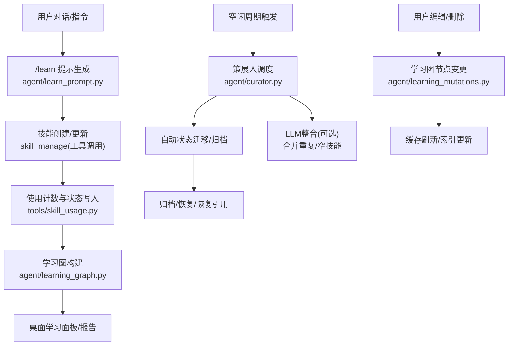
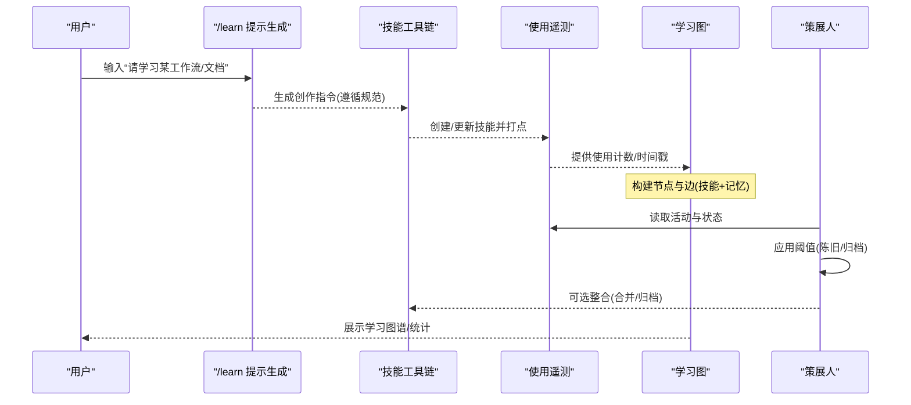
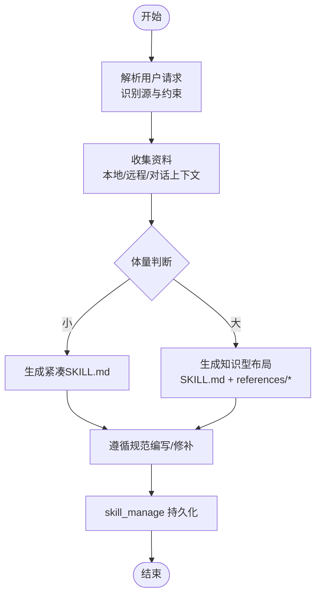
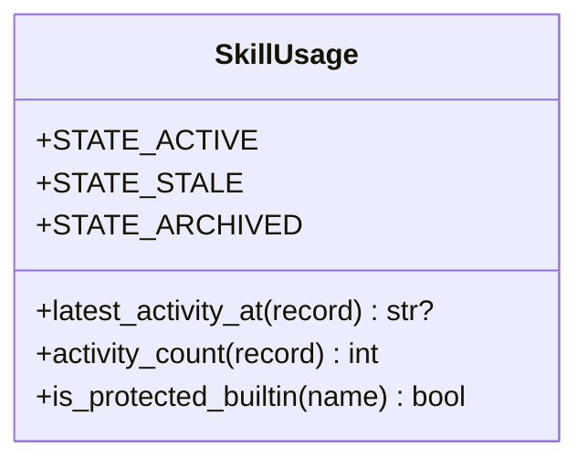
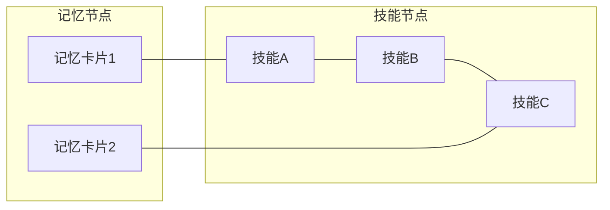
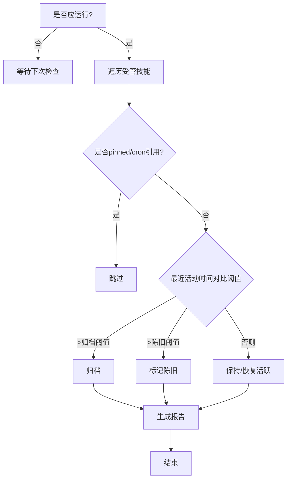
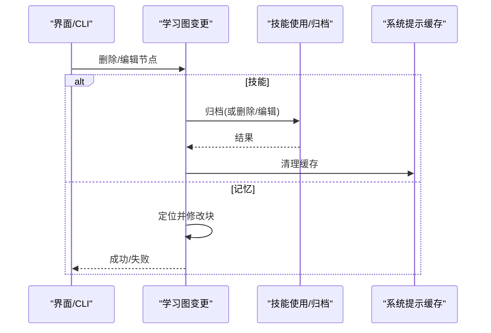
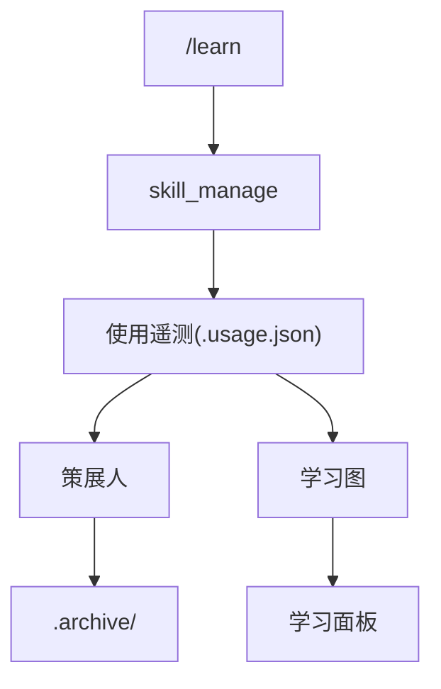

# 自改进AI代理

<cite>
**本文引用的文件**
- [agent/learning_graph.py](file://agent/learning_graph.py)
- [agent/curator.py](file://agent/curator.py)
- [agent/skill_utils.py](file://agent/skill_utils.py)
- [agent/learn_prompt.py](file://agent/learn_prompt.py)
- [agent/learning_mutations.py](file://agent/learning_mutations.py)
- [tools/skill_usage.py](file://tools/skill_usage.py)
</cite>

## 目录
1. [简介](#简介)
2. [项目结构](#项目结构)
3. [核心组件](#核心组件)
4. [架构总览](#架构总览)
5. [详细组件分析](#详细组件分析)
6. [依赖关系分析](#依赖关系分析)
7. [性能考虑](#性能考虑)
8. [故障排除指南](#故障排除指南)
9. [结论](#结论)
10. [附录：配置与使用示例](#附录：配置与使用示例)

## 简介
本文件面向Hermes Agent的“自改进AI代理”能力，系统性说明内置学习循环如何从用户交互中自动提取模式、创建并优化技能；阐述技能自动创建机制（发现、验证、部署）；介绍学习图（Learning Graph）系统（技能依赖、版本与回滚思路）；解释策展人（Curator）系统如何监控与管理技能质量（性能评估、使用统计、自动优化）；并提供配置示例、典型使用场景、故障排除与性能调优建议。

## 项目结构
围绕自改进能力的核心代码主要分布在以下模块：
- 学习图构建与可视化数据：agent/learning_graph.py
- 策展人调度与生命周期管理：agent/curator.py
- 技能元数据与环境/平台匹配：agent/skill_utils.py
- /learn 提示词生成与技能创作指引：agent/learn_prompt.py
- 学习图节点编辑/删除（含归档恢复）：agent/learning_mutations.py
- 技能使用遥测与状态机：tools/skill_usage.py

图表来源
- [agent/learn_prompt.py:165-238](file://agent/learn_prompt.py#L165-L238)
- [tools/skill_usage.py:1-200](file://tools/skill_usage.py#L1-L200)
- [agent/learning_graph.py:125-329](file://agent/learning_graph.py#L125-L329)
- [agent/curator.py:233-383](file://agent/curator.py#L233-L383)
- [agent/learning_mutations.py:121-187](file://agent/learning_mutations.py#L121-L187)

章节来源
- [agent/learning_graph.py:1-329](file://agent/learning_graph.py#L1-L329)
- [agent/curator.py:1-800](file://agent/curator.py#L1-L800)
- [agent/skill_utils.py:1-800](file://agent/skill_utils.py#L1-L800)
- [agent/learn_prompt.py:1-238](file://agent/learn_prompt.py#L1-L238)
- [agent/learning_mutations.py:1-207](file://agent/learning_mutations.py#L1-L207)
- [tools/skill_usage.py:1-200](file://tools/skill_usage.py#L1-L200)

## 核心组件
- 学习循环入口（/learn）：将用户的自然语言请求转化为可执行的技能创作任务，指导模型通过现有工具收集资料、编写SKILL.md及支持文件，并持久化到技能库。
- 技能使用遥测与状态机：记录每次使用、查看、补丁事件，维护active/stale/archived/pinned等状态，供策展人与学习图消费。
- 学习图：聚合“已学习”的技能与记忆卡片，基于related_skills与文本相似度建立边，输出可供前端可视化的节点与边集合。
- 策展人：在空闲时按间隔运行，执行确定性状态迁移（标记陈旧、归档长期未用），并可触发LLM辅助的整合（合并重复/窄技能为“伞形”技能）。
- 学习图节点操作：提供对技能与记忆的编辑/删除（技能删除即归档，支持恢复），并清理相关缓存。

章节来源
- [agent/learn_prompt.py:165-238](file://agent/learn_prompt.py#L165-L238)
- [tools/skill_usage.py:1-200](file://tools/skill_usage.py#L1-L200)
- [agent/learning_graph.py:125-329](file://agent/learning_graph.py#L125-L329)
- [agent/curator.py:233-383](file://agent/curator.py#L233-L383)
- [agent/learning_mutations.py:121-187](file://agent/learning_mutations.py#L121-L187)

## 架构总览
自改进闭环由“用户意图→技能产出→使用反馈→质量治理→知识沉淀”构成：
- 意图捕获：/learn将用户描述转为结构化指令，驱动模型利用已有工具完成资料采集与技能编写。
- 技能产出：通过skill_manage创建或扩展技能，遵循严格的作者规范与知识型布局。
- 使用反馈：工具调用侧埋点更新使用计数与时间戳，形成活跃信号。
- 质量治理：策展人在空闲期扫描，依据阈值进行状态迁移与归档；可选LLM整合减少碎片化。
- 知识沉淀：学习图将“已学习技能+记忆卡片”组织为可查询、可关联的知识网络，支撑可视化与检索。

图表来源
- [agent/learn_prompt.py:165-238](file://agent/learn_prompt.py#L165-L238)
- [tools/skill_usage.py:1-200](file://tools/skill_usage.py#L1-L200)
- [agent/learning_graph.py:125-329](file://agent/learning_graph.py#L125-L329)
- [agent/curator.py:233-383](file://agent/curator.py#L233-L383)

## 详细组件分析

### 学习循环（/learn）与技能自动创建
- 目标：将任意用户描述（路径、URL、对话历史、粘贴文本）转化为可复用的技能。
- 流程要点：
  - 解析请求，识别“源材料”和“约束条件”。
  - 使用现有工具收集资料（读文件/搜索/抓取网页/对话上下文）。
  - 根据源体量选择单文件SKILL.md或“知识型”布局（SKILL.md + references/）。
  - 严格遵循作者规范（名称、描述长度、章节顺序、Hermes工具表述、安全清洗）。
  - 通过skill_manage创建/扩展技能，必要时写入scripts/templates/references等支持文件。
- 关键实现位置：
  - 提示词组装与规范嵌入：[agent/learn_prompt.py:165-238](file://agent/learn_prompt.py#L165-L238)

图表来源
- [agent/learn_prompt.py:165-238](file://agent/learn_prompt.py#L165-L238)

章节来源
- [agent/learn_prompt.py:165-238](file://agent/learn_prompt.py#L165-L238)

### 技能使用遥测与状态机
- 作用：以sidecar JSON记录每个技能的use/view/patch次数与最近活动时间，维护状态机（active/stale/archived/pinned）。
- 关键点：
  - 原子写入与跨进程锁，避免并发损坏。
  - 受保护内置技能不可被归档/整合。
  - 最新活动时间用于策展人的阈值判定。
- 关键实现位置：
  - 状态常量与最近活动时间计算：[tools/skill_usage.py:1-200](file://tools/skill_usage.py#L1-L200)

图表来源
- [tools/skill_usage.py:1-200](file://tools/skill_usage.py#L1-L200)

章节来源
- [tools/skill_usage.py:1-200](file://tools/skill_usage.py#L1-L200)

### 学习图（Learning Graph）
- 目标：将“已学习技能”与“记忆卡片”组织为图，便于可视化与问答。
- 节点：
  - 技能节点：来自基础与个人技能根，过滤归档/外部目录，仅纳入“已学习”（agent创建或使用过）。
  - 记忆节点：MEMORY.md/USER.md按分隔符切分成的卡片。
- 边：
  - related_skills声明的无向边（去重）。
  - 记忆与技能间的边：基于标题/正文与技能名的词法重叠打分，取TopN。
- 输出：节点、边、聚类统计、密度指标、记忆卡片列表。
- 关键实现位置：
  - 节点构建、边构建、内存卡片、统计：[agent/learning_graph.py:125-329](file://agent/learning_graph.py#L125-L329)

图表来源
- [agent/learning_graph.py:125-329](file://agent/learning_graph.py#L125-L329)

章节来源
- [agent/learning_graph.py:125-329](file://agent/learning_graph.py#L125-L329)

### 策展人（Curator）：质量治理与自动优化
- 触发：空闲且超过间隔阈值时运行；首次安装延迟一次完整间隔后再运行。
- 职责：
  - 确定性状态迁移：基于最近活动时间，将长期未用技能标记为陈旧或归档；重新使用后恢复活跃。
  - 保护：跳过已固定（pinned）、被cron引用、受保护的内置技能。
  - 可选LLM整合：将重复/过窄技能合并为“伞形”技能，或将内容降级为references/templates/scripts，提升可发现性与可维护性。
  - 报告：每轮运行生成结构化摘要与人类可读报告。
- 关键实现位置：
  - 运行门控与状态迁移：[agent/curator.py:233-383](file://agent/curator.py#L233-L383)
  - 整合提示与报告解析：[agent/curator.py:390-800](file://agent/curator.py#L390-L800)

图表来源
- [agent/curator.py:233-383](file://agent/curator.py#L233-L383)

章节来源
- [agent/curator.py:233-383](file://agent/curator.py#L233-L383)
- [agent/curator.py:390-800](file://agent/curator.py#L390-L800)

### 学习图节点编辑/删除（含回滚）
- 技能删除=归档：支持通过策展人恢复；同时清理系统提示缓存。
- 记忆删除/编辑：直接修改对应文件块，保证原子写入。
- 关键实现位置：
  - 删除/编辑逻辑与缓存清理：[agent/learning_mutations.py:121-187](file://agent/learning_mutations.py#L121-L187)

图表来源
- [agent/learning_mutations.py:121-187](file://agent/learning_mutations.py#L121-L187)

章节来源
- [agent/learning_mutations.py:121-187](file://agent/learning_mutations.py#L121-L187)

### 技能元数据与环境/平台匹配
- 功能：解析frontmatter、平台与环境标签、禁用列表、外部技能目录、配置变量声明等。
- 用途：确保技能只在合适的平台/环境出现；统一处理外部目录与组织镜像；为策展人与工具链提供一致的行为。
- 关键实现位置：
  - frontmatter解析、平台/环境匹配、外部目录、禁用列表：[agent/skill_utils.py:151-580](file://agent/skill_utils.py#L151-L580)

章节来源
- [agent/skill_utils.py:151-580](file://agent/skill_utils.py#L151-L580)

## 依赖关系分析
- /learn 依赖 skill_manage 工具与作者规范，产出的技能会触发使用遥测。
- 使用遥测被策展人与学习图消费：前者决定生命周期，后者构建可视化图。
- 学习图依赖技能元数据（frontmatter、related_skills）与记忆文件。
- 策展人依赖配置（interval_hours、stale/archive阈值、prune_builtins、consolidate）与状态文件。

图表来源
- [agent/learn_prompt.py:165-238](file://agent/learn_prompt.py#L165-L238)
- [tools/skill_usage.py:1-200](file://tools/skill_usage.py#L1-L200)
- [agent/curator.py:233-383](file://agent/curator.py#L233-L383)
- [agent/learning_graph.py:125-329](file://agent/learning_graph.py#L125-L329)

章节来源
- [agent/learn_prompt.py:165-238](file://agent/learn_prompt.py#L165-L238)
- [tools/skill_usage.py:1-200](file://tools/skill_usage.py#L1-L200)
- [agent/curator.py:233-383](file://agent/curator.py#L233-L383)
- [agent/learning_graph.py:125-329](file://agent/learning_graph.py#L125-L329)

## 性能考虑
- 冷启动与扫描成本：
  - 技能目录扫描与frontmatter解析可能成为瓶颈；通过惰性加载、缓存配置与外部目录缓存降低开销。
  - 学习图构建时对大语料采用增量处理与按需加载references。
- 并发与一致性：
  - 使用遥测文件采用原子写入与跨进程锁，避免竞争。
- 运行时影响：
  - 策展人仅在空闲时运行，默认间隔较长；可选择关闭LLM整合以减少额外成本。
- 建议：
  - 合理设置stale/archive阈值，避免频繁归档/恢复。
  - 控制技能数量与描述长度，提高索引命中率与响应速度。
  - 使用external_dirs集中管理大型知识库，减少主目录膨胀。

## 故障排除指南
- 策展人不运行
  - 检查是否启用、是否暂停、上次运行时间与间隔阈值；首次安装会延迟一次完整间隔。
  - 参考：运行门控与首次行为。
- 技能被意外归档
  - 确认是否被cron引用或被固定；受保护内置不会被归档。
  - 可通过策展人恢复归档的技能。
- 学习图不显示新技能
  - 确认技能未被归档、名称唯一、frontmatter包含name；检查使用计数与时间戳是否更新。
- 编辑/删除失败
  - 技能可能被固定；记忆节点ID过期需刷新图；确认文件存在与权限。
- 性能问题
  - 大量技能导致扫描变慢；考虑合并重复技能、启用外部目录、调整阈值减少无效动作。

章节来源
- [agent/curator.py:233-383](file://agent/curator.py#L233-L383)
- [tools/skill_usage.py:1-200](file://tools/skill_usage.py#L1-L200)
- [agent/learning_graph.py:125-329](file://agent/learning_graph.py#L125-L329)
- [agent/learning_mutations.py:121-187](file://agent/learning_mutations.py#L121-L187)

## 结论
Sparkii Agent的自改进能力通过“/learn→技能产出→使用反馈→策展治理→学习图沉淀”的闭环，持续从用户交互中提炼可复用知识。学习图将技能与记忆关联，策展人以确定性规则与可选LLM整合保障技能库质量与可维护性。配合合理的配置与运维策略，可在不牺牲性能的前提下实现可持续的自我进化。

## 附录：配置与使用示例
- 策展人配置（位于配置文件中的 curator.*）
  - enabled: 是否启用（默认开启）
  - interval_hours: 运行间隔（默认7天）
  - min_idle_hours: 最小空闲时长（默认2小时）
  - stale_after_days: 陈旧阈值（默认30天）
  - archive_after_days: 归档阈值（默认90天）
  - prune_builtins: 是否允许归档内置技能（默认开启）
  - consolidate: 是否启用LLM整合（默认关闭）
- 典型使用场景
  - 从对话历史学习：发送“/learn 把我们刚才的工作流整理成一个技能”，系统将自动收集步骤并生成SKILL.md。
  - 从文档/书籍学习：发送“/learn <URL/路径> 聚焦认证流程，忽略废弃端点”，系统将按知识型布局产出SKILL.md与references。
  - 质量治理：在空闲后观察策展人报告，审阅合并/归档建议，必要时手动干预。
  - 回滚与恢复：误删技能会被归档，可通过策展人恢复；记忆条目可直接编辑或删除。

章节来源
- [agent/curator.py:138-218](file://agent/curator.py#L138-L218)
- [agent/learn_prompt.py:165-238](file://agent/learn_prompt.py#L165-L238)
- [agent/learning_mutations.py:121-187](file://agent/learning_mutations.py#L121-L187)