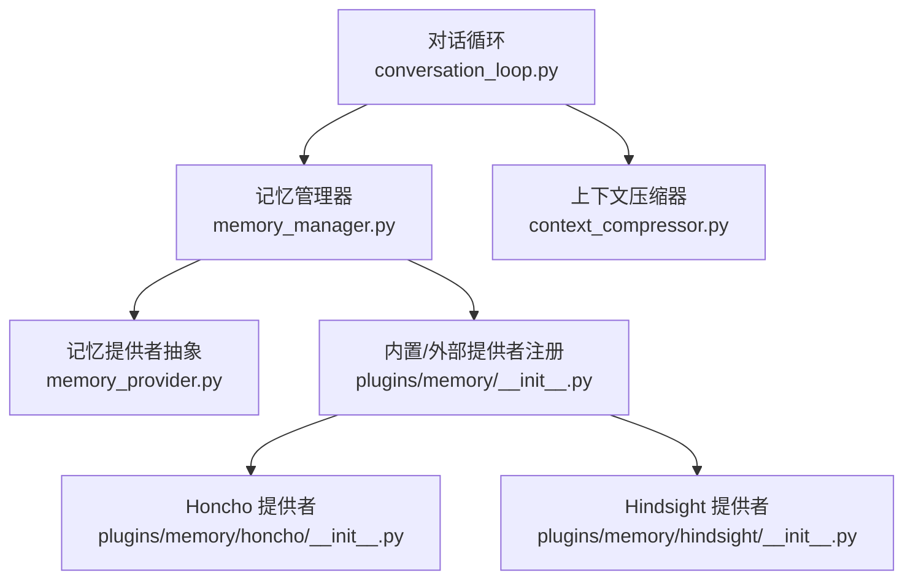
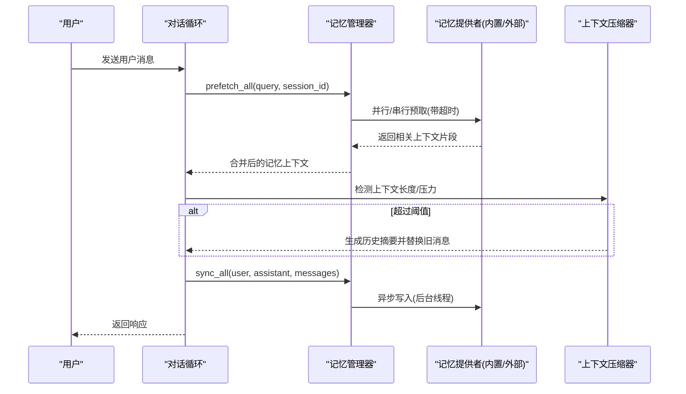
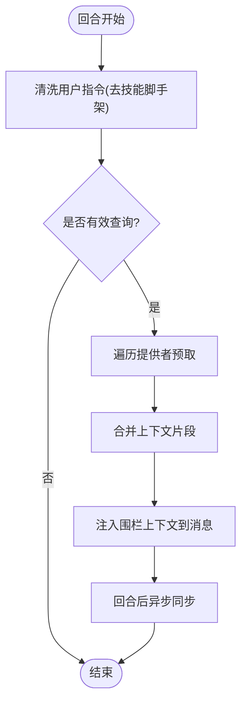
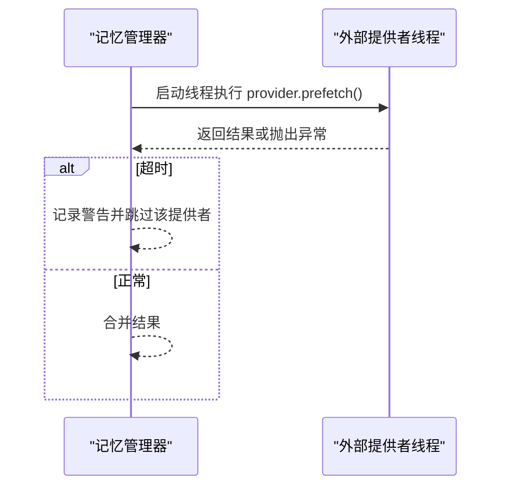
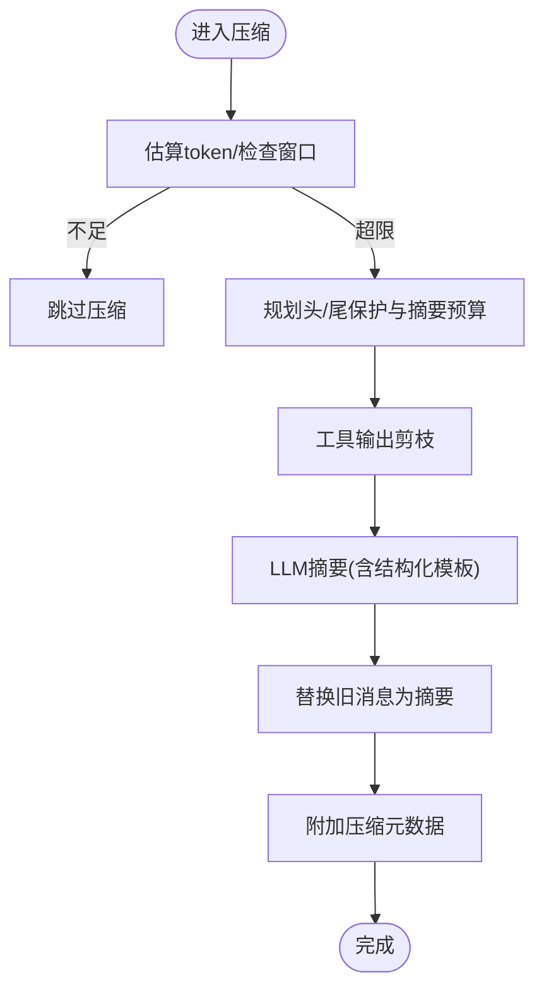
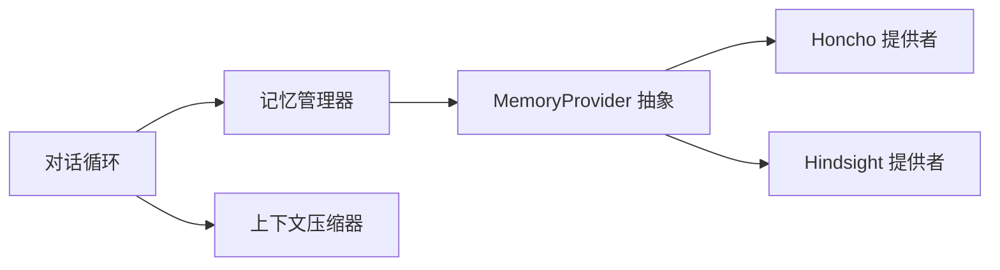

# 短期记忆

<cite>
**本文引用的文件**
- [agent/memory_manager.py](file://agent/memory_manager.py)
- [agent/memory_provider.py](file://agent/memory_provider.py)
- [plugins/memory/__init__.py](file://plugins/memory/__init__.py)
- [plugins/memory/honcho/__init__.py](file://plugins/memory/honcho/__init__.py)
- [plugins/memory/hindsight/__init__.py](file://plugins/memory/hindsight/__init__.py)
- [agent/context_compressor.py](file://agent/context_compressor.py)
- [agent/conversation_loop.py](file://agent/conversation_loop.py)
</cite>

## 目录
1. [简介](#简介)
2. [项目结构](#项目结构)
3. [核心组件](#核心组件)
4. [架构总览](#架构总览)
5. [详细组件分析](#详细组件分析)
6. [依赖关系分析](#依赖关系分析)
7. [性能考量](#性能考量)
8. [故障排查指南](#故障排查指南)
9. [结论](#结论)
10. [附录：配置与调优](#附录：配置与调优)

## 简介
本文件面向 Hermes Agent 的“短期记忆”子系统，聚焦会话级记忆的存储机制、上下文维护、消息历史缓存策略与上下文窗口管理；并深入说明预取（prefetch）机制的工作流程、超时控制与错误处理；介绍内存清理与压缩算法（上下文压缩、冗余去除、内存优化）；解释短期记忆与长期记忆的交互方式及跨会话隔离策略；最后给出可操作的配置选项与性能调优建议。

## 项目结构
围绕短期记忆的关键代码分布在以下模块：
- 记忆编排与生命周期：agent/memory_manager.py、agent/memory_provider.py
- 插件发现与加载：plugins/memory/__init__.py
- 具体长期记忆实现（作为外部提供者）：plugins/memory/honcho/__init__.py、plugins/memory/hindsight/__init__.py
- 上下文压缩与窗口管理：agent/context_compressor.py
- 对话循环集成点：agent/conversation_loop.py

**图示来源**
- [agent/conversation_loop.py:1440-1480](file://agent/conversation_loop.py#L1440-L1480)
- [agent/memory_manager.py:364-400](file://agent/memory_manager.py#L364-L400)
- [plugins/memory/__init__.py:90-121](file://plugins/memory/__init__.py#L90-L121)
- [agent/context_compressor.py:1-17](file://agent/context_compressor.py#L1-L17)

**章节来源**
- [agent/conversation_loop.py:1440-1480](file://agent/conversation_loop.py#L1440-L1480)
- [agent/memory_manager.py:364-400](file://agent/memory_manager.py#L364-L400)
- [plugins/memory/__init__.py:90-121](file://plugins/memory/__init__.py#L90-L121)
- [agent/context_compressor.py:1-17](file://agent/context_compressor.py#L1-L17)

## 核心组件
- MemoryManager：统一编排所有记忆提供者（内置 + 至多一个外部），负责系统提示拼装、回合前预取、回合后同步、工具模式注入、后台任务调度与优雅关闭。
- MemoryProvider：定义外部记忆提供者的标准接口（初始化、系统提示块、预取、队列预取、同步、工具模式、钩子等）。
- 插件发现：扫描内置与用户安装的 memory 插件，按名称选择唯一激活的外部提供者。
- 上下文压缩器：在长对话中自动压缩历史，保护首尾关键信息，生成摘要以维持上下文窗口可用。
- 对话循环：将记忆预取、压缩、持久化等能力整合到每轮对话的生命周期中。

**章节来源**
- [agent/memory_manager.py:364-400](file://agent/memory_manager.py#L364-L400)
- [agent/memory_provider.py:81-192](file://agent/memory_provider.py#L81-L192)
- [plugins/memory/__init__.py:157-216](file://plugins/memory/__init__.py#L157-L216)
- [agent/context_compressor.py:1-17](file://agent/context_compressor.py#L1-L17)
- [agent/conversation_loop.py:1440-1480](file://agent/conversation_loop.py#L1440-L1480)

## 架构总览
短期记忆在每次模型调用前进行“预取”，将相关上下文注入到消息中；回合结束后异步“同步”新对话到长期存储；当上下文接近或超出模型窗口时，触发压缩，生成历史摘要并保留最近消息。

**图示来源**
- [agent/conversation_loop.py:1440-1480](file://agent/conversation_loop.py#L1440-L1480)
- [agent/memory_manager.py:525-595](file://agent/memory_manager.py#L525-L595)
- [agent/context_compressor.py:1-17](file://agent/context_compressor.py#L1-L17)

## 详细组件分析

### 会话级记忆存储与上下文维护
- 系统提示拼装：MemoryManager 收集各提供者的静态系统提示块，用于引导模型理解记忆角色与边界。
- 回合前预取：prefetch_all 对每个提供者执行预取，过滤无意义的技能脚手架文本，合并结果并以围栏标记包裹，避免泄露内部上下文。
- 回合后同步：sync_all 将本轮用户与助手内容异步写入各提供者，保证顺序性且不影响主循环延迟。
- 会话隔离：通过 session_id 参数区分不同会话；提供者在 on_session_switch 中更新或重置会话状态，确保跨会话隔离。

**图示来源**
- [agent/memory_manager.py:507-545](file://agent/memory_manager.py#L507-L545)
- [agent/memory_manager.py:638-694](file://agent/memory_manager.py#L638-L694)

**章节来源**
- [agent/memory_manager.py:486-503](file://agent/memory_manager.py#L486-L503)
- [agent/memory_manager.py:525-595](file://agent/memory_manager.py#L525-L595)
- [agent/memory_manager.py:638-694](file://agent/memory_manager.py#L638-L694)
- [agent/memory_provider.py:214-256](file://agent/memory_provider.py#L214-L256)

### 预取机制：流程、超时与错误处理
- 预取流程：
  - 内置提供者直接调用其 prefetch。
  - 外部提供者在新线程中执行，使用锁跟踪线程以避免重复启动；join 等待结果。
- 超时控制：外部预取默认超时（可通过构造参数 external_prefetch_timeout 调整），超时则跳过该提供者并记录警告。
- 错误处理：单个提供者失败不阻塞其他提供者；异常被捕获并记录，最终由调用方决定后续行为。
- 后台队列预取：queue_prefetch_all 将下一轮的预取工作放入单工作线程执行器，避免阻塞主循环。

**图示来源**
- [agent/memory_manager.py:547-595](file://agent/memory_manager.py#L547-L595)
- [agent/memory_manager.py:597-623](file://agent/memory_manager.py#L597-L623)

**章节来源**
- [agent/memory_manager.py:371-382](file://agent/memory_manager.py#L371-L382)
- [agent/memory_manager.py:547-595](file://agent/memory_manager.py#L547-L595)
- [agent/memory_manager.py:597-623](file://agent/memory_manager.py#L597-L623)

### 内存清理与压缩算法
- 触发条件：当消息列表接近或超过模型上下文窗口时，上下文压缩器介入。
- 压缩策略：
  - 保护头部与尾部（最新对话）以保持即时上下文。
  - 对中间历史进行摘要，生成结构化摘要模板，保留问题追踪与待办事项。
  - 工具输出先做廉价剪枝，再送入 LLM 摘要，减少成本。
  - 滚动微压缩与批量压缩结合，支持续写与重组。
- 元数据与兼容性：为前端识别压缩消息添加元数据键，避免未知字段导致网关拒绝请求。
- 与记忆系统的协作：压缩前调用提供者的 on_pre_compress 钩子，以便提取重要洞察并纳入摘要。

**图示来源**
- [agent/context_compressor.py:1-17](file://agent/context_compressor.py#L1-L17)
- [agent/context_compressor.py:100-179](file://agent/context_compressor.py#L100-L179)

**章节来源**
- [agent/context_compressor.py:1-17](file://agent/context_compressor.py#L1-L17)
- [agent/context_compressor.py:100-179](file://agent/context_compressor.py#L100-L179)

### 短期记忆与长期记忆的交互与隔离
- 交互方式：
  - 短期记忆（会话内消息历史）通过上下文压缩器管理，保持当前对话可用。
  - 长期记忆（外部提供者如 Honcho/Hindsight）通过 MemoryManager 的 prefetch/sync 与对话循环集成，提供跨会话召回。
  - 压缩前调用 on_pre_compress，使长期记忆提供者有机会贡献洞察到摘要。
- 隔离策略：
  - 通过 session_id 区分会话；提供者在 on_session_switch 中更新/重置内部状态。
  - 插件发现限制仅一个外部提供者激活，避免冲突与工具模式膨胀。
  - 内置与外部提供者并存时，失败互不阻塞，保障鲁棒性。

**章节来源**
- [agent/memory_provider.py:214-256](file://agent/memory_provider.py#L214-L256)
- [plugins/memory/__init__.py:157-216](file://plugins/memory/__init__.py#L157-L216)
- [agent/memory_manager.py:404-470](file://agent/memory_manager.py#L404-L470)

## 依赖关系分析
- 对话循环依赖记忆管理器与上下文压缩器，形成“预取—压缩—同步”的主路径。
- 记忆管理器依赖 MemoryProvider 抽象，并通过插件发现加载具体实现。
- 外部提供者（Honcho/Hindsight）实现 MemoryProvider，暴露工具模式与预取/同步能力。
- 上下文压缩器依赖模型元数据与辅助客户端，进行智能摘要与窗口管理。

**图示来源**
- [agent/conversation_loop.py:1440-1480](file://agent/conversation_loop.py#L1440-L1480)
- [agent/memory_manager.py:364-400](file://agent/memory_manager.py#L364-L400)
- [plugins/memory/honcho/__init__.py:1-200](file://plugins/memory/honcho/__init__.py#L1-L200)
- [plugins/memory/hindsight/__init__.py:1-200](file://plugins/memory/hindsight/__init__.py#L1-L200)
- [agent/context_compressor.py:1-17](file://agent/context_compressor.py#L1-L17)

**章节来源**
- [agent/conversation_loop.py:1440-1480](file://agent/conversation_loop.py#L1440-L1480)
- [agent/memory_manager.py:364-400](file://agent/memory_manager.py#L364-L400)
- [plugins/memory/honcho/__init__.py:1-200](file://plugins/memory/honcho/__init__.py#L1-L200)
- [plugins/memory/hindsight/__init__.py:1-200](file://plugins/memory/hindsight/__init__.py#L1-L200)
- [agent/context_compressor.py:1-17](file://agent/context_compressor.py#L1-L17)

## 性能考量
- 预取并发与超时：外部提供者预取使用独立线程与超时控制，避免慢提供者拖垮主循环；合理设置 external_prefetch_timeout 平衡召回质量与延迟。
- 后台任务序列化：单工作线程执行器保证写入顺序，防止竞争与乱序；在进程关闭时优雅排空。
- 上下文压缩成本：工具输出剪枝与滚动微压缩降低 LLM 调用成本；根据模型上下文窗口动态调整压缩阈值。
- 插件选择：仅启用一个外部提供者，减少工具模式体积与冲突风险。

[本节为通用指导，无需特定文件引用]

## 故障排查指南
- 预取超时：若外部提供者长时间无响应，将被跳过并记录警告；检查网络、凭据与提供者健康状态。
- 提供者失败：单个提供者异常不会中断其他提供者；查看日志定位具体提供者问题。
- 压缩失败：若摘要调用因配额/认证失败，压缩器会分类错误并尝试降级；检查凭据与配额。
- 会话切换：确认 on_session_switch 正确更新内部状态，避免跨会话污染。

**章节来源**
- [agent/memory_manager.py:547-595](file://agent/memory_manager.py#L547-L595)
- [agent/context_compressor.py:73-94](file://agent/context_compressor.py#L73-L94)
- [agent/memory_provider.py:214-256](file://agent/memory_provider.py#L214-L256)

## 结论
Hermes Agent 的短期记忆系统通过 MemoryManager 统一编排记忆提供者，结合对话循环与上下文压缩器，实现了高效的会话级上下文维护与跨会话记忆召回。预取机制具备超时与错误隔离，压缩算法在保证首尾上下文的同时降低历史负担。通过合理的配置与调优，可在性能与效果之间取得良好平衡。

[本节为总结性内容，无需特定文件引用]

## 附录：配置与调优
- 外部预取超时：MemoryManager 构造参数 external_prefetch_timeout，控制外部提供者预取的等待时间。
- 插件选择：通过配置文件 memory.provider 指定激活的外部记忆提供者（如 honcho、hindsight）。
- 会话隔离：确保 session_id 正确传递；提供者在 on_session_switch 中重置或更新状态。
- 压缩阈值：依据模型上下文窗口与业务需求调整压缩触发策略；关注工具输出剪枝与滚动微压缩的效果。
- 监控与日志：关注预取超时、提供者异常、压缩失败等日志，及时定位问题。

**章节来源**
- [agent/memory_manager.py:371-382](file://agent/memory_manager.py#L371-L382)
- [plugins/memory/__init__.py:350-362](file://plugins/memory/__init__.py#L350-L362)
- [agent/memory_provider.py:214-256](file://agent/memory_provider.py#L214-L256)
- [agent/context_compressor.py:100-179](file://agent/context_compressor.py#L100-L179)