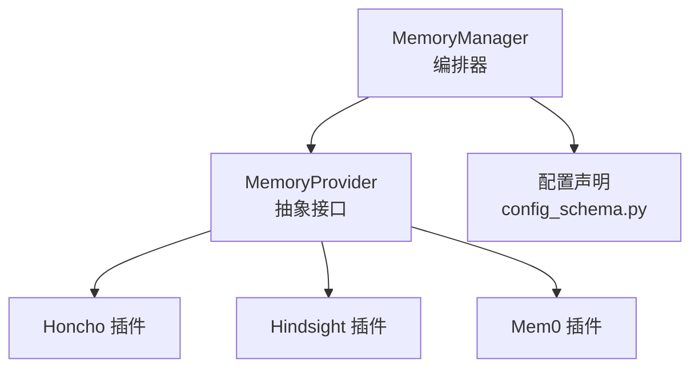
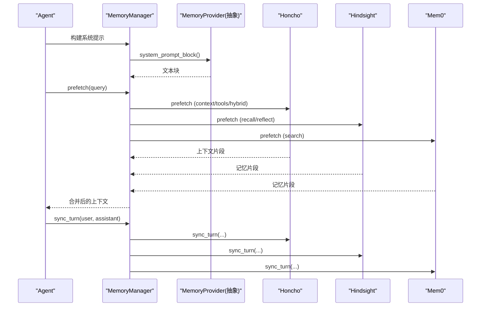
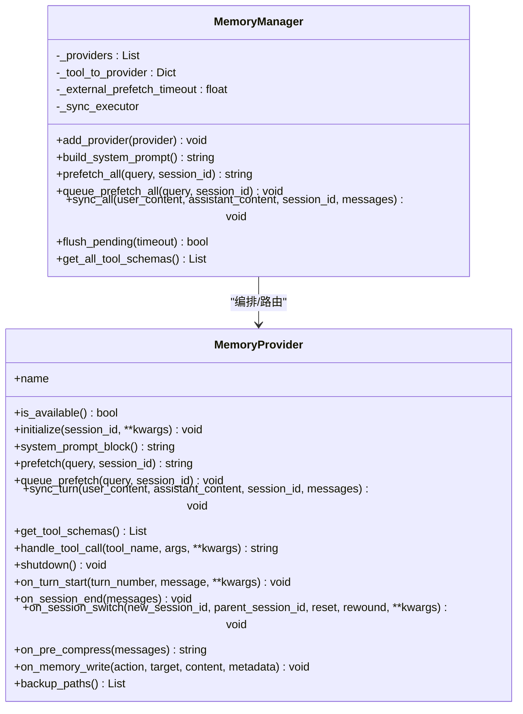
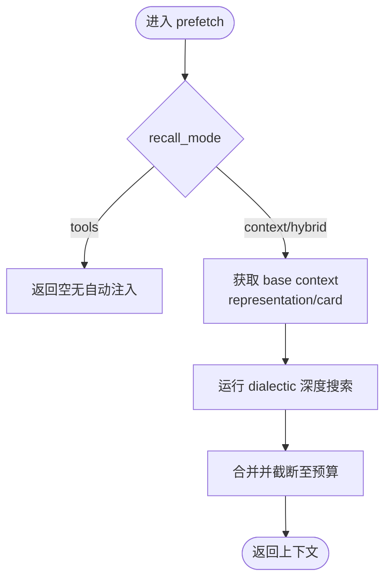
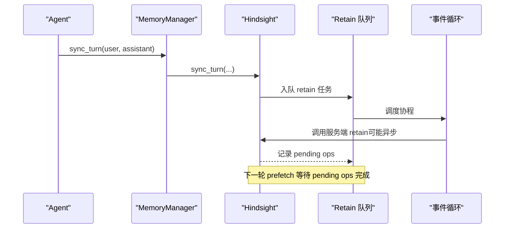
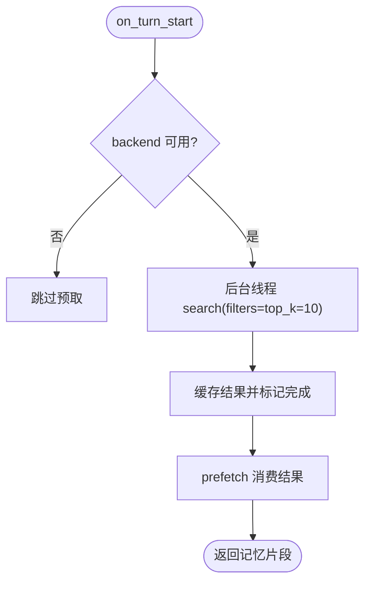
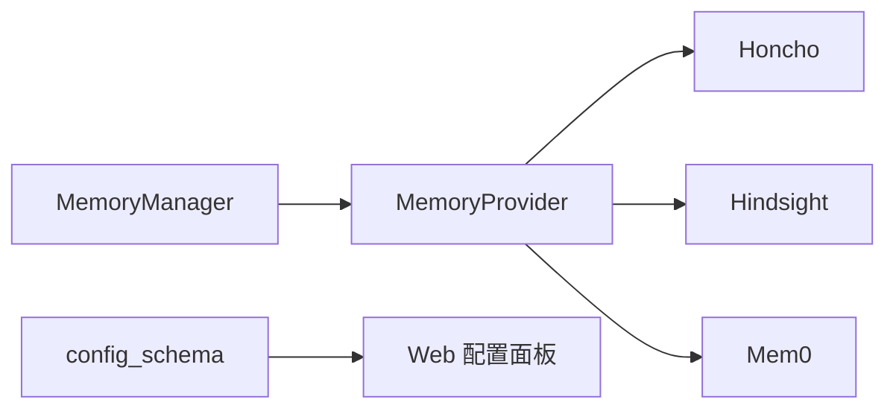

# 记忆系统

<cite>
**本文引用的文件**
- [agent/memory_manager.py](file://agent/memory_manager.py)
- [agent/memory_provider.py](file://agent/memory_provider.py)
- [plugins/memory/config_schema.py](file://plugins/memory/config_schema.py)
- [plugins/memory/honcho/__init__.py](file://plugins/memory/honcho/__init__.py)
- [plugins/memory/hindsight/__init__.py](file://plugins/memory/hindsight/__init__.py)
- [plugins/memory/mem0/__init__.py](file://plugins/memory/mem0/__init__.py)
</cite>

## 目录
1. [简介](#简介)
2. [项目结构](#项目结构)
3. [核心组件](#核心组件)
4. [架构总览](#架构总览)
5. [详细组件分析](#详细组件分析)
6. [依赖关系分析](#依赖关系分析)
7. [性能考量](#性能考量)
8. [故障排查指南](#故障排查指南)
9. [结论](#结论)
10. [附录](#附录)

## 简介
本文件为 Sparkii Agent 的记忆系统提供全面文档，覆盖短期与长期记忆的存储机制、索引策略与检索算法；用户画像构建（偏好学习、行为分析与个性化定制）；语义索引技术（向量嵌入、相似度计算与模糊匹配）；记忆提供者架构（支持多种后端存储）；记忆同步机制（冲突解决、版本控制与数据一致性）；记忆查询 API 与高级检索示例；以及隐私保护、数据安全与性能优化的最佳实践。

## 项目结构
记忆系统由“抽象接口 + 管理器 + 多插件实现”构成：
- 抽象接口：MemoryProvider 定义统一生命周期与工具暴露能力。
- 管理器：MemoryManager 负责注册/编排多个提供者，统一注入系统提示、预取上下文、回合后同步与后台调度。
- 插件实现：Honcho、Hindsight、Mem0 等作为外部记忆后端，各自实现持久化、检索与工具调用。
- 配置声明：config_schema.py 以声明式方式描述各提供者的配置项，驱动通用 UI 与读写逻辑。

**图表来源**
- [agent/memory_manager.py:364-503](file://agent/memory_manager.py#L364-L503)
- [agent/memory_provider.py:81-190](file://agent/memory_provider.py#L81-L190)
- [plugins/memory/config_schema.py:94-145](file://plugins/memory/config_schema.py#L94-L145)

**章节来源**
- [agent/memory_manager.py:1-24](file://agent/memory_manager.py#L1-L24)
- [agent/memory_provider.py:1-32](file://agent/memory_provider.py#L1-L32)
- [plugins/memory/config_schema.py:1-20](file://plugins/memory/config_schema.py#L1-L20)

## 核心组件
- MemoryProvider 抽象类：定义 is_available、initialize、system_prompt_block、prefetch、queue_prefetch、sync_turn、get_tool_schemas、handle_tool_call、shutdown 及若干可选钩子（on_turn_start、on_session_end、on_session_switch、on_pre_compress、on_memory_write、backup_paths）。
- MemoryManager：单点集成入口，维护最多一个外部提供者，统一注入系统提示、预取上下文、回合后同步，并提供后台执行器保证顺序写入与超时隔离。
- 配置声明：ProviderConfigSchema 与 ProviderField 描述字段类型、是否密钥、作用域与默认值，供 Web UI 渲染与读写。

关键职责与交互：
- 预取（prefetch）：在每轮对话前召回相关上下文，可异步预热并在首回合等待有限时间。
- 同步（sync_turn）：在每轮结束后将对话写入后端，使用单工作线程串行化，避免阻塞主流程。
- 工具暴露：聚合各提供者的工具 schema，并屏蔽与核心工具名冲突的条目。

**章节来源**
- [agent/memory_provider.py:81-190](file://agent/memory_provider.py#L81-L190)
- [agent/memory_manager.py:364-503](file://agent/memory_manager.py#L364-L503)
- [plugins/memory/config_schema.py:43-103](file://plugins/memory/config_schema.py#L43-L103)

## 架构总览
下图展示从请求到记忆系统的完整路径：管理器协调多个提供者，每个提供者实现各自的持久化与检索策略，并通过工具暴露给模型进行主动查询或自动注入。

**图表来源**
- [agent/memory_manager.py:486-545](file://agent/memory_manager.py#L486-L545)
- [agent/memory_manager.py:638-694](file://agent/memory_manager.py#L638-L694)
- [plugins/memory/honcho/__init__.py:656-700](file://plugins/memory/honcho/__init__.py#L656-L700)
- [plugins/memory/hindsight/__init__.py:305-354](file://plugins/memory/hindsight/__init__.py#L305-L354)
- [plugins/memory/mem0/__init__.py:385-413](file://plugins/memory/mem0/__init__.py#L385-L413)

## 详细组件分析

### 记忆提供者抽象与管理器
- 抽象接口：提供统一的初始化、预取、同步、工具暴露与生命周期钩子，确保不同后端一致接入。
- 管理器：
  - 仅允许一个外部提供者，避免工具 schema 膨胀与冲突。
  - 通过后台线程池串行化写入，保证 turn N 先于 turn N+1 落地。
  - 对外部提供者预取设置超时，防止慢/卡死的后端阻塞响应。
  - 清理内部标记与流式 scrubbing，避免泄露内部上下文标签。

**图表来源**
- [agent/memory_provider.py:81-190](file://agent/memory_provider.py#L81-L190)
- [agent/memory_manager.py:364-503](file://agent/memory_manager.py#L364-L503)
- [agent/memory_manager.py:698-757](file://agent/memory_manager.py#L698-L757)

**章节来源**
- [agent/memory_provider.py:81-190](file://agent/memory_provider.py#L81-L190)
- [agent/memory_manager.py:364-503](file://agent/memory_manager.py#L364-L503)
- [agent/memory_manager.py:698-757](file://agent/memory_manager.py#L698-L757)

### Honcho 插件（AI 原生跨会话用户建模）
- 模式：context / tools / hybrid，支持自动注入与工具访问。
- 预取：分层组合 base context（representation + card）与 dialectic 补充，首回合可等待有限时间。
- 工具：profile、search、reasoning、context、conclude，分别用于读取卡片、混合检索、综合推理、快照获取与持久结论。
- 会话管理：延迟初始化、后台预热、认证失败提示与回退。

**图表来源**
- [plugins/memory/honcho/__init__.py:656-700](file://plugins/memory/honcho/__init__.py#L656-L700)
- [plugins/memory/honcho/__init__.py:699-800](file://plugins/memory/honcho/__init__.py#L699-L800)

**章节来源**
- [plugins/memory/honcho/__init__.py:1-14](file://plugins/memory/honcho/__init__.py#L1-L14)
- [plugins/memory/honcho/__init__.py:237-313](file://plugins/memory/honcho/__init__.py#L237-L313)
- [plugins/memory/honcho/__init__.py:656-700](file://plugins/memory/honcho/__init__.py#L656-L700)
- [plugins/memory/honcho/__init__.py:699-800](file://plugins/memory/honcho/__init__.py#L699-L800)

### Hindsight 插件（长期记忆、知识图谱、多策略检索）
- 模式：cloud / local（嵌入式守护进程），支持向量检索、实体解析与重排序。
- 配置：支持 profile-scoped 与 legacy 路径，环境变量覆盖；端口健康检查宽限时间可调。
- 工具：retain（保留）、recall（检索）、reflect（反思合成）。
- 并发与一致性：单写队列 + 事件循环；服务端异步 retain 时通过操作状态轮询保障读后一致。

**图表来源**
- [plugins/memory/hindsight/__init__.py:305-354](file://plugins/memory/hindsight/__init__.py#L305-L354)
- [plugins/memory/hindsight/__init__.py:681-780](file://plugins/memory/hindsight/__init__.py#L681-L780)
- [plugins/memory/hindsight/__init__.py:269-293](file://plugins/memory/hindsight/__init__.py#L269-L293)

**章节来源**
- [plugins/memory/hindsight/__init__.py:1-29](file://plugins/memory/hindsight/__init__.py#L1-L29)
- [plugins/memory/hindsight/__init__.py:361-404](file://plugins/memory/hindsight/__init__.py#L361-L404)
- [plugins/memory/hindsight/__init__.py:681-780](file://plugins/memory/hindsight/__init__.py#L681-L780)

### Mem0 插件（服务端事实抽取、语义检索、去重）
- 模式：platform（云）、self-hosted（HTTP）、oss（自托管），支持 rerank。
- 工具：search、add、update、delete，提供完整的记忆 CRUD。
- 容错：熔断器（连续失败阈值与冷却期），错误分类避免误触发。
- 预取：后台线程搜索并缓存结果，短等待热路径提升首响体验。

**图表来源**
- [plugins/memory/mem0/__init__.py:414-477](file://plugins/memory/mem0/__init__.py#L414-L477)
- [plugins/memory/mem0/__init__.py:294-335](file://plugins/memory/mem0/__init__.py#L294-L335)

**章节来源**
- [plugins/memory/mem0/__init__.py:1-31](file://plugins/memory/mem0/__init__.py#L1-L31)
- [plugins/memory/mem0/__init__.py:78-110](file://plugins/memory/mem0/__init__.py#L78-L110)
- [plugins/memory/mem0/__init__.py:117-187](file://plugins/memory/mem0/__init__.py#L117-L187)
- [plugins/memory/mem0/__init__.py:337-383](file://plugins/memory/mem0/__init__.py#L337-L383)
- [plugins/memory/mem0/__init__.py:414-477](file://plugins/memory/mem0/__init__.py#L414-L477)

### 配置与提供者发现
- 配置声明：ProviderConfigSchema 与 ProviderField 描述字段类型、是否密钥、作用域与默认值，支持 flat_json 与 honcho_host_block 存储。
- 动态加载：按路径加载 provider 的 config_schema.py，避免引入 agent 运行时污染 web server。
- 通用渲染：Web 层根据声明渲染配置面板与读写接口。

**章节来源**
- [plugins/memory/config_schema.py:1-20](file://plugins/memory/config_schema.py#L1-L20)
- [plugins/memory/config_schema.py:43-103](file://plugins/memory/config_schema.py#L43-L103)
- [plugins/memory/config_schema.py:112-145](file://plugins/memory/config_schema.py#L112-L145)

## 依赖关系分析
- 管理器依赖抽象接口，不感知具体后端细节。
- 各插件独立实现持久化与检索，通过工具 schema 暴露能力。
- 配置模块解耦 UI 与后端，新增提供者仅需声明配置。

**图表来源**
- [agent/memory_manager.py:364-503](file://agent/memory_manager.py#L364-L503)
- [plugins/memory/config_schema.py:94-145](file://plugins/memory/config_schema.py#L94-L145)

**章节来源**
- [agent/memory_manager.py:364-503](file://agent/memory_manager.py#L364-L503)
- [plugins/memory/config_schema.py:94-145](file://plugins/memory/config_schema.py#L94-L145)

## 性能考量
- 后台串行写入：MemoryManager 使用单工作线程序列化所有提供者的 sync_turn，避免竞争与乱序。
- 超时隔离：外部提供者 prefetch 设置超时，防止慢/卡死影响响应。
- 懒初始化与预热：Honcho 支持延迟初始化与首轮有限等待；Hindsight 使用共享事件循环减少资源开销。
- 熔断与降级：Mem0 使用熔断器避免雪崩；Hindsight 支持本地/云端自适应。
- 流式清理：MemoryManager 提供 StreamingContextScrubber，避免内部上下文标签泄漏。

**章节来源**
- [agent/memory_manager.py:42-48](file://agent/memory_manager.py#L42-L48)
- [agent/memory_manager.py:547-595](file://agent/memory_manager.py#L547-L595)
- [agent/memory_manager.py:698-757](file://agent/memory_manager.py#L698-L757)
- [plugins/memory/honcho/__init__.py:425-475](file://plugins/memory/honcho/__init__.py#L425-L475)
- [plugins/memory/hindsight/__init__.py:269-293](file://plugins/memory/hindsight/__init__.py#L269-L293)
- [plugins/memory/mem0/__init__.py:294-335](file://plugins/memory/mem0/__init__.py#L294-L335)

## 故障排查指南
- 外部提供者超时：检查 prefetch 超时配置与网络状况；确认服务健康。
- 认证失败：Honcho 会记录一次性通知；Mem0 熔断器会在连续失败后暂停调用。
- 写入未生效：Hindsight 异步 retain 需等待操作完成；可通过 pending ops 状态判断。
- 工具冲突：MemoryManager 会拒绝与核心工具名冲突的提供者工具。
- 配置加载失败：检查 config_schema.py 是否存在且可导入；确认密钥与环境变量正确。

**章节来源**
- [agent/memory_manager.py:547-595](file://agent/memory_manager.py#L547-L595)
- [plugins/memory/honcho/__init__.py:603-610](file://plugins/memory/honcho/__init__.py#L603-L610)
- [plugins/memory/mem0/__init__.py:294-335](file://plugins/memory/mem0/__init__.py#L294-L335)
- [plugins/memory/hindsight/__init__.py:732-773](file://plugins/memory/hindsight/__init__.py#L732-L773)

## 结论
Sparkii 记忆系统通过抽象接口与管理器实现了多后端统一接入，结合 Honcho、Hindsight、Mem0 等插件，提供了灵活的短期与长期记忆能力。系统在性能、可靠性与可扩展性方面做了充分设计：后台串行写入、超时隔离、懒初始化、熔断降级与流式清理。配合声明式配置，新增后端成本低、风险可控。建议在生产环境中合理配置超时、预算与缓存策略，并结合审计与监控持续优化。

## 附录

### 短期与长期记忆存储机制
- 短期记忆：通过 prefetch 在每轮前注入相关上下文，适合当前会话的即时回忆。
- 长期记忆：通过 sync_turn 持久化到后端，支持跨会话检索与综合推理。
- 索引策略：Hindsight 使用向量检索与实体图；Mem0 使用服务端抽取与去重；Honcho 使用 representation/card 与消息历史混合检索。
- 检索算法：语义相似度、关键词匹配、重排序与 RRF（Reciprocal Rank Fusion）等。

**章节来源**
- [plugins/memory/honcho/__init__.py:68-158](file://plugins/memory/honcho/__init__.py#L68-L158)
- [plugins/memory/hindsight/__init__.py:305-354](file://plugins/memory/hindsight/__init__.py#L305-L354)
- [plugins/memory/mem0/__init__.py:117-187](file://plugins/memory/mem0/__init__.py#L117-L187)

### 用户画像构建系统
- 偏好学习：通过 conclude/retain/add 记录稳定偏好与约束。
- 行为分析：dialectic 推理与 reflect 综合多源信息生成洞察。
- 个性化定制：基于 representation/card 与 observation 层提供精准上下文。

**章节来源**
- [plugins/memory/honcho/__init__.py:184-227](file://plugins/memory/honcho/__init__.py#L184-L227)
- [plugins/memory/hindsight/__init__.py:341-354](file://plugins/memory/hindsight/__init__.py#L341-L354)
- [plugins/memory/mem0/__init__.py:138-171](file://plugins/memory/mem0/__init__.py#L138-L171)

### 语义索引技术与模糊匹配
- 向量嵌入：Hindsight 与 Mem0 均支持语义检索；Hindsight 支持本地/云端两种模式。
- 相似度计算：服务端重排序与证据 grounding 提升相关性。
- 模糊匹配：关键词与语义结合，提高召回率与鲁棒性。

**章节来源**
- [plugins/memory/hindsight/__init__.py:305-354](file://plugins/memory/hindsight/__init__.py#L305-L354)
- [plugins/memory/mem0/__init__.py:117-187](file://plugins/memory/mem0/__init__.py#L117-L187)

### 记忆提供者架构与后端支持
- 抽象接口：统一生命周期与工具暴露。
- 后端支持：Honcho（AI 原生）、Hindsight（向量/图）、Mem0（平台/自托管/OSS）。
- 配置声明：ProviderConfigSchema 驱动通用 UI 与读写。

**章节来源**
- [agent/memory_provider.py:81-190](file://agent/memory_provider.py#L81-L190)
- [plugins/memory/config_schema.py:94-145](file://plugins/memory/config_schema.py#L94-L145)

### 记忆同步机制
- 冲突解决：Hindsight 使用 update_mode='append'（若支持）避免覆盖；否则使用 per-process document_id。
- 版本控制：pending ops 跟踪服务端异步写入状态。
- 一致性保证：下一轮 prefetch 等待 retain 完成，确保读后一致。

**章节来源**
- [plugins/memory/hindsight/__init__.py:217-252](file://plugins/memory/hindsight/__init__.py#L217-L252)
- [plugins/memory/hindsight/__init__.py:732-773](file://plugins/memory/hindsight/__init__.py#L732-L773)

### 记忆查询 API 与高级检索示例
- Honcho：
  - 读取卡片：honcho_profile(peer="user")
  - 混合检索：honcho_search(query="项目决策", max_tokens=800)
  - 综合推理：honcho_reasoning(query="沟通偏好", reasoning_level="medium")
  - 快照：honcho_context(peer="user")
  - 持久结论：honcho_conclude(conclusion="...")
- Hindsight：
  - 保留：hindsight_retain(content="...", context="偏好", tags=["用户"])
  - 检索：hindsight_recall(query="项目计划")
  - 反思：hindsight_reflect(query="如何改进协作？")
- Mem0：
  - 搜索：mem0_search(query="旅行偏好", top_k=10, rerank=true)
  - 添加：mem0_add(content="喜欢安静环境")
  - 更新：mem0_update(memory_id="...", text="新内容")
  - 删除：mem0_delete(memory_id="...")

**章节来源**
- [plugins/memory/honcho/__init__.py:36-227](file://plugins/memory/honcho/__init__.py#L36-L227)
- [plugins/memory/hindsight/__init__.py:305-354](file://plugins/memory/hindsight/__init__.py#L305-L354)
- [plugins/memory/mem0/__init__.py:117-187](file://plugins/memory/mem0/__init__.py#L117-L187)

### 隐私保护、数据安全与性能优化最佳实践
- 隐私保护：
  - 敏感字段以 secret 形式存储，避免明文暴露。
  - 提供 on_memory_write 钩子镜像内置写入，便于审计与脱敏。
- 数据安全：
  - 配置文件权限收紧（如 0o600），避免密钥泄露。
  - 使用安全写入与原子替换，降低损坏风险。
- 性能优化：
  - 合理设置 prefetch 超时与预算，避免过长等待。
  - 使用懒初始化与预热，平衡首响与准确性。
  - 启用熔断与降级，提升鲁棒性。

**章节来源**
- [plugins/memory/config_schema.py:52-85](file://plugins/memory/config_schema.py#L52-L85)
- [plugins/memory/hindsight/__init__.py:565-620](file://plugins/memory/hindsight/__init__.py#L565-L620)
- [plugins/memory/mem0/__init__.py:294-335](file://plugins/memory/mem0/__init__.py#L294-L335)