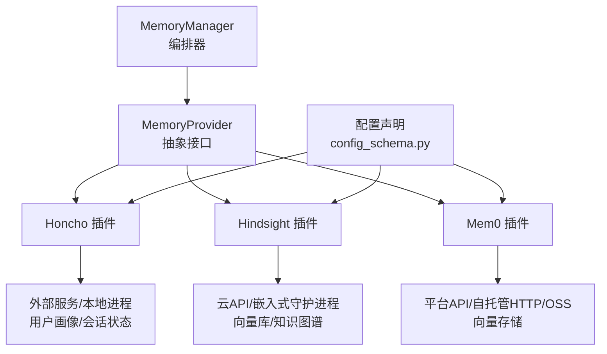
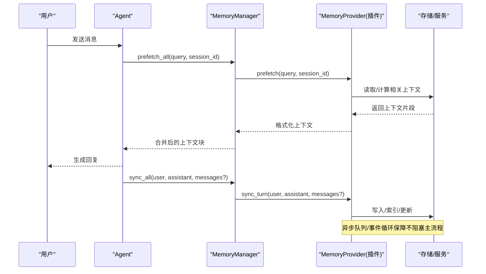
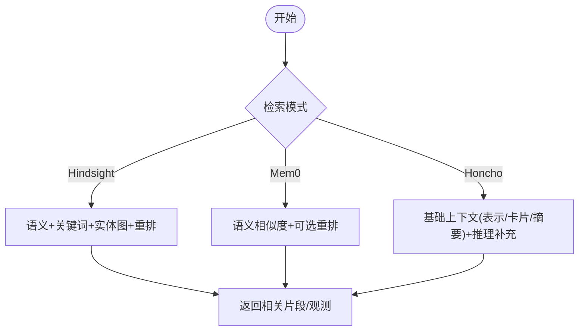
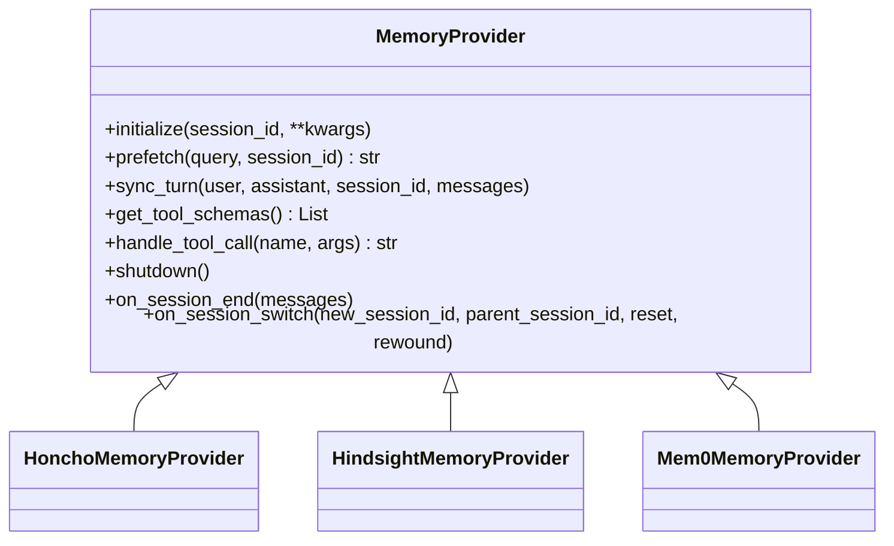
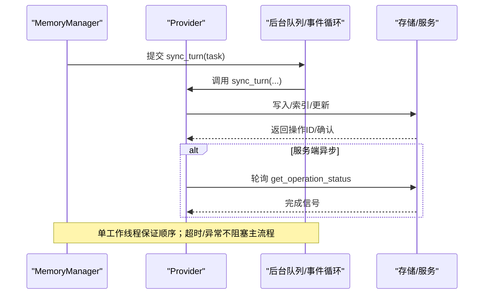
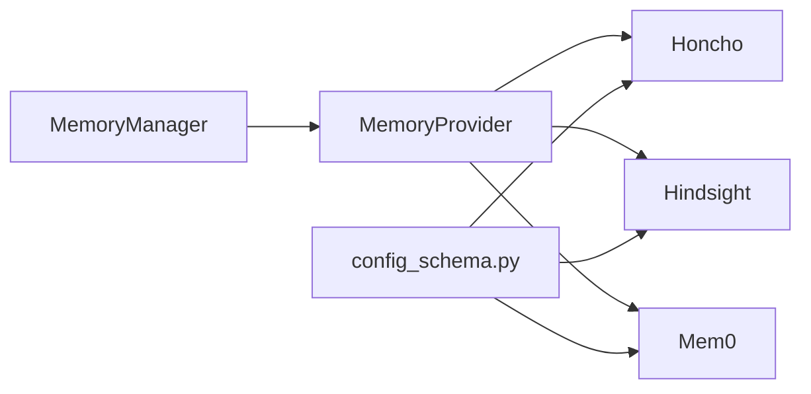

# 长期记忆

<cite>
**本文引用的文件**
- [agent/memory_manager.py](file://agent/memory_manager.py)
- [agent/memory_provider.py](file://agent/memory_provider.py)
- [plugins/memory/honcho/__init__.py](file://plugins/memory/honcho/__init__.py)
- [plugins/memory/hindsight/__init__.py](file://plugins/memory/hindsight/__init__.py)
- [plugins/memory/mem0/__init__.py](file://plugins/memory/mem0/__init__.py)
- [plugins/memory/config_schema.py](file://plugins/memory/config_schema.py)
</cite>

## 目录
1. [简介](#简介)
2. [项目结构](#项目结构)
3. [核心组件](#核心组件)
4. [架构总览](#架构总览)
5. [详细组件分析](#详细组件分析)
6. [依赖关系分析](#依赖关系分析)
7. [性能考量](#性能考量)
8. [故障排查指南](#故障排查指南)
9. [结论](#结论)
10. [附录](#附录)

## 简介
本文件为 Hermes Agent 的长期记忆系统提供全面文档，覆盖持久化存储架构（SQLite、PostgreSQL 等后端）、语义索引技术（向量嵌入、相似度计算与模糊匹配）、记忆条目生命周期管理（创建、更新、删除、归档）、记忆同步机制（冲突解决、版本控制、一致性保证）、记忆检索 API（查询语法、过滤条件、排序）、备份与恢复方案（导出格式、迁移工具、灾难恢复），以及隐私与安全（加密、访问控制、审计日志）。内容基于仓库中记忆插件与核心编排代码的实际实现进行归纳与可视化。

## 项目结构
Hermes 的记忆系统采用“统一编排 + 多提供者”的插件化设计：
- 核心编排层：MemoryManager 负责注册/调度 MemoryProvider，统一注入系统提示、预取上下文、回合后同步与工具暴露。
- 抽象接口层：MemoryProvider 定义标准生命周期与可选钩子，屏蔽不同后端差异。
- 插件实现层：Honcho、Hindsight、Mem0 等插件各自封装其存储与检索能力，并通过统一的工具集暴露给模型。
- 配置声明层：config_schema.py 以声明式方式描述各插件的配置字段、存储位置与 UI 渲染规则。

图表来源
- [agent/memory_manager.py:364-470](file://agent/memory_manager.py#L364-L470)
- [agent/memory_provider.py:81-190](file://agent/memory_provider.py#L81-L190)
- [plugins/memory/honcho/__init__.py:237-335](file://plugins/memory/honcho/__init__.py#L237-L335)
- [plugins/memory/hindsight/__init__.py:681-753](file://plugins/memory/hindsight/__init__.py#L681-L753)
- [plugins/memory/mem0/__init__.py:194-261](file://plugins/memory/mem0/__init__.py#L194-L261)
- [plugins/memory/config_schema.py:43-103](file://plugins/memory/config_schema.py#L43-L103)

章节来源
- [agent/memory_manager.py:364-470](file://agent/memory_manager.py#L364-L470)
- [agent/memory_provider.py:81-190](file://agent/memory_provider.py#L81-L190)
- [plugins/memory/config_schema.py:43-103](file://plugins/memory/config_schema.py#L43-L103)

## 核心组件
- MemoryManager：单点编排，限制仅一个外部插件同时运行；负责系统提示拼接、回合前预取、回合后异步同步、工具模式开关与超时保护。
- MemoryProvider：抽象基类，定义 initialize、prefetch、sync_turn、get_tool_schemas、handle_tool_call、shutdown 等生命周期方法，以及 on_session_switch、on_pre_compress、backup_paths 等扩展钩子。
- 插件实现：
  - Honcho：面向用户画像与对话历史的混合检索（上下文注入 + 工具调用），支持推理深度与首轮预热。
  - Hindsight：知识图谱与多策略检索（语义+关键词+实体图+重排），支持云端与本地嵌入式守护进程。
  - Mem0：服务端事实抽取与语义搜索，支持平台API、自托管HTTP与OSS三种模式，内置熔断器与缓存。

章节来源
- [agent/memory_manager.py:364-800](file://agent/memory_manager.py#L364-L800)
- [agent/memory_provider.py:81-358](file://agent/memory_provider.py#L81-L358)
- [plugins/memory/honcho/__init__.py:237-800](file://plugins/memory/honcho/__init__.py#L237-L800)
- [plugins/memory/hindsight/__init__.py:681-800](file://plugins/memory/hindsight/__init__.py#L681-L800)
- [plugins/memory/mem0/__init__.py:194-629](file://plugins/memory/mem0/__init__.py#L194-L629)

## 架构总览
记忆系统在运行时遵循“先预取、再回答、后同步”的流程，并提供工具直查作为兜底。

图表来源
- [agent/memory_manager.py:525-694](file://agent/memory_manager.py#L525-L694)
- [agent/memory_provider.py:132-170](file://agent/memory_provider.py#L132-L170)
- [plugins/memory/honcho/__init__.py:699-800](file://plugins/memory/honcho/__init__.py#L699-L800)
- [plugins/memory/hindsight/__init__.py:720-780](file://plugins/memory/hindsight/__init__.py#L720-L780)
- [plugins/memory/mem0/__init__.py:463-512](file://plugins/memory/mem0/__init__.py#L463-L512)

## 详细组件分析

### 持久化存储架构与数据模型
- 抽象层：MemoryProvider 将具体存储细节隐藏，通过 initialize/sync_turn/prefetch 暴露一致能力。
- Honcho：维护用户/代理的“卡片”“表示”“摘要”和最近消息，支持跨会话的用户建模与结论持久化。
- Hindsight：支持云端API与本地嵌入式守护进程，具备知识图谱、实体解析与多策略检索；可配置预算、标签、观察范围等。
- Mem0：支持平台API、自托管HTTP与OSS三种模式，使用向量存储进行语义检索，并可在服务端进行事实抽取与去重。

注意：仓库未直接包含 SQLite/PostgreSQL 的具体表结构定义；上述存储形态由插件与其客户端/守护进程实现。若需对接自有数据库，可通过实现 MemoryProvider 并在 sync_turn/prefetch 中调用相应驱动完成。

章节来源
- [agent/memory_provider.py:81-190](file://agent/memory_provider.py#L81-L190)
- [plugins/memory/honcho/__init__.py:237-335](file://plugins/memory/honcho/__init__.py#L237-L335)
- [plugins/memory/hindsight/__init__.py:681-800](file://plugins/memory/hindsight/__init__.py#L681-L800)
- [plugins/memory/mem0/__init__.py:194-261](file://plugins/memory/mem0/__init__.py#L194-L261)

### 语义索引技术与检索算法
- 向量嵌入与相似度：Hindsight 与 Mem0 均依赖各自的向量库/云服务进行语义检索；Hindsight 还结合关键词与实体图遍历，Mem0 支持可选重排。
- 模糊匹配：Hindsight 的检索说明中包含“keyword matching”，用于增强召回；Mem0 通过语义相似度与可选重排提升相关性。
- 查询重写与首轮预热：Honcho 支持查询重写与首轮预热，在 context/hybrid 模式下优先构建基础上下文，再叠加推理结果。

图表来源
- [plugins/memory/hindsight/__init__.py:305-354](file://plugins/memory/hindsight/__init__.py#L305-L354)
- [plugins/memory/mem0/__init__.py:117-187](file://plugins/memory/mem0/__init__.py#L117-L187)
- [plugins/memory/honcho/__init__.py:699-800](file://plugins/memory/honcho/__init__.py#L699-L800)

章节来源
- [plugins/memory/hindsight/__init__.py:305-354](file://plugins/memory/hindsight/__init__.py#L305-L354)
- [plugins/memory/mem0/__init__.py:117-187](file://plugins/memory/mem0/__init__.py#L117-L187)
- [plugins/memory/honcho/__init__.py:699-800](file://plugins/memory/honcho/__init__.py#L699-L800)

### 记忆条目生命周期管理
- 创建：通过插件工具或自动同步写入。例如 Hindsight 的 retain、Mem0 的 add、Honcho 的 conclude/profile 等。
- 更新：Mem0 提供 update；Honcho/Hindsight 通过追加/覆盖策略与版本能力更新。
- 删除：Mem0 提供 delete；Honcho 支持按 ID 删除结论；Hindsight 通常通过服务端能力管理。
- 归档：插件通过 on_session_end/on_session_switch 处理会话边界与切换时的状态清理或迁移。

图表来源
- [agent/memory_provider.py:81-358](file://agent/memory_provider.py#L81-L358)
- [plugins/memory/honcho/__init__.py:237-800](file://plugins/memory/honcho/__init__.py#L237-L800)
- [plugins/memory/hindsight/__init__.py:681-800](file://plugins/memory/hindsight/__init__.py#L681-L800)
- [plugins/memory/mem0/__init__.py:194-629](file://plugins/memory/mem0/__init__.py#L194-L629)

章节来源
- [agent/memory_provider.py:81-358](file://agent/memory_provider.py#L81-L358)
- [plugins/memory/honcho/__init__.py:237-800](file://plugins/memory/honcho/__init__.py#L237-L800)
- [plugins/memory/hindsight/__init__.py:681-800](file://plugins/memory/hindsight/__init__.py#L681-L800)
- [plugins/memory/mem0/__init__.py:194-629](file://plugins/memory/mem0/__init__.py#L194-L629)

### 记忆同步机制（冲突解决、版本控制、一致性）
- 顺序保证：MemoryManager 使用单工作线程串行执行所有 provider 的 sync_turn，确保 turn N 先于 turn N+1 落地。
- 异步非阻塞：sync_turn 在后台线程/事件循环中执行，避免阻塞主对话路径。
- 读后写一致性：Hindsight 对服务端异步 retain 会等待操作完成后再进行下一轮 warm prefetch；Mem0 通过熔断器与重试降低失败影响。
- 会话切换：on_session_switch 允许插件在会话ID变化时重置或迁移内部状态，避免跨会话污染。

图表来源
- [agent/memory_manager.py:638-757](file://agent/memory_manager.py#L638-L757)
- [plugins/memory/hindsight/__init__.py:720-780](file://plugins/memory/hindsight/__init__.py#L720-L780)
- [plugins/memory/mem0/__init__.py:479-512](file://plugins/memory/mem0/__init__.py#L479-L512)

章节来源
- [agent/memory_manager.py:638-757](file://agent/memory_manager.py#L638-L757)
- [plugins/memory/hindsight/__init__.py:720-780](file://plugins/memory/hindsight/__init__.py#L720-L780)
- [plugins/memory/mem0/__init__.py:479-512](file://plugins/memory/mem0/__init__.py#L479-L512)

### 记忆检索 API 使用方法
- Honcho 工具：
  - honcho_profile：快速读取/写入用户卡片。
  - honcho_search：混合检索（语义+关键词），返回原始片段。
  - honcho_reasoning：自然语言问答，进行综合推理（可调深度）。
  - honcho_context：获取当前会话快照（摘要/表示/卡片/最近消息）。
  - honcho_conclude：持久化结论（增删查）。
- Hindsight 工具：
  - hindsight_retain：存储信息，自动提取结构化事实并索引。
  - hindsight_recall：语义+关键词+实体图+重排的检索。
  - hindsight_reflect：基于长记忆的综合回答。
- Mem0 工具：
  - mem0_search：语义检索，支持 top_k 与 rerank。
  - mem0_add：存储事实（服务端抽取或直存）。
  - mem0_update：按 ID 更新文本。
  - mem0_delete：按 ID 删除。

查询语法与过滤：
- 各工具的参数定义见对应 schema；Mem0 支持 filters（如 user_id）与 top_k/rerank；Hindsight 支持 tags、observation scopes 等；Honcho 支持 peer、reasoning_level 等。

排序：
- Hindsight/Mem0 默认按相关性排序；Mem0 支持 rerank；Honcho 的 search 返回 RRF 排名片段。

章节来源
- [plugins/memory/honcho/__init__.py:36-230](file://plugins/memory/honcho/__init__.py#L36-L230)
- [plugins/memory/hindsight/__init__.py:305-354](file://plugins/memory/hindsight/__init__.py#L305-L354)
- [plugins/memory/mem0/__init__.py:117-187](file://plugins/memory/mem0/__init__.py#L117-L187)

### 备份与恢复方案
- 外部路径声明：插件通过 backup_paths 声明 SPARKII_HOME 之外的关键路径，供 sparkii backup/import 捕获与还原。
  - Honcho：~/.honcho 目录（含全局配置与状态）。
  - Hindsight：~/.hindsight 目录（含配置文件与嵌入式 profile env）。
  - Mem0：通过 save_config 写入 $SPARKII_HOME/mem0.json（受备份范围覆盖）。
- 导出格式：各插件原生配置（JSON/ENV）；导入时由框架按路径恢复。
- 灾难恢复：若外部服务不可用，插件提供降级策略（如 Honcho 首轮等待超时、Hindsight 回退到 per-process document_id、Mem0 熔断器）。

章节来源
- [plugins/memory/honcho/__init__.py:240-251](file://plugins/memory/honcho/__init__.py#L240-L251)
- [plugins/memory/hindsight/__init__.py:684-692](file://plugins/memory/hindsight/__init__.py#L684-L692)
- [plugins/memory/mem0/__init__.py:236-249](file://plugins/memory/mem0/__init__.py#L236-L249)
- [agent/memory_provider.py:341-357](file://agent/memory_provider.py#L341-L357)

### 隐私保护与安全考虑
- 配置安全：
  - 敏感字段通过 secret 类型与 .env 管理（如 HONCHO_API_KEY、HINDSIGHT_API_KEY、MEM0_API_KEY）。
  - Hindsight 嵌入式 profile env 文件强制 0600 权限，防止明文密钥泄露。
- 访问控制：
  - 插件通过 user_id/agent_id/channel 等元数据进行隔离与视图控制（Mem0 默认按 user_id 过滤）。
- 审计与日志：
  - 各插件在初始化、错误、熔断、超时等关键路径记录日志，便于问题定位与合规审计。
- 数据最小化：
  - 仅注入必要上下文（如 Honcho 的 memory-context 围栏与系统提示标注），避免无关信息进入模型输入。

章节来源
- [plugins/memory/hindsight/__init__.py:565-620](file://plugins/memory/hindsight/__init__.py#L565-L620)
- [plugins/memory/mem0/__init__.py:372-383](file://plugins/memory/mem0/__init__.py#L372-L383)
- [agent/memory_manager.py:174-179](file://agent/memory_manager.py#L174-L179)

## 依赖关系分析
- MemoryManager 依赖 MemoryProvider 抽象，聚合多个插件，统一暴露工具与系统提示。
- 插件之间相互独立，通过 MemoryProvider 接口解耦；MemoryManager 限制仅一个外部插件同时运行，避免工具名冲突与资源竞争。
- 配置加载与UI渲染依赖 config_schema.py 的声明式字段定义，确保跨平台一致的设置体验。

图表来源
- [agent/memory_manager.py:364-470](file://agent/memory_manager.py#L364-L470)
- [plugins/memory/config_schema.py:43-103](file://plugins/memory/config_schema.py#L43-L103)

章节来源
- [agent/memory_manager.py:364-470](file://agent/memory_manager.py#L364-L470)
- [plugins/memory/config_schema.py:43-103](file://plugins/memory/config_schema.py#L43-L103)

## 性能考量
- 预取与注入：
  - Honcho：首轮基础上下文可等待有限时间，后续刷新走异步；支持 first-turn/every-turn 注入频率与上下文预算。
  - Hindsight：单次请求可能较长（默认120s），通过事件循环与队列避免阻塞；warm prefetch 等待服务端异步 retain 完成。
  - Mem0：prefetch 带短等待（约3秒），失败走熔断器冷却，避免雪崩。
- 并发与序列化：
  - MemoryManager 使用单工作线程串行化 provider 写入，保证顺序且避免竞态。
  - 外部 provider 的 prefetch 使用独立线程并设超时，防止卡死。
- 资源保护：
  - Hindsight 嵌入式守护进程健康检查与空闲超时；Mem0 熔断器阈值与冷却时间；Honcho 背景初始化与懒加载。

[本节为通用指导，无需特定文件引用]

## 故障排查指南
- 插件不可用：
  - 检查 is_available 条件（如 Honcho 的 enabled/api_key/base_url；Hindsight 的 mode/timeout；Mem0 的 mode/host/api_key）。
- 预取为空或延迟：
  - 关注 trivial prompt 过滤（is_trivial_prompt）；检查注入频率与上下文预算；查看首轮等待与超时。
- 同步失败：
  - 查看后台任务是否被拒绝（shutting_down）；检查网络/服务可用性；Mem0 熔断器是否触发。
- 会话切换问题：
  - 确认 on_session_switch 是否正确重置内部状态（如 _session_id、_document_id、计数器）。
- 备份缺失：
  - 核对 backup_paths 是否返回了外部路径；确认 sparkii backup/import 能捕获这些路径。

章节来源
- [agent/memory_provider.py:61-79](file://agent/memory_provider.py#L61-L79)
- [plugins/memory/honcho/__init__.py:306-335](file://plugins/memory/honcho/__init__.py#L306-L335)
- [plugins/memory/hindsight/__init__.py:130-163](file://plugins/memory/hindsight/__init__.py#L130-L163)
- [plugins/memory/mem0/__init__.py:227-234](file://plugins/memory/mem0/__init__.py#L227-L234)
- [agent/memory_manager.py:698-757](file://agent/memory_manager.py#L698-L757)

## 结论
Hermes 的长期记忆系统通过统一的编排层与插件化架构，实现了跨会话的持久化记忆、语义检索与智能推理。各插件在保持能力差异的同时，遵循一致的接口与生命周期，确保了系统的可扩展性与稳定性。通过异步同步、顺序保证、熔断与超时保护等机制，系统在性能与可靠性之间取得平衡。配合声明式配置与备份恢复能力，便于部署与维护。未来可根据业务需求扩展更多存储后端与检索策略。

[本节为总结性内容，无需特定文件引用]

## 附录
- 配置参考：
  - Honcho：api_key、baseUrl、recall_mode、injection_frequency、context_cadence、dialectic_depth 等。
  - Hindsight：mode、apiKey、bankId、budget、timeout、idle_timeout、retain_tags、observation_scopes 等。
  - Mem0：mode、host、user_id、agent_id、rerank 等。
- 工具清单：
  - Honcho：profile、search、reasoning、context、conclude。
  - Hindsight：retain、recall、reflect。
  - Mem0：search、add、update、delete。

章节来源
- [plugins/memory/honcho/__init__.py:36-230](file://plugins/memory/honcho/__init__.py#L36-L230)
- [plugins/memory/hindsight/__init__.py:305-354](file://plugins/memory/hindsight/__init__.py#L305-L354)
- [plugins/memory/mem0/__init__.py:117-187](file://plugins/memory/mem0/__init__.py#L117-L187)