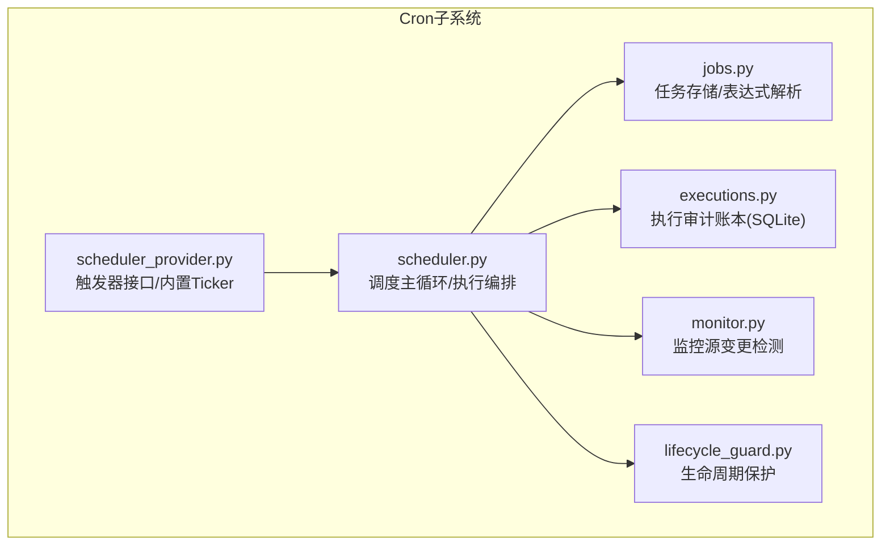
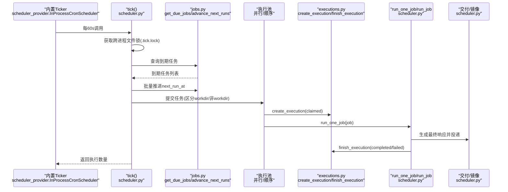
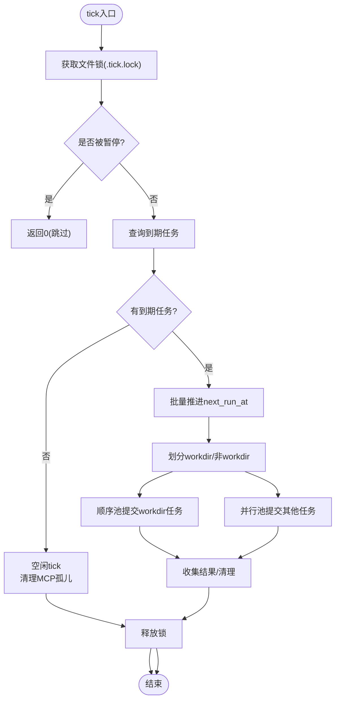
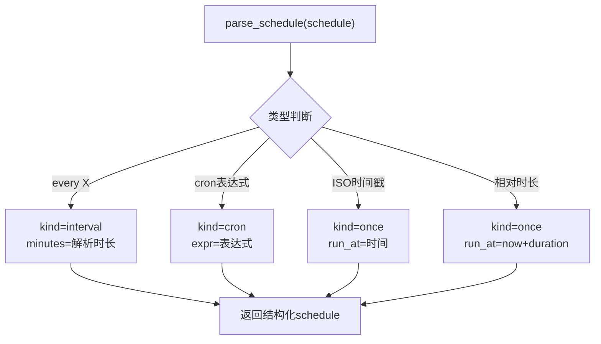
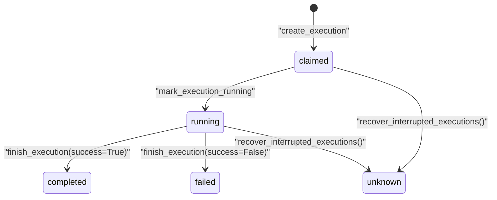
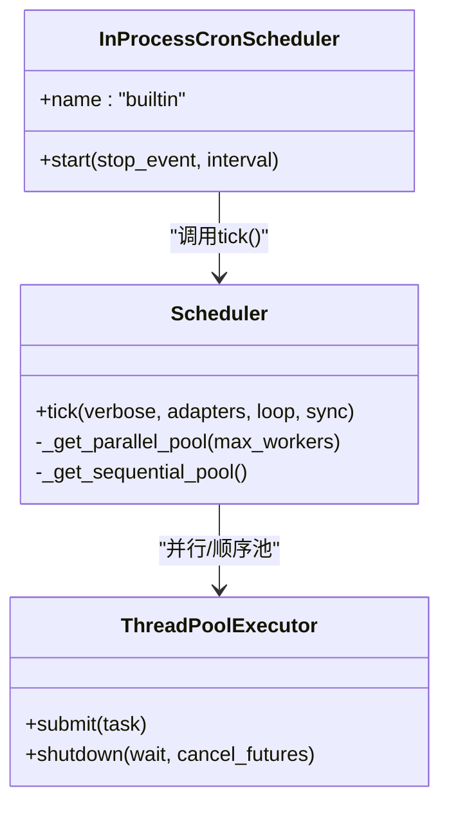
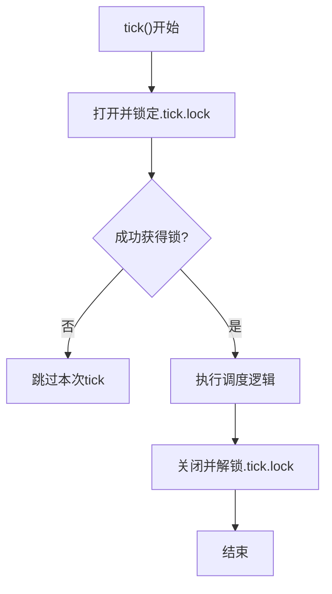
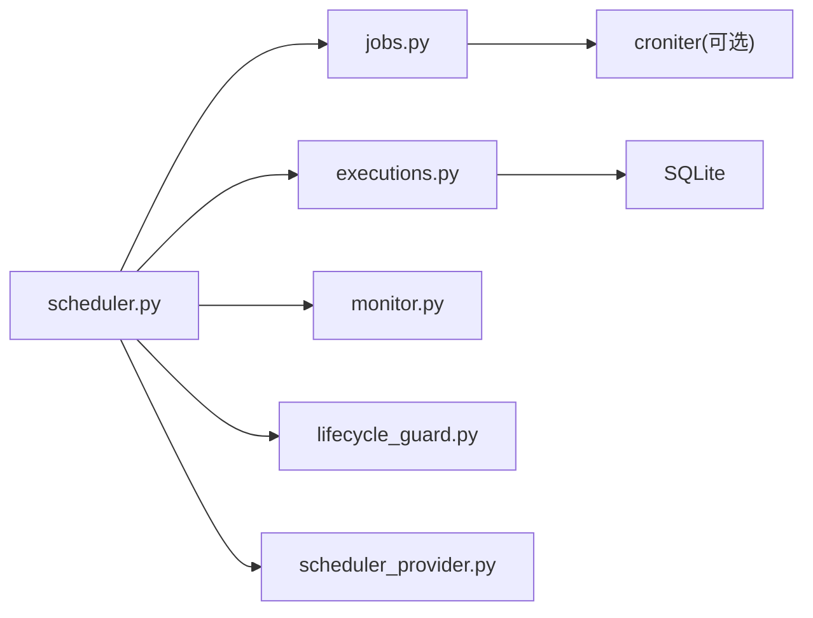

# Cron调度器核心

<cite>
**本文引用的文件**
- [cron/__init__.py](file://cron/__init__.py)
- [cron/scheduler.py](file://cron/scheduler.py)
- [cron/jobs.py](file://cron/jobs.py)
- [cron/executions.py](file://cron/executions.py)
- [cron/lifecycle_guard.py](file://cron/lifecycle_guard.py)
- [cron/monitor.py](file://cron/monitor.py)
- [cron/scheduler_provider.py](file://cron/scheduler_provider.py)
</cite>

## 目录
1. [简介](#简介)
2. [项目结构](#项目结构)
3. [核心组件](#核心组件)
4. [架构总览](#架构总览)
5. [详细组件分析](#详细组件分析)
6. [依赖关系分析](#依赖关系分析)
7. [性能考量](#性能考量)
8. [故障排除指南](#故障排除指南)
9. [结论](#结论)
10. [附录](#附录)

## 简介
本文件面向Sparkii Agent的Cron调度器核心，系统性说明任务调度引擎的架构与实现：tick机制、任务解析与时间表达式支持、任务生命周期管理（创建—执行—完成）、并发控制（并行执行池与顺序执行池）、任务锁与文件锁（多进程互斥）、失败处理与重试策略、监控与可观测性、配置示例与调优建议。目标是让非专业读者也能理解并安全运维该子系统。

## 项目结构
Cron子系统位于仓库根目录的 cron/ 下，按职责划分为多个模块：
- scheduler.py：调度主循环、任务执行编排、并发与锁、交付与镜像等
- jobs.py：任务持久化、存储路径、调度表达式解析、状态机
- executions.py：执行审计账本（SQLite），记录每次尝试的状态流转
- lifecycle_guard.py：生命周期保护，阻止危险命令（如重启网关）
- monitor.py：监控源变更检测（脚本或URL），基于哈希抑制无变化运行
- scheduler_provider.py：调度触发器抽象与内置InProcessCronScheduler
- __init__.py：对外暴露的API（create_job/tick等）

图表来源
- [cron/scheduler.py:4810-5095](file://cron/scheduler.py#L4810-L5095)
- [cron/jobs.py:587-710](file://cron/jobs.py#L587-L710)
- [cron/executions.py:27-84](file://cron/executions.py#L27-L84)
- [cron/scheduler_provider.py:27-129](file://cron/scheduler_provider.py#L27-L129)

章节来源
- [cron/__init__.py:1-43](file://cron/__init__.py#L1-L43)

## 核心组件
- 调度主循环（tick）：周期性扫描到期任务，批量推进下次执行时间，提交到执行池，完成后写回状态与输出。
- 任务存储与解析：jobs.json持久化；支持一次性、间隔、cron表达式、ISO时间戳等多种调度格式。
- 执行审计账本：executions.db记录每次尝试的claimed→running→completed/failed/unknown，支持中断恢复。
- 并发控制：并行池（默认无界或受环境变量/配置限制）+ 顺序池（workdir任务串行）。
- 锁机制：跨进程文件锁（.tick.lock/.jobs.lock）+ 进程内读写锁（TERMINAL_CWD隔离）。
- 生命周期保护：阻止在任务中直接调用可能引发网关重启的命令。
- 监控源：可选脚本或URL，基于精确字节哈希判断是否变化，变化才触发LLM执行。

章节来源
- [cron/scheduler.py:4810-5095](file://cron/scheduler.py#L4810-L5095)
- [cron/jobs.py:587-710](file://cron/jobs.py#L587-L710)
- [cron/executions.py:135-196](file://cron/executions.py#L135-L196)
- [cron/lifecycle_guard.py:665-715](file://cron/lifecycle_guard.py#L665-L715)
- [cron/monitor.py:147-213](file://cron/monitor.py#L147-L213)

## 架构总览
下图展示了从“定时触发”到“任务执行与交付”的整体流程，以及关键锁与并发控制点。

图表来源
- [cron/scheduler_provider.py:172-271](file://cron/scheduler_provider.py#L172-L271)
- [cron/scheduler.py:4810-5095](file://cron/scheduler.py#L4810-L5095)
- [cron/jobs.py:587-710](file://cron/jobs.py#L587-L710)
- [cron/executions.py:135-196](file://cron/executions.py#L135-L196)

## 详细组件分析

### tick机制与任务调度
- 周期触发：内置Ticker以固定间隔（默认60秒）调用tick()。
- 跨进程互斥：使用文件锁（Unix fcntl或Windows msvcrt）确保同一时刻仅一个tick运行，避免重复调度。
- 紧急停止：支持全局暂停（ESTOP），暂停期间跳过派发。
- 到期任务：读取jobs.json，筛选due任务，先批量推进下次执行时间，再提交执行。
- 并发划分：
  - workdir任务：进入顺序池（单线程），保证修改环境变量的任务不重叠。
  - 其他任务：进入并行池，支持最大工作线程数限制（环境变量或配置）。
- 结果收集：同步模式等待全部完成；异步模式通过done回调在最后一个任务完成后清理MCP孤儿子进程。

图表来源
- [cron/scheduler.py:4810-5095](file://cron/scheduler.py#L4810-L5095)

章节来源
- [cron/scheduler.py:4810-5095](file://cron/scheduler.py#L4810-L5095)

### 任务解析与时间表达式
- 支持的调度类型：
  - once：一次性，支持“相对时长”（如30m/2h/1d）或“绝对时间”（ISO时间戳）
  - interval：周期性，如“every 30m”
  - cron：标准cron表达式（需安装croniter）
- 解析流程：
  - 识别“every X”为interval
  - 匹配5/6字段cron表达式并校验
  - 解析ISO时间戳（带时区处理）
  - 解析相对时长（分钟为单位）
- 容错与兼容：
  - 对历史naive时间进行时区对齐
  - 对one-shot设置宽限窗口，避免错过触发

图表来源
- [cron/jobs.py:591-710](file://cron/jobs.py#L591-L710)

章节来源
- [cron/jobs.py:591-710](file://cron/jobs.py#L591-L710)

### 任务生命周期管理
- 创建：通过create_job写入jobs.json，包含id、prompt、schedule等字段。
- 声明与执行：
  - 提交前创建execution记录（status=claimed）
  - 启动后更新为running
  - 完成或失败后写入terminal状态（completed/failed/unknown）
- 中断恢复：
  - 启动时扫描claimed/running且所有者进程已消失的记录，标记为unknown
- 输出与审计：
  - 输出保存在~/.sparkii/cron/output/{job_id}/{timestamp}.md
  - 执行审计保存在executions.db，支持分页查询与最新记录聚合

图表来源
- [cron/executions.py:135-196](file://cron/executions.py#L135-L196)
- [cron/executions.py:199-233](file://cron/executions.py#L199-L233)

章节来源
- [cron/executions.py:135-196](file://cron/executions.py#L135-L196)
- [cron/executions.py:199-233](file://cron/executions.py#L199-L233)

### 并发控制机制
- 并行执行池：
  - 用于非workdir任务，支持最大工作线程数限制（SPARKII_CRON_MAX_PARALLEL或配置项）
  - 防止长任务阻塞ticker线程
- 顺序执行池：
  - 用于workdir任务，单线程串行执行，避免共享环境变量TERMINAL_CWD冲突
- 运行时去重：
  - try_register_running_job/release_running_job维护当前运行集合，避免重复触发
- 读写锁隔离：
  - _ReadWriteLock保护TERMINAL_CWD覆盖，writer优先，避免读任务看到错误的workdir

图表来源
- [cron/scheduler_provider.py:172-271](file://cron/scheduler_provider.py#L172-L271)
- [cron/scheduler.py:607-635](file://cron/scheduler.py#L607-L635)
- [cron/scheduler.py:471-557](file://cron/scheduler.py#L471-L557)

章节来源
- [cron/scheduler.py:471-557](file://cron/scheduler.py#L471-L557)
- [cron/scheduler.py:607-635](file://cron/scheduler.py#L607-L635)
- [cron/scheduler_provider.py:172-271](file://cron/scheduler_provider.py#L172-L271)

### 任务锁机制与文件锁实现
- .tick.lock：tick()跨进程互斥，防止多个实例同时调度
- .jobs.lock：jobs.json临界区跨进程互斥，结合进程内RLock，保障load→modify→save原子性
- TERMINAL_CWD锁：进程内读写锁，workdir任务独占写，其他任务共享读，避免污染工作目录
- 超时与降级：
  - .jobs.lock等待超时会降级为仅进程内锁，保证调度器存活
  - TERMINAL_CWD锁等待超时则放弃等待，记录警告，避免死锁

图表来源
- [cron/scheduler.py:4810-5095](file://cron/scheduler.py#L4810-L5095)
- [cron/jobs.py:270-373](file://cron/jobs.py#L270-L373)
- [cron/scheduler.py:471-557](file://cron/scheduler.py#L471-L557)

章节来源
- [cron/scheduler.py:4810-5095](file://cron/scheduler.py#L4810-L5095)
- [cron/jobs.py:270-373](file://cron/jobs.py#L270-L373)
- [cron/scheduler.py:471-557](file://cron/scheduler.py#L471-L557)

### 失败处理与重试机制
- 错误分类：
  - Provider/API失败（速率限制、超时、认证错误）会生成简洁告警消息
  - 脚本执行失败（退出码非零、超时）作为错误告警
  - 监控源失败视为ERROR，不改变上次哈希，保持抑制状态
- 恢复策略：
  - 执行审计账本将中断的执行标记为unknown，不自动重试
  - 支持latest_executions/list_executions查询历史
- 交付抑制：
  - 支持[SILENT]等静默标记，避免无意义通知
- 预检失败：
  - 缺少Provider密钥、技能未就绪、交付目标未配置等会在执行前阻断，避免浪费资源

章节来源
- [cron/scheduler.py:101-152](file://cron/scheduler.py#L101-L152)
- [cron/scheduler.py:3115-3146](file://cron/scheduler.py#L3115-L3146)
- [cron/monitor.py:147-213](file://cron/monitor.py#L147-L213)
- [cron/executions.py:199-233](file://cron/executions.py#L199-L233)

### 监控与可观测性
- 心跳与状态：
  - ticker_heartbeat与ticker_last_success文件反映ticker活跃性与最近成功
  - 错误信息持久化便于诊断
- 执行审计：
  - executions.db提供完整执行历史，支持按job_id过滤与分页
- 监控源：
  - 支持monitor_script或monitor_url，基于精确字节哈希判断变化
  - 变化时注入diff上下文，首次运行注入基线

章节来源
- [cron/jobs.py:86-116](file://cron/jobs.py#L86-L116)
- [cron/executions.py:236-281](file://cron/executions.py#L236-L281)
- [cron/monitor.py:147-213](file://cron/monitor.py#L147-L213)

## 依赖关系分析
- scheduler.py依赖：
  - jobs.py：任务CRUD、表达式解析、状态推进
  - executions.py：执行审计
  - monitor.py：监控源检查
  - lifecycle_guard.py：生命周期保护
  - scheduler_provider.py：触发器接口
- 外部依赖：
  - croniter（可选）：用于cron表达式解析
  - SQLite：executions.db
  - 平台适配器：用于消息投递与会话镜像

图表来源
- [cron/scheduler.py:4810-5095](file://cron/scheduler.py#L4810-L5095)
- [cron/jobs.py:44-62](file://cron/jobs.py#L44-L62)
- [cron/executions.py:27-84](file://cron/executions.py#L27-L84)

章节来源
- [cron/scheduler.py:4810-5095](file://cron/scheduler.py#L4810-L5095)
- [cron/jobs.py:44-62](file://cron/jobs.py#L44-L62)
- [cron/executions.py:27-84](file://cron/executions.py#L27-L84)

## 性能考量
- 并行度控制：
  - 通过SPARKII_CRON_MAX_PARALLEL或配置项限制最大并行任务数
  - 默认无界，生产环境建议根据资源调整
- 顺序执行：
  - workdir任务强制串行，避免环境变量污染
- 锁竞争：
  - .jobs.lock等待超时降级，避免调度器冻结
- 空闲优化：
  - 无到期任务时跳过配置加载，减少开销
- 资源清理：
  - 每次tick后清理MCP孤儿子进程，防止资源泄漏

章节来源
- [cron/scheduler.py:4896-4921](file://cron/scheduler.py#L4896-L4921)
- [cron/scheduler.py:5031-5077](file://cron/scheduler.py#L5031-L5077)
- [cron/jobs.py:107-115](file://cron/jobs.py#L107-L115)

## 故障排除指南
- 任务不触发：
  - 检查jobs.json中的enabled状态与paused_at
  - 确认schedule表达式有效（croniter可用）
  - 查看ticker_heartbeat与ticker_last_success文件
- 任务重复执行：
  - 检查.tick.lock是否正确释放
  - 确认try_register_running_job逻辑未被绕过
- 长时间运行卡住：
  - 检查TERMINAL_CWD锁是否超时
  - 查看executions.db中running状态的执行记录
- 交付失败：
  - 检查平台配置与环境变量（如TELEGRAM_HOME_CHANNEL）
  - 查看错误日志与输出文件
- 监控源异常：
  - 确认monitor_script可执行或monitor_url可达
  - 检查last_output_hash是否更新

章节来源
- [cron/jobs.py:489-521](file://cron/jobs.py#L489-L521)
- [cron/scheduler.py:4810-5095](file://cron/scheduler.py#L4810-L5095)
- [cron/executions.py:199-233](file://cron/executions.py#L199-L233)
- [cron/monitor.py:147-213](file://cron/monitor.py#L147-L213)

## 结论
Sparkii Agent的Cron调度器提供了健壮的任务调度能力，涵盖多种时间表达式、严格的并发控制、跨进程锁机制、完整的执行审计与监控。通过合理的配置与调优，可在生产环境中稳定运行。建议在生产环境启用并行度限制、定期审查执行历史、并配置合适的监控源以提升可观测性。

## 附录

### 任务配置示例
- 一次性任务：
  - schedule: "30m"（30分钟后执行一次）
  - schedule: "2026-02-03T14:00:00"（指定时间执行一次）
- 周期性任务：
  - schedule: "every 30m"（每30分钟执行）
  - schedule: "0 9 * * *"（每天9点执行，需croniter）
- 监控任务：
  - monitor_script: "/path/to/check.sh"
  - monitor_url: "https://api.example.com/status"

章节来源
- [cron/jobs.py:591-710](file://cron/jobs.py#L591-L710)
- [cron/monitor.py:147-213](file://cron/monitor.py#L147-L213)

### 执行监控方法
- 查看心跳：
  - ~/.sparkii/cron/ticker_heartbeat（最近心跳）
  - ~/.sparkii/cron/ticker_last_success（最近成功tick）
- 查询执行历史：
  - 使用list_executions或latest_executions API
- 查看输出：
  - ~/.sparkii/cron/output/{job_id}/{timestamp}.md

章节来源
- [cron/jobs.py:86-116](file://cron/jobs.py#L86-L116)
- [cron/executions.py:236-281](file://cron/executions.py#L236-L281)