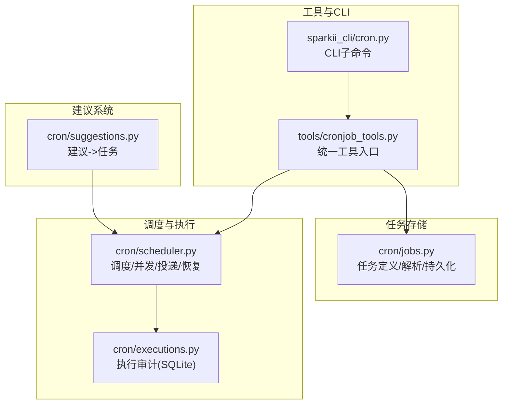
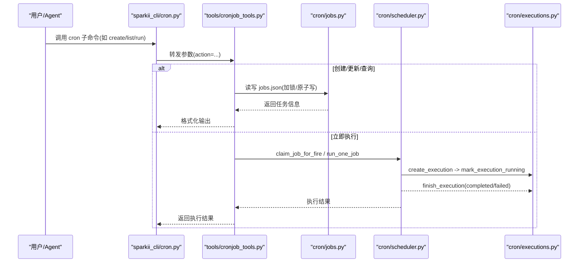
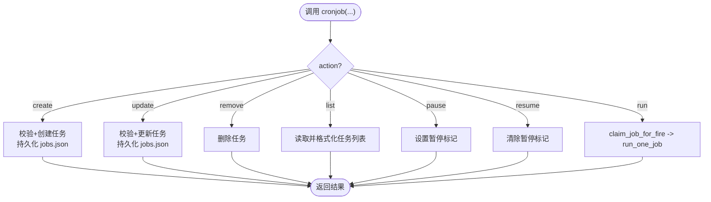
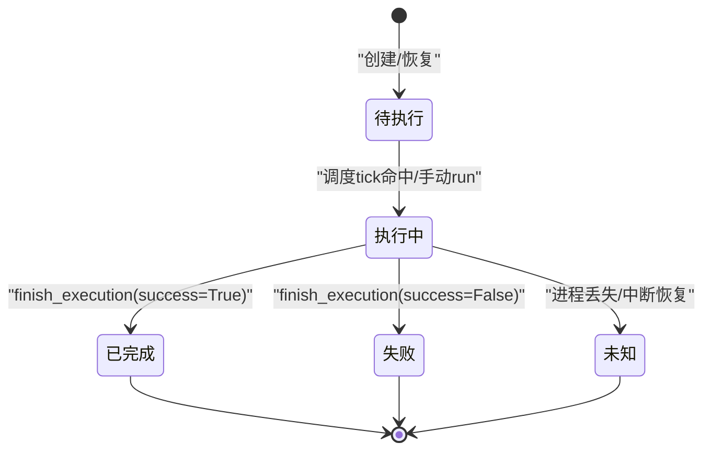
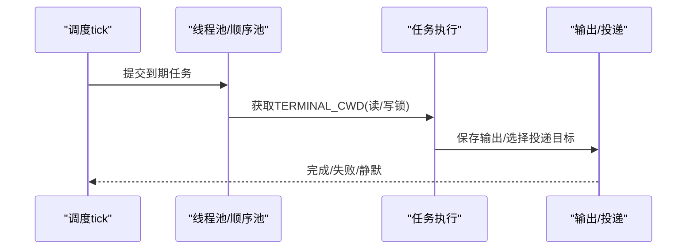
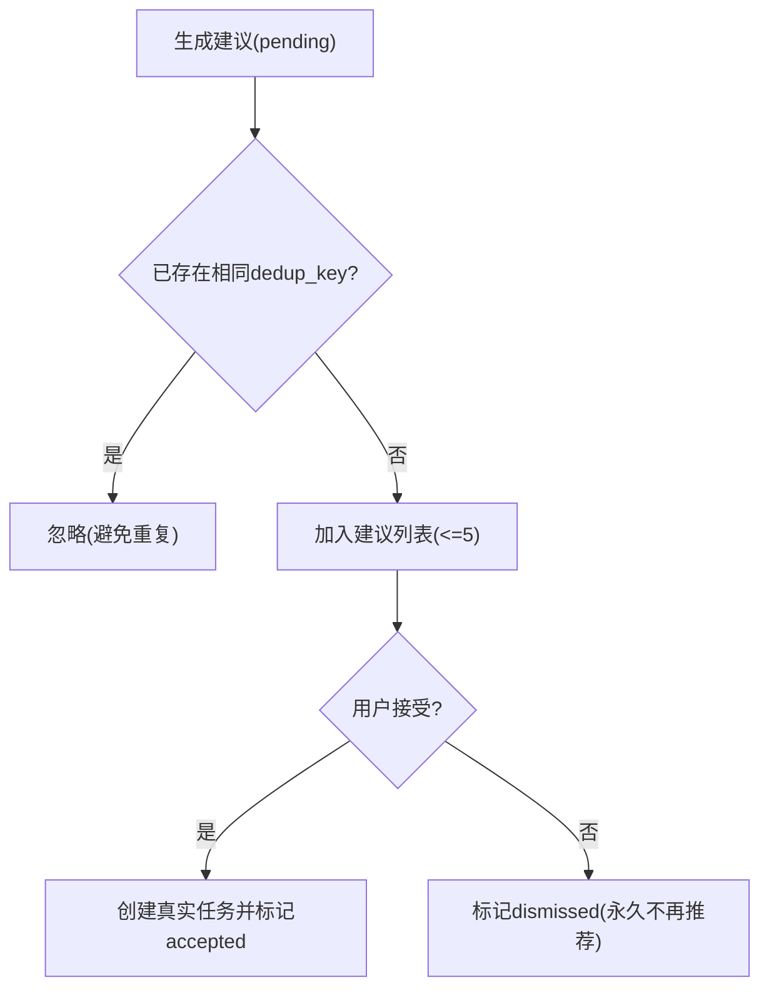
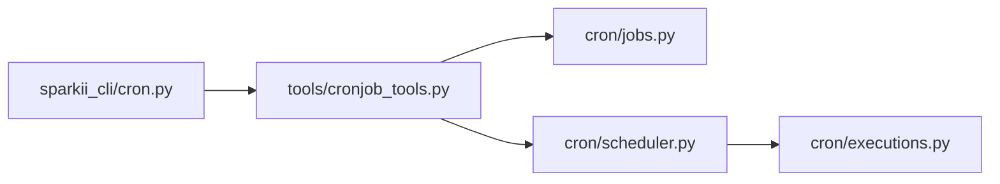

# 任务管理系统

<cite>
**本文引用的文件**
- [cron/jobs.py](file://cron/jobs.py)
- [cron/scheduler.py](file://cron/scheduler.py)
- [cron/executions.py](file://cron/executions.py)
- [tools/cronjob_tools.py](file://tools/cronjob_tools.py)
- [sparkii_cli/cron.py](file://sparkii_cli/cron.py)
- [cron/suggestions.py](file://cron/suggestions.py)
</cite>

## 目录
1. [简介](#简介)
2. [项目结构](#项目结构)
3. [核心组件](#核心组件)
4. [架构总览](#架构总览)
5. [详细组件分析](#详细组件分析)
6. [依赖关系分析](#依赖关系分析)
7. [性能考量](#性能考量)
8. [故障排查指南](#故障排查指南)
9. [结论](#结论)
10. [附录](#附录)

## 简介
本文件为 Sparkii Agent 的任务（定时/计划）管理系统提供完整技术文档，覆盖以下方面：
- 任务的 CRUD 接口与使用方式（创建、更新、删除、查询）
- 任务状态管理机制（待执行、执行中、已完成、失败等）
- 任务依赖与工作流编排（条件触发、并行执行、结果传递）
- 任务建议系统（基于用户行为与历史记录的智能推荐）
- 持久化存储方案（JSON 与 SQLite 设计、数据迁移策略）
- 批量操作与导入导出（CLI 与工具层能力）
- 监控与日志记录（心跳、审计、执行历史、健康上报）

## 项目结构
Sparkii 的任务管理由“存储与调度”“执行与审计”“工具与 CLI”“建议系统”四部分组成：
- cron/jobs.py：任务定义、解析、持久化（jobs.json）、并发安全、调度元数据
- cron/scheduler.py：调度器、并发执行、投递、中断与恢复
- cron/executions.py：执行审计账本（SQLite），记录每次尝试的状态流转
- tools/cronjob_tools.py：面向模型/工具的统一入口，封装创建、更新、运行、查询等
- sparkii_cli/cron.py：命令行子命令（list/create/edit/pause/resume/run/remove/status/runs/tick）
- cron/suggestions.py：建议系统，将“可一键采纳的自动化模板”落地为真实任务

**图表来源**
- [cron/jobs.py:1-120](file://cron/jobs.py#L1-L120)
- [cron/scheduler.py:1-120](file://cron/scheduler.py#L1-L120)
- [cron/executions.py:1-120](file://cron/executions.py#L1-L120)
- [tools/cronjob_tools.py:1-120](file://tools/cronjob_tools.py#L1-L120)
- [sparkii_cli/cron.py:1-120](file://sparkii_cli/cron.py#L1-L120)
- [cron/suggestions.py:1-120](file://cron/suggestions.py#L1-L120)

**章节来源**
- [cron/jobs.py:1-120](file://cron/jobs.py#L1-L120)
- [cron/scheduler.py:1-120](file://cron/scheduler.py#L1-L120)
- [cron/executions.py:1-120](file://cron/executions.py#L1-L120)
- [tools/cronjob_tools.py:1-120](file://tools/cronjob_tools.py#L1-L120)
- [sparkii_cli/cron.py:1-120](file://sparkii_cli/cron.py#L1-L120)
- [cron/suggestions.py:1-120](file://cron/suggestions.py#L1-L120)

## 核心组件
- 任务存储与解析（jobs.py）
  - 支持多种调度表达式（一次性、间隔、cron 表达式、ISO 时间戳）
  - 原子写入、进程内锁与跨进程文件锁，保证 jobs.json 一致性
  - 任务可见状态计算（enabled/paused/completed/error）
- 调度器（scheduler.py）
  - 周期性 tick 检查到期任务，提交到线程池并行或串行执行
  - 执行前注册运行集，避免重复执行；支持中断标记与优雅关闭
  - 投递与静默控制（[SILENT]），失败摘要与渠道适配
- 执行审计（executions.py）
  - SQLite 记录每次尝试（claimed/running/completed/failed/unknown）
  - 进程存活判定与中断恢复，限制终端状态条目数量
- 工具与 CLI（tools/cronjob_tools.py, sparkii_cli/cron.py）
  - 统一的 cronjob 工具方法，封装 create/update/run/list/pause/resume/remove
  - CLI 子命令映射到工具方法，提供 status/runs/tick 等运维能力
- 建议系统（suggestions.py）
  - 将“可一键采纳”的自动化模板以建议形式呈现，接受后直接创建真实任务
  - 去重与上限控制，避免打扰用户

**章节来源**
- [cron/jobs.py:480-520](file://cron/jobs.py#L480-L520)
- [cron/scheduler.py:330-470](file://cron/scheduler.py#L330-L470)
- [cron/executions.py:1-120](file://cron/executions.py#L1-L120)
- [tools/cronjob_tools.py:556-798](file://tools/cronjob_tools.py#L556-L798)
- [sparkii_cli/cron.py:99-200](file://sparkii_cli/cron.py#L99-L200)
- [cron/suggestions.py:1-120](file://cron/suggestions.py#L1-L120)

## 架构总览
下图展示从 CLI/工具到存储、调度、执行的端到端流程。

**图表来源**
- [sparkii_cli/cron.py:344-483](file://sparkii_cli/cron.py#L344-L483)
- [tools/cronjob_tools.py:600-798](file://tools/cronjob_tools.py#L600-L798)
- [cron/jobs.py:270-373](file://cron/jobs.py#L270-L373)
- [cron/scheduler.py:330-470](file://cron/scheduler.py#L330-L470)
- [cron/executions.py:135-196](file://cron/executions.py#L135-L196)

## 详细组件分析

### 任务 CRUD 接口
- 创建任务
  - CLI：sparkii cron create ...
  - 工具：cronjob(action="create", schedule, prompt, name, deliver, repeat, skill(s), script, workdir, model, provider, no_agent, monitor_script/url)
  - 校验：脚本路径安全、base_url 白名单、提示词注入扫描
- 更新任务
  - CLI：sparkii cron edit ...
  - 工具：cronjob(action="update", job_id, ...)
- 删除任务
  - CLI：sparkii cron remove ...
  - 工具：cronjob(action="remove", job_id)
- 查询任务
  - CLI：sparkii cron list [--all]
  - 工具：cronjob(action="list")
- 暂停/恢复/立即执行
  - CLI：pause/resume/run
  - 工具：action 对应实现，run 会走 claim + run_one_job

**图表来源**
- [tools/cronjob_tools.py:556-798](file://tools/cronjob_tools.py#L556-L798)
- [sparkii_cli/cron.py:344-483](file://sparkii_cli/cron.py#L344-L483)

**章节来源**
- [tools/cronjob_tools.py:556-798](file://tools/cronjob_tools.py#L556-L798)
- [sparkii_cli/cron.py:344-483](file://sparkii_cli/cron.py#L344-L483)

### 任务状态管理与转换
- 存储态 vs 有效态
  - 存储态：state 字段可能为 paused/completed/error
  - 有效态：effective_job_state 根据 enabled 标志与暂停标记推导显示态
- 调度态
  - is_job_runnable：enabled=true 且无暂停标记才可被调度
  - 一次任务：recoverable_oneshot_run_at 提供宽限窗口
  - 周期任务：grace 窗口决定错过时是否追赶
- 执行态（审计账本）
  - claimed -> running -> completed/failed
  - unknown：进程不可达时的恢复态
  - 最大保留条数限制，自动清理旧记录

**图表来源**
- [cron/jobs.py:489-520](file://cron/jobs.py#L489-L520)
- [cron/executions.py:135-233](file://cron/executions.py#L135-L233)

**章节来源**
- [cron/jobs.py:489-520](file://cron/jobs.py#L489-L520)
- [cron/executions.py:135-233](file://cron/executions.py#L135-L233)

### 任务依赖与工作流编排
- 依赖关系
  - 通过“工作目录隔离 + 顺序池”保障环境不互相污染
  - 读/写锁（_ReadWriteLock）确保 TERMINAL_CWD 在并发下不被错误共享
- 条件触发
  - 支持 once/interval/cron/ISO 时间等多种调度
  - 捕获错过时间的追赶逻辑（grace 窗口）
- 并行执行
  - 线程池并行执行独立任务；修改环境的任务进入单线程顺序池
- 结果传递
  - 输出落盘（output_dir/{job_id}/{timestamp}.md）
  - 可选投递到聊天平台（origin/home-channel/all）
  - 支持静默响应（[SILENT]）抑制投递

**图表来源**
- [cron/scheduler.py:464-635](file://cron/scheduler.py#L464-L635)
- [cron/jobs.py:578-585](file://cron/jobs.py#L578-L585)

**章节来源**
- [cron/scheduler.py:464-635](file://cron/scheduler.py#L464-L635)
- [cron/jobs.py:578-585](file://cron/jobs.py#L578-L585)

### 任务建议系统
- 来源
  - catalog（内置模板）、blueprint（技能蓝图）、usage（使用习惯）、integration（集成账户）
- 生命周期
  - pending -> accepted/dismissed（去重键 dedup_key）
  - 接受后直接调用 create_job_with_scheduler_registration 创建真实任务
- 限制
  - 最多 5 条待处理建议，避免打扰
  - 原子写入 suggestions.json，权限 0600

**图表来源**
- [cron/suggestions.py:125-252](file://cron/suggestions.py#L125-L252)

**章节来源**
- [cron/suggestions.py:1-270](file://cron/suggestions.py#L1-L270)

### 持久化存储方案
- jobs.json（任务清单）
  - 按 profile 隔离（SPARKII_HOME/cron/jobs.json）
  - 原子替换写入，进程内 RLock + 跨进程 .jobs.lock
  - 输出目录按 job_id 隔离，拒绝路径穿越
- executions.db（执行审计）
  - SQLite，WAL 模式，PRAGMA 优化
  - 表 executions：id/job_id/source/process_id/pid/started_at/status/claimed_at/finished_at/error
  - 索引：按 job_id、status 加速查询
  - 自动清理超过阈值的终端状态记录
- 迁移策略
  - 兼容旧字段（skill/skills、schedule_display、nullable 文本）
  - 时间戳时区规范化（本地时间转配置时区）
  - 所有权修复（root 重写导致 gateway 无法访问）

**章节来源**
- [cron/jobs.py:68-116](file://cron/jobs.py#L68-L116)
- [cron/jobs.py:270-373](file://cron/jobs.py#L270-L373)
- [cron/jobs.py:578-585](file://cron/jobs.py#L578-L585)
- [cron/executions.py:27-63](file://cron/executions.py#L27-L63)
- [cron/executions.py:123-133](file://cron/executions.py#L123-L133)

### 批量操作与导入导出
- 批量操作
  - 通过循环调用工具方法（create/update/remove）实现
  - 注意并发下的 jobs.json 锁与幂等性
- 导入导出
  - 导出：list_jobs 输出任务清单（含 schedule、deliver、skills 等）
  - 导入：构造 create_job 参数批量创建（需遵循安全校验）
- 建议系统批量
  - add_suggestion 支持批量添加待处理建议（受 MAX_PENDING 限制）

**章节来源**
- [tools/cronjob_tools.py:556-798](file://tools/cronjob_tools.py#L556-L798)
- [cron/suggestions.py:125-177](file://cron/suggestions.py#L125-L177)

### 监控与日志记录
- 心跳与存活
  - ticker_heartbeat 与 ticker_last_success 文件用于检测 ticker 线程存活与成功次数
  - cron status 会报告心跳年龄与最近错误
- 执行审计
  - executions.db 记录每次尝试，支持 runs/history 查看
  - 支持 latest_executions 批量查询最新执行
- 健康上报
  - _emit_execution_state 将状态投影到 agent.monitoring.cron_health
- 使用审计
  - usage_audit.jsonl 记录 token 消耗（每轮 fire）

**章节来源**
- [cron/jobs.py:86-116](file://cron/jobs.py#L86-L116)
- [sparkii_cli/cron.py:227-328](file://sparkii_cli/cron.py#L227-L328)
- [cron/executions.py:90-100](file://cron/executions.py#L90-L100)
- [cron/scheduler.py:651-678](file://cron/scheduler.py#L651-L678)

## 依赖关系分析
- 模块耦合
  - tools/cronjob_tools.py 依赖 cron/jobs.py 与 cron/scheduler.py 暴露的统一 API
  - sparkii_cli/cron.py 仅作为 CLI 门面，委托给 tools/cronjob_tools.py
  - scheduler.py 依赖 executions.py 进行审计，依赖 jobs.py 进行任务读写
- 外部依赖
  - croniter（可选，解析 cron 表达式）
  - SQLite（执行审计）
  - 平台适配器（投递到 Telegram/Discord/Slack 等）

**图表来源**
- [sparkii_cli/cron.py:344-483](file://sparkii_cli/cron.py#L344-L483)
- [tools/cronjob_tools.py:40-55](file://tools/cronjob_tools.py#L40-L55)
- [cron/scheduler.py:293-295](file://cron/scheduler.py#L293-L295)

**章节来源**
- [tools/cronjob_tools.py:40-55](file://tools/cronjob_tools.py#L40-L55)
- [cron/scheduler.py:293-295](file://cron/scheduler.py#L293-L295)

## 性能考量
- 并发与锁
  - 线程池并行执行独立任务；修改环境的任务进入单线程顺序池
  - jobs.json 使用进程内 RLock + 跨进程文件锁，超时保护避免死锁
- I/O 与磁盘
  - 原子写入（临时文件 + atomic_replace）减少损坏风险
  - SQLite WAL 与 PRAGMA 优化提升并发写入性能
- 资源限制
  - 终端状态记录上限（MAX_TERMINAL_EXECUTIONS）防止无限增长
  - 建议列表上限（MAX_PENDING）避免干扰用户

[本节为通用指导，无需特定文件引用]

## 故障排查指南
- 任务未触发
  - 检查 Gateway 是否运行（内置 ticker 仅在 Gateway 内运行）
  - 检查 ticker 心跳与最近成功时间（cron status）
- 任务执行失败
  - 查看 executions.db 中的 error 字段（runs/history）
  - 检查投递失败原因（last_delivery_error）
- 权限问题
  - jobs.json 所有权被 root 改写会导致 ticker 无法写入
  - 使用正确的用户执行 CLI，或在 docker exec 指定 -u uid:gid
- 重复执行
  - 确认 claim_job_for_fire 与运行集去重机制生效
  - 检查是否有手动 run 与 tick 并发冲突

**章节来源**
- [sparkii_cli/cron.py:227-328](file://sparkii_cli/cron.py#L227-L328)
- [cron/executions.py:199-233](file://cron/executions.py#L199-L233)
- [cron/jobs.py:270-373](file://cron/jobs.py#L270-L373)

## 结论
Sparkii 的任务管理系统通过清晰的职责划分与严格的并发控制，提供了稳定可靠的定时/计划任务能力。其特点包括：
- 多形态调度与健壮的状态机
- 安全的存储与审计（JSON + SQLite）
- 完善的工具与 CLI 体验
- 可扩展的建议系统与投递通道
- 健壮的监控与故障恢复机制

[本节为总结，无需特定文件引用]

## 附录
- 常用 CLI 命令
  - list：列出所有任务
  - create：创建任务
  - edit：编辑任务
  - pause/resume：暂停/恢复
  - run：立即执行
  - remove：删除任务
  - status：查看状态与心跳
  - runs/history：查看执行历史
  - tick：手动触发一次 tick

**章节来源**
- [sparkii_cli/cron.py:99-200](file://sparkii_cli/cron.py#L99-L200)
- [sparkii_cli/cron.py:548-593](file://sparkii_cli/cron.py#L548-L593)