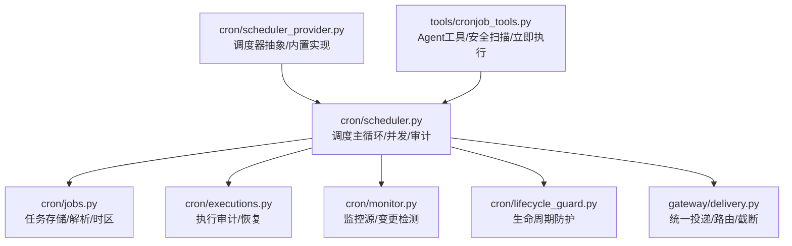
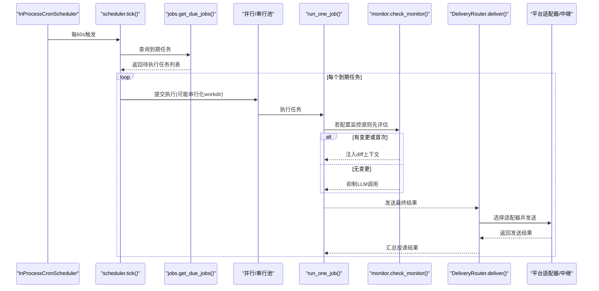
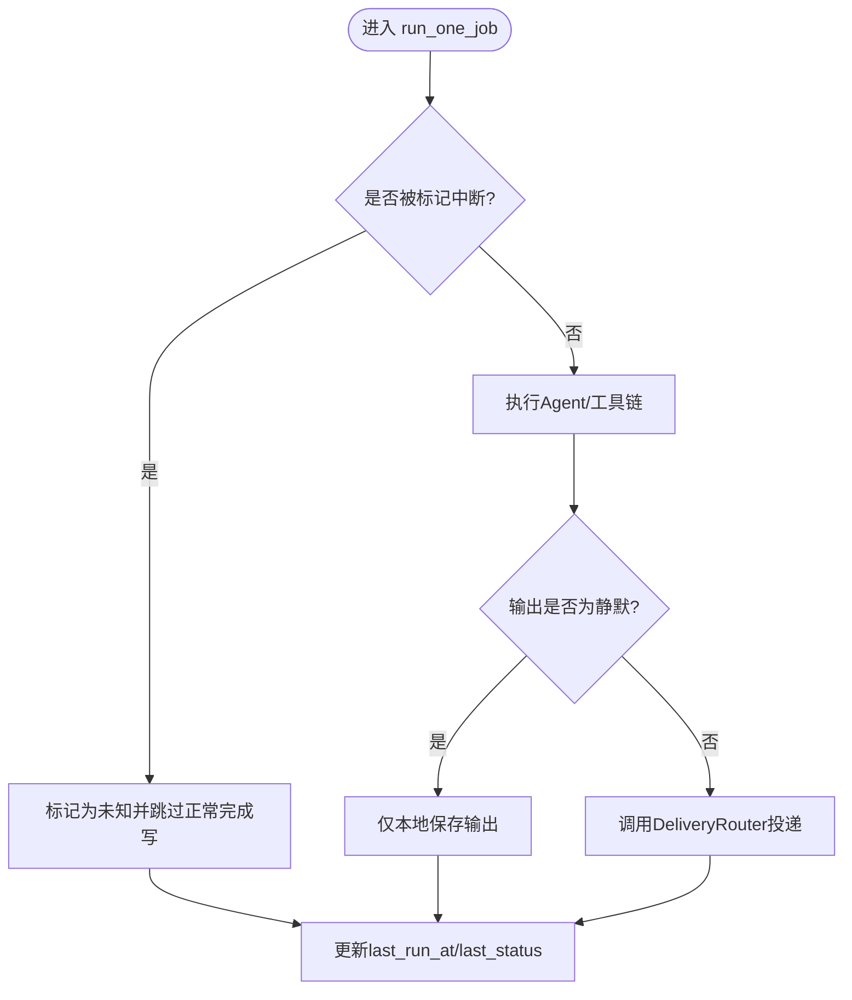
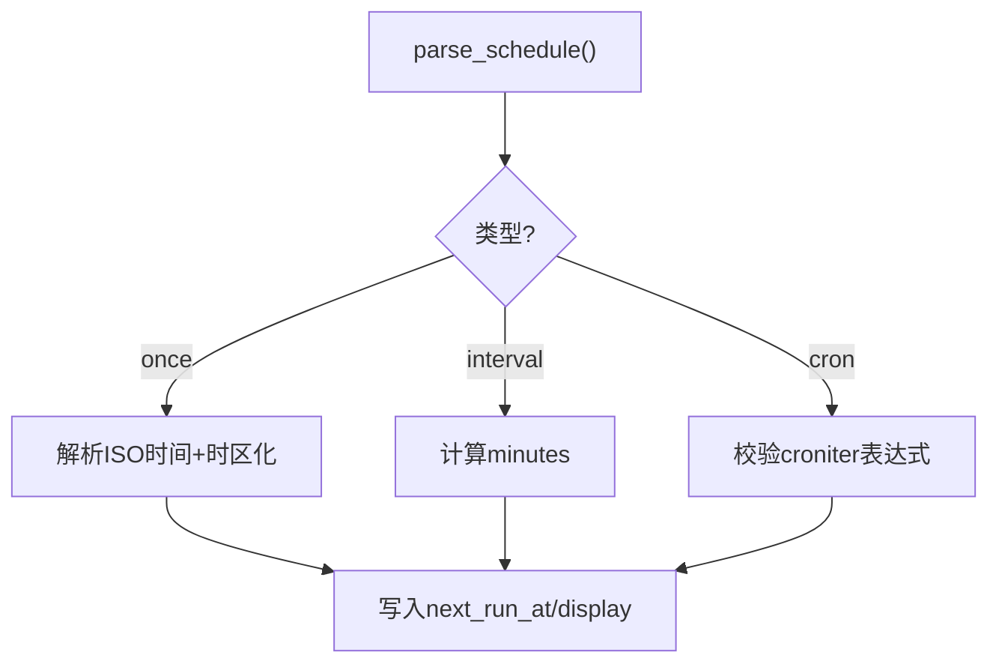
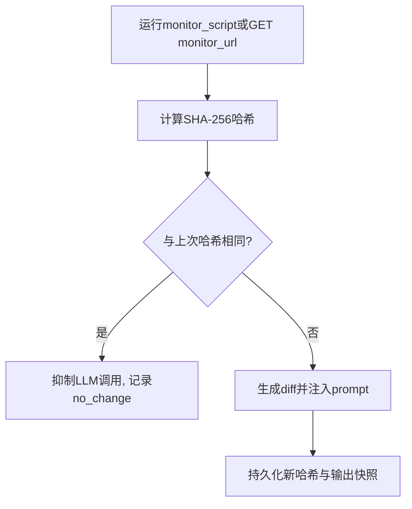
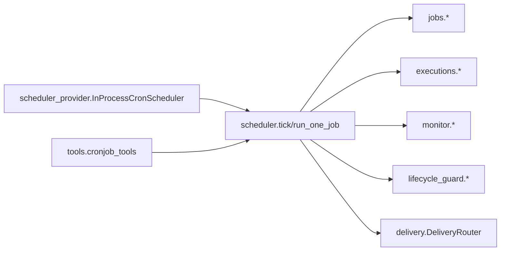

# 调度自动化

<cite>
**本文引用的文件**
- [scheduler.py](file://cron/scheduler.py)
- [jobs.py](file://cron/jobs.py)
- [executions.py](file://cron/executions.py)
- [monitor.py](file://cron/monitor.py)
- [lifecycle_guard.py](file://cron/lifecycle_guard.py)
- [scheduler_provider.py](file://cron/scheduler_provider.py)
- [delivery.py](file://gateway/delivery.py)
- [cronjob_tools.py](file://tools/cronjob_tools.py)
</cite>

## 目录
1. [简介](#简介)
2. [项目结构](#项目结构)
3. [核心组件](#核心组件)
4. [架构总览](#架构总览)
5. [详细组件分析](#详细组件分析)
6. [依赖关系分析](#依赖关系分析)
7. [性能考虑](#性能考虑)
8. [故障排除指南](#故障排除指南)
9. [结论](#结论)
10. [附录：配置与监控示例](#附录配置与监控示例)

## 简介
本文件面向 Sparkii Agent 的“调度自动化”能力，系统性说明 Cron 调度器的核心架构与实现要点，覆盖任务解析、时间表达式与时区处理；定时任务的创建、管理与监控（状态跟踪、执行日志、失败重试）；跨平台消息投递（Telegram、Discord、Slack、WhatsApp 等统一接口）；任务依赖与工作流编排（条件触发、并行执行、结果传递）；高可用设计（负载均衡、故障转移、状态恢复）；并提供可操作的配置与监控告警建议及性能调优、排障指引。

## 项目结构
围绕调度自动化的关键代码分布在以下模块：
- cron/scheduler.py：调度主循环、任务并发执行、运行集管理、静默输出与投递摘要、工作目录隔离锁、使用审计等。
- cron/jobs.py：任务持久化、调度表达式解析、时区处理、任务状态与可见性、心跳与错误记录。
- cron/executions.py：执行尝试的 SQLite 审计账本（claimed/running/completed/failed/unknown），进程存活判定与中断恢复。
- cron/monitor.py：监控源（脚本或 URL）变更检测，基于哈希抑制重复 LLM 调用并注入差异上下文。
- cron/lifecycle_guard.py：阻止在网关生命周期内自杀式重启命令（含 launchctl/systemctl/pkill 等），保护系统稳定性。
- cron/scheduler_provider.py：调度器抽象与内置 InProcessCronScheduler，支持外部 provider 扩展与多 profile 复用。
- gateway/delivery.py：统一投递路由，目标解析、死目标注册、长消息截断与审计保存、平台适配器选择与中继转发。
- tools/cronjob_tools.py：Agent 侧 Cron 工具入口，包含安全扫描、立即执行、心跳保活、投递提示等。



图表来源
- [scheduler.py:1-120](file://cron/scheduler.py#L1-L120)
- [jobs.py:1-120](file://cron/jobs.py#L1-L120)
- [executions.py:1-60](file://cron/executions.py#L1-L60)
- [monitor.py:1-60](file://cron/monitor.py#L1-L60)
- [lifecycle_guard.py:1-60](file://cron/lifecycle_guard.py#L1-L60)
- [scheduler_provider.py:1-120](file://cron/scheduler_provider.py#L1-L120)
- [delivery.py:1-120](file://gateway/delivery.py#L1-L120)
- [cronjob_tools.py:1-80](file://tools/cronjob_tools.py#L1-L80)

章节来源
- [scheduler.py:1-120](file://cron/scheduler.py#L1-L120)
- [jobs.py:1-120](file://cron/jobs.py#L1-L120)
- [scheduler_provider.py:1-120](file://cron/scheduler_provider.py#L1-L120)

## 核心组件
- 调度主循环与并发控制：tick 周期检查到期任务，提交到并行线程池执行；对会修改进程全局环境的工作目录任务使用读写锁串行化，避免交叉污染。
- 任务存储与解析：jobs.json 持久化；支持 once/interval/cron 三种调度；ISO 时间戳按配置的 Sparkii 时区解析；提供显示友好格式。
- 执行审计与恢复：SQLite executions.db 记录每次尝试的生命周期；启动时恢复中断尝试为 unknown；限制终端状态条目数量。
- 监控源与变更抑制：可选 monitor_script/monitor_url，比较精确字节哈希，未变化则跳过 LLM 调用；变化时注入 diff 上下文。
- 生命周期防护：拒绝包含网关重启/停止/launchctl submit/bootstrap 等危险指令的任务创建，防止 SIGTERM 重启循环。
- 统一投递：DeliveryRouter 解析目标（origin/local/platform[:chat_id][:thread_id]），选择原生或中继适配器，长内容审计保存并按适配器能力决定是否截断。
- 工具与安全：cronjob_tools 提供立即执行、安全扫描（注入/泄露/不可见字符）、心跳保活、投递提示等。

章节来源
- [scheduler.py:330-470](file://cron/scheduler.py#L330-L470)
- [jobs.py:588-710](file://cron/jobs.py#L588-L710)
- [executions.py:135-233](file://cron/executions.py#L135-L233)
- [monitor.py:147-213](file://cron/monitor.py#L147-L213)
- [lifecycle_guard.py:665-715](file://cron/lifecycle_guard.py#L665-L715)
- [delivery.py:213-391](file://gateway/delivery.py#L213-L391)
- [cronjob_tools.py:260-313](file://tools/cronjob_tools.py#L260-L313)

## 架构总览
下图展示从调度触发到执行、监控、投递的全链路交互。



图表来源
- [scheduler_provider.py:172-271](file://cron/scheduler_provider.py#L172-L271)
- [scheduler.py:330-470](file://cron/scheduler.py#L330-L470)
- [jobs.py:588-710](file://cron/jobs.py#L588-L710)
- [monitor.py:147-213](file://cron/monitor.py#L147-L213)
- [delivery.py:318-391](file://gateway/delivery.py#L318-L391)

## 详细组件分析

### 调度主循环与并发执行（scheduler.py）
- tick 由内置调度器以固定间隔驱动，提交任务到线程池；维护运行中 job_id 集合，支持关闭时标记中断并避免错误覆盖成功状态。
- 工作目录隔离：通过自定义读写锁确保 workdir 任务串行执行，避免共享环境变量被并发篡改；等待超时策略保证健康任务不被阻塞。
- 使用审计：每次执行写入 JSONL 审计文件，便于追踪 token 消耗。
- 静默输出识别：支持 [SILENT] 等标记，避免无意义投递。
- 失败摘要：将冗长错误压缩为聊天友好的单行消息，区分限流、超时、认证等类别。



图表来源
- [scheduler.py:330-470](file://cron/scheduler.py#L330-L470)
- [scheduler.py:607-648](file://cron/scheduler.py#L607-L648)

章节来源
- [scheduler.py:330-470](file://cron/scheduler.py#L330-L470)
- [scheduler.py:607-648](file://cron/scheduler.py#L607-L648)

### 任务存储与调度解析（jobs.py）
- 存储路径按 profile 隔离，支持 use_cron_store 切换；文件级跨进程锁 + 内存锁保障并发安全。
- 解析支持：
  - once：ISO 时间戳，按 Sparkii 配置时区解析；一次性任务带宽限期。
  - interval：every X 分钟。
  - cron：标准 5/6 字段表达式，需安装 croniter。
- 时区兼容：历史 naive 时间戳会被转换为当前配置时区；当存储时间与当前偏移不一致时进行修复判断，避免误判到期。
- 状态与可见性：effective_job_state 综合 enabled 与暂停标记，确保 UI 与调度一致。



图表来源
- [jobs.py:588-710](file://cron/jobs.py#L588-L710)
- [jobs.py:712-754](file://cron/jobs.py#L712-L754)

章节来源
- [jobs.py:588-710](file://cron/jobs.py#L588-L710)
- [jobs.py:712-754](file://cron/jobs.py#L712-L754)

### 执行审计与恢复（executions.py）
- SQLite 表 executions 记录每次尝试：id、job_id、source、process_id、pid、status、claimed_at/started_at/finished_at、error。
- 事务封装，WAL 模式与 PRAGMA 优化；索引加速查询。
- 恢复逻辑：启动时扫描 claimed/running 且所有者进程已消失的记录，标记为 unknown 并清理。
- 限制：终端状态记录最多保留 N 条，自动裁剪。

```mermaid
classDiagram
class Executions {
+string id
+string job_id
+string source
+string process_id
+int pid
+int process_started_at
+string status
+string claimed_at
+string started_at
+string finished_at
+string error
}
Executions <.. "create_execution/mark_execution_running/finish_execution/recover_interrupted/list_executions" : 操作
```

图表来源
- [executions.py:27-63](file://cron/executions.py#L27-L63)
- [executions.py:135-233](file://cron/executions.py#L135-L233)

章节来源
- [executions.py:135-233](file://cron/executions.py#L135-L233)

### 监控源与变更抑制（monitor.py）
- 支持 monitor_script 或 monitor_url；每次 tick 先运行源并计算 SHA-256 哈希，与上次存储对比。
- 未变化：抑制 LLM 调用，记录 silent no_change 运行。
- 变化：生成统一 diff（上限），注入 prompt 上下文；首次运行记录基线。
- 持久化：job.monitor_state 保存 last_output_hash 与 last_changed_at；输出快照保存在输出目录。



图表来源
- [monitor.py:65-83](file://cron/monitor.py#L65-L83)
- [monitor.py:147-213](file://cron/monitor.py#L147-L213)

章节来源
- [monitor.py:147-213](file://cron/monitor.py#L147-L213)

### 生命周期防护（lifecycle_guard.py）
- 阻止在任务 prompt/script 中包含直接重启/停止网关的命令（sparkii gateway restart/stop、launchctl/systemctl/pkill 等）。
- 数据 sink 参数豁免：grep/journalctl/sqlite3/psql 等命令的参数不视为执行，避免误报。
- 递归扫描引用脚本：限制深度与大小，跳过二进制文件，支持远程读取回调。
- Python 脚本特殊处理：避免 pathlib "/" 运算符导致的误判。

章节来源
- [lifecycle_guard.py:98-104](file://cron/lifecycle_guard.py#L98-L104)
- [lifecycle_guard.py:212-299](file://cron/lifecycle_guard.py#L212-L299)
- [lifecycle_guard.py:567-613](file://cron/lifecycle_guard.py#L567-L613)
- [lifecycle_guard.py:665-715](file://cron/lifecycle_guard.py#L665-L715)

### 调度器抽象与内置实现（scheduler_provider.py）
- CronScheduler 抽象定义 name/start/stop/is_available 等接口，支持 on_jobs_changed/register_job/fire_due/reconcile 钩子。
- InProcessCronScheduler：默认内置实现，守护线程内 60s 轮询；支持 can_dispatch 门控；支持多 profile 复用（multiplex_profiles）。
- 恢复：启动时调用 recover_interrupted_executions 标记中断尝试。

章节来源
- [scheduler_provider.py:27-129](file://cron/scheduler_provider.py#L27-L129)
- [scheduler_provider.py:172-368](file://cron/scheduler_provider.py#L172-L368)

### 统一消息投递（delivery.py）
- DeliveryTarget 解析 origin/local/platform[:chat_id][:thread_id]。
- DeliveryRouter.deliver 遍历目标：
  - LOCAL：保存到 cron/output 目录，附带元数据。
  - 平台：选择原生适配器或中继（RELAY fronts_platform），必要时创建 Telegram 私聊主题。
  - 长内容：超过阈值时审计保存全文；非分块适配器截断并附加文件路径提示。
  - 死目标：根据错误分类标记，后续投递短路；成功后清除。
  - 静默叙述过滤：屏蔽 *(silent)* 等噪声，避免 bot-to-bot 循环。

```mermaid
sequenceDiagram
participant R as "DeliveryRouter"
participant T as "Transport(原生/中继)"
participant A as "平台适配器"
R->>R : 解析目标/检查死目标
alt 平台投递
R->>T : resolve_delivery_transport()
T->>A : send(chat_id, content, metadata)
A-->>T : 返回结果
T-->>R : 返回结果
R->>R : 成功则清除死目标; 失败则分类并标记
else 本地投递
R->>R : 写入cron/output并返回路径
end
```

图表来源
- [delivery.py:213-391](file://gateway/delivery.py#L213-L391)
- [delivery.py:460-642](file://gateway/delivery.py#L460-L642)

章节来源
- [delivery.py:213-391](file://gateway/delivery.py#L213-L391)
- [delivery.py:460-642](file://gateway/delivery.py#L460-L642)

### 任务工具与安全（cronjob_tools.py）
- 安全扫描：严格模式阻断注入/泄露/不可见字符；组装 prompt 时放宽但仍拦截明显注入。
- base_url 校验：禁止将命名提供商的密钥发送到非配置端点，防止凭据外泄。
- 脚本路径校验：仅允许相对路径位于 SPARKII_HOME/scripts/ 下，防越界执行。
- 立即执行：claim_job_for_fire 原子抢占，避免重复执行；心跳保活防止父 turn 被误杀。
- 投递提示：本地会话无法投递时给出明确提示。

章节来源
- [cronjob_tools.py:260-313](file://tools/cronjob_tools.py#L260-L313)
- [cronjob_tools.py:437-514](file://tools/cronjob_tools.py#L437-L514)
- [cronjob_tools.py:517-553](file://tools/cronjob_tools.py#L517-L553)
- [cronjob_tools.py:600-797](file://tools/cronjob_tools.py#L600-L797)

## 依赖关系分析
- scheduler 依赖 jobs（获取到期任务、持久化状态）、executions（审计）、monitor（可选）、lifecycle_guard（创建时校验）、delivery（投递）。
- scheduler_provider 抽象出触发时机，内置实现调用 scheduler.tick；支持外部 provider 通过插件加载。
- delivery 依赖平台适配器与中继，统一封装 send 语义；dead_targets 用于短路已知不可达目标。
- cronjob_tools 作为 Agent 侧入口，组合上述能力并提供安全与用户体验增强。



图表来源
- [scheduler_provider.py:172-368](file://cron/scheduler_provider.py#L172-L368)
- [scheduler.py:330-470](file://cron/scheduler.py#L330-L470)
- [delivery.py:213-391](file://gateway/delivery.py#L213-L391)

章节来源
- [scheduler_provider.py:172-368](file://cron/scheduler_provider.py#L172-L368)
- [scheduler.py:330-470](file://cron/scheduler.py#L330-L470)
- [delivery.py:213-391](file://gateway/delivery.py#L213-L391)

## 性能考虑
- 并发模型：并行线程池执行独立任务；工作目录任务通过读写锁串行化，避免全局状态竞争。
- 锁与超时：jobs.json 跨进程锁设置 30s 超时，避免卡死；TERMINAL_CWD 锁等待受 inactivity 限制约束，防止长期阻塞。
- 资源限制：monitor_url GET 限制超时与最大字节；监控 diff 与输出注入有上限，避免过大上下文。
- 审计与裁剪：执行审计 JSONL 追加写入；终端执行记录限制数量，自动裁剪。
- 投递优化：支持中继与原生适配器选择；长消息分块能力由适配器决定，否则截断并保存全文。

[本节为通用性能指导，无需特定文件引用]

## 故障排除指南
- 任务不触发：
  - 检查 jobs.json 中 enabled 与 state；确认 parse_schedule 解析正确（croniter 是否安装）。
  - 查看 ticker 心跳与最近成功时间；若持续失败，查看 record_ticker_error 原因。
- 任务执行异常：
  - 查看 executions.db 中 latest_execution 的状态与错误信息；recover_interrupted_executions 会在重启后标记未知尝试。
  - 若 workdir 任务互相干扰，确认读写锁是否超时；调整 SPARKII_CRON_TIMEOUT 或错峰调度。
- 投递失败：
  - 检查 DeliveryTarget 解析是否正确（platform/chat_id/thread_id）；确认适配器已启用或中继 fronts_platform 匹配。
  - 关注 dead_targets 是否标记为目标不可达；必要时手动重试以清除标志。
  - 长内容被截断时，查看审计保存路径以获取完整输出。
- 安全拦截：
  - lifecycle_guard 阻止包含网关重启命令的任务创建；如需运维，请在网关外部执行。
  - cronjob_tools 的安全扫描会阻断注入/泄露模式；请修正 prompt 或脚本。

章节来源
- [jobs.py:270-373](file://cron/jobs.py#L270-L373)
- [executions.py:199-233](file://cron/executions.py#L199-L233)
- [delivery.py:318-391](file://gateway/delivery.py#L318-L391)
- [lifecycle_guard.py:665-715](file://cron/lifecycle_guard.py#L665-L715)

## 结论
Sparkii 调度自动化以稳健的并发模型、严格的时区与表达式解析、细粒度的执行审计与恢复机制为核心，结合统一的跨平台投递与监控源变更抑制，提供了高可靠、可扩展的定时任务能力。通过生命周期防护与安全扫描，系统在易用性与安全性之间取得平衡。生产部署建议结合多 profile 复用、外部 provider 扩展与完善的监控告警，以实现高可用与可观测性。

[本节为总结性内容，无需特定文件引用]

## 附录：配置与监控示例
- 任务调度表达式
  - 一次性：使用 ISO 时间戳（如 "2026-02-03T14:00:00"），系统会按配置的 Sparkii 时区解析。
  - 周期性：使用 "every 30m" 或 "every 2h" 等间隔表达。
  - Cron 表达式：使用标准 5/6 字段（如 "0 9 * * *"），需安装 croniter。
- 投递目标
  - 本地：deliver="local"，输出保存到 cron/output。
  - 回原会话：deliver="origin"，需存在 origin（平台与 chat_id）。
  - 指定平台：deliver="telegram:123456" 或 "slack:channel_id:thread_id"。
- 监控源
  - monitor_script：执行脚本，输出稳定（排序、去除时间戳）以避免误报变更。
  - monitor_url：HTTP(S) GET，限制超时与大小；输出稳定是关键。
- 运行时参数
  - SPARKII_CRON_TIMEOUT：任务不活跃超时（秒），影响锁等待与 one-shot 恢复 TTL。
  - SPARKII_FILTER_SILENCE_NARRATION：是否过滤静默叙述（true/false/on/off）。
- 监控与告警
  - 心跳与成功标记：ticker_heartbeat 与 ticker_last_success 用于判断调度器活性。
  - 执行审计：usage_audit.jsonl 记录每次执行的 token 消耗。
  - 执行历史：executions.db 查询 latest_executions 获取最近尝试与错误。
  - 死目标：delivery.dead_targets 记录不可达目标，定期重试以自愈。

[本节为配置与监控实践，无需特定文件引用]