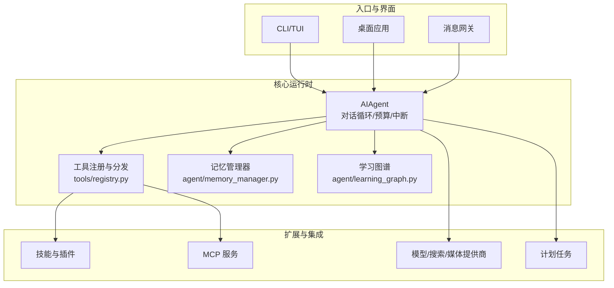
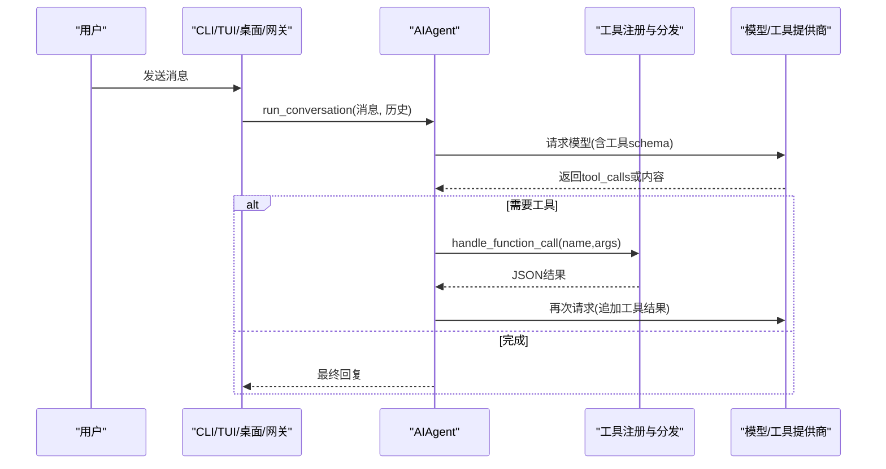
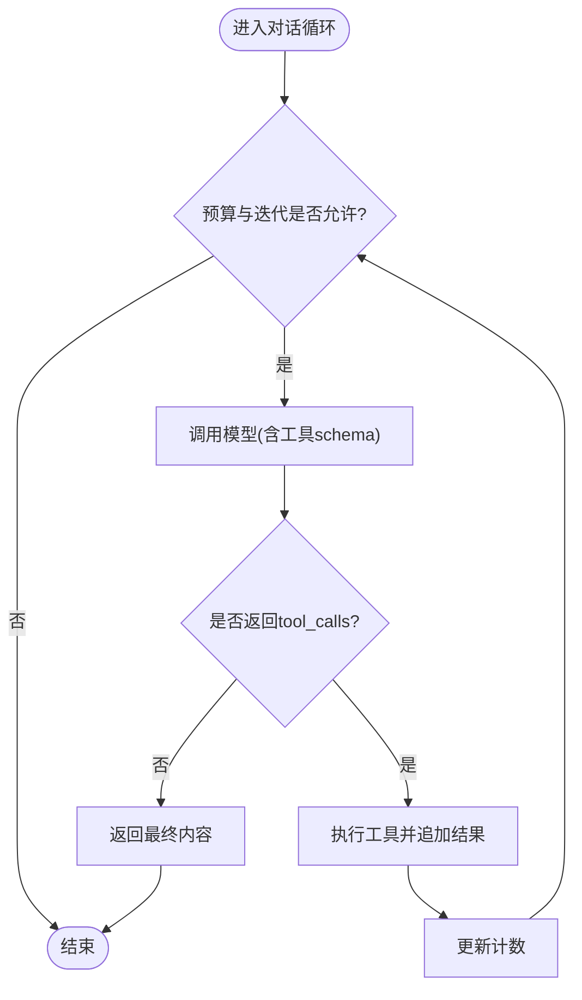
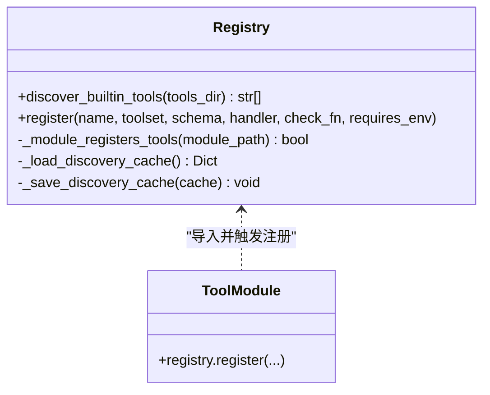
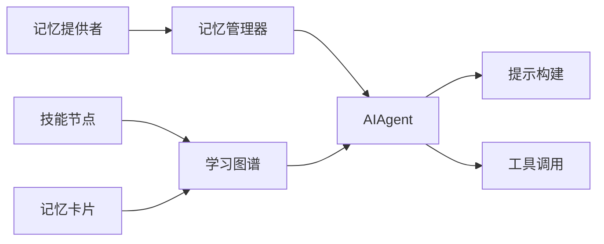
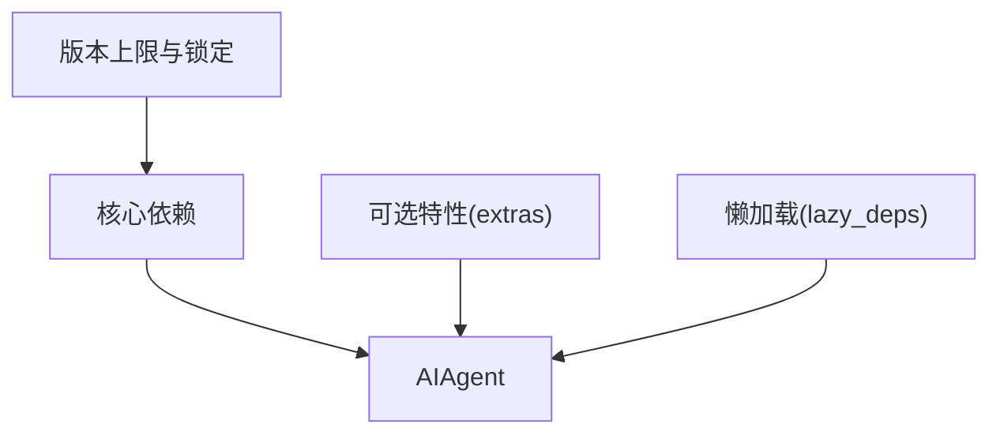

# 项目介绍

<cite>
**本文引用的文件**
- [README.md](file://README.md)
- [AGENTS.md](file://AGENTS.md)
- [pyproject.toml](file://pyproject.toml)
- [run_agent.py](file://run_agent.py)
- [tools/registry.py](file://tools/registry.py)
- [agent/memory_manager.py](file://agent/memory_manager.py)
- [agent/learning_graph.py](file://agent/learning_graph.py)
</cite>

## 目录
1. [简介](#简介)
2. [项目结构](#项目结构)
3. [核心组件](#核心组件)
4. [架构总览](#架构总览)
5. [详细组件分析](#详细组件分析)
6. [依赖关系分析](#依赖关系分析)
7. [性能考量](#性能考量)
8. [故障排查指南](#故障排查指南)
9. [结论](#结论)
10. [附录](#附录)

## 简介
Hermes Agent（仓库内工程名 sparkii-agent）是一个“自改进”的个人 AI 代理，具备内置学习循环、跨会话记忆与技能演化能力。它可以在 CLI、消息网关（Telegram/Discord/Slack/WhatsApp/Signal 等）、TUI 和桌面应用中运行同一套核心；支持多模型提供商与工具生态，提供计划任务调度、子代理委派与并行化、以及多种终端后端（本地、Docker、SSH、Modal、Daytona、Vercel Sandbox 等）。其核心价值在于：让代理从经验中创建并改进技能、在对话中持续强化记忆、跨平台无缝交互，并以极低的闲置成本运行于云或边缘环境。

与其他 AI 代理工具相比，Hermes 的差异化优势包括：
- 内置学习闭环：自动从复杂任务后生成技能、使用中自我改进，并通过 FTS5 搜索与 LLM 摘要实现跨会话回忆。
- 统一入口与多端一致体验：CLI/TUI/桌面/消息网关共享同一会话与工具集，命令与技能可跨端复用。
- 可扩展但克制的设计：新能力优先通过 CLI + 技能、插件、MCP 服务扩展，避免污染核心模型工具模式，降低每次调用的上下文成本。
- 强大的自动化与编排：内置 cron 调度、子代理委派、并行工作流，将多步流水线压缩为低上下文成本的回合。
- 多模态与工具生态：浏览器控制、图像/视频生成、语音转写/合成、代码执行、文件系统操作、Web 搜索等丰富工具链。

适用场景与目标用户：
- 开发者与研究者：批量轨迹生成、轨迹压缩用于训练下一代工具调用模型；丰富的评测与调试工具。
- 个人与团队效率提升：日常研究、文档处理、邮件/日历/项目管理、智能家居、社交媒体运营等。
- 运维与自动化：定时报告、夜间备份、周审计等无人值守任务，跨平台投递结果。
- 需要低成本长期运行的代理：$5 VPS、GPU 集群或无服务器环境，空闲时休眠、按需唤醒。

## 项目结构
仓库采用“核心窄腰、能力在边缘”的分层组织方式：
- 核心运行时与对话循环：run_agent.py 中的 AIAgent 负责主循环、预算与中断、工具调用与响应管理。
- 工具系统：tools/registry.py 集中注册所有工具，model_tools.py 发现并分发工具调用。
- 代理内部模块：agent/ 包含记忆、压缩、提示构建、重试、错误分类、传输适配器等。
- 多平台网关：gateway/ 提供消息通道适配与路由。
- 技能与插件：skills/ 与 plugins/ 提供可插拔的能力扩展。
- TUI 与桌面：ui-tui/ 与 apps/desktop/ 提供富终端与桌面体验。
- 调度器：cron/ 提供计划任务与投递。
- 配置与依赖：pyproject.toml 定义依赖与可选特性集合。

图表来源
- [run_agent.py:1-200](file://run_agent.py#L1-L200)
- [tools/registry.py:1-200](file://tools/registry.py#L1-L200)
- [agent/memory_manager.py:1-200](file://agent/memory_manager.py#L1-L200)
- [agent/learning_graph.py:1-200](file://agent/learning_graph.py#L1-L200)

章节来源
- [AGENTS.md:263-309](file://AGENTS.md#L263-L309)
- [pyproject.toml:358-401](file://pyproject.toml#L358-L401)

## 核心组件
- AIAgent 对话循环：维护迭代预算、中断检查、一次“宽限调用”，按 OpenAI 格式组装消息，循环调用模型直至完成或达到限制。
- 工具注册与分发：通过 AST 扫描与缓存机制自动发现 tools/*.py 中的注册声明，收集 schema 并在 model_tools 中分发执行。
- 记忆系统：MemoryManager 统一管理外部记忆提供者，注入工具 schema，预取与同步上下文，清理敏感标记与围栏标签。
- 学习图谱：基于 SKILL.md frontmatter 与使用统计构建技能节点与边，展示“可见的学习过程”，连接记忆与技能。
- 多平台网关：统一接入 Telegram/Discord/Slack/WhatsApp/Signal 等平台，共享会话与命令。
- 计划任务：内置 cron 调度，支持自然语言任务与平台投递。
- 终端与浏览器：真实终端驱动与浏览器控制，支持截图、窗口聚焦、CDP 通信等。

章节来源
- [run_agent.py:389-410](file://run_agent.py#L389-L410)
- [tools/registry.py:108-159](file://tools/registry.py#L108-L159)
- [agent/memory_manager.py:1-24](file://agent/memory_manager.py#L1-L24)
- [agent/learning_graph.py:1-14](file://agent/learning_graph.py#L1-L14)

## 架构总览
Hermes 的核心设计原则是“每轮对话提示缓存神圣不可侵犯”与“核心窄腰、能力在边缘”。这意味着：
- 长会话重用缓存前缀，任何变更过去上下文、切换工具集或重建系统提示都会破坏缓存并增加成本。
- 新增能力优先以 CLI+技能、服务门控工具、插件或 MCP 服务形式扩展，而非直接加入核心工具模式。

图表来源
- [run_agent.py:389-410](file://run_agent.py#L389-L410)
- [tools/registry.py:108-159](file://tools/registry.py#L108-L159)

章节来源
- [AGENTS.md:16-27](file://AGENTS.md#L16-L27)

## 详细组件分析

### 对话循环与工具调用
- 循环策略：在迭代预算与最大迭代次数约束下，持续调用模型；若返回 tool_calls，则逐一执行工具并将结果追加到消息历史，否则返回最终内容。
- 预算与中断：支持硬中断与软中断兼容，确保长时间任务可被安全打断。
- 消息格式：遵循 OpenAI 格式，支持 reasoning 字段存储推理内容。

图表来源
- [run_agent.py:389-410](file://run_agent.py#L389-L410)

章节来源
- [run_agent.py:389-410](file://run_agent.py#L389-L410)

### 工具注册与发现
- 自动发现：通过 AST 解析 tools/*.py，检测顶层 registry.register() 调用，缓存判定结果以减少开销。
- 分发与保护：收集 schema 并在 model_tools 中分发执行，对异常输出进行截断与保护，防止超大错误体污染上下文。
- 工具集门控：工具仅在所属工具集启用时暴露给代理，避免无关工具增加 schema 成本。

图表来源
- [tools/registry.py:71-105](file://tools/registry.py#L71-L105)
- [tools/registry.py:108-159](file://tools/registry.py#L108-L159)

章节来源
- [tools/registry.py:1-200](file://tools/registry.py#L1-L200)

### 记忆系统与学习闭环
- 记忆管理器：统一接入外部记忆提供者，注入工具 schema，预取与同步上下文，清理围栏标签与系统提示注入。
- 学习图谱：从 SKILL.md frontmatter 与使用统计构建技能节点与边，连接记忆与技能，呈现“可见的学习过程”。
- 跨会话回忆：FTS5 搜索结合 LLM 摘要，支持跨会话检索与总结。

图表来源
- [agent/memory_manager.py:1-24](file://agent/memory_manager.py#L1-L24)
- [agent/learning_graph.py:1-14](file://agent/learning_graph.py#L1-L14)

章节来源
- [agent/memory_manager.py:1-200](file://agent/memory_manager.py#L1-L200)
- [agent/learning_graph.py:1-200](file://agent/learning_graph.py#L1-L200)

### 多平台支持与网关
- 统一入口：CLI、TUI、桌面与消息网关共享同一会话与工具集，命令与技能跨端可用。
- 平台适配：Telegram、Discord、Slack、WhatsApp、Signal、Home Assistant、Matrix、WeCom、飞书、钉钉等。
- 会话连续性：跨平台保持会话状态与上下文一致性。

章节来源
- [AGENTS.md:263-309](file://AGENTS.md#L263-L309)
- [README.md:23-31](file://README.md#L23-L31)

### 计划任务与自动化
- 内置 cron：支持自然语言任务描述与平台投递，适合日报、备份、审计等无人值守场景。
- 调度器：jobs.py、scheduler.py 等模块提供任务生命周期管理与监控。

章节来源
- [AGENTS.md:263-309](file://AGENTS.md#L263-L309)

## 依赖关系分析
- 核心依赖：OpenAI SDK、HTTPX、Rich、PyYAML、FastAPI/Uvicorn、Pillow、psutil 等。
- 可选依赖：各提供商与平台通过 extras 与懒加载机制按需安装，减少默认安装体积与供应链风险。
- 安全策略：严格版本上限与精确锁定，避免上游恶意或脆弱版本影响生产环境。

图表来源
- [pyproject.toml:19-155](file://pyproject.toml#L19-L155)
- [pyproject.toml:157-352](file://pyproject.toml#L157-L352)

章节来源
- [pyproject.toml:19-155](file://pyproject.toml#L19-L155)
- [pyproject.toml:157-352](file://pyproject.toml#L157-L352)

## 性能考量
- 提示缓存：长会话重用缓存前缀，避免重复计算与额外成本。
- 工具 schema 最小化：仅暴露必要工具，减少每次 API 调用的上下文大小。
- 错误体截断：工具错误输出限制长度，防止污染上下文。
- 懒加载与可选依赖：按需安装与加载，缩短启动时间并降低内存占用。
- 并发与预算：迭代预算与中断机制保障长时间任务的稳定性与可控性。

[本节为通用指导，不直接分析具体文件]

## 故障排查指南
- 工具错误过大：工具错误体会被截断，日志保留更长前缀以便诊断。
- 记忆提供者冲突：仅允许一个外部记忆提供者，避免工具 schema 膨胀与冲突。
- 平台适配问题：确认平台配置与认证，检查网关日志与平台适配器。
- 依赖缺失：通过 extras 与懒加载机制安装所需依赖，必要时手动补充。

章节来源
- [tools/registry.py:29-68](file://tools/registry.py#L29-L68)
- [agent/memory_manager.py:1-24](file://agent/memory_manager.py#L1-L24)

## 结论
Hermes Agent 以“自改进”为核心，通过内置学习循环、跨会话记忆、多平台统一入口与强大工具生态，为用户提供高效、可扩展且低成本的 AI 代理体验。其“核心窄腰、能力在边缘”的设计确保了系统的可维护性与扩展性，同时通过严格的依赖管理与安全策略保障生产环境的稳定性。无论是个人效率提升、团队协作还是研究与自动化场景，Hermes 都能提供一致而强大的能力支撑。

[本节为总结性内容，不直接分析具体文件]

## 附录
- 快速开始：安装后可通过 CLI 或消息网关启动对话，选择模型、配置工具与技能。
- 文档中心：完整的使用指南、配置参考、架构说明与贡献指南。
- 社区与支持：Discord、GitHub Issues、Skills Hub 等渠道获取帮助与交流。

章节来源
- [README.md:35-119](file://README.md#L35-L119)
- [README.md:163-184](file://README.md#L163-L184)