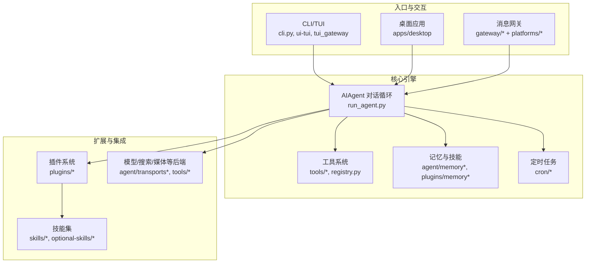
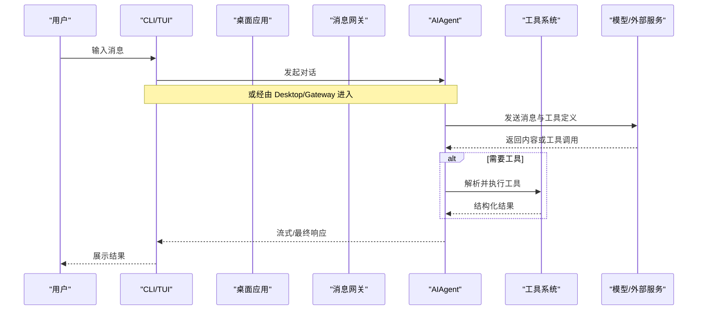
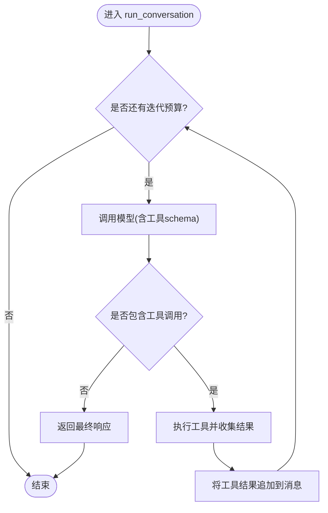
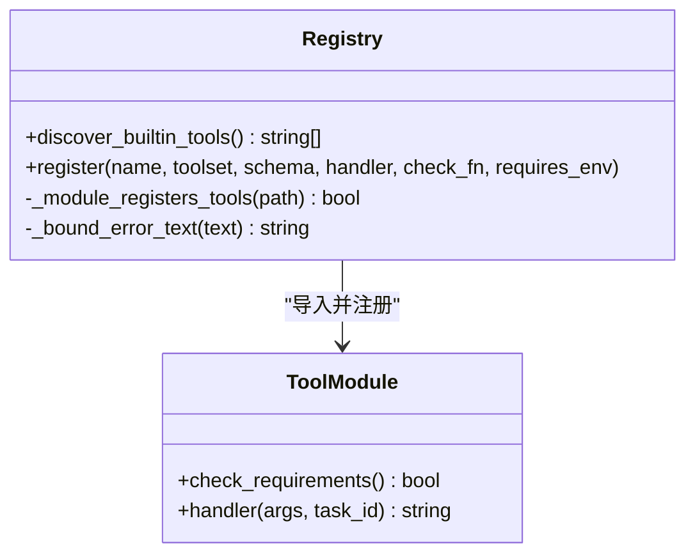
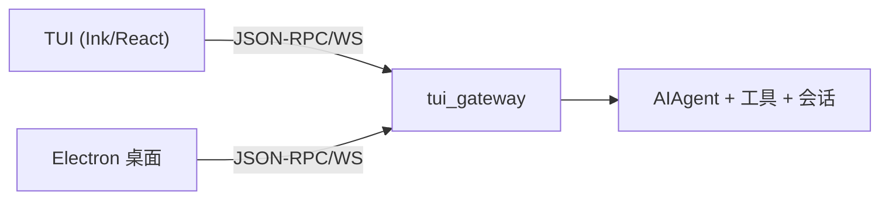
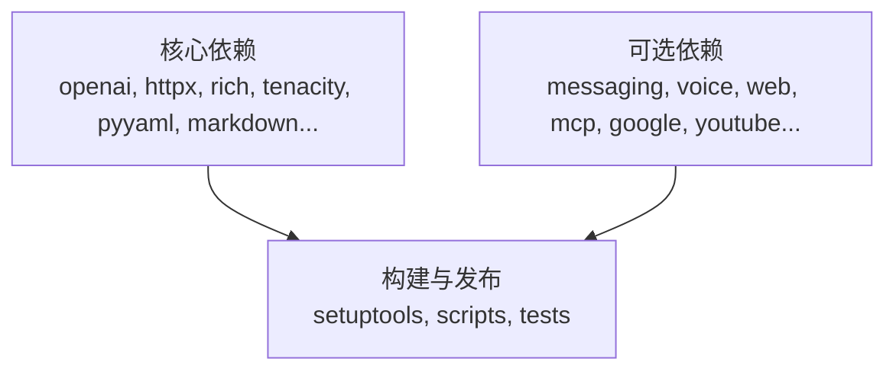

# 项目概述

<cite>
**本文引用的文件**
- [README.md](file://README.md)
- [AGENTS.md](file://AGENTS.md)
- [pyproject.toml](file://pyproject.toml)
- [run_agent.py](file://run_agent.py)
- [cli.py](file://cli.py)
- [tools/registry.py](file://tools/registry.py)
- [apps/desktop/README.md](file://apps/desktop/README.md)
</cite>

## 目录
1. [简介](#简介)
2. [项目结构](#项目结构)
3. [核心组件](#核心组件)
4. [架构总览](#架构总览)
5. [详细组件分析](#详细组件分析)
6. [依赖关系分析](#依赖关系分析)
7. [性能考量](#性能考量)
8. [故障排查指南](#故障排查指南)
9. [结论](#结论)
10. [附录：快速开始与常用用例](#附录：快速开始与常用用例)

## 简介
Sparkii Agent 是一个“自改进”的 AI 代理，具备内置学习循环、跨会话记忆与技能演化、多模态处理（文本、图像、语音）、工具生态系统和定时任务调度等能力。它可在 CLI、消息网关（Telegram、Discord、Slack、WhatsApp、Signal 等）、TUI 终端界面以及 Electron 桌面应用中运行，支持多种模型提供商与云端/本地环境部署，适合个人助手、自动化工作流、研究与批量轨迹生成等场景。

## 项目结构
仓库采用分层与按功能域组织的方式：
- 核心代理与对话循环：run_agent.py、agent/*
- 命令行与交互：cli.py、sparkii_cli/*
- 工具系统与注册：tools/*、tools/registry.py、model_tools.py、toolsets.py
- 消息网关与平台适配：gateway/*、gateway/platforms/*
- 插件与技能：plugins/*、skills/*、optional-skills/*
- 前端与桌面：ui-tui/*、tui_gateway/*、apps/desktop/*、web/*
- 配置与元数据：pyproject.toml、locales/*、scripts/*

图表来源
- [AGENTS.md:269-309](file://AGENTS.md#L269-L309)
- [run_agent.py:137-175](file://run_agent.py#L137-L175)
- [tools/registry.py:108-159](file://tools/registry.py#L108-L159)

章节来源
- [AGENTS.md:269-309](file://AGENTS.md#L269-L309)
- [README.md:19-31](file://README.md#L19-L31)

## 核心组件
- AIAgent 对话循环：负责与 LLM 交互、工具调用闭环、预算与中断控制、上下文压缩与缓存策略。
- 工具系统：集中注册与发现工具，自动扫描 tools/*.py，统一 schema 与执行路径，支持按需启用工具集。
- 记忆与技能：跨会话记忆、FTS5 检索、LLM 摘要、技能自动生成与自我改进。
- 消息网关：统一接入多平台，提供会话路由、投递、状态与流式输出。
- TUI 与桌面：基于 Ink/React 的终端 UI 与 Electron 桌面应用，共享同一后端服务。
- 插件与技能：通过插件机制扩展 CLI 命令、生命周期钩子与工具；技能以声明式方式增强行为。

章节来源
- [run_agent.py:137-175](file://run_agent.py#L137-L175)
- [tools/registry.py:108-159](file://tools/registry.py#L108-L159)
- [AGENTS.md:353-410](file://AGENTS.md#L353-L410)
- [AGENTS.md:467-545](file://AGENTS.md#L467-L545)
- [AGENTS.md:774-798](file://AGENTS.md#L774-L798)

## 架构总览
Sparkii 的核心是“窄腰设计”：核心只保留最小必要能力，扩展通过 CLI 命令、技能、插件、MCP 服务器与工具集在边缘实现。这保证了每轮 API 调用的工具 schema 开销可控，同时保持强大的可拓展性。

图表来源
- [run_agent.py:389-410](file://run_agent.py#L389-L410)
- [tools/registry.py:108-159](file://tools/registry.py#L108-L159)
- [AGENTS.md:353-410](file://AGENTS.md#L353-L410)

## 详细组件分析

### AIAgent 对话循环
- 职责：维护消息历史、管理迭代预算、处理中断、调用模型、执行工具、压缩上下文、记录使用量。
- 关键流程：循环直到完成或达到预算；若模型返回工具调用则执行工具并将结果追加到消息中；否则返回最终内容。
- 安全与健壮性：错误分类、重试退避、敏感信息脱敏、消息清洗。

图表来源
- [run_agent.py:389-410](file://run_agent.py#L389-L410)

章节来源
- [run_agent.py:389-410](file://run_agent.py#L389-L410)

### 工具系统与注册
- 自动发现：扫描 tools/*.py，识别顶层 registry.register() 调用，导入并注册工具。
- 统一接口：所有工具返回 JSON 字符串，支持 check_fn 条件启用、工具集分组、错误体截断保护。
- 性能优化：发现结果缓存于磁盘，避免重复 AST 解析。

图表来源
- [tools/registry.py:108-159](file://tools/registry.py#L108-L159)
- [tools/registry.py:1-15](file://tools/registry.py#L1-L15)

章节来源
- [tools/registry.py:1-15](file://tools/registry.py#L1-L15)
- [tools/registry.py:108-159](file://tools/registry.py#L108-L159)

### 消息网关与平台适配
- 统一入口：gateway/run.py 协调会话、投递、流式消费与平台事件。
- 平台适配：platforms/* 为各平台（Telegram、Discord、Slack、WhatsApp、Signal、Webhook 等）提供适配器，屏蔽差异。
- 特性：会话隔离、速率限制、媒体缓存、健康检查、重连与恢复。

章节来源
- [AGENTS.md:283-288](file://AGENTS.md#L283-L288)
- [README.md:24-29](file://README.md#L24-L29)

### TUI 与桌面应用
- TUI：基于 Ink/React 的终端界面，通过 tui_gateway 与 Python 后端通信，支持流式输出、工具活动、审批与补全。
- 桌面：Electron + React，独立聊天表面，连接 headless sparkii serve 后端，支持文件浏览、预览、语音与设置。
- 共享传输：apps/shared 提供 JSON-RPC/WebSocket 客户端，被桌面与 Web 仪表板复用。

图表来源
- [AGENTS.md:467-545](file://AGENTS.md#L467-L545)
- [apps/desktop/README.md:88-123](file://apps/desktop/README.md#L88-L123)

章节来源
- [AGENTS.md:467-545](file://AGENTS.md#L467-L545)
- [apps/desktop/README.md:88-123](file://apps/desktop/README.md#L88-L123)

### 插件系统与技能
- 插件：通过 PluginManager 从 ~/.sparkii/plugins、本地目录与 pip entry points 发现，支持生命周期钩子、CLI 子命令与工具注册。
- 技能：以声明式方式增强行为，支持自动发现与注入，作为用户消息而非系统提示，避免破坏提示缓存。
- 扩展点：memory-provider、context-engine、image/video generation、cron providers 等均可通过插件接入。

章节来源
- [AGENTS.md:774-798](file://AGENTS.md#L774-L798)
- [AGENTS.md:289-300](file://AGENTS.md#L289-L300)

## 依赖关系分析
- 运行时约束：Python 版本要求与严格的上界策略，减少供应链风险。
- 核心依赖：OpenAI SDK、HTTP 客户端、富文本渲染、重试、YAML 解析、Markdown 转换、包管理与打包等。
- 可选依赖：按功能域拆分（messaging、voice、wake、web、mcp、google、youtube 等），通过 extras 与懒加载降低默认安装体积。
- 构建与发布：setuptools 暴露单文件模块与包集合，确保可移植与可测试。

图表来源
- [pyproject.toml:1-155](file://pyproject.toml#L1-L155)
- [pyproject.toml:157-352](file://pyproject.toml#L157-L352)
- [pyproject.toml:354-404](file://pyproject.toml#L354-L404)

章节来源
- [pyproject.toml:1-155](file://pyproject.toml#L1-L155)
- [pyproject.toml:157-352](file://pyproject.toml#L157-L352)
- [pyproject.toml:354-404](file://pyproject.toml#L354-L404)

## 性能考量
- 提示缓存：会话级前缀缓存至关重要，任何变更过去上下文或工具集会破坏缓存，增加成本。
- 工具开销：每个工具都会随每次 API 调用发送，新增核心工具需权衡 footprint。
- 工具发现缓存：AST 扫描结果缓存于磁盘，减少启动与导入开销。
- 错误体截断：对工具错误信息进行长度限制，防止上下文膨胀。
- 懒加载与 extras：非核心依赖按需安装与加载，降低默认体积与攻击面。

章节来源
- [AGENTS.md:19-27](file://AGENTS.md#L19-L27)
- [tools/registry.py:108-159](file://tools/registry.py#L108-L159)
- [pyproject.toml:157-352](file://pyproject.toml#L157-L352)

## 故障排查指南
- Windows 安全软件误报 uv.exe：确认为 Astral 的 uv 包管理器，可通过签名验证与白名单解决。
- 日志位置：agent.log、errors.log、gateway.log，支持按会话过滤与跟随查看。
- 桌面应用启动失败：检查 SPARKII_HOME/logs/desktop.log，必要时清理引导标记或重建 venv。
- 配置与密钥：config.yaml 存放行为设置，.env 仅存放密钥；通过 sparkii config/get/set 管理。

章节来源
- [README.md:68-101](file://README.md#L68-L101)
- [AGENTS.md:311-314](file://AGENTS.md#L311-L314)
- [apps/desktop/README.md:176-200](file://apps/desktop/README.md#L176-L200)

## 结论
Sparkii Agent 以“窄腰核心 + 边缘扩展”的设计，提供了强大的自改进能力、多模态处理、工具生态与多平台支持。其学习循环、记忆与技能系统使代理能在跨会话中持续进化；CLI、TUI、桌面与消息网关的统一后端确保了体验一致性与可扩展性。对于初学者，可从 CLI 快速上手；对于开发者，可通过插件、技能与 MCP 扩展能力，遵循 footprint 阶梯原则进行演进。

## 附录：快速开始与常用用例
- 安装
  - Linux/macOS/WSL2/Termux：使用一键脚本安装。
  - Windows（原生 PowerShell）：使用安装脚本，自动处理 Python、Node.js、Git Bash 等依赖。
- 基本使用
  - 启动交互 CLI：sparkii
  - 选择模型提供商与模型：sparkii model
  - 配置工具：sparkii tools
  - 启动消息网关：sparkii gateway
  - 完整向导：sparkii setup
- 常用命令参考
  - 新建会话、切换模型、设置人格、重试/撤销、压缩上下文、查看用量与洞察、浏览技能、中断当前工作、平台状态等。
- 典型用例
  - 日常助手：问答、写作、研究、日程与邮件自动化。
  - 开发辅助：代码解释、调试、文件操作、终端执行、浏览器导航。
  - 自动化任务：定时报告、备份、审计，通过 cron 调度并投递至任意平台。
  - 多模态：图像生成、语音转写与合成、视频生成。
  - 远程与云：在 VPS、GPU 集群或无服务器环境中运行，闲置时几乎零成本。

章节来源
- [README.md:35-118](file://README.md#L35-L118)
- [README.md:143-159](file://README.md#L143-L159)
- [README.md:163-183](file://README.md#L163-L183)