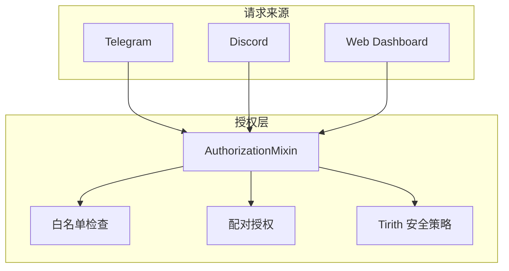

# 权限授权

## 简介

Sparkii Agent 的权限授权系统采用分层架构，在 Gateway 层通过 `AuthorizationMixin` 实现平台级和用户级访问控制，在工具层通过 Tirith 安全框架实现细粒度操作权限管理。

## 架构总览

## RBAC 角色模型

管理员（全部权限）、普通用户（消息+工具）、访客（受限工具）三级角色体系。

## 平台级白名单

通过环境变量配置允许的用户列表，如 `TELEGRAM_ALLOWED_USERS` 和 `DISCORD_ALLOWED_USERS`。

## 配对授权

通过扫码或口令为新用户授予访问权限。

## Tirith 安全策略

控制文件读写、命令执行、网络请求等操作权限。

## 最佳实践

1. 始终配置白名单
2. 群组和用户白名单配合
3. 定期审查授权日志
4. 使用 Tirith 最小权限
