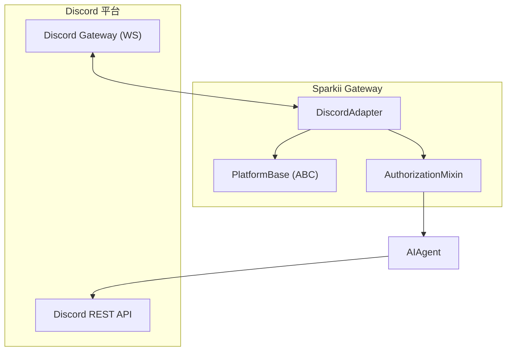
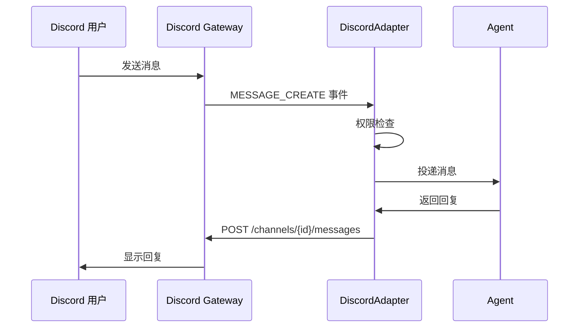

# Discord 适配器

## 简介

Discord 适配器是 Sparkii Gateway 多平台消息系统的重要组成部分，负责将 Discord 平台的消息事件转换为统一的内部格式。基于 Discord Bot API 实现，支持 WebSocket Gateway 连接、交互组件和丰富的消息格式。

## 架构总览

## Bot 框架集成

### WebSocket 连接管理
通过 WebSocket Gateway 接收实时事件，包括心跳维护、断线重连和序列号跟踪。

### 认证流程
使用 Discord Bot Token 认证，通过 Intents 配置声明需要接收的事件类型。

## 消息事件处理

## 交互组件

- **按钮 (Buttons)**：支持主按钮、链接按钮，通过 custom_id 标识回调
- **选择菜单 (Select Menus)**：支持字符串、用户、频道等多种类型

## 频道与权限

| 频道类型 | 支持状态 | 说明 |
|---------|---------|------|
| 文本频道 | 完全支持 | 标准消息收发 |
| 私信 (DM) | 支持 | 私人对话 |
| 论坛频道 | 支持 | 帖子模式 |
| 线程 | 支持 | 子对话 |

## 速率限制

智能限流机制：全局 50 请求/秒，每频道 5 条/5秒，自动处理 429 错误并等待 Retry-After。

## 最佳实践

1. 使用环境变量管理 Bot Token
2. 配置用户/频道白名单
3. 处理消息长度限制（2000 字符）
4. 实现优雅的错误回复
