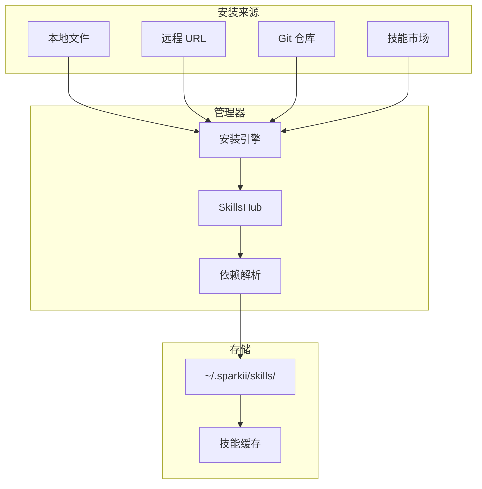

# 技能安装与管理

## 简介

Sparkii Agent 的技能系统允许用户通过 Markdown 文件定义可复用的 Agent 行为模板。技能安装与管理模块提供了从本地安装、远程下载、Git 仓库集成到版本控制的完整生命周期管理。

## 架构总览



## 技能安装方式

### 本地安装
从本地文件系统安装技能目录或 SKILL.md 文件。系统自动验证 SKILL.md 格式和必需字段。

### 远程 URL 安装
从 HTTP/HTTPS URL 下载安装，支持断点续传和完整性校验。

### Git 仓库集成
支持从 Git 仓库安装，包括指定分支、标签和子目录路径。私有仓库通过 SSH 密钥或 token 认证。

### 技能市场
从 Sparkii 技能市场浏览和安装社区审核的技能包。

## 技能管理功能

| 操作 | 命令 | 说明 |
|------|------|------|
| 列表查看 | `sparkii skills list` | 列出已安装技能 |
| 启用 | `sparkii skills enable <name>` | 激活技能 |
| 禁用 | `sparkii skills disable <name>` | 停用技能 |
| 卸载 | `sparkii skills uninstall <name>` | 移除技能 |
| 信息查看 | `sparkii skills info <name>` | 查看详情 |

## 技能配置管理

技能通过 SKILL.md 的 YAML front matter 声明配置需求：环境变量设置、工具权限声明、沙箱隔离级别。

## 版本控制与更新

```bash
sparkii skills update <name>       # 更新到最新
sparkii skills update --all        # 更新所有
sparkii skills pin <name> @v1.2.0  # 锁定版本
```

## 故障排查

| 问题 | 原因 | 解决方案 |
|------|------|---------|
| 安装失败 | 网络不可达 | 检查网络连接 |
| Git 超时 | 仓库过大 | 使用 shallow clone |
| 未生效 | 未启用 | 运行 sparkii skills enable |
| 依赖冲突 | 同名冲突 | 卸载冲突技能 |
