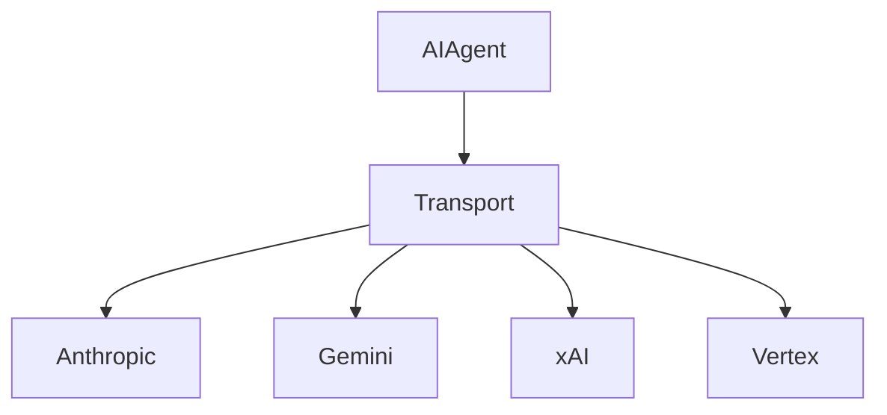

# 主流 AI 提供商

## 简介

Sparkii Agent 通过插件化传输层支持多个主流 AI 服务提供商。

## 架构总览

## Anthropic Claude

支持思维链推理和扩展思考功能，200K token 上下文窗口。

## Google Gemini

支持多模态能力，1M+ token 上下文，结构化输出。

## xAI Grok

提供实时信息检索能力。

## Google Vertex AI

企业级 AI 服务，支持 Service Account 认证。

## 认证机制对比

| 提供商 | 认证方式 | 刷新策略 |
|--------|---------|----------|
| Anthropic | API Key | 无需刷新 |
| Gemini | API Key/OAuth | 自动刷新 |
| xAI | OAuth 设备码 | 过期前刷新 |
| Vertex | Service Account | 自动刷新 |

## 最佳实践

使用凭证池统一管理密钥，配置合适的超时参数。
