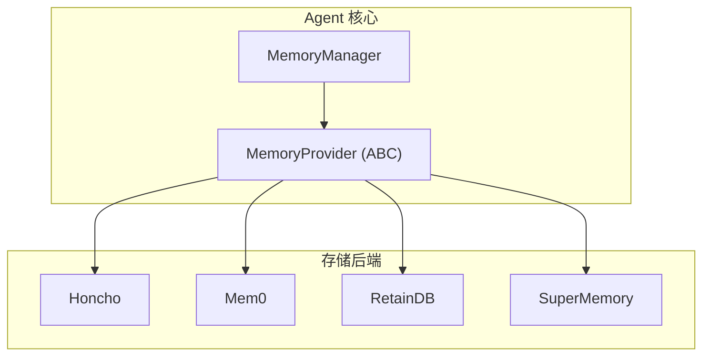

# 内置存储后端

## 简介

Sparkii Agent 的记忆系统通过插件化架构支持多种存储后端。内置后端包括 Honcho、Mem0、RetainDB 和 SuperMemory，每种后端针对不同的使用场景和性能需求优化。

## 架构总览



## Honcho 存储后端

面向 AI 应用的会话和记忆管理平台：
- **会话持久化**：自动保存和恢复对话历史
- **语义记忆**：基于向量相似度的记忆检索
- **用户画像**：跨会话的用户偏好学习

## Mem0 存储后端

开源 AI 记忆层，专注于长期记忆管理：
- **自动提取**：从对话中自动提取关键事实
- **向量索引**：使用嵌入模型构建语义索引
- **冲突解决**：自动处理记忆更新中的冲突

## RetainDB 存储后端

结构化记忆存储，适合精确查询场景：关系数据模型、SQL 查询支持、事务保证。

## SuperMemory 存储后端

轻量级记忆存储，适合本地部署：极低资源占用、文件系统存储、快速索引查找。

## 存储后端对比

| 特性 | Honcho | Mem0 | RetainDB | SuperMemory |
|------|--------|------|----------|-------------|
| 部署方式 | 云托管 | 云/自托管 | 自托管 | 本地 |
| 语义搜索 | 支持 | 支持 | 不支持 | 基础 |
| 结构化查询 | 部分 | 不支持 | 支持 | 不支持 |
| 资源需求 | 低 | 中 | 中 | 极低 |
| 适用场景 | 生产环境 | 灵活部署 | 精确查询 | 开发测试 |

## 配置指南

```yaml
memory:
  provider: honcho  # 或 mem0/retaindb/supermemory
  config:
    api_key: $MEMORY_API_KEY
  embedding_model: text-embedding-3-small
  max_memories: 1000
```

## 扩展开发

实现 `MemoryProvider` 抽象基类的 `store`、`retrieve`、`update`、`delete` 方法即可创建自定义后端。
