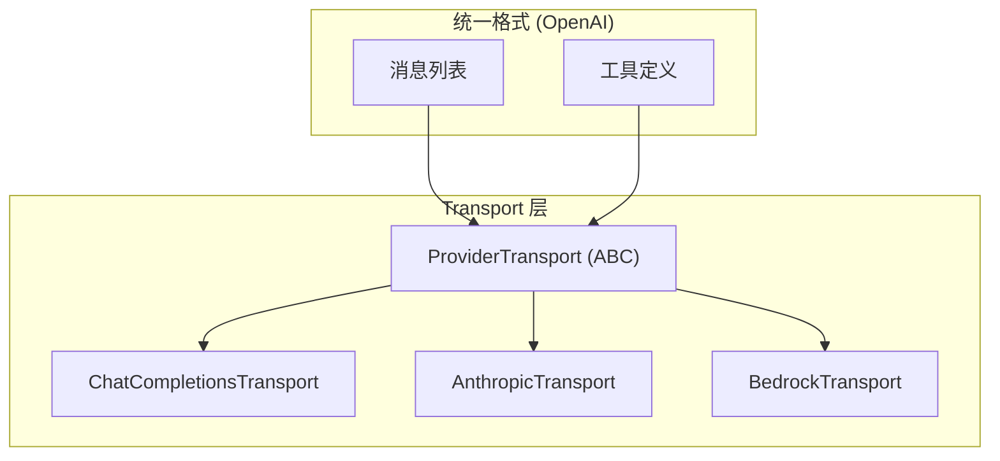
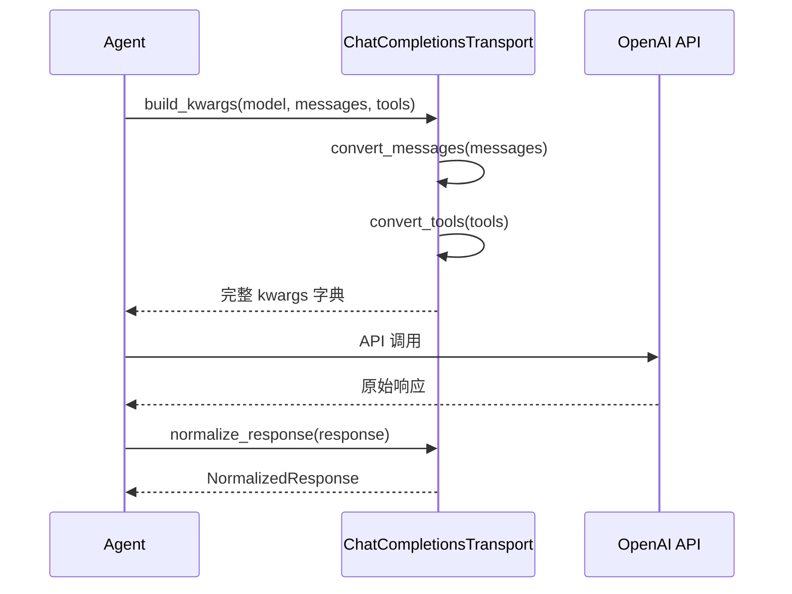

# 消息格式转换

<cite>

**本文引用的文件**
- [agent/transports/chat_completions.py](file://agent/transports/chat_completions.py)
- [agent/transports/anthropic.py](file://agent/transports/anthropic.py)
- [agent/transports/base.py](file://agent/transports/base.py)
</cite>

## 简介

Sparkii Agent 内部使用统一的 OpenAI 格式表示消息和工具定义。当与不同 AI 提供商通信时，需要将这些格式转换为各提供商的原生格式。`ProviderTransport` 抽象基类定义了标准的转换流水线：`convert_messages -> convert_tools -> build_kwargs -> normalize_response`。

## 架构总览



## ProviderTransport 基类

| 方法 | 说明 |
|------|------|
| `convert_messages()` | OpenAI 消息 -> 提供商原生格式 |
| `convert_tools()` | OpenAI 工具定义 -> 提供商原生格式 |
| `build_kwargs()` | 构建完整 API 调用参数（主入口） |
| `normalize_response()` | 原始响应 -> NormalizedResponse |

另有可选方法：`validate_response()`、`extract_cache_stats()`、`map_finish_reason()`。

章节来源
- [agent/transports/base.py:16-90](file://agent/transports/base.py#L16-L90)

## ChatCompletions 格式转换

`ChatCompletionsTransport` 处理 OpenAI Chat Completions API 兼容格式。由于 Sparkii 内部已使用 OpenAI 格式，消息转换主要是清理和验证。关键处理包括 system 消息保留、多模态内容验证和工具调用格式维护。



章节来源
- [agent/transports/chat_completions.py:207-412](file://agent/transports/chat_completions.py#L207-L412)

## Anthropic 格式转换

`AnthropicTransport` 将 OpenAI 格式转换为 Anthropic Messages API 格式，这是最复杂的转换之一。

| 特性 | OpenAI | Anthropic |
|------|--------|-----------|
| System 消息 | `role: "system"` | 顶层 `system` 参数 |
| 图片 | `type: "image_url"` | `type: "image"` + base64 |
| 工具调用 | `tool_calls` 数组 | `tool_use` content block |
| 工具结果 | `role: "tool"` | `role: "user"` + `tool_result` |
| 停止原因 | `"stop"` / `"tool_calls"` | `"end_turn"` / `"tool_use"` |

实际转换委托给 `agent/anthropic_adapter.py` 中的 `convert_messages_to_anthropic` 函数。

章节来源
- [agent/transports/anthropic.py:13-50](file://agent/transports/anthropic.py#L13-L50)

## 多模态消息处理

图片消息在 OpenAI 和 Anthropic 格式间需要结构转换：
- OpenAI: `content: [{type: 'image_url', image_url: {url: '...'}}]`
- Anthropic: `content: [{type: 'image', source: {type: 'base64', ...}}]`

## 工具定义转换

```json
// OpenAI 工具格式
{"type": "function", "function": {"name": "read_file", "parameters": {...}}}

// Anthropic 工具格式
{"name": "read_file", "input_schema": {...}}
```

## 响应标准化

所有提供商的响应都通过 `normalize_response()` 转换为统一的 `NormalizedResponse` 结构，包含 content、tool_calls、finish_reason、usage 和 raw_response 字段。

## 最佳实践

1. 始终通过 `build_kwargs()` 入口调用
2. 实现 `validate_response()` 校验响应结构
3. 保留原始响应用于调试
4. 测试空消息、纯工具调用等边界情况
