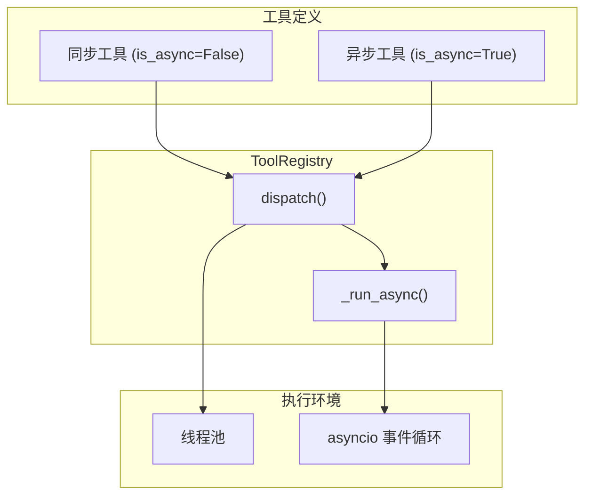

# 异步执行框架

<cite>

**本文引用的文件**
- [tools/registry.py](file://tools/registry.py)
</cite>

## 简介

Sparkii Agent 的工具系统支持同步和异步两种执行模式。通过 `is_async` 参数，工具开发者可以声明工具的执行模式，系统自动选择合适的调度策略。框架负责事件循环管理、线程池调度、并发控制和错误传播。

## 架构总览



## 工具注册与 is_async 参数

```python
from tools.registry import registry

# 同步工具
registry.register(
    name="read_file", toolset="terminal",
    schema={...}, handler=sync_handler, is_async=False
)

# 异步工具
registry.register(
    name="web_search", toolset="web",
    schema={...}, handler=async_handler, is_async=True
)
```

`ToolEntry` 类通过 `__slots__` 存储 `is_async` 字段，避免实例字典开销。

章节来源
- [tools/registry.py:201-230](file://tools/registry.py#L201-L230)

## 统一调度

`ToolRegistry.dispatch()` 根据 `is_async` 选择执行路径：

```python
def dispatch(self, name, args, **kwargs):
    entry = self.get_entry(name)
    if entry.is_async:
        result = _run_async(entry.handler(args, **kwargs))
    else:
        result = entry.handler(args, **kwargs)
    return self._normalize_handler_result(name, result)
```

`_run_async()` 负责将协程桥接到事件循环：若当前线程已有事件循环则使用 `loop.run_until_complete()`；否则创建新的临时循环执行。

章节来源
- [tools/registry.py:801-834](file://tools/registry.py#L801-L834)

## 并发控制

- **线程安全**：`ToolRegistry` 使用 `threading.RLock` 保护写操作
- **快照机制**：读操作使用 `_snapshot_entries()` 避免长时间持锁
- **代际计数器**：`_generation` 字段用于外部缓存失效判断

### check_fn 缓存

外部依赖检查通过 TTL 缓存避免频繁探测：
- 缓存 TTL：30 秒
- 故障容忍窗口：60 秒（最近成功后容忍临时失败）
- 最大缓存条目：512

章节来源
- [tools/registry.py:257-380](file://tools/registry.py#L257-L380)

## 错误处理

所有异常被捕获并格式化为 JSON 错误响应。错误文本限制在 2048 字符以内（`_MAX_TOOL_ERROR_CHARS`），防止膨胀上下文窗口。日志保留更长的 8192 字符前缀用于调试。

`_normalize_handler_result()` 确保返回值符合预期格式：字符串直接返回；多模态信封保留结构；其他类型转换为错误信息。

章节来源
- [tools/registry.py:770-834](file://tools/registry.py#L770-L834)

## 最佳实践

1. I/O 密集型工具使用 `is_async=True`
2. CPU 密集型工具使用 `is_async=False`
3. 避免在异步工具中调用同步阻塞操作
4. 工具返回值必须是字符串（使用 `tool_result()` 或 `tool_error()`）
5. 合理设置 `max_result_size_chars` 防止大型结果消耗上下文
