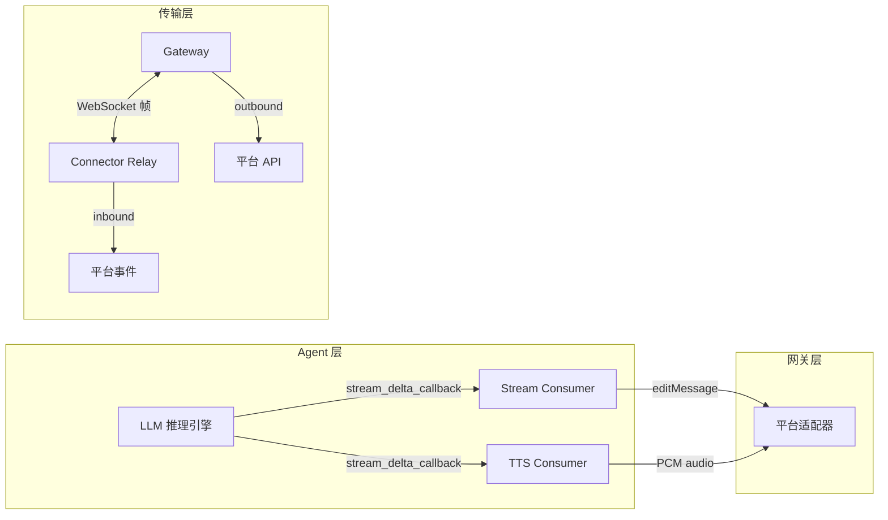
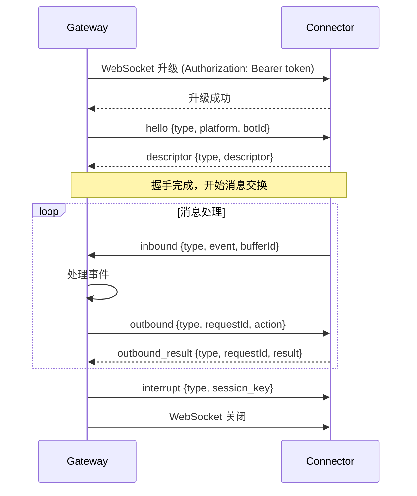
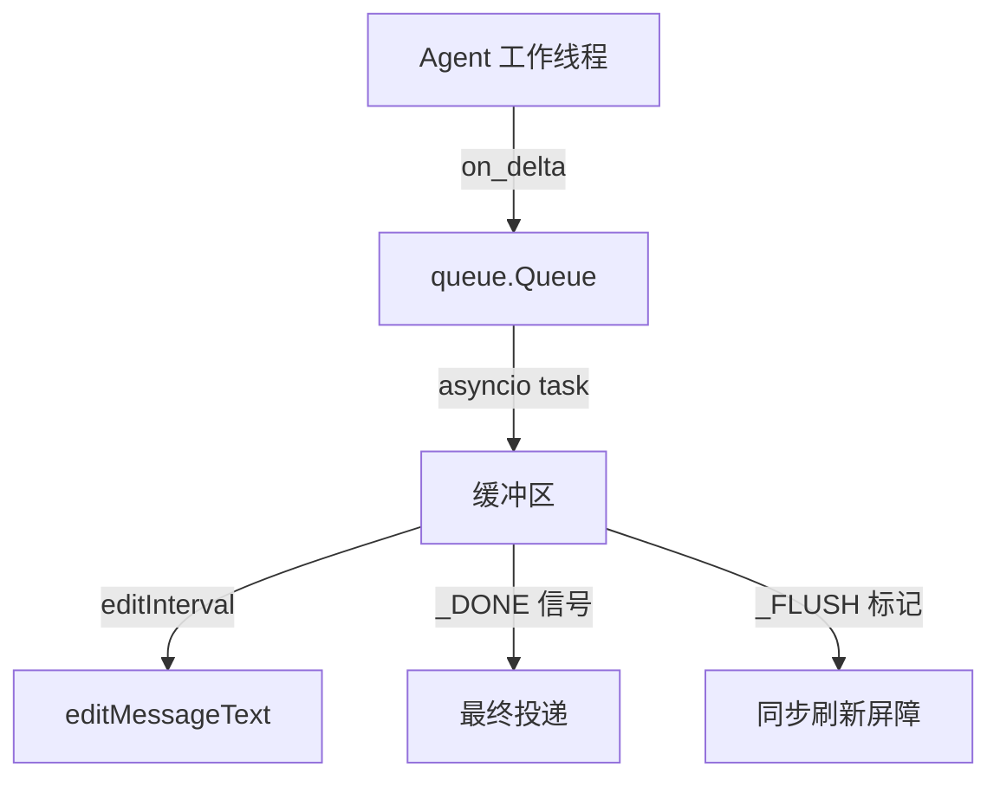

# 实时通信机制

## 概述

Sparkii Agent 的实时通信机制基于 WebSocket 帧协议和流式消费者架构，实现了从 LLM 推理到平台消息投递的低延迟实时数据流。系统包含三个核心组件：WebSocket 中继传输层、流式文本消费者和流式 TTS 消费器。

## 架构总览



## WebSocket 中继传输

### 帧协议

中继传输层实现位于 `gateway/relay/ws_transport.py`，定义了网关与连接器之间的 JSON 帧协议：

| 帧类型 | 方向 | 说明 |
|--------|------|------|
| `hello` | gateway -> connector | 握手初始化，携带 platform、botId |
| `descriptor` | connector -> gateway | 握手回复，返回能力描述符 |
| `inbound` | connector -> gateway | 归一化的 MessageEvent |
| `outbound` | gateway -> connector | 动作指令（send/edit/typing/follow_up） |
| `outbound_result` | connector -> gateway | 动作执行结果 |
| `interrupt` | gateway -> connector | 会话中断信号（/stop） |
| `interrupt_inbound` | connector -> gateway | 连接器向拥有关联网关转发中断 |

### 连接生命周期



### 超时配置

```python
# gateway/relay/ws_transport.py
_HANDSHAKE_TIMEOUT_S = 30.0          # 握手描述符等待超时
_OUTBOUND_TIMEOUT_S = 30.0           # 每个 outbound 结果等待超时
_TEARDOWN_AWAIT_TIMEOUT_S = 1.0      # 拆卸等待超时
_RELAY_UNAUTHORIZED_CLOSE_CODE = 4401  # 认证失败关闭码
```

### 请求-响应匹配

Outbound 调用通过 `requestId` 键控的 `asyncio.Future` 阻塞等待匹配的 `outbound_result`。后台读取任务将入站帧泵送到注册的处理器，并解析待处理的 outbound Future。

### URL 规范化

中继 URL 需要两次规范化：
- **协议**：`https -> wss`，`http -> ws`
- **路径**：确保以 `/relay` 结尾

```python
def _ws_dial_url(url: str) -> str:
    # https -> wss, http -> ws
    # 确保路径以 /relay 结尾
```

## 流式文本消费者

`GatewayStreamConsumer`（`gateway/stream_consumer.py`）将同步的 Agent 回调桥接到异步的平台消息投递。

### 设计要点

- **线程安全入口**：`on_delta()` 从 Agent 工作线程同步调用，通过 `queue.Queue` 将增量传递给 asyncio 任务
- **渐进式编辑**：异步任务缓冲、限速后，通过 `editMessageText` 渐进更新单条消息
- **代码围栏修复**：自动检测并修复截断的代码块（三重反引号和单反引号）

### 流程



### 关键参数

| 参数 | 默认值 | 说明 |
|------|--------|------|
| `STREAMING_EDIT_INTERVAL` | 可配置 | 消息编辑最小间隔 |
| `STREAMING_BUFFER_THRESHOLD` | 可配置 | 缓冲区触发阈值 |
| `STREAMING_CURSOR` | 可配置 | 流式光标样式 |

### 辅助函数

- `escape_code_fences_for_display()`：转义三重反引号，防止嵌套代码块破坏显示
- `ensure_closed_code_fences()`：自动闭合截断的代码围栏和内联代码标记

## 流式 TTS 消费器

`StreamingTTSConsumer`（`gateway/streaming_tts_consumer.py`）将 LLM 文本增量转换为实时 PCM 音频流。

### 生命周期

```python
consumer = StreamingTTSConsumer(adapter, chat_id, tts_config, loop, metadata)
agent.stream_delta_callback = consumer.on_delta   # 同步，非阻塞
# ... agent 在 executor 中运行 ...
consumer.finish()            # 信号文本结束
success = await consumer.wait_complete(timeout=10)
if consumer.suppress_whole_file:
    # 抑制整文件自动 TTS
consumer.abort("cancelled")  # 幂等取消
```

### 设计特点

- **非阻塞**：`on_delta()` 同步且永不阻塞 Agent 线程
- **句子分块**：使用 `SentenceChunker` 将文本分块为完整子句
- **流式合成**：asyncio 任务通过 `StreamingTTSProvider` 合成每个子句
- **故障降级**：成功完成时报告 `completed=True` 抑制重复 TTS；失败时根据是否已有音频输出决定是否回退

### 每轮状态隔离

每个消费者实例拥有独立的分块器、队列、句柄和标志，并发对话不会交叉污染。

## 安全机制

1. **HMAC 认证**：WebSocket 升级使用 HMAC-SHA256 签名令牌
2. **投递签名验证**：入站事件携带时间戳和签名，防止重放攻击
3. **多密钥轮换**：支持主/次密钥平滑切换
4. **4401 关闭码**：连接器可撤销网关授权，传输层将其视为终止性错误

## 源文件参考

| 文件 | 职责 |
|------|------|
| `gateway/relay/ws_transport.py` | WebSocket 中继传输层（903 行） |
| `gateway/relay/auth.py` | 中继认证原语 |
| `gateway/stream_consumer.py` | 流式文本消费者（2413 行） |
| `gateway/streaming_tts_consumer.py` | 流式 TTS 消费器（424 行） |
