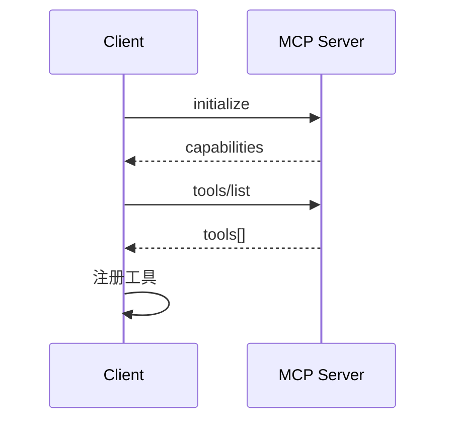
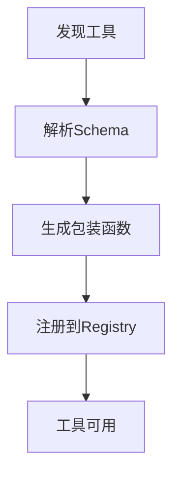

# 工具发现与注册

<cite>
**本文引用的文件**
- [tools/mcp_tool.py](file://tools/mcp_tool.py)
- [tools/mcp_schema_cache.py](file://tools/mcp_schema_cache.py)
</cite>

## 目录
1. [简介](#简介)
2. [工具发现流程](#工具发现流程)
3. [工具描述规范](#工具描述规范)
4. [参数验证机制](#参数验证机制)
5. [工具注册过程](#工具注册过程)
6. [缓存策略](#缓存策略)
7. [结论](#结论)

## 简介
本文档说明MCP工具的发现与注册机制，包括工具列表获取、动态更新和缓存策略。

## 工具发现流程

### 发现过程


### 工具列表获取
```python
async def discover_tools(server):
    tools = await server.list_tools()
    for tool in tools:
        register_tool(tool.name, tool.description, tool.inputSchema)
    return tools
```

## 工具描述规范

### 描述结构
```json
{
  "name": "read_file",
  "description": "读取文件内容",
  "inputSchema": {
    "type": "object",
    "properties": {
      "path": {
        "type": "string",
        "description": "文件路径"
      }
    },
    "required": ["path"]
  }
}
```

### 命名规范
- 使用snake_case命名
- 名称简洁明了
- 避免歧义

## 参数验证机制

### 验证流程
1. **类型检查**：验证参数类型
2. **必填检查**：检查required字段
3. **范围检查**：验证数值范围
4. **格式检查**：验证字符串格式

### 验证示例
```python
from jsonschema import validate

def validate_params(tool_schema, params):
    try:
        validate(instance=params, schema=tool_schema)
        return True
    except ValidationError as e:
        return str(e)
```

## 工具注册过程

### 注册流程


### 注册代码
```python
def register_mcp_tool(tool_def, server):
    async def wrapper(**kwargs):
        return await server.call_tool(tool_def.name, kwargs)
    
    registry.register(
        name=tool_def.name,
        description=tool_def.description,
        schema=tool_def.inputSchema,
        handler=wrapper
    )
```

## 缓存策略

### Schema缓存
- 使用文件缓存工具Schema
- 设置缓存过期时间
- 支持手动刷新

### 动态更新
- 定期轮询工具列表
- 检测工具变更
- 自动更新缓存

## 结论
MCP工具发现与注册机制提供了标准化的工具集成方式。通过缓存和动态更新策略，确保工具列表的实时性和准确性。

