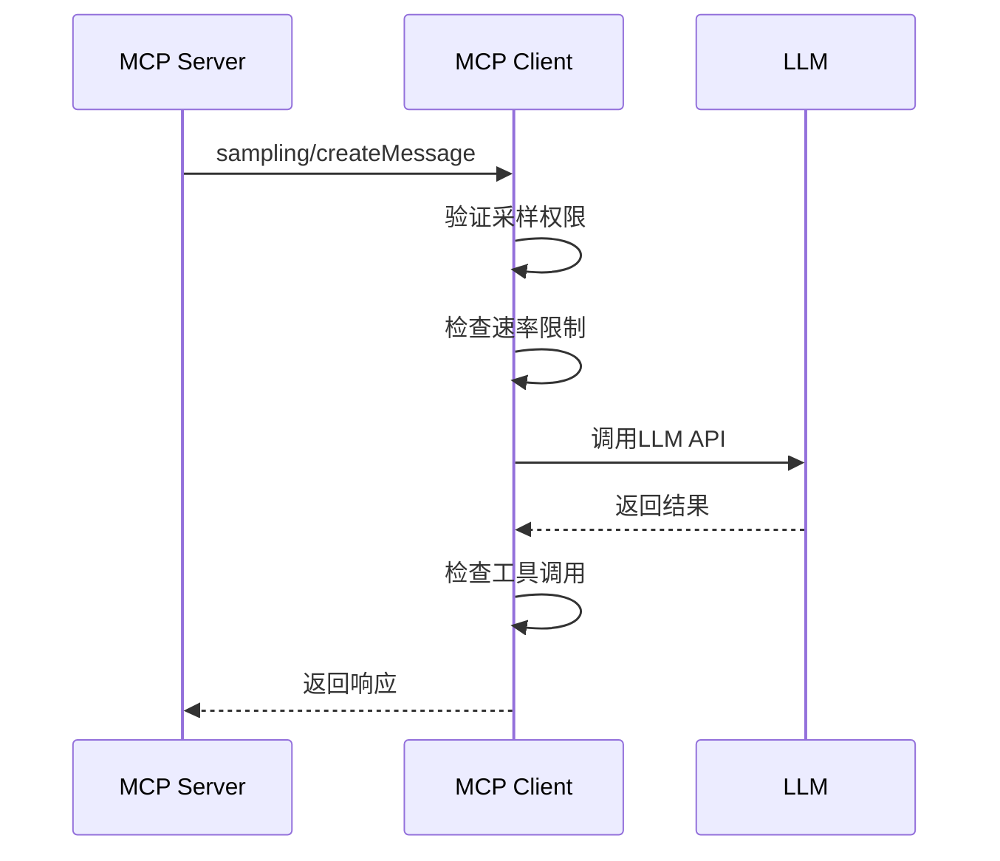

# 采样机制详解

<cite>
**本文引用的文件**
- [tools/mcp_tool.py](file://tools/mcp_tool.py)
</cite>

## 目录
1. [简介](#简介)
2. [采样配置参数](#采样配置参数)
3. [采样请求流程](#采样请求流程)
4. [模型白名单验证](#模型白名单验证)
5. [速率限制机制](#速率限制机制)
6. [错误处理策略](#错误处理策略)
7. [结论](#结论)

## 简介
本文档深入解释MCP协议的采样机制(sampling)，允许MCP服务器请求LLM完成(createMessage)。采样是MCP协议的核心功能之一，使工具能够利用AI能力进行智能处理。

## 采样配置参数

### 配置结构
```yaml
mcp_servers:
  my_server:
    sampling:
      enabled: true              # 是否启用采样(默认true)
      model: "gemini-3-flash"    # 指定模型(可选)
      max_tokens_cap: 4096       # 单次请求最大token数
      timeout: 30                # LLM调用超时(秒)
      max_rpm: 10                # 每分钟最大请求数
      allowed_models: []         # 模型白名单(空=全部允许)
      max_tool_rounds: 5         # 工具调用轮次限制(0=禁用)
      log_level: "info"          # 审计日志级别
```

### 参数说明
| 参数 | 类型 | 默认值 | 说明 |
|------|------|--------|------|
| enabled | bool | true | 是否启用采样 |
| model | string | - | 指定LLM模型 |
| max_tokens_cap | int | 4096 | 最大token限制 |
| timeout | int | 30 | 调用超时(秒) |
| max_rpm | int | 10 | 每分钟请求限制 |
| allowed_models | list | [] | 模型白名单 |

## 采样请求流程

### 生命周期


### 请求处理
1. **权限验证**：检查采样是否启用
2. **模型验证**：确认请求的模型在白名单内
3. **速率限制**：检查是否超过max_rpm
4. **LLM调用**：执行实际的模型调用
5. **结果处理**：处理可能的工具调用
6. **响应返回**：将结果返回给MCP服务器

## 模型白名单验证

### 配置示例
```yaml
sampling:
  allowed_models:
    - "gemini-3-flash"
    - "gpt-4o"
    - "claude-3-opus"
```

### 验证逻辑
- 空列表表示允许所有模型
- 非空列表时，请求的模型必须在列表中
- 模型名称匹配不区分大小写

## 速率限制机制

### 实现原理
- 使用滑动窗口算法
- 基于每分钟请求数(max_rpm)
- 超限返回429错误

### 最佳实践
- 根据LLM API配额设置max_rpm
- 监控实际使用量，动态调整限制
- 实现指数退避重试

## 错误处理策略

### 常见错误类型
1. **超时错误**：LLM调用超过timeout
2. **速率限制**：超过max_rpm限制
3. **模型不可用**：请求的模型不在白名单
4. **工具调用失败**：max_tool_rounds超限

### 重试机制
- 自动重试3次
- 指数退避(1s, 2s, 4s)
- 超时后立即失败，不重试

## 结论
MCP采样机制为工具提供了利用AI能力的标准化接口。通过合理的配置和速率限制，可以在保证系统稳定性的同时充分利用LLM的能力。

