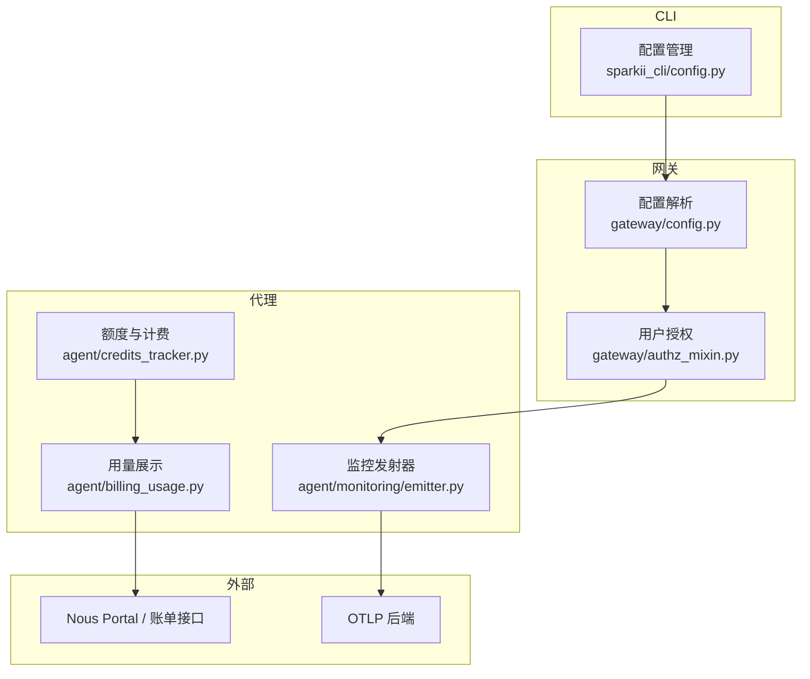
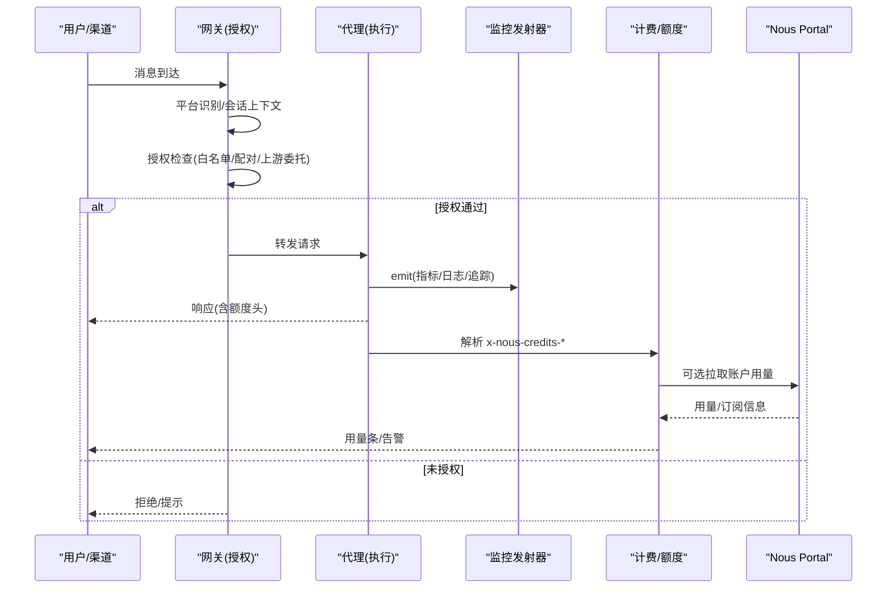
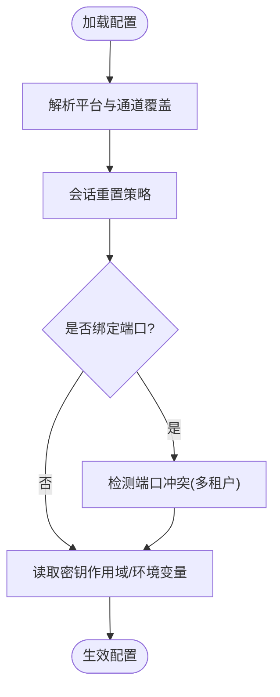
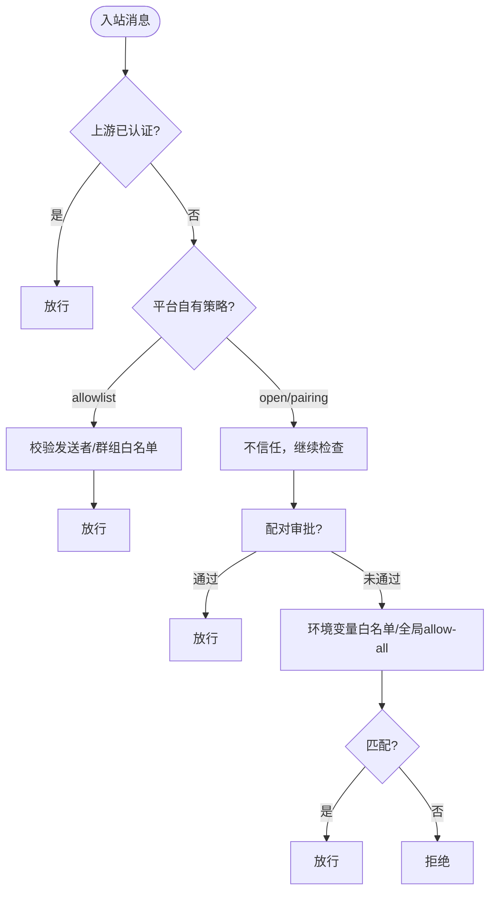
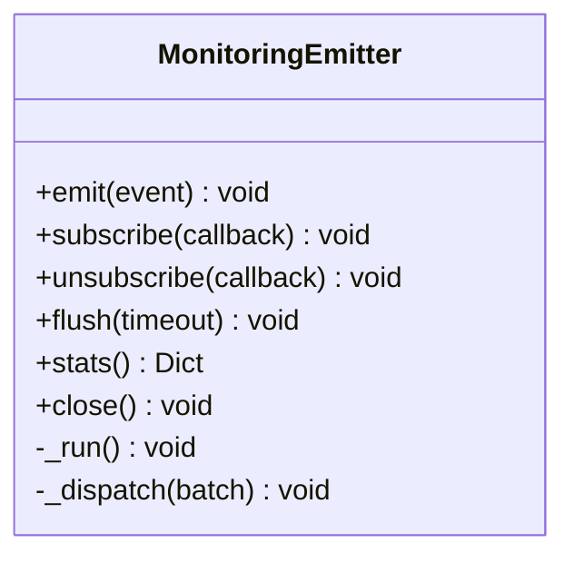
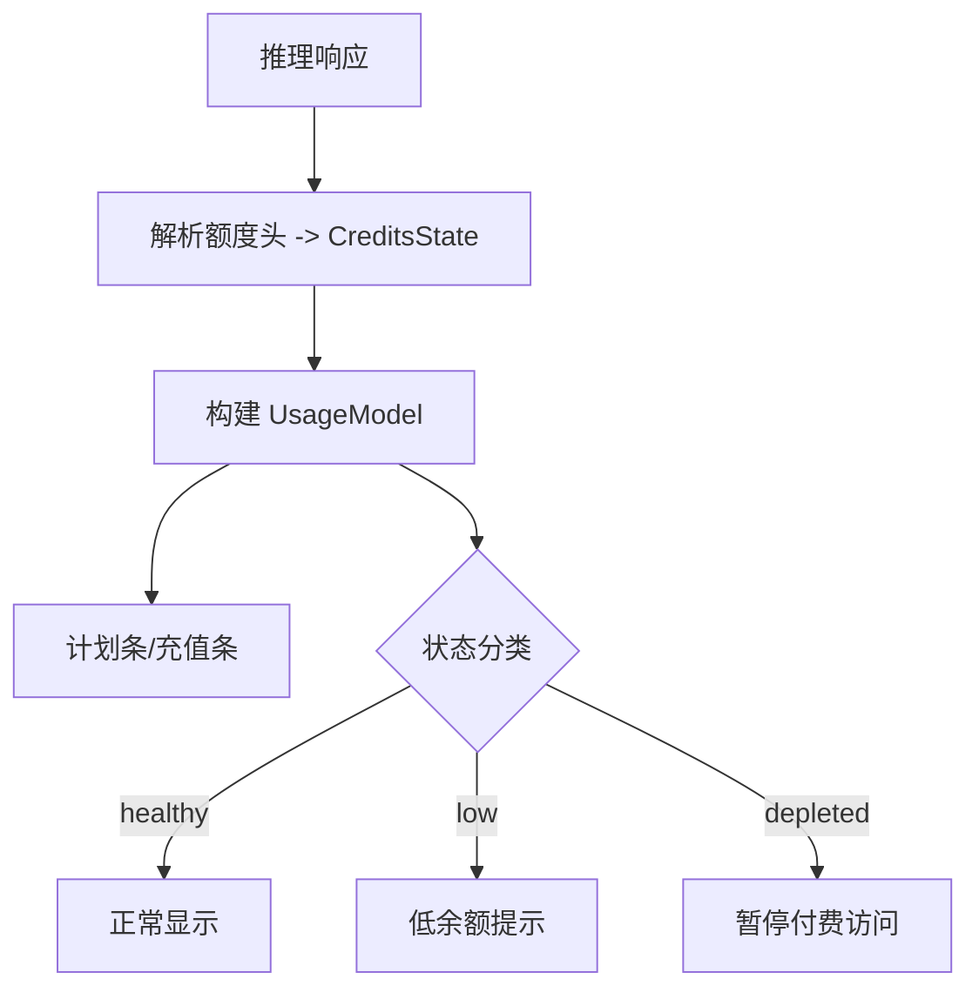
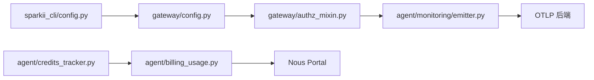

# 企业级功能

<cite>
**本文引用的文件**
- [README.md](file://README.md)
- [gateway/config.py](file://gateway/config.py)
- [sparkii_cli/config.py](file://sparkii_cli/config.py)
- [agent/monitoring/emitter.py](file://agent/monitoring/emitter.py)
- [agent/billing_usage.py](file://agent/billing_usage.py)
- [agent/credits_tracker.py](file://agent/credits_tracker.py)
- [gateway/authz_mixin.py](file://gateway/authz_mixin.py)
</cite>

## 目录
1. [简介](#简介)
2. [项目结构](#项目结构)
3. [核心组件](#核心组件)
4. [架构总览](#架构总览)
5. [详细组件分析](#详细组件分析)
6. [依赖关系分析](#依赖关系分析)
7. [性能考量](#性能考量)
8. [故障排查指南](#故障排查指南)
9. [结论](#结论)
10. [附录](#附录)

## 简介
本指南面向企业级部署与运维，围绕多租户隔离、权限控制（RBAC/细粒度）、监控与可观测性、安全加固、合规支持以及高可用配置等主题，提供原理说明、配置要点与最佳实践。内容基于仓库中的网关配置、授权策略、计费与额度追踪、监控发射器等模块实现进行提炼，帮助您在生产环境中构建安全、可观测、可扩展的 AI Agent 平台。

## 项目结构
本项目采用“网关 + 代理 + CLI + 插件”的分层组织方式：
- 网关层负责消息接入、路由、会话生命周期、平台适配与授权校验
- 代理层提供模型调用、工具执行、记忆与技能、监控与审计等能力
- CLI 层提供配置管理、安装更新、诊断与交互入口
- 插件体系扩展平台、工具、模型与可观测性能力

**图表来源**
- [gateway/config.py:272-417](file://gateway/config.py#L272-L417)
- [gateway/authz_mixin.py:386-783](file://gateway/authz_mixin.py#L386-L783)
- [agent/monitoring/emitter.py:36-117](file://agent/monitoring/emitter.py#L36-L117)
- [agent/credits_tracker.py:93-150](file://agent/credits_tracker.py#L93-L150)
- [agent/billing_usage.py:88-136](file://agent/billing_usage.py#L88-L136)
- [sparkii_cli/config.py:694-700](file://sparkii_cli/config.py#L694-L700)

**章节来源**
- [README.md:105-183](file://README.md#L105-L183)
- [gateway/config.py:272-417](file://gateway/config.py#L272-L417)
- [sparkii_cli/config.py:694-700](file://sparkii_cli/config.py#L694-L700)

## 核心组件
- 网关配置与平台接入：集中定义平台枚举、端口绑定策略、流式输出、通道覆盖等，支撑多租户下的差异化配置与隔离
- 授权与访问控制：统一的用户/群组/渠道准入策略，支持上游认证委托、平台自有策略、配对审批与环境变量白名单
- 监控与可观测性：无阻塞的事件发射器，批量分发至 OTLP 指标/日志/追踪，确保热路径零影响
- 计费与额度追踪：解析响应头中的额度信息，计算使用比例、低余额告警、订阅上限与充值余额双条可视化
- 配置管理：安全的 .env 写入白名单、配置文件备份与回退、容器化与 NixOS 管理模式

**章节来源**
- [gateway/config.py:272-800](file://gateway/config.py#L272-L800)
- [gateway/authz_mixin.py:31-783](file://gateway/authz_mixin.py#L31-L783)
- [agent/monitoring/emitter.py:1-117](file://agent/monitoring/emitter.py#L1-L117)
- [agent/credits_tracker.py:93-150](file://agent/credits_tracker.py#L93-L150)
- [agent/billing_usage.py:88-136](file://agent/billing_usage.py#L88-L136)
- [sparkii_cli/config.py:45-156](file://sparkii_cli/config.py#L45-L156)

## 架构总览
下图展示了企业级关键流程：消息进入网关后，先进行平台与身份识别，再执行授权策略；随后进入代理执行，期间通过监控发射器上报指标/日志/追踪；计费与额度在推理响应中解析并用于前端展示与告警。

**图表来源**
- [gateway/authz_mixin.py:386-783](file://gateway/authz_mixin.py#L386-L783)
- [agent/monitoring/emitter.py:53-117](file://agent/monitoring/emitter.py#L53-L117)
- [agent/credits_tracker.py:444-633](file://agent/credits_tracker.py#L444-L633)
- [agent/billing_usage.py:143-223](file://agent/billing_usage.py#L143-L223)

## 详细组件分析

### 多租户支持与资源隔离
- 平台与通道覆盖：通过平台枚举与 ChannelOverride，可在同一网关实例下为不同频道/群组设置不同的模型、提供者与系统提示词，实现逻辑上的租户隔离
- 会话重置策略：支持按日/空闲/组合模式自动重置会话，避免跨租户上下文泄漏
- 端口绑定与复用：对需要绑定端口的平台（如 webhook、api_server）进行冲突检测，在多租户复用监听时由默认租户独占
- 环境变量与作用域：支持通过密钥作用域读取平台令牌与允许列表，避免多租户间配置泄露

**图表来源**
- [gateway/config.py:543-574](file://gateway/config.py#L543-L574)
- [gateway/config.py:485-540](file://gateway/config.py#L485-L540)
- [gateway/config.py:384-417](file://gateway/config.py#L384-L417)
- [gateway/config.py:234-249](file://gateway/config.py#L234-L249)

**章节来源**
- [gateway/config.py:485-574](file://gateway/config.py#L485-L574)
- [gateway/config.py:384-417](file://gateway/config.py#L384-L417)
- [gateway/config.py:234-249](file://gateway/config.py#L234-L249)

### 权限控制系统（RBAC 与细粒度权限）
- 授权决策链：优先信任上游认证（如 Relay），其次平台自有策略（allowlist/disabled/pairing/open），再结合环境白名单、配对审批与全局 allow-all 标志
- 群组/频道维度：支持按群组 ID 或发送者白名单进行细粒度控制，兼容历史配置与平台差异
- 角色授权：部分平台（如 Discord）在适配器层完成角色校验，网关直接信任 role_authorized 标记
- 失败关闭原则：未配置白名单时默认拒绝，避免开放风险

**图表来源**
- [gateway/authz_mixin.py:386-783](file://gateway/authz_mixin.py#L386-L783)

**章节来源**
- [gateway/authz_mixin.py:31-783](file://gateway/authz_mixin.py#L31-L783)

### 监控与可观测性（指标、日志、追踪）
- 无阻塞发射：emit() 保证微秒级返回，内部使用环形队列与后台线程批量分发，满队丢弃最旧事件，绝不阻塞业务热路径
- 订阅者隔离：每个 OTLP 订阅者独立异常隔离，单个失败不影响其他订阅者与主流程
- 统计与关闭：提供 flush、stats、close 等运维接口，便于测试与优雅停机

**图表来源**
- [agent/monitoring/emitter.py:36-117](file://agent/monitoring/emitter.py#L36-L117)

**章节来源**
- [agent/monitoring/emitter.py:1-117](file://agent/monitoring/emitter.py#L1-L117)

### 计费与用量统计（美元计量、订阅与充值）
- 额度解析：从推理响应头解析 x-nous-credits-*，严格校验字段类型与格式，生成 CreditsState
- 用量模型：将账户信息映射为 UsageModel，区分计划内额度与充值额度，分别渲染进度条与状态
- 阈值与告警：低于阈值触发低余额状态，配合界面提示充值或升级

**图表来源**
- [agent/credits_tracker.py:444-633](file://agent/credits_tracker.py#L444-L633)
- [agent/billing_usage.py:143-223](file://agent/billing_usage.py#L143-L223)

**章节来源**
- [agent/credits_tracker.py:93-150](file://agent/credits_tracker.py#L93-L150)
- [agent/credits_tracker.py:444-633](file://agent/credits_tracker.py#L444-L633)
- [agent/billing_usage.py:88-136](file://agent/billing_usage.py#L88-L136)
- [agent/billing_usage.py:143-223](file://agent/billing_usage.py#L143-L223)

### 安全加固（输入验证、输出过滤、网络安全）
- 配置安全：禁止通过 Dashboard 写入危险的环境变量（如 LD_PRELOAD、PATH、PYTHONPATH 等），防止进程注入与运行时劫持
- 配置文件容错：解析失败时自动备份损坏的 config.yaml，并回退到默认配置，避免服务中断
- 目录与权限：创建 SPARKII_HOME 子目录时强制最小权限（0700），并在容器场景下按 UID/GID 调整所有权，减少越权访问风险
- 网络与安全头：平台接入时对端口绑定进行冲突检测，避免多租户监听冲突；对 webhook/回调类平台进行签名与来源校验（由适配器实现）

**章节来源**
- [sparkii_cli/config.py:158-233](file://sparkii_cli/config.py#L158-L233)
- [sparkii_cli/config.py:45-156](file://sparkii_cli/config.py#L45-L156)
- [sparkii_cli/config.py:765-794](file://sparkii_cli/config.py#L765-L794)
- [gateway/config.py:384-417](file://gateway/config.py#L384-L417)

### 合规性支持（数据隐私、操作审计、报告）
- 审计与日志：监控发射器将指标/日志/追踪以批处理形式发送到 OTLP 后端，便于集中采集与审计
- 配额与限额：通过 CreditsState 与 UsageModel 暴露订阅上限与剩余额度，满足财务与合规报表需求
- 会话与上下文：支持会话重置策略与压缩，降低敏感数据驻留时间，符合隐私保护要求

**章节来源**
- [agent/monitoring/emitter.py:1-117](file://agent/monitoring/emitter.py#L1-L117)
- [agent/credits_tracker.py:93-150](file://agent/credits_tracker.py#L93-L150)
- [gateway/config.py:485-540](file://gateway/config.py#L485-L540)

### 高可用性配置（负载均衡、故障转移、数据备份）
- 负载均衡：多租户共享监听端口时，默认租户独占，二级租户通过 URL 前缀路由，避免端口冲突
- 故障转移：监控发射器具备降级与丢弃策略，保障主流程不受监控链路影响；配置解析失败自动回退默认值
- 数据备份：config.yaml 解析失败时自动备份损坏文件，便于后续修复与回溯

**章节来源**
- [gateway/config.py:384-417](file://gateway/config.py#L384-L417)
- [agent/monitoring/emitter.py:53-117](file://agent/monitoring/emitter.py#L53-L117)
- [sparkii_cli/config.py:45-156](file://sparkii_cli/config.py#L45-L156)

## 依赖关系分析
- 网关配置依赖平台枚举与通道覆盖，驱动会话重置与流式输出策略
- 授权模块依赖平台适配器能力与上游认证标志，决定放行与否
- 监控发射器作为独立子系统，被代理层调用，向 OTLP 后端推送
- 计费模块依赖推理响应头与 Portal 账户信息，生成用量视图

**图表来源**
- [gateway/config.py:272-800](file://gateway/config.py#L272-L800)
- [gateway/authz_mixin.py:386-783](file://gateway/authz_mixin.py#L386-L783)
- [agent/monitoring/emitter.py:36-117](file://agent/monitoring/emitter.py#L36-L117)
- [agent/credits_tracker.py:444-633](file://agent/credits_tracker.py#L444-L633)
- [agent/billing_usage.py:143-223](file://agent/billing_usage.py#L143-L223)
- [sparkii_cli/config.py:694-700](file://sparkii_cli/config.py#L694-L700)

**章节来源**
- [gateway/config.py:272-800](file://gateway/config.py#L272-L800)
- [gateway/authz_mixin.py:386-783](file://gateway/authz_mixin.py#L386-L783)
- [agent/monitoring/emitter.py:36-117](file://agent/monitoring/emitter.py#L36-L117)
- [agent/credits_tracker.py:444-633](file://agent/credits_tracker.py#L444-L633)
- [agent/billing_usage.py:143-223](file://agent/billing_usage.py#L143-L223)
- [sparkii_cli/config.py:694-700](file://sparkii_cli/config.py#L694-L700)

## 性能考量
- 监控发射器采用非阻塞队列与后台批处理，确保 emit() 在热路径上 O(微秒) 返回，且不会因网络或磁盘问题阻塞业务
- 配置解析缓存与原子写入减少 I/O 抖动，提升并发读写稳定性
- 计费解析严格类型校验，避免浮点精度损失，保证金额计算正确性

[本节为通用性能建议，无需特定文件引用]

## 故障排查指南
- 配置解析失败：查看是否有损坏的 config.yaml 备份文件，根据错误提示修复 YAML 语法；系统会自动回退到默认配置
- 监控不可用：检查监控发射器是否启用、是否有订阅者注册；查看 stats 中的 dropped 计数判断是否队列溢出
- 授权被拒：确认平台白名单、配对审批、上游认证标志是否正确；检查群组/频道维度的 allow_from/group_allowed_chats 配置
- 额度显示异常：核对推理响应头是否包含 x-nous-credits-*；若缺失则无法解析额度，需检查模型提供方集成

**章节来源**
- [sparkii_cli/config.py:45-156](file://sparkii_cli/config.py#L45-L156)
- [agent/monitoring/emitter.py:152-164](file://agent/monitoring/emitter.py#L152-L164)
- [gateway/authz_mixin.py:386-783](file://gateway/authz_mixin.py#L386-L783)
- [agent/credits_tracker.py:444-633](file://agent/credits_tracker.py#L444-L633)

## 结论
本指南基于仓库中的网关配置、授权策略、监控发射器与计费模块，为企业级部署提供了多租户隔离、权限控制、可观测性、安全加固、合规支持与高可用配置的落地方案。建议在生产环境中：
- 明确多租户边界，合理配置通道覆盖与会话重置策略
- 启用严格的授权白名单与配对审批，优先信任上游认证
- 开启监控与审计，配置 OTLP 后端与告警规则
- 强化配置安全与权限控制，定期备份与演练恢复
- 关注额度与用量，设置低余额告警与续费提醒

[本节为总结性内容，无需特定文件引用]

## 附录
- 快速开始与命令参考：参见 README 中的 CLI 与网关启动指引
- 文档中心：更多配置项与平台接入细节请参考官方文档链接

**章节来源**
- [README.md:105-183](file://README.md#L105-L183)