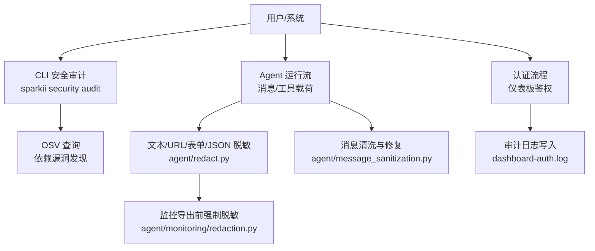
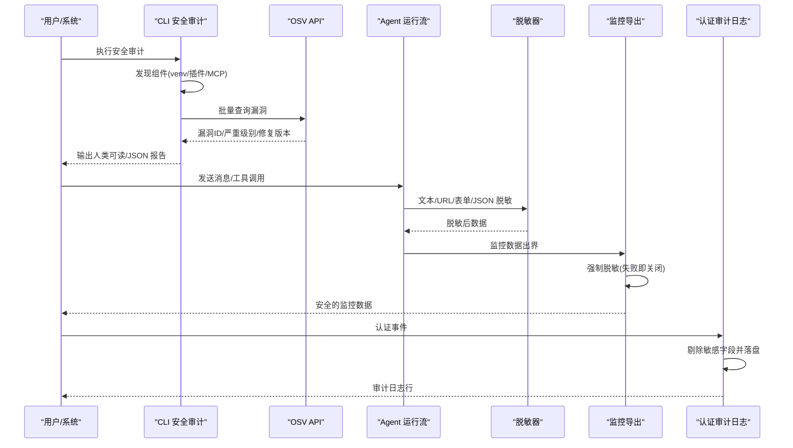
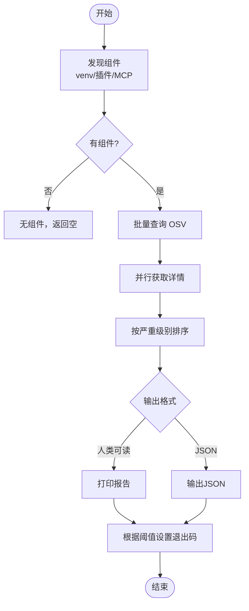
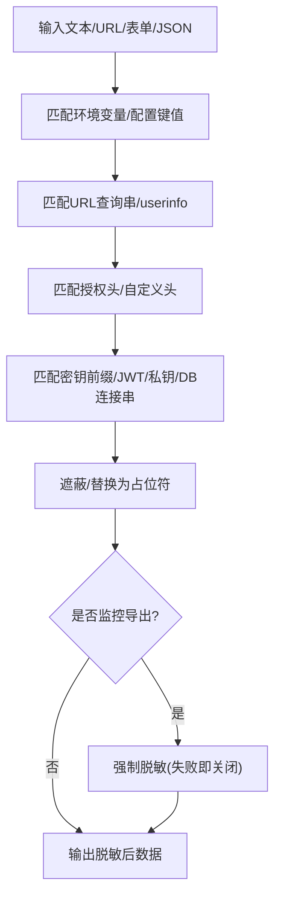
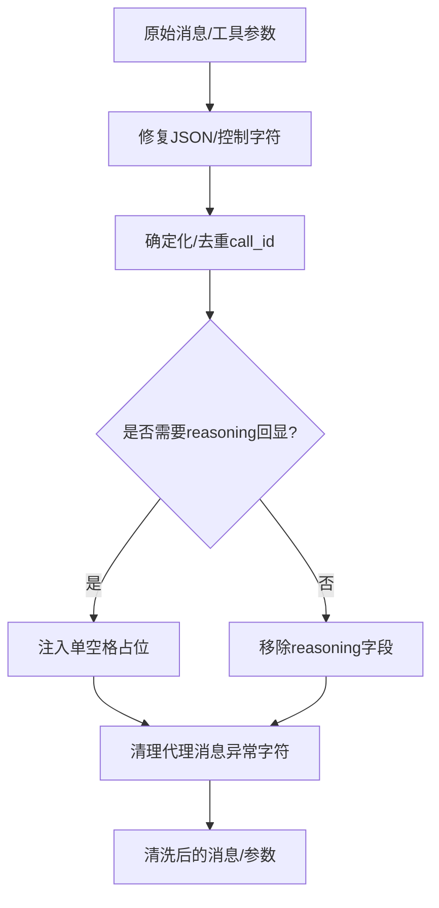
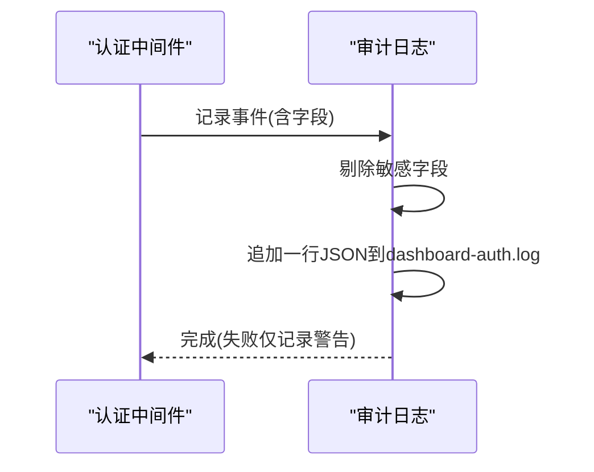
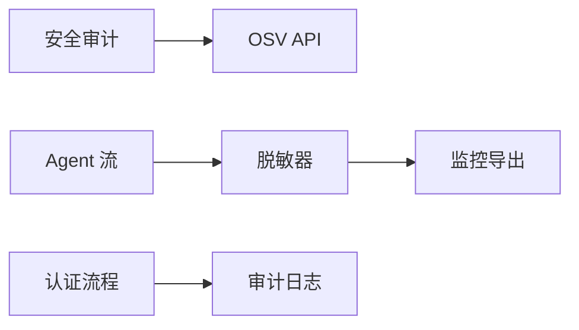

# 合规性支持

<cite>
**本文引用的文件**
- [security_audit.py](file://sparkii_cli/security_audit.py)
- [redact.py](file://agent/redact.py)
- [monitoring_redaction.py](file://agent/monitoring/redaction.py)
- [message_sanitization.py](file://agent/message_sanitization.py)
- [dashboard_auth_audit.py](file://sparkii_cli/dashboard_auth/audit.py)
</cite>

## 目录
1. [简介](#简介)
2. [项目结构](#项目结构)
3. [核心组件](#核心组件)
4. [架构总览](#架构总览)
5. [详细组件分析](#详细组件分析)
6. [依赖关系分析](#依赖关系分析)
7. [性能考虑](#性能考虑)
8. [故障排查指南](#故障排查指南)
9. [结论](#结论)
10. [附录](#附录)

## 简介
本指南面向需要落地数据隐私、操作审计、合规检查与数据治理的团队，基于仓库中已实现的代码能力，提供可操作的配置与使用建议。内容覆盖：
- 数据隐私保护：个人数据脱敏、敏感信息遮蔽、监控出口强制脱敏
- 操作审计：登录/令牌事件审计日志、供应链安全审计
- 合规检查：依赖漏洞扫描（OSV）、安全基线（密钥/令牌模式）
- 数据治理：消息与工具载荷清洗、结构化数据修复
- 报告模板：审计报告、安全评估报告、合规性证明文档的生成方式与字段说明
- 数据主体权利：访问、更正、删除、可携带性的实现路径与建议流程
- 最佳实践与监管要求指引

## 项目结构
合规相关能力分布在以下模块：
- 供应链安全审计：CLI 命令与安全审计脚本
- 敏感信息与隐私保护：日志与输出脱敏、监控导出前强制脱敏
- 消息与工具载荷清洗：代理消息与工具调用参数的健壮性处理
- 认证审计日志：仪表板认证事件记录与敏感字段过滤

图表来源
- [security_audit.py:433-481](file://sparkii_cli/security_audit.py#L433-L481)
- [redact.py:772-800](file://agent/redact.py#L772-L800)
- [message_sanitization.py:195-293](file://agent/message_sanitization.py#L195-L293)
- [dashboard_auth_audit.py:71-96](file://sparkii_cli/dashboard_auth/audit.py#L71-L96)
- [monitoring_redaction.py:43-66](file://agent/monitoring/redaction.py#L43-L66)

章节来源
- [security_audit.py:1-590](file://sparkii_cli/security_audit.py#L1-L590)
- [redact.py:1-800](file://agent/redact.py#L1-L800)
- [message_sanitization.py:1-800](file://agent/message_sanitization.py#L1-L800)
- [dashboard_auth_audit.py:1-96](file://sparkii_cli/dashboard_auth/audit.py#L1-L96)
- [monitoring_redaction.py:1-72](file://agent/monitoring/redaction.py#L1-L72)

## 核心组件
- 供应链安全审计器：扫描 venv、插件声明依赖、MCP 服务器命令参数中的版本化依赖，批量查询 OSV 并汇总严重级别与修复版本。
- 敏感信息脱敏器：对日志、工具输出、URL、表单、JSON、授权头、数据库连接串、JWT、私钥等进行多策略遮蔽；支持“不可复用”标记以避免回写破坏凭证。
- 监控导出强制脱敏：在监控数据出界前无条件执行“强脱敏”，失败时关闭通道避免泄露。
- 消息与工具载荷清洗：修复非法字符、补全 JSON、去重/确定化 call_id、按提供者策略处理 reasoning_content。
- 认证审计日志：记录登录、刷新、撤销、会话校验、票据等事件，自动剔除敏感字段，落盘为 JSON Lines。

章节来源
- [security_audit.py:57-80](file://sparkii_cli/security_audit.py#L57-L80)
- [security_audit.py:433-481](file://sparkii_cli/security_audit.py#L433-L481)
- [redact.py:772-800](file://agent/redact.py#L772-L800)
- [monitoring_redaction.py:43-66](file://agent/monitoring/redaction.py#L43-L66)
- [message_sanitization.py:195-293](file://agent/message_sanitization.py#L195-L293)
- [dashboard_auth_audit.py:34-57](file://sparkii_cli/dashboard_auth/audit.py#L34-L57)

## 架构总览
下图展示从输入到输出的关键合规路径：用户或系统触发 CLI 审计、Agent 消息流转、认证流程，分别经过依赖扫描、脱敏、清洗与审计落盘。

图表来源
- [security_audit.py:433-481](file://sparkii_cli/security_audit.py#L433-L481)
- [redact.py:772-800](file://agent/redact.py#L772-L800)
- [monitoring_redaction.py:43-66](file://agent/monitoring/redaction.py#L43-L66)
- [dashboard_auth_audit.py:71-96](file://sparkii_cli/dashboard_auth/audit.py#L71-L96)

## 详细组件分析

### 供应链安全审计（依赖漏洞扫描）
- 组件发现
  - venv：通过导入元数据枚举已安装包
  - 插件：解析 requirements.txt/pyproject.toml 中的精确版本
  - MCP：解析 config.yaml 中 npx/uvx 形式的命令参数提取版本
- 漏洞查询
  - 批量查询 OSV（每批上限固定），再并行拉取详情（摘要、严重级别、修复版本）
- 结果渲染
  - 人类可读与 JSON 两种格式，支持按严重级别阈值退出码控制（fail-on）

图表来源
- [security_audit.py:84-280](file://sparkii_cli/security_audit.py#L84-L280)
- [security_audit.py:300-408](file://sparkii_cli/security_audit.py#L300-L408)
- [security_audit.py:433-481](file://sparkii_cli/security_audit.py#L433-L481)
- [security_audit.py:487-533](file://sparkii_cli/security_audit.py#L487-L533)
- [security_audit.py:539-590](file://sparkii_cli/security_audit.py#L539-L590)

章节来源
- [security_audit.py:84-280](file://sparkii_cli/security_audit.py#L84-L280)
- [security_audit.py:300-408](file://sparkii_cli/security_audit.py#L300-L408)
- [security_audit.py:433-481](file://sparkii_cli/security_audit.py#L433-L481)
- [security_audit.py:487-533](file://sparkii_cli/security_audit.py#L487-L533)
- [security_audit.py:539-590](file://sparkii_cli/security_audit.py#L539-L590)

### 敏感信息与隐私保护（脱敏与匿名化）
- 覆盖范围
  - 环境变量赋值、配置文件键值、YAML/JSON 字段、HTTP 请求目标查询串、表单 body、URL userinfo、数据库连接串、JWT、私钥块、授权头、供应商密钥前缀
- 策略要点
  - 短令牌完全遮蔽，长令牌保留首尾用于调试
  - 严格 URL 凭据模式：仅对显式边界进行遮蔽，避免误伤 OAuth 回调等可导航链接
  - “不可复用”标记：防止回写配置时破坏原始凭证长度
- 监控导出强制脱敏
  - 无条件执行，失败则不输出原始字符串，确保零泄露

图表来源
- [redact.py:25-66](file://agent/redact.py#L25-L66)
- [redact.py:78-138](file://agent/redact.py#L78-L138)
- [redact.py:140-227](file://agent/redact.py#L140-L227)
- [redact.py:316-350](file://agent/redact.py#L316-L350)
- [redact.py:358-403](file://agent/redact.py#L358-L403)
- [redact.py:405-465](file://agent/redact.py#L405-L465)
- [redact.py:488-537](file://agent/redact.py#L488-L537)
- [redact.py:549-608](file://agent/redact.py#L549-L608)
- [redact.py:610-693](file://agent/redact.py#L610-L693)
- [redact.py:729-769](file://agent/redact.py#L729-L769)
- [redact.py:772-800](file://agent/redact.py#L772-L800)
- [monitoring_redaction.py:23-40](file://agent/monitoring/redaction.py#L23-L40)
- [monitoring_redaction.py:43-66](file://agent/monitoring/redaction.py#L43-L66)

章节来源
- [redact.py:25-66](file://agent/redact.py#L25-L66)
- [redact.py:78-138](file://agent/redact.py#L78-L138)
- [redact.py:140-227](file://agent/redact.py#L140-L227)
- [redact.py:316-350](file://agent/redact.py#L316-L350)
- [redact.py:358-403](file://agent/redact.py#L358-L403)
- [redact.py:405-465](file://agent/redact.py#L405-L465)
- [redact.py:488-537](file://agent/redact.py#L488-L537)
- [redact.py:549-608](file://agent/redact.py#L549-L608)
- [redact.py:610-693](file://agent/redact.py#L610-L693)
- [redact.py:729-769](file://agent/redact.py#L729-L769)
- [redact.py:772-800](file://agent/redact.py#L772-L800)
- [monitoring_redaction.py:23-40](file://agent/monitoring/redaction.py#L23-L40)
- [monitoring_redaction.py:43-66](file://agent/monitoring/redaction.py#L43-L66)

### 消息与工具载荷清洗（数据质量与健壮性）
- 功能点
  - 修复无效 JSON（尾随逗号、未闭合括号、控制字符转义）
  - 去重/确定化工具调用 ID，避免缓存失效与下游拒绝
  - 按提供者策略处理 reasoning_content（需回显则填充，否则剥离）
  - 清理代理消息中的异常字符（代理对、非 ASCII 等）

图表来源
- [message_sanitization.py:195-293](file://agent/message_sanitization.py#L195-L293)
- [message_sanitization.py:525-625](file://agent/message_sanitization.py#L525-L625)
- [message_sanitization.py:653-796](file://agent/message_sanitization.py#L653-L796)
- [message_sanitization.py:32-141](file://agent/message_sanitization.py#L32-L141)
- [message_sanitization.py:337-393](file://agent/message_sanitization.py#L337-L393)

章节来源
- [message_sanitization.py:195-293](file://agent/message_sanitization.py#L195-L293)
- [message_sanitization.py:32-141](file://agent/message_sanitization.py#L32-L141)
- [message_sanitization.py:337-393](file://agent/message_sanitization.py#L337-L393)
- [message_sanitization.py:525-625](file://agent/message_sanitization.py#L525-L625)
- [message_sanitization.py:653-796](file://agent/message_sanitization.py#L653-L796)

### 认证审计日志（用户行为追踪）
- 事件类型
  - 登录开始/成功/失败、登出、刷新成功/失败、撤销、会话校验失败、WS 票据签发/拒绝、令牌认证成功/失败、原生应用授权流程事件
- 安全设计
  - 自动剔除敏感字段（access_token、refresh_token、code、state、cookie、Authorization 等）
  - 线程安全写入，失败降级为警告，不影响认证主流程
  - 日志位置：$SPARKII_HOME/logs/dashboard-auth.log

图表来源
- [dashboard_auth_audit.py:26-57](file://sparkii_cli/dashboard_auth/audit.py#L26-L57)
- [dashboard_auth_audit.py:59-68](file://sparkii_cli/dashboard_auth/audit.py#L59-L68)
- [dashboard_auth_audit.py:71-96](file://sparkii_cli/dashboard_auth/audit.py#L71-L96)

章节来源
- [dashboard_auth_audit.py:26-57](file://sparkii_cli/dashboard_auth/audit.py#L26-L57)
- [dashboard_auth_audit.py:59-68](file://sparkii_cli/dashboard_auth/audit.py#L59-L68)
- [dashboard_auth_audit.py:71-96](file://sparkii_cli/dashboard_auth/audit.py#L71-L96)

## 依赖关系分析
- 供应链审计依赖 OSV 网络接口，具备超时与并发限制，失败会抛出运行时错误并被上层捕获
- 脱敏模块被多处引用，作为统一的安全边界；监控导出层在其之上增加 PII 匿名化
- 消息清洗模块与传输适配器解耦，仅关注数据结构健壮性与策略适配
- 审计日志独立于主认证流程，保证可用性优先

图表来源
- [security_audit.py:300-408](file://sparkii_cli/security_audit.py#L300-L408)
- [redact.py:772-800](file://agent/redact.py#L772-L800)
- [monitoring_redaction.py:43-66](file://agent/monitoring/redaction.py#L43-L66)
- [dashboard_auth_audit.py:71-96](file://sparkii_cli/dashboard_auth/audit.py#L71-L96)

章节来源
- [security_audit.py:300-408](file://sparkii_cli/security_audit.py#L300-L408)
- [redact.py:772-800](file://agent/redact.py#L772-L800)
- [monitoring_redaction.py:43-66](file://agent/monitoring/redaction.py#L43-L66)
- [dashboard_auth_audit.py:71-96](file://sparkii_cli/dashboard_auth/audit.py#L71-L96)

## 性能考虑
- 供应链审计
  - 批量查询 OSV 以减小请求次数；详情拉取使用线程池并行
  - 仅解析精确版本依赖，减少误报与不必要查询
- 脱敏
  - 使用预编译正则与快速短路判断（如关键词预筛）降低回溯开销
  - 对超长文本采用边界控制与分段处理
- 消息清洗
  - 先尝试轻量修复（strict=False 解析），失败再进入复杂正则修复
  - 确定化 ID 避免随机数导致的缓存失效
- 审计日志
  - 线程锁串行写入，避免竞争；失败降级为警告，不阻塞主流程

[本节为通用指导，不直接分析具体文件]

## 故障排查指南
- 供应链审计失败
  - 现象：网络错误或超时导致审计中断
  - 处理：检查网络连通性与 OSV 服务状态；确认依赖声明包含精确版本
  - 参考路径
    - [security_audit.py:300-329](file://sparkii_cli/security_audit.py#L300-L329)
    - [security_audit.py:386-408](file://sparkii_cli/security_audit.py#L386-L408)
    - [security_audit.py:567-577](file://sparkii_cli/security_audit.py#L567-L577)
- 脱敏未生效
  - 现象：日志或工具输出仍包含敏感信息
  - 处理：确认未禁用全局开关；检查是否为“不可复用”标记场景；核对 URL 模式是否命中严格模式
  - 参考路径
    - [redact.py:67-76](file://agent/redact.py#L67-L76)
    - [redact.py:745-769](file://agent/redact.py#L745-L769)
    - [redact.py:671-693](file://agent/redact.py#L671-L693)
- 监控导出未脱敏
  - 现象：监控数据出现明文敏感信息
  - 处理：确认强制脱敏路径未被跳过；若脱敏器异常，应收到“不可用”占位而非明文
  - 参考路径
    - [monitoring_redaction.py:43-55](file://agent/monitoring/redaction.py#L43-L55)
- 审计日志缺失
  - 现象：dashboard-auth.log 无新条目
  - 处理：检查日志目录权限与磁盘空间；确认写入失败仅记录警告且不影响认证
  - 参考路径
    - [dashboard_auth_audit.py:59-68](file://sparkii_cli/dashboard_auth/audit.py#L59-L68)
    - [dashboard_auth_audit.py:71-96](file://sparkii_cli/dashboard_auth/audit.py#L71-L96)

章节来源
- [security_audit.py:300-329](file://sparkii_cli/security_audit.py#L300-L329)
- [security_audit.py:386-408](file://sparkii_cli/security_audit.py#L386-L408)
- [security_audit.py:567-577](file://sparkii_cli/security_audit.py#L567-L577)
- [redact.py:67-76](file://agent/redact.py#L67-L76)
- [redact.py:745-769](file://agent/redact.py#L745-L769)
- [redact.py:671-693](file://agent/redact.py#L671-L693)
- [monitoring_redaction.py:43-55](file://agent/monitoring/redaction.py#L43-L55)
- [dashboard_auth_audit.py:59-68](file://sparkii_cli/dashboard_auth/audit.py#L59-L68)
- [dashboard_auth_audit.py:71-96](file://sparkii_cli/dashboard_auth/audit.py#L71-L96)

## 结论
该仓库提供了端到端的合规能力基础：供应链依赖漏洞扫描、多层级敏感信息脱敏与监控强制脱敏、消息与工具载荷健壮性保障、以及认证事件审计日志。结合本报告提供的配置与使用建议，团队可快速构建符合隐私与审计要求的运行环境，并在此基础上扩展数据治理与报告体系。

[本节为总结性内容，不直接分析具体文件]

## 附录

### 配置与使用要点
- 供应链安全审计
  - 入口：CLI 安全审计命令
  - 输出：人类可读或 JSON；支持按严重级别阈值控制退出码
  - 参考路径
    - [security_audit.py:433-481](file://sparkii_cli/security_audit.py#L433-L481)
    - [security_audit.py:487-533](file://sparkii_cli/security_audit.py#L487-L533)
    - [security_audit.py:539-590](file://sparkii_cli/security_audit.py#L539-L590)
- 敏感信息脱敏
  - 全局开关：可通过配置或环境变量启用/禁用（默认开启）
  - 严格 URL 模式：在明确边界处启用，避免误伤可导航链接
  - 参考路径
    - [redact.py:67-76](file://agent/redact.py#L67-L76)
    - [redact.py:671-693](file://agent/redact.py#L671-L693)
- 监控导出强制脱敏
  - 无条件执行，失败即关闭通道
  - 参考路径
    - [monitoring_redaction.py:43-66](file://agent/monitoring/redaction.py#L43-L66)
- 认证审计日志
  - 位置：$SPARKII_HOME/logs/dashboard-auth.log
  - 字段：时间戳、事件类型、业务字段（敏感字段自动剔除）
  - 参考路径
    - [dashboard_auth_audit.py:26-57](file://sparkii_cli/dashboard_auth/audit.py#L26-L57)
    - [dashboard_auth_audit.py:59-68](file://sparkii_cli/dashboard_auth/audit.py#L59-L68)
    - [dashboard_auth_audit.py:71-96](file://sparkii_cli/dashboard_auth/audit.py#L71-L96)

章节来源
- [security_audit.py:433-481](file://sparkii_cli/security_audit.py#L433-L481)
- [security_audit.py:487-533](file://sparkii_cli/security_audit.py#L487-L533)
- [security_audit.py:539-590](file://sparkii_cli/security_audit.py#L539-L590)
- [redact.py:67-76](file://agent/redact.py#L67-L76)
- [redact.py:671-693](file://agent/redact.py#L671-L693)
- [monitoring_redaction.py:43-66](file://agent/monitoring/redaction.py#L43-L66)
- [dashboard_auth_audit.py:26-57](file://sparkii_cli/dashboard_auth/audit.py#L26-L57)
- [dashboard_auth_audit.py:59-68](file://sparkii_cli/dashboard_auth/audit.py#L59-L68)
- [dashboard_auth_audit.py:71-96](file://sparkii_cli/dashboard_auth/audit.py#L71-L96)

### 报告模板与字段说明
- 审计报告（供应链）
  - 字段：扫描组件总数、发现数量、每条发现的包名/版本/生态/来源、漏洞ID/严重级别/摘要/修复版本
  - 参考路径
    - [security_audit.py:515-533](file://sparkii_cli/security_audit.py#L515-L533)
- 安全评估报告（脱敏与隐私）
  - 内容：脱敏策略覆盖范围、URL 严格模式启用情况、监控强制脱敏状态
  - 参考路径
    - [redact.py:67-76](file://agent/redact.py#L67-L76)
    - [redact.py:671-693](file://agent/redact.py#L671-L693)
    - [monitoring_redaction.py:43-66](file://agent/monitoring/redaction.py#L43-L66)
- 合规性证明文档（审计日志）
  - 内容：认证事件序列、时间戳、事件类型、业务上下文（不含敏感字段）
  - 参考路径
    - [dashboard_auth_audit.py:26-57](file://sparkii_cli/dashboard_auth/audit.py#L26-L57)
    - [dashboard_auth_audit.py:71-96](file://sparkii_cli/dashboard_auth/audit.py#L71-L96)

章节来源
- [security_audit.py:515-533](file://sparkii_cli/security_audit.py#L515-L533)
- [redact.py:67-76](file://agent/redact.py#L67-L76)
- [redact.py:671-693](file://agent/redact.py#L671-L693)
- [monitoring_redaction.py:43-66](file://agent/monitoring/redaction.py#L43-L66)
- [dashboard_auth_audit.py:26-57](file://sparkii_cli/dashboard_auth/audit.py#L26-L57)
- [dashboard_auth_audit.py:71-96](file://sparkii_cli/dashboard_auth/audit.py#L71-L96)

### 数据主体权利支持（访问、更正、删除、可携带性）
- 访问
  - 利用审计日志与会话导出能力，聚合用户活动轨迹与交互记录
  - 参考路径
    - [dashboard_auth_audit.py:71-96](file://sparkii_cli/dashboard_auth/audit.py#L71-L96)
- 更正
  - 通过消息与工具载荷清洗保障数据一致性；对异常数据进行修复与去重
  - 参考路径
    - [message_sanitization.py:195-293](file://agent/message_sanitization.py#L195-L293)
    - [message_sanitization.py:525-625](file://agent/message_sanitization.py#L525-L625)
- 删除
  - 结合审计日志与存储策略，定位并清除用户相关数据；注意脱敏与不可复用标记的影响
  - 参考路径
    - [dashboard_auth_audit.py:71-96](file://sparkii_cli/dashboard_auth/audit.py#L71-L96)
    - [redact.py:745-769](file://agent/redact.py#L745-L769)
- 可携带性
  - 将审计日志与会话导出转换为标准格式（JSON Lines/CSV），便于迁移与归档
  - 参考路径
    - [dashboard_auth_audit.py:71-96](file://sparkii_cli/dashboard_auth/audit.py#L71-L96)

章节来源
- [dashboard_auth_audit.py:71-96](file://sparkii_cli/dashboard_auth/audit.py#L71-L96)
- [message_sanitization.py:195-293](file://agent/message_sanitization.py#L195-L293)
- [message_sanitization.py:525-625](file://agent/message_sanitization.py#L525-L625)
- [redact.py:745-769](file://agent/redact.py#L745-L769)

### 数据治理（分类、血缘、质量）
- 数据分类
  - 依据脱敏规则对数据进行敏感度分级（密钥、令牌、个人信息等）
  - 参考路径
    - [redact.py:25-66](file://agent/redact.py#L25-L66)
    - [redact.py:78-138](file://agent/redact.py#L78-L138)
- 数据血缘
  - 通过审计日志与工具调用 ID 关联上下游事件，形成可追溯链路
  - 参考路径
    - [dashboard_auth_audit.py:34-57](file://sparkii_cli/dashboard_auth/audit.py#L34-L57)
    - [message_sanitization.py:525-625](file://agent/message_sanitization.py#L525-L625)
- 数据质量
  - 修复 JSON、控制字符、代理消息异常，确保下游稳定性
  - 参考路径
    - [message_sanitization.py:195-293](file://agent/message_sanitization.py#L195-L293)
    - [message_sanitization.py:32-141](file://agent/message_sanitization.py#L32-L141)
    - [message_sanitization.py:337-393](file://agent/message_sanitization.py#L337-L393)

章节来源
- [redact.py:25-66](file://agent/redact.py#L25-L66)
- [redact.py:78-138](file://agent/redact.py#L78-L138)
- [dashboard_auth_audit.py:34-57](file://sparkii_cli/dashboard_auth/audit.py#L34-L57)
- [message_sanitization.py:195-293](file://agent/message_sanitization.py#L195-L293)
- [message_sanitization.py:32-141](file://agent/message_sanitization.py#L32-L141)
- [message_sanitization.py:337-393](file://agent/message_sanitization.py#L337-L393)
- [message_sanitization.py:525-625](file://agent/message_sanitization.py#L525-L625)

### 合规最佳实践与监管要求指引
- 最小化暴露面
  - 仅在必要边界启用严格 URL 凭据脱敏；默认放行可导航链接
  - 参考路径
    - [redact.py:671-693](file://agent/redact.py#L671-L693)
- 防御纵深
  - 监控导出强制脱敏，失败即关闭通道
  - 参考路径
    - [monitoring_redaction.py:43-66](file://agent/monitoring/redaction.py#L43-L66)
- 可审计性
  - 记录认证事件与供应链审计结果，保留时间戳与事件类型
  - 参考路径
    - [dashboard_auth_audit.py:34-57](file://sparkii_cli/dashboard_auth/audit.py#L34-L57)
    - [security_audit.py:515-533](file://sparkii_cli/security_audit.py#L515-L533)
- 数据质量与稳定性
  - 修复工具调用参数与消息结构，确保跨提供商兼容
  - 参考路径
    - [message_sanitization.py:195-293](file://agent/message_sanitization.py#L195-L293)
    - [message_sanitization.py:653-796](file://agent/message_sanitization.py#L653-L796)

[本节为通用指导，不直接分析具体文件]