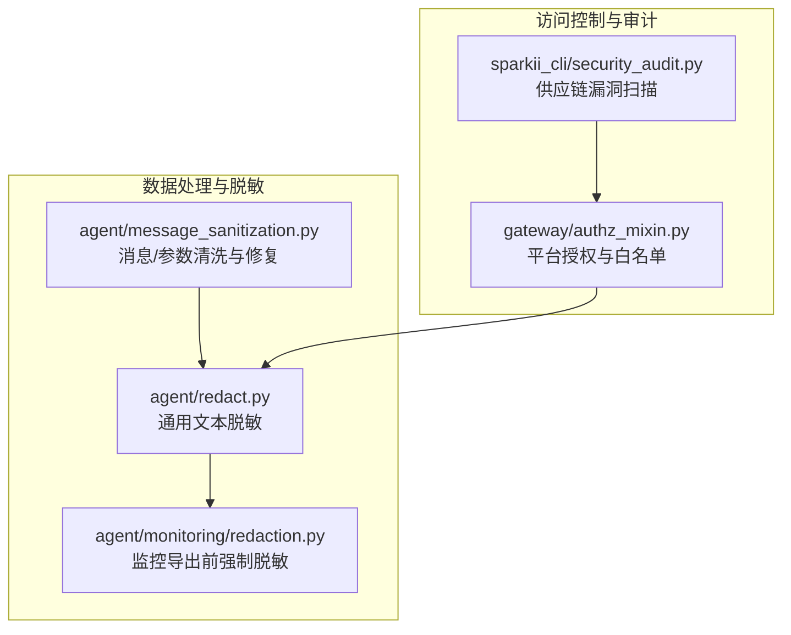
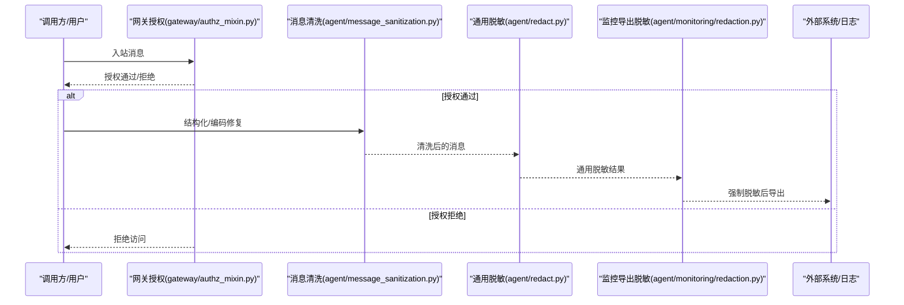
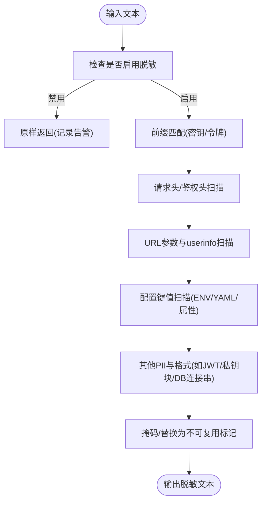
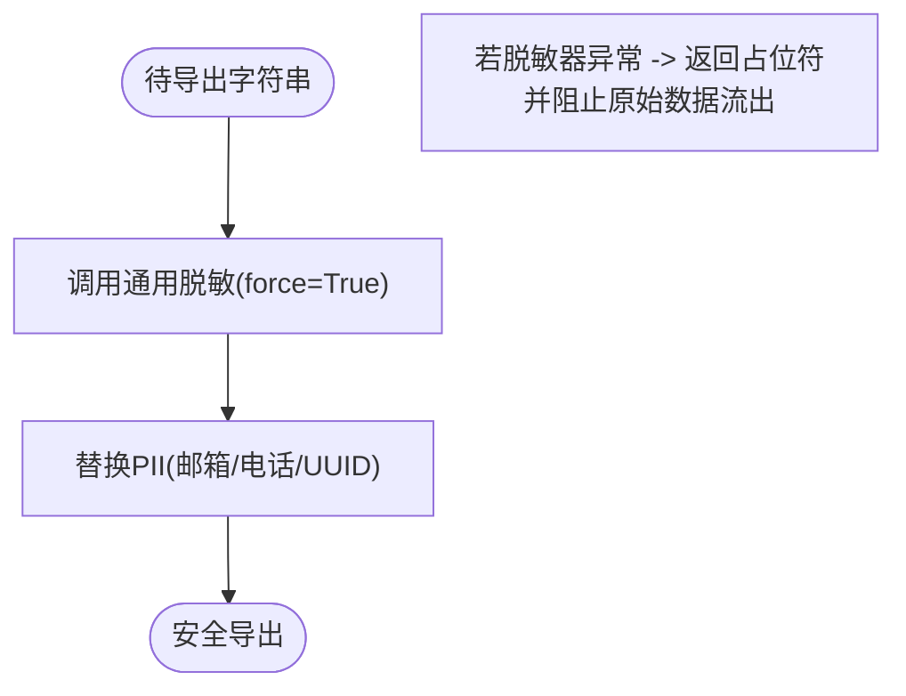
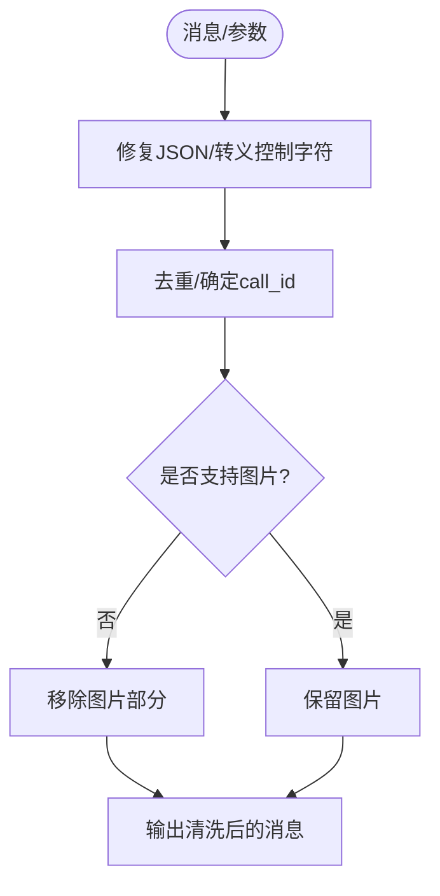
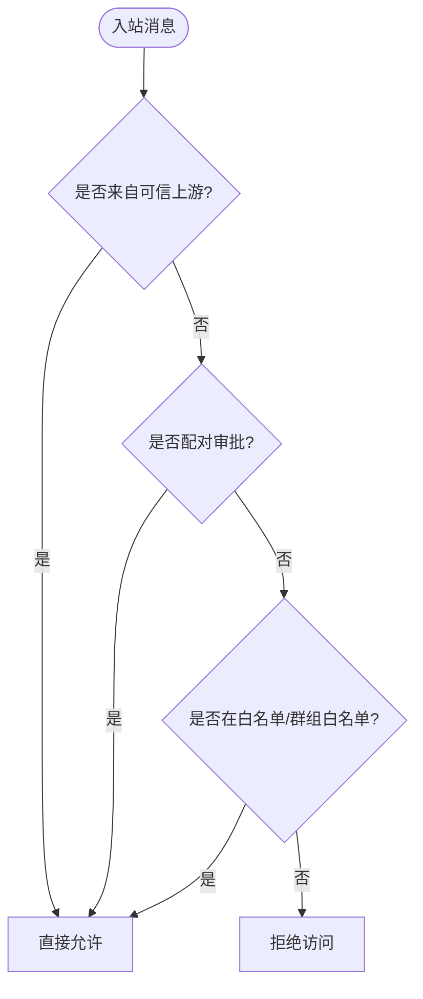
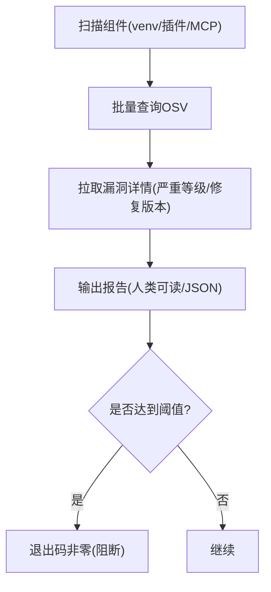

# 数据隐私

<cite>
**本文引用的文件**
- [agent/redact.py](file://agent/redact.py)
- [agent/monitoring/redaction.py](file://agent/monitoring/redaction.py)
- [agent/message_sanitization.py](file://agent/message_sanitization.py)
- [gateway/authz_mixin.py](file://gateway/authz_mixin.py)
- [sparkii_cli/security_audit.py](file://sparkii_cli/security_audit.py)
</cite>

## 目录
1. [简介](#简介)
2. [项目结构](#项目结构)
3. [核心组件](#核心组件)
4. [架构总览](#架构总览)
5. [详细组件分析](#详细组件分析)
6. [依赖关系分析](#依赖关系分析)
7. [性能考量](#性能考量)
8. [故障排查指南](#故障排查指南)
9. [结论](#结论)
10. [附录](#附录)

## 简介
本文件面向数据隐私保护，聚焦以下方面：静态与传输数据加密、密钥管理策略；数据匿名化（脱敏、泛化、差分隐私）；数据保留（自动清理、归档、长期存储）；访问控制（角色访问、字段级权限、审计）；数据主体权利（访问、更正、删除、可携带性）；隐私影响评估工具；以及GDPR/CCPA合规配置示例。内容基于仓库中现有实现进行梳理与说明，并给出可视化流程图与时序图以辅助理解。

## 项目结构
与隐私相关的关键代码集中在以下模块：
- 日志与出口数据的敏感信息脱敏：agent/redact.py、agent/monitoring/redaction.py
- 消息与工具载荷的清洗与修复：agent/message_sanitization.py
- 网关侧用户授权与接入策略：gateway/authz_mixin.py
- 供应链安全审计（间接支撑隐私风险识别）：sparkii_cli/security_audit.py

图表来源
- [agent/redact.py:1-120](file://agent/redact.py#L1-L120)
- [agent/monitoring/redaction.py:1-72](file://agent/monitoring/redaction.py#L1-L72)
- [agent/message_sanitization.py:1-120](file://agent/message_sanitization.py#L1-L120)
- [gateway/authz_mixin.py:1-120](file://gateway/authz_mixin.py#L1-L120)
- [sparkii_cli/security_audit.py:1-120](file://sparkii_cli/security_audit.py#L1-L120)

章节来源
- [agent/redact.py:1-120](file://agent/redact.py#L1-L120)
- [agent/monitoring/redaction.py:1-72](file://agent/monitoring/redaction.py#L1-L72)
- [agent/message_sanitization.py:1-120](file://agent/message_sanitization.py#L1-L120)
- [gateway/authz_mixin.py:1-120](file://gateway/authz_mixin.py#L1-L120)
- [sparkii_cli/security_audit.py:1-120](file://sparkii_cli/security_audit.py#L1-L120)

## 核心组件
- 通用文本脱敏器：对日志、工具输出、URL、请求头、连接串、JWT、私钥块等进行模式匹配与掩码，支持“不可复用”标记以避免回写破坏凭证。
- 监控导出强制脱敏：在监控数据出界前无条件执行强脱敏，失败时关闭通道，避免原始数据泄露。
- 消息与工具参数清洗：修复非法字符、代理不兼容的结构、去除图片等，保障下游API稳定且减少不必要的数据暴露面。
- 网关授权：按平台与环境变量维护允许列表、群组/频道白名单、配对审批、上游可信授权等，默认拒绝未授权访问。
- 供应链安全审计：扫描运行环境、插件与MCP服务器依赖，查询OSV数据库，输出漏洞发现与建议修复版本。

章节来源
- [agent/redact.py:1-120](file://agent/redact.py#L1-L120)
- [agent/monitoring/redaction.py:1-72](file://agent/monitoring/redaction.py#L1-L72)
- [agent/message_sanitization.py:1-120](file://agent/message_sanitization.py#L1-L120)
- [gateway/authz_mixin.py:1-120](file://gateway/authz_mixin.py#L1-L120)
- [sparkii_cli/security_audit.py:1-120](file://sparkii_cli/security_audit.py#L1-L120)

## 架构总览
下图展示数据从输入到输出的隐私保护路径：消息进入后先进行结构与编码修复，再经通用脱敏器处理，最终在监控或外部导出前再次强制脱敏；同时，所有入站消息需通过网关授权检查。

图表来源
- [gateway/authz_mixin.py:386-784](file://gateway/authz_mixin.py#L386-L784)
- [agent/message_sanitization.py:195-294](file://agent/message_sanitization.py#L195-L294)
- [agent/redact.py:772-800](file://agent/redact.py#L772-L800)
- [agent/monitoring/redaction.py:58-66](file://agent/monitoring/redaction.py#L58-L66)

## 详细组件分析

### 组件A：通用文本脱敏器（agent/redact.py）
- 功能要点
  - 识别并掩码多种敏感形式：API密钥前缀、Authorization头、数据库连接串、JWT、私钥块、URL中的敏感查询参数与userinfo等。
  - 提供“不可复用”标记替换，防止被写入配置文件后仍可用但已损坏的凭证。
  - 支持环境变量开关与安全默认值，确保运行时无法轻易禁用。
- 关键流程
  - 文本进入后按多阶段正则匹配与上下文判断进行掩码。
  - URL与表单体分别处理，避免误伤正常内容。
  - 对控制字符分割的令牌进行特殊处理，保证跨行/零宽字符场景下仍可正确掩码。

图表来源
- [agent/redact.py:25-138](file://agent/redact.py#L25-L138)
- [agent/redact.py:316-425](file://agent/redact.py#L316-L425)
- [agent/redact.py:488-537](file://agent/redact.py#L488-L537)
- [agent/redact.py:772-800](file://agent/redact.py#L772-L800)

章节来源
- [agent/redact.py:1-120](file://agent/redact.py#L1-L120)
- [agent/redact.py:316-425](file://agent/redact.py#L316-L425)
- [agent/redact.py:488-537](file://agent/redact.py#L488-L537)
- [agent/redact.py:772-800](file://agent/redact.py#L772-L800)

### 组件B：监控导出强制脱敏（agent/monitoring/redaction.py）
- 设计原则
  - 无条件执行，失败则关闭导出，绝不放行原始数据。
  - 在通用脱敏基础上叠加Bearer/Token形状与PII（邮箱、电话、UUID）替换。
- 适用场景
  - 监控指标、遥测、诊断信息等任何离开进程的数据出口。

图表来源
- [agent/monitoring/redaction.py:43-66](file://agent/monitoring/redaction.py#L43-L66)

章节来源
- [agent/monitoring/redaction.py:1-72](file://agent/monitoring/redaction.py#L1-L72)

### 组件C：消息与工具参数清洗（agent/message_sanitization.py）
- 能力概述
  - 修复JSON中的非法控制字符、补全缺失括号、处理截断或不规范的工具调用参数。
  - 移除不支持的图片内容，保持消息交替不变。
  - 生成确定性call_id，避免缓存失效与重复ID导致的丢失。
- 隐私意义
  - 降低因畸形数据导致的崩溃与错误日志泄露风险。
  - 通过规范化与最小化，减少不必要的敏感信息传播。

图表来源
- [agent/message_sanitization.py:144-294](file://agent/message_sanitization.py#L144-L294)
- [agent/message_sanitization.py:401-446](file://agent/message_sanitization.py#L401-L446)
- [agent/message_sanitization.py:525-625](file://agent/message_sanitization.py#L525-L625)

章节来源
- [agent/message_sanitization.py:144-294](file://agent/message_sanitization.py#L144-L294)
- [agent/message_sanitization.py:401-446](file://agent/message_sanitization.py#L401-L446)
- [agent/message_sanitization.py:525-625](file://agent/message_sanitization.py#L525-L625)

### 组件D：网关授权与访问控制（gateway/authz_mixin.py）
- 能力概述
  - 支持平台级允许/禁止标志、环境变量白名单、群组/频道白名单、配对审批、上游可信授权等。
  - 默认拒绝未授权访问，仅在明确允许时放行。
- 隐私意义
  - 限制数据接触面，仅允许受信任的用户/会话访问。
  - 结合平台特性（如Telegram群组、WhatsApp标识归一化）增强细粒度控制。

图表来源
- [gateway/authz_mixin.py:386-784](file://gateway/authz_mixin.py#L386-L784)

章节来源
- [gateway/authz_mixin.py:386-784](file://gateway/authz_mixin.py#L386-L784)

### 组件E：供应链安全审计（sparkii_cli/security_audit.py）
- 能力概述
  - 扫描venv、插件依赖与MCP服务器命令，提取精确版本。
  - 批量查询OSV数据库，获取漏洞详情、严重等级与修复版本。
- 隐私意义
  - 通过识别已知漏洞，降低潜在的数据泄露风险（例如依赖库存在远程代码执行或信息泄露）。

图表来源
- [sparkii_cli/security_audit.py:84-280](file://sparkii_cli/security_audit.py#L84-L280)
- [sparkii_cli/security_audit.py:300-408](file://sparkii_cli/security_audit.py#L300-L408)
- [sparkii_cli/security_audit.py:433-590](file://sparkii_cli/security_audit.py#L433-L590)

章节来源
- [sparkii_cli/security_audit.py:84-280](file://sparkii_cli/security_audit.py#L84-L280)
- [sparkii_cli/security_audit.py:300-408](file://sparkii_cli/security_audit.py#L300-L408)
- [sparkii_cli/security_audit.py:433-590](file://sparkii_cli/security_audit.py#L433-L590)

## 依赖关系分析
- agent/redact.py 被 agent/monitoring/redaction.py 在强制模式下调用，形成“通用脱敏 + 强制出口”的纵深防御。
- agent/message_sanitization.py 在消息进入后先行修复，减少后续脱敏与下游处理的负担与风险。
- gateway/authz_mixin.py 作为入口闸门，决定哪些数据可以进入处理管道。
- sparkii_cli/security_audit.py 独立于运行时，用于周期性或按需的安全审计，间接提升整体隐私与安全风险可控性。

图表来源
- [agent/message_sanitization.py:195-294](file://agent/message_sanitization.py#L195-L294)
- [agent/redact.py:772-800](file://agent/redact.py#L772-L800)
- [agent/monitoring/redaction.py:58-66](file://agent/monitoring/redaction.py#L58-L66)
- [gateway/authz_mixin.py:386-784](file://gateway/authz_mixin.py#L386-L784)
- [sparkii_cli/security_audit.py:433-590](file://sparkii_cli/security_audit.py#L433-L590)

章节来源
- [agent/message_sanitization.py:195-294](file://agent/message_sanitization.py#L195-L294)
- [agent/redact.py:772-800](file://agent/redact.py#L772-L800)
- [agent/monitoring/redaction.py:58-66](file://agent/monitoring/redaction.py#L58-L66)
- [gateway/authz_mixin.py:386-784](file://gateway/authz_mixin.py#L386-L784)
- [sparkii_cli/security_audit.py:433-590](file://sparkii_cli/security_audit.py#L433-L590)

## 性能考量
- 正则匹配与多次扫描可能带来开销，但通过快速路径（如空输入、无敏感词预检）与上下文限定（如仅对配置键名空间匹配）降低误判与回溯成本。
- 监控导出强制脱敏采用“失败即关闭”的策略，避免长尾异常导致的数据泄露风险，代价是偶发情况下导出不可用。
- 消息修复与去重逻辑尽量就地操作，减少额外内存分配；对超大负载进行边界控制与日志截断，防止日志风暴。

[本节为通用指导，无需特定文件引用]

## 故障排查指南
- 监控导出不可用
  - 现象：导出结果为占位符或为空。
  - 原因：强制脱敏器异常时主动关闭导出。
  - 处理：检查依赖与日志，确认脱敏器可正常运行。
- 日志仍含敏感信息
  - 现象：日志中出现密钥、令牌或连接串。
  - 原因：可能绕过通用脱敏路径或未命中规则。
  - 处理：定位具体输出点，增加专用脱敏调用或使用强制模式。
- 授权被拒绝
  - 现象：入站消息被拒绝。
  - 原因：未满足白名单、配对或上游授权条件。
  - 处理：检查平台环境变量、群组白名单与配对审批状态。
- 供应链漏洞告警
  - 现象：审计输出包含漏洞条目。
  - 原因：依赖版本存在已知漏洞。
  - 处理：升级至修复版本，必要时隔离或替换组件。

章节来源
- [agent/monitoring/redaction.py:43-66](file://agent/monitoring/redaction.py#L43-L66)
- [agent/redact.py:772-800](file://agent/redact.py#L772-L800)
- [gateway/authz_mixin.py:386-784](file://gateway/authz_mixin.py#L386-L784)
- [sparkii_cli/security_audit.py:539-590](file://sparkii_cli/security_audit.py#L539-L590)

## 结论
本仓库在数据隐私方面提供了较为完善的实践：
- 传输与出口层面：通过通用脱敏与强制导出脱敏，有效降低敏感信息外泄风险。
- 输入与处理层面：消息清洗与修复提升了稳定性，减少错误日志与二次泄露。
- 访问控制：网关授权提供细粒度的准入控制，默认拒绝未授权访问。
- 风险识别：供应链审计帮助提前发现潜在漏洞，降低数据泄露概率。
建议在生产环境中结合静态加密、传输加密与密钥管理策略，完善数据保留与主体权利流程，以满足GDPR/CCPA等法规要求。

[本节为总结，无需特定文件引用]

## 附录

### 数据加密机制（静态与传输）
- 静态数据加密
  - 建议：对持久化存储（会话、日志、配置、密钥材料）使用磁盘加密或数据库透明加密。
  - 参考：仓库未直接实现静态加密逻辑，建议在部署层（操作系统/容器/数据库）启用。
- 传输数据加密
  - 建议：对外接口强制TLS，内部服务间通信使用mTLS或受管通道。
  - 参考：仓库未直接实现TLS配置，建议在网关/反向代理层统一配置。
- 密钥管理策略
  - 建议：使用集中式密钥管理服务（KMS/HSM），最小权限访问，定期轮换。
  - 参考：仓库通过环境变量与配置桥接注入密钥，建议迁移至更安全的密钥源。

[本节为通用指导，无需特定文件引用]

### 数据匿名化技术
- 数据脱敏
  - 实现：agent/redact.py 提供多模式脱敏，覆盖密钥、令牌、URL、头部、连接串等。
  - 建议：对所有日志、调试输出、外部导出统一走脱敏管线。
- 数据泛化
  - 实现：监控导出将PII替换为占位符（邮箱、电话、UUID）。
  - 建议：根据业务需求扩展泛化规则（如地址、IP段泛化）。
- 差分隐私
  - 实现：仓库未内置差分隐私算法。
  - 建议：在统计聚合与报表层引入噪声注入，平衡准确性与隐私。

章节来源
- [agent/redact.py:25-138](file://agent/redact.py#L25-L138)
- [agent/monitoring/redaction.py:31-66](file://agent/monitoring/redaction.py#L31-L66)

### 数据保留策略
- 自动清理
  - 建议：对临时文件、会话缓存、日志轮转设置TTL与清理任务。
  - 参考：仓库未直接实现清理策略，建议在运维脚本或调度任务中配置。
- 归档机制
  - 建议：对历史会话与审计日志进行冷存储归档，限制访问与解密权限。
  - 参考：仓库未直接实现归档，建议在存储层与访问控制层配合。
- 长期存储方案
  - 建议：采用分层存储（热/温/冷），结合加密与访问审计。
  - 参考：仓库未直接实现，需在基础设施层规划。

[本节为通用指导，无需特定文件引用]

### 数据访问控制
- 基于角色的数据访问
  - 实现：网关授权支持平台级白名单、群组/频道白名单、配对审批与上游可信授权。
  - 建议：结合身份提供商（IdP）与RBAC策略，细化到资源级别。
- 字段级权限控制
  - 实现：仓库未直接实现字段级权限。
  - 建议：在数据模型与API层引入字段级可见性控制。
- 数据使用审计
  - 实现：供应链审计输出可用于追踪依赖变更；建议在网关与数据层增加访问审计日志。
  - 建议：集中收集审计日志，关联用户、时间、资源与动作。

章节来源
- [gateway/authz_mixin.py:386-784](file://gateway/authz_mixin.py#L386-L784)
- [sparkii_cli/security_audit.py:433-590](file://sparkii_cli/security_audit.py#L433-L590)

### 数据主体权利支持
- 数据访问请求
  - 建议：提供API或控制台供用户导出其数据（会话、消息、元数据）。
  - 参考：仓库未直接实现，需在应用层扩展。
- 更正请求
  - 建议：提供编辑与修正接口，记录变更审计。
  - 参考：仓库未直接实现，需在数据模型与UI层扩展。
- 删除请求
  - 建议：支持软删除与硬删除策略，确保彻底清除敏感副本。
  - 参考：仓库未直接实现，需在存储与备份层配合。
- 数据可携带性
  - 建议：提供标准格式导出（JSON/CSV），便于迁移与第三方集成。
  - 参考：仓库未直接实现，需在导出模块中标准化。

[本节为通用指导，无需特定文件引用]

### 隐私影响评估工具
- 实现：供应链安全审计可作为隐私风险评估的一部分，识别高风险依赖。
- 建议：扩展评估维度（数据流、存储位置、访问范围、第三方共享），形成定期评估报告。
- 参考：仓库未直接实现完整PIA工具，可在CI/CD中集成审计步骤。

章节来源
- [sparkii_cli/security_audit.py:433-590](file://sparkii_cli/security_audit.py#L433-L590)

### GDPR/CCPA合规配置示例
- 数据最小化
  - 建议：仅采集必要字段，默认开启脱敏与泛化。
  - 参考：agent/redact.py 与 agent/monitoring/redaction.py 提供基础能力。
- 同意与撤回
  - 建议：在用户交互层记录同意状态，支持撤回并触发数据删除。
  - 参考：仓库未直接实现，需在应用层扩展。
- 数据主体权利
  - 建议：提供访问、更正、删除与可携带性接口。
  - 参考：仓库未直接实现，需在应用层扩展。
- 跨境传输
  - 建议：对跨境数据传输进行风险评估与合同约束。
  - 参考：仓库未直接实现，需在网络与合规层配置。
- 审计与问责
  - 建议：记录数据处理活动，定期审查与更新策略。
  - 参考：结合网关授权与供应链审计输出，形成审计证据链。

[本节为通用指导，无需特定文件引用]