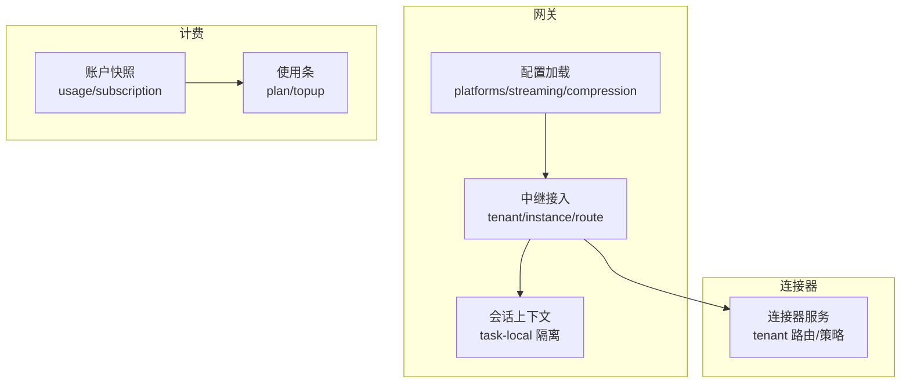
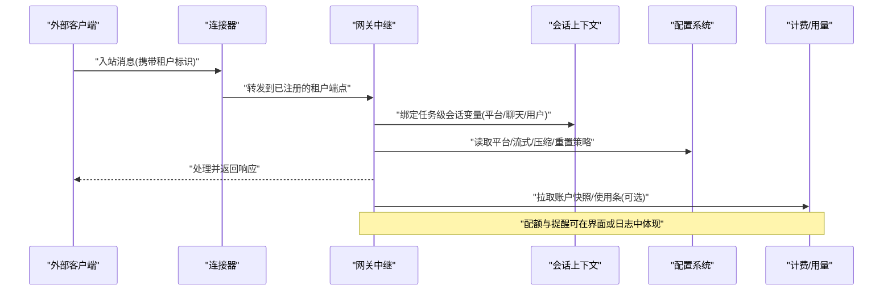
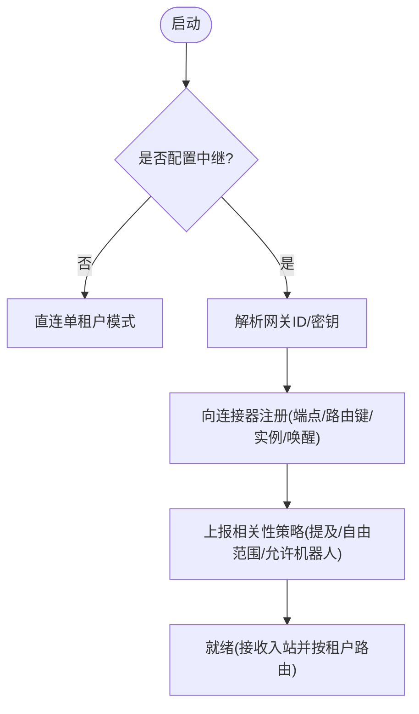
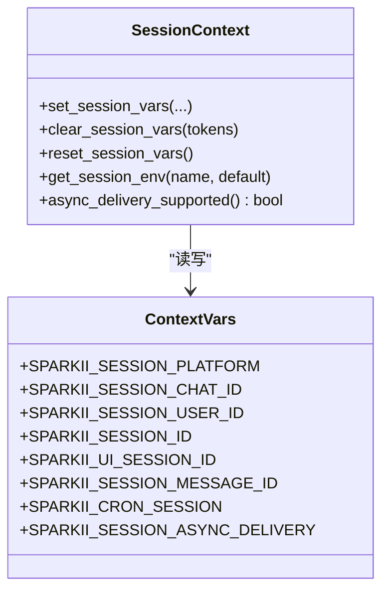
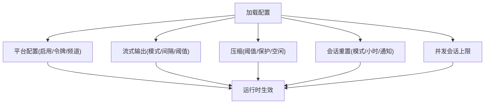
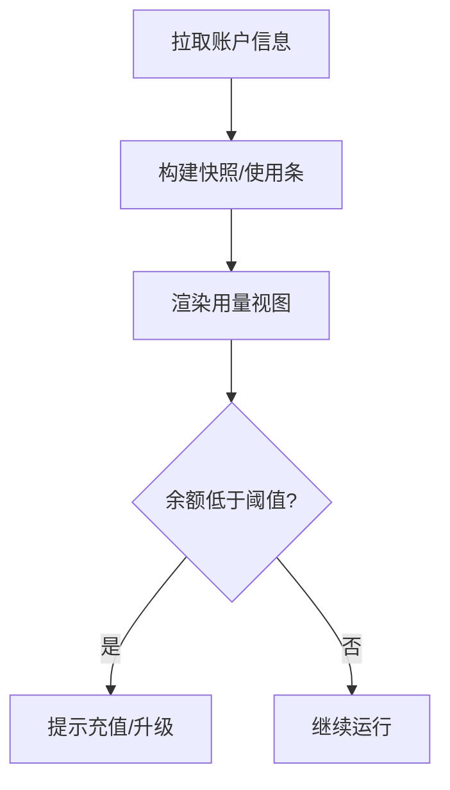
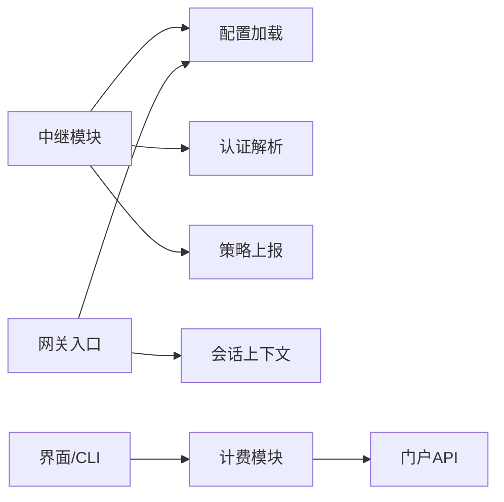

# 多租户支持

<cite>
**本文引用的文件**
- [gateway/relay/__init__.py](file://gateway/relay/__init__.py)
- [gateway/session_context.py](file://gateway/session_context.py)
- [gateway/config.py](file://gateway/config.py)
- [agent/account_usage.py](file://agent/account_usage.py)
- [agent/billing_usage.py](file://agent/billing_usage.py)
- [cli-config.yaml.example](file://cli-config.yaml.example)
- [docs/relay-connector-contract.md](file://docs/relay-connector-contract.md)
</cite>

## 目录
1. [简介](#简介)
2. [项目结构](#项目结构)
3. [核心组件](#核心组件)
4. [架构总览](#架构总览)
5. [详细组件分析](#详细组件分析)
6. [依赖关系分析](#依赖关系分析)
7. [性能考虑](#性能考虑)
8. [故障排除指南](#故障排除指南)
9. [结论](#结论)
10. [附录](#附录)

## 简介
本指南面向需要在同一部署中为多个企业客户（租户）提供隔离、配额与计费统计的多租户场景。代码库通过“网关中继连接器”实现跨租户的消息路由与鉴权，结合会话上下文隔离、平台配置与计费模型，形成端到端的多租户能力：
- 租户隔离：基于连接器鉴权与路由键，将不同租户的入站消息定向到各自实例或会话。
- 资源配额：通过订阅与充值额度展示、使用窗口与重置时间，支撑按租户的资源控制与提醒。
- 计费统计：聚合账户快照与使用条，统一渲染用量视图。
- 会话隔离：以任务级上下文变量承载平台、聊天、用户等标识，避免并发污染。
- 工具调用权限与安全边界：通过中继策略（提及要求、自由回复范围、允许机器人）限制可达范围。
- 部署示例：给出环境变量与配置文件项，演示如何为不同企业客户独立配置。
- 性能优化：连接池隔离、缓存策略与监控建议。
- 故障排除：常见问题定位与修复步骤。

## 项目结构
多租户相关的关键路径集中在网关中继、会话上下文、配置加载与计费模块：
- 网关中继：负责连接器对接、租户鉴权、路由键声明、实例标识与唤醒目标。
- 会话上下文：提供任务级隔离的会话标识与环境变量桥接，确保并发安全。
- 配置管理：平台、流式输出、压缩、会话重置等配置项，影响多租户行为。
- 计费与用量：账户快照、使用条、余额状态，用于配额与提醒。
- 文档契约：中继连接器对多租户的协议约定与路由规则。

图表来源
- [gateway/relay/__init__.py:25-45](file://gateway/relay/__init__.py#L25-L45)
- [gateway/session_context.py:1-37](file://gateway/session_context.py#L1-L37)
- [gateway/config.py:420-540](file://gateway/config.py#L420-L540)
- [agent/account_usage.py:137-230](file://agent/account_usage.py#L137-L230)
- [agent/billing_usage.py:88-137](file://agent/billing_usage.py#L88-L137)

章节来源
- [gateway/relay/__init__.py:25-45](file://gateway/relay/__init__.py#L25-L45)
- [gateway/session_context.py:1-37](file://gateway/session_context.py#L1-L37)
- [gateway/config.py:420-540](file://gateway/config.py#L420-L540)
- [agent/account_usage.py:137-230](file://agent/account_usage.py#L137-L230)
- [agent/billing_usage.py:88-137](file://agent/billing_usage.py#L88-L137)

## 核心组件
- 中继接入与租户路由：解析连接器地址、平台身份、认证、端点、路由键、实例ID与唤醒URL，完成自注册与策略上报。
- 会话上下文隔离：以 ContextVar 实现任务级隔离，替代进程全局环境变量，避免并发冲突。
- 配置系统：平台启用、默认频道、流式输出、压缩、会话重置等，影响多租户下的行为与体验。
- 计费与用量：从门户获取账户信息，构建使用快照与使用条，展示余额与到期时间。

章节来源
- [gateway/relay/__init__.py:25-45](file://gateway/relay/__init__.py#L25-L45)
- [gateway/relay/__init__.py:125-173](file://gateway/relay/__init__.py#L125-L173)
- [gateway/relay/__init__.py:175-226](file://gateway/relay/__init__.py#L175-L226)
- [gateway/relay/__init__.py:228-295](file://gateway/relay/__init__.py#L228-L295)
- [gateway/relay/__init__.py:414-488](file://gateway/relay/__init__.py#L414-L488)
- [gateway/relay/__init__.py:565-701](file://gateway/relay/__init__.py#L565-L701)
- [gateway/relay/__init__.py:737-800](file://gateway/relay/__init__.py#L737-L800)
- [gateway/session_context.py:1-37](file://gateway/session_context.py#L1-L37)
- [gateway/session_context.py:206-271](file://gateway/session_context.py#L206-L271)
- [gateway/session_context.py:315-360](file://gateway/session_context.py#L315-L360)
- [gateway/config.py:420-540](file://gateway/config.py#L420-L540)
- [agent/account_usage.py:137-230](file://agent/account_usage.py#L137-L230)
- [agent/billing_usage.py:88-137](file://agent/billing_usage.py#L88-L137)

## 架构总览
下图展示了多租户请求在网关与连接器之间的流转，以及会话上下文与配置的作用点。

图表来源
- [gateway/relay/__init__.py:149-173](file://gateway/relay/__init__.py#L149-L173)
- [gateway/relay/__init__.py:414-488](file://gateway/relay/__init__.py#L414-L488)
- [gateway/session_context.py:206-271](file://gateway/session_context.py#L206-L271)
- [gateway/config.py:420-540](file://gateway/config.py#L420-L540)
- [agent/account_usage.py:137-230](file://agent/account_usage.py#L137-L230)

## 详细组件分析

### 中继与租户路由
- 连接器发现与激活：通过环境变量或配置文件中的中继地址激活中继平台；未设置则走直连单租户模式。
- 平台身份与多平台：支持多平台集合与每个平台的 botId；握手时累积平台集，出站按帧区分平台。
- 认证与会话密钥：网关实例在启动时可自注册，获得每网关密钥与每租户投递密钥，写入进程环境供后续通信使用。
- 端点与路由键：声明公网入站端点与路由键（scope/chat/path），连接器据此写入租户路由行。
- 实例标识与唤醒：稳定实例ID与唤醒URL用于按实例路由与唤醒挂起实例。
- 显示名称与归属：可声明人类可读的代理显示名，用于多代理归因前缀。
- 相关性策略：将平台的“需提及”、“自由回复范围”、“允许其他机器人”映射为连接器通用策略，按租户+平台+实例存储。

图表来源
- [gateway/relay/__init__.py:25-45](file://gateway/relay/__init__.py#L25-L45)
- [gateway/relay/__init__.py:48-122](file://gateway/relay/__init__.py#L48-L122)
- [gateway/relay/__init__.py:125-173](file://gateway/relay/__init__.py#L125-L173)
- [gateway/relay/__init__.py:175-226](file://gateway/relay/__init__.py#L175-L226)
- [gateway/relay/__init__.py:228-295](file://gateway/relay/__init__.py#L228-L295)
- [gateway/relay/__init__.py:414-488](file://gateway/relay/__init__.py#L414-L488)
- [gateway/relay/__init__.py:565-701](file://gateway/relay/__init__.py#L565-L701)
- [gateway/relay/__init__.py:737-800](file://gateway/relay/__init__.py#L737-L800)

章节来源
- [gateway/relay/__init__.py:25-45](file://gateway/relay/__init__.py#L25-L45)
- [gateway/relay/__init__.py:48-122](file://gateway/relay/__init__.py#L48-L122)
- [gateway/relay/__init__.py:125-173](file://gateway/relay/__init__.py#L125-L173)
- [gateway/relay/__init__.py:175-226](file://gateway/relay/__init__.py#L175-L226)
- [gateway/relay/__init__.py:228-295](file://gateway/relay/__init__.py#L228-L295)
- [gateway/relay/__init__.py:414-488](file://gateway/relay/__init__.py#L414-L488)
- [gateway/relay/__init__.py:565-701](file://gateway/relay/__init__.py#L565-L701)
- [gateway/relay/__init__.py:737-800](file://gateway/relay/__init__.py#L737-L800)
- [docs/relay-connector-contract.md:87-90](file://docs/relay-connector-contract.md#L87-L90)
- [docs/relay-connector-contract.md:135-138](file://docs/relay-connector-contract.md#L135-L138)
- [docs/relay-connector-contract.md:202-234](file://docs/relay-connector-contract.md#L202-L234)
- [docs/relay-connector-contract.md:309-319](file://docs/relay-connector-contract.md#L309-L319)
- [docs/relay-connector-contract.md:542-576](file://docs/relay-connector-contract.md#L542-L576)

### 会话隔离与上下文
- 任务级隔离：使用 ContextVar 替代进程全局环境变量，保证并发消息互不干扰。
- 会话变量：平台、聊天、用户、线程、会话ID、UI会话ID、消息ID、工作目录、异步投递能力等。
- 生命周期：进入处理器时重置继承上下文，绑定当前会话；退出时清理，防止泄漏。
- 兼容层：提供 get_session_env 兼容旧式 SPARKII_SESSION_* 读取，优先 ContextVar，再回退到 os.environ。

图表来源
- [gateway/session_context.py:1-37](file://gateway/session_context.py#L1-L37)
- [gateway/session_context.py:206-271](file://gateway/session_context.py#L206-L271)
- [gateway/session_context.py:315-360](file://gateway/session_context.py#L315-L360)
- [gateway/session_context.py:363-386](file://gateway/session_context.py#L363-L386)
- [gateway/session_context.py:418-496](file://gateway/session_context.py#L418-L496)

章节来源
- [gateway/session_context.py:1-37](file://gateway/session_context.py#L1-L37)
- [gateway/session_context.py:206-271](file://gateway/session_context.py#L206-L271)
- [gateway/session_context.py:315-360](file://gateway/session_context.py#L315-L360)
- [gateway/session_context.py:363-386](file://gateway/session_context.py#L363-L386)
- [gateway/session_context.py:418-496](file://gateway/session_context.py#L418-L496)

### 配置系统与租户选项
- 平台配置：启用开关、令牌、默认频道、回复线程模式、重启通知、输入指示器、通道覆盖等。
- 流式输出：传输模式、编辑间隔、缓冲阈值、光标、最终消息替换策略。
- 压缩：触发阈值、保护最近消息数、空闲压缩、主动修剪等。
- 会话重置：模式（每日/空闲/两者/从不）、小时、通知、后台进程最大年龄。
- 并发会话上限：全局并发会话限制，影响多租户下资源占用。

图表来源
- [gateway/config.py:420-540](file://gateway/config.py#L420-L540)
- [gateway/config.py:593-708](file://gateway/config.py#L593-L708)
- [gateway/config.py:720-800](file://gateway/config.py#L720-L800)
- [cli-config.yaml.example:717-755](file://cli-config.yaml.example#L717-L755)
- [cli-config.yaml.example:792-800](file://cli-config.yaml.example#L792-L800)

章节来源
- [gateway/config.py:420-540](file://gateway/config.py#L420-L540)
- [gateway/config.py:593-708](file://gateway/config.py#L593-L708)
- [gateway/config.py:720-800](file://gateway/config.py#L720-L800)
- [cli-config.yaml.example:717-755](file://cli-config.yaml.example#L717-L755)
- [cli-config.yaml.example:792-800](file://cli-config.yaml.example#L792-L800)

### 计费与配额统计
- 账户快照：从门户拉取账户信息，构建订阅与充值余额、可用总额、到期时间等。
- 使用条：计划条（月度额度百分比）与充值条（购买金额不过期）。
- 状态分类：免费、健康、低余额、耗尽，驱动界面提示与告警。
- 多后端支持：Nous、Codex、Anthropic 等的使用接口适配。

图表来源
- [agent/account_usage.py:137-230](file://agent/account_usage.py#L137-L230)
- [agent/billing_usage.py:88-137](file://agent/billing_usage.py#L88-L137)
- [agent/billing_usage.py:143-223](file://agent/billing_usage.py#L143-L223)
- [agent/billing_usage.py:226-256](file://agent/billing_usage.py#L226-L256)

章节来源
- [agent/account_usage.py:137-230](file://agent/account_usage.py#L137-L230)
- [agent/billing_usage.py:88-137](file://agent/billing_usage.py#L88-L137)
- [agent/billing_usage.py:143-223](file://agent/billing_usage.py#L143-L223)
- [agent/billing_usage.py:226-256](file://agent/billing_usage.py#L226-L256)

## 依赖关系分析
- 中继模块依赖配置加载与认证解析，并在启动时进行自注册与策略上报。
- 会话上下文被网关各入口（平台、CLI、TUI、cron）广泛使用，确保并发安全。
- 配置系统为平台、流式、压缩、重置等提供统一入口，影响运行时行为。
- 计费模块与门户交互，提供用量数据给界面与告警逻辑。

图表来源
- [gateway/relay/__init__.py:25-45](file://gateway/relay/__init__.py#L25-L45)
- [gateway/relay/__init__.py:414-488](file://gateway/relay/__init__.py#L414-L488)
- [gateway/relay/__init__.py:737-800](file://gateway/relay/__init__.py#L737-L800)
- [gateway/session_context.py:206-271](file://gateway/session_context.py#L206-L271)
- [agent/account_usage.py:137-230](file://agent/account_usage.py#L137-L230)

章节来源
- [gateway/relay/__init__.py:25-45](file://gateway/relay/__init__.py#L25-L45)
- [gateway/relay/__init__.py:414-488](file://gateway/relay/__init__.py#L414-L488)
- [gateway/relay/__init__.py:737-800](file://gateway/relay/__init__.py#L737-L800)
- [gateway/session_context.py:206-271](file://gateway/session_context.py#L206-L271)
- [agent/account_usage.py:137-230](file://agent/account_usage.py#L137-L230)

## 性能考虑
- 连接池隔离：为不同租户或平台使用独立的连接器连接与会话密钥，避免共享连接导致的竞争与泄露。
- 缓存策略：利用平台原生草稿流式更新与编辑策略减少频繁写操作；合理设置流式编辑间隔与缓冲阈值。
- 压缩与上下文：根据模型上下文长度与负载动态调整压缩触发阈值，保留最近消息，降低重复成本。
- 监控与告警：关注中继注册成功率、策略上报状态、会话上下文切换频率、计费快照延迟与失败率。
- 并发控制：设置全局并发会话上限，避免多租户下资源争用导致抖动。

[本节为通用指导，无需特定文件引用]

## 故障排除指南
- 中继未激活：检查是否配置了中继地址；若未设置，则为直连单租户模式。
- 自注册失败：确认网关ID与密钥是否存在；若无，则尝试自注册流程；失败会记录警告但不阻塞启动。
- 策略上报失败：相关性策略为优化项，失败不影响基本功能；检查网络与令牌有效性。
- 会话上下文泄漏：确保在每个消息处理器入口处重置上下文，并在退出时清理，避免跨会话污染。
- 配置错误：平台端口绑定冲突、无效整数字段会被忽略并记录警告；检查 YAML/环境变量格式。
- 计费不可用：门户不可达或未登录时，用量视图降级为空；检查认证状态与网络连通性。

章节来源
- [gateway/relay/__init__.py:565-701](file://gateway/relay/__init__.py#L565-L701)
- [gateway/relay/__init__.py:737-800](file://gateway/relay/__init__.py#L737-L800)
- [gateway/session_context.py:315-360](file://gateway/session_context.py#L315-L360)
- [gateway/config.py:114-147](file://gateway/config.py#L114-L147)
- [agent/account_usage.py:233-280](file://agent/account_usage.py#L233-L280)

## 结论
该代码库通过中继连接器实现租户级路由与鉴权，结合任务级会话上下文隔离、灵活的平台与流式配置、以及统一的计费与用量视图，提供了完整的多租户能力。部署时可通过环境变量与配置文件为不同企业客户独立配置租户标识、资源配额、网络访问策略与安全边界；在生产环境中建议实施连接池隔离、缓存优化与监控告警，以提升稳定性与性能。

[本节为总结，无需特定文件引用]

## 附录

### 部署示例：为企业A与企业B分别配置独立多租户环境
- 企业A
  - 设置中继地址、网关ID与密钥（或通过自注册流程生成）。
  - 声明公网入站端点与路由键（如 scope_id/chat_id/path）。
  - 配置平台（如 Telegram/Discord）与默认频道。
  - 设置流式输出与压缩参数，优化用户体验。
  - 查看计费快照与使用条，设置低余额告警。
- 企业B
  - 复用相同部署，但使用不同的中继端点与路由键，确保消息隔离。
  - 独立配置平台令牌与频道，避免共享敏感信息。
  - 调整并发会话上限与压缩阈值，匹配业务负载。
  - 定期审查策略上报与中继注册状态，确保路由正确。

章节来源
- [gateway/relay/__init__.py:149-173](file://gateway/relay/__init__.py#L149-L173)
- [gateway/relay/__init__.py:175-226](file://gateway/relay/__init__.py#L175-L226)
- [gateway/config.py:593-708](file://gateway/config.py#L593-L708)
- [agent/account_usage.py:137-230](file://agent/account_usage.py#L137-L230)