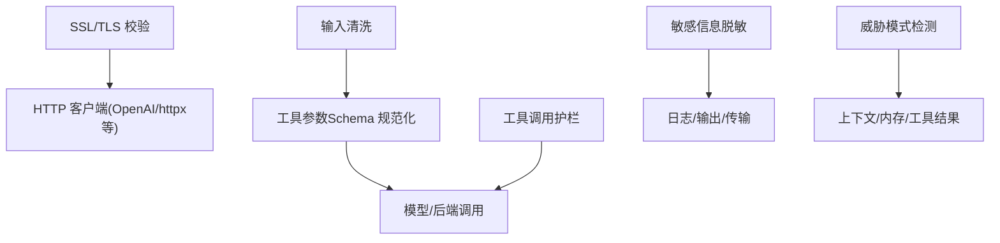
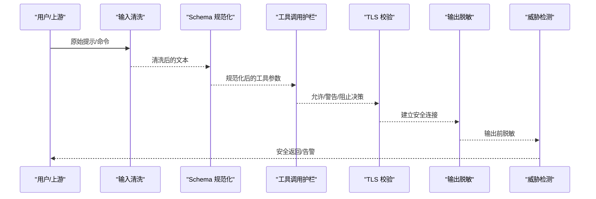
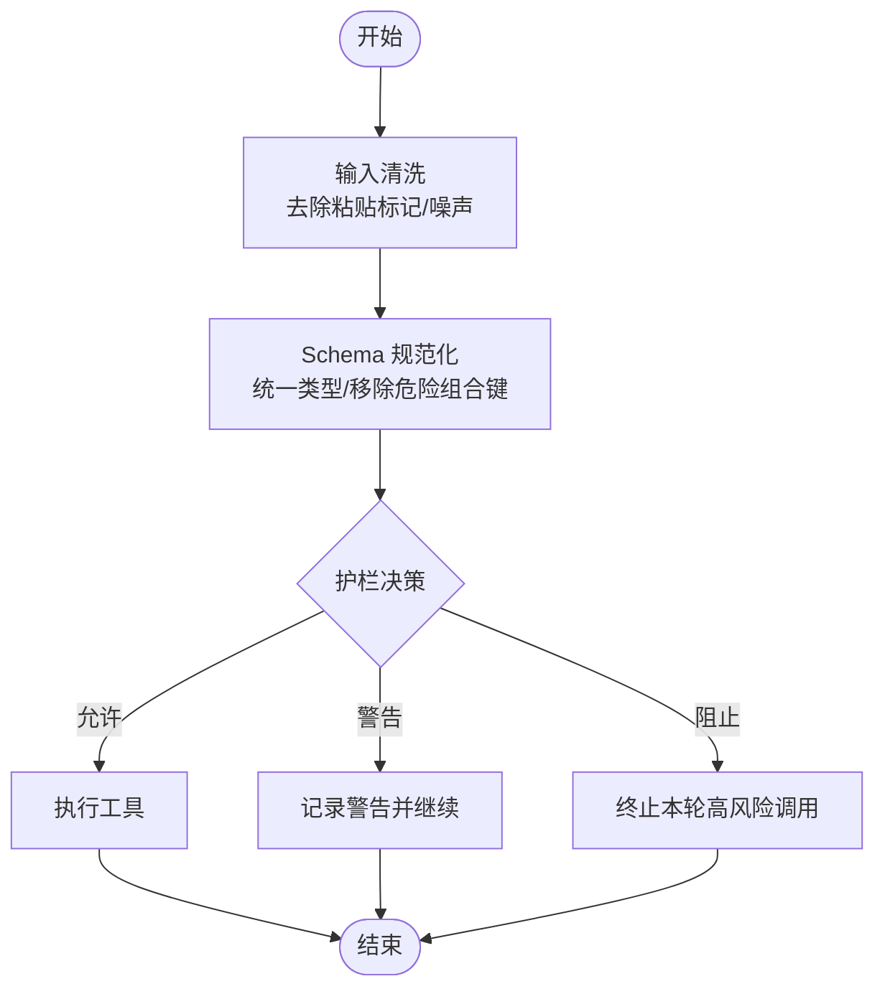
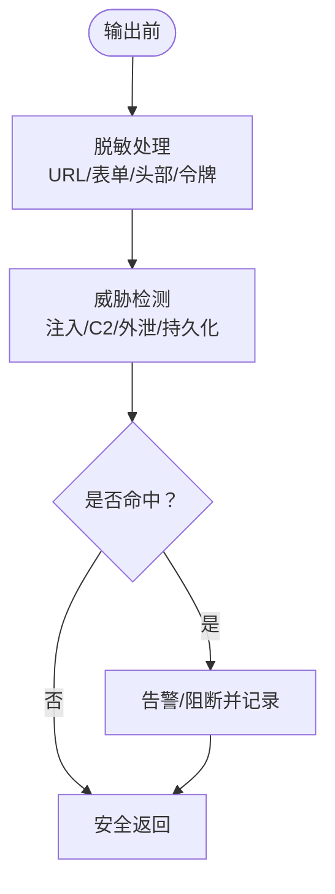
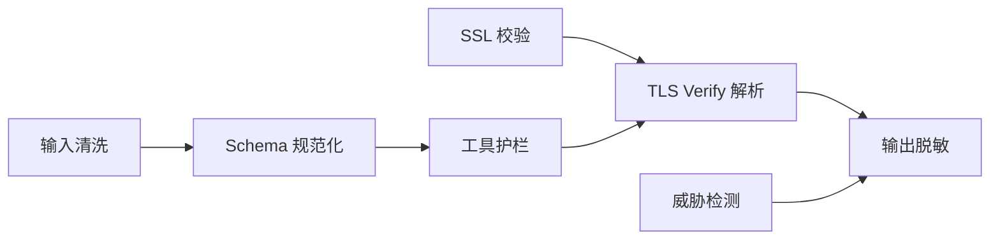

# 安全加固

<cite>
**本文引用的文件**
- [agent/ssl_guard.py](file://agent/ssl_guard.py)
- [agent/ssl_verify.py](file://agent/ssl_verify.py)
- [sparkii_cli/input_sanitize.py](file://sparkii_cli/input_sanitize.py)
- [tools/schema_sanitizer.py](file://tools/schema_sanitizer.py)
- [agent/tool_guardrails.py](file://agent/tool_guardrails.py)
- [agent/redact.py](file://agent/redact.py)
- [tools/threat_patterns.py](file://tools/threat_patterns.py)
</cite>

## 目录
1. [简介](#简介)
2. [项目结构](#项目结构)
3. [核心组件](#核心组件)
4. [架构总览](#架构总览)
5. [详细组件分析](#详细组件分析)
6. [依赖关系分析](#依赖关系分析)
7. [性能考量](#性能考量)
8. [故障排查指南](#故障排查指南)
9. [结论](#结论)
10. [附录：配置模板与最佳实践](#附录配置模板与最佳实践)

## 简介
本指南聚焦于代码库中的安全加固能力，覆盖输入验证、输出过滤、网络安全策略、安全扫描与漏洞检测、以及事件响应与合规建议。内容基于仓库中与安全相关的实现模块进行梳理，帮助生产环境以最小权限、加密通信和可观测性为基础构建安全基线。

## 项目结构
围绕安全的关键模块分布在以下位置：
- SSL/TLS 校验与证书管理：agent/ssl_guard.py、agent/ssl_verify.py
- 输入清洗与工具调用防护：sparkii_cli/input_sanitize.py、tools/schema_sanitizer.py、agent/tool_guardrails.py
- 敏感信息脱敏与威胁模式检测：agent/redact.py、tools/threat_patterns.py

图示来源
- [agent/ssl_guard.py:68-102](file://agent/ssl_guard.py#L68-L102)
- [agent/ssl_verify.py:22-64](file://agent/ssl_verify.py#L22-L64)
- [sparkii_cli/input_sanitize.py:16-71](file://sparkii_cli/input_sanitize.py#L16-L71)
- [tools/schema_sanitizer.py:120-174](file://tools/schema_sanitizer.py#L120-L174)
- [agent/tool_guardrails.py:273-348](file://agent/tool_guardrails.py#L273-L348)
- [agent/redact.py:772-800](file://agent/redact.py#L772-L800)
- [tools/threat_patterns.py:207-255](file://tools/threat_patterns.py#L207-L255)

章节来源
- [agent/ssl_guard.py:68-102](file://agent/ssl_guard.py#L68-L102)
- [agent/ssl_verify.py:22-64](file://agent/ssl_verify.py#L22-L64)
- [sparkii_cli/input_sanitize.py:16-71](file://sparkii_cli/input_sanitize.py#L16-L71)
- [tools/schema_sanitizer.py:120-174](file://tools/schema_sanitizer.py#L120-L174)
- [agent/tool_guardrails.py:273-348](file://agent/tool_guardrails.py#L273-L348)
- [agent/redact.py:772-800](file://agent/redact.py#L772-L800)
- [tools/threat_patterns.py:207-255](file://tools/threat_patterns.py#L207-L255)

## 核心组件
- SSL/TLS 校验与证书修复提示：启动时校验 CA 包路径与有效性，提供修复指引。
- HTTP 客户端 TLS verify 解析：按优先级选择禁用验证、自定义 CA 或系统默认。
- 输入清洗：去除终端粘贴残留标记与重复噪声，避免污染提示词。
- 工具 Schema 规范化：将不兼容的 JSON Schema 片段转换为后端可接受的稳定形态。
- 工具调用护栏：检测重复失败、无进展循环与越界调用，支持告警与硬停止。
- 敏感信息脱敏：对日志、工具输出、URL、表单、头部等进行多模式脱敏。
- 威胁模式检测：识别注入、C2、数据外泄、持久化等攻击特征并给出告警/阻断。

章节来源
- [agent/ssl_guard.py:68-102](file://agent/ssl_guard.py#L68-L102)
- [agent/ssl_verify.py:22-64](file://agent/ssl_verify.py#L22-L64)
- [sparkii_cli/input_sanitize.py:16-71](file://sparkii_cli/input_sanitize.py#L16-L71)
- [tools/schema_sanitizer.py:120-174](file://tools/schema_sanitizer.py#L120-L174)
- [agent/tool_guardrails.py:273-348](file://agent/tool_guardrails.py#L273-L348)
- [agent/redact.py:772-800](file://agent/redact.py#L772-L800)
- [tools/threat_patterns.py:207-255](file://tools/threat_patterns.py#L207-L255)

## 架构总览
下图展示从输入到输出的安全处理流水线，涵盖输入清洗、Schema 规范化、工具护栏、TLS 校验、输出脱敏与威胁检测。

图示来源
- [sparkii_cli/input_sanitize.py:16-71](file://sparkii_cli/input_sanitize.py#L16-L71)
- [tools/schema_sanitizer.py:120-174](file://tools/schema_sanitizer.py#L120-L174)
- [agent/tool_guardrails.py:273-348](file://agent/tool_guardrails.py#L273-L348)
- [agent/ssl_verify.py:22-64](file://agent/ssl_verify.py#L22-L64)
- [agent/redact.py:772-800](file://agent/redact.py#L772-L800)
- [tools/threat_patterns.py:207-255](file://tools/threat_patterns.py#L207-L255)

## 详细组件分析

### 输入验证机制（SQL注入/XSS/命令注入）
- SQL 注入防护
  - 通过工具参数 Schema 规范化，拒绝非法类型与不受支持的组合键，降低后端解析失败风险；同时移除顶层危险组合键，减少被严格后端拒收的可能。
  - 参考路径：[tools/schema_sanitizer.py:120-174](file://tools/schema_sanitizer.py#L120-L174)
- XSS 防护
  - 输入清洗去除终端粘贴残留标记与重复噪声，避免恶意控制序列进入提示词。
  - 参考路径：[sparkii_cli/input_sanitize.py:16-71](file://sparkii_cli/input_sanitize.py#L16-L71)
- 命令注入防护
  - 工具调用护栏限制同一轮次内高风险工具的调用次数，检测重复失败与无进展循环，必要时阻止执行，降低命令注入面。
  - 参考路径：[agent/tool_guardrails.py:273-348](file://agent/tool_guardrails.py#L273-L348)

图示来源
- [sparkii_cli/input_sanitize.py:16-71](file://sparkii_cli/input_sanitize.py#L16-L71)
- [tools/schema_sanitizer.py:120-174](file://tools/schema_sanitizer.py#L120-L174)
- [agent/tool_guardrails.py:273-348](file://agent/tool_guardrails.py#L273-L348)

章节来源
- [sparkii_cli/input_sanitize.py:16-71](file://sparkii_cli/input_sanitize.py#L16-L71)
- [tools/schema_sanitizer.py:120-174](file://tools/schema_sanitizer.py#L120-L174)
- [agent/tool_guardrails.py:273-348](file://agent/tool_guardrails.py#L273-L348)

### 输出过滤功能（敏感信息脱敏/恶意内容检测/响应净化）
- 敏感信息脱敏
  - 对日志、工具输出、URL、表单、请求头等进行多模式匹配与掩码，保留必要调试信息的同时隐藏密钥、令牌、密码等。
  - 参考路径：[agent/redact.py:772-800](file://agent/redact.py#L772-L800)
- 恶意内容检测
  - 使用威胁模式库在上下文、内存写入与工具结果中检测注入、C2、外泄、持久化等行为，支持不同严格度范围。
  - 参考路径：[tools/threat_patterns.py:207-255](file://tools/threat_patterns.py#L207-L255)
- 响应净化
  - 在返回给用户或下游系统前，再次应用脱敏规则，确保不会泄露凭据或敏感参数。

图示来源
- [agent/redact.py:772-800](file://agent/redact.py#L772-L800)
- [tools/threat_patterns.py:207-255](file://tools/threat_patterns.py#L207-L255)

章节来源
- [agent/redact.py:772-800](file://agent/redact.py#L772-L800)
- [tools/threat_patterns.py:207-255](file://tools/threat_patterns.py#L207-L255)

### 网络安全策略（防火墙/SSL-TLS/访问控制）
- 防火墙规则配置
  - 建议在容器/主机层仅开放必要端口，结合网络隔离与出站白名单，限制对外通信范围。
- SSL/TLS 设置
  - 启动时校验 CA 包路径与有效性，提供修复提示；为 HTTP 客户端解析 verify 行为，支持禁用验证（仅限本地开发）、指定 CA 或默认系统信任。
  - 参考路径：
    - [agent/ssl_guard.py:68-102](file://agent/ssl_guard.py#L68-L102)
    - [agent/ssl_verify.py:22-64](file://agent/ssl_verify.py#L22-L64)
- 访问控制列表管理
  - 在生产环境中启用最小权限原则，限制工具集与外部服务调用范围；结合网关与平台插件的鉴权机制，确保只有受信任角色可执行高危操作。

章节来源
- [agent/ssl_guard.py:68-102](file://agent/ssl_guard.py#L68-L102)
- [agent/ssl_verify.py:22-64](file://agent/ssl_verify.py#L22-L64)

### 安全扫描与漏洞检测（依赖检查/代码审计/运行时监控）
- 依赖包安全检查
  - 在 CI/CD 中集成依赖漏洞扫描（如 OSV、npm audit、pip audit），阻断已知高危依赖上线。
- 代码安全审计
  - 使用静态分析与规则引擎检查常见安全问题（硬编码密钥、不安全配置、危险函数调用）。
- 运行时安全监控
  - 利用威胁模式检测与脱敏机制，持续观察上下文与工具结果，发现异常行为并及时告警。

章节来源
- [tools/threat_patterns.py:207-255](file://tools/threat_patterns.py#L207-L255)
- [agent/redact.py:772-800](file://agent/redact.py#L772-L800)

### 安全配置模板（生产基线/最小权限/加密通信）
- 生产环境安全基线
  - 强制启用 TLS 校验，禁止在生产关闭证书验证；限定 CA 包来源并确保其有效。
  - 参考路径：[agent/ssl_guard.py:68-102](file://agent/ssl_guard.py#L68-L102)
- 最小权限配置
  - 限制工具集与外部服务访问；对高风险工具启用护栏阈值与硬停止。
  - 参考路径：[agent/tool_guardrails.py:273-348](file://agent/tool_guardrails.py#L273-L348)
- 加密通信设置
  - 为所有出站连接启用 TLS；如需企业 CA，通过环境变量指定 CA 包路径。
  - 参考路径：[agent/ssl_verify.py:22-64](file://agent/ssl_verify.py#L22-L64)

章节来源
- [agent/ssl_guard.py:68-102](file://agent/ssl_guard.py#L68-L102)
- [agent/ssl_verify.py:22-64](file://agent/ssl_verify.py#L22-L64)
- [agent/tool_guardrails.py:273-348](file://agent/tool_guardrails.py#L273-L348)

### 安全事件响应流程（入侵检测/威胁分析/恢复策略）
- 入侵检测
  - 基于威胁模式检测命中结果，快速定位注入、C2、外泄等事件。
  - 参考路径：[tools/threat_patterns.py:207-255](file://tools/threat_patterns.py#L207-L255)
- 威胁分析
  - 结合脱敏后的日志与工具结果，还原攻击链与影响面。
  - 参考路径：[agent/redact.py:772-800](file://agent/redact.py#L772-L800)
- 恢复策略
  - 暂停高风险工具调用，清理受影响上下文，回滚变更并重新校验证书与权限。

章节来源
- [tools/threat_patterns.py:207-255](file://tools/threat_patterns.py#L207-L255)
- [agent/redact.py:772-800](file://agent/redact.py#L772-L800)

## 依赖关系分析
各安全组件之间的耦合与协作如下：

图示来源
- [agent/ssl_guard.py:68-102](file://agent/ssl_guard.py#L68-L102)
- [agent/ssl_verify.py:22-64](file://agent/ssl_verify.py#L22-L64)
- [sparkii_cli/input_sanitize.py:16-71](file://sparkii_cli/input_sanitize.py#L16-L71)
- [tools/schema_sanitizer.py:120-174](file://tools/schema_sanitizer.py#L120-L174)
- [agent/tool_guardrails.py:273-348](file://agent/tool_guardrails.py#L273-L348)
- [agent/redact.py:772-800](file://agent/redact.py#L772-L800)
- [tools/threat_patterns.py:207-255](file://tools/threat_patterns.py#L207-L255)

章节来源
- [agent/ssl_guard.py:68-102](file://agent/ssl_guard.py#L68-L102)
- [agent/ssl_verify.py:22-64](file://agent/ssl_verify.py#L22-L64)
- [sparkii_cli/input_sanitize.py:16-71](file://sparkii_cli/input_sanitize.py#L16-L71)
- [tools/schema_sanitizer.py:120-174](file://tools/schema_sanitizer.py#L120-L174)
- [agent/tool_guardrails.py:273-348](file://agent/tool_guardrails.py#L273-L348)
- [agent/redact.py:772-800](file://agent/redact.py#L772-L800)
- [tools/threat_patterns.py:207-255](file://tools/threat_patterns.py#L207-L255)

## 性能考量
- 正则与模式匹配开销
  - 威胁检测与脱敏大量使用正则表达式，需控制输入长度与扫描范围，避免回溯爆炸。
  - 参考路径：[tools/threat_patterns.py:49-53](file://tools/threat_patterns.py#L49-L53)
- 工具 Schema 规范化
  - 递归遍历与替换可能带来额外 CPU 开销，应在工具注册阶段批量处理，减少运行时重复计算。
  - 参考路径：[tools/schema_sanitizer.py:401-540](file://tools/schema_sanitizer.py#L401-L540)
- 护栏计数重置
  - 每轮重置计数器，避免跨轮累积导致的误判与性能退化。
  - 参考路径：[agent/tool_guardrails.py:280-289](file://agent/tool_guardrails.py#L280-L289)

章节来源
- [tools/threat_patterns.py:49-53](file://tools/threat_patterns.py#L49-L53)
- [tools/schema_sanitizer.py:401-540](file://tools/schema_sanitizer.py#L401-L540)
- [agent/tool_guardrails.py:280-289](file://agent/tool_guardrails.py#L280-L289)

## 故障排查指南
- SSL 证书问题
  - 现象：启动时报错无法加载 CA 包或证书缺失。
  - 处理：检查环境变量指向的 CA 包路径与有效性；使用提供的修复提示重装依赖或修正配置。
  - 参考路径：[agent/ssl_guard.py:68-102](file://agent/ssl_guard.py#L68-L102)
- TLS 验证被禁用
  - 现象：日志中出现“TLS 证书验证已禁用”的警告。
  - 处理：确认是否为本地开发场景；生产环境应启用验证并指定可信 CA。
  - 参考路径：[agent/ssl_verify.py:22-64](file://agent/ssl_verify.py#L22-L64)
- 工具调用循环
  - 现象：同一工具多次失败或无进展，触发护栏告警或阻止。
  - 处理：调整参数或切换工具；检查外部依赖状态；必要时提升护栏阈值或启用硬停止。
  - 参考路径：[agent/tool_guardrails.py:273-348](file://agent/tool_guardrails.py#L273-L348)
- 敏感信息泄露
  - 现象：日志或输出中包含密钥、令牌、密码等。
  - 处理：确认脱敏规则生效；检查是否绕过 URL 或表单脱敏路径；必要时启用更严格的 URL 凭据脱敏。
  - 参考路径：[agent/redact.py:772-800](file://agent/redact.py#L772-L800)

章节来源
- [agent/ssl_guard.py:68-102](file://agent/ssl_guard.py#L68-L102)
- [agent/ssl_verify.py:22-64](file://agent/ssl_verify.py#L22-L64)
- [agent/tool_guardrails.py:273-348](file://agent/tool_guardrails.py#L273-L348)
- [agent/redact.py:772-800](file://agent/redact.py#L772-L800)

## 结论
该代码库提供了较为完善的安全加固能力：从输入清洗、Schema 规范化到工具护栏，再到 TLS 校验、输出脱敏与威胁检测，形成端到端的安全流水线。生产部署时应遵循最小权限与加密通信原则，结合依赖扫描与运行时监控，构建可观测、可恢复的安全体系。

## 附录：配置模板与最佳实践
- 生产环境安全基线
  - 强制启用 TLS 校验，禁止在生产关闭证书验证；限定 CA 包来源并确保其有效。
  - 参考路径：[agent/ssl_guard.py:68-102](file://agent/ssl_guard.py#L68-L102)
- 最小权限配置
  - 限制工具集与外部服务访问；对高风险工具启用护栏阈值与硬停止。
  - 参考路径：[agent/tool_guardrails.py:273-348](file://agent/tool_guardrails.py#L273-L348)
- 加密通信设置
  - 为所有出站连接启用 TLS；如需企业 CA，通过环境变量指定 CA 包路径。
  - 参考路径：[agent/ssl_verify.py:22-64](file://agent/ssl_verify.py#L22-L64)
- 合规性指导
  - 定期审查威胁模式检测结果与脱敏日志，确保符合数据安全与隐私保护要求。
  - 参考路径：[tools/threat_patterns.py:207-255](file://tools/threat_patterns.py#L207-L255)
  - 参考路径：[agent/redact.py:772-800](file://agent/redact.py#L772-L800)

章节来源
- [agent/ssl_guard.py:68-102](file://agent/ssl_guard.py#L68-L102)
- [agent/ssl_verify.py:22-64](file://agent/ssl_verify.py#L22-L64)
- [agent/tool_guardrails.py:273-348](file://agent/tool_guardrails.py#L273-L348)
- [tools/threat_patterns.py:207-255](file://tools/threat_patterns.py#L207-L255)
- [agent/redact.py:772-800](file://agent/redact.py#L772-L800)