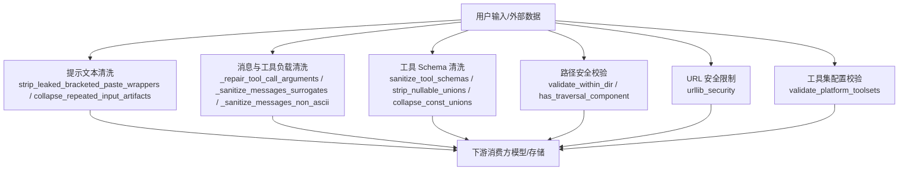
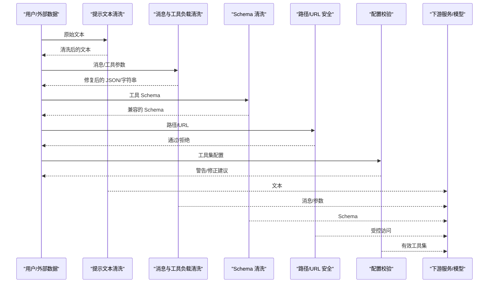
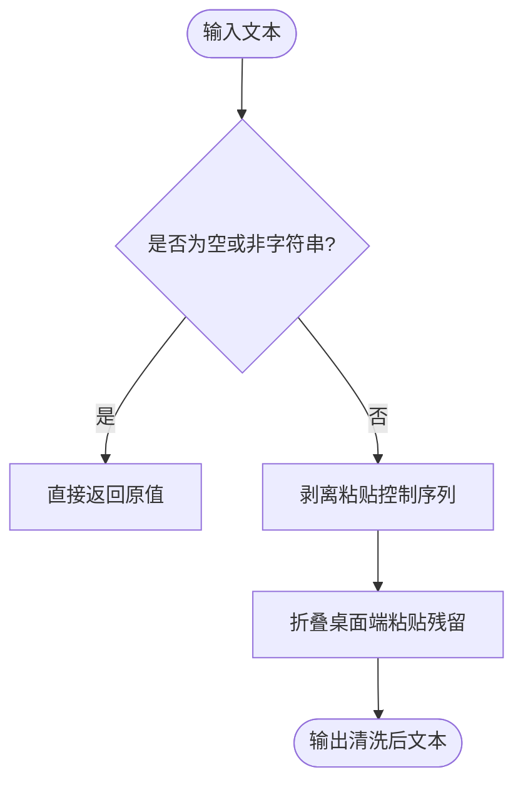
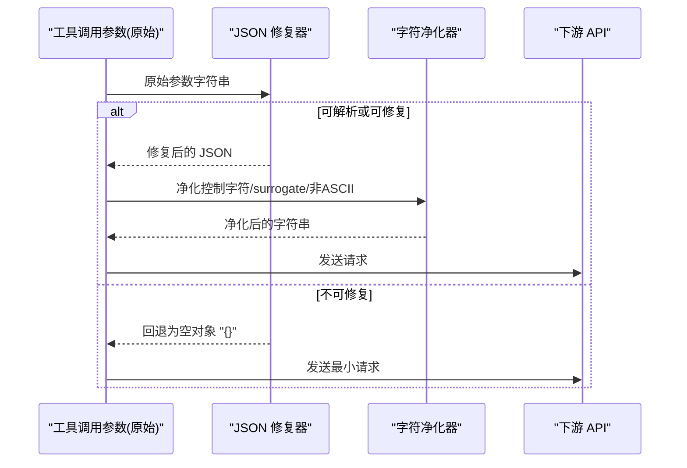
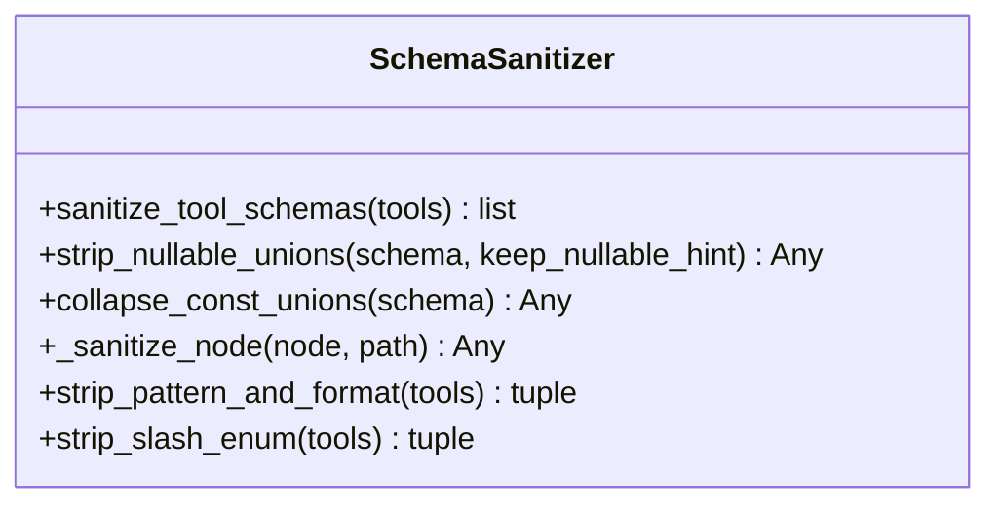
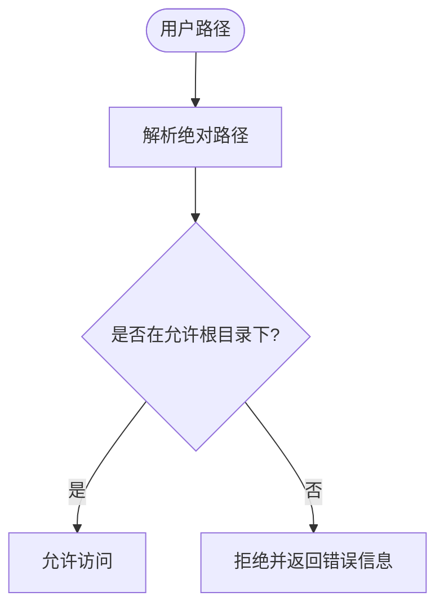
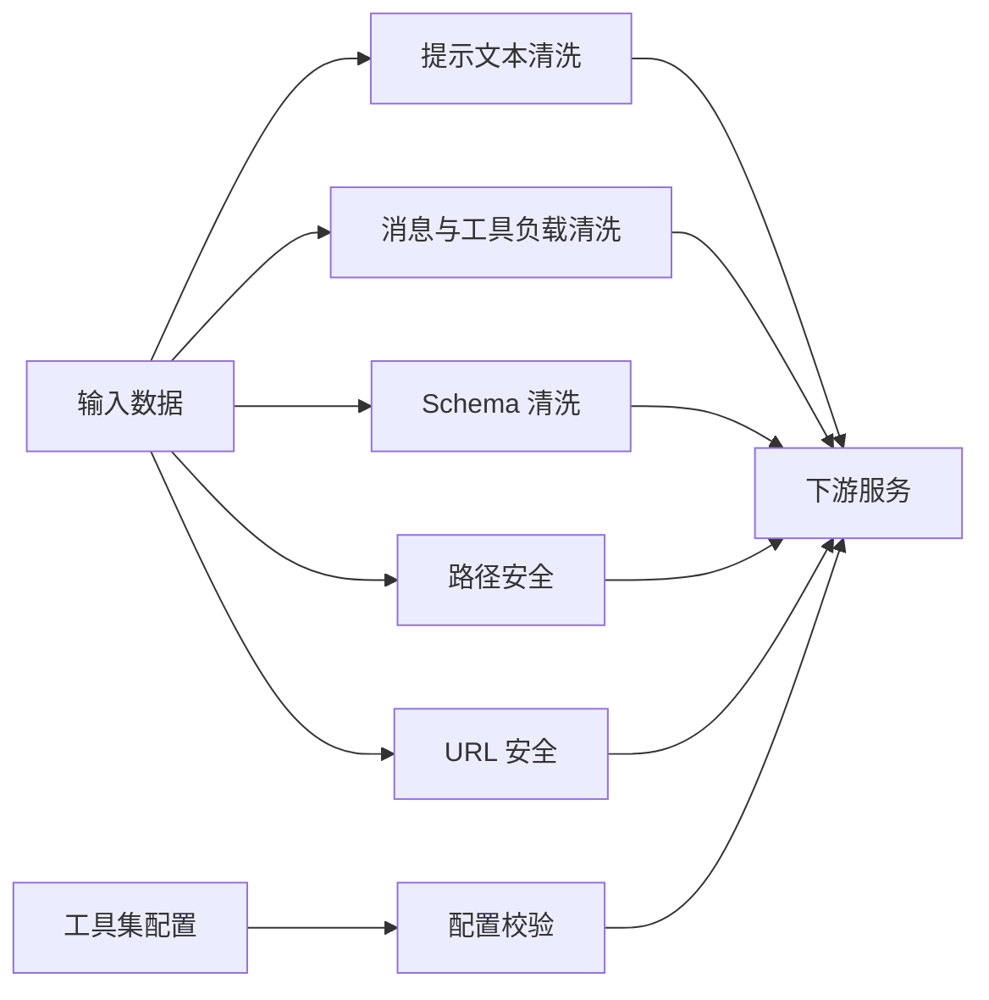

# 输入验证

<cite>
**本文引用的文件**
- [sparkii_cli/input_sanitize.py](file://sparkii_cli/input_sanitize.py)
- [tools/schema_sanitizer.py](file://tools/schema_sanitizer.py)
- [agent/message_sanitization.py](file://agent/message_sanitization.py)
- [tools/path_security.py](file://tools/path_security.py)
- [sparkii_cli/urllib_security.py](file://sparkii_cli/urllib_security.py)
- [sparkii_cli/toolset_validation.py](file://sparkii_cli/toolset_validation.py)
</cite>

## 目录
1. [简介](#简介)
2. [项目结构](#项目结构)
3. [核心组件](#核心组件)
4. [架构总览](#架构总览)
5. [详细组件分析](#详细组件分析)
6. [依赖关系分析](#依赖关系分析)
7. [性能考虑](#性能考虑)
8. [故障排查指南](#故障排查指南)
9. [结论](#结论)
10. [附录](#附录)

## 简介
本文件面向“输入验证系统”，聚焦以下目标：
- 支持的验证规则：数据类型、格式与业务逻辑校验的实现方式。
- 防注入攻击机制：SQL注入、NoSQL注入、命令注入、路径遍历的防护策略。
- 输入清洗能力：HTML实体编码、特殊字符转义、恶意脚本过滤等。
- 自定义验证器开发：编写验证函数、定制错误消息、配置验证链。
- 性能优化建议：验证缓存、批量验证、异步处理。
- 实际使用示例与常见攻击场景防护配置。

说明：本仓库在多处实现了输入安全与清洗能力，包括终端粘贴清理、JSON Schema 兼容清洗、消息与工具参数修复、路径安全校验、URL 访问限制以及工具集配置校验等。下文将基于这些实现进行系统化梳理。

## 项目结构
围绕输入验证与安全的关键模块分布如下：
- 用户提示文本清洗：用于去除终端粘贴控制序列和桌面端粘贴残留标记，确保进入模型或持久化的文本干净。
- 工具 JSON Schema 清洗：对工具参数 schema 做兼容性修复（类型数组、anyOf/oneOf、$ref 兄弟关键字、顶层组合符等），保障不同后端可解析。
- 消息与工具负载清洗：修复代理/模型产生的非法 JSON、控制字符、代理 surrogate、非 ASCII 字符等，保证 API 调用稳定。
- 路径安全校验：统一的路径白名单与穿越检查，防止路径遍历。
- URL 安全：限制网络请求协议与主机范围，降低 SSRF/开放重定向风险。
- 工具集配置校验：提前发现无效工具集名称，避免静默降级。

**图表来源**
- [sparkii_cli/input_sanitize.py:16-70](file://sparkii_cli/input_sanitize.py#L16-L70)
- [agent/message_sanitization.py:195-293](file://agent/message_sanitization.py#L195-L293)
- [tools/schema_sanitizer.py:120-174](file://tools/schema_sanitizer.py#L120-L174)
- [tools/path_security.py:15-43](file://tools/path_security.py#L15-L43)
- [sparkii_cli/urllib_security.py](file://sparkii_cli/urllib_security.py)
- [sparkii_cli/toolset_validation.py:18-74](file://sparkii_cli/toolset_validation.py#L18-L74)

**章节来源**
- [sparkii_cli/input_sanitize.py:16-70](file://sparkii_cli/input_sanitize.py#L16-L70)
- [agent/message_sanitization.py:195-293](file://agent/message_sanitization.py#L195-L293)
- [tools/schema_sanitizer.py:120-174](file://tools/schema_sanitizer.py#L120-L174)
- [tools/path_security.py:15-43](file://tools/path_security.py#L15-L43)
- [sparkii_cli/toolset_validation.py:18-74](file://sparkii_cli/toolset_validation.py#L18-L74)

## 核心组件
- 提示文本清洗：移除粘贴控制序列与桌面端粘贴残留，避免污染用户可见文本与模型输入。
- 消息与工具负载清洗：修复非法 JSON、控制字符、surrogate、非 ASCII 字符，保证序列化与 API 传输稳定。
- 工具 Schema 清洗：将不兼容的 JSON Schema 片段转换为更广泛接受的形态，提升多后端兼容性。
- 路径安全校验：强制路径落在允许根目录下，拒绝穿越与符号链接逃逸。
- URL 安全限制：限制协议与主机，减少 SSRF/开放重定向风险。
- 工具集配置校验：在启动阶段发现无效工具集名称并给出建议，避免静默失效。

**章节来源**
- [sparkii_cli/input_sanitize.py:16-70](file://sparkii_cli/input_sanitize.py#L16-L70)
- [agent/message_sanitization.py:195-293](file://agent/message_sanitization.py#L195-L293)
- [tools/schema_sanitizer.py:120-174](file://tools/schema_sanitizer.py#L120-L174)
- [tools/path_security.py:15-43](file://tools/path_security.py#L15-L43)
- [sparkii_cli/toolset_validation.py:18-74](file://sparkii_cli/toolset_validation.py#L18-L74)

## 架构总览
输入验证系统采用“分层清洗 + 专项校验”的架构：
- 入口层：对用户输入、外部数据、模型输出进行初步清洗（提示文本、消息负载）。
- 规范层：对结构化数据（如工具 Schema）进行规范化，消除后端差异。
- 安全层：对资源访问（路径、URL）进行强约束，阻断越权与注入。
- 配置层：在启动时校验关键配置（工具集），尽早暴露问题。

**图表来源**
- [sparkii_cli/input_sanitize.py:16-70](file://sparkii_cli/input_sanitize.py#L16-L70)
- [agent/message_sanitization.py:195-293](file://agent/message_sanitization.py#L195-L293)
- [tools/schema_sanitizer.py:120-174](file://tools/schema_sanitizer.py#L120-L174)
- [tools/path_security.py:15-43](file://tools/path_security.py#L15-L43)
- [sparkii_cli/urllib_security.py](file://sparkii_cli/urllib_security.py)
- [sparkii_cli/toolset_validation.py:18-74](file://sparkii_cli/toolset_validation.py#L18-L74)

## 详细组件分析

### 组件A：提示文本清洗（终端粘贴与桌面端残留）
- 功能要点：
  - 剥离粘贴控制序列（如 bracketed paste 标记），避免终端解析失败导致的脏文本。
  - 删除桌面端粘贴残留的重复标记，保持用户可见文本整洁。
- 适用场景：
  - 从终端或剪贴板粘贴大量文本到对话或工具输入。
  - 防止控制序列被误认为指令或影响模型理解。
- 复杂度与性能：
  - 正则匹配与字符串替换，时间复杂度近似 O(n)，适合高频调用。
- 错误处理：
  - 空值或非字符串直接返回，避免异常传播。

**图表来源**
- [sparkii_cli/input_sanitize.py:16-70](file://sparkii_cli/input_sanitize.py#L16-L70)

**章节来源**
- [sparkii_cli/input_sanitize.py:16-70](file://sparkii_cli/input_sanitize.py#L16-L70)

### 组件B：消息与工具负载清洗（JSON 修复与字符净化）
- 功能要点：
  - 修复不完整或含控制字符的工具调用参数 JSON，必要时回退为空对象以保证会话稳定。
  - 替换 surrogate 码位与非 ASCII 字符，避免 json.dumps 崩溃或上游 API 拒绝。
  - 关闭中断时的工具序列，维护消息角色交替不变式。
- 适用场景：
  - 本地推理后端或模型产生畸形 JSON；字节级推理模型可能输出非法字符。
  - 跨平台环境（ASCII 受限）下的兼容处理。
- 复杂度与性能：
  - 多次尝试解析与修复，最坏情况多次正则与字符串操作；整体仍为线性扫描为主。
- 错误处理：
  - 记录警告日志，并在无法修复时以空对象兜底，避免会话崩溃。

**图表来源**
- [agent/message_sanitization.py:195-293](file://agent/message_sanitization.py#L195-L293)
- [agent/message_sanitization.py:32-40](file://agent/message_sanitization.py#L32-L40)
- [agent/message_sanitization.py:337-393](file://agent/message_sanitization.py#L337-L393)

**章节来源**
- [agent/message_sanitization.py:195-293](file://agent/message_sanitization.py#L195-L293)
- [agent/message_sanitization.py:32-40](file://agent/message_sanitization.py#L32-L40)
- [agent/message_sanitization.py:337-393](file://agent/message_sanitization.py#L337-L393)

### 组件C：工具 JSON Schema 清洗（多后端兼容）
- 功能要点：
  - 将 bare-string 类型节点转为标准 schema 对象。
  - 规范化 type 数组为单类型或 anyOf 联合，保留 null 分支语义。
  - 折叠仅含 null 分支的 anyOf/oneOf，保留 nullable 提示。
  - 移除 $ref 节点的禁止兄弟关键字（如 default）。
  - 移除顶层组合符（allOf/anyOf/oneOf/enum/not）以满足严格后端。
  - 属性键名规范化，避免不合法字符导致请求失败。
  - 可选地移除 pattern/format 与含斜杠的 enum 值以适配特定后端。
- 适用场景：
  - 工具注册表生成的 MCP/OpenAI 格式工具列表，需在不同后端（llama.cpp、xAI、OpenAI Codex 等）间通用。
- 复杂度与性能：
  - 深度遍历 schema 树，时间复杂度 O(N)（N 为节点数）；保守修改，避免破坏语义。
- 错误处理：
  - 记录调试日志，仅在必要时进行恢复性剥离（如 llama.cpp 语法解析失败）。

**图表来源**
- [tools/schema_sanitizer.py:120-174](file://tools/schema_sanitizer.py#L120-L174)
- [tools/schema_sanitizer.py:240-302](file://tools/schema_sanitizer.py#L240-L302)
- [tools/schema_sanitizer.py:339-398](file://tools/schema_sanitizer.py#L339-L398)
- [tools/schema_sanitizer.py:401-540](file://tools/schema_sanitizer.py#L401-L540)
- [tools/schema_sanitizer.py:550-624](file://tools/schema_sanitizer.py#L550-L624)
- [tools/schema_sanitizer.py:627-687](file://tools/schema_sanitizer.py#L627-L687)

**章节来源**
- [tools/schema_sanitizer.py:120-174](file://tools/schema_sanitizer.py#L120-L174)
- [tools/schema_sanitizer.py:240-302](file://tools/schema_sanitizer.py#L240-L302)
- [tools/schema_sanitizer.py:339-398](file://tools/schema_sanitizer.py#L339-L398)
- [tools/schema_sanitizer.py:401-540](file://tools/schema_sanitizer.py#L401-L540)
- [tools/schema_sanitizer.py:550-624](file://tools/schema_sanitizer.py#L550-L624)
- [tools/schema_sanitizer.py:627-687](file://tools/schema_sanitizer.py#L627-L687)

### 组件D：路径安全校验（防路径遍历）
- 功能要点：
  - 使用 Path.resolve() 与 relative_to() 校验目标路径位于允许根目录内。
  - 快速检测包含 .. 的穿越组件，提前拦截可疑路径。
- 适用场景：
  - 文件操作工具、技能管理、定时任务等涉及文件系统访问的场景。
- 复杂度与性能：
  - 路径解析与比较为常量或小规模开销，适合高频调用。
- 错误处理：
  - 返回错误消息字符串以便上层统一处理；捕获异常避免崩溃。

**图表来源**
- [tools/path_security.py:15-34](file://tools/path_security.py#L15-L34)
- [tools/path_security.py:37-43](file://tools/path_security.py#L37-L43)

**章节来源**
- [tools/path_security.py:15-43](file://tools/path_security.py#L15-L43)

### 组件E：URL 安全限制（防 SSRF/开放重定向）
- 功能要点：
  - 限制协议（如仅允许 http/https）与主机范围，阻止访问内网或危险协议。
  - 结合白名单与黑名单策略，增强对外部资源的访问控制。
- 适用场景：
  - 网页抓取、图片下载、远程资源加载等需要发起网络请求的功能。
- 复杂度与性能：
  - URL 解析与匹配为轻量操作，适合在请求前快速判断。
- 错误处理：
  - 对违规 URL 直接拒绝，避免后续网络 I/O 与潜在安全风险。

**章节来源**
- [sparkii_cli/urllib_security.py](file://sparkii_cli/urllib_security.py)

### 组件F：工具集配置校验（防静默降级）
- 功能要点：
  - 校验 platform_toolsets 映射中的工具集名称是否有效。
  - 当全部无效时发出明确警告，提示重新配置。
  - 提供命名建议（如 sparkii-<platform>），帮助快速修复。
- 适用场景：
  - 启动阶段或配置热更新时，尽早暴露配置错误。
- 复杂度与性能：
  - 遍历配置项并进行有效性检查，时间复杂度 O(N)。
- 错误处理：
  - 返回人类可读的警告列表，便于日志记录与用户反馈。

**章节来源**
- [sparkii_cli/toolset_validation.py:18-74](file://sparkii_cli/toolset_validation.py#L18-L74)

## 依赖关系分析
各组件之间松耦合，主要通过输入/输出契约交互：
- 提示文本清洗独立于其他组件，主要服务于用户可见文本与模型输入。
- 消息与工具负载清洗与 Schema 清洗分别处理运行时数据与静态描述，互不影响。
- 路径与 URL 安全作为资源访问前置校验，独立于数据处理流程。
- 工具集配置校验在启动阶段运行，影响后续工具可用性。

**图表来源**
- [sparkii_cli/input_sanitize.py:16-70](file://sparkii_cli/input_sanitize.py#L16-L70)
- [agent/message_sanitization.py:195-293](file://agent/message_sanitization.py#L195-L293)
- [tools/schema_sanitizer.py:120-174](file://tools/schema_sanitizer.py#L120-L174)
- [tools/path_security.py:15-43](file://tools/path_security.py#L15-L43)
- [sparkii_cli/urllib_security.py](file://sparkii_cli/urllib_security.py)
- [sparkii_cli/toolset_validation.py:18-74](file://sparkii_cli/toolset_validation.py#L18-L74)

**章节来源**
- [sparkii_cli/input_sanitize.py:16-70](file://sparkii_cli/input_sanitize.py#L16-L70)
- [agent/message_sanitization.py:195-293](file://agent/message_sanitization.py#L195-L293)
- [tools/schema_sanitizer.py:120-174](file://tools/schema_sanitizer.py#L120-L174)
- [tools/path_security.py:15-43](file://tools/path_security.py#L15-L43)
- [sparkii_cli/urllib_security.py](file://sparkii_cli/urllib_security.py)
- [sparkii_cli/toolset_validation.py:18-74](file://sparkii_cli/toolset_validation.py#L18-L74)

## 性能考虑
- 验证缓存：
  - 对频繁使用的工具 Schema 清洗结果进行缓存，避免重复遍历与转换。
  - 对路径与 URL 校验结果可按输入哈希缓存短期结果。
- 批量验证：
  - 对工具列表进行批量 Schema 清洗，减少函数调用开销。
  - 对消息列表进行批量字符净化，减少重复扫描。
- 异步验证：
  - 对耗时较长的 URL 安全检查可在异步上下文中执行，避免阻塞主流程。
  - 对大体积 JSON 修复可采用流式或分块处理，降低内存峰值。
- 最小化副作用：
  - 清洗函数尽量无状态，便于并行与缓存命中。
  - 仅在必要时进行恢复性剥离（如 pattern/format），默认保留完整 schema。

[本节为通用指导，无需具体文件引用]

## 故障排查指南
- 症状：模型返回 400 “invalid tool call arguments”
  - 排查：检查工具调用参数是否包含控制字符或未闭合结构。
  - 处理：使用消息与工具负载清洗修复 JSON；若不可修复则回退为空对象。
  - 参考：[agent/message_sanitization.py:195-293](file://agent/message_sanitization.py#L195-L293)
- 症状：JSON Schema 转换失败或后端拒绝
  - 排查：是否存在 bare-string 类型、type 数组、anyOf/oneOf 含 null、$ref 兄弟关键字、顶层组合符。
  - 处理：使用 Schema 清洗进行规范化；必要时启用恢复性剥离（pattern/format、含斜杠 enum）。
  - 参考：[tools/schema_sanitizer.py:120-174](file://tools/schema_sanitizer.py#L120-L174), [tools/schema_sanitizer.py:550-624](file://tools/schema_sanitizer.py#L550-L624), [tools/schema_sanitizer.py:627-687](file://tools/schema_sanitizer.py#L627-L687)
- 症状：路径访问被拒绝或出现越权
  - 排查：路径是否包含 .. 或解析后不在允许根目录下。
  - 处理：使用路径安全校验拦截；记录错误信息并拒绝访问。
  - 参考：[tools/path_security.py:15-43](file://tools/path_security.py#L15-L43)
- 症状：网络请求被阻断或出现 SSRF 风险
  - 排查：URL 协议与主机是否在白名单内。
  - 处理：使用 URL 安全限制拒绝违规请求。
  - 参考：[sparkii_cli/urllib_security.py](file://sparkii_cli/urllib_security.py)
- 症状：工具集未生效且无报错
  - 排查：工具集名称是否拼写错误或已变更。
  - 处理：使用工具集配置校验获取警告与建议。
  - 参考：[sparkii_cli/toolset_validation.py:18-74](file://sparkii_cli/toolset_validation.py#L18-L74)

**章节来源**
- [agent/message_sanitization.py:195-293](file://agent/message_sanitization.py#L195-L293)
- [tools/schema_sanitizer.py:120-174](file://tools/schema_sanitizer.py#L120-L174)
- [tools/schema_sanitizer.py:550-624](file://tools/schema_sanitizer.py#L550-L624)
- [tools/schema_sanitizer.py:627-687](file://tools/schema_sanitizer.py#L627-L687)
- [tools/path_security.py:15-43](file://tools/path_security.py#L15-L43)
- [sparkii_cli/urllib_security.py](file://sparkii_cli/urllib_security.py)
- [sparkii_cli/toolset_validation.py:18-74](file://sparkii_cli/toolset_validation.py#L18-L74)

## 结论
本输入验证系统通过多层清洗与专项校验，覆盖了从文本到结构化数据、从资源访问到配置安全的广泛场景。其设计强调：
- 稳健性：在模型或后端不稳定时仍能维持会话与请求可用。
- 兼容性：对不同后端与环境的差异进行收敛与适配。
- 安全性：对路径、URL 与输入内容进行严格约束，降低注入与越权风险。
- 可维护性：模块化与无状态设计，便于测试、缓存与扩展。

[本节为总结，无需具体文件引用]

## 附录

### 支持的验证规则与实现方法
- 数据类型验证：
  - 工具 Schema 中类型数组规范化为单类型或 anyOf，确保后端可解析。
  - 属性键名规范化，避免非法字符导致请求失败。
  - 参考：[tools/schema_sanitizer.py:401-540](file://tools/schema_sanitizer.py#L401-L540)
- 格式验证：
  - JSON 修复与控制字符转义，确保序列化与传输稳定。
  - 参考：[agent/message_sanitization.py:195-293](file://agent/message_sanitization.py#L195-L293)
- 业务逻辑验证：
  - 路径必须在允许根目录下，防止越权访问。
  - URL 协议与主机受限，防止 SSRF。
  - 工具集名称必须有效，避免静默降级。
  - 参考：[tools/path_security.py:15-43](file://tools/path_security.py#L15-L43), [sparkii_cli/urllib_security.py](file://sparkii_cli/urllib_security.py), [sparkii_cli/toolset_validation.py:18-74](file://sparkii_cli/toolset_validation.py#L18-L74)

**章节来源**
- [tools/schema_sanitizer.py:401-540](file://tools/schema_sanitizer.py#L401-L540)
- [agent/message_sanitization.py:195-293](file://agent/message_sanitization.py#L195-L293)
- [tools/path_security.py:15-43](file://tools/path_security.py#L15-L43)
- [sparkii_cli/urllib_security.py](file://sparkii_cli/urllib_security.py)
- [sparkii_cli/toolset_validation.py:18-74](file://sparkii_cli/toolset_validation.py#L18-L74)

### 防注入攻击机制
- SQL 注入：
  - 通过参数化查询与严格类型校验（由上层数据库层负责），本系统在输入侧确保数据纯净（控制字符转义、surrogate 修复）。
  - 参考：[agent/message_sanitization.py:195-293](file://agent/message_sanitization.py#L195-L293)
- NoSQL 注入：
  - 对输入进行类型与格式校验，避免将任意对象注入查询条件。
  - 参考：[tools/schema_sanitizer.py:401-540](file://tools/schema_sanitizer.py#L401-L540)
- 命令注入：
  - 对路径与 URL 进行强约束，避免将用户输入直接拼接至命令或请求。
  - 参考：[tools/path_security.py:15-43](file://tools/path_security.py#L15-L43), [sparkii_cli/urllib_security.py](file://sparkii_cli/urllib_security.py)
- 路径遍历：
  - 使用 resolve 与 relative_to 校验路径归属，拒绝穿越。
  - 参考：[tools/path_security.py:15-43](file://tools/path_security.py#L15-L43)

**章节来源**
- [agent/message_sanitization.py:195-293](file://agent/message_sanitization.py#L195-L293)
- [tools/schema_sanitizer.py:401-540](file://tools/schema_sanitizer.py#L401-L540)
- [tools/path_security.py:15-43](file://tools/path_security.py#L15-L43)
- [sparkii_cli/urllib_security.py](file://sparkii_cli/urllib_security.py)

### 输入清洗功能
- HTML 实体编码：
  - 当前实现未直接提供 HTML 实体编码；建议在展示层进行编码，避免 XSS。
- 特殊字符转义：
  - 控制字符转义、surrogate 修复、非 ASCII 字符剥离，确保 JSON 与 API 兼容。
  - 参考：[agent/message_sanitization.py:195-293](file://agent/message_sanitization.py#L195-L293), [agent/message_sanitization.py:337-393](file://agent/message_sanitization.py#L337-L393)
- 恶意脚本过滤：
  - 通过输入清洗与输出编码共同防护；对不可信内容在渲染前进行转义。
  - 参考：[agent/message_sanitization.py:195-293](file://agent/message_sanitization.py#L195-L293)

**章节来源**
- [agent/message_sanitization.py:195-293](file://agent/message_sanitization.py#L195-L293)
- [agent/message_sanitization.py:337-393](file://agent/message_sanitization.py#L337-L393)

### 自定义验证器开发指南
- 验证函数编写：
  - 遵循无状态、纯函数原则，输入为待验证数据，输出为布尔或错误消息。
  - 示例：路径校验、URL 协议与主机校验、工具集名称校验。
  - 参考：[tools/path_security.py:15-43](file://tools/path_security.py#L15-L43), [sparkii_cli/toolset_validation.py:18-74](file://sparkii_cli/toolset_validation.py#L18-L74)
- 错误消息定制：
  - 返回人类可读的错误信息，便于日志记录与用户反馈。
  - 参考：[tools/path_security.py:15-34](file://tools/path_security.py#L15-L34), [sparkii_cli/toolset_validation.py:45-74](file://sparkii_cli/toolset_validation.py#L45-L74)
- 验证链配置：
  - 将多个验证器按顺序组合，任一失败即中止并返回错误。
  - 示例：先进行类型与格式校验，再进行业务逻辑校验（路径/URL）。
  - 参考：[tools/schema_sanitizer.py:120-174](file://tools/schema_sanitizer.py#L120-L174), [agent/message_sanitization.py:195-293](file://agent/message_sanitization.py#L195-L293)

**章节来源**
- [tools/path_security.py:15-43](file://tools/path_security.py#L15-L43)
- [sparkii_cli/toolset_validation.py:18-74](file://sparkii_cli/toolset_validation.py#L18-L74)
- [tools/schema_sanitizer.py:120-174](file://tools/schema_sanitizer.py#L120-L174)
- [agent/message_sanitization.py:195-293](file://agent/message_sanitization.py#L195-L293)

### 性能优化建议
- 验证缓存：
  - 对 Schema 清洗结果、路径与 URL 校验结果进行缓存，减少重复计算。
- 批量验证：
  - 对工具列表与消息列表进行批量处理，降低函数调用与扫描开销。
- 异步验证：
  - 对耗时较长的 URL 安全检查采用异步执行，避免阻塞主流程。
- 最小化副作用：
  - 清洗函数无状态，便于并行与缓存命中；仅在必要时进行恢复性剥离。

[本节为通用指导，无需具体文件引用]

### 实际使用示例与常见攻击场景防护配置
- 示例：修复工具调用参数 JSON
  - 输入：包含控制字符或未闭合结构的 JSON。
  - 处理：使用消息与工具负载清洗修复；若不可修复则回退为空对象。
  - 参考：[agent/message_sanitization.py:195-293](file://agent/message_sanitization.py#L195-L293)
- 示例：校验路径是否越权
  - 输入：用户提供的文件路径。
  - 处理：使用路径安全校验拒绝穿越与越权访问。
  - 参考：[tools/path_security.py:15-43](file://tools/path_security.py#L15-L43)
- 示例：限制 URL 协议与主机
  - 输入：待访问的 URL。
  - 处理：使用 URL 安全限制拒绝危险协议与主机。
  - 参考：[sparkii_cli/urllib_security.py](file://sparkii_cli/urllib_security.py)
- 示例：工具集配置校验
  - 输入：platform_toolsets 配置。
  - 处理：校验工具集名称并给出建议；若全部无效则发出警告。
  - 参考：[sparkii_cli/toolset_validation.py:18-74](file://sparkii_cli/toolset_validation.py#L18-L74)

**章节来源**
- [agent/message_sanitization.py:195-293](file://agent/message_sanitization.py#L195-L293)
- [tools/path_security.py:15-43](file://tools/path_security.py#L15-L43)
- [sparkii_cli/urllib_security.py](file://sparkii_cli/urllib_security.py)
- [sparkii_cli/toolset_validation.py:18-74](file://sparkii_cli/toolset_validation.py#L18-L74)