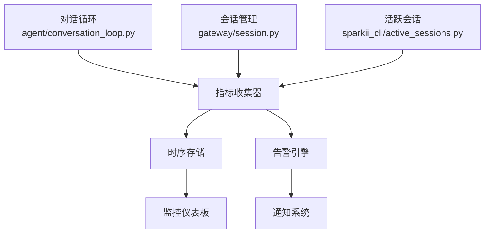
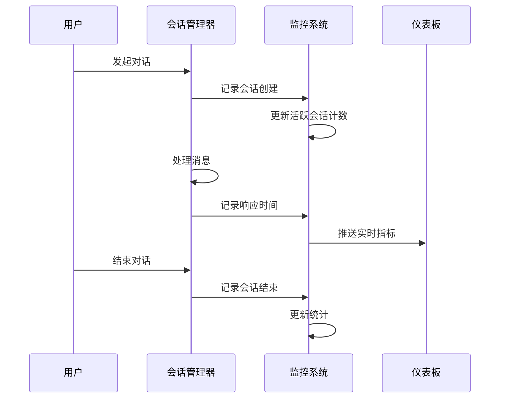

# 对话监控

<cite>
**本文引用的文件**
- [agent/conversation_loop.py](file://agent/conversation_loop.py)
- [gateway/session.py](file://gateway/session.py)
- [sparkii_cli/active_sessions.py](file://sparkii_cli/active_sessions.py)
- [agent/monitoring/](file://agent/monitoring/)
</cite>

## 目录
1. [简介](#简介)
2. [监控架构](#监控架构)
3. [活跃会话追踪](#活跃会话追踪)
4. [对话性能指标](#对话性能指标)
5. [异常检测与告警](#异常检测与告警)
6. [资源使用监控](#资源使用监控)
7. [故障排查指南](#故障排查指南)

## 简介
对话监控系统提供 AI 代理会话的实时可观测性，涵盖当前活跃会话数量、会话状态分布、消息吞吐量、延迟等关键指标。监控贯穿对话生命周期的各个阶段，包括会话创建、消息收发、工具调用、响应生成、会话结束等阶段的耗时统计。对话监控指标包括平均响应时间、P95/P99 延迟、吞吐率等。提供对话质量监控，包括用户确认率、回复准确性、对话中断分析、会话资源使用量、内存占用、CPU 使用率、数据库连接数等。支持异常检测和告警机制，帮助运维人员及时发现和解决对话服务中的问题。

## 监控架构



**图示来源**
- [agent/conversation_loop.py:1-50](file://agent/conversation_loop.py#L1-L50)
- [gateway/session.py:1-50](file://gateway/session.py#L1-L50)
- [sparkii_cli/active_sessions.py:1-30](file://sparkii_cli/active_sessions.py#L1-L30)

## 活跃会话追踪
活跃会话追踪模块实时监控系统中的所有对话会话：



关键追踪维度：
- **会话状态分布**: 活跃、等待、处理中、已完成
- **并发会话数**: 同时进行的会话数量
- **会话持续时间**: 从创建到结束的时长
- **消息密度**: 单位时间内的消息数量

**章节来源**
- [sparkii_cli/active_sessions.py:1-100](file://sparkii_cli/active_sessions.py#L1-L100)
- [gateway/session.py:100-200](file://gateway/session.py#L100-L200)

## 对话性能指标
核心性能指标采集和计算：

| 指标名称 | 计算方式 | 告警阈值 |
|---------|---------|---------|
| 平均响应时间 | 总响应时间 / 请求数 | > 5s |
| P95 延迟 | 第95百分位延迟 | > 10s |
| P99 延迟 | 第99百分位延迟 | > 30s |
| 吞吐率 | 成功请求数 / 时间窗口 | < 1 req/s |
| 错误率 | 错误数 / 总请求数 | > 5% |
| 工具调用成功率 | 成功调用数 / 总调用数 | < 90% |

```python
# 性能指标计算示例
class ConversationMetrics:
    def __init__(self):
        self.response_times = []
        self.error_count = 0
        self.total_requests = 0

    def record_response(self, duration: float, is_error: bool = False):
        self.response_times.append(duration)
        self.total_requests += 1
        if is_error:
            self.error_count += 1

    def get_p95_latency(self) -> float:
        sorted_times = sorted(self.response_times)
        idx = int(len(sorted_times) * 0.95)
        return sorted_times[idx] if sorted_times else 0.0
```

**章节来源**
- [agent/conversation_loop.py:200-400](file://agent/conversation_loop.py#L200-L400)

## 异常检测与告警
对话监控系统支持多维度异常检测：

### 告警规则
- **响应超时**: 单次响应超过配置阈值
- **错误率飙升**: 短时间内错误率突增
- **会话泄漏**: 长时间无活动的僵尸会话
- **资源耗尽**: 内存或连接池接近上限

### 告警通知
- 日志记录：所有告警写入 agent.log
- Webhook 通知：支持自定义 Webhook 推送
- Dashboard 展示：实时告警面板

**章节来源**
- [agent/monitoring/](file://agent/monitoring/)

## 资源使用监控
实时监控会话相关的资源使用情况：
- **内存占用**: 每个会话的内存使用量
- **CPU 使用率**: 对话处理的 CPU 消耗
- **数据库连接数**: 活跃数据库连接统计
- **API 调用频率**: 上游 AI 提供商的调用频率和配额

## 故障排查指南
- **指标缺失**: 检查监控组件是否正常运行
- **告警误报**: 调整告警阈值和检测窗口
- **性能下降**: 使用监控数据定位瓶颈环节
- **会话泄漏**: 检查会话超时配置和清理机制
