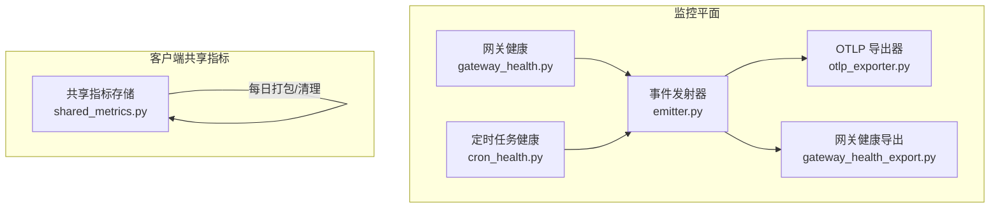
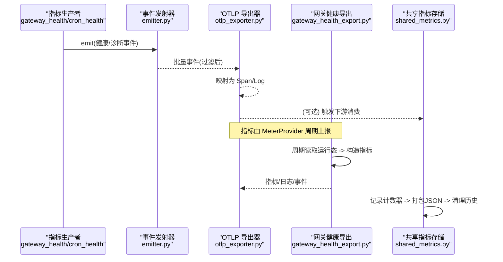
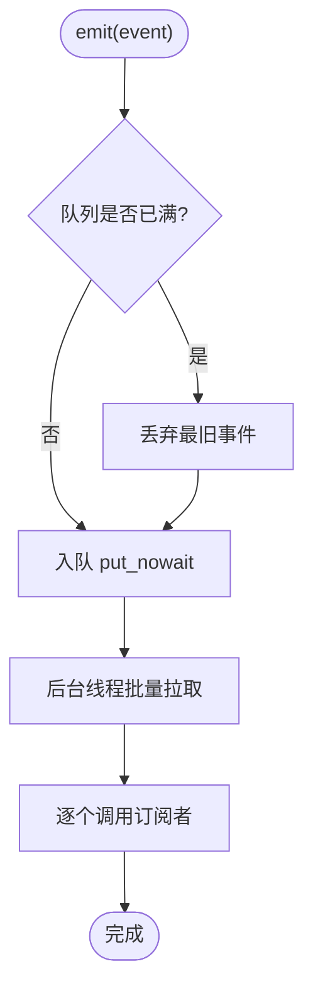
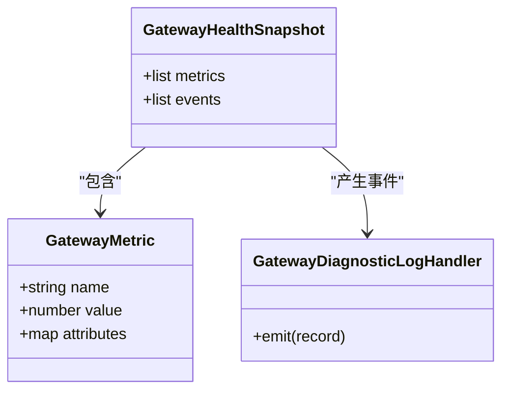
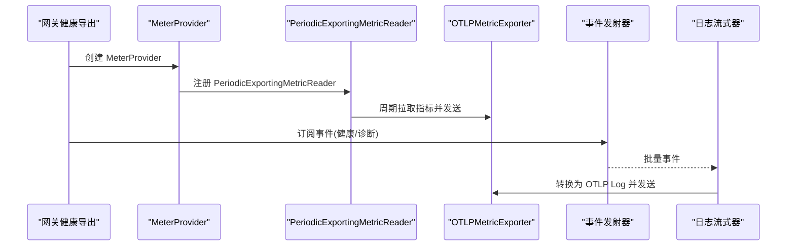
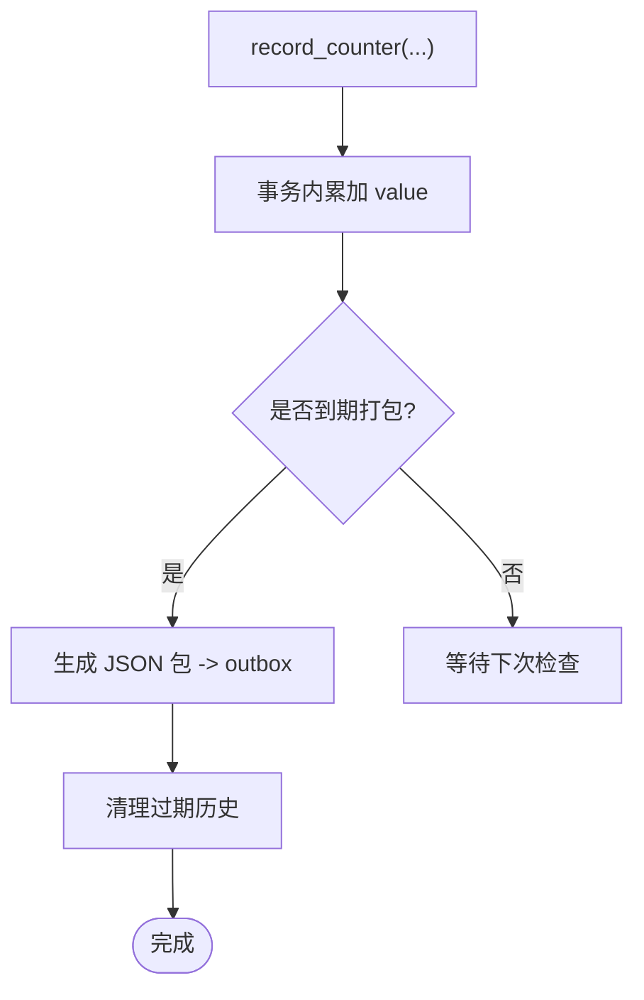
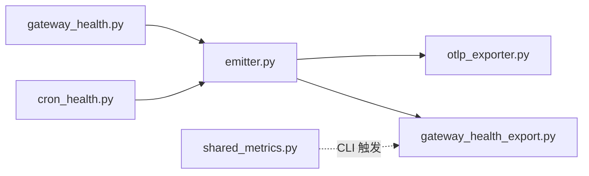

# 指标收集

<cite>
**本文引用的文件**
- [agent/monitoring/__init__.py](file://agent/monitoring/__init__.py)
- [agent/monitoring/emitter.py](file://agent/monitoring/emitter.py)
- [agent/monitoring/events.py](file://agent/monitoring/events.py)
- [agent/monitoring/gateway_health.py](file://agent/monitoring/gateway_health.py)
- [agent/monitoring/cron_health.py](file://agent/monitoring/cron_health.py)
- [agent/monitoring/gateway_health_export.py](file://agent/monitoring/gateway_health_export.py)
- [agent/monitoring/otlp_exporter.py](file://agent/monitoring/otlp_exporter.py)
- [sparkii_cli/observability/shared_metrics.py](file://sparkii_cli/observability/shared_metrics.py)
- [scripts/smoke_nemo_relay_shared_metrics.py](file://scripts/smoke_nemo_relay_shared_metrics.py)
</cite>

## 目录
1. [简介](#简介)
2. [项目结构](#项目结构)
3. [核心组件](#核心组件)
4. [架构总览](#架构总览)
5. [详细组件分析](#详细组件分析)
6. [依赖关系分析](#依赖关系分析)
7. [性能考虑](#性能考虑)
8. [故障排除指南](#故障排除指南)
9. [结论](#结论)
10. [附录](#附录)

## 简介
本文件面向“指标收集系统”，围绕网关健康、定时任务执行、以及客户端共享指标三大面，说明支持的指标类型、采集器配置、存储方案、可视化与告警建议、性能调优与部署示例。该系统以“热路径零阻塞”为核心设计：所有监控事件通过无阻塞队列分发到 OTLP 导出器或本地聚合器，确保对业务主流程零影响；同时提供内容脱敏与白名单约束，避免敏感信息外泄。

## 项目结构
- 监控平面（agent/monitoring）
  - 事件发射器：emitter.py 提供进程级单例的无阻塞事件总线
  - 事件模型：events.py 定义网关健康与诊断事件
  - 指标生产者：gateway_health.py、cron_health.py 生成网关与定时任务的指标快照
  - 导出器：otlp_exporter.py（追踪/日志）、gateway_health_export.py（指标+日志+快照线程）
- 客户端共享指标（sparkii_cli/observability/shared_metrics.py）
  - 使用 SQLite 持久化计数器，按日打包为 JSON 包并输出到 outbox，支持保留清理
- 端到端验证（scripts/smoke_nemo_relay_shared_metrics.py）
  - 模拟一次完整调用链路，校验共享指标写入与打包结果

图表来源
- [agent/monitoring/emitter.py:36-117](file://agent/monitoring/emitter.py#L36-L117)
- [agent/monitoring/gateway_health.py:210-291](file://agent/monitoring/gateway_health.py#L210-L291)
- [agent/monitoring/cron_health.py:148-192](file://agent/monitoring/cron_health.py#L148-L192)
- [agent/monitoring/otlp_exporter.py:166-203](file://agent/monitoring/otlp_exporter.py#L166-L203)
- [agent/monitoring/gateway_health_export.py:417-468](file://agent/monitoring/gateway_health_export.py#L417-L468)
- [sparkii_cli/observability/shared_metrics.py:47-221](file://sparkii_cli/observability/shared_metrics.py#L47-L221)

章节来源
- [agent/monitoring/__init__.py:1-30](file://agent/monitoring/__init__.py#L1-L30)
- [agent/monitoring/emitter.py:1-212](file://agent/monitoring/emitter.py#L1-L212)
- [agent/monitoring/gateway_health_export.py:1-644](file://agent/monitoring/gateway_health_export.py#L1-L644)
- [sparkii_cli/observability/shared_metrics.py:1-719](file://sparkii_cli/observability/shared_metrics.py#L1-L719)

## 核心组件
- 事件发射器（MonitoringEmitter）
  - 进程级单例，维护固定容量环形队列与后台分派线程
  - emit() 保证微秒级返回、不阻塞、不抛异常；满队时丢弃最旧事件
  - 支持批量拉取（_DRAIN_BATCH=256），订阅者失败隔离
- 网关健康指标与事件
  - 从运行时状态构建指标：up、state、active_agents、busy、drainable、restart_requested、platform.up/degraded 等
  - 生命周期与平台状态变更事件：gateway.lifecycle、platform.state_change、platform.fatal 等
- 定时任务健康指标与事件
  - 心跳年龄、最近成功年龄、catch_up_occurrences、enabled/running/overdue 计数
  - 执行事件：status、job_key、source、duration_ms、delivery_outcome、error_class
- OTLP 导出器
  - 将事件映射为 OTel Span/Log，并通过 BatchSpanProcessor/BatchLogRecordProcessor 批量发送
  - 支持 headers_env 动态注入认证头，endpoint 可自动推导 metrics/logs/traces 子路径
- 网关健康导出运行时
  - 启动指标提供者（MeterProvider + PeriodicExportingMetricReader）周期性上报指标
  - 启动诊断日志流式器，将 gateway_diagnostic 事件转为 OTLP Log
  - 启动快照线程，定期读取运行态并发出事件
- 客户端共享指标
  - 使用 SQLite 持久化计数器，按 UTC 日维度聚合
  - 每日打包为 JSON 包至 outbox，支持过期历史清理（默认 30 天）

章节来源
- [agent/monitoring/emitter.py:36-117](file://agent/monitoring/emitter.py#L36-L117)
- [agent/monitoring/gateway_health.py:210-291](file://agent/monitoring/gateway_health.py#L210-L291)
- [agent/monitoring/cron_health.py:148-192](file://agent/monitoring/cron_health.py#L148-L192)
- [agent/monitoring/otlp_exporter.py:107-133](file://agent/monitoring/otlp_exporter.py#L107-L133)
- [agent/monitoring/gateway_health_export.py:417-468](file://agent/monitoring/gateway_health_export.py#L417-L468)
- [sparkii_cli/observability/shared_metrics.py:47-221](file://sparkii_cli/observability/shared_metrics.py#L47-L221)

## 架构总览
下图展示了从指标生产、事件发射、到 OTLP 导出的整体数据流，以及客户端共享指标的本地持久化与打包流程。

图表来源
- [agent/monitoring/gateway_health.py:210-291](file://agent/monitoring/gateway_health.py#L210-L291)
- [agent/monitoring/cron_health.py:148-192](file://agent/monitoring/cron_health.py#L148-L192)
- [agent/monitoring/emitter.py:91-117](file://agent/monitoring/emitter.py#L91-L117)
- [agent/monitoring/otlp_exporter.py:166-203](file://agent/monitoring/otlp_exporter.py#L166-L203)
- [agent/monitoring/gateway_health_export.py:417-468](file://agent/monitoring/gateway_health_export.py#L417-L468)
- [sparkii_cli/observability/shared_metrics.py:199-221](file://sparkii_cli/observability/shared_metrics.py#L199-L221)

## 详细组件分析

### 事件发射器（MonitoringEmitter）
- 关键特性
  - 非阻塞入队：put_nowait，满队丢弃最旧事件，保障热路径
  - 后台线程批量拉取并 fan-out 给订阅者，单个订阅者异常不影响其他
  - 支持 flush/close/stats 等运维能力
- 复杂度
  - 入队 O(1)，批量拉取 O(k)（k 为批次大小）
  - 内存上限受队列最大深度限制
- 优化点
  - 调整 _MAX_QUEUE 与 _DRAIN_BATCH 平衡吞吐与延迟
  - 订阅者实现幂等与快速失败，避免拖慢分发线程

图表来源
- [agent/monitoring/emitter.py:53-77](file://agent/monitoring/emitter.py#L53-L77)
- [agent/monitoring/emitter.py:91-117](file://agent/monitoring/emitter.py#L91-L117)

章节来源
- [agent/monitoring/emitter.py:36-117](file://agent/monitoring/emitter.py#L36-L117)

### 网关健康指标与事件
- 指标集合
  - sparkii.gateway.up/state/active_agents/busy/drainable/restart_requested
  - sparkii.platform.up/degraded（含 platform、state、error_code 标签）
  - sparkii.gateway.background_work/background_delegations
- 事件集合
  - gateway.lifecycle、gateway.exit、platform.state_change、platform.fatal
- 数据源
  - 运行时状态、平台列表、后台工作计数、调度器心跳/成功率等
- 安全与脱敏
  - 资源属性白名单、实例 ID 哈希化、错误分类与消息长度限制

图表来源
- [agent/monitoring/gateway_health.py:20-31](file://agent/monitoring/gateway_health.py#L20-L31)
- [agent/monitoring/gateway_health.py:210-291](file://agent/monitoring/gateway_health.py#L210-L291)
- [agent/monitoring/gateway_health.py:427-459](file://agent/monitoring/gateway_health.py#L427-L459)

章节来源
- [agent/monitoring/gateway_health.py:210-291](file://agent/monitoring/gateway_health.py#L210-L291)
- [agent/monitoring/gateway_health.py:427-459](file://agent/monitoring/gateway_health.py#L427-L459)

### 定时任务健康指标与事件
- 指标集合
  - sparkii.cron.scheduler.heartbeat_age_seconds
  - sparkii.cron.scheduler.last_success_age_seconds
  - sparkii.cron.scheduler.catch_up_occurrences
  - sparkii.cron.jobs.enabled/running/overdue
- 事件集合
  - cron_execution：status、job_key、source、duration_ms、delivery_outcome、error_class
- 容错
  - 各指标读取失败均降级为日志调试，不影响主流程

章节来源
- [agent/monitoring/cron_health.py:148-192](file://agent/monitoring/cron_health.py#L148-L192)
- [agent/monitoring/cron_health.py:90-111](file://agent/monitoring/cron_health.py#L90-L111)

### OTLP 导出器与网关健康导出
- OTLP 导出器
  - 将事件映射为 Span，attributes 仅包含白名单字段，文本值经脱敏
  - 支持 headers_env 从环境变量解析，endpoint 自动推导 /v1/metrics 与 /v1/logs
- 网关健康导出
  - 启动 MeterProvider + PeriodicExportingMetricReader 周期上报指标
  - 启动日志流式器，将 gateway_diagnostic 事件转为 OTLP Log
  - 启动快照线程，定期读取运行态并发出事件
  - 提供 shutdown 钩子，确保优雅关闭

图表来源
- [agent/monitoring/gateway_health_export.py:417-468](file://agent/monitoring/gateway_health_export.py#L417-L468)
- [agent/monitoring/gateway_health_export.py:485-556](file://agent/monitoring/gateway_health_export.py#L485-L556)
- [agent/monitoring/otlp_exporter.py:166-203](file://agent/monitoring/otlp_exporter.py#L166-L203)

章节来源
- [agent/monitoring/otlp_exporter.py:107-133](file://agent/monitoring/otlp_exporter.py#L107-L133)
- [agent/monitoring/gateway_health_export.py:417-468](file://agent/monitoring/gateway_health_export.py#L417-L468)
- [agent/monitoring/gateway_health_export.py:485-556](file://agent/monitoring/gateway_health_export.py#L485-L556)

### 客户端共享指标（SQLite 聚合与打包）
- 功能
  - 记录允许清单内的计数器（如 sparkii.model_route.count、sparkii.tool_call.count 等）
  - 按 UTC 日维度聚合，生成不可变 JSON 包至 outbox
  - 支持过期历史清理（默认 30 天）
- 数据模型
  - counter_aggregates：period_start、metric_name、resource、dimensions_json、value、packaged_value
  - package_outbox：package_id、payload_json、created_at、exported_at
- 安全
  - 资源与维度白名单校验，禁止敏感字段泄露

图表来源
- [sparkii_cli/observability/shared_metrics.py:120-197](file://sparkii_cli/observability/shared_metrics.py#L120-L197)
- [sparkii_cli/observability/shared_metrics.py:489-606](file://sparkii_cli/observability/shared_metrics.py#L489-L606)
- [sparkii_cli/observability/shared_metrics.py:657-719](file://sparkii_cli/observability/shared_metrics.py#L657-L719)

章节来源
- [sparkii_cli/observability/shared_metrics.py:47-221](file://sparkii_cli/observability/shared_metrics.py#L47-L221)
- [sparkii_cli/observability/shared_metrics.py:489-606](file://sparkii_cli/observability/shared_metrics.py#L489-L606)
- [sparkii_cli/observability/shared_metrics.py:657-719](file://sparkii_cli/observability/shared_metrics.py#L657-L719)

## 依赖关系分析
- 模块耦合
  - emitter 作为中心枢纽，gateway_health/cron_health 仅依赖其 emit API
  - otlp_exporter 与 gateway_health_export 通过订阅机制解耦
  - shared_metrics 独立于监控平面，通过 CLI 侧流程触发
- 外部依赖
  - OpenTelemetry SDK（可选，按需懒加载安装）
  - SQLite（本地持久化）
- 循环依赖规避
  - 通过延迟导入与函数内 import 避免循环引用

图表来源
- [agent/monitoring/gateway_health.py:210-291](file://agent/monitoring/gateway_health.py#L210-L291)
- [agent/monitoring/cron_health.py:148-192](file://agent/monitoring/cron_health.py#L148-L192)
- [agent/monitoring/emitter.py:36-117](file://agent/monitoring/emitter.py#L36-L117)
- [agent/monitoring/otlp_exporter.py:166-203](file://agent/monitoring/otlp_exporter.py#L166-L203)
- [agent/monitoring/gateway_health_export.py:417-468](file://agent/monitoring/gateway_health_export.py#L417-L468)
- [sparkii_cli/observability/shared_metrics.py:199-221](file://sparkii_cli/observability/shared_metrics.py#L199-L221)

章节来源
- [agent/monitoring/emitter.py:36-117](file://agent/monitoring/emitter.py#L36-L117)
- [agent/monitoring/gateway_health_export.py:417-468](file://agent/monitoring/gateway_health_export.py#L417-L468)
- [sparkii_cli/observability/shared_metrics.py:199-221](file://sparkii_cli/observability/shared_metrics.py#L199-L221)

## 性能考虑
- 采样与批处理
  - 事件发射器：队列深度 _MAX_QUEUE=10000，批次 _DRAIN_BATCH=256，适合高吞吐场景
  - OTLP 导出：BatchSpanProcessor/BatchLogRecordProcessor 自动批处理，减少网络开销
- 内存控制
  - 固定容量队列防止内存无限增长；订阅者异常隔离避免堆积
  - 共享指标 SQLite 使用 busy_timeout 与原子写入，降低锁竞争
- 网络与 I/O
  - OTLP endpoint 自动推导 /v1/metrics 与 /v1/logs，避免重复配置
  - headers_env 从环境变量读取，避免在配置中硬编码密钥
- 建议
  - 在高负载环境适当增大 _MAX_QUEUE 与 _DRAIN_BATCH
  - 合理设置 export_interval_seconds（默认 60s），权衡实时性与带宽
  - 对共享指标启用每日打包与 30 天清理，避免磁盘膨胀

章节来源
- [agent/monitoring/emitter.py:32-34](file://agent/monitoring/emitter.py#L32-L34)
- [agent/monitoring/gateway_health_export.py:417-468](file://agent/monitoring/gateway_health_export.py#L417-L468)
- [sparkii_cli/observability/shared_metrics.py:266-282](file://sparkii_cli/observability/shared_metrics.py#L266-L282)
- [sparkii_cli/observability/shared_metrics.py:657-719](file://sparkii_cli/observability/shared_metrics.py#L657-L719)

## 故障排除指南
- OTLP 未安装或不可用
  - 现象：启动时提示缺少 OTLP SDK
  - 处理：安装可选依赖 sparkii-agent[otlp]；在非交互模式下会尝试懒安装
- 指标未上报
  - 检查 monitoring.export.otlp.endpoint 是否配置
  - 确认 is_enabled(config) 返回 True
  - 查看 OTLP 导出器的日志与 stats
- 事件丢失
  - 队列满时会丢弃最旧事件，关注 dropped 计数
  - 调整 _MAX_QUEUE 或提升下游处理能力
- 共享指标未打包
  - 检查 outbox 目录权限与空间
  - 手动触发 create_and_export_package() 进行验证
- 参考脚本
  - 使用 smoke 脚本验证端到端链路，包括模型调用、工具调用、技能生命周期等指标

章节来源
- [agent/monitoring/otlp_exporter.py:37-80](file://agent/monitoring/otlp_exporter.py#L37-L80)
- [agent/monitoring/otlp_exporter.py:218-230](file://agent/monitoring/otlp_exporter.py#L218-L230)
- [agent/monitoring/emitter.py:152-158](file://agent/monitoring/emitter.py#L152-L158)
- [sparkii_cli/observability/shared_metrics.py:199-221](file://sparkii_cli/observability/shared_metrics.py#L199-L221)
- [scripts/smoke_nemo_relay_shared_metrics.py:258-274](file://scripts/smoke_nemo_relay_shared_metrics.py#L258-L274)

## 结论
该指标收集系统以“热路径零阻塞”和“内容脱敏”为核心，覆盖网关健康、定时任务与客户端共享指标三大面。通过事件发射器与 OTLP 导出器的解耦设计，既保证了稳定性，又提供了灵活的集成能力。配合 SQLite 本地聚合与打包，可在离线或受限环境中可靠地积累与导出指标。建议在大规模部署中结合采样率、批处理与保留策略进行调优，并通过 Grafana 与告警规则实现可视化与主动运维。

## 附录

### 支持的指标类型与定义
- 系统性能指标
  - sparkii.gateway.up/state/active_agents/busy/drainable/restart_requested
  - sparkii.platform.up/degraded（含 platform、state、error_code）
  - sparkii.gateway.background_work/background_delegations
- 应用业务指标
  - sparkii.cron.scheduler.*（心跳、成功时间、catch-up）
  - sparkii.cron.jobs.*（enabled、running、overdue）
  - 客户端共享指标：sparkii.model_route.count、sparkii.tool_call.count、sparkii.task_run.started/finished、sparkii.skill.lifecycle/load/count、sparkii.client.active
- 自定义业务指标
  - 通过扩展事件模型与 OTLP 导出器的事件过滤器，可将新事件映射为 Span/Log
  - 共享指标可通过新增计数器名称与维度白名单扩展

章节来源
- [agent/monitoring/gateway_health.py:210-291](file://agent/monitoring/gateway_health.py#L210-L291)
- [agent/monitoring/cron_health.py:148-192](file://agent/monitoring/cron_health.py#L148-L192)
- [scripts/smoke_nemo_relay_shared_metrics.py:277-319](file://scripts/smoke_nemo_relay_shared_metrics.py#L277-L319)

### 指标采集器配置
- Prometheus 导出器
  - 当前代码未直接暴露 Prometheus 端点；可通过 OTLP Collector 将 OTLP 指标转换为 Prometheus 格式
- 自定义采集器
  - 通过 emitter.subscribe(callback) 接入自定义消费者，实现自定义导出逻辑
- 第三方监控系统集成
  - OTLP 兼容后端（如 DataDog、OpenTelemetry Collector）可直接接收 Span/Log/Metrics
  - headers_env 支持从环境变量注入认证头

章节来源
- [agent/monitoring/otlp_exporter.py:107-133](file://agent/monitoring/otlp_exporter.py#L107-L133)
- [agent/monitoring/gateway_health_export.py:417-468](file://agent/monitoring/gateway_health_export.py#L417-L468)
- [agent/monitoring/emitter.py:118-130](file://agent/monitoring/emitter.py#L118-L130)

### 指标存储方案
- 时序数据库选择
  - 推荐 OTLP 兼容的时序后端（如 OpenTelemetry Collector + 后端）
- 数据保留策略
  - 共享指标：outbox 与 SQLite 历史默认保留 30 天，可调整清理阈值
- 查询优化
  - 使用 OTLP 后端的索引与聚合能力；对高频指标打标签时注意基数控制

章节来源
- [sparkii_cli/observability/shared_metrics.py:657-719](file://sparkii_cli/observability/shared_metrics.py#L657-L719)

### 指标可视化与告警
- Grafana 仪表板
  - 通过 OTLP Collector 将指标接入 Prometheus/Loki/Tempo，再在 Grafana 中构建看板
- 自定义图表
  - 基于 sparkii.gateway.* 与 sparkii.cron.* 指标构建服务健康视图
- 告警规则
  - 针对 gateway.down、platform.degraded、cron.overdue 等指标设置阈值告警

[本节为概念性指导，不直接分析具体文件]

### 性能调优建议
- 采样率配置
  - OTLP 导出器使用批量处理器，无需额外采样；如需降采样可在 Collector 层配置
- 批量写入优化
  - 调整 _DRAIN_BATCH 与 OTLP 批处理参数，平衡延迟与吞吐
- 内存使用控制
  - 调整 _MAX_QUEUE 与订阅者消费速率，避免队列积压

章节来源
- [agent/monitoring/emitter.py:32-34](file://agent/monitoring/emitter.py#L32-L34)
- [agent/monitoring/gateway_health_export.py:417-468](file://agent/monitoring/gateway_health_export.py#L417-L468)

### 实际部署示例
- 最小化配置
  - 配置 monitoring.export.otlp.endpoint 与 headers_env
  - 启用 gateway_health_export.metrics_enabled 与 diagnostic_events_enabled
- 端到端验证
  - 使用 smoke 脚本模拟一次完整调用，校验共享指标写入与打包

章节来源
- [agent/monitoring/gateway_health_export.py:587-637](file://agent/monitoring/gateway_health_export.py#L587-L637)
- [scripts/smoke_nemo_relay_shared_metrics.py:258-274](file://scripts/smoke_nemo_relay_shared_metrics.py#L258-L274)