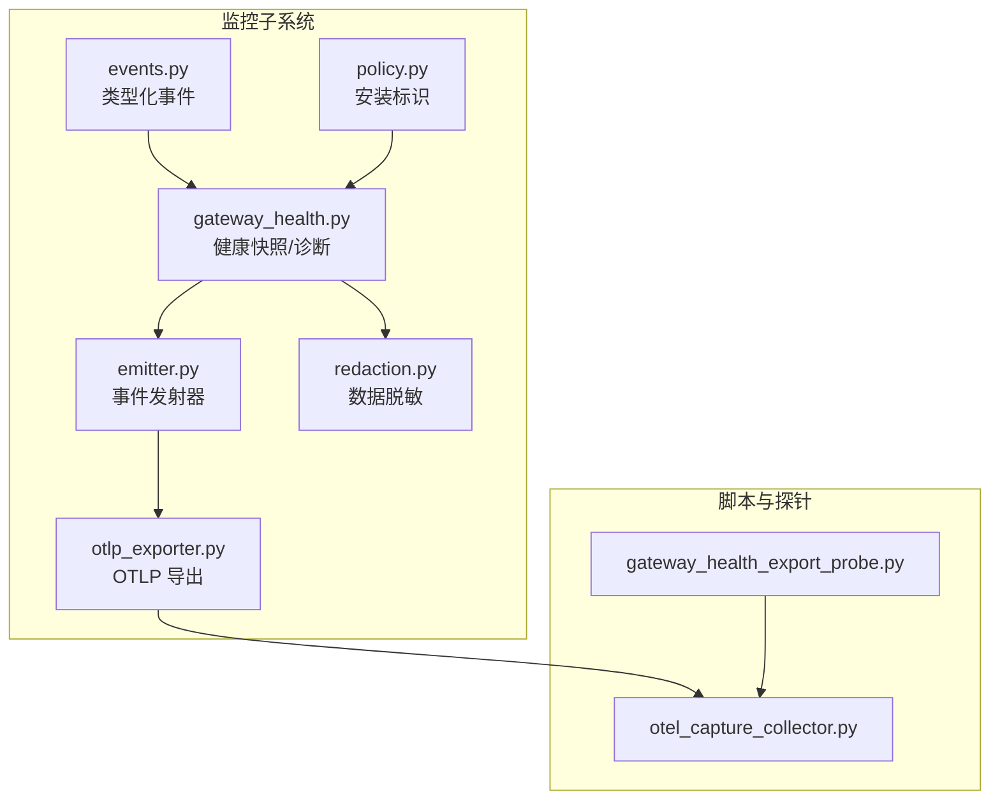
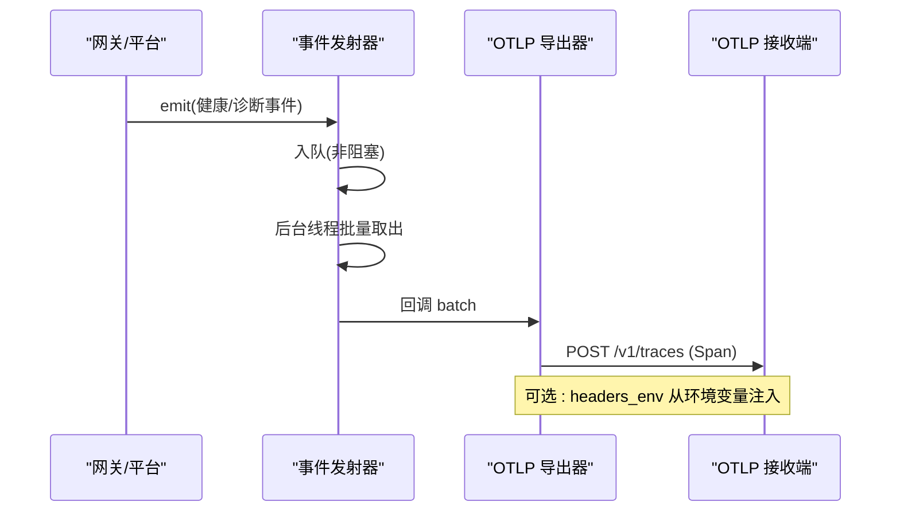
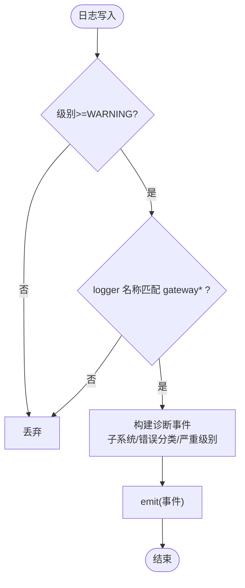
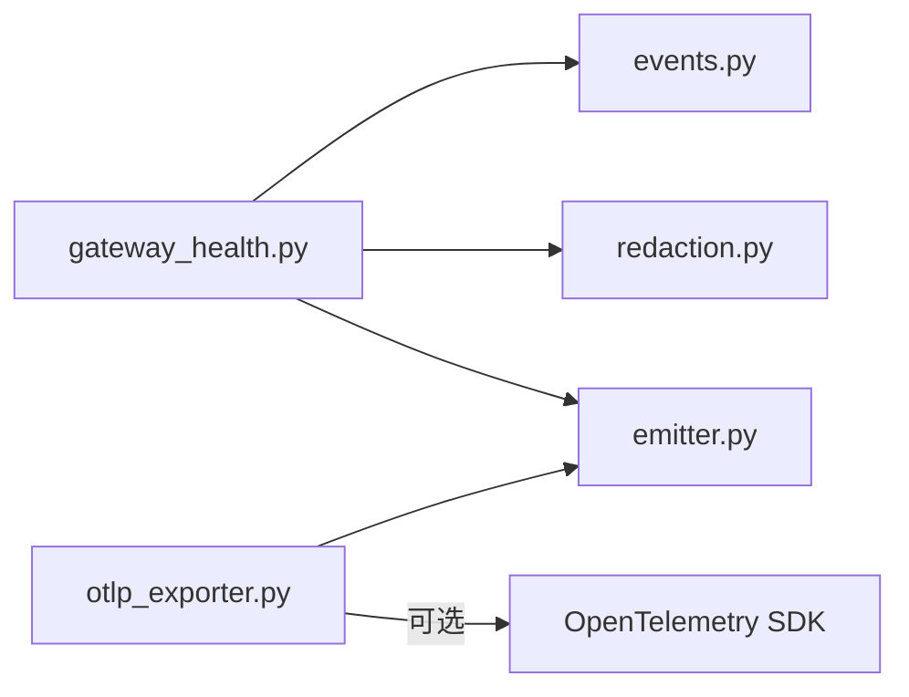

# 监控审计

<cite>
**本文引用的文件**
- [agent/monitoring/__init__.py](file://agent/monitoring/__init__.py)
- [agent/monitoring/emitter.py](file://agent/monitoring/emitter.py)
- [agent/monitoring/events.py](file://agent/monitoring/events.py)
- [agent/monitoring/gateway_health.py](file://agent/monitoring/gateway_health.py)
- [agent/monitoring/otlp_exporter.py](file://agent/monitoring/otlp_exporter.py)
- [agent/monitoring/policy.py](file://agent/monitoring/policy.py)
- [agent/monitoring/redaction.py](file://agent/monitoring/redaction.py)
- [scripts/observability/gateway_health_export_probe.py](file://scripts/observability/gateway_health_export_probe.py)
- [scripts/observability/otel_capture_collector.py](file://scripts/observability/otel_capture_collector.py)
</cite>

## 目录
1. [简介](#简介)
2. [项目结构](#项目结构)
3. [核心组件](#核心组件)
4. [架构总览](#架构总览)
5. [详细组件分析](#详细组件分析)
6. [依赖关系分析](#依赖关系分析)
7. [性能考虑](#性能考虑)
8. [故障排除指南](#故障排除指南)
9. [结论](#结论)
10. [附录](#附录)

## 简介
本指南面向监控与审计能力的配置与使用，聚焦以下目标：
- 指标收集机制：系统指标、应用指标、业务指标的采集方法（在本仓库中体现为网关健康指标与平台状态指标）。
- 日志聚合与分析：结构化事件、日志级别过滤、实时流式导出。
- 告警配置：阈值设置、告警规则与通知渠道（通过 OTLP 将事件/指标推送到外部可观测性后端进行告警）。
- 审计日志记录：用户操作审计、系统事件审计与合规报告生成（通过内容脱敏与受限字段导出实现安全审计面）。
- 监控仪表板：自定义图表、布局与可视化（在外部 OTLP 接收端/可视化系统中完成）。
- 性能监控与优化建议：识别瓶颈与改进点。
- 故障排除：常见配置与性能问题定位。

## 项目结构
监控子系统位于 agent/monitoring，提供“热路径无阻塞”的事件发射器、类型化事件定义、网关健康快照构建、OTLP 导出以及数据脱敏策略；配套脚本用于本地冒烟测试与 OTLP 捕获。

图示来源
- [agent/monitoring/emitter.py:1-212](file://agent/monitoring/emitter.py#L1-L212)
- [agent/monitoring/events.py:1-87](file://agent/monitoring/events.py#L1-L87)
- [agent/monitoring/gateway_health.py:1-470](file://agent/monitoring/gateway_health.py#L1-L470)
- [agent/monitoring/otlp_exporter.py:1-271](file://agent/monitoring/otlp_exporter.py#L1-L271)
- [agent/monitoring/policy.py:1-58](file://agent/monitoring/policy.py#L1-L58)
- [agent/monitoring/redaction.py:1-72](file://agent/monitoring/redaction.py#L1-L72)
- [scripts/observability/gateway_health_export_probe.py:1-93](file://scripts/observability/gateway_health_export_probe.py#L1-L93)
- [scripts/observability/otel_capture_collector.py:1-60](file://scripts/observability/otel_capture_collector.py#L1-L60)

章节来源
- [agent/monitoring/__init__.py:1-30](file://agent/monitoring/__init__.py#L1-L30)

## 核心组件
- 事件发射器（MonitoringEmitter）：进程内单例，基于队列+后台线程的“发后即忘”模式，保证热路径不阻塞、不抛异常、不持久化。支持批量分发、订阅者隔离、统计与关闭。
- 类型化事件（GatewayHealthEvent/GatewayDiagnosticEvent/CronExecutionEvent）：仅包含运行态与诊断所需的非敏感字段，统一 to_dict 输出。
- 网关健康与诊断（gateway_health）：从运行时状态构建指标与健康快照，分类错误码，生成生命周期事件与平台状态变更事件；提供日志处理器桥接警告/错误日志到监控面。
- OTLP 导出（otlp_exporter）：将事件映射为 OpenTelemetry Span，按批发送到配置的 OTLP 端点；支持可选 SDK 懒加载与环境变量头解析。
- 数据脱敏（redaction）：强制对出口字符串进行敏感信息与 PII 清洗，失败时关闭放行（不发原始数据）。
- 安装标识（policy）：生成并持久化实例级 install_id，作为 service.instance.id 稳定标识。

章节来源
- [agent/monitoring/emitter.py:1-212](file://agent/monitoring/emitter.py#L1-L212)
- [agent/monitoring/events.py:1-87](file://agent/monitoring/events.py#L1-L87)
- [agent/monitoring/gateway_health.py:1-470](file://agent/monitoring/gateway_health.py#L1-L470)
- [agent/monitoring/otlp_exporter.py:1-271](file://agent/monitoring/otlp_exporter.py#L1-L271)
- [agent/monitoring/redaction.py:1-72](file://agent/monitoring/redaction.py#L1-L72)
- [agent/monitoring/policy.py:1-58](file://agent/monitoring/policy.py#L1-L58)

## 架构总览
监控子系统采用“生产者-发射器-消费者”解耦架构：生产者在热路径仅调用 emit()，由后台线程批量分发给订阅者（如 OTLP 导出器），确保不影响主流程。所有出口数据经过严格脱敏与白名单字段控制。

图示来源
- [agent/monitoring/emitter.py:52-116](file://agent/monitoring/emitter.py#L52-L116)
- [agent/monitoring/otlp_exporter.py:166-203](file://agent/monitoring/otlp_exporter.py#L166-L203)
- [scripts/observability/otel_capture_collector.py:18-35](file://scripts/observability/otel_capture_collector.py#L18-L35)

## 详细组件分析

### 指标收集机制
- 系统指标：网关是否存活、活跃代理数、忙闲状态、可排空标志、重启请求标志等。
- 应用指标：各平台 up/degraded 状态及错误分类（认证失败、限流、超时、网络错误、配置无效、启动失败、致命等）。
- 业务指标：当前仓库未暴露业务层指标；如需扩展，可在现有事件/指标模型基础上增加字段并通过同一发射器导出。

关键要点
- 指标以固定命名空间与属性形式输出，便于下游聚合与告警。
- 指标值与属性均经过长度限制与脱敏处理。

章节来源
- [agent/monitoring/gateway_health.py:210-291](file://agent/monitoring/gateway_health.py#L210-L291)
- [agent/monitoring/gateway_health.py:70-100](file://agent/monitoring/gateway_health.py#L70-L100)
- [agent/monitoring/gateway_health.py:230-264](file://agent/monitoring/gateway_health.py#L230-L264)

### 日志聚合与分析
- 结构化日志：通过 GatewayDiagnosticLogHandler 将 WARNING/ERROR 级别的网关日志转换为结构化诊断事件，附带子系统、错误分类、严重级别等。
- 日志级别管理：仅允许 gateway.* 子系统的警告及以上级别进入监控面，避免噪声。
- 实时日志流：事件经发射器批量后由 OTLP 导出器实时发送，无需落盘。

图示来源
- [agent/monitoring/gateway_health.py:427-459](file://agent/monitoring/gateway_health.py#L427-L459)
- [agent/monitoring/emitter.py:52-77](file://agent/monitoring/emitter.py#L52-L77)

章节来源
- [agent/monitoring/gateway_health.py:427-459](file://agent/monitoring/gateway_health.py#L427-L459)

### 告警配置系统
- 阈值设置：在外部可观测性后端（如 OTLP Collector/厂商平台）基于 sparkii.gateway.busy、sparkii.platform.degraded 等指标设定阈值。
- 告警规则：利用事件中的 error_class、severity、platform.state 等字段建立规则（例如 platform.fatal -> 立即告警）。
- 通知渠道：由外部系统负责邮件、短信、IM 等通知；本模块仅负责将标准化事件/指标送达 OTLP 端点。

章节来源
- [agent/monitoring/gateway_health.py:230-291](file://agent/monitoring/gateway_health.py#L230-L291)
- [agent/monitoring/otlp_exporter.py:136-178](file://agent/monitoring/otlp_exporter.py#L136-L178)

### 审计日志记录
- 用户操作审计：本监控面不包含用户消息或工具调用细节；如需审计，应在其他平面实现并通过独立通道导出。
- 系统事件审计：网关生命周期、平台状态变更、错误分类事件可作为系统审计基础。
- 合规报告：借助 install_id、service.version、supervision_mode 等属性，结合外部存储与报表能力生成合规报告。

章节来源
- [agent/monitoring/events.py:19-80](file://agent/monitoring/events.py#L19-L80)
- [agent/monitoring/policy.py:18-52](file://agent/monitoring/policy.py#L18-L52)

### 监控仪表板配置
- 自定义图表：在 OTLP 接收端/可视化系统中创建仪表盘，展示网关存活、活跃代理、平台健康、错误分类趋势等。
- 布局与可视化：按环境/服务/平台维度分组，结合时间窗口与阈值线呈现。
- 数据来源：指标来自 sparkii.* 命名空间，事件通过 Span attributes 携带。

章节来源
- [agent/monitoring/otlp_exporter.py:136-178](file://agent/monitoring/otlp_exporter.py#L136-L178)

### 性能监控与优化建议
- 发射器队列深度与丢弃：当队列满时会丢弃最旧事件，需关注 dropped 计数与 queued 大小，必要时增大容量或提升消费速率。
- 批处理大小：默认批大小为 256，可根据吞吐调整以降低网络开销。
- 订阅者隔离：单个订阅者异常不会影响其他订阅者与热路径，便于逐步引入新导出器。
- 资源属性：合理设置 service.name、deployment.environment.name 等，有助于多环境区分与查询性能。

章节来源
- [agent/monitoring/emitter.py:32-34](file://agent/monitoring/emitter.py#L32-L34)
- [agent/monitoring/emitter.py:91-116](file://agent/monitoring/emitter.py#L91-L116)
- [agent/monitoring/otlp_exporter.py:118-133](file://agent/monitoring/otlp_exporter.py#L118-L133)

## 依赖关系分析
- 内部依赖：gateway_health 依赖 events 与 redaction；emitter 被所有生产者与订阅者共享；otlp_exporter 依赖 emitter 的订阅机制。
- 外部依赖：OpenTelemetry SDK 为可选依赖，首次使用时按需懒加载；若不可用则优雅降级。
- 循环依赖规避：通过延迟导入避免启动时的循环引用。

图示来源
- [agent/monitoring/gateway_health.py:17-18](file://agent/monitoring/gateway_health.py#L17-L18)
- [agent/monitoring/otlp_exporter.py:60-80](file://agent/monitoring/otlp_exporter.py#L60-L80)
- [agent/monitoring/otlp_exporter.py:118-133](file://agent/monitoring/otlp_exporter.py#L118-L133)

章节来源
- [agent/monitoring/otlp_exporter.py:107-133](file://agent/monitoring/otlp_exporter.py#L107-L133)

## 性能考虑
- 热路径不变式：emit() 必须微秒级返回、不阻塞、不抛异常；任何监控失败仅本地记录并丢弃。
- 内存与队列：队列最大容量有限，满时丢弃最旧事件，避免内存无限增长。
- 并发与隔离：后台线程批量分发，订阅者异常隔离，保障主流程稳定性。
- 网络与批处理：OTLP 批量发送降低网络开销；可通过外部 Collector 调优缓冲与压缩。

章节来源
- [agent/monitoring/emitter.py:1-20](file://agent/monitoring/emitter.py#L1-L20)
- [agent/monitoring/emitter.py:52-77](file://agent/monitoring/emitter.py#L52-L77)
- [agent/monitoring/emitter.py:91-116](file://agent/monitoring/emitter.py#L91-L116)

## 故障排除指南
- OTLP 不可用
  - 现象：启用 OTLP 但无法导入 SDK。
  - 处理：安装可选依赖；检查 security.allow_lazy_installs 与 TTY 提示；确认 endpoint 已配置。
  - 参考
    - [agent/monitoring/otlp_exporter.py:37-80](file://agent/monitoring/otlp_exporter.py#L37-L80)
    - [agent/monitoring/otlp_exporter.py:218-230](file://agent/monitoring/otlp_exporter.py#L218-L230)

- 队列丢弃过多
  - 现象：stats.dropped 持续增长。
  - 处理：检查订阅者消费速度；评估是否需要更高吞吐的外部 Collector；必要时调整批大小或扩容。
  - 参考
    - [agent/monitoring/emitter.py:152-158](file://agent/monitoring/emitter.py#L152-L158)

- 日志未进入监控面
  - 现象：网关日志未产生诊断事件。
  - 处理：确认日志级别≥WARNING；确认 logger 名称为 gateway.*；检查处理器是否注册。
  - 参考
    - [agent/monitoring/gateway_health.py:427-459](file://agent/monitoring/gateway_health.py#L427-L459)

- 数据未到达 OTLP 接收端
  - 现象：本地冒烟测试未收到 /v1/traces 或 /v1/metrics。
  - 处理：检查 endpoint 配置；确认 OTLP 捕获服务运行；查看请求路径与内容类型。
  - 参考
    - [scripts/observability/gateway_health_export_probe.py:20-88](file://scripts/observability/gateway_health_export_probe.py#L20-L88)
    - [scripts/observability/otel_capture_collector.py:18-35](file://scripts/observability/otel_capture_collector.py#L18-L35)

- 敏感信息泄露风险
  - 现象：导出数据包含密钥或 PII。
  - 处理：确认 redaction_for_export 生效；检查异常分支是否回退为占位符；避免绕过脱敏逻辑。
  - 参考
    - [agent/monitoring/redaction.py:43-66](file://agent/monitoring/redaction.py#L43-L66)

## 结论
本监控子系统以“热路径零影响”为核心设计，提供稳定的网关健康指标、平台状态事件与结构化诊断日志，并通过 OTLP 将标准化信号送入外部可观测性生态。配合严格的脱敏策略与实例标识，可满足运维监控、告警与合规审计的基础需求。对于业务指标与更丰富的审计能力，可在现有事件/指标模型上扩展，并保持与发射器的解耦集成。

## 附录
- 快速验证
  - 启动本地 OTLP 捕获服务，运行探针脚本，确认 /v1/traces、/v1/metrics、/v1/logs 均有请求。
  - 参考
    - [scripts/observability/otel_capture_collector.py:42-55](file://scripts/observability/otel_capture_collector.py#L42-L55)
    - [scripts/observability/gateway_health_export_probe.py:20-88](file://scripts/observability/gateway_health_export_probe.py#L20-L88)

- 配置项速查
  - monitoring.export.otlp.enabled：是否启用 OTLP 导出
  - monitoring.export.otlp.endpoint：OTLP 端点地址
  - monitoring.export.otlp.headers_env：HTTP 头部环境变量映射
  - monitoring.install_id：实例唯一标识（自动维护）
  - 参考
    - [agent/monitoring/otlp_exporter.py:101-115](file://agent/monitoring/otlp_exporter.py#L101-L115)
    - [agent/monitoring/policy.py:18-52](file://agent/monitoring/policy.py#L18-L52)