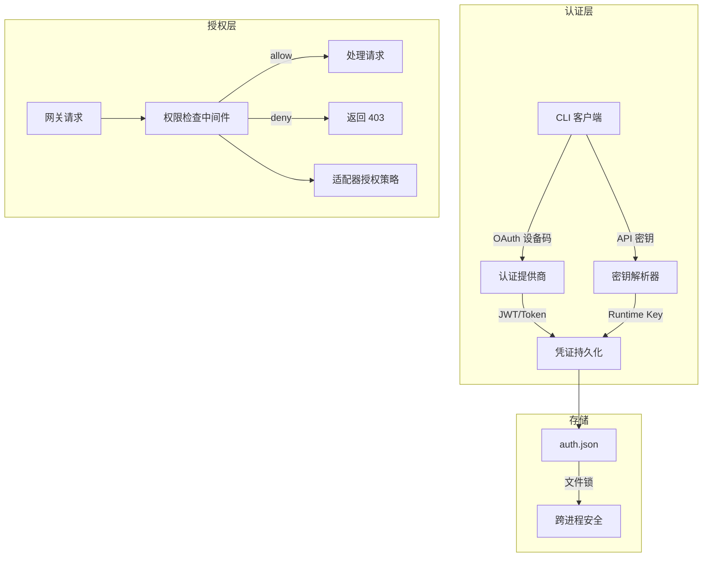
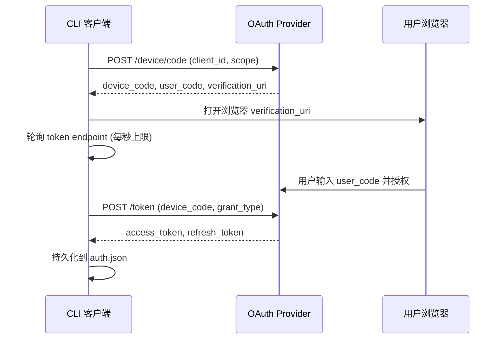

# 认证与授权

## 概述

Sparkii Agent 采用多层认证与授权体系，保护从 CLI 客户端到云端推理服务、从网关平台到中继连接器的完整请求链路。系统支持 OAuth 2.0 设备码授权流、API 密钥认证、JWT 令牌验证等多种认证方式，并通过细粒度的权限控制策略管理资源访问。

认证状态持久化在 `~/.sparkii/auth.json` 文件中，采用跨进程文件锁保证并发安全。

## 架构总览



## 认证方式

### 1. OAuth 2.0 设备码授权

Sparkii 支持通过 OAuth 设备码流程对接多个推理服务提供商。核心实现位于 `sparkii_cli/auth.py`。

#### 支持的 OAuth 提供商

| 提供商 | 客户端 ID | 作用域 | 刷新策略 |
|--------|-----------|--------|----------|
| Nous Portal | `sparkii-cli` | `inference:invoke` | 到期前 120 秒 |
| xAI/Grok | `b1a00492-...` | `openid profile email grok-cli:access` | 到期前 3600 秒 |
| MiniMax | `78257093-...` | `group_id profile model.completion` | 到期前 60 秒 |
| OpenAI Codex | `app_EMoamE...` | (implicit) | 到期前 120 秒 |
| Qwen | `f0304373-...` | (implicit) | 到期前 120 秒 |
| Spotify | Spotify Dashboard | 10 scopes | 到期前 120 秒 |

#### 设备码授权流程



关键常量配置：

```python
# sparkii_cli/auth.py
ACCESS_TOKEN_REFRESH_SKEW_SECONDS = 120       # 到期前 2 分钟刷新
DEVICE_AUTH_POLL_INTERVAL_CAP_SECONDS = 1     # 轮询间隔上限
AUTH_LOCK_TIMEOUT_SECONDS = 15.0              # 文件锁超时
AUTH_STORE_VERSION = 1                        # 存储格式版本
```

### 2. API 密钥认证

对于不支持 OAuth 的推理服务（如 OpenRouter、自定义端点），系统提供 API 密钥认证机制。ProviderConfig 数据类定义了提供商配置：

```python
@dataclass
class ProviderConfig:
    id: str
    name: str
    auth_type: str  # "oauth_device_code" | "api_key" | "oauth_external"
    portal_base_url: str = ""
    inference_base_url: str = ""
    client_id: str = ""
    scope: str = ""
```

`resolve_provider()` 函数通过优先级链选择活动提供商：命令行参数 > config.yaml 配置 > 环境变量 > 自动检测。

### 3. 中继连接器认证

网关与中继连接器之间的 WebSocket 通道使用 HMAC-SHA256 双向认证，实现位于 `gateway/relay/auth.py`。

**WebSocket 升级认证**：网关在 WS 升级时发送 `Authorization: Bearer <token>`，其中 token 格式为 `base64url(payload:exp:sig)`，sig 为 HMAC-SHA256 签名。

**入站投递签名**：连接器向网关投递事件时携带 `x-relay-timestamp` 和 `x-relay-signature` 头，网关验证时间戳偏差不超过 300 秒。

**多密钥轮换**：支持主/次密钥验证列表，使用 `hmac.compare_digest` 进行常量时间比较，防止时序攻击。

## 凭证持久化

认证状态存储在 `~/.sparkii/auth.json` 中，包含版本号和各提供商的凭证状态。跨平台文件锁保证并发安全：Unix 使用 `fcntl.flock()`，Windows 使用 `msvcrt.locking()`，锁超时 15 秒。写入使用原子替换防止部分写入。

## 授权控制

`GatewayAuthorizationMixin`（`gateway/authz_mixin.py`）实现平台级授权：

- **用户白名单**：`allowed_users` 配置允许使用机器人的用户 ID 列表
- **DM 策略**：`dm_policy` 控制私信交互行为（allow/deny/owner_only）
- **平台隔离**：`_platform_gate_env` 按配置文件隔离环境变量读取
- **Dashboard 认证**：独立的 `plugins/dashboard_auth/` 模块提供会话管理和 CSRF 防护

## 安全机制

1. **令牌刷新**：到期前自动刷新，使用 refresh_token 无感续期
2. **凭证脱敏**：日志和错误消息中自动掩盖敏感字段
3. **作用域限制**：OAuth 令牌限定最小必要权限
4. **常量时间比较**：HMAC 签名验证防止时序攻击
5. **密钥轮换**：支持主/次密钥平滑切换

## 源文件参考

| 文件 | 职责 |
|------|------|
| `sparkii_cli/auth.py` | 多提供商认证系统核心（8612 行） |
| `gateway/relay/auth.py` | 中继连接器 HMAC 认证原语 |
| `gateway/authz_mixin.py` | 网关授权中间件 |
| `plugins/dashboard_auth/` | Web Dashboard 认证模块 |
