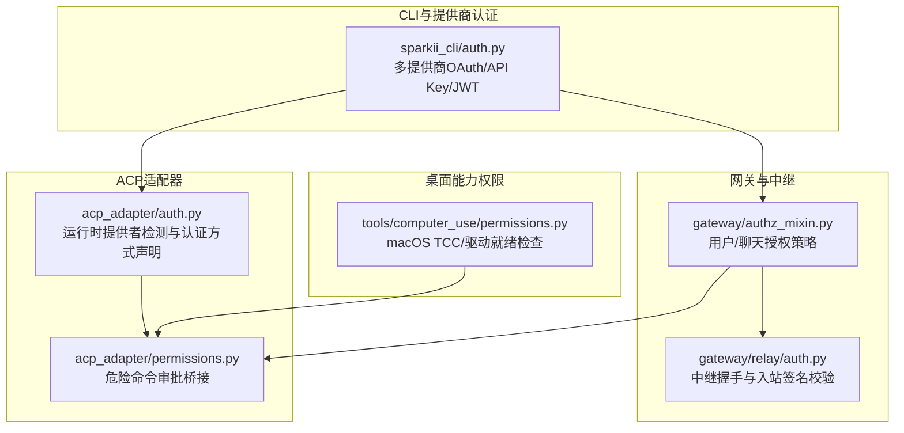
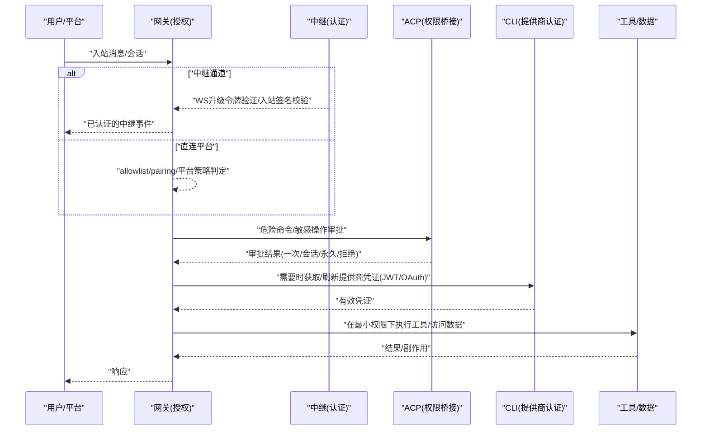
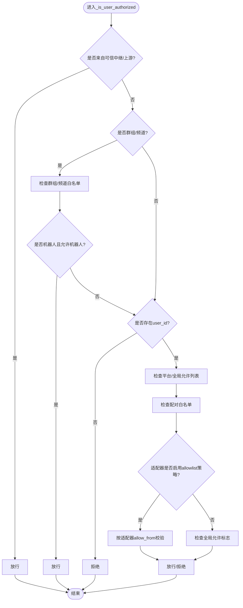
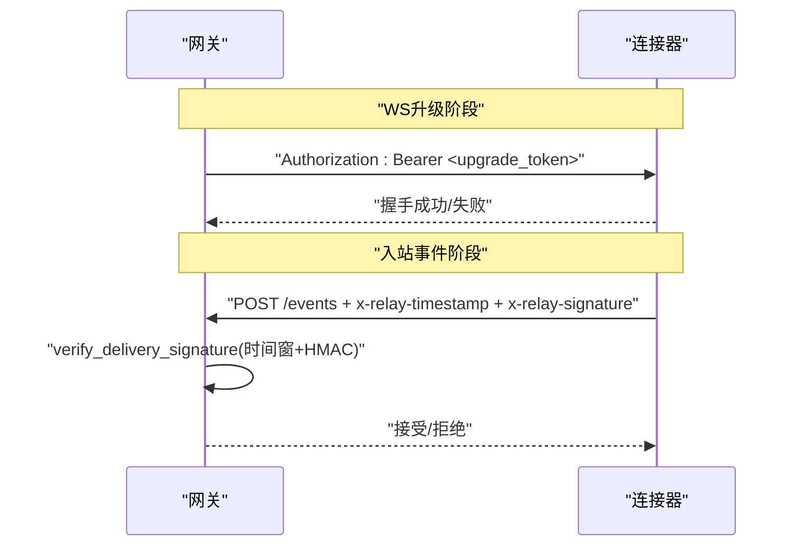
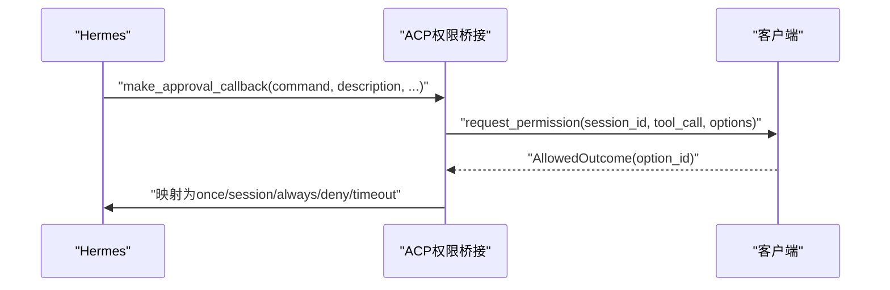
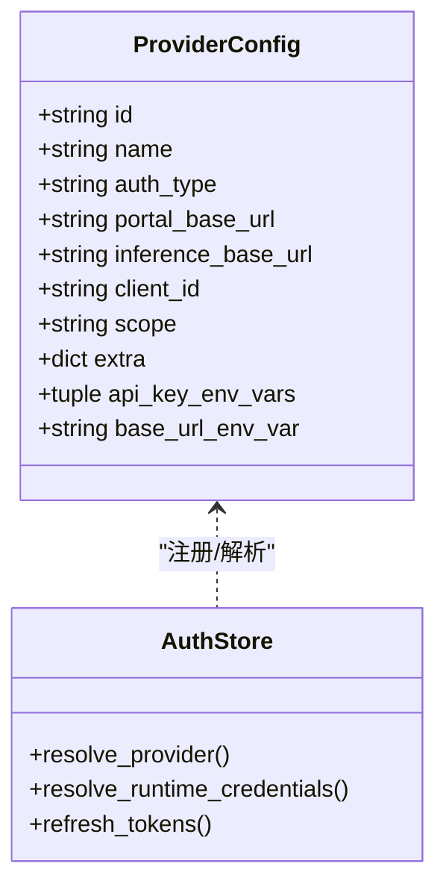
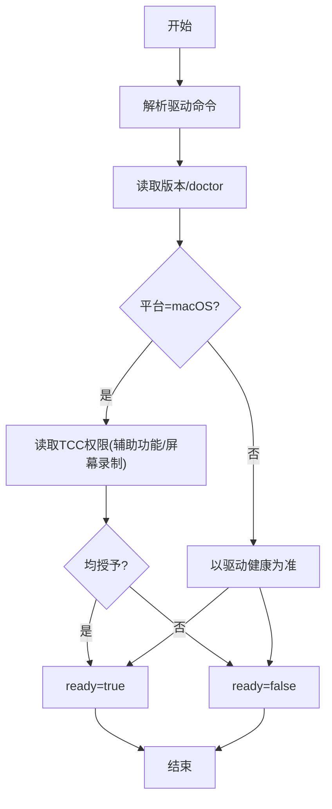
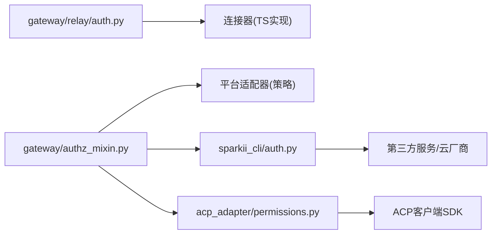

# 访问控制

<cite>
**本文引用的文件**
- [acp_adapter/auth.py](file://acp_adapter/auth.py)
- [acp_adapter/permissions.py](file://acp_adapter/permissions.py)
- [gateway/authz_mixin.py](file://gateway/authz_mixin.py)
- [gateway/relay/auth.py](file://gateway/relay/auth.py)
- [sparkii_cli/auth.py](file://sparkii_cli/auth.py)
- [tools/computer_use/permissions.py](file://tools/computer_use/permissions.py)
</cite>

## 目录
1. [简介](#简介)
2. [项目结构](#项目结构)
3. [核心组件](#核心组件)
4. [架构总览](#架构总览)
5. [详细组件分析](#详细组件分析)
6. [依赖关系分析](#依赖关系分析)
7. [性能考虑](#性能考虑)
8. [故障排除指南](#故障排除指南)
9. [结论](#结论)
10. [附录](#附录)

## 简介
本文件面向企业级部署，系统性说明该代码库中的访问控制体系：基于角色的访问控制（RBAC）与细粒度权限管理、认证流程（OAuth2/JWT/会话）、授权策略配置（允许列表、拒绝列表、条件访问），以及安全最佳实践与排障方法。文档同时覆盖工具调用、API端点和数据访问层面的权限控制思路，并提供可操作的企业场景配置示例。

## 项目结构
围绕访问控制的关键模块分布如下：
- 网关侧用户授权与平台接入策略：gateway/authz_mixin.py
- 中继通道认证（HMAC令牌与签名校验）：gateway/relay/auth.py
- ACP（Agent Control Protocol）权限桥接与危险命令审批：acp_adapter/permissions.py、acp_adapter/auth.py
- 多提供商认证与JWT/OAuth设备码流：sparkii_cli/auth.py
- 桌面“计算机使用”能力权限（macOS TCC等）：tools/computer_use/permissions.py

**图表来源**
- [gateway/authz_mixin.py:90-783](file://gateway/authz_mixin.py#L90-L783)
- [gateway/relay/auth.py:1-169](file://gateway/relay/auth.py#L1-L169)
- [acp_adapter/permissions.py:1-183](file://acp_adapter/permissions.py#L1-L183)
- [acp_adapter/auth.py:1-80](file://acp_adapter/auth.py#L1-L80)
- [sparkii_cli/auth.py:194-540](file://sparkii_cli/auth.py#L194-L540)
- [tools/computer_use/permissions.py:121-161](file://tools/computer_use/permissions.py#L121-L161)

**章节来源**
- [gateway/authz_mixin.py:90-783](file://gateway/authz_mixin.py#L90-L783)
- [gateway/relay/auth.py:1-169](file://gateway/relay/auth.py#L1-L169)
- [acp_adapter/permissions.py:1-183](file://acp_adapter/permissions.py#L1-L183)
- [acp_adapter/auth.py:1-80](file://acp_adapter/auth.py#L1-L80)
- [sparkii_cli/auth.py:194-540](file://sparkii_cli/auth.py#L194-L540)
- [tools/computer_use/permissions.py:121-161](file://tools/computer_use/permissions.py#L121-L161)

## 核心组件
- 网关用户授权（allowlist/pairing/upstream delegation）：集中处理各平台消息的准入判定，支持环境变量、配对白名单、上游可信中继放行、平台特定群组/频道白名单等。
- 中继认证（WS升级令牌与入站事件签名）：确保连接器到网关的通道安全，支持密钥轮换与时间窗防重放。
- ACP权限桥接：将危险命令执行请求以“工具调用更新”形式提交给客户端进行审批，映射为一次性/会话/永久/拒绝等结果。
- 多提供商认证：统一注册多种提供商（OAuth设备码、外部OAuth、API Key、AWS SDK/Vertex/Azure Foundry等），并负责令牌刷新与运行期凭证解析。
- 桌面能力权限：跨平台探测“计算机使用”能力，macOS下通过TCC授予辅助功能与屏幕录制权限。

**章节来源**
- [gateway/authz_mixin.py:90-783](file://gateway/authz_mixin.py#L90-L783)
- [gateway/relay/auth.py:1-169](file://gateway/relay/auth.py#L1-L169)
- [acp_adapter/permissions.py:1-183](file://acp_adapter/permissions.py#L1-L183)
- [sparkii_cli/auth.py:194-540](file://sparkii_cli/auth.py#L194-L540)
- [tools/computer_use/permissions.py:121-161](file://tools/computer_use/permissions.py#L121-L161)

## 架构总览
下图展示从用户/平台接入到工具调用的完整访问控制链路，涵盖认证、授权、审批与数据访问边界。

**图表来源**
- [gateway/authz_mixin.py:386-783](file://gateway/authz_mixin.py#L386-L783)
- [gateway/relay/auth.py:83-134](file://gateway/relay/auth.py#L83-L134)
- [acp_adapter/permissions.py:110-183](file://acp_adapter/permissions.py#L110-L183)
- [sparkii_cli/auth.py:194-540](file://sparkii_cli/auth.py#L194-L540)

## 详细组件分析

### 组件A：网关用户授权（GatewayAuthorizationMixin）
- 角色与策略
  - 上游委托：当来自受信任中继或平台适配器自身已做严格准入时，直接放行。
  - 环境白名单：按平台与环境变量组合判定（如 TELEGRAM_ALLOWED_USERS、DISCORD_ALLOW_ALL_USERS 等）。
  - 配对白名单：经操作员批准的配对记录视为强授权。
  - 群组/频道策略：支持群组ID白名单与发送者白名单，兼容历史配置。
  - 失败关闭：未配置任何白名单时默认拒绝，避免开放风险。
- 关键路径
  - 解析适配器与profile，区分主/次profile的隔离。
  - 读取dm_policy/group_policy/allow_from等策略，仅在“allowlist”模式下信任适配器前置过滤。
  - 对WhatsApp/SimpleX等平台进行标识规范化与别名匹配。

**图表来源**
- [gateway/authz_mixin.py:386-783](file://gateway/authz_mixin.py#L386-L783)

**章节来源**
- [gateway/authz_mixin.py:90-783](file://gateway/authz_mixin.py#L90-L783)

### 组件B：中继认证（WS升级令牌与入站签名）
- WS升级令牌：网关向连接器发起WS升级时携带Bearer令牌，由连接器验证。
- 入站事件签名：连接器对每个POST请求用delivery key生成HMAC签名，网关校验时间戳窗口与签名一致性，支持多密钥轮换。
- 安全特性：常量时间比较、过期校验、防重放时间窗。

**图表来源**
- [gateway/relay/auth.py:83-134](file://gateway/relay/auth.py#L83-L134)
- [gateway/relay/auth.py:142-169](file://gateway/relay/auth.py#L142-L169)

**章节来源**
- [gateway/relay/auth.py:1-169](file://gateway/relay/auth.py#L1-L169)

### 组件C：ACP权限桥接（危险命令审批）
- 审批选项映射：一次性允许、会话内允许、永久允许、拒绝、总是拒绝。
- 工具调用更新：每次请求附带唯一的tool_call_id，避免并发冲突。
- 超时与错误处理：超时自动拒绝；异常日志化并拒绝。

**图表来源**
- [acp_adapter/permissions.py:41-107](file://acp_adapter/permissions.py#L41-L107)
- [acp_adapter/permissions.py:110-183](file://acp_adapter/permissions.py#L110-L183)

**章节来源**
- [acp_adapter/permissions.py:1-183](file://acp_adapter/permissions.py#L1-L183)

### 组件D：多提供商认证与JWT/OAuth
- 提供商注册表：集中定义OAuth设备码、外部OAuth、API Key、AWS SDK/Vertex/Azure Foundry等。
- 凭证解析：优先从环境变量/.env/凭证池解析，支持特殊提供商（Copilot、Kimi、Z.AI等）的端点探测与基址修正。
- JWT/令牌刷新：针对短生命周期令牌提前刷新，保障后台任务可用性。

**图表来源**
- [sparkii_cli/auth.py:194-540](file://sparkii_cli/auth.py#L194-L540)

**章节来源**
- [sparkii_cli/auth.py:194-540](file://sparkii_cli/auth.py#L194-L540)

### 组件E：桌面“计算机使用”权限
- 跨平台就绪检测：调用cua-driver诊断，返回版本、检查项与就绪状态。
- macOS TCC权限：辅助功能与屏幕录制需显式授予；提供一键申请授权流程。
- 非macOS平台：以驱动健康度作为就绪信号。

**图表来源**
- [tools/computer_use/permissions.py:121-161](file://tools/computer_use/permissions.py#L121-L161)
- [tools/computer_use/permissions.py:164-199](file://tools/computer_use/permissions.py#L164-L199)

**章节来源**
- [tools/computer_use/permissions.py:121-161](file://tools/computer_use/permissions.py#L121-L161)
- [tools/computer_use/permissions.py:164-199](file://tools/computer_use/permissions.py#L164-L199)

## 依赖关系分析
- 网关授权依赖平台适配器暴露的策略属性（dm_policy/group_policy/enforces_own_access_policy），并在无策略时采用默认拒绝。
- 中继认证独立于业务逻辑，仅关注握手与签名，降低耦合。
- ACP权限桥接依赖客户端SDK的PermissionOption与ToolCallUpdate，保证与ACP协议一致。
- 多提供商认证与网关解耦，通过运行时凭证注入到下游调用链。

**图表来源**
- [gateway/authz_mixin.py:90-783](file://gateway/authz_mixin.py#L90-L783)
- [gateway/relay/auth.py:1-169](file://gateway/relay/auth.py#L1-L169)
- [acp_adapter/permissions.py:1-183](file://acp_adapter/permissions.py#L1-L183)
- [sparkii_cli/auth.py:194-540](file://sparkii_cli/auth.py#L194-L540)

**章节来源**
- [gateway/authz_mixin.py:90-783](file://gateway/authz_mixin.py#L90-L783)
- [gateway/relay/auth.py:1-169](file://gateway/relay/auth.py#L1-L169)
- [acp_adapter/permissions.py:1-183](file://acp_adapter/permissions.py#L1-L183)
- [sparkii_cli/auth.py:194-540](file://sparkii_cli/auth.py#L194-L540)

## 性能考虑
- 授权判定尽量短路：先检查上游委托与平台允许标志，再进入复杂白名单计算。
- 令牌刷新提前量：对短生命周期令牌设置合理刷新偏移，减少过期抖动。
- 并发安全：ACP权限请求使用唯一tool_call_id避免冲突；HMAC校验使用常量时间比较。
- 子进程隔离：桌面能力权限调用第三方二进制时清理敏感环境变量，防止泄露。

[本节为通用指导，不直接分析具体文件]

## 故障排除指南
- 无法通过网关授权
  - 检查对应平台的允许列表环境变量是否正确配置（如 TELEGRAM_ALLOWED_USERS、DISCORD_ALLOW_ALL_USERS 等）。
  - 若使用中继，确认WS升级令牌与入站签名头是否齐全且时间戳在容差范围内。
  - 核对适配器策略是否为“allowlist”，否则不会信任前置放行。
- ACP审批超时或被拒
  - 确认客户端已正确订阅permission请求并返回合法option_id。
  - 调整超时参数，避免网络延迟导致误判。
- 提供商认证失败
  - 检查环境变量/.env/凭证池是否包含有效密钥或令牌。
  - 对于Z.AI/Kimi等特殊提供商，确认端点探测是否命中预期地址。
- 桌面能力不可用
  - macOS：打开系统设置，授予CuaDriver“辅助功能”和“屏幕录制”。
  - 其他平台：确认cua-driver安装与健康检查通过。

**章节来源**
- [gateway/authz_mixin.py:386-783](file://gateway/authz_mixin.py#L386-L783)
- [gateway/relay/auth.py:142-169](file://gateway/relay/auth.py#L142-L169)
- [acp_adapter/permissions.py:110-183](file://acp_adapter/permissions.py#L110-L183)
- [sparkii_cli/auth.py:548-800](file://sparkii_cli/auth.py#L548-L800)
- [tools/computer_use/permissions.py:121-199](file://tools/computer_use/permissions.py#L121-L199)

## 结论
该访问控制系统以“默认拒绝”为核心原则，结合平台策略、中继认证、ACP审批与多提供商凭证管理，形成端到端的细粒度控制面。企业可通过环境变量、配对白名单与适配器策略灵活配置，并通过安全加固（常量时间校验、时间窗、最小权限）保障生产稳定性。建议配合定期审计与异常检测机制，持续优化权限模型与策略。

[本节为总结性内容，不直接分析具体文件]

## 附录

### 企业级策略配置示例（概念性）
- 允许列表
  - 平台级：设置各平台ALLOWED_USERS或ALLOW_ALL_USERS开关，限制可访问用户范围。
  - 群组级：为Telegram/QQBot等配置群组ID白名单，仅允许指定群聊触发。
- 拒绝列表
  - 通过禁用高风险工具/技能、限制管理员命令、关闭公开入口等方式收敛攻击面。
- 条件访问规则
  - 基于来源（中继/直连）、渠道类型（DM/群组）、用户角色（role_authorized）动态决定放行。
  - 对高危操作强制走ACP审批，支持一次性/会话/永久三种模式。
- 认证与会话
  - 使用OAuth设备码或外部OAuth完成身份认证，持久化JWT并定时刷新。
  - 中继通道使用HMAC签名与时间窗校验，支持密钥轮换。
- 最小权限与审计
  - 仅授予完成任务所需的最小权限；定期导出审计日志，识别异常访问与过度授权。

[本节为概念性指导，不直接分析具体文件]