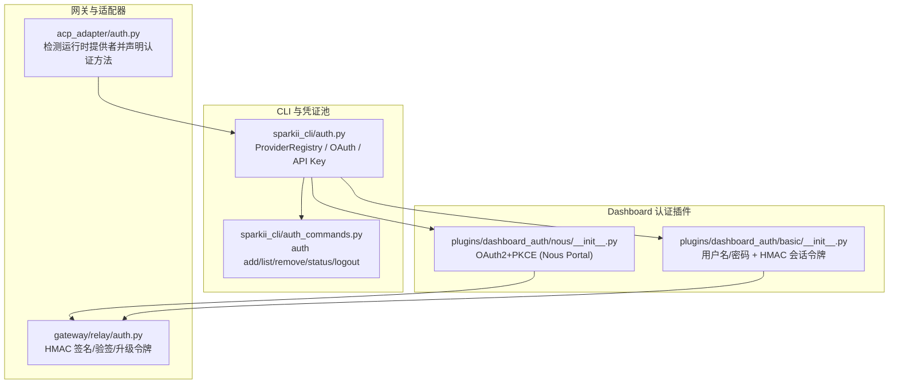
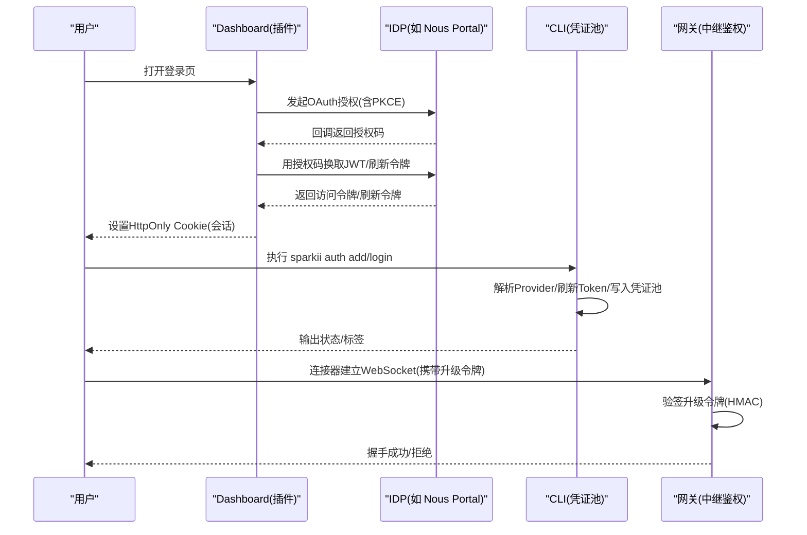
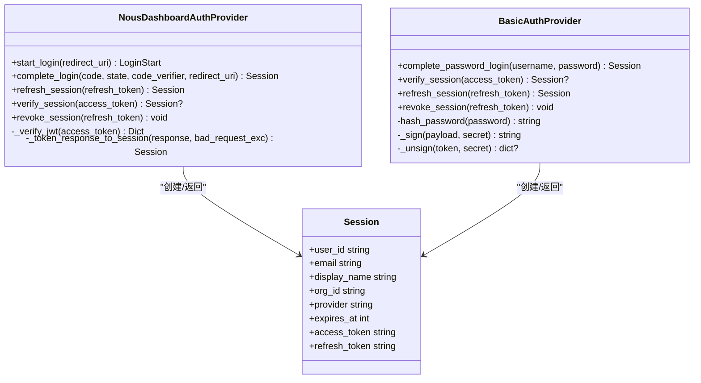
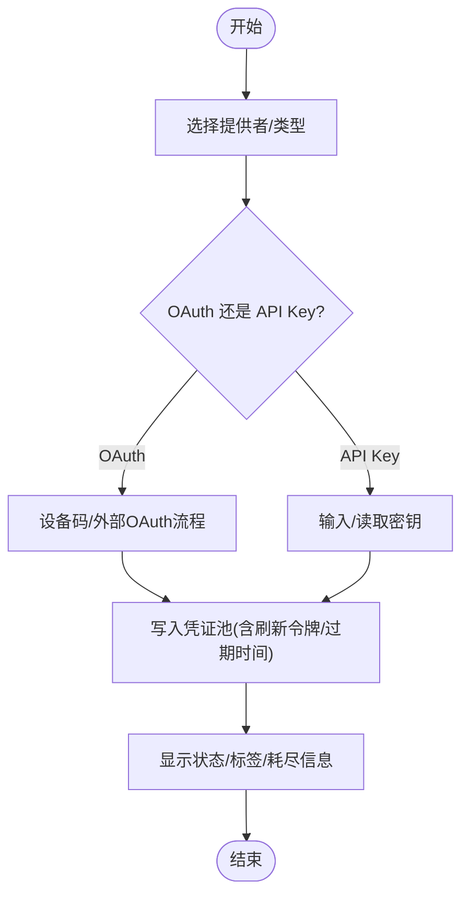
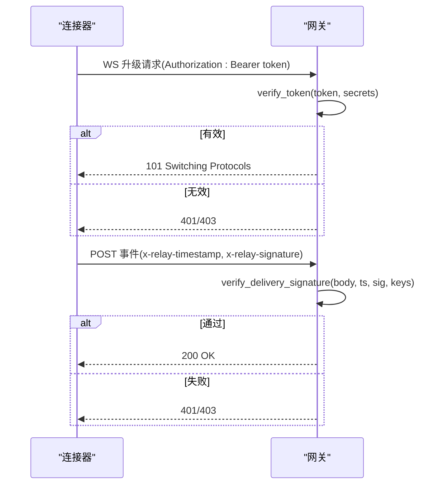
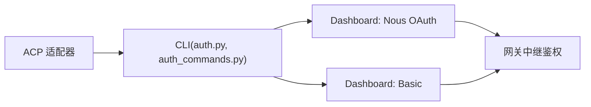

# 身份认证

<cite>
**本文引用的文件**
- [sparkii_cli/auth.py](file://sparkii_cli/auth.py)
- [sparkii_cli/auth_commands.py](file://sparkii_cli/auth_commands.py)
- [gateway/relay/auth.py](file://gateway/relay/auth.py)
- [acp_adapter/auth.py](file://acp_adapter/auth.py)
- [plugins/dashboard_auth/basic/__init__.py](file://plugins/dashboard_auth/basic/__init__.py)
- [plugins/dashboard_auth/nous/__init__.py](file://plugins/dashboard_auth/nous/__init__.py)
</cite>

## 目录
1. [简介](#简介)
2. [项目结构](#项目结构)
3. [核心组件](#核心组件)
4. [架构总览](#架构总览)
5. [详细组件分析](#详细组件分析)
6. [依赖关系分析](#依赖关系分析)
7. [性能与安全考量](#性能与安全考量)
8. [故障排除指南](#故障排除指南)
9. [结论](#结论)
10. [附录：配置示例与最佳实践](#附录配置示例与最佳实践)

## 简介
本文件面向“身份认证系统”的落地实现，聚焦以下目标：
- 支持的认证协议与实现细节（OAuth2、JWT、SAML等）
- 多因素认证（MFA）能力与扩展点
- 会话管理机制（生命周期、超时、并发控制）
- 第三方认证集成（企业LDAP、Active Directory、云身份提供商）
- 安全配置建议（密码策略、会话安全、传输加密）
- 实际配置示例与故障排除

说明：当前仓库实现了以 OAuth2 + PKCE（Nous Portal）、本地用户名/密码（BasicAuthProvider）、以及多种模型供应商的 API Key/OAuth 凭证池管理；网关侧提供基于 HMAC 的连接器鉴权。SAML 未在当前代码中直接实现，但可通过 Dashboard Auth 插件机制扩展。

## 项目结构
围绕认证的关键模块分布如下：
- CLI 层：统一的多提供者认证与凭证池管理（OAuth、API Key、设备码流程等）
- 网关中继鉴权：连接器与网关之间的双向签名校验
- ACP 适配器：检测并声明可用的运行时认证方法
- Dashboard 认证插件：内置 Nous OAuth 与 Basic 用户名/密码两种方案

图表来源
- [sparkii_cli/auth.py:190-540](file://sparkii_cli/auth.py#L190-L540)
- [sparkii_cli/auth_commands.py:164-434](file://sparkii_cli/auth_commands.py#L164-L434)
- [plugins/dashboard_auth/nous/__init__.py:153-347](file://plugins/dashboard_auth/nous/__init__.py#L153-L347)
- [plugins/dashboard_auth/basic/__init__.py:201-327](file://plugins/dashboard_auth/basic/__init__.py#L201-L327)
- [gateway/relay/auth.py:51-169](file://gateway/relay/auth.py#L51-L169)
- [acp_adapter/auth.py:11-79](file://acp_adapter/auth.py#L11-L79)

章节来源
- [sparkii_cli/auth.py:190-540](file://sparkii_cli/auth.py#L190-L540)
- [sparkii_cli/auth_commands.py:164-434](file://sparkii_cli/auth_commands.py#L164-L434)
- [plugins/dashboard_auth/nous/__init__.py:153-347](file://plugins/dashboard_auth/nous/__init__.py#L153-L347)
- [plugins/dashboard_auth/basic/__init__.py:201-327](file://plugins/dashboard_auth/basic/__init__.py#L201-L327)
- [gateway/relay/auth.py:51-169](file://gateway/relay/auth.py#L51-L169)
- [acp_adapter/auth.py:11-79](file://acp_adapter/auth.py#L11-L79)

## 核心组件
- 提供者注册表与凭证解析
  - 集中定义各模型供应商的认证类型、端点、环境变量与基地址，支持 API Key、OAuth 设备码、外部 OAuth、AWS SDK、Vertex 等。
  - 运行时按优先级解析可用凭据（环境、.env、凭证池、外部工具）。
- 命令行认证管理
  - 提供添加、列出、移除、重置、状态、登出等命令，覆盖多种供应商的 OAuth 登录与 API Key 录入。
- Dashboard 认证插件
  - Nous OAuth2+PKCE：授权码流程、刷新令牌轮换、JWT 验证（RS256，JWKS）。
  - Basic 用户名/密码：无状态 HMAC 会话令牌、scrypt 密码哈希、可配置的访问令牌 TTL。
- 网关中继鉴权
  - WebSocket 升级令牌与入站投递签名，使用 HMAC-SHA256，支持密钥轮换窗口与重放防护。
- ACP 适配器
  - 检测当前运行时提供者并对外声明可用认证方法（含终端设置入口）。

章节来源
- [sparkii_cli/auth.py:190-540](file://sparkii_cli/auth.py#L190-L540)
- [sparkii_cli/auth_commands.py:164-434](file://sparkii_cli/auth_commands.py#L164-L434)
- [plugins/dashboard_auth/nous/__init__.py:153-347](file://plugins/dashboard_auth/nous/__init__.py#L153-L347)
- [plugins/dashboard_auth/basic/__init__.py:201-327](file://plugins/dashboard_auth/basic/__init__.py#L201-L327)
- [gateway/relay/auth.py:51-169](file://gateway/relay/auth.py#L51-L169)
- [acp_adapter/auth.py:11-79](file://acp_adapter/auth.py#L11-L79)

## 架构总览
下图展示从用户到网关的认证路径：浏览器通过 Dashboard 插件完成 OAuth 或密码登录，获得会话令牌；CLI 层负责模型供应商的 OAuth/API Key 凭证；网关侧对连接器通道进行 HMAC 鉴权。

图表来源
- [plugins/dashboard_auth/nous/__init__.py:179-347](file://plugins/dashboard_auth/nous/__init__.py#L179-L347)
- [plugins/dashboard_auth/basic/__init__.py:244-327](file://plugins/dashboard_auth/basic/__init__.py#L244-L327)
- [sparkii_cli/auth_commands.py:164-434](file://sparkii_cli/auth_commands.py#L164-L434)
- [gateway/relay/auth.py:83-134](file://gateway/relay/auth.py#L83-L134)

## 详细组件分析

### 组件A：Dashboard 认证插件（OAuth2+PKCE 与 Basic）
- Nous OAuth2+PKCE
  - 启动登录：生成 code_verifier 与 state，构造授权请求。
  - 完成登录：用授权码换取 JWT（RS256），校验 aud/iss/exp 等声明，并缓存 JWKS。
  - 刷新会话：使用刷新令牌轮换访问令牌，失败时强制重新登录。
  - 会话校验：独立验证 access_token，过期则返回空交由中间件处理。
- Basic 用户名/密码
  - 登录：scrypt 哈希比对（常量时间），防止时序泄露。
  - 会话：签发带 HMAC 签名的访问令牌与刷新令牌，支持 TTL 配置。
  - 撤销：无状态令牌，服务端无需持久化撤销。

图表来源
- [plugins/dashboard_auth/nous/__init__.py:153-347](file://plugins/dashboard_auth/nous/__init__.py#L153-L347)
- [plugins/dashboard_auth/basic/__init__.py:201-327](file://plugins/dashboard_auth/basic/__init__.py#L201-L327)

章节来源
- [plugins/dashboard_auth/nous/__init__.py:153-347](file://plugins/dashboard_auth/nous/__init__.py#L153-L347)
- [plugins/dashboard_auth/basic/__init__.py:201-327](file://plugins/dashboard_auth/basic/__init__.py#L201-L327)

### 组件B：CLI 认证与凭证池
- ProviderRegistry：集中声明各供应商的认证方式、端点与环境变量。
- 认证命令：支持 API Key 粘贴、OAuth 设备码登录、导入共享凭证、状态查看与登出。
- 凭证池：统一管理多个凭据条目，支持轮换策略与耗尽状态。

图表来源
- [sparkii_cli/auth_commands.py:164-434](file://sparkii_cli/auth_commands.py#L164-L434)
- [sparkii_cli/auth.py:190-540](file://sparkii_cli/auth.py#L190-L540)

章节来源
- [sparkii_cli/auth_commands.py:164-434](file://sparkii_cli/auth_commands.py#L164-L434)
- [sparkii_cli/auth.py:190-540](file://sparkii_cli/auth.py#L190-L540)

### 组件C：网关中继鉴权（HMAC）
- 升级令牌：Gateway→Connector 在 WebSocket 升级时携带 Authorization: Bearer <token>，token 为 payload:exp:sig 的 base64url 编码，sig 为 HMAC-SHA256。
- 入站投递签名：Connector→Gateway 每个 POST 携带 x-relay-timestamp 与 x-relay-signature，网关校验时间窗与签名。
- 密钥轮换：支持多密钥验证列表，避免轮换期间失效。

图表来源
- [gateway/relay/auth.py:83-169](file://gateway/relay/auth.py#L83-L169)

章节来源
- [gateway/relay/auth.py:83-169](file://gateway/relay/auth.py#L83-L169)

### 组件D：ACP 适配器（认证方法声明）
- 检测当前运行时提供者（字符串 key 或 callable provider），若存在则声明对应认证方法。
- 始终提供“终端设置”方法，便于首次配置。

章节来源
- [acp_adapter/auth.py:11-79](file://acp_adapter/auth.py#L11-L79)

## 依赖关系分析
- CLI 与 Dashboard 插件解耦：CLI 专注模型供应商凭证；Dashboard 插件专注 Web 会话与 IDP 交互。
- 网关中继鉴权独立于 Dashboard 与 CLI，仅依赖共享 HMAC 算法与密钥管理。
- ACP 适配器依赖 CLI 的运行时提供者解析，用于向外部系统声明可用认证方法。

图表来源
- [sparkii_cli/auth.py:190-540](file://sparkii_cli/auth.py#L190-L540)
- [sparkii_cli/auth_commands.py:164-434](file://sparkii_cli/auth_commands.py#L164-L434)
- [plugins/dashboard_auth/nous/__init__.py:153-347](file://plugins/dashboard_auth/nous/__init__.py#L153-L347)
- [plugins/dashboard_auth/basic/__init__.py:201-327](file://plugins/dashboard_auth/basic/__init__.py#L201-L327)
- [gateway/relay/auth.py:83-169](file://gateway/relay/auth.py#L83-L169)
- [acp_adapter/auth.py:11-79](file://acp_adapter/auth.py#L11-L79)

章节来源
- [sparkii_cli/auth.py:190-540](file://sparkii_cli/auth.py#L190-L540)
- [sparkii_cli/auth_commands.py:164-434](file://sparkii_cli/auth_commands.py#L164-L434)
- [plugins/dashboard_auth/nous/__init__.py:153-347](file://plugins/dashboard_auth/nous/__init__.py#L153-L347)
- [plugins/dashboard_auth/basic/__init__.py:201-327](file://plugins/dashboard_auth/basic/__init__.py#L201-L327)
- [gateway/relay/auth.py:83-169](file://gateway/relay/auth.py#L83-L169)
- [acp_adapter/auth.py:11-79](file://acp_adapter/auth.py#L11-L79)

## 性能与安全考量
- 性能
  - JWKS 缓存：Nous 插件缓存公钥（默认 5 分钟），减少网络开销。
  - 并行探测：Z.AI 等多端点场景采用线程池并行探测，快速选择可用端点。
  - 令牌刷新偏置：部分供应商提前刷新（如 2 分钟或 1 小时），降低运行期过期抖动。
- 安全
  - 密码哈希：Basic 插件使用 scrypt（内存困难函数），常量时间比较，防枚举与时序攻击。
  - 会话令牌：Basic 使用 HMAC 签名，无状态、可配置 TTL；Nous 使用 RS256 JWT，严格校验 aud/iss/exp。
  - 网关中继：HMAC 签名与时间窗校验，支持密钥轮换窗口，防重放。
  - 传输加密：建议在生产环境启用 HTTPS/TLS，确保浏览器与网关通信安全。

[本节为通用指导，不直接分析具体文件]

## 故障排除指南
- OAuth 登录失败（Nous）
  - 检查 client_id 是否匹配 contract 格式（agent:{instance_id}）。
  - 确认 portal_url 指向正确的环境（生产/预发）。
  - 若刷新令牌被复用检测，需重新登录。
- Basic 登录失败
  - 确认 username/password_hash 已正确配置，且 secret 足够长（≥16 字节）。
  - 若进程重启后会话丢失，需配置固定 secret 以跨进程/重启保持会话。
- 网关中继鉴权失败
  - 检查升级令牌的 payload/exp/sig 是否正确，密钥是否与连接器一致。
  - 检查入站投递的时间戳是否在允许偏差内，签名是否基于原始请求体。
- CLI 凭证问题
  - 使用 status 查看各提供者状态与耗尽原因（速率限制、认证失败等）。
  - 对于设备码流程，确认浏览器可达且网络连通。

章节来源
- [plugins/dashboard_auth/nous/__init__.py:153-347](file://plugins/dashboard_auth/nous/__init__.py#L153-L347)
- [plugins/dashboard_auth/basic/__init__.py:201-327](file://plugins/dashboard_auth/basic/__init__.py#L201-L327)
- [gateway/relay/auth.py:83-169](file://gateway/relay/auth.py#L83-L169)
- [sparkii_cli/auth_commands.py:437-531](file://sparkii_cli/auth_commands.py#L437-L531)

## 结论
本实现提供了：
- 完善的 OAuth2+PKCE 与 Basic 用户名/密码认证能力
- 多模型供应商的统一凭证管理与自动刷新
- 安全的网关中继鉴权（HMAC）
- 可扩展的 Dashboard 认证插件体系，便于接入更多 IDP

未来可在现有框架上扩展 SAML、MFA（短信/邮件/硬件令牌）与企业目录（LDAP/AD）集成。

[本节为总结性内容，不直接分析具体文件]

## 附录：配置示例与最佳实践
- 启用 Nous OAuth（Dashboard）
  - 配置项：dashboard.oauth.client_id、dashboard.oauth.portal_url（或通过环境变量覆盖）
  - 行为：授权码+PKCE，RS256 JWT，刷新令牌轮换
  - 参考：[plugins/dashboard_auth/nous/__init__.py:153-347](file://plugins/dashboard_auth/nous/__init__.py#L153-L347)
- 启用 Basic 用户名/密码（Dashboard）
  - 配置项：dashboard.basic_auth.username、password_hash（或 password）、secret、session_ttl_seconds
  - 行为：scrypt 哈希、HMAC 会话令牌、可配置 TTL
  - 参考：[plugins/dashboard_auth/basic/__init__.py:201-327](file://plugins/dashboard_auth/basic/__init__.py#L201-L327)
- 添加模型供应商凭证（CLI）
  - 命令：sparkii auth add <provider> --type oauth|api-key
  - 支持：Nous、OpenAI Codex、xAI、Qwen、MiniMax 等
  - 参考：[sparkii_cli/auth_commands.py:164-434](file://sparkii_cli/auth_commands.py#L164-L434)
- 网关中继鉴权
  - 升级令牌：Authorization: Bearer <token>（payload:exp:sig）
  - 入站签名：x-relay-timestamp、x-relay-signature
  - 参考：[gateway/relay/auth.py:83-169](file://gateway/relay/auth.py#L83-L169)

[本节为配置指引，不直接分析具体文件]