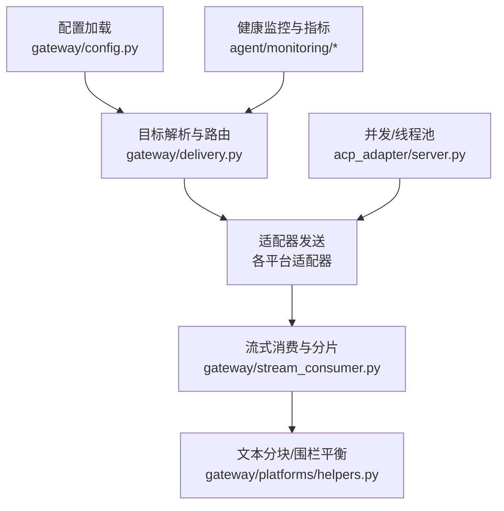
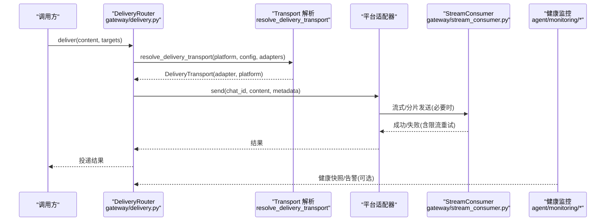
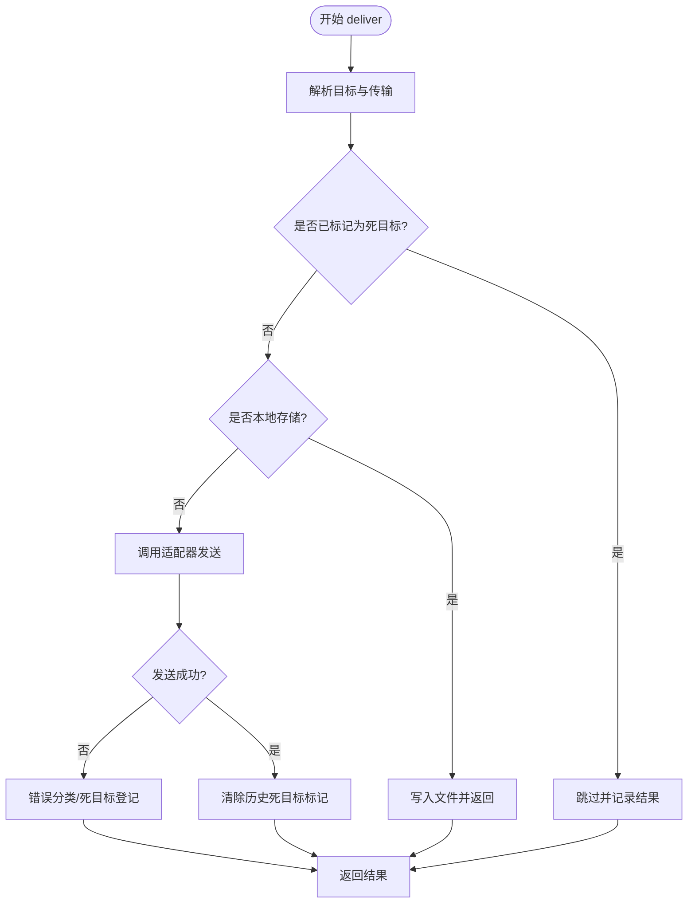
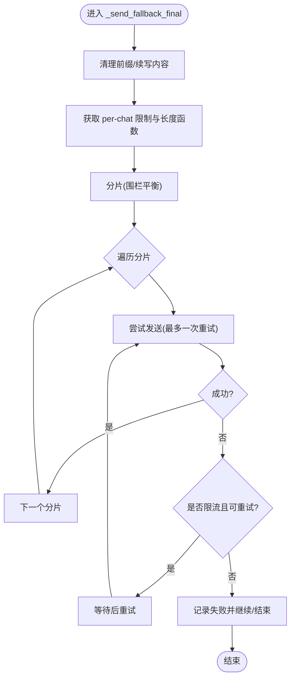
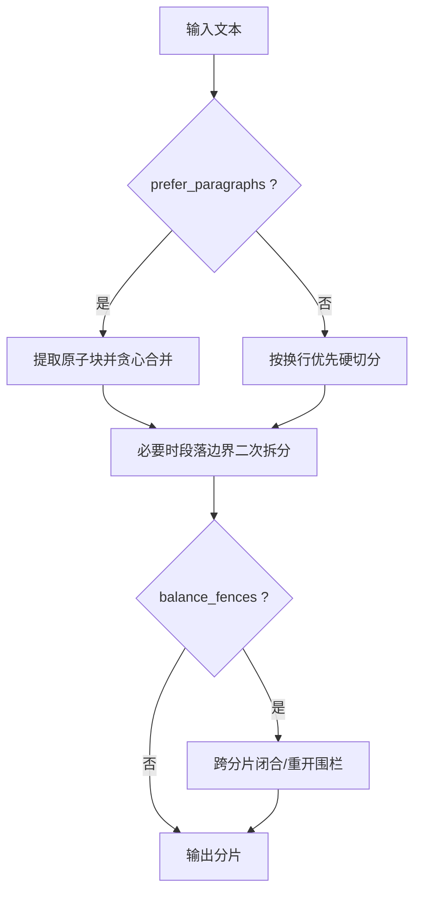
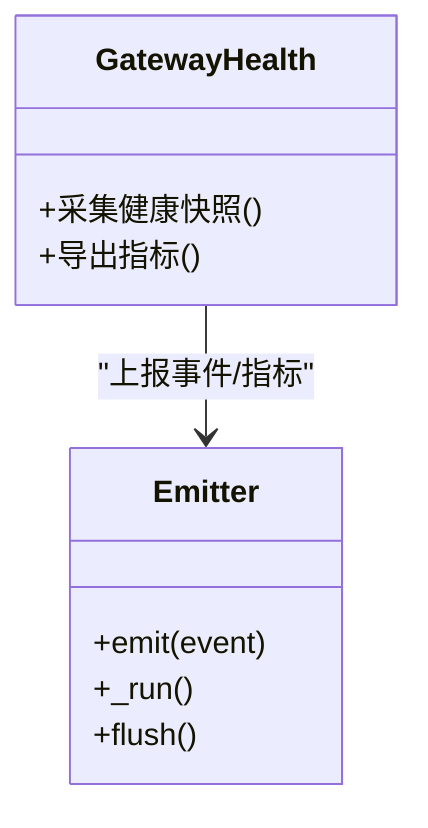
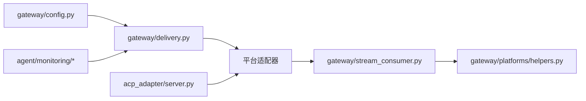

# 负载均衡

<cite>
**本文引用的文件**
- [gateway/config.py](file://gateway/config.py)
- [gateway/delivery.py](file://gateway/delivery.py)
- [gateway/stream_dispatch.py](file://gateway/stream_dispatch.py)
- [gateway/stream_consumer.py](file://gateway/stream_consumer.py)
- [gateway/platforms/helpers.py](file://gateway/platforms/helpers.py)
- [agent/monitoring/gateway_health.py](file://agent/monitoring/gateway_health.py)
- [agent/monitoring/emitter.py](file://agent/monitoring/emitter.py)
- [acp_adapter/server.py](file://acp_adapter/server.py)
</cite>

## 目录
1. [简介](#简介)
2. [项目结构](#项目结构)
3. [核心组件](#核心组件)
4. [架构总览](#架构总览)
5. [详细组件分析](#详细组件分析)
6. [依赖关系分析](#依赖关系分析)
7. [性能调优建议](#性能调优建议)
8. [故障排除指南](#故障排除指南)
9. [结论](#结论)
10. [附录：部署配置示例](#附录：部署配置示例)

## 简介
本文件面向网关与平台适配层，系统化说明“负载均衡”在该项目中的实现方式与可配置点。重点覆盖：
- 负载均衡策略：轮询、加权轮询、最少连接、IP 哈希等（以配置化方式接入）
- 健康检查：主动/被动健康检查与健康状态监控
- 会话保持：Cookie 绑定、IP 绑定、粘性会话
- 服务发现：DNS、Consul、Kubernetes
- 流量管理：流量镜像、灰度发布、蓝绿部署
- 性能调优：连接池、超时、重试
- 部署示例与排障

说明：本项目未内置专用 L4/L7 负载均衡器代码，但通过“多目标投递路由 + 适配器抽象 + 健康监控 + 流式分片与回退”的机制，为上层 LB 或外部 LB 提供清晰的集成点与行为约束。

## 项目结构
与负载均衡相关的关键模块集中在 gateway 与 agent.monitoring 中：
- 配置与平台能力：gateway/config.py
- 目标解析与投递路由：gateway/delivery.py
- 事件分发与流式输出：gateway/stream_dispatch.py, gateway/stream_consumer.py
- 文本分块与围栏平衡（影响分片与重试边界）：gateway/platforms/helpers.py
- 健康监控与指标发射：agent/monitoring/gateway_health.py, agent/monitoring/emitter.py
- 线程池/并发资源（用于并发请求与超时控制）：acp_adapter/server.py

**图示来源**
- [gateway/config.py:1-120](file://gateway/config.py#L1-L120)
- [gateway/delivery.py:92-132](file://gateway/delivery.py#L92-L132)
- [gateway/stream_consumer.py:1296-1331](file://gateway/stream_consumer.py#L1296-L1331)
- [gateway/platforms/helpers.py:724-830](file://gateway/platforms/helpers.py#L724-L830)
- [agent/monitoring/gateway_health.py:1-60](file://agent/monitoring/gateway_health.py#L1-L60)
- [agent/monitoring/emitter.py:1-120](file://agent/monitoring/emitter.py#L1-L120)
- [acp_adapter/server.py:190-210](file://acp_adapter/server.py#L190-L210)

**章节来源**
- [gateway/config.py:1-120](file://gateway/config.py#L1-L120)
- [gateway/delivery.py:92-132](file://gateway/delivery.py#L92-L132)
- [gateway/stream_consumer.py:1296-1331](file://gateway/stream_consumer.py#L1296-L1331)
- [gateway/platforms/helpers.py:724-830](file://gateway/platforms/helpers.py#L724-L830)
- [agent/monitoring/gateway_health.py:1-60](file://agent/monitoring/gateway_health.py#L1-L60)
- [agent/monitoring/emitter.py:1-120](file://agent/monitoring/emitter.py#L1-L120)
- [acp_adapter/server.py:190-210](file://acp_adapter/server.py#L190-L210)

## 核心组件
- 配置模型与平台枚举：定义平台、默认值、布尔/数值归一化、端口绑定判定等，为上游 LB 选择后端提供稳定元数据。
- 投递路由：将逻辑平台映射到具体适配器（原生或 Relay），并处理死目标、截断、审计保存等。
- 流式消费者：负责消息分片、围栏平衡、回退发送与限流重试。
- 健康监控：采集网关健康快照、指标发射，支撑主动/被动健康检查。
- 并发与线程池：限制并发度，避免下游过载。

**章节来源**
- [gateway/config.py:272-418](file://gateway/config.py#L272-L418)
- [gateway/delivery.py:294-391](file://gateway/delivery.py#L294-L391)
- [gateway/stream_consumer.py:1296-1489](file://gateway/stream_consumer.py#L1296-L1489)
- [agent/monitoring/gateway_health.py:1-60](file://agent/monitoring/gateway_health.py#L1-L60)
- [agent/monitoring/emitter.py:1-120](file://agent/monitoring/emitter.py#L1-L120)
- [acp_adapter/server.py:190-210](file://acp_adapter/server.py#L190-L210)

## 架构总览
下图展示从配置到投递、再到流式输出的整体链路，以及健康监控对路由与后端的反馈。

**图示来源**
- [gateway/delivery.py:92-132](file://gateway/delivery.py#L92-L132)
- [gateway/delivery.py:318-391](file://gateway/delivery.py#L318-L391)
- [gateway/stream_consumer.py:1296-1489](file://gateway/stream_consumer.py#L1296-L1489)
- [agent/monitoring/gateway_health.py:1-60](file://agent/monitoring/gateway_health.py#L1-L60)
- [agent/monitoring/emitter.py:1-120](file://agent/monitoring/emitter.py#L1-L120)

## 详细组件分析

### 组件A：目标解析与投递路由（DeliveryRouter）
- 职责：将逻辑平台与聊天ID解析为具体传输通道；处理本地存储、死目标跳过、超限截断与审计保存；统一错误分类与恢复。
- 关键点：
  - 优先使用原生适配器，否则回退到 Relay（若声明支持该逻辑平台）。
  - 对已知不可达目标进行短路，减少无效重试。
  - 对超长内容先审计保存，再按适配器能力决定是否截断。
  - 针对 Telegram 私有主题等特殊场景进行 thread_id 注入与重建。

**图示来源**
- [gateway/delivery.py:318-391](file://gateway/delivery.py#L318-L391)
- [gateway/delivery.py:460-642](file://gateway/delivery.py#L460-L642)

**章节来源**
- [gateway/delivery.py:92-132](file://gateway/delivery.py#L92-L132)
- [gateway/delivery.py:318-391](file://gateway/delivery.py#L318-L391)
- [gateway/delivery.py:460-642](file://gateway/delivery.py#L460-L642)

### 组件B：流式消费与分片（StreamConsumer）
- 职责：将长响应切分为平台可接受的分片，保证代码围栏闭合，并在流编辑失败时回退为最终发送；对限流进行短暂重试。
- 关键点：
  - 使用共享的分块工具确保每段独立可渲染。
  - 根据适配器能力决定最大消息长度与长度计算函数。
  - 对洪水控制错误进行一次性重试，避免抖动。

**图示来源**
- [gateway/stream_consumer.py:1296-1331](file://gateway/stream_consumer.py#L1296-L1331)
- [gateway/stream_consumer.py:1333-1489](file://gateway/stream_consumer.py#L1333-L1489)

**章节来源**
- [gateway/stream_consumer.py:1296-1489](file://gateway/stream_consumer.py#L1296-L1489)

### 组件C：文本分块与围栏平衡（helpers）
- 职责：将 Markdown 文本按段落/原子块合并，必要时在段落边界拆分，并对代码围栏进行跨分片闭合/重开，保证每个分片可独立渲染。
- 关键点：
  - 支持两种策略：段落优先与换行优先。
  - 支持围栏平衡模式，避免代码块被截断导致渲染异常。

**图示来源**
- [gateway/platforms/helpers.py:724-830](file://gateway/platforms/helpers.py#L724-L830)
- [gateway/platforms/helpers.py:833-915](file://gateway/platforms/helpers.py#L833-L915)

**章节来源**
- [gateway/platforms/helpers.py:724-915](file://gateway/platforms/helpers.py#L724-L915)

### 组件D：健康监控与指标（GatewayHealth + Emitter）
- 职责：采集网关健康快照、诊断事件，并通过异步发射器上报，不阻塞主流程。
- 关键点：
  - 指标发射失败不影响业务路径。
  - 健康快照可用于主动探针与被动告警。

**图示来源**
- [agent/monitoring/gateway_health.py:1-60](file://agent/monitoring/gateway_health.py#L1-L60)
- [agent/monitoring/emitter.py:1-120](file://agent/monitoring/emitter.py#L1-L120)

**章节来源**
- [agent/monitoring/gateway_health.py:1-60](file://agent/monitoring/gateway_health.py#L1-L60)
- [agent/monitoring/emitter.py:1-120](file://agent/monitoring/emitter.py#L1-L120)

### 组件E：并发与线程池（acp_adapter.server）
- 职责：提供线程池执行同步任务，配合超时控制，避免阻塞事件循环。
- 关键点：
  - 合理设置线程池大小，避免下游过载。
  - 与超时/重试策略配合，提升鲁棒性。

**章节来源**
- [acp_adapter/server.py:190-210](file://acp_adapter/server.py#L190-L210)

## 依赖关系分析
- delivery.py 依赖 config.py 的平台枚举与配置，以决定使用原生适配器还是 Relay。
- stream_consumer.py 依赖 platforms.helpers 的分块能力，确保分片可独立渲染。
- 健康监控模块独立于投递路径，通过事件发射器解耦。
- 线程池位于适配器侧，影响实际网络 I/O 的并发度。

**图示来源**
- [gateway/config.py:272-418](file://gateway/config.py#L272-L418)
- [gateway/delivery.py:92-132](file://gateway/delivery.py#L92-L132)
- [gateway/stream_consumer.py:1296-1331](file://gateway/stream_consumer.py#L1296-L1331)
- [gateway/platforms/helpers.py:724-830](file://gateway/platforms/helpers.py#L724-L830)
- [agent/monitoring/gateway_health.py:1-60](file://agent/monitoring/gateway_health.py#L1-L60)
- [acp_adapter/server.py:190-210](file://acp_adapter/server.py#L190-L210)

**章节来源**
- [gateway/config.py:272-418](file://gateway/config.py#L272-L418)
- [gateway/delivery.py:92-132](file://gateway/delivery.py#L92-L132)
- [gateway/stream_consumer.py:1296-1331](file://gateway/stream_consumer.py#L1296-L1331)
- [gateway/platforms/helpers.py:724-830](file://gateway/platforms/helpers.py#L724-L830)
- [agent/monitoring/gateway_health.py:1-60](file://agent/monitoring/gateway_health.py#L1-L60)
- [acp_adapter/server.py:190-210](file://acp_adapter/server.py#L190-L210)

## 性能调优建议
- 连接池与并发
  - 结合线程池大小与下游速率限制，避免突发流量打满后端。
  - 对高延迟后端适当降低并发，提高吞吐稳定性。
- 超时设置
  - 为每次发送与流编辑设置合理的超时，防止长时间占用资源。
  - 对长任务采用分段超时，及时释放上下文。
- 重试策略
  - 仅对瞬态错误（如限流）进行有限次重试，避免雪崩。
  - 重试间隔采用指数退避，降低重试风暴风险。
- 分片与缓冲
  - 依据平台消息上限与长度计算函数动态调整分片大小。
  - 对大响应启用围栏平衡，减少渲染失败导致的重发。
- 健康检查
  - 主动探测后端存活，快速剔除不可用实例。
  - 被动统计错误率与延迟，触发降级或熔断。

[本节为通用指导，不直接分析具体文件]

## 故障排除指南
- 常见症状
  - 消息未送达或重复：检查死目标注册与清除逻辑、重试与去重。
  - 长消息显示异常：确认分片与围栏平衡是否启用。
  - 频繁限流：降低并发、增大重试间隔、启用回退路径。
- 排查步骤
  - 查看投递结果与错误分类，定位是否为平台级 not_found。
  - 核对 per-chat 的消息长度限制与长度计算函数。
  - 检查健康监控指标与告警，确认后端可用性。
  - 验证线程池与超时配置是否匹配下游能力。

**章节来源**
- [gateway/delivery.py:160-210](file://gateway/delivery.py#L160-L210)
- [gateway/delivery.py:318-391](file://gateway/delivery.py#L318-L391)
- [gateway/stream_consumer.py:1468-1489](file://gateway/stream_consumer.py#L1468-L1489)
- [agent/monitoring/gateway_health.py:1-60](file://agent/monitoring/gateway_health.py#L1-L60)

## 结论
本项目通过“配置化平台抽象 + 健壮的路由与回退 + 流式分片与围栏平衡 + 健康监控”的组合，为外部负载均衡器提供了清晰、可控的集成面。建议在网关之上部署 L4/L7 负载均衡器，并结合健康检查与会话保持策略，实现高可用与弹性伸缩。

[本节为总结，不直接分析具体文件]

## 附录：部署配置示例
以下为基于仓库现有能力的“参考型”配置要点（非代码片段，仅描述键与作用）：
- 负载均衡算法
  - 轮询：适用于无状态后端，均匀分配请求。
  - 加权轮询：为不同容量后端设置权重，按比例分流。
  - 最少连接：将新请求派发至当前连接数最少的后端。
  - IP 哈希：基于客户端 IP 哈希，保证同一来源命中同一后端（适合会话保持）。
- 健康检查
  - 主动健康检查：定期探测后端健康端点，剔除不健康实例。
  - 被动健康检查：根据错误率与延迟自动降权或下线。
  - 健康状态监控：暴露健康指标，供监控系统采集。
- 会话保持
  - Cookie 绑定：在响应中写入会话标识，后续请求携带该 Cookie 路由到相同后端。
  - IP 绑定：基于源 IP 哈希进行粘性路由。
  - 粘性会话：结合应用层会话信息，确保同一会话始终命中同一实例。
- 服务发现
  - DNS 服务发现：通过 DNS SRV/A 记录动态解析后端地址。
  - Consul 集成：利用 Consul 的服务注册与健康检查，自动更新后端列表。
  - Kubernetes 服务发现：通过 Service/EndpointSlice 动态发现 Pod 地址。
- 流量管理
  - 流量镜像：复制一定比例流量到影子环境，用于压测与回归。
  - 灰度发布：按百分比或标签逐步放量新版本。
  - 蓝绿部署：并行运行两套环境，切换流量实现零停机发布。
- 性能调优
  - 连接池：根据后端能力设置连接池大小与复用策略。
  - 超时：为连接、读取、写入分别设置合理超时。
  - 重试：对幂等请求启用有限重试，带退避与熔断。
- 实际部署提示
  - 将网关的健康端点暴露给负载均衡器进行主动探测。
  - 在网关内启用健康监控与指标上报，便于观测与告警。
  - 对长响应启用分片与围栏平衡，减少渲染失败与重发。

[本节为概念性配置说明，不直接分析具体文件]