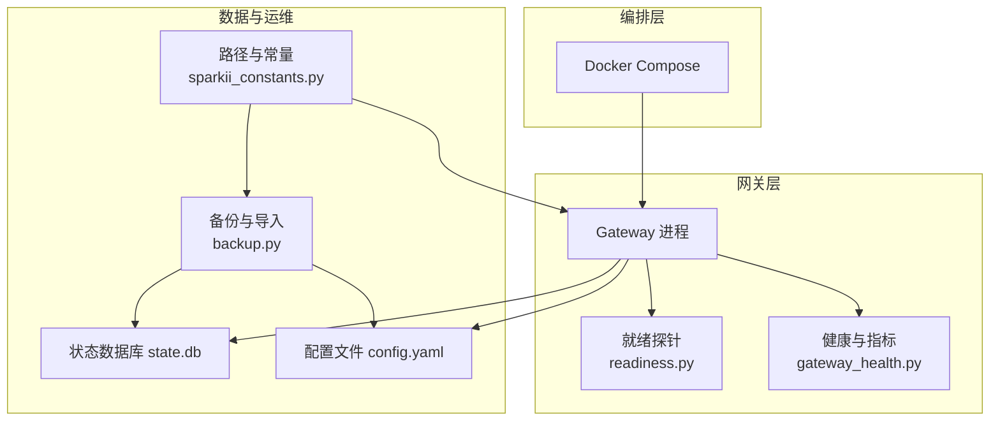
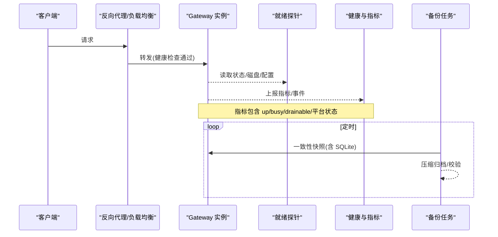
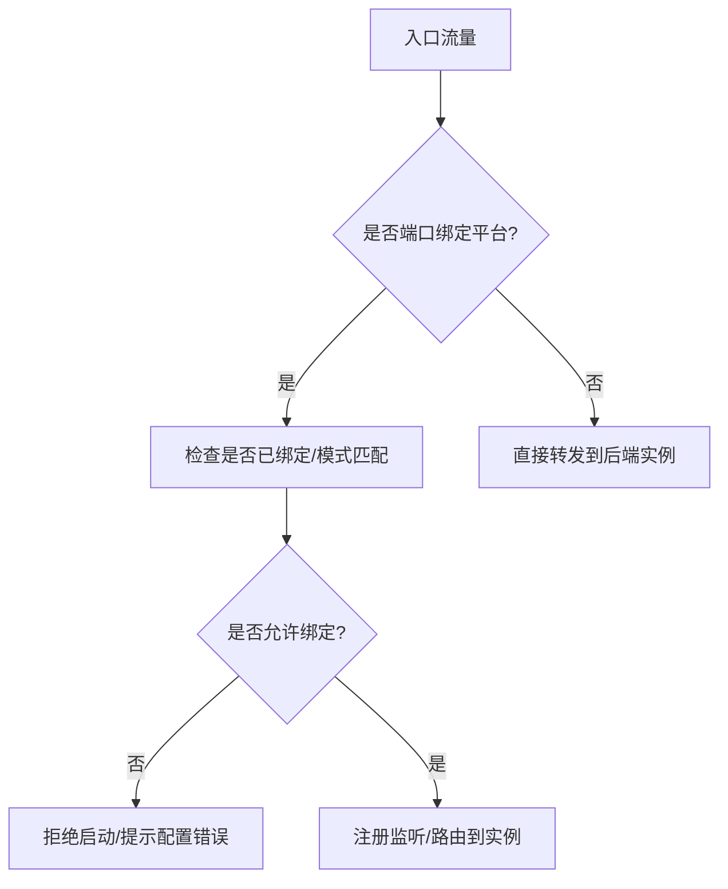
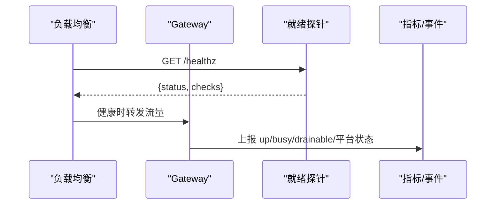
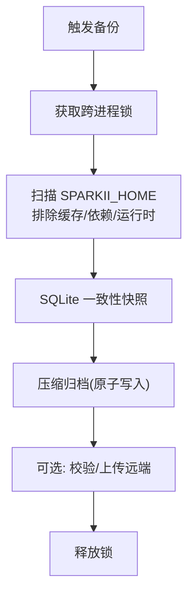
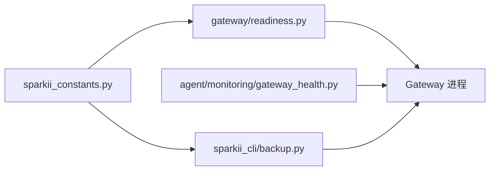

# 高可用性

<cite>
**本文引用的文件**
- [docker-compose.yml](file://docker-compose.yml)
- [gateway/config.py](file://gateway/config.py)
- [sparkii_constants.py](file://sparkii_constants.py)
- [sparkii_cli/backup.py](file://sparkii_cli/backup.py)
- [agent/monitoring/gateway_health.py](file://agent/monitoring/gateway_health.py)
- [gateway/readiness.py](file://gateway/readiness.py)
</cite>

## 目录
1. [简介](#简介)
2. [项目结构](#项目结构)
3. [核心组件](#核心组件)
4. [架构总览](#架构总览)
5. [详细组件分析](#详细组件分析)
6. [依赖关系分析](#依赖关系分析)
7. [性能与容量规划](#性能与容量规划)
8. [故障排除指南](#故障排除指南)
9. [结论](#结论)
10. [附录](#附录)

## 简介
本指南面向生产环境，围绕高可用性（HA）目标提供可操作的配置与实践建议。内容涵盖：负载均衡与反向代理、健康检查与流量分发、故障转移与主从切换、数据备份与恢复、水平扩展（容器编排与服务网格）、监控与告警、容量规划与基准测试，以及生产部署示例与排障要点。所有实践均基于仓库中现有能力进行系统化梳理与组合，确保在不引入外部代码的前提下落地。

## 项目结构
本项目以 Gateway 为核心服务进程，配合 Dashboard、Cron、平台适配器（Telegram/Discord/Slack 等）构成统一入口；通过 Docker Compose 编排运行，内置健康探针与指标采集，支持跨进程备份与一致性快照。

**图表来源**
- [docker-compose.yml:29-77](file://docker-compose.yml#L29-L77)
- [gateway/readiness.py:1-123](file://gateway/readiness.py#L1-L123)
- [agent/monitoring/gateway_health.py:1-470](file://agent/monitoring/gateway_health.py#L1-L470)
- [sparkii_cli/backup.py:1-800](file://sparkii_cli/backup.py#L1-L800)
- [sparkii_constants.py:114-199](file://sparkii_constants.py#L114-L199)

**章节来源**
- [docker-compose.yml:29-77](file://docker-compose.yml#L29-L77)
- [sparkii_constants.py:114-199](file://sparkii_constants.py#L114-L199)

## 核心组件
- 网关与平台适配：Gateway 统一管理多平台接入与消息路由，具备会话生命周期管理、流式输出、平台状态上报等能力。
- 健康与就绪：readiness 提供轻量级就绪探测；gateway_health 产出指标与健康事件，便于外部监控系统消费。
- 备份与恢复：backup 模块实现跨进程锁、SQLite 一致性快照、归档压缩与导入校验，保障数据可恢复性。
- 路径与常量：集中管理 SPARKII_HOME、默认根目录、Node 工具链等关键路径解析，保证多环境一致性。

**章节来源**
- [gateway/config.py:272-418](file://gateway/config.py#L272-L418)
- [gateway/readiness.py:1-123](file://gateway/readiness.py#L1-L123)
- [agent/monitoring/gateway_health.py:210-291](file://agent/monitoring/gateway_health.py#L210-L291)
- [sparkii_cli/backup.py:150-204](file://sparkii_cli/backup.py#L150-L204)
- [sparkii_constants.py:114-199](file://sparkii_constants.py#L114-L199)

## 架构总览
下图展示生产环境下典型的高可用拓扑：外部流量经反向代理进入 Gateway，由编排系统负责实例扩缩容与重启；健康探针与指标用于自动摘除不健康实例；备份策略保障数据持久化与灾难恢复。

**图表来源**
- [gateway/readiness.py:89-119](file://gateway/readiness.py#L89-L119)
- [agent/monitoring/gateway_health.py:210-291](file://agent/monitoring/gateway_health.py#L210-L291)
- [sparkii_cli/backup.py:581-795](file://sparkii_cli/backup.py#L581-L795)

## 详细组件分析

### 负载均衡与反向代理
- 端口绑定与冲突防护：Gateway 对需要监听端口的平台（如 webhook、api_server、feishu 回调等）有明确清单，避免在多实例或多 profile 下重复绑定导致启动失败。
- 多 Profile 复用监听：在 profile 复用模式下，仅默认 profile 持有共享监听器，其他 profile 通过 URL 前缀路由，天然支持单实例多租户。
- 反向代理建议：将 Gateway 暴露于 Nginx/Traefik/云 LB 后，结合 readiness 探针进行健康检查与流量分发；对需鉴权的 API Server 务必启用认证并限制访问范围。

**图表来源**
- [gateway/config.py:376-418](file://gateway/config.py#L376-L418)

**章节来源**
- [gateway/config.py:376-418](file://gateway/config.py#L376-L418)

### 健康检查机制
- 就绪探针（Readiness）：提供 state_db、config、model、disk、gateway、background_queues 等多维度检查，返回 ok/degraded 及计数信息，适合 K8s/LB 使用。
- 健康指标与事件：gateway_health 产出 sparkii.gateway.* 与 sparkii.platform.* 指标，并生成生命周期与平台状态变更事件，便于 Prometheus/Grafana/OTLP 集成。
- 建议：在 LB 或编排系统中配置基于 readiness 的存活/就绪探测；对平台级错误进行分类（认证、限流、超时、网络、配置等），驱动告警与自动隔离。

**图表来源**
- [gateway/readiness.py:89-119](file://gateway/readiness.py#L89-L119)
- [agent/monitoring/gateway_health.py:210-291](file://agent/monitoring/gateway_health.py#L210-L291)

**章节来源**
- [gateway/readiness.py:1-123](file://gateway/readiness.py#L1-L123)
- [agent/monitoring/gateway_health.py:1-470](file://agent/monitoring/gateway_health.py#L1-L470)

### 流量分发策略
- 按平台/通道分流：不同平台（Telegram/Discord/Slack 等）可通过独立 token 与 home_channel 配置，结合 channel_overrides 实现差异化模型/系统提示。
- 多实例横向扩展：结合编排系统的滚动更新与就绪探测，实现无中断扩容；对端口绑定型平台注意实例间端口隔离或复用策略。
- 灰度与回滚：利用 readiness 与指标阈值控制流量比例，异常时快速回滚至稳定版本。

**章节来源**
- [gateway/config.py:593-707](file://gateway/config.py#L593-L707)

### 故障转移与主从切换
- 进程级自愈：通过守护进程（systemd/s6/container）重启失败实例；Gateway 内部维护生命周期状态，便于上层编排识别并剔除。
- 平台级降级：当某平台进入 fatal/degraded 状态，指标与事件会标记错误类别，可在 LB/网关层做临时摘除或降级路由。
- 建议：在主从或多副本场景下，优先采用“无状态实例 + 外部状态存储”的模式；若必须本地状态，请确保数据同步与一致性策略（见备份与恢复）。

**章节来源**
- [agent/monitoring/gateway_health.py:240-291](file://agent/monitoring/gateway_health.py#L240-L291)

### 数据备份与恢复
- 一致性快照：对 SQLite 使用只读连接与 backup() API 获取一致快照，避免 WAL/SHM/JOURNAL 混用导致的不一致。
- 安全归档：跨进程锁防止并发备份；原子写入 zip；跳过缓存/虚拟环境/运行时状态等再生成目录，减小体积并提升速度。
- 导入校验：导入时过滤敏感/易变文件，并对数据库执行完整性检查，确保可恢复性。
- 建议：结合 Cron 定时全量备份，增量策略可通过外部对象存储的版本化能力实现；定期演练恢复流程。

**图表来源**
- [sparkii_cli/backup.py:150-204](file://sparkii_cli/backup.py#L150-L204)
- [sparkii_cli/backup.py:342-374](file://sparkii_cli/backup.py#L342-L374)
- [sparkii_cli/backup.py:581-795](file://sparkii_cli/backup.py#L581-L795)

**章节来源**
- [sparkii_cli/backup.py:1-800](file://sparkii_cli/backup.py#L1-L800)

### 水平扩展配置
- 容器编排：使用 docker-compose 定义 gateway 与 dashboard 服务，挂载数据卷、设置环境变量与重启策略；生产建议使用 K8s 或托管编排，结合 HPA/VPA 自动扩缩容。
- 服务网格：可将 Gateway 作为网格内服务，利用网格侧的熔断、重试、超时、限流与链路追踪增强可靠性。
- 微服务拆分：将平台适配器、工具执行、记忆/技能等模块解耦为独立服务，通过消息总线或 RPC 通信，提升弹性与可维护性。

**章节来源**
- [docker-compose.yml:29-77](file://docker-compose.yml#L29-L77)

### 监控与告警
- 指标：sparkii.gateway.up/busy/drainable、sparkii.platform.up/degraded 等，结合 service.instance.id/version/supervision_mode 标签区分实例与环境。
- 事件：生命周期（startup_failed/stopped）、平台状态变更、日志桥接（warning/error 级别）等，便于构建告警规则。
- 建议：对接 Prometheus/Grafana/OTLP；基于错误分类与阈值设置分级告警（警告/严重），并结合自动化处置（自动重启、摘除、通知）。

**章节来源**
- [agent/monitoring/gateway_health.py:210-291](file://agent/monitoring/gateway_health.py#L210-L291)
- [agent/monitoring/gateway_health.py:427-469](file://agent/monitoring/gateway_health.py#L427-L469)

### 容量规划建议
- 资源估算：根据活跃会话数、平台并发、工具调用频率评估 CPU/内存/IO；大库场景关注磁盘 I/O 与备份窗口。
- 基准测试：模拟峰值负载（消息吞吐、流式响应、工具执行）验证延迟与吞吐；观察 readiness 与指标变化。
- 扩容策略：基于指标（busy/drainable/队列深度）触发水平扩容；对 IO 瓶颈考虑升级磁盘或分离存储。

[本节为通用指导，无需特定文件引用]

## 依赖关系分析
Gateway 的健康与就绪、备份与路径解析之间存在清晰的依赖关系：readiness 依赖状态数据库与配置；gateway_health 依赖运行时状态；backup 依赖路径解析与 SQLite 一致性；constants 提供统一路径与默认值。

**图表来源**
- [sparkii_constants.py:114-199](file://sparkii_constants.py#L114-L199)
- [gateway/readiness.py:1-123](file://gateway/readiness.py#L1-L123)
- [sparkii_cli/backup.py:1-800](file://sparkii_cli/backup.py#L1-L800)
- [agent/monitoring/gateway_health.py:1-470](file://agent/monitoring/gateway_health.py#L1-L470)

**章节来源**
- [sparkii_constants.py:114-199](file://sparkii_constants.py#L114-L199)
- [gateway/readiness.py:1-123](file://gateway/readiness.py#L1-L123)
- [sparkii_cli/backup.py:1-800](file://sparkii_cli/backup.py#L1-L800)
- [agent/monitoring/gateway_health.py:1-470](file://agent/monitoring/gateway_health.py#L1-L470)

## 性能与容量规划
- 流式输出与速率：合理设置编辑间隔与缓冲阈值，避免下游平台限流；在大模型长回复场景下，结合流式传输降低首包延迟。
- 数据库健康：定期校验 state.db 完整性；对超大库采用轻量结构探测替代全量 PRAGMA 检查，减少监控开销。
- 磁盘与缓存：监控磁盘使用率，超过阈值标记 degraded；清理缓存与依赖目录，缩短备份时间。

**章节来源**
- [gateway/readiness.py:61-68](file://gateway/readiness.py#L61-L68)
- [sparkii_cli/backup.py:416-552](file://sparkii_cli/backup.py#L416-L552)

## 故障排除指南
- 启动失败：检查 platform 端口绑定与模式（webhook/websocket）；确认 token 与凭据；查看 readiness 的 state_db/config/model 检查结果。
- 平台异常：依据 gateway_health 的错误分类（auth/rate/timeout/network/config/startup/fatal）定位问题；必要时暂时摘除对应平台流量。
- 备份失败：确认跨进程锁未被占用；检查 SQLite 快照是否成功；核对归档大小与排除规则；导入前执行完整性校验。
- 性能退化：观察 busy/drainable/队列深度；评估磁盘使用率与 I/O；必要时扩容或优化工具调用。

**章节来源**
- [gateway/config.py:376-418](file://gateway/config.py#L376-L418)
- [agent/monitoring/gateway_health.py:70-99](file://agent/monitoring/gateway_health.py#L70-L99)
- [sparkii_cli/backup.py:150-204](file://sparkii_cli/backup.py#L150-L204)
- [gateway/readiness.py:89-119](file://gateway/readiness.py#L89-L119)

## 结论
通过合理的反向代理与健康探针、完善的指标与事件体系、一致的备份与恢复策略，以及容器化与可扩展的编排方式，可以在不修改核心代码的前提下构建高可用的生产环境。建议在生产中持续演练故障注入与恢复流程，结合容量规划与基准测试，确保系统在峰值与异常情况下保持稳定与可恢复。

## 附录
- 生产部署示例（基于 docker-compose）：
  - 使用 host 网络模式与数据卷挂载，设置 UID/GID 保证权限一致。
  - 如需暴露 API Server，启用认证并限制主机；Dashboard 默认仅本地访问，远程请使用隧道或反向代理。
  - 结合编排系统实现自动重启与滚动更新。

**章节来源**
- [docker-compose.yml:13-27](file://docker-compose.yml#L13-L27)
- [docker-compose.yml:29-77](file://docker-compose.yml#L29-L77)