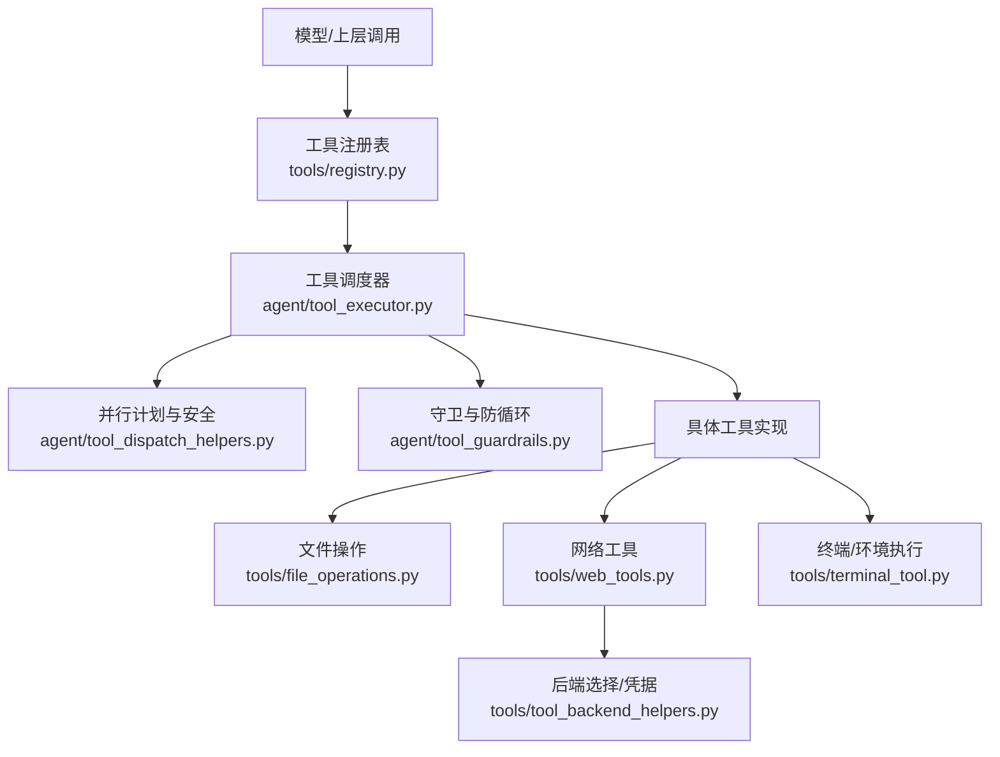
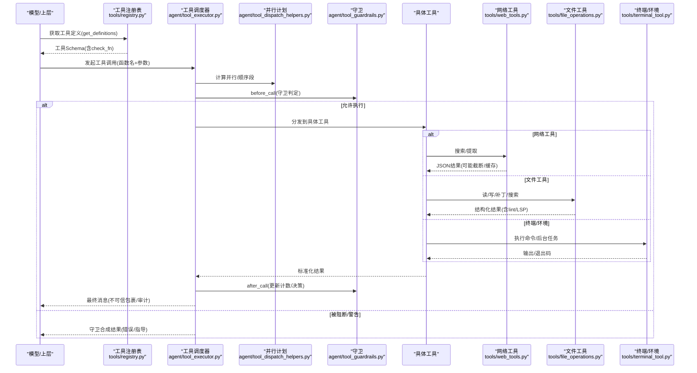
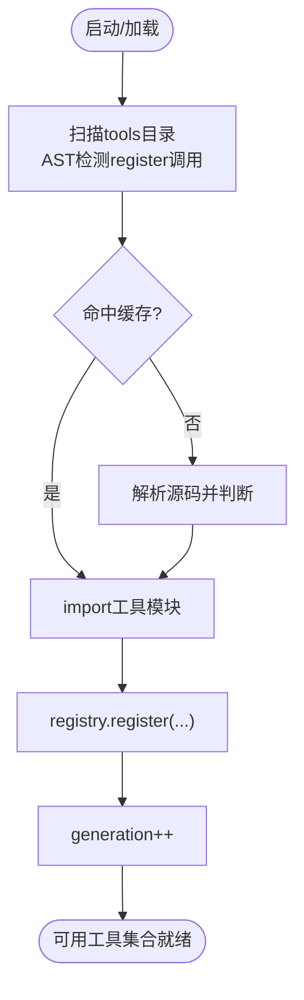
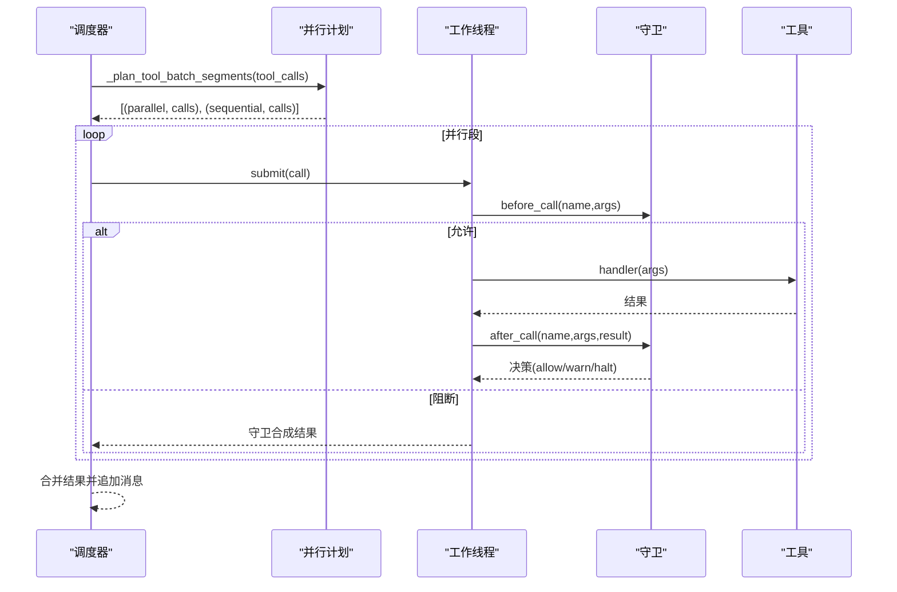
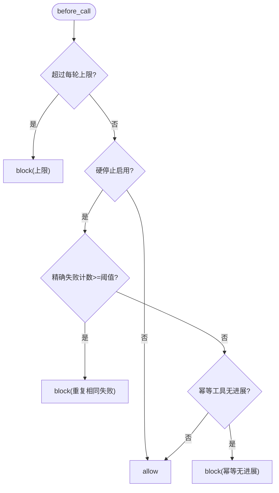
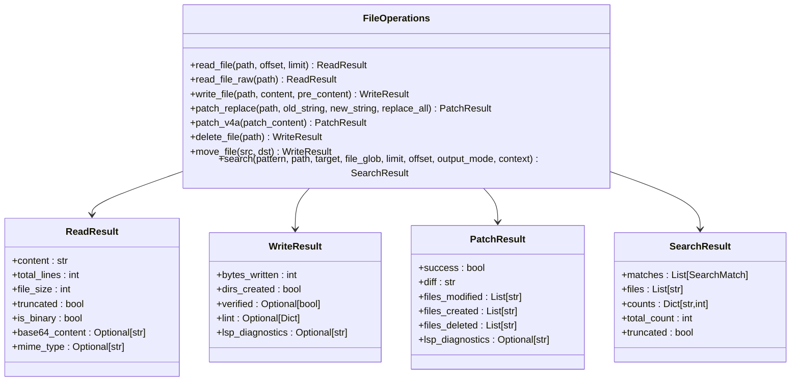
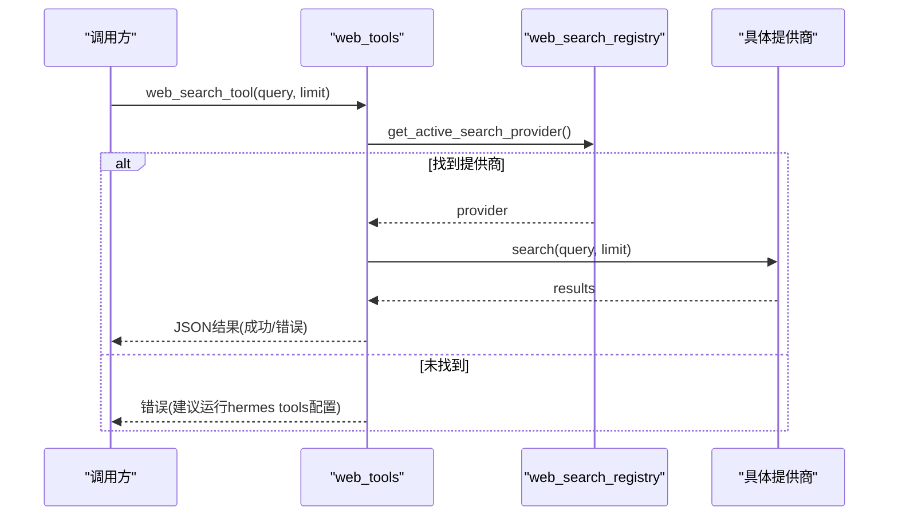
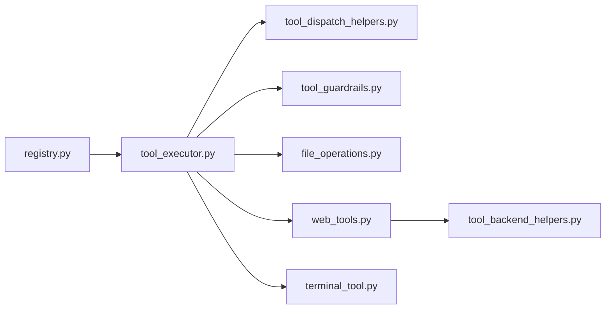

# 工具执行引擎

<cite>
**本文引用的文件**
- [tools/registry.py](file://tools/registry.py)
- [agent/tool_executor.py](file://agent/tool_executor.py)
- [agent/tool_guardrails.py](file://agent/tool_guardrails.py)
- [tools/file_operations.py](file://tools/file_operations.py)
- [tools/web_tools.py](file://tools/web_tools.py)
- [tools/tool_backend_helpers.py](file://tools/tool_backend_helpers.py)
- [agent/tool_dispatch_helpers.py](file://agent/tool_dispatch_helpers.py)
- [tools/terminal_tool.py](file://tools/terminal_tool.py)
</cite>

## 目录
1. [简介](#简介)
2. [项目结构](#项目结构)
3. [核心组件](#核心组件)
4. [架构总览](#架构总览)
5. [详细组件分析](#详细组件分析)
6. [依赖关系分析](#依赖关系分析)
7. [性能考量](#性能考量)
8. [故障排查指南](#故障排查指南)
9. [结论](#结论)
10. [附录](#附录)

## 简介
本文件面向“工具执行引擎”的完整技术文档，覆盖以下目标：
- 工具注册与发现机制：静态注册、动态发现、版本管理与别名。
- 工具调用安全沙箱：权限控制、资源限制、执行隔离与结果包装。
- 参数验证与结果处理：复杂数据类型、流式响应与多模态结果。
- 依赖管理与环境隔离：后端选择、凭据作用域与进程/容器隔离。
- 开发框架与示例：命令行工具、Python函数、外部服务（MCP/插件）等类型及常见场景（文件操作、网络请求、数据处理）。

## 项目结构
围绕工具执行的关键模块分布如下：
- 工具注册与发现：tools/registry.py
- 工具调度与并发执行：agent/tool_executor.py
- 工具守卫与防循环：agent/tool_guardrails.py
- 文件操作工具：tools/file_operations.py
- 网络工具（搜索/提取）：tools/web_tools.py
- 后端选择与凭据解析：tools/tool_backend_helpers.py
- 并行计划与安全边界：agent/tool_dispatch_helpers.py
- 终端与环境执行：tools/terminal_tool.py

**图表来源**
- [tools/registry.py:108-159](file://tools/registry.py#L108-L159)
- [agent/tool_executor.py:758-800](file://agent/tool_executor.py#L758-L800)
- [agent/tool_dispatch_helpers.py:116-234](file://agent/tool_dispatch_helpers.py#L116-L234)
- [agent/tool_guardrails.py:273-348](file://agent/tool_guardrails.py#L273-L348)
- [tools/file_operations.py:451-515](file://tools/file_operations.py#L451-L515)
- [tools/web_tools.py:618-739](file://tools/web_tools.py#L618-L739)
- [tools/terminal_tool.py:1-34](file://tools/terminal_tool.py#L1-L34)
- [tools/tool_backend_helpers.py:20-44](file://tools/tool_backend_helpers.py#L20-L44)

**章节来源**
- [tools/registry.py:108-159](file://tools/registry.py#L108-L159)
- [agent/tool_executor.py:758-800](file://agent/tool_executor.py#L758-L800)
- [agent/tool_dispatch_helpers.py:116-234](file://agent/tool_dispatch_helpers.py#L116-L234)
- [agent/tool_guardrails.py:273-348](file://agent/tool_guardrails.py#L273-L348)
- [tools/file_operations.py:451-515](file://tools/file_operations.py#L451-L515)
- [tools/web_tools.py:618-739](file://tools/web_tools.py#L618-L739)
- [tools/terminal_tool.py:1-34](file://tools/terminal_tool.py#L1-L34)
- [tools/tool_backend_helpers.py:20-44](file://tools/tool_backend_helpers.py#L20-L44)

## 核心组件
- 工具注册表（ToolRegistry）
  - 提供工具元数据、处理器、可用性检查、工具集别名与动态 schema 覆盖。
  - 支持插件覆盖内置工具的显式授权策略，防止误覆盖。
  - 提供 get_definitions 生成 OpenAI 风格工具定义，并缓存 check_fn 避免频繁探测。
- 工具调度器（tool_executor）
  - 负责串行/并发执行、批处理分段、中断与超时、结果持久化与预算控制。
  - 集成中间件链、前置校验、后置钩子与审计上报。
- 工具守卫（tool_guardrails）
  - 检测重复失败、无进展调用、易失性工具滥用，提供警告/阻断/停止决策。
  - 维护每轮上限（如 web_search、delegate_task），防止失控循环。
- 文件操作（file_operations）
  - 统一跨后端的文件读写、补丁、搜索、Lint 与 LSP 诊断。
  - 严格的写入路径拒绝列表、行尾/BOM 处理、分页与截断。
- 网络工具（web_tools）
  - 多后端搜索/提取（Exa、Parallel、Tavily、Firecrawl、SearXNG、Brave、ddgs、xai）。
  - 自动后端选择、凭据与作用域、内容截断与全文缓存、敏感 URL 防护。
- 后端与凭据（tool_backend_helpers）
  - 管理工具网关资格、Modal 模式、浏览器提供者、凭据解析顺序（配置/作用域/.env/凭证池）。
- 并行计划（tool_dispatch_helpers）
  - 将批量工具调用划分为“并行段”和“顺序段”，基于路径冲突与工具类别进行安全调度。
  - 对高风险工具输出进行不可信包裹，抵御间接提示注入。
- 终端与环境（terminal_tool）
  - 本地/Docker/Modal/Vercel Sandbox 等多后端命令执行，支持后台任务、清理与磁盘监控。

**章节来源**
- [tools/registry.py:201-230](file://tools/registry.py#L201-L230)
- [tools/registry.py:414-445](file://tools/registry.py#L414-L445)
- [tools/registry.py:562-644](file://tools/registry.py#L562-L644)
- [agent/tool_executor.py:78-100](file://agent/tool_executor.py#L78-L100)
- [agent/tool_executor.py:482-662](file://agent/tool_executor.py#L482-L662)
- [agent/tool_guardrails.py:63-83](file://agent/tool_guardrails.py#L63-L83)
- [agent/tool_guardrails.py:139-173](file://agent/tool_guardrails.py#L139-L173)
- [tools/file_operations.py:159-243](file://tools/file_operations.py#L159-L243)
- [tools/file_operations.py:451-515](file://tools/file_operations.py#L451-L515)
- [tools/web_tools.py:159-270](file://tools/web_tools.py#L159-L270)
- [tools/web_tools.py:618-739](file://tools/web_tools.py#L618-L739)
- [tools/tool_backend_helpers.py:20-44](file://tools/tool_backend_helpers.py#L20-L44)
- [tools/tool_backend_helpers.py:158-252](file://tools/tool_backend_helpers.py#L158-L252)
- [agent/tool_dispatch_helpers.py:42-73](file://agent/tool_dispatch_helpers.py#L42-L73)
- [agent/tool_dispatch_helpers.py:116-234](file://agent/tool_dispatch_helpers.py#L116-L234)
- [tools/terminal_tool.py:1-34](file://tools/terminal_tool.py#L1-L34)

## 架构总览
工具执行从“注册与发现”到“调度与执行”，再到“守卫与结果处理”的闭环流程如下：

**图表来源**
- [tools/registry.py:717-764](file://tools/registry.py#L717-L764)
- [agent/tool_executor.py:482-662](file://agent/tool_executor.py#L482-L662)
- [agent/tool_dispatch_helpers.py:116-234](file://agent/tool_dispatch_helpers.py#L116-L234)
- [agent/tool_guardrails.py:273-348](file://agent/tool_guardrails.py#L273-L348)
- [tools/web_tools.py:618-739](file://tools/web_tools.py#L618-L739)
- [tools/file_operations.py:451-515](file://tools/file_operations.py#L451-L515)
- [tools/terminal_tool.py:1-34](file://tools/terminal_tool.py#L1-L34)

## 详细组件分析

### 工具注册与发现
- 静态注册：每个工具模块在导入时调用 registry.register(...) 声明名称、工具集、schema、处理器、check_fn、环境变量要求、异步标志、描述、emoji、最大结果大小与动态 schema 覆盖。
- 动态发现：discover_builtin_tools 扫描 tools/*.py，通过 AST 快速判断是否包含顶层 register 调用，使用缓存（mtime+size）避免重复扫描，然后 importlib.import_module 触发注册。
- 版本与别名：ToolRegistry 维护 generation 计数器以支持外部缓存失效；register_toolset_alias 提供工具集别名映射；deregister 支持 MCP 动态刷新时的“删除再重建”。
- 插件覆盖策略：register 支持 override=True，但需 operator 显式授权；deregister 同样受所有权与授权策略保护。

**图表来源**
- [tools/registry.py:108-159](file://tools/registry.py#L108-L159)
- [tools/registry.py:562-644](file://tools/registry.py#L562-L644)
- [tools/registry.py:646-711](file://tools/registry.py#L646-L711)

**章节来源**
- [tools/registry.py:108-159](file://tools/registry.py#L108-L159)
- [tools/registry.py:201-230](file://tools/registry.py#L201-L230)
- [tools/registry.py:414-445](file://tools/registry.py#L414-L445)
- [tools/registry.py:562-644](file://tools/registry.py#L562-L644)
- [tools/registry.py:646-711](file://tools/registry.py#L646-L711)

### 工具调度与并发执行
- 批处理分段：_plan_tool_batch_segments 将工具调用序列切分为“并行段”和“顺序段”，依据工具类别、参数可解析性、路径冲突（read_file/search_files/write_file/patch）决定并发范围。
- 并发执行：execute_tool_calls_concurrent 使用线程池执行并行段，收集结果并按原序追加消息；支持图像生成并发限制、全局超时、中断与增量持久化。
- 中间件与审计：_run_agent_tool_execution_middleware 串联请求中间件、执行中间件、前置阻塞（插件或守卫）、开始回调、后置上报。
- 结果规范化：registry._normalize_handler_result 强制结果为字符串或多模态信封，其他类型转为错误。

**图表来源**
- [agent/tool_dispatch_helpers.py:116-234](file://agent/tool_dispatch_helpers.py#L116-L234)
- [agent/tool_executor.py:482-662](file://agent/tool_executor.py#L482-L662)
- [agent/tool_executor.py:758-800](file://agent/tool_executor.py#L758-L800)
- [tools/registry.py:770-800](file://tools/registry.py#L770-L800)

**章节来源**
- [agent/tool_dispatch_helpers.py:116-234](file://agent/tool_dispatch_helpers.py#L116-L234)
- [agent/tool_executor.py:482-662](file://agent/tool_executor.py#L482-L662)
- [agent/tool_executor.py:758-800](file://agent/tool_executor.py#L758-L800)
- [tools/registry.py:770-800](file://tools/registry.py#L770-L800)

### 工具守卫与防循环
- 分类与阈值：ToolCallGuardrailConfig 支持警告与硬停止阈值；LoopCapConfig 设置每轮上限（web_search、delegate_task）。
- 决策流程：before_call 先检查环路上限，再根据 exact_failure/same_tool_failure/no_progress 计数决定是否阻断；after_call 更新计数并返回告警/停止决策。
- 合成结果：toolguard_synthetic_result 为阻断调用生成结构化错误，append_toolguard_guidance 附加指导信息。

**图表来源**
- [agent/tool_guardrails.py:63-83](file://agent/tool_guardrails.py#L63-L83)
- [agent/tool_guardrails.py:139-173](file://agent/tool_guardrails.py#L139-L173)
- [agent/tool_guardrails.py:273-348](file://agent/tool_guardrails.py#L273-L348)
- [agent/tool_guardrails.py:447-507](file://agent/tool_guardrails.py#L447-L507)

**章节来源**
- [agent/tool_guardrails.py:63-83](file://agent/tool_guardrails.py#L63-L83)
- [agent/tool_guardrails.py:139-173](file://agent/tool_guardrails.py#L139-L173)
- [agent/tool_guardrails.py:273-348](file://agent/tool_guardrails.py#L273-L348)
- [agent/tool_guardrails.py:447-507](file://agent/tool_guardrails.py#L447-L507)

### 文件操作工具
- 抽象接口：FileOperations 定义 read_file/read_file_raw/write_file/patch_v4a/delete_file/move_file/search 等。
- 结果模型：ReadResult/WriteResult/PatchResult/SearchResult/LintResult/ExecuteResult 提供结构化输出，含 lint、lsp_diagnostics、diff、files_modified 等。
- 安全与质量：写入路径拒绝列表、BOM/行尾处理、JSON/YAML/TOML/Python 内联语法检查、shell linters 降级与跳过逻辑。
- 搜索优化：rg/grep 输出清洗、上下文行解析、超时标记、匹配密度压缩。

**图表来源**
- [tools/file_operations.py:451-515](file://tools/file_operations.py#L451-L515)
- [tools/file_operations.py:159-243](file://tools/file_operations.py#L159-L243)
- [tools/file_operations.py:246-329](file://tools/file_operations.py#L246-L329)

**章节来源**
- [tools/file_operations.py:451-515](file://tools/file_operations.py#L451-L515)
- [tools/file_operations.py:159-243](file://tools/file_operations.py#L159-L243)
- [tools/file_operations.py:246-329](file://tools/file_operations.py#L246-L329)

### 网络工具（搜索/提取）
- 后端选择：优先读取 web.search_backend / web.extract_backend，否则回退到共享 backend；按环境变量与包可用性探测。
- 提供商：Exa、Parallel、Tavily、Firecrawl、SearXNG、Brave-free、ddgs、xai；支持插件注册与 is_available 探测。
- 内容处理：页面截断（head+tail）、全文缓存、Base64图片替换为占位符、URL 敏感参数过滤。
- 调试与指标：DebugSession 记录调用参数、结果数量、响应大小。

**图表来源**
- [tools/web_tools.py:159-270](file://tools/web_tools.py#L159-L270)
- [tools/web_tools.py:618-739](file://tools/web_tools.py#L618-L739)

**章节来源**
- [tools/web_tools.py:159-270](file://tools/web_tools.py#L159-L270)
- [tools/web_tools.py:618-739](file://tools/web_tools.py#L618-L739)

### 终端与环境执行
- 多后端：local、docker、modal、vercel_sandbox；支持后台任务、生命周期管理与自动清理。
- 凭据与作用域：通过 tool_backend_helpers 解析 Modal 模式、Nous 工具网关资格、浏览器提供者等。
- 安全与限制：前台超时上限、磁盘使用告警、Vercel 运行时校验与认证配置。

**章节来源**
- [tools/terminal_tool.py:1-34](file://tools/terminal_tool.py#L1-L34)
- [tools/tool_backend_helpers.py:20-44](file://tools/tool_backend_helpers.py#L20-L44)
- [tools/tool_backend_helpers.py:74-141](file://tools/tool_backend_helpers.py#L74-L141)

## 依赖关系分析
- 低耦合高内聚：工具注册表独立于具体工具实现；调度器通过中间件与守卫解耦业务逻辑。
- 关键依赖链：
  - 注册表 -> 工具定义 -> 调度器 -> 并行计划 -> 守卫 -> 具体工具 -> 后端选择。
  - 网络工具依赖 web_search_registry 与插件；文件工具依赖 LSP/linters；终端工具依赖环境与凭据。
- 潜在循环：通过延迟导入（如 from tools.mcp_tool import ...）避免循环依赖。

**图表来源**
- [tools/registry.py:108-159](file://tools/registry.py#L108-L159)
- [agent/tool_executor.py:482-662](file://agent/tool_executor.py#L482-L662)
- [agent/tool_dispatch_helpers.py:116-234](file://agent/tool_dispatch_helpers.py#L116-L234)
- [agent/tool_guardrails.py:273-348](file://agent/tool_guardrails.py#L273-L348)
- [tools/file_operations.py:451-515](file://tools/file_operations.py#L451-L515)
- [tools/web_tools.py:618-739](file://tools/web_tools.py#L618-L739)
- [tools/terminal_tool.py:1-34](file://tools/terminal_tool.py#L1-L34)
- [tools/tool_backend_helpers.py:20-44](file://tools/tool_backend_helpers.py#L20-L44)

**章节来源**
- [tools/registry.py:108-159](file://tools/registry.py#L108-L159)
- [agent/tool_executor.py:482-662](file://agent/tool_executor.py#L482-L662)
- [agent/tool_dispatch_helpers.py:116-234](file://agent/tool_dispatch_helpers.py#L116-L234)
- [agent/tool_guardrails.py:273-348](file://agent/tool_guardrails.py#L273-L348)
- [tools/file_operations.py:451-515](file://tools/file_operations.py#L451-L515)
- [tools/web_tools.py:618-739](file://tools/web_tools.py#L618-L739)
- [tools/terminal_tool.py:1-34](file://tools/terminal_tool.py#L1-L34)
- [tools/tool_backend_helpers.py:20-44](file://tools/tool_backend_helpers.py#L20-L44)

## 性能考量
- 注册发现缓存：基于 mtime+size 的工具发现缓存减少 AST 扫描开销。
- check_fn TTL：可用性检查缓存 30 秒，配合“最近成功宽限”抑制瞬态失败导致的工具丢失。
- 并发与限速：最大工作线程数、图像生成并发限制、批处理分段避免路径冲突。
- 结果预算：按上下文窗口缩放工具结果预算，防止单次大结果导致请求超限。
- 网络内容截断：页面 head+tail 截断与全文缓存，减少上下文占用。

[本节为通用性能讨论，不直接分析具体文件]

## 故障排查指南
- 工具不可用
  - 检查 check_fn 缓存与 TTL；确认环境变量/凭据已设置；查看日志中“Tool unavailable (check failed)”提示。
  - 参考：[tools/registry.py:717-764](file://tools/registry.py#L717-L764)
- 工具被守卫阻断
  - 查看守卫决策代码与消息；调整 tool_loop_guardrails 配置；避免重复相同失败调用。
  - 参考：[agent/tool_guardrails.py:273-348](file://agent/tool_guardrails.py#L273-L348)
- 网络工具报错
  - 确认后端选择与 API Key；检查插件是否启用；查看 web_tools_debug 输出。
  - 参考：[tools/web_tools.py:618-739](file://tools/web_tools.py#L618-L739)
- 文件写入失败
  - 检查写入路径是否在拒绝列表；确认 Lint/LSP 诊断；查看 WriteResult.error/warning。
  - 参考：[tools/file_operations.py:159-243](file://tools/file_operations.py#L159-L243)
- 终端执行超时/权限问题
  - 检查前端超时上限、磁盘告警阈值；确认后端认证配置（如 Vercel/Modal）。
  - 参考：[tools/terminal_tool.py:118-196](file://tools/terminal_tool.py#L118-L196)

**章节来源**
- [tools/registry.py:717-764](file://tools/registry.py#L717-L764)
- [agent/tool_guardrails.py:273-348](file://agent/tool_guardrails.py#L273-L348)
- [tools/web_tools.py:618-739](file://tools/web_tools.py#L618-L739)
- [tools/file_operations.py:159-243](file://tools/file_operations.py#L159-L243)
- [tools/terminal_tool.py:118-196](file://tools/terminal_tool.py#L118-L196)

## 结论
该工具执行引擎通过“注册与发现—调度与并发—守卫与结果处理”的分层设计，实现了高内聚、可扩展且安全的工具生态。其关键优势包括：
- 灵活的注册与动态发现机制，支持插件与 MCP 工具。
- 强大的并发与并行计划，保障正确性与性能。
- 完善的守卫与防循环策略，防止失控调用。
- 丰富的工具实现与后端选择，覆盖文件、网络、终端等常见场景。
- 严格的安全与资源限制，确保执行隔离与结果可信。

[本节为总结性内容，不直接分析具体文件]

## 附录
- 开发框架建议
  - 命令行工具：封装为 Python 函数并通过 registry.register 暴露；使用 check_fn 探测依赖。
  - Python 函数：遵循标准输入输出契约，返回字符串或多模态信封；注意结果大小与错误格式。
  - 外部服务（MCP/插件）：通过插件注册与动态刷新；遵守工具集别名与覆盖策略。
- 常见场景示例
  - 文件操作：read_file、write_file、patch_v4a、search_files。
  - 网络请求：web_search_tool、web_extract_tool。
  - 数据处理：结合 file_operations 的 Lint/LSP 与 web_tools 的内容截断与缓存。

[本节为概念性内容，不直接分析具体文件]