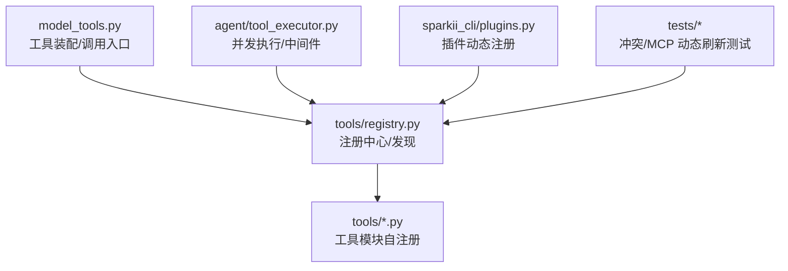
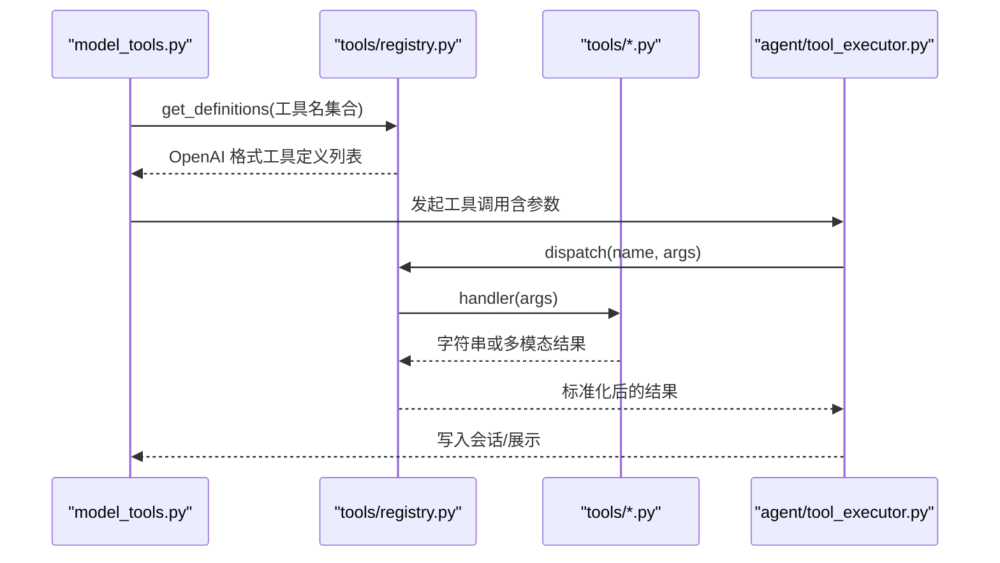
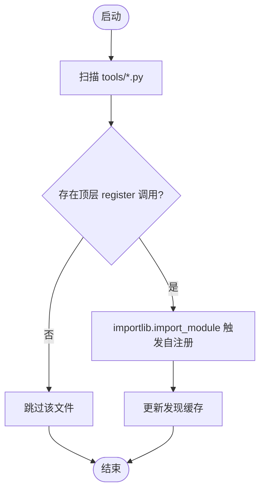
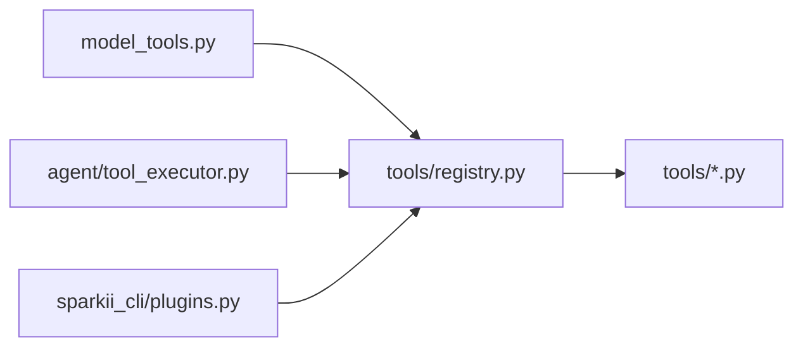

# 工具注册与发现

<cite>
**本文引用的文件**
- [tools/registry.py](file://tools/registry.py)
- [agent/tool_executor.py](file://agent/tool_executor.py)
- [model_tools.py](file://model_tools.py)
- [tools/file_tools.py](file://tools/file_tools.py)
- [sparkii_cli/plugins.py](file://sparkii_cli/plugins.py)
- [tests/hermes_cli/test_plugins.py](file://tests/hermes_cli/test_plugins.py)
- [tests/tools/test_mcp_tool.py](file://tests/tools/test_mcp_tool.py)
</cite>

## 目录
1. [简介](#简介)
2. [项目结构](#项目结构)
3. [核心组件](#核心组件)
4. [架构总览](#架构总览)
5. [详细组件分析](#详细组件分析)
6. [依赖关系分析](#依赖关系分析)
7. [性能考量](#性能考量)
8. [故障排查指南](#故障排查指南)
9. [结论](#结论)
10. [附录](#附录)

## 简介
本文件系统性阐述工具注册与发现机制，覆盖静态注册流程（装饰器/元数据/依赖声明）、动态发现（文件系统扫描、包导入、远程注册）、版本管理与兼容性、命名规范与分类体系、搜索索引构建、冲突检测与解决策略、热重载机制，并提供完整示例路径以涵盖简单函数、类方法与异步方法等类型。

## 项目结构
围绕“工具注册与发现”的核心代码集中在以下模块：
- 工具注册中心与发现：tools/registry.py
- 工具执行与调度：agent/tool_executor.py
- 模型侧工具装配与调用入口：model_tools.py
- 典型工具实现（用于理解注册方式）：tools/file_tools.py
- 插件扩展点（动态注册）：sparkii_cli/plugins.py
- 测试用例（覆盖冲突、MCP 动态刷新等）：tests/hermes_cli/test_plugins.py、tests/tools/test_mcp_tool.py

图表来源
- [tools/registry.py:108-159](file://tools/registry.py#L108-L159)
- [agent/tool_executor.py:758-800](file://agent/tool_executor.py#L758-L800)
- [sparkii_cli/plugins.py:478-490](file://sparkii_cli/plugins.py#L478-L490)

章节来源
- [tools/registry.py:1-159](file://tools/registry.py#L1-L159)
- [agent/tool_executor.py:1-120](file://agent/tool_executor.py#L1-L120)
- [sparkii_cli/plugins.py:30-60](file://sparkii_cli/plugins.py#L30-L60)

## 核心组件
- ToolEntry：单条工具的元数据载体，包含名称、工具集、Schema、处理器、可用性检查、环境依赖、是否异步、描述、表情、结果大小限制、动态 Schema 覆盖等。
- ToolRegistry：全局单例注册表，提供注册、注销、查询、分发、工具集别名、生成号（用于缓存失效）等能力。
- 发现机制：discover_builtin_tools 通过 AST 扫描 tools/*.py，识别顶层 registry.register 调用，并仅导入这些模块完成自注册；同时维护磁盘缓存加速重复启动。
- check_fn 缓存：对外部状态探测（如 Docker/Playwright）进行 TTL+失败宽限的缓存，避免瞬时抖动导致工具不可用。
- 结果规范化与错误边界：统一返回字符串或受支持的多模态信封，异常被捕获并以结构化错误返回。

章节来源
- [tools/registry.py:201-231](file://tools/registry.py#L201-L231)
- [tools/registry.py:414-436](file://tools/registry.py#L414-L436)
- [tools/registry.py:108-159](file://tools/registry.py#L108-L159)
- [tools/registry.py:233-388](file://tools/registry.py#L233-L388)
- [tools/registry.py:801-834](file://tools/registry.py#L801-L834)

## 架构总览
工具从“定义—注册—发现—装配—执行—结果处理”的全链路如下：

图表来源
- [tools/registry.py:717-764](file://tools/registry.py#L717-L764)
- [tools/registry.py:801-834](file://tools/registry.py#L801-L834)
- [agent/tool_executor.py:758-800](file://agent/tool_executor.py#L758-L800)

## 详细组件分析

### 静态注册流程（装饰器/元数据/依赖声明）
- 注册入口：每个工具模块在模块级调用 registry.register(...)，声明 name、toolset、schema、handler、check_fn、requires_env、is_async、description、emoji、max_result_size_chars、dynamic_schema_overrides、override 等。
- 元数据与 Schema：ToolEntry.schema 为 OpenAI function schema；name 由注册中心注入；description/emoji 用于 UI 展示；requires_env 用于工具集需求聚合。
- 依赖声明：check_fn 用于运行时可用性探测（如 Docker/Playwright），并通过 TTL+失败宽限缓存；requires_env 用于 UI 提示与环境校验。
- 装饰器模式：工具模块通常将 handler 作为普通函数/类方法/异步函数暴露，并在模块顶部调用 registry.register(...) 完成绑定。

章节来源
- [tools/registry.py:562-644](file://tools/registry.py#L562-L644)
- [tools/registry.py:201-231](file://tools/registry.py#L201-L231)
- [tools/registry.py:233-388](file://tools/registry.py#L233-L388)

### 动态发现机制（文件系统扫描、包导入、远程注册）
- 文件系统扫描：discover_builtin_tools 遍历 tools/*.py，使用 AST 解析判断是否存在顶层 registry.register(...) 调用，命中则记录模块名。
- 包导入：对命中的模块执行 importlib.import_module，触发其模块级自注册。
- 远程注册：通过 sparkii_cli/plugins.py 的插件机制，在插件加载时调用 registry.register(...) 完成动态注册；MCP 动态刷新也可通过 deregister/register 重放工具集。

图表来源
- [tools/registry.py:84-159](file://tools/registry.py#L84-L159)
- [sparkii_cli/plugins.py:478-490](file://sparkii_cli/plugins.py#L478-L490)

章节来源
- [tools/registry.py:84-159](file://tools/registry.py#L84-L159)
- [sparkii_cli/plugins.py:30-60](file://sparkii_cli/plugins.py#L30-L60)

### 工具版本管理（向后兼容、废弃警告、升级路径）
- 向后兼容：get_definitions 始终保证 schema 中包含 name；dynamic_schema_overrides 允许在运行时按配置调整字段（例如委托任务描述），不影响历史调用方。
- 废弃与降级：若某工具不再可用（check_fn 失败），将被过滤出定义列表；UI 可通过 get_available_toolsets/check_tool_availability 获取不可用信息。
- 升级路径：通过 override=True 显式替换内置工具实现；deregister 可移除旧工具后再注册新版本，但需满足权限策略（插件需 operator opt-in）。

章节来源
- [tools/registry.py:717-764](file://tools/registry.py#L717-L764)
- [tools/registry.py:562-644](file://tools/registry.py#L562-L644)
- [tools/registry.py:646-711](file://tools/registry.py#L646-L711)

### 命名规范、分类体系与搜索索引构建
- 命名规范：name 唯一且跨 toolset 不冲突；同名不同 toolset 会被拒绝（除非 override=True）。
- 分类体系：toolset 作为分组维度，支持别名映射（register_toolset_alias/get_toolset_alias_target）。
- 搜索索引：get_tool_names_for_toolset、get_tool_to_toolset_map、get_all_tool_names 提供索引视图；_tool_search_scoped_names 结合启用/禁用工具集生成受限可调用集合，供工具搜索使用。

章节来源
- [tools/registry.py:476-507](file://tools/registry.py#L476-L507)
- [tools/registry.py:850-875](file://tools/registry.py#L850-L875)
- [agent/tool_executor.py:333-379](file://agent/tool_executor.py#L333-L379)

### 冲突检测与解决策略
- 冲突检测：当同名工具来自不同 toolset 时，默认拒绝覆盖；日志记录并返回。
- 解决策略：
  - 显式覆盖：override=True 允许替换（插件需 operator opt-in）。
  - 先删后加：deregister 移除旧工具再注册新工具（同样受权限策略约束）。
  - MCP 动态刷新：mcp-* 工具集豁免部分权限检查，支持重新注册。

章节来源
- [tools/registry.py:562-644](file://tools/registry.py#L562-L644)
- [tools/registry.py:646-711](file://tools/registry.py#L646-L711)

### 工具热重载机制
- 生成号（generation）：每次注册/注销/别名变更都会递增，外部调用方可据此失效缓存（例如工具定义缓存）。
- 动态刷新：MCP 服务器发送通知后可通过 deregister 清理并重新 register，实现热重载。
- 插件加载：插件加载阶段即可注册工具，无需重启进程。

章节来源
- [tools/registry.py:414-436](file://tools/registry.py#L414-L436)
- [tools/registry.py:646-711](file://tools/registry.py#L646-L711)

### 完整注册示例（函数/类方法/异步方法）
- 简单函数：在工具模块中定义 handler 函数，并在模块顶层调用 registry.register(...) 绑定 name/toolset/schema/handler/is_async=False。
- 类方法：将 handler 指向类的实例方法，注册方式相同；注意 is_async 根据方法签名设置。
- 异步方法：将 is_async=True 传入 register，注册中心会在 dispatch 时自动桥接异步执行。

参考路径（不包含具体代码内容）：
- 工具模块自注册示例：[tools/file_tools.py](file://tools/file_tools.py)
- 插件动态注册示例：[sparkii_cli/plugins.py:478-490](file://sparkii_cli/plugins.py#L478-L490)
- 测试覆盖冲突与 override：[tests/hermes_cli/test_plugins.py](file://tests/hermes_cli/test_plugins.py)
- 测试覆盖 MCP 动态刷新与冲突：[tests/tools/test_mcp_tool.py](file://tests/tools/test_mcp_tool.py)

章节来源
- [tools/file_tools.py:1-200](file://tools/file_tools.py#L1-L200)
- [sparkii_cli/plugins.py:478-490](file://sparkii_cli/plugins.py#L478-L490)
- [tests/hermes_cli/test_plugins.py:780-880](file://tests/hermes_cli/test_plugins.py#L780-L880)
- [tests/tools/test_mcp_tool.py:1060-1080](file://tests/tools/test_mcp_tool.py#L1060-L1080)

## 依赖关系分析
- model_tools.py 负责工具定义的装配与调用入口，依赖 registry.get_definitions 获取工具 Schema。
- agent/tool_executor.py 负责并发执行、中间件、授权门控与结果收集，依赖 registry.dispatch 执行具体工具。
- tools/registry.py 是核心，被多处引用，提供注册、发现、查询、分发能力。
- sparkii_cli/plugins.py 在插件加载时向 registry 注册工具，形成动态扩展。

图表来源
- [model_tools.py:1-20](file://model_tools.py#L1-L20)
- [tools/registry.py:108-159](file://tools/registry.py#L108-L159)
- [agent/tool_executor.py:758-800](file://agent/tool_executor.py#L758-L800)
- [sparkii_cli/plugins.py:478-490](file://sparkii_cli/plugins.py#L478-L490)

章节来源
- [tools/registry.py:108-159](file://tools/registry.py#L108-L159)
- [agent/tool_executor.py:758-800](file://agent/tool_executor.py#L758-L800)
- [sparkii_cli/plugins.py:478-490](file://sparkii_cli/plugins.py#L478-L490)

## 性能考量
- 发现缓存：基于 (mtime_ns, size) 的文件级缓存，避免重复 AST 解析；首次冷启动开销约 145ms（~100 文件）。
- check_fn 缓存：TTL 约 30 秒，配合最近成功时间窗口内的失败宽限（约 60 秒），减少瞬时抖动导致的工具不可用。
- 并发执行：工具执行支持线程池并行，默认最大工作线程数有限制，图片生成有独立并发上限。
- 结果大小控制：每工具可配置 max_result_size_chars，防止大结果污染上下文。

章节来源
- [tools/registry.py:108-159](file://tools/registry.py#L108-L159)
- [tools/registry.py:233-388](file://tools/registry.py#L233-L388)
- [agent/tool_executor.py:93-112](file://agent/tool_executor.py#L93-L112)
- [agent/tool_executor.py:209-246](file://agent/tool_executor.py#L209-L246)

## 故障排查指南
- 工具不可用：检查 check_fn 是否失败（网络/SDK/二进制缺失），查看日志中关于 check_fn 失败的告警；必要时调用 invalidate_check_fn_cache 清除缓存。
- 工具冲突：若出现同名工具来自不同 toolset 的拒绝日志，确认是否需要 override=True 或先 deregister。
- 插件覆盖权限：插件尝试覆盖内置工具时需 operator opt-in，否则抛出 PermissionError。
- MCP 动态刷新：若工具列表未更新，检查是否调用了 deregister/register 序列，或服务器是否发送了 list_changed 通知。

章节来源
- [tools/registry.py:233-388](file://tools/registry.py#L233-L388)
- [tools/registry.py:562-644](file://tools/registry.py#L562-L644)
- [tools/registry.py:646-711](file://tools/registry.py#L646-L711)

## 结论
本系统通过“静态自注册 + 动态发现 + 插件扩展”的组合，实现了高内聚、可扩展的工具生态。注册中心统一管理工具元数据、可用性检查与分发，配合缓存与并发执行保障性能与稳定性。通过严格的冲突检测与权限策略，确保多来源工具的安全共存与可控替换。

## 附录
- 快速上手建议：
  - 新增工具：在 tools/ 下新建模块，定义 handler 并在模块顶层调用 registry.register(...)。
  - 动态扩展：在插件中通过 sparkii_cli/plugins.py 提供的接口注册工具。
  - 调试：利用 get_definitions/get_all_tool_names 等查询接口验证注册结果；通过日志定位 check_fn 与冲突问题。
- 相关测试用例可作为最佳实践参考：
  - 冲突与覆盖：[tests/hermes_cli/test_plugins.py](file://tests/hermes_cli/test_plugins.py)
  - MCP 动态刷新：[tests/tools/test_mcp_tool.py](file://tests/tools/test_mcp_tool.py)