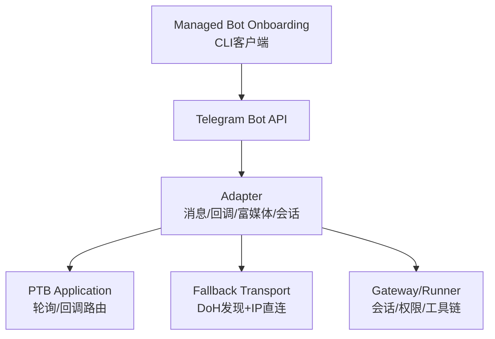
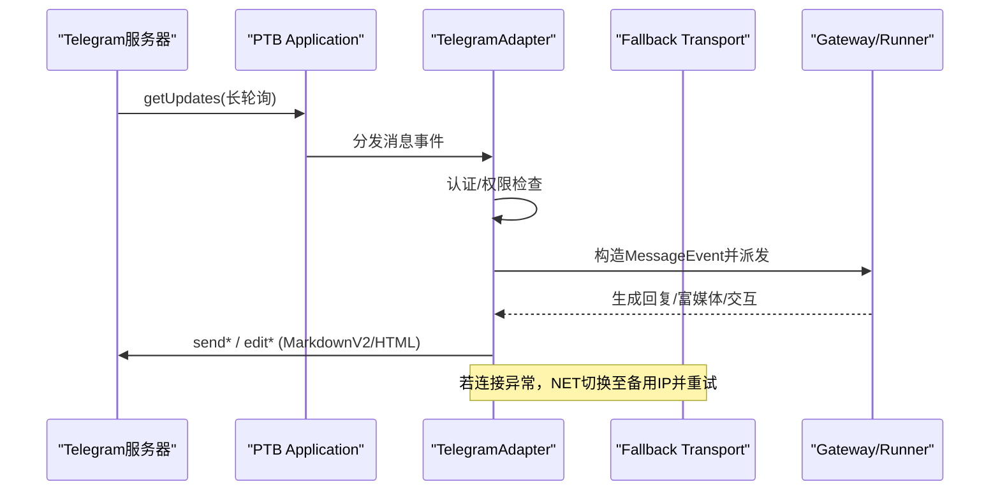
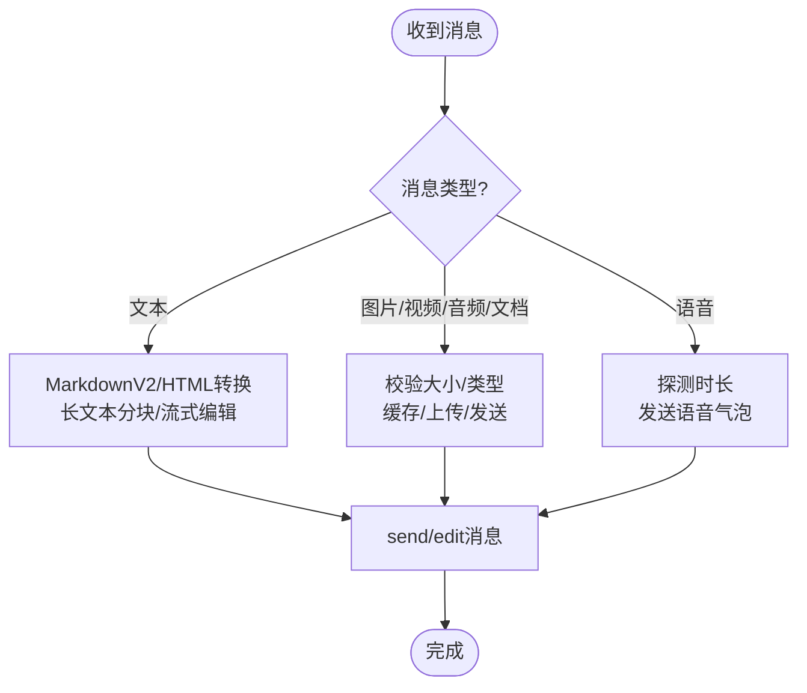
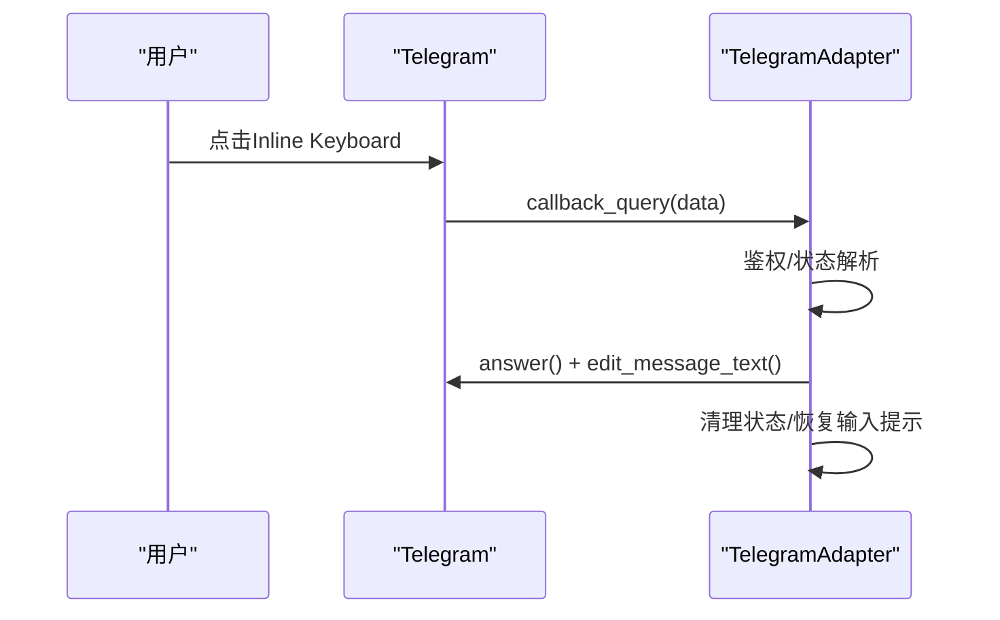
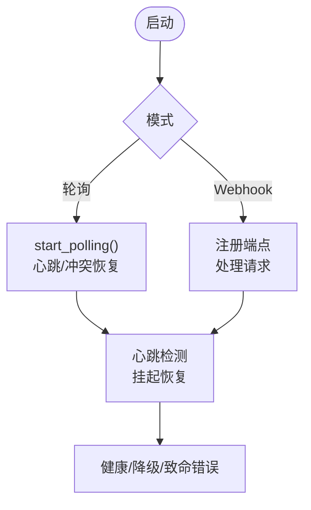
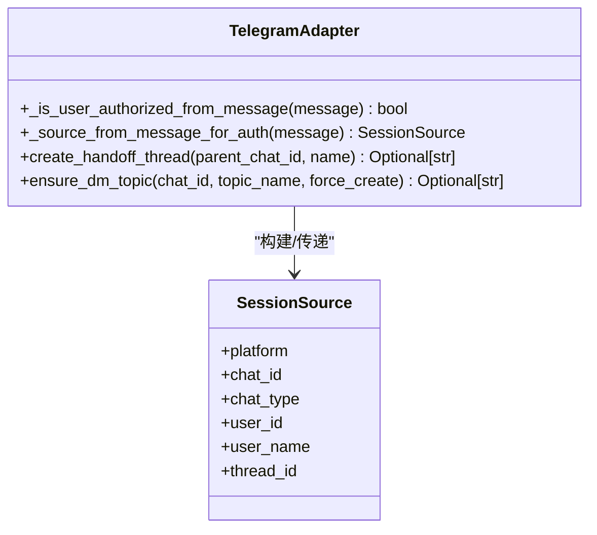
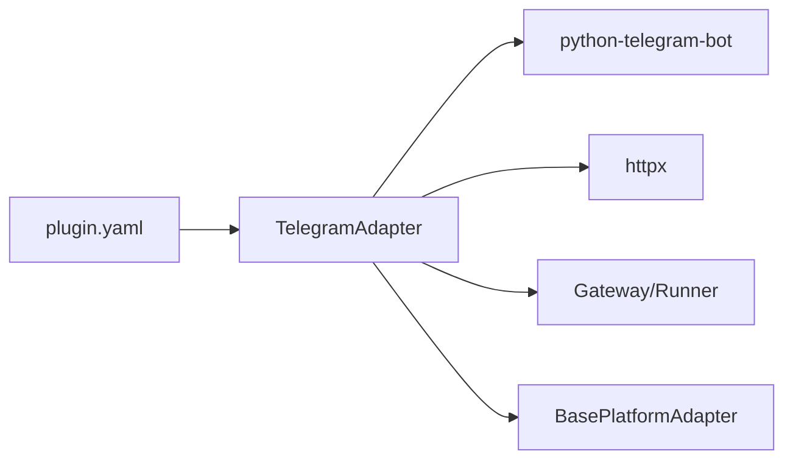

# Telegram适配器

<cite>
**本文引用的文件**
- [plugins/platforms/telegram/adapter.py](file://plugins/platforms/telegram/adapter.py)
- [plugins/platforms/telegram/telegram_network.py](file://plugins/platforms/telegram/telegram_network.py)
- [plugins/platforms/telegram/plugin.yaml](file://plugins/platforms/telegram/plugin.yaml)
- [sparkii_cli/telegram_managed_bot.py](file://sparkii_cli/telegram_managed_bot.py)
</cite>

## 目录
1. [简介](#简介)
2. [项目结构](#项目结构)
3. [核心组件](#核心组件)
4. [架构总览](#架构总览)
5. [详细组件分析](#详细组件分析)
6. [依赖关系分析](#依赖关系分析)
7. [性能考虑](#性能考虑)
8. [故障排查指南](#故障排查指南)
9. [结论](#结论)
10. [附录：配置与最佳实践](#附录：配置与最佳实践)

## 简介
本文件面向Telegram平台适配器的实现与使用，覆盖消息收发、富媒体处理、交互式组件（Inline Keyboard、Reply Keyboard）、Webhook与轮询模式、频道与群组权限控制、语音消息处理、文件上传限制、会话绑定、用户身份验证与权限管理、错误处理策略（速率限制、连接重试、断线重连）以及性能优化建议。该适配器基于python-telegram-bot构建，提供高可用的长轮询连接、失败回退网络路径、流式编辑与批量聚合等能力。

## 项目结构
Telegram适配器由以下关键部分组成：
- 适配器主类与消息/回调处理：位于插件的适配器模块中，负责消息接收、发送、富文本渲染、交互按钮回调、会话与主题管理等。
- 网络回退传输：为api.telegram.org提供DNS不可达时的IP直连回退能力，保持TLS/SNI不变。
- 插件元数据与环境变量声明：定义必需与可选环境变量，便于部署与引导。
- 托管机器人创建客户端：通过托管Bot流程自动创建子机器人并获取令牌。

图表来源
- [plugins/platforms/telegram/adapter.py:633-904](file://plugins/platforms/telegram/adapter.py#L633-L904)
- [plugins/platforms/telegram/telegram_network.py:52-166](file://plugins/platforms/telegram/telegram_network.py#L52-L166)
- [sparkii_cli/telegram_managed_bot.py:166-359](file://sparkii_cli/telegram_managed_bot.py#L166-L359)

章节来源
- [plugins/platforms/telegram/adapter.py:1-309](file://plugins/platforms/telegram/adapter.py#L1-L309)
- [plugins/platforms/telegram/telegram_network.py:1-306](file://plugins/platforms/telegram/telegram_network.py#L1-L306)
- [plugins/platforms/telegram/plugin.yaml:1-36](file://plugins/platforms/telegram/plugin.yaml#L1-L36)
- [sparkii_cli/telegram_managed_bot.py:1-359](file://sparkii_cli/telegram_managed_bot.py#L1-L359)

## 核心组件
- TelegramAdapter：继承基础平台适配器，封装Telegram Bot API调用、消息批处理、流式编辑、富媒体发送、MarkdownV2/HTML渲染、线程/话题支持、命令注册、状态指示器、通知模式等。
- TelegramFallbackTransport：httpx传输层封装，当主域名不可达时尝试已知或DoH发现的IPv4地址，保持host与SNI不变。
- Managed Bot Onboarding：通过托管Bot服务完成机器人创建与令牌获取，支持二维码与深链引导。

章节来源
- [plugins/platforms/telegram/adapter.py:633-904](file://plugins/platforms/telegram/adapter.py#L633-L904)
- [plugins/platforms/telegram/telegram_network.py:52-166](file://plugins/platforms/telegram/telegram_network.py#L52-L166)
- [sparkii_cli/telegram_managed_bot.py:166-359](file://sparkii_cli/telegram_managed_bot.py#L166-L359)

## 架构总览
适配器在启动后建立PTB Application，进入轮询模式消费getUpdates；同时注册回调处理器处理Inline Keyboard点击。网络层通过自定义传输在连接失败时切换到备用IP。认证与授权在消息入站前进行过滤，确保仅允许的用户/群组可触发代理逻辑。

图表来源
- [plugins/platforms/telegram/adapter.py:3000-3245](file://plugins/platforms/telegram/adapter.py#L3000-L3245)
- [plugins/platforms/telegram/telegram_network.py:105-157](file://plugins/platforms/telegram/telegram_network.py#L105-L157)

## 详细组件分析

### 消息收发与富媒体处理
- 文本消息：支持MarkdownV2与HTML，自动转义与表格降级为列表，长消息分块与流式编辑，最终编辑需finalize以确保格式生效。
- 富媒体：图片、视频、音频、文档等类型识别与大小限制；语音消息长度探测以正确显示时长；媒体组聚合减少重复通知。
- 链接预览：可配置禁用或启用；根据客户端能力选择rich message或传统路径。

图表来源
- [plugins/platforms/telegram/adapter.py:326-393](file://plugins/platforms/telegram/adapter.py#L326-L393)
- [plugins/platforms/telegram/adapter.py:644-674](file://plugins/platforms/telegram/adapter.py#L644-L674)

章节来源
- [plugins/platforms/telegram/adapter.py:326-393](file://plugins/platforms/telegram/adapter.py#L326-L393)
- [plugins/platforms/telegram/adapter.py:644-674](file://plugins/platforms/telegram/adapter.py#L644-L674)

### 交互式组件（Inline Keyboard、Reply Keyboard）
- Inline Keyboard：模型选择器、确认/拒绝执行、澄清问答、Gmail分拣等场景；分页导航与状态管理。
- Reply Keyboard：可通过命令或上下文动态下发快捷操作。
- 回调处理：对每类回调数据进行鉴权与状态解析，更新消息内容并清理状态。

图表来源
- [plugins/platforms/telegram/adapter.py:6000-6799](file://plugins/platforms/telegram/adapter.py#L6000-L6799)

章节来源
- [plugins/platforms/telegram/adapter.py:6000-6799](file://plugins/platforms/telegram/adapter.py#L6000-L6799)

### Webhook与轮询模式
- 默认采用长轮询（getUpdates），具备冲突恢复、心跳检测、阻塞诊断与超时保护。
- 支持Webhook模式（由上层网关配置），适配器内部维护健康与恢复逻辑。

图表来源
- [plugins/platforms/telegram/adapter.py:3000-3245](file://plugins/platforms/telegram/adapter.py#L3000-L3245)

章节来源
- [plugins/platforms/telegram/adapter.py:3000-3245](file://plugins/platforms/telegram/adapter.py#L3000-L3245)

### 频道管理与群组权限控制
- 频道：支持频道帖子作为消息源，按sender_chat进行身份识别与授权。
- 群组/论坛：支持主题（message_thread_id）与论坛超群；可注册命令菜单；DM话题创建与持久化。
- 权限：支持用户白名单、群组白名单、全局允许标志；未授权DM可按策略进入配对流程。

图表来源
- [plugins/platforms/telegram/adapter.py:994-1052](file://plugins/platforms/telegram/adapter.py#L994-L1052)
- [plugins/platforms/telegram/adapter.py:3314-3383](file://plugins/platforms/telegram/adapter.py#L3314-L3383)

章节来源
- [plugins/platforms/telegram/adapter.py:994-1052](file://plugins/platforms/telegram/adapter.py#L994-L1052)
- [plugins/platforms/telegram/adapter.py:3314-3383](file://plugins/platforms/telegram/adapter.py#L3314-L3383)

### 语音消息处理与文件上传限制
- 语音时长探测：优先标准库读取WAV，其次mutagen，最后ffprobe回退，确保播放时长准确。
- 文件大小限制：公共Bot API限制getFile为20MB；若配置base_url指向本地telegram-bot-api，则放宽到2GB。

章节来源
- [plugins/platforms/telegram/adapter.py:326-393](file://plugins/platforms/telegram/adapter.py#L326-L393)
- [plugins/platforms/telegram/adapter.py:860-867](file://plugins/platforms/telegram/adapter.py#L860-L867)

### 会话绑定机制、用户身份验证与权限管理
- 会话绑定：通过SessionSource携带平台、聊天ID、聊天类型、用户ID、用户名与线程ID，统一路由到对应会话。
- 身份验证：入站消息前置过滤，结合环境白名单与运行时授权函数；未授权DM可按策略进入配对。
- 权限管理：回调按钮点击同样需要鉴权；支持“重要”通知模式以减少推送噪音。

章节来源
- [plugins/platforms/telegram/adapter.py:942-1052](file://plugins/platforms/telegram/adapter.py#L942-L1052)
- [plugins/platforms/telegram/adapter.py:927-941](file://plugins/platforms/telegram/adapter.py#L927-L941)

### 错误处理策略（速率限制、连接重试、断线重连）
- 冲突恢复：处理409 Conflict，逐步退避重试，必要时丢弃待处理更新并重建会话。
- 连接回退：主域名不可达时尝试DoH发现或种子IP，保持TLS/SNI不变。
- 超时与阻塞诊断：为轮询停止、连接池排空、初始进度等设置严格超时；在循环阻塞时输出堆栈定位问题。
- 速率限制：文本与媒体发送采用批处理与节流，避免触发Telegram侧限流。

章节来源
- [plugins/platforms/telegram/adapter.py:3000-3245](file://plugins/platforms/telegram/adapter.py#L3000-L3245)
- [plugins/platforms/telegram/telegram_network.py:105-157](file://plugins/platforms/telegram/telegram_network.py#L105-L157)

## 依赖关系分析
- 外部依赖：python-telegram-bot（PTB）、httpx（网络层）。
- 内部依赖：Gateway/Runner（会话、权限、工具链）、BasePlatformAdapter（通用能力）。
- 插件元数据：声明必需与可选环境变量，便于部署与引导。

图表来源
- [plugins/platforms/telegram/adapter.py:236-309](file://plugins/platforms/telegram/adapter.py#L236-L309)
- [plugins/platforms/telegram/plugin.yaml:1-36](file://plugins/platforms/telegram/plugin.yaml#L1-L36)

章节来源
- [plugins/platforms/telegram/adapter.py:236-309](file://plugins/platforms/telegram/adapter.py#L236-L309)
- [plugins/platforms/telegram/plugin.yaml:1-36](file://plugins/platforms/telegram/plugin.yaml#L1-L36)

## 性能考虑
- 文本批处理：短消息快速到达，长消息延迟合并，降低编辑风暴。
- 媒体批处理：照片与媒体组聚合，减少通知与API调用。
- 流式编辑：长响应分块编辑，最终一次性提交，避免频繁超限。
- 连接池限制：限制最大连接数与保活连接，防止文件描述符耗尽。
- 超时与回退：为关键路径设置合理超时，失败时快速切换备用路径。

章节来源
- [plugins/platforms/telegram/adapter.py:675-785](file://plugins/platforms/telegram/adapter.py#L675-L785)
- [plugins/platforms/telegram/telegram_network.py:61-78](file://plugins/platforms/telegram/telegram_network.py#L61-L78)

## 故障排查指南
- 轮询冲突：出现409时查看日志中的冲突计数与退避时间；确认无其他进程占用同一Bot令牌。
- 连接阻塞：若长时间无输出，检查是否发生epoll阻塞；适配器会在超时后输出线程堆栈辅助定位。
- 网络不可达：观察是否切换到备用IP；检查DoH提供商可达性与系统DNS。
- 权限问题：确认白名单与运行时授权函数配置；未授权DM是否进入配对流程。
- 富媒体失败：检查文件大小与类型；确认本地API是否放宽限制。

章节来源
- [plugins/platforms/telegram/adapter.py:3000-3245](file://plugins/platforms/telegram/adapter.py#L3000-L3245)
- [plugins/platforms/telegram/telegram_network.py:196-285](file://plugins/platforms/telegram/telegram_network.py#L196-L285)

## 结论
Telegram适配器提供了完整的消息收发、富媒体处理、交互组件与高可用网络能力，结合严格的权限与错误恢复机制，适合在生产环境中稳定运行。通过合理的配置与监控，可有效应对网络波动、速率限制与并发压力。

## 附录：配置与最佳实践
- 环境变量
  - 必需：TELEGRAM_BOT_TOKEN
  - 可选：TELEGRAM_ALLOWED_USERS、TELEGRAM_ALLOW_ALL_USERS、TELEGRAM_HOME_CHANNEL、TELEGRAM_HOME_CHANNEL_NAME
- 推荐实践
  - 使用“重要”通知模式减少推送噪音。
  - 启用Rich Messages仅在客户端支持良好时开启。
  - 配置base_url以放宽文件限制（本地telegram-bot-api）。
  - 定期监控轮询健康与冲突恢复日志。
  - 使用托管Bot流程简化令牌获取与安全管理。

章节来源
- [plugins/platforms/telegram/plugin.yaml:13-36](file://plugins/platforms/telegram/plugin.yaml#L13-L36)
- [sparkii_cli/telegram_managed_bot.py:166-359](file://sparkii_cli/telegram_managed_bot.py#L166-L359)