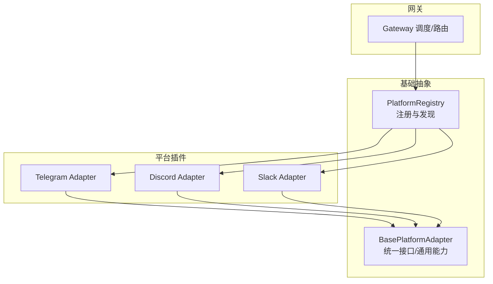
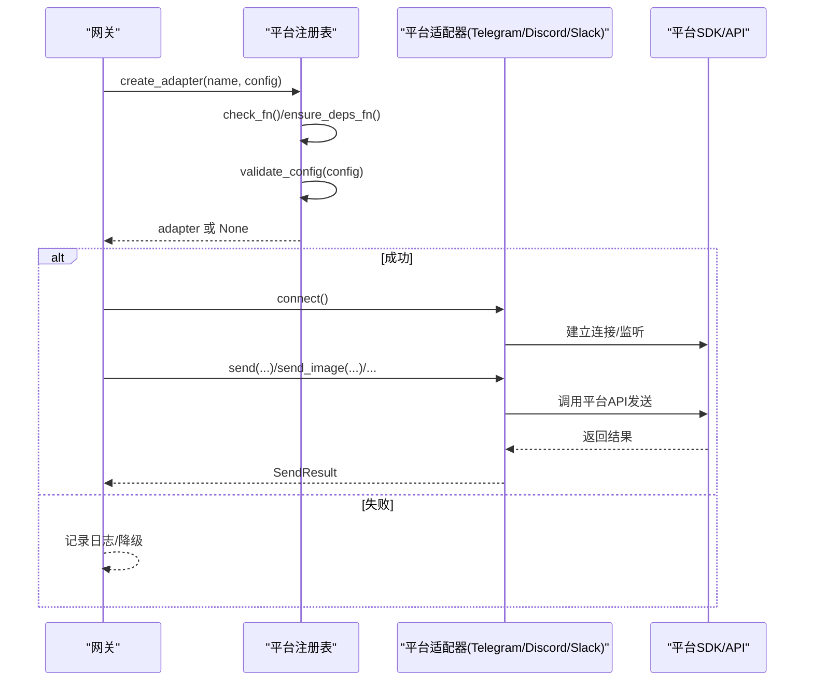
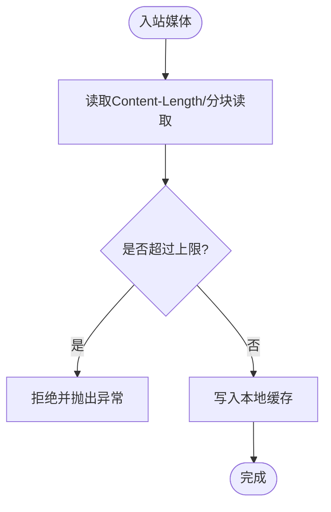
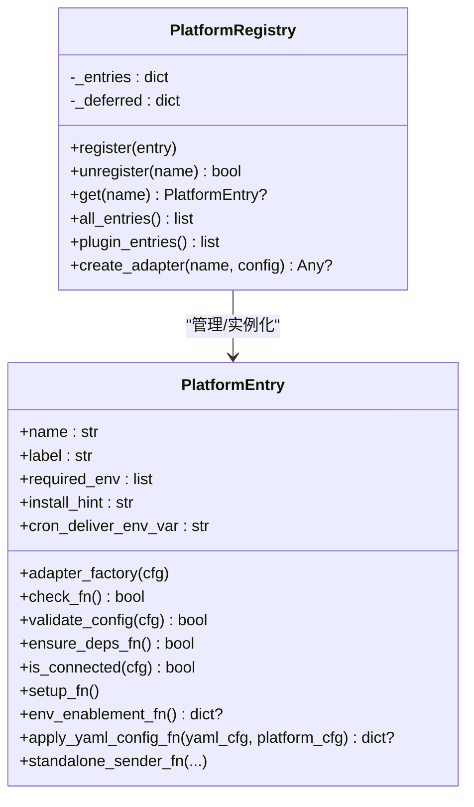
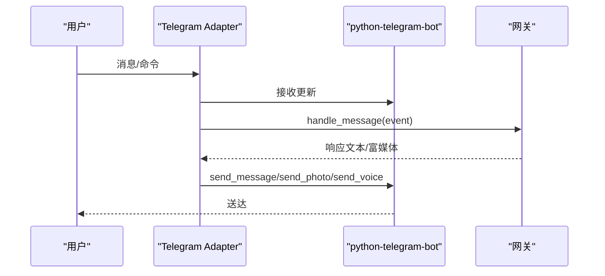
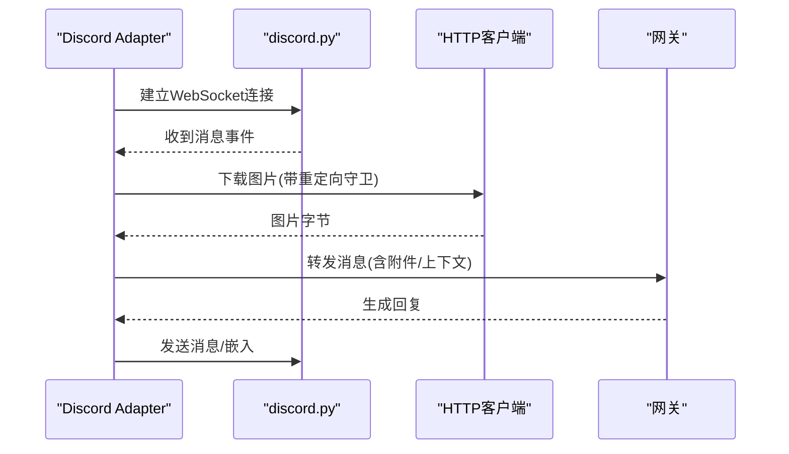
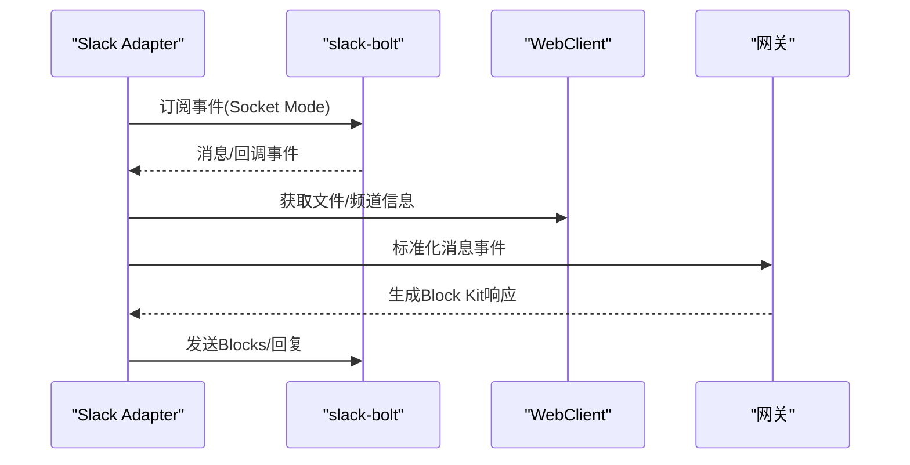
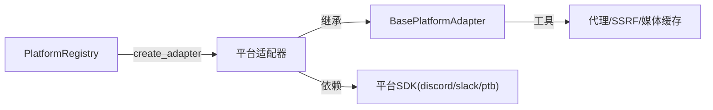

# 平台适配器

<cite>
**本文引用的文件**
- [gateway/platforms/base.py](file://gateway/platforms/base.py)
- [gateway/platform_registry.py](file://gateway/platform_registry.py)
- [gateway/platforms/ADDING_A_PLATFORM.md](file://gateway/platforms/ADDING_A_PLATFORM.md)
- [plugins/platforms/telegram/adapter.py](file://plugins/platforms/telegram/adapter.py)
- [plugins/platforms/discord/adapter.py](file://plugins/platforms/discord/adapter.py)
- [plugins/platforms/slack/adapter.py](file://plugins/platforms/slack/adapter.py)
</cite>

## 目录
1. [简介](#简介)
2. [项目结构](#项目结构)
3. [核心组件](#核心组件)
4. [架构总览](#架构总览)
5. [详细组件分析](#详细组件分析)
6. [依赖关系分析](#依赖关系分析)
7. [性能考虑](#性能考虑)
8. [故障排查指南](#故障排查指南)
9. [结论](#结论)
10. [附录](#附录)

## 简介
本文件面向“消息平台适配器”的开发与集成，目标是提供统一的接口规范与实现指南，覆盖：
- 统一接口：消息格式转换、认证机制、错误处理与重试策略
- 平台特性适配：Telegram Bot API、Discord WebSocket、Slack Block Kit 等
- 平台特定功能：富媒体处理、交互式组件、状态管理与会话绑定
- 注册与发现：动态加载、热插拔、延迟导入
- 开发模板与最佳实践：性能优化、内存管理、并发处理
- 多平台完整示例与集成步骤

## 项目结构
本项目采用“基础抽象 + 平台插件”的分层设计：
- 基础抽象层：定义统一适配器接口、通用能力（媒体缓存、代理、长度限制、流式TTS等）
- 平台插件层：各平台具体实现（Telegram、Discord、Slack 等），通过注册表进行动态发现与实例化
- 网关集成：通过平台注册表创建适配器、路由消息、调度任务（如定时发送）

图表来源
- [gateway/platforms/base.py:1-120](file://gateway/platforms/base.py#L1-L120)
- [gateway/platform_registry.py:183-382](file://gateway/platform_registry.py#L183-L382)

章节来源
- [gateway/platforms/base.py:1-120](file://gateway/platforms/base.py#L1-L120)
- [gateway/platform_registry.py:183-382](file://gateway/platform_registry.py#L183-L382)

## 核心组件
- BasePlatformAdapter（统一接口与通用能力）
  - 统一消息事件模型、发送结果模型、类型枚举
  - 媒体缓存与大小限制、代理配置、UTF-16 长度计算、流式 TTS 支持
  - 线程/会话元数据构建、回复锚点选择、通知标记
- PlatformRegistry（平台注册与发现）
  - 延迟加载（deferred loader）避免启动时全量导入重型 SDK
  - 依赖检查（check_fn）、按需安装（ensure_deps_fn）、配置校验（validate_config）
  - 工厂方法 create_adapter 负责实例化并返回适配器或 None
  - 支持独立进程发送（standalone_sender_fn）、YAML→环境变量桥接（apply_yaml_config_fn）

章节来源
- [gateway/platforms/base.py:1-200](file://gateway/platforms/base.py#L1-L200)
- [gateway/platforms/base.py:570-640](file://gateway/platforms/base.py#L570-L640)
- [gateway/platforms/base.py:700-800](file://gateway/platforms/base.py#L700-L800)
- [gateway/platform_registry.py:38-181](file://gateway/platform_registry.py#L38-L181)
- [gateway/platform_registry.py:183-382](file://gateway/platform_registry.py#L183-L382)

## 架构总览
平台适配器通过注册表集中管理，网关在需要时按名称查找并创建适配器。适配器继承基础类，复用通用逻辑，专注平台差异。

图表来源
- [gateway/platform_registry.py:299-377](file://gateway/platform_registry.py#L299-L377)
- [gateway/platforms/base.py:1-120](file://gateway/platforms/base.py#L1-L120)

## 详细组件分析

### 统一接口与通用能力（BasePlatformAdapter）
- 消息事件与发送结果
  - 使用 MessageEvent、MessageType、SendResult 统一入站/出站数据结构
- 媒体处理
  - 统一缓存入口：cache_image_from_url/bytes、cache_audio_from_url/bytes、cache_document_from_bytes、cache_video_from_bytes
  - 入站媒体大小限制：get_inbound_media_max_bytes、validate_inbound_media_size、_read_httpx_body_with_limit
  - 音频格式判断：should_send_media_as_audio（区分 Telegram voice/audio/document）
- 文本与长度
  - UTF-16 长度计算与截断：utf16_len、_prefix_within_utf16_limit、_custom_unit_to_cp
- 会话与线程
  - _platform_name、_thread_metadata_for_source、_reply_anchor_for_event、_mark_notify_metadata
- 网络与安全
  - 代理解析：resolve_proxy_url、proxy_kwargs_for_bot/aiohttp、NO_PROXY 匹配
  - SSRF 防护：_ssrf_redirect_guard
- 流式TTS
  - AudioFormat、StreamingTTSHandle、streaming_tts_turn_key、streaming_tts_should_skip_whole_file

图表来源
- [gateway/platforms/base.py:700-800](file://gateway/platforms/base.py#L700-L800)

章节来源
- [gateway/platforms/base.py:1-200](file://gateway/platforms/base.py#L1-L200)
- [gateway/platforms/base.py:570-640](file://gateway/platforms/base.py#L570-L640)
- [gateway/platforms/base.py:700-800](file://gateway/platforms/base.py#L700-L800)

### 平台注册与发现（PlatformRegistry）
- 延迟加载
  - register_deferred/_resolve/_resolve_all：仅在首次使用时导入重型模块，降低冷启动开销
- 依赖与配置
  - check_fn：被动探测依赖可用性
  - ensure_deps_fn：主动安装依赖（仅在实际创建适配器时触发）
  - validate_config：配置合法性校验
- 适配器创建
  - create_adapter：串联依赖检查、配置校验、工厂实例化，异常安全返回 None
- 扩展点
  - standalone_sender_fn：独立进程发送（用于 cron 等场景）
  - apply_yaml_config_fn：YAML→环境变量/extra 字段映射
  - env_enablement_fn：从环境变量自动启用并填充 extra

图表来源
- [gateway/platform_registry.py:38-181](file://gateway/platform_registry.py#L38-L181)
- [gateway/platform_registry.py:183-382](file://gateway/platform_registry.py#L183-L382)

章节来源
- [gateway/platform_registry.py:38-181](file://gateway/platform_registry.py#L38-L181)
- [gateway/platform_registry.py:183-382](file://gateway/platform_registry.py#L183-L382)

### 平台特性适配与实现

#### Telegram（Bot API）
- 传输与连接
  - 基于 python-telegram-bot，支持轮询/WebSocket（由库封装）
  - 超时与死锁防护：自定义 await_with_thread_deadline，避免事件循环阻塞导致初始化挂起
- 消息与富媒体
  - 音频/语音/文档：根据扩展名与 is_voice 标志选择 sendAudio/sendVoice/document
  - 图片/视频：统一走 base 的缓存与大小限制
- 交互组件
  - 支持澄清/确认/模型选择等按钮回调（与网关侧解析器约定回调 ID 格式）
- 会话与线程
  - DM Topic 场景下优先以 reply 到触发消息的方式保持上下文
  - 线程元数据携带 direct_messages_topic_id、reply_to_message_id

图表来源
- [plugins/platforms/telegram/adapter.py:1-200](file://plugins/platforms/telegram/adapter.py#L1-L200)
- [gateway/platforms/base.py:153-173](file://gateway/platforms/base.py#L153-L173)

章节来源
- [plugins/platforms/telegram/adapter.py:1-200](file://plugins/platforms/telegram/adapter.py#L1-L200)
- [gateway/platforms/base.py:153-173](file://gateway/platforms/base.py#L153-L173)

#### Discord（WebSocket）
- 传输与连接
  - 基于 discord.py，使用 WebSocket 长连接
  - 图像下载重定向保护：逐跳校验目标 URL 安全性，防止 SSRF
- 消息与富媒体
  - 链接渲染：对 Discord Markdown 链接标签做特殊处理，避免预览干扰
  - 非对话消息历史：通过正则与元数据识别，避免污染对话上下文
- 交互组件
  - 支持选择菜单、按钮等交互（与网关侧解析器协作）
- 会话与线程
  - 线程内引用与历史扫描，确保回复锚点正确

图表来源
- [plugins/platforms/discord/adapter.py:1-200](file://plugins/platforms/discord/adapter.py#L1-L200)

章节来源
- [plugins/platforms/discord/adapter.py:1-200](file://plugins/platforms/discord/adapter.py#L1-L200)

#### Slack（Block Kit / Socket Mode）
- 传输与连接
  - 基于 slack-bolt Socket Mode，异步处理事件
- 消息与富媒体
  - Block Kit 渲染：render_blocks/sanitize_blocks，支持富文本、表格对齐、文件标记
  - 错误体限制：限制读取错误响应体大小，避免大响应影响性能
- 交互组件
  - Slash 命令、按钮回调、选择菜单等，配合网关侧解析器
- 会话与线程
  - 线程根消息图片限数拉取，提升提及场景下的上下文体验

图表来源
- [plugins/platforms/slack/adapter.py:1-200](file://plugins/platforms/slack/adapter.py#L1-L200)

章节来源
- [plugins/platforms/slack/adapter.py:1-200](file://plugins/platforms/slack/adapter.py#L1-L200)

### 平台特定功能实现要点
- 富媒体处理
  - 统一缓存入口与大小限制，避免 OOM；音频按平台能力选择发送方式
- 交互式组件
  - 按钮/选择菜单回调 ID 约定一致，便于网关侧统一解析
- 状态管理与会话绑定
  - 通过 SessionSource 与 metadata 传递 thread_id、scope_id、chat_type 等上下文
  - 不同平台对“线程/话题”语义的差异在 base 中统一处理

章节来源
- [gateway/platforms/base.py:78-151](file://gateway/platforms/base.py#L78-L151)
- [gateway/platforms/base.py:153-173](file://gateway/platforms/base.py#L153-L173)

## 依赖关系分析
- 耦合与内聚
  - 平台适配器强依赖各自 SDK（discord.py、slack_bolt、python-telegram-bot），但通过 base 抽象降低与网关的耦合
  - 注册表解耦了“发现/实例化”与“具体实现”，支持插件热插拔
- 外部依赖
  - aiohttp_socks（可选）：SOCKS 代理支持
  - ffmpeg（可选）：Discord 音频处理
  - httpx/aiohttp：HTTP 请求与流式读取
- 潜在循环依赖
  - 通过延迟导入与条件 import 避免启动时全量加载

图表来源
- [gateway/platform_registry.py:299-377](file://gateway/platform_registry.py#L299-L377)
- [gateway/platforms/base.py:417-517](file://gateway/platforms/base.py#L417-L517)

章节来源
- [gateway/platform_registry.py:299-377](file://gateway/platform_registry.py#L299-L377)
- [gateway/platforms/base.py:417-517](file://gateway/platforms/base.py#L417-L517)

## 性能考虑
- 延迟加载
  - 通过 register_deferred 与 _resolve 仅在首次使用时导入重型 SDK，显著缩短 CLI/Gateway 冷启动时间
- 内存管理
  - 入站媒体大小限制（默认 128 MiB），分块读取并提前拒绝超大负载
  - 流式 TTS 控制 audible/aborted 状态，避免重复播放与资源泄漏
- 并发与超时
  - 自定义超时与线程守护，避免事件循环阻塞导致初始化卡死
  - 限制历史媒体查询并发（_HISTORY_MEDIA_LOOKUP_MAX_WORKERS），防止阻塞共享执行器
- 网络优化
  - 代理解析优先级：平台专用 > 全局环境变量 > macOS 系统代理；支持 NO_PROXY 白名单
  - SOCKS 代理强制远程 DNS（rdns=True），规避 DNS 污染

章节来源
- [gateway/platform_registry.py:192-250](file://gateway/platform_registry.py#L192-L250)
- [gateway/platforms/base.py:700-800](file://gateway/platforms/base.py#L700-L800)
- [plugins/platforms/telegram/adapter.py:68-173](file://plugins/platforms/telegram/adapter.py#L68-L173)
- [gateway/platforms/base.py:417-517](file://gateway/platforms/base.py#L417-L517)

## 故障排查指南
- 依赖缺失
  - check_fn 失败且无 ensure_deps_fn：直接返回 None，需手动安装依赖
  - ensure_deps_fn 失败：记录警告并跳过该平台的创建
- 配置校验失败
  - validate_config 返回 False：记录警告并跳过创建
- 适配器创建异常
  - factory 抛出异常：记录错误并返回 None
- 事件循环阻塞
  - Telegram 初始化超时：使用线程计时器与 faulthandler 输出堆栈定位阻塞帧
- 媒体过大
  - Content-Length 或分块读取超限：抛出 ValueError 并拒绝处理

章节来源
- [gateway/platform_registry.py:315-377](file://gateway/platform_registry.py#L315-L377)
- [plugins/platforms/telegram/adapter.py:68-173](file://plugins/platforms/telegram/adapter.py#L68-L173)
- [gateway/platforms/base.py:700-800](file://gateway/platforms/base.py#L700-L800)

## 结论
通过 BasePlatformAdapter 统一接口与 PlatformRegistry 动态注册机制，本项目实现了跨消息平台的高内聚、低耦合适配体系。各平台适配器聚焦自身协议差异，复用通用能力（媒体、代理、长度、TTS、安全）。结合延迟加载、依赖检测、配置校验与健壮的错误处理，提供了可扩展、可维护、高性能的平台适配方案。

## 附录

### 新增平台适配器清单（内置路径）
- 核心适配器文件：gateway/platforms/<platform>.py
- 必需方法：__init__/connect/disconnect/send/send_typing/send_image/get_chat_info
- 可选方法：send_document/send_voice/send_video/send_animation/send_image_file
- 交互组件：send_clarify/send_exec_approval/send_slash_confirm/send_model_picker/send_choice_picker
- 环境要求函数：check_<platform>_requirements
- 关键模式：build_source/handle_message/MessageEvent/MessageType/SendResult/缓存/过滤自消息/重连退避/MAX_MESSAGE_LENGTH

章节来源
- [gateway/platforms/ADDING_A_PLATFORM.md:87-145](file://gateway/platforms/ADDING_A_PLATFORM.md#L87-L145)

### 平台适配器开发模板与最佳实践
- 推荐插件路径：零侵入核心代码，通过 ctx.register_platform 注册
- 可选钩子：
  - env_enablement_fn：从环境变量自动启用并填充 extra
  - apply_yaml_config_fn：YAML→环境变量/extra 映射
  - cron_deliver_env_var：定时任务投递目标
  - standalone_sender_fn：独立进程发送
- 共享行为：通过 Mixin 抽取平台无关逻辑（如 WhatsAppBehaviorMixin）
- 测试建议：枚举、配置加载、适配器初始化、辅助函数、SessionSource 往返、授权集成、发送工具路由

章节来源
- [gateway/platforms/ADDING_A_PLATFORM.md:5-74](file://gateway/platforms/ADDING_A_PLATFORM.md#L5-L74)
- [gateway/platforms/ADDING_A_PLATFORM.md:148-389](file://gateway/platforms/ADDING_A_PLATFORM.md#L148-L389)

### 多平台完整示例与集成要点
- Telegram
  - 使用 python-telegram-bot，注意音频格式与语音标志、DM Topic 回复锚点、初始化超时与死锁防护
- Discord
  - 使用 discord.py WebSocket，图像下载重定向守卫、非对话消息识别、链接渲染优化
- Slack
  - 使用 slack-bolt Socket Mode，Block Kit 渲染、错误体限制、线程根图片限数拉取

章节来源
- [plugins/platforms/telegram/adapter.py:1-200](file://plugins/platforms/telegram/adapter.py#L1-L200)
- [plugins/platforms/discord/adapter.py:1-200](file://plugins/platforms/discord/adapter.py#L1-L200)
- [plugins/platforms/slack/adapter.py:1-200](file://plugins/platforms/slack/adapter.py#L1-L200)