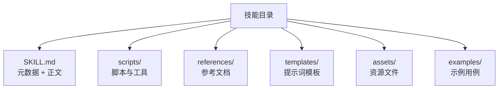
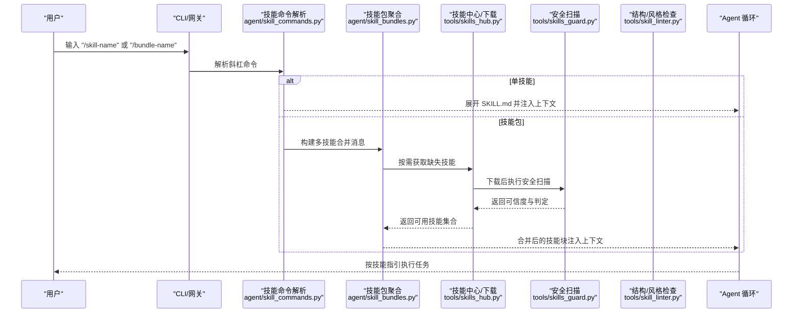
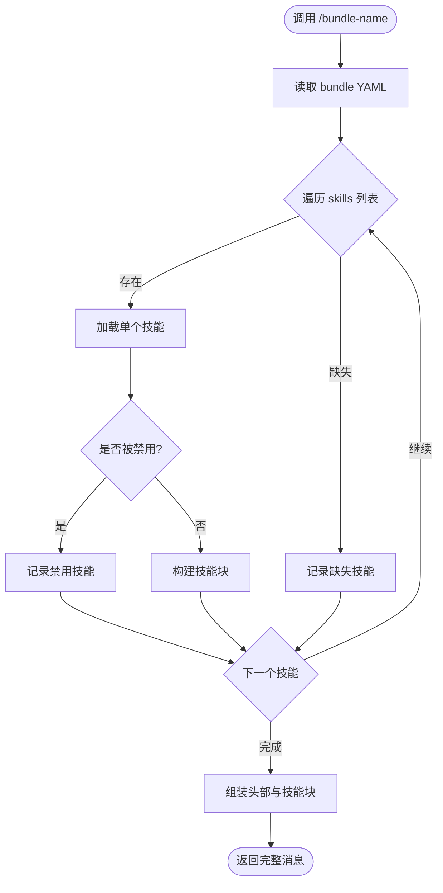
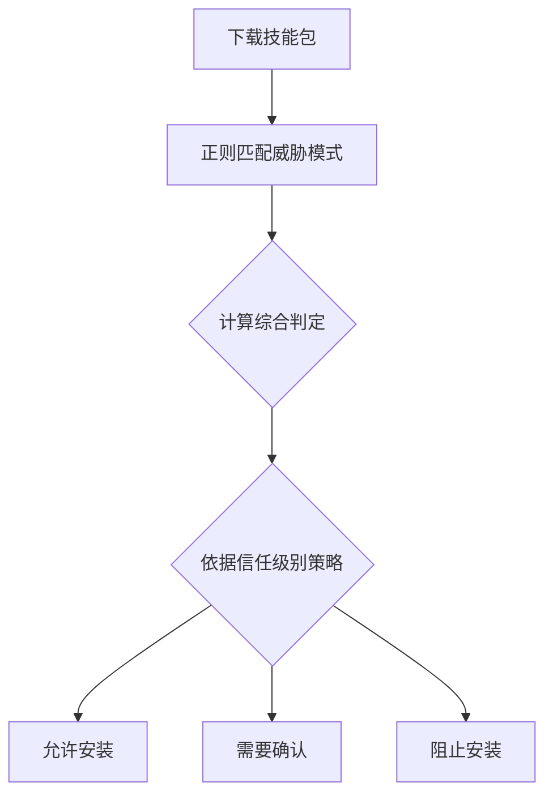
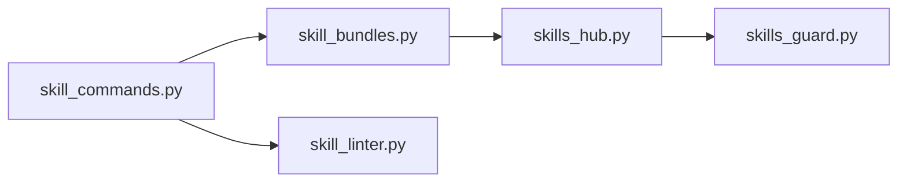

# 技能包结构

<cite>
**本文引用的文件**
- [SKILL.md](file://skills/software-development/hermes-agent-skill-authoring/SKILL.md)
- [skill_commands.py](file://agent/skill_commands.py)
- [skill_bundles.py](file://agent/skill_bundles.py)
- [skills_guard.py](file://tools/skills_guard.py)
- [skills_hub.py](file://tools/skills_hub.py)
- [skill_linter.py](file://tools/skill_linter.py)
</cite>

## 目录
1. [简介](#简介)
2. [项目结构](#项目结构)
3. [核心组件](#核心组件)
4. [架构总览](#架构总览)
5. [详细组件分析](#详细组件分析)
6. [依赖关系分析](#依赖关系分析)
7. [性能考虑](#性能考虑)
8. [故障排查指南](#故障排查指南)
9. [结论](#结论)
10. [附录](#附录)

## 简介
本文件系统化说明“技能包”（Skill）的结构与规范，覆盖 SKILL.md 元数据、描述字段、版本信息、依赖声明、许可证、目录组织（scripts、references、prompts/templates、assets）、命名约定、编码与兼容性要求、模板与最佳实践、验证规则与错误处理机制。内容基于仓库内现有实现与示例进行归纳，帮助作者编写高质量、可维护且安全的技能包。

## 项目结构
技能包通常以目录为单位组织，根目录包含一个 SKILL.md 作为入口与指令文档；可选支持目录包括：
- scripts：脚本与工具（如 shell/python/Node 等），用于自动化步骤或复杂逻辑
- references：参考资料、长文档、规范摘录等，避免 SKILL.md 臃肿
- templates/prompts：提示词模板或生成模板，供运行时填充
- assets：资源文件（图片、配置样例、工作流定义等）
- examples：示例用例或演示材料（部分技能使用）

仓库中既有内置技能（skills/...），也有可选技能（optional-skills/...）。每个技能目录的 SKILL.md 是加载与调用的核心。

章节来源
- [SKILL.md:18-41](file://skills/software-development/hermes-agent-skill-authoring/SKILL.md#L18-L41)

## 核心组件
- SKILL.md：技能包的元数据与使用说明，采用 YAML frontmatter 加 Markdown 正文。
- 技能命令与加载：通过 /skill-name 或 /bundle-name 触发，系统会展开并注入到会话上下文。
- 技能包（Bundle）：将多个技能打包为一个斜杠命令一次性加载。
- 安全扫描与安装策略：对外部来源的技能进行静态扫描与信任分级决策。
- 结构检查与风格校验：对 SKILL.md 与目录结构进行软性建议与硬性限制。

章节来源
- [skill_commands.py:1-65](file://agent/skill_commands.py#L1-L65)
- [skill_bundles.py:1-41](file://agent/skill_bundles.py#L1-L41)
- [skills_guard.py:1-67](file://tools/skills_guard.py#L1-L67)
- [skill_linter.py:1-27](file://tools/skill_linter.py#L1-L27)

## 架构总览
下图展示了从用户调用到技能加载、安全扫描与最终执行的流程。

图表来源
- [skill_commands.py:31-65](file://agent/skill_commands.py#L31-L65)
- [skill_bundles.py:253-368](file://agent/skill_bundles.py#L253-L368)
- [skills_hub.py:126-193](file://tools/skills_hub.py#L126-L193)
- [skills_guard.py:640-696](file://tools/skills_guard.py#L640-L696)

## 详细组件分析

### SKILL.md 规范与元数据
- 必须包含 YAML frontmatter，并以 --- 开始与结束，前无空白行与 BOM。
- 必填字段：name、description。推荐字段：version、author、license、platforms、metadata.hermes.tags、metadata.hermes.related_skills。
- description 应简洁明确，遵循仓库硬标准（≤60 字符，一句话，句号结尾，不含营销词汇）。
- platforms 需根据实际使用的脚本/命令严格标注，避免跨平台误用。
- 正文建议结构：When to Use、Prerequisites、How to Run、Quick Reference、Procedure、Pitfalls、Verification。

章节来源
- [SKILL.md:43-127](file://skills/software-development/hermes-agent-skill-authoring/SKILL.md#L43-L127)

### 目录组织结构与引用约束
- 允许的支持目录：references、templates、scripts、assets、examples。
- 在 SKILL.md 中对本地路径的引用需遵守白名单目录，禁止路径穿越。
- 大型或分支特定内容应放入 references/templates/scripts，不在 SKILL.md 中内联。

章节来源
- [skills_hub.py:155-179](file://tools/skills_hub.py#L155-L179)
- [SKILL.md:106-111](file://skills/software-development/hermes-agent-skill-authoring/SKILL.md#L106-L111)

### 命名约定与文件编码
- name 应为小写字母、数字、连字符与下划线组合，且与目录名一致。
- 文件名与路径统一使用 UTF-8 编码，确保跨平台一致性。
- 斜杠命令 slug 由名称规范化得到（空格/下划线转连字符，去除非法字符，压缩连续连字符）。

章节来源
- [skill_linter.py:119-152](file://tools/skill_linter.py#L119-L152)
- [skill_bundles.py:78-82](file://agent/skill_bundles.py#L78-L82)
- [skill_commands.py:23-28](file://agent/skill_commands.py#L23-L28)

### 兼容性与平台门控
- 通过 platforms 字段限定运行平台（linux/macos/windows）。
- 若脚本使用 POSIX 专属原语（如 fcntl、termios、osascript、apt、systemctl、/proc 等），需严格限制平台范围并在 Pitfalls 中说明原因。
- 优先使用跨平台方案（pathlib、tempfile、psutil 等），仅在确有必要时收窄平台。

章节来源
- [SKILL.md:93-105](file://skills/software-development/hermes-agent-skill-authoring/SKILL.md#L93-L105)
- [skill_linter.py:71-82](file://tools/skill_linter.py#L71-L82)

### 技能包（Bundle）与批量加载
- Bundle 为 YAML 文件，位于 SPARKII_HOME/skill-bundles/，可将多个技能合并到一个斜杠命令。
- 当某个成员技能未安装或被禁用时，仍会加载其余技能，并在头部注明缺失/禁用的技能。
- Bundle 优先级高于同名技能，便于用户自定义覆盖。

图表来源
- [skill_bundles.py:253-368](file://agent/skill_bundles.py#L253-L368)

章节来源
- [skill_bundles.py:1-41](file://agent/skill_bundles.py#L1-L41)
- [skill_bundles.py:168-205](file://agent/skill_bundles.py#L168-L205)
- [skill_bundles.py:253-368](file://agent/skill_bundles.py#L253-L368)

### 安全扫描与安装策略
- 外部来源的技能在安装前进行静态扫描，检测数据外泄、提示注入、破坏性命令、持久化、网络隧道、混淆、供应链风险、提权等模式。
- 信任级别：builtin（内置，始终信任）、trusted（受信任源，允许 caution）、community（社区，任何发现均阻止，除非强制）。
- 扫描结果包含 verdict（safe/caution/dangerous）与 findings，结合信任级别决定允许安装、询问或拒绝。

图表来源
- [skills_guard.py:101-524](file://tools/skills_guard.py#L101-L524)
- [skills_guard.py:640-696](file://tools/skills_guard.py#L640-L696)
- [skills_guard.py:774-800](file://tools/skills_guard.py#L774-L800)

章节来源
- [skills_guard.py:1-67](file://tools/skills_guard.py#L1-L67)
- [skills_guard.py:640-696](file://tools/skills_guard.py#L640-L696)
- [skills_guard.py:774-800](file://tools/skills_guard.py#L774-L800)

### 结构检查与风格校验
- 硬性校验（阻断）：frontmatter 存在且合法、name/description 存在、描述长度上限、非空正文、大小上限。
- 软性建议（警告）：缺少 version/author/license、description 过长或含营销词、name 格式不合规、POSIX 专属原语未设置 platforms、不应存在的脚手架文件等。
- 建议遵循现代章节顺序，强调可验证的步骤与完成标准。

章节来源
- [skill_linter.py:1-27](file://tools/skill_linter.py#L1-L27)
- [skill_linter.py:119-200](file://tools/skill_linter.py#L119-L200)
- [SKILL.md:106-127](file://skills/software-development/hermes-agent-skill-authoring/SKILL.md#L106-L127)

### 最佳实践与模板
- 将大段内容放入 references/templates/scripts，保持 SKILL.md 紧凑。
- 使用 Hermes 原生工具（terminal、read_file、patch、search_files 等）而非裸 shell 命令。
- 明确 When to Use 与 Prerequisites，提供 Quick Reference 与 Verification 步骤。
- 使用 related_skills 指向同仓库内的相关技能，并确保其真实存在。
- 在 Pitfalls 中列出常见陷阱与边界条件。

章节来源
- [SKILL.md:112-135](file://skills/software-development/hermes-agent-skill-authoring/SKILL.md#L112-L135)
- [SKILL.md:148-175](file://skills/software-development/hermes-agent-skill-authoring/SKILL.md#L148-L175)

## 依赖关系分析
- 技能命令解析与扩展：agent/skill_commands.py 负责识别斜杠命令、提取用户指令、构建消息骨架。
- 技能包聚合：agent/skill_bundles.py 将多个技能合并为一条消息，处理缺失/禁用情况。
- 技能中心与下载：tools/skills_hub.py 管理技能索引、缓存、来源适配与本地链接校验。
- 安全扫描：tools/skills_guard.py 对技能内容进行威胁模式匹配与信任策略决策。
- 结构/风格检查：tools/skill_linter.py 提供软性建议与规范检查。

图表来源
- [skill_commands.py:31-65](file://agent/skill_commands.py#L31-L65)
- [skill_bundles.py:253-368](file://agent/skill_bundles.py#L253-L368)
- [skills_hub.py:126-193](file://tools/skills_hub.py#L126-L193)
- [skills_guard.py:640-696](file://tools/skills_guard.py#L640-L696)
- [skill_linter.py:119-200](file://tools/skill_linter.py#L119-L200)

章节来源
- [skill_commands.py:31-65](file://agent/skill_commands.py#L31-L65)
- [skill_bundles.py:253-368](file://agent/skill_bundles.py#L253-L368)
- [skills_hub.py:126-193](file://tools/skills_hub.py#L126-L193)
- [skills_guard.py:640-696](file://tools/skills_guard.py#L640-L696)
- [skill_linter.py:119-200](file://tools/skill_linter.py#L119-L200)

## 性能考虑
- 懒加载与缓存：技能包扫描与加载具备缓存机制，仅在目录或文件变更时重新扫描。
- 轻量消息：尽量将冗长内容放入 references/templates，减少每次加载的上下文体积。
- 避免重复：Bundle 内部去重，避免重复加载同一技能。
- 扫描优化：安全扫描仅针对文本文件与 SKILL.md，跳过二进制与忽略文件。

章节来源
- [skill_bundles.py:95-113](file://agent/skill_bundles.py#L95-L113)
- [skill_bundles.py:195-205](file://agent/skill_bundles.py#L195-L205)
- [skills_guard.py:531-541](file://tools/skills_guard.py#L531-L541)

## 故障排查指南
- 无法加载技能：检查 name 是否与目录一致、frontmatter 是否合法、description 是否为空、正文是否非空。
- 平台不兼容：确认 platforms 与实际脚本/命令匹配，必要时收窄平台或在 Pitfalls 中说明。
- Bundle 缺失成员：查看头部提示信息中的“缺失技能”，按需安装或修正 bundle 列表。
- 安全拦截：查看扫描报告中的 findings，定位具体模式与行号，修改后重试。
- 描述过长或含营销词：缩短至 ≤60 字符，去掉营销词汇，聚焦能力陈述。

章节来源
- [skill_linter.py:119-200](file://tools/skill_linter.py#L119-L200)
- [skills_guard.py:640-696](file://tools/skills_guard.py#L640-L696)
- [skill_bundles.py:253-368](file://agent/skill_bundles.py#L253-L368)

## 结论
技能包体系围绕 SKILL.md 的核心元数据与正文展开，配合目录组织、Bundle 聚合、安全扫描与结构校验，形成一套可扩展、可审计、可维护的技能生态。遵循本文规范与最佳实践，可显著提升技能的可读性、安全性与跨平台兼容性。

## 附录
- 快速清单
  - 使用 frontmatter 声明 name、description、version、author、license、platforms、metadata.hermes
  - 将大内容放入 references/templates/scripts，保持 SKILL.md 精简
  - 使用 Hermes 原生工具，避免裸 shell 命令
  - 明确 When to Use、Prerequisites、Verification
  - 通过 Bundle 聚合常用技能，提升效率
  - 对外部来源技能进行安全扫描与信任评估
  - 遵循命名与编码规范，确保跨平台一致

章节来源
- [SKILL.md:43-127](file://skills/software-development/hermes-agent-skill-authoring/SKILL.md#L43-L127)
- [skills_hub.py:155-179](file://tools/skills_hub.py#L155-L179)
- [skills_guard.py:640-696](file://tools/skills_guard.py#L640-L696)
- [skill_linter.py:119-200](file://tools/skill_linter.py#L119-L200)