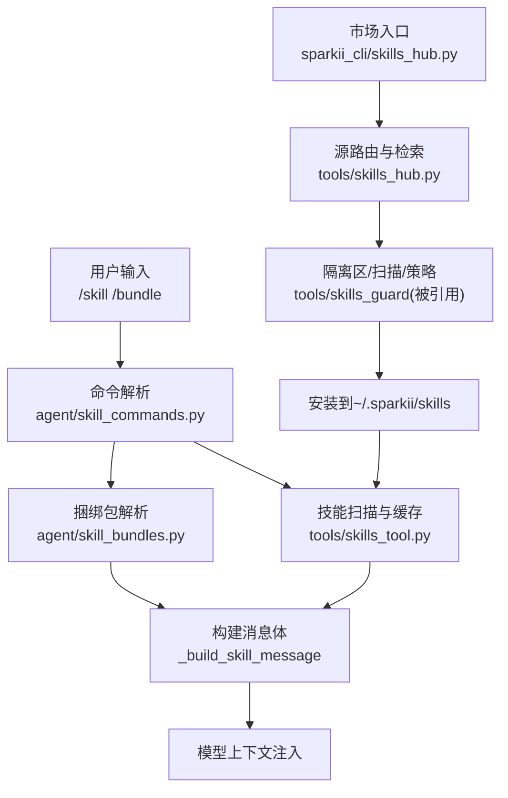
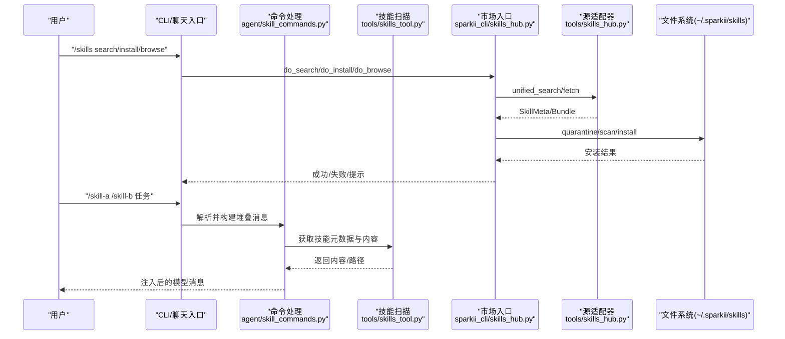
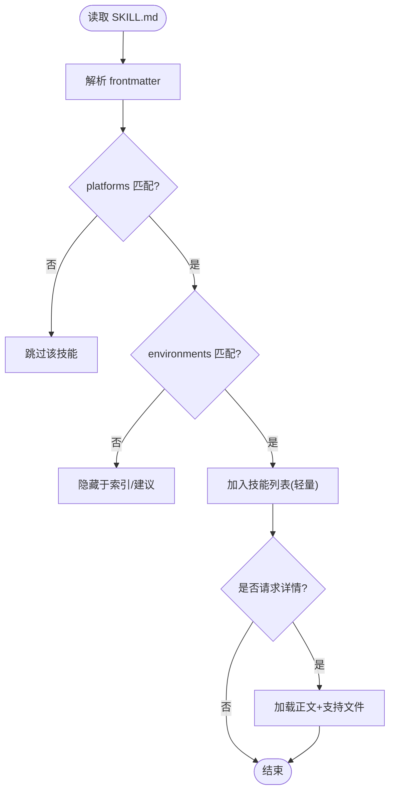
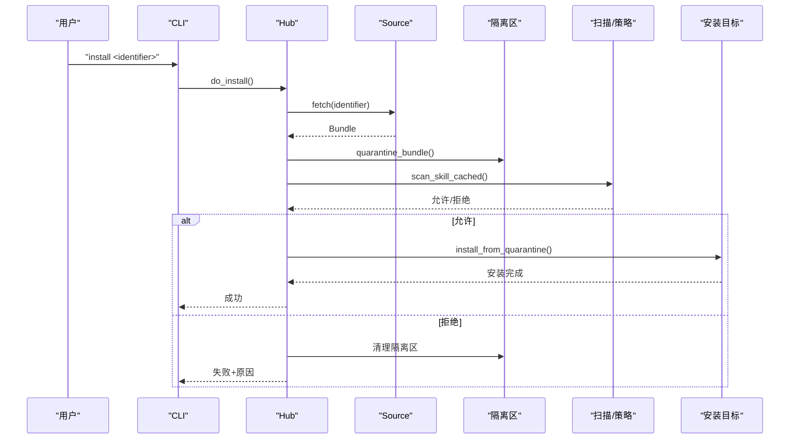
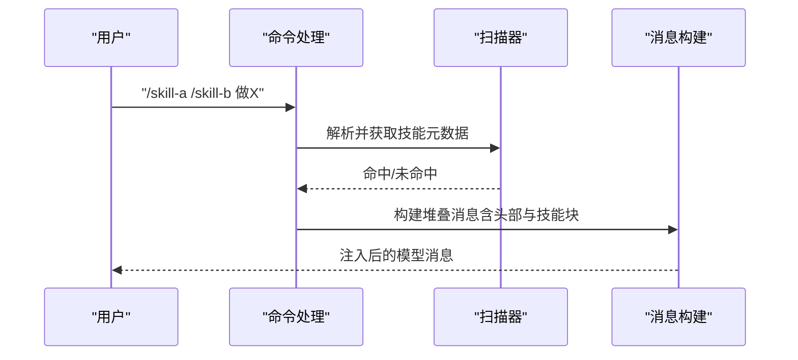
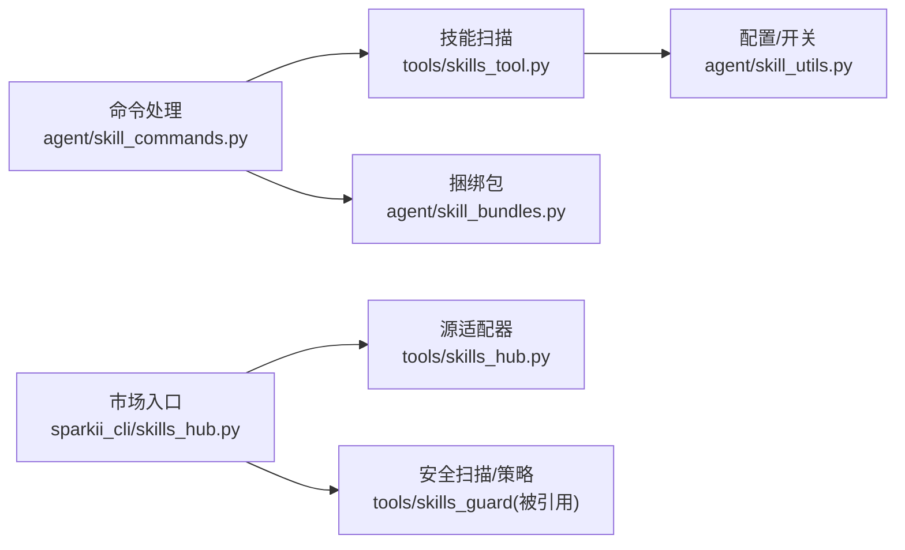

# 技能市场

<cite>
**本文引用的文件**
- [agent/skill_bundles.py](file://agent/skill_bundles.py)
- [agent/skill_commands.py](file://agent/skill_commands.py)
- [agent/skill_utils.py](file://agent/skill_utils.py)
- [sparkii_cli/skills_hub.py](file://sparkii_cli/skills_hub.py)
- [tools/skills_tool.py](file://tools/skills_tool.py)
- [tools/skills_hub.py](file://tools/skills_hub.py)
- [scripts/build_skills_index.py](file://scripts/build_skills_index.py)
- [skills/software-development/test-driven-development/SKILL.md](file://skills/software-development/test-driven-development/SKILL.md)
- [skills/github/github-code-review/SKILL.md](file://skills/github/github-code-review/SKILL.md)
</cite>

## 目录
1. [简介](#简介)
2. [项目结构](#项目结构)
3. [核心组件](#核心组件)
4. [架构总览](#架构总览)
5. [详细组件分析](#详细组件分析)
6. [依赖关系分析](#依赖关系分析)
7. [性能考虑](#性能考虑)
8. [故障排查指南](#故障排查指南)
9. [结论](#结论)
10. [附录：示例与最佳实践](#附录示例与最佳实践)

## 简介
本文件系统化说明“技能市场”的完整能力，覆盖技能包结构与规范、安装与管理机制（本地/远程/自动更新/回滚）、技能发现与推荐、分发渠道（私有仓库/公共市场/团队协作），以及开发指南与示例。目标是帮助开发者快速理解并高效使用技能生态。

## 项目结构
技能系统围绕“SKILL.md 规范 + 元数据 + 工具链 + 分发中心”构建：
- 技能包组织：每个技能是一个目录，包含 SKILL.md（主指令）与可选支持目录（references/templates/scripts/assets）。
- 命令与加载：通过 /skill-name 或 /bundle-name 触发，系统扫描并注入上下文到模型消息中。
- 市场与分发：统一入口 sparkii_cli/skills_hub.py 对接多源适配器（GitHub、官方、第三方索引等），提供搜索、浏览、安装、审计与锁定管理。
- 平台与环境适配：基于 frontmatter 的 platforms/environments 控制可见性与运行环境匹配。
- 配置与开关：支持禁用列表、外部目录扩展、模板变量替换、内联 Shell 执行等。

**图表来源**
- [agent/skill_commands.py:271-371](file://agent/skill_commands.py#L271-L371)
- [agent/skill_bundles.py:253-368](file://agent/skill_bundles.py#L253-L368)
- [tools/skills_tool.py:673-781](file://tools/skills_tool.py#L673-L781)
- [sparkii_cli/skills_hub.py:490-794](file://sparkii_cli/skills_hub.py#L490-L794)
- [tools/skills_hub.py:130-193](file://tools/skills_hub.py#L130-L193)

**章节来源**
- [agent/skill_commands.py:271-371](file://agent/skill_commands.py#L271-L371)
- [agent/skill_bundles.py:253-368](file://agent/skill_bundles.py#L253-L368)
- [tools/skills_tool.py:673-781](file://tools/skills_tool.py#L673-L781)
- [sparkii_cli/skills_hub.py:490-794](file://sparkii_cli/skills_hub.py#L490-L794)
- [tools/skills_hub.py:130-193](file://tools/skills_hub.py#L130-L193)

## 核心组件
- 技能命令与消息构建：负责将 SKILL.md 内容以固定标记注入到模型消息，提取用户指令，支持堆叠调用与捆绑包。
- 技能扫描与元数据：扫描本地与外部目录，解析 frontmatter，过滤平台与环境，生成轻量列表与按需加载详情。
- 捆绑包（Bundle）：YAML 聚合多个技能，统一激活与提示注入。
- 技能市场（Hub）：统一搜索/浏览/安装/审计/锁定，支持多源与离线索引。
- 配置与开关：禁用技能、外部目录、模板变量、内联 Shell、平台/环境匹配。

**章节来源**
- [agent/skill_commands.py:73-167](file://agent/skill_commands.py#L73-L167)
- [agent/skill_commands.py:374-547](file://agent/skill_commands.py#L374-L547)
- [agent/skill_bundles.py:168-250](file://agent/skill_bundles.py#L168-L250)
- [tools/skills_tool.py:673-781](file://tools/skills_tool.py#L673-L781)
- [sparkii_cli/skills_hub.py:250-487](file://sparkii_cli/skills_hub.py#L250-L487)

## 架构总览
技能系统由“命令层 + 扫描层 + 市场层 + 存储层”构成：
- 命令层：解析 /skill /bundle，构建消息，支持堆叠与捆绑。
- 扫描层：遍历本地与外部目录，解析 frontmatter，应用平台/环境/禁用策略。
- 市场层：统一接入多源（GitHub、官方、第三方索引），提供搜索、预览、安装、审计、锁定。
- 存储层：~/.sparkii/skills 为权威位置；.hub 下维护 quarantine、lock.json、audit.log、index-cache。

**图表来源**
- [sparkii_cli/skills_hub.py:250-487](file://sparkii_cli/skills_hub.py#L250-L487)
- [tools/skills_hub.py:130-193](file://tools/skills_hub.py#L130-L193)
- [agent/skill_commands.py:569-744](file://agent/skill_commands.py#L569-L744)
- [tools/skills_tool.py:673-781](file://tools/skills_tool.py#L673-L781)

## 详细组件分析

### 技能包结构与 SKILL.md 规范
- 目录结构：每个技能一个目录，包含 SKILL.md（必需）与 references/templates/scripts/assets（可选）。
- Frontmatter 字段：name、description、version、license、platforms、metadata（含 sparkii.tags/related_skills 等）、prerequisites、required_environment_variables、setup 等。
- 渐进式披露：先列出轻量元数据，再按需加载全文与支持文件，降低 token 消耗。
- 平台与环境：platforms 限制 OS；environments 控制“相关环境”（kanban/docker/s6）的可见性。

**图表来源**
- [tools/skills_tool.py:673-781](file://tools/skills_tool.py#L673-L781)
- [agent/skill_utils.py:226-387](file://agent/skill_utils.py#L226-L387)

**章节来源**
- [tools/skills_tool.py:1-67](file://tools/skills_tool.py#L1-L67)
- [tools/skills_tool.py:673-781](file://tools/skills_tool.py#L673-L781)
- [agent/skill_utils.py:226-387](file://agent/skill_utils.py#L226-L387)

### 元数据定义、依赖声明与版本管理
- 元数据：name/description/version/license/platforms/metadata.sparkii.*。
- 依赖声明：
  - prerequisites.env_vars/commands（遗留兼容，转为 required_environment_variables）。
  - required_environment_variables 用于强制收集密钥/环境变量。
  - setup.collect_secrets 支持交互式采集。
- 版本管理：
  - 安装锁文件 lock.json 记录已安装技能的来源、标识与路径。
  - 扫描缓存与 index-cache 提升性能与可重复性。
  - 审计日志 audit.log 记录安装/阻断事件。

**章节来源**
- [tools/skills_tool.py:275-406](file://tools/skills_tool.py#L275-L406)
- [tools/skills_hub.py:72-99](file://tools/skills_hub.py#L72-L99)
- [tools/skills_hub.py:130-193](file://tools/skills_hub.py#L130-L193)

### 技能安装与管理机制
- 本地安装：将技能复制到 ~/.sparkii/skills/<category>/<name>/，刷新缓存后可用。
- 远程下载：通过 tools/skills_hub.py 的多源适配器从 GitHub/官方/第三方索引拉取。
- 自动更新：基于 lock.json 与源指纹进行增量更新（结合 index-cache 与扫描缓存）。
- 回滚：quarantine 隔离区在确认前暂存；审计日志与锁文件便于回退与追踪。
- 安全策略：安装前执行扫描与策略检查，阻止高风险行为。

**图表来源**
- [sparkii_cli/skills_hub.py:490-794](file://sparkii_cli/skills_hub.py#L490-L794)
- [tools/skills_hub.py:130-193](file://tools/skills_hub.py#L130-L193)

**章节来源**
- [sparkii_cli/skills_hub.py:490-794](file://sparkii_cli/skills_hub.py#L490-L794)
- [tools/skills_hub.py:130-193](file://tools/skills_hub.py#L130-L193)

### 技能发现与推荐算法
- 发现：
  - 本地扫描：遍历 ~/.sparkii/skills 与 external_dirs，解析 SKILL.md，应用平台/环境/禁用过滤。
  - 市场索引：scripts/build_skills_index.py 汇总多源元数据，提供离线/在线混合检索。
- 推荐：
  - 信任等级排序：official > trusted > community。
  - 去重与优先级：按 identifier 去重，优先高信任来源。
  - 提供者过滤：对 GitHub-tap 可按 provider 筛选。
  - 分页与并行：并行拉取各源，超时保护，客户端分页展示。

**章节来源**
- [tools/skills_tool.py:673-781](file://tools/skills_tool.py#L673-L781)
- [sparkii_cli/skills_hub.py:319-487](file://sparkii_cli/skills_hub.py#L319-L487)
- [scripts/build_skills_index.py:1-200](file://scripts/build_skills_index.py#L1-L200)

### 分发机制：私有仓库、公共市场、团队协作
- 公共市场：GitHub taps、skills.sh、clawhub、lobehub、browse-sh 等多源聚合。
- 私有仓库：通过 GitHub 源适配器指向内部仓库；可通过 source_id 锁定来源，避免跨注册表歧义。
- 团队协作：
  - 组织镜像：_org/<org_id> 目录配合 .active_org 标记，仅当令牌验证通过后加载。
  - 外部目录：skills.external_dirs 支持挂载团队共享技能目录。
  - 审计与锁定：lock.json/audit.log 保障可追溯与合规。

**章节来源**
- [agent/skill_utils.py:52-99](file://agent/skill_utils.py#L52-L99)
- [agent/skill_utils.py:499-579](file://agent/skill_utils.py#L499-L579)
- [sparkii_cli/skills_hub.py:490-794](file://sparkii_cli/skills_hub.py#L490-L794)

### 命令与消息注入（单技能/堆叠/捆绑包）
- 单技能：/skill-name 直接加载对应 SKILL.md 并注入上下文。
- 堆叠调用：/skill-a /skill-b 任务，最多支持若干前置技能同时加载，复用捆绑包标记以便正确提取用户指令。
- 捆绑包：YAML 聚合多个技能，统一头信息、缺失/禁用提示与附加指令。

**图表来源**
- [agent/skill_commands.py:633-744](file://agent/skill_commands.py#L633-L744)
- [agent/skill_commands.py:271-371](file://agent/skill_commands.py#L271-L371)

**章节来源**
- [agent/skill_commands.py:569-744](file://agent/skill_commands.py#L569-L744)
- [agent/skill_bundles.py:253-368](file://agent/skill_bundles.py#L253-L368)

## 依赖关系分析
- 命令层依赖扫描层与市场层：
  - agent/skill_commands.py 依赖 tools/skills_tool.py 进行技能发现与内容加载。
  - 捆绑包逻辑依赖同一消息构建函数，保证标记一致。
- 市场层依赖源适配器与安全扫描：
  - sparkii_cli/skills_hub.py 调用 tools/skills_hub.py 的多源适配器。
  - 安装流程集成 skills_guard 的扫描与策略判断。
- 配置与开关：
  - agent/skill_utils.py 提供平台/环境匹配、禁用列表、外部目录解析。

**图表来源**
- [agent/skill_commands.py:271-371](file://agent/skill_commands.py#L271-L371)
- [agent/skill_bundles.py:253-368](file://agent/skill_bundles.py#L253-L368)
- [sparkii_cli/skills_hub.py:490-794](file://sparkii_cli/skills_hub.py#L490-L794)
- [tools/skills_tool.py:673-781](file://tools/skills_tool.py#L673-L781)
- [agent/skill_utils.py:436-579](file://agent/skill_utils.py#L436-L579)

**章节来源**
- [agent/skill_commands.py:271-371](file://agent/skill_commands.py#L271-L371)
- [agent/skill_bundles.py:253-368](file://agent/skill_bundles.py#L253-L368)
- [sparkii_cli/skills_hub.py:490-794](file://sparkii_cli/skills_hub.py#L490-L794)
- [tools/skills_tool.py:673-781](file://tools/skills_tool.py#L673-L781)
- [agent/skill_utils.py:436-579](file://agent/skill_utils.py#L436-L579)

## 性能考虑
- 扫描缓存：按目录签名与 TTL 缓存，减少重复 IO。
- 并行检索：市场浏览并行拉取多源，设置超时与进度回调。
- 渐进式披露：先返回轻量元数据，按需加载全文与支持文件。
- 配置缓存：config.yaml 的 mtime+size 键值缓存，避免冷启动开销。
- 索引缓存：index-cache 加速离线/首次运行体验。

**章节来源**
- [tools/skills_tool.py:91-104](file://tools/skills_tool.py#L91-L104)
- [tools/skills_tool.py:673-781](file://tools/skills_tool.py#L673-L781)
- [sparkii_cli/skills_hub.py:319-487](file://sparkii_cli/skills_hub.py#L319-L487)
- [agent/skill_utils.py:401-433](file://agent/skill_utils.py#L401-L433)
- [tools/skills_hub.py:97-99](file://tools/skills_hub.py#L97-L99)

## 故障排查指南
- 无法找到技能：
  - 检查是否在本地或 external_dirs 中存在 SKILL.md。
  - 确认 platforms/environments 是否与当前环境匹配。
  - 查看是否被禁用（全局或平台级）。
- 安装被阻断：
  - 查看审计日志与扫描报告，定位风险点。
  - 检查隔离区与锁文件状态。
- 命令无效：
  - 确认 slug 规范化是否正确（空格/下划线转连字符）。
  - 检查是否存在与核心命令冲突导致自动注册被跳过。
- 捆绑包加载异常：
  - 检查 YAML 格式与 skills 列表是否为空。
  - 确认成员技能存在且未被禁用。

**章节来源**
- [agent/skill_commands.py:374-467](file://agent/skill_commands.py#L374-L467)
- [agent/skill_bundles.py:116-192](file://agent/skill_bundles.py#L116-L192)
- [sparkii_cli/skills_hub.py:640-738](file://sparkii_cli/skills_hub.py#L640-L738)

## 结论
技能市场提供了从规范、发现、安装到治理的全链路能力。通过统一的命令接口、严格的扫描策略、灵活的分发渠道与高效的缓存机制，既保证了安全性与可维护性，又提升了用户体验与开发效率。建议在生产环境中启用审计与锁定，并结合组织镜像与外部目录实现团队协作。

## 附录：示例与最佳实践
- 示例技能：
  - TDD 工作流：遵循 RED-GREEN-REFACTOR，强调测试先行与最小实现。
  - GitHub 代码审查：本地差异与 PR 审查，结构化反馈与评论提交。
- 最佳实践：
  - 明确 frontmatter 元数据，合理声明平台与环境。
  - 使用 required_environment_variables 与 setup.collect_secrets 管理敏感信息。
  - 利用 bundles 组合常用技能，提高一致性。
  - 通过 external_dirs 与 _org 镜像实现团队共享与权限控制。
  - 定期审查审计日志与锁文件，确保合规与可追溯。

**章节来源**
- [skills/software-development/test-driven-development/SKILL.md:1-363](file://skills/software-development/test-driven-development/SKILL.md#L1-L363)
- [skills/github/github-code-review/SKILL.md:1-482](file://skills/github/github-code-review/SKILL.md#L1-L482)