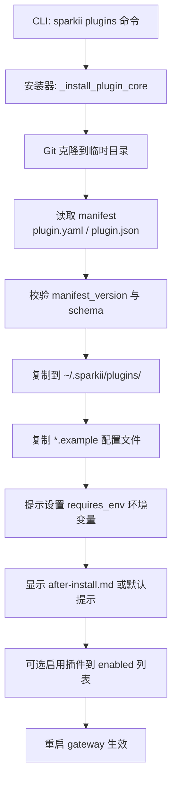
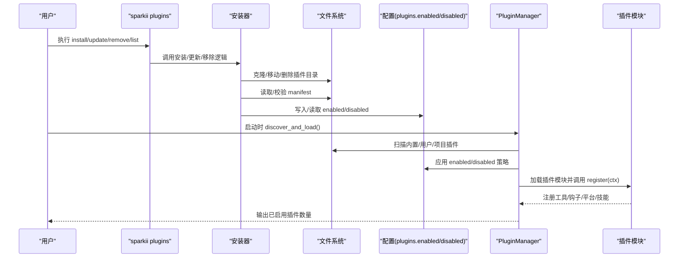
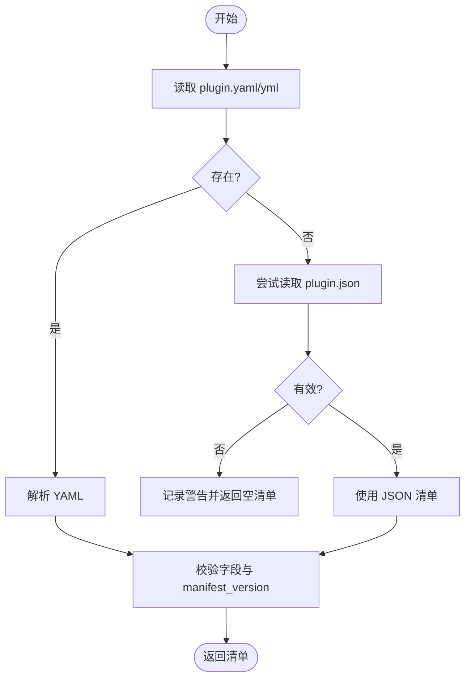
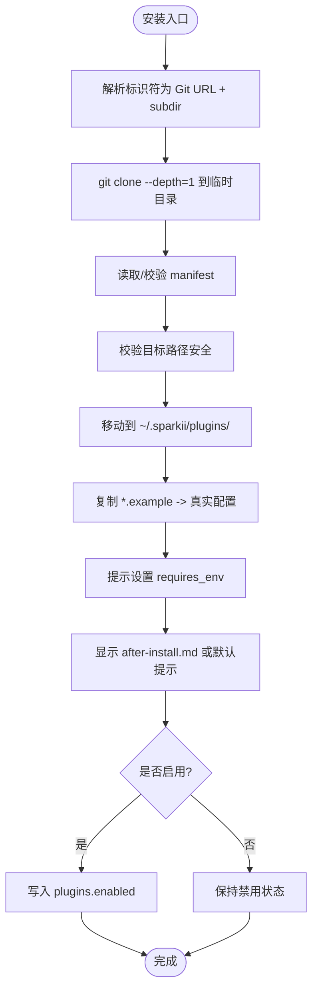
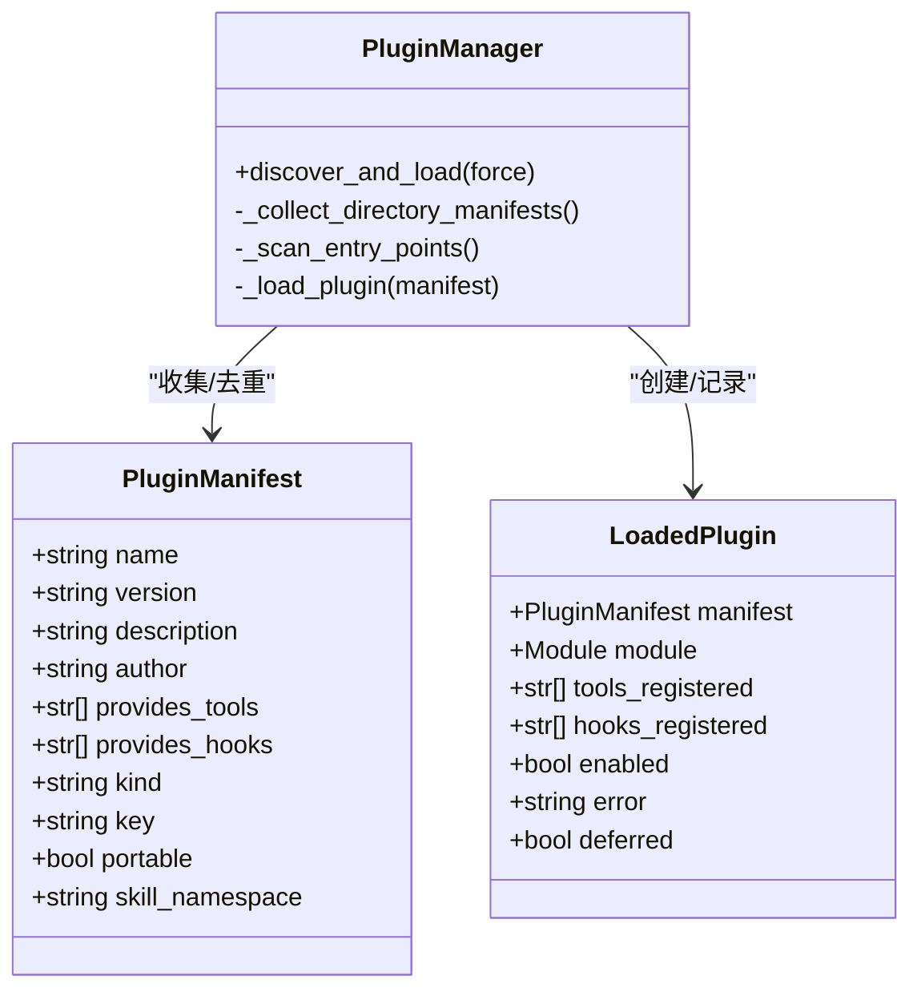
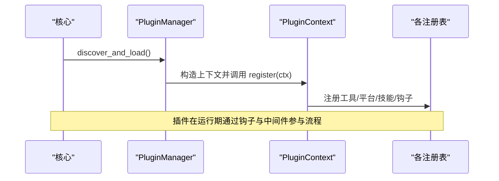
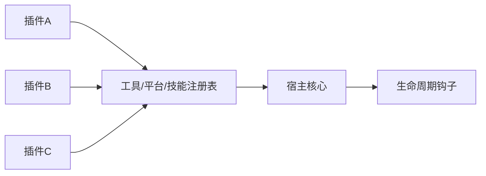

# 插件分发机制

<cite>
**本文引用的文件**
- [sparkii_cli/plugins.py](file://sparkii_cli/plugins.py)
- [sparkii_cli/plugins_cmd.py](file://sparkii_cli/plugins_cmd.py)
- [plugins/disk-cleanup/plugin.yaml](file://plugins/disk-cleanup/plugin.yaml)
- [plugins/spotify/plugin.yaml](file://plugins/spotify/plugin.yaml)
- [plugins/plugin_utils.py](file://plugins/plugin_utils.py)
</cite>

## 目录
1. [简介](#简介)
2. [项目结构](#项目结构)
3. [核心组件](#核心组件)
4. [架构总览](#架构总览)
5. [详细组件分析](#详细组件分析)
6. [依赖关系分析](#依赖关系分析)
7. [性能考量](#性能考量)
8. [故障排查指南](#故障排查指南)
9. [结论](#结论)
10. [附录](#附录)

## 简介
本文件系统性说明该仓库的“插件分发机制”，覆盖以下方面：
- 插件包打包格式与规范（元数据、依赖声明、版本控制）
- 安装流程（本地安装、远程下载、批量部署、自动更新）
- 插件仓库管理（私有仓库、公共市场、团队共享）
- 依赖解析与冲突解决（兼容性保障）
- 发布与分发最佳实践（签名验证、安全扫描、回滚机制）
- 从开发到发布的端到端示例

## 项目结构
插件系统由“运行时发现与加载”和“命令行安装/更新/移除”两部分组成：
- 运行时：负责扫描内置、用户、项目以及入口点插件，按优先级合并并加载。
- 命令行：提供 Git 源安装、更新、移除、环境变量提示、示例配置复制等能力。

**图表来源**
- [sparkii_cli/plugins_cmd.py:462-581](file://sparkii_cli/plugins_cmd.py#L462-L581)
- [sparkii_cli/plugins_cmd.py:584-667](file://sparkii_cli/plugins_cmd.py#L584-L667)
- [sparkii_cli/plugins_cmd.py:670-713](file://sparkii_cli/plugins_cmd.py#L670-L713)

**章节来源**
- [sparkii_cli/plugins_cmd.py:1-800](file://sparkii_cli/plugins_cmd.py#L1-L800)
- [sparkii_cli/plugins.py:1-800](file://sparkii_cli/plugins.py#L1-L800)

## 核心组件
- 插件清单（Manifest）：描述插件名称、版本、作者、类型、提供的工具/钩子、环境要求等。
- 插件管理器（PluginManager）：统一发现、去重、加载、注册工具/钩子/平台/技能等。
- 插件上下文（PluginContext）：插件在 register(ctx) 中使用的 API 门面，用于注册工具、钩子、平台、技能等。
- CLI 安装器：基于 Git 的安装、更新、移除与环境变量引导。

关键职责划分：
- 清单定义：位于每个插件目录的 plugin.yaml 或 plugin.json。
- 运行时加载：由 PluginManager 完成，遵循内置 > 用户 > 项目的优先级与 enable/disable 策略。
- 生命周期钩子：通过 VALID_HOOKS 暴露，插件可订阅事件以扩展行为。
- 工具与提供者：通过 PluginContext 的 register_* 方法注册到全局注册表。

**章节来源**
- [sparkii_cli/plugins.py:307-362](file://sparkii_cli/plugins.py#L307-L362)
- [sparkii_cli/plugins.py:368-800](file://sparkii_cli/plugins.py#L368-L800)
- [sparkii_cli/plugins.py:1309-1499](file://sparkii_cli/plugins.py#L1309-L1499)

## 架构总览
下图展示插件从源码到运行时的完整链路，包括安装、清单解析、启用策略、加载与注册。

**图表来源**
- [sparkii_cli/plugins_cmd.py:462-581](file://sparkii_cli/plugins_cmd.py#L462-L581)
- [sparkii_cli/plugins_cmd.py:584-667](file://sparkii_cli/plugins_cmd.py#L584-L667)
- [sparkii_cli/plugins_cmd.py:670-713](file://sparkii_cli/plugins_cmd.py#L670-L713)
- [sparkii_cli/plugins.py:1341-1499](file://sparkii_cli/plugins.py#L1341-L1499)

## 详细组件分析

### 插件清单与打包规范
- 清单位置与格式：优先读取 plugin.yaml，其次 plugin.yml；若不存在则尝试 portable 的 plugin.json。
- 关键字段：
  - name/version/description/author：基础信息
  - kind：standalone/backend/exclusive/platform/model-provider
  - provides_tools/provides_hooks：声明能力
  - requires_env：声明必需的环境变量（支持简单字符串或带描述的字典）
  - manifest_version：清单兼容版本，安装器会拒绝高于当前支持的版本
- 示例清单：
  - disk-cleanup：声明 hooks 与版本
  - spotify：声明 backend 类型与提供的工具列表

**图表来源**
- [sparkii_cli/plugins_cmd.py:264-288](file://sparkii_cli/plugins_cmd.py#L264-L288)
- [sparkii_cli/plugins_cmd.py:540-556](file://sparkii_cli/plugins_cmd.py#L540-L556)

**章节来源**
- [plugins/disk-cleanup/plugin.yaml:1-8](file://plugins/disk-cleanup/plugin.yaml#L1-L8)
- [plugins/spotify/plugin.yaml:1-14](file://plugins/spotify/plugin.yaml#L1-L14)
- [sparkii_cli/plugins_cmd.py:264-288](file://sparkii_cli/plugins_cmd.py#L264-L288)
- [sparkii_cli/plugins_cmd.py:540-556](file://sparkii_cli/plugins_cmd.py#L540-L556)

### 插件安装流程（本地/远程/批量/自动更新）
- 远程安装：支持 https/git@/ssh/file 等 URL，以及 owner/repo 简写与子目录定位。
- 本地安装：支持 file:// 与显式 #subdir 片段；对 http/file 方案会给出安全警告。
- 批量部署：可通过脚本循环调用安装命令，或使用 CI/CD 流水线批量 clone 多个仓库。
- 自动更新：update 命令通过 git pull 拉取最新代码，清理旧字节码并复制新增的 .example 配置。

**图表来源**
- [sparkii_cli/plugins_cmd.py:154-218](file://sparkii_cli/plugins_cmd.py#L154-L218)
- [sparkii_cli/plugins_cmd.py:462-581](file://sparkii_cli/plugins_cmd.py#L462-L581)
- [sparkii_cli/plugins_cmd.py:584-667](file://sparkii_cli/plugins_cmd.py#L584-L667)
- [sparkii_cli/plugins_cmd.py:670-713](file://sparkii_cli/plugins_cmd.py#L670-L713)

**章节来源**
- [sparkii_cli/plugins_cmd.py:154-218](file://sparkii_cli/plugins_cmd.py#L154-L218)
- [sparkii_cli/plugins_cmd.py:462-581](file://sparkii_cli/plugins_cmd.py#L462-L581)
- [sparkii_cli/plugins_cmd.py:584-667](file://sparkii_cli/plugins_cmd.py#L584-L667)
- [sparkii_cli/plugins_cmd.py:670-713](file://sparkii_cli/plugins_cmd.py#L670-L713)

### 插件仓库管理（私有/公共/团队共享）
- 私有仓库：通过 https/git@/ssh 访问受控仓库，结合组织凭据与网络策略进行访问控制。
- 公共市场：可使用 owner/repo 简写指向公开仓库，便于社区分发。
- 团队共享：将常用插件集中托管于团队仓库，配合 CI 构建与制品库，统一版本与依赖。
- 安全注意：http/file 方案会触发安全警告；生产环境建议使用 https 或 ssh。

**章节来源**
- [sparkii_cli/plugins_cmd.py:154-218](file://sparkii_cli/plugins_cmd.py#L154-L218)
- [sparkii_cli/plugins_cmd.py:584-609](file://sparkii_cli/plugins_cmd.py#L584-L609)

### 插件依赖解析与冲突解决
- 依赖声明：requires_env 声明插件所需的环境变量；安装时会检测缺失并提示设置。
- 冲突解决：
  - 同名插件：按“内置 < 用户 < 项目”的优先级覆盖；键值采用 path-derived key（如 image_gen/openai），避免不同类别下的同名冲突。
  - 工具覆盖：非内置插件覆盖内置工具需显式授权（allow_tool_override）。
  - 专属类别：exclusive 类插件由各自子系统选择激活，不进入通用加载流程。
- 兼容性：manifest_version 限制清单版本，防止新 schema 被旧安装器误用。

**图表来源**
- [sparkii_cli/plugins.py:307-362](file://sparkii_cli/plugins.py#L307-L362)
- [sparkii_cli/plugins.py:1309-1499](file://sparkii_cli/plugins.py#L1309-L1499)

**章节来源**
- [sparkii_cli/plugins_cmd.py:312-402](file://sparkii_cli/plugins_cmd.py#L312-L402)
- [sparkii_cli/plugins.py:1391-1499](file://sparkii_cli/plugins.py#L1391-L1499)
- [sparkii_cli/plugins.py:439-520](file://sparkii_cli/plugins.py#L439-L520)

### 插件生命周期与扩展点
- 生命周期钩子：pre/post_tool_call、transform_*、pre/post_llm_call、on_session_*、pre_gateway_dispatch、approval_*、kanban_* 等。
- 扩展点：
  - 工具：register_tool
  - 平台适配器：register_platform
  - 图像/视频/TTS/STT/Web 搜索/浏览器后端：对应 register_* 方法
  - 技能：register_skill
  - 辅助任务：register_auxiliary_task
  - Slack Action Handler：register_slack_action_handler

**图表来源**
- [sparkii_cli/plugins.py:136-219](file://sparkii_cli/plugins.py#L136-L219)
- [sparkii_cli/plugins.py:439-800](file://sparkii_cli/plugins.py#L439-L800)
- [sparkii_cli/plugins.py:977-1040](file://sparkii_cli/plugins.py#L977-L1040)
- [sparkii_cli/plugins.py:1214-1250](file://sparkii_cli/plugins.py#L1214-L1250)
- [sparkii_cli/plugins.py:1254-1302](file://sparkii_cli/plugins.py#L1254-L1302)

**章节来源**
- [sparkii_cli/plugins.py:136-219](file://sparkii_cli/plugins.py#L136-L219)
- [sparkii_cli/plugins.py:439-800](file://sparkii_cli/plugins.py#L439-L800)
- [sparkii_cli/plugins.py:977-1040](file://sparkii_cli/plugins.py#L977-L1040)
- [sparkii_cli/plugins.py:1214-1250](file://sparkii_cli/plugins.py#L1214-L1250)
- [sparkii_cli/plugins.py:1254-1302](file://sparkii_cli/plugins.py#L1254-L1302)

### 并发与单例安全（插件作者建议）
- 提供线程安全的懒加载单例工具：lazy_singleton 装饰器与 SingletonSlot 类，避免多线程下重复初始化导致的资源泄漏。
- 适用于外部客户端、连接池、缓存等场景。

**章节来源**
- [plugins/plugin_utils.py:1-136](file://plugins/plugin_utils.py#L1-L136)

## 依赖关系分析
- 安装器依赖 Git 客户端与环境变量；运行时依赖配置与注册表。
- 插件之间无直接耦合，通过宿主提供的注册表与钩子交互。
- 冲突通过键名与优先级策略解决，避免同名覆盖带来的不确定性。

[此图为概念性依赖图，无需具体文件映射]

## 性能考量
- 延迟加载：内置平台插件采用延迟导入，减少冷启动时间。
- 只读清单扫描：清单收集阶段不加载模块，降低开销。
- 字节码清理：更新后清理 __pycache__，避免旧字节码影响。
- 并发安全：插件侧使用线程安全单例，避免竞争条件。

**章节来源**
- [sparkii_cli/plugins.py:1453-1466](file://sparkii_cli/plugins.py#L1453-L1466)
- [sparkii_cli/plugins_cmd.py:697-703](file://sparkii_cli/plugins_cmd.py#L697-L703)
- [plugins/plugin_utils.py:43-81](file://plugins/plugin_utils.py#L43-L81)

## 故障排查指南
- 安装失败：检查 Git 是否可用、URL 是否合法、网络超时；查看错误输出。
- 清单无效：确认 plugin.yaml/json 存在且字段正确；manifest_version 不超过安装器支持版本。
- 未启用：确认 plugins.enabled 包含插件键名；plugins.disabled 未包含该插件。
- 工具覆盖被拒：如需覆盖内置工具，需在配置中开启 allow_tool_override。
- 环境变量缺失：根据 requires_env 提示设置必要的环境变量。

**章节来源**
- [sparkii_cli/plugins_cmd.py:462-581](file://sparkii_cli/plugins_cmd.py#L462-L581)
- [sparkii_cli/plugins_cmd.py:584-667](file://sparkii_cli/plugins_cmd.py#L584-L667)
- [sparkii_cli/plugins.py:439-520](file://sparkii_cli/plugins.py#L439-L520)
- [sparkii_cli/plugins_cmd.py:312-402](file://sparkii_cli/plugins_cmd.py#L312-L402)

## 结论
该插件分发机制通过清晰的清单规范、严格的安装与加载流程、完善的启用/禁用策略与丰富的扩展点，实现了从源码到运行的可靠闭环。借助 Git 源安装、环境变量引导与延迟加载，既保证了安全性与性能，又提供了灵活的扩展能力。建议在团队内建立统一的插件仓库与发布流程，配合 CI/CD 实现自动化构建、测试与分发。

## 附录

### 端到端示例：从开发到发布
- 开发阶段
  - 在插件目录创建 plugin.yaml，填写 name/version/kind/provides_tools/requires_env 等字段。
  - 编写 __init__.py 中的 register(ctx)，通过 ctx.register_tool/register_platform/register_skill 等接口注册能力。
  - 使用 SPARKII_PLUGINS_DEBUG=1 获取详细日志，定位问题。
- 本地调试
  - 将插件放入 ~/.sparkii/plugins/<name>，或通过 Git 安装到该目录。
  - 在配置中启用插件（plugins.enabled），必要时设置 requires_env。
  - 重启 gateway 或 CLI 进程使变更生效。
- 发布与分发
  - 将插件推送到私有或公共 Git 仓库，确保清单与代码一致。
  - 通过 CI 生成制品与文档（after-install.md），并在安装后展示。
  - 使用 update 命令进行自动更新；必要时回滚到历史版本（git checkout 指定提交）。
- 安全与质量
  - 对敏感凭据使用 requires_env 与 masked secret prompt。
  - 在生产环境避免使用 http/file 方案；优先 https 或 ssh。
  - 对覆盖内置工具的插件，严格审查并仅在授权情况下启用。

**章节来源**
- [plugins/disk-cleanup/plugin.yaml:1-8](file://plugins/disk-cleanup/plugin.yaml#L1-L8)
- [plugins/spotify/plugin.yaml:1-14](file://plugins/spotify/plugin.yaml#L1-L14)
- [sparkii_cli/plugins_cmd.py:312-402](file://sparkii_cli/plugins_cmd.py#L312-L402)
- [sparkii_cli/plugins_cmd.py:584-667](file://sparkii_cli/plugins_cmd.py#L584-L667)
- [sparkii_cli/plugins_cmd.py:670-713](file://sparkii_cli/plugins_cmd.py#L670-L713)
- [sparkii_cli/plugins.py:87-127](file://sparkii_cli/plugins.py#L87-L127)