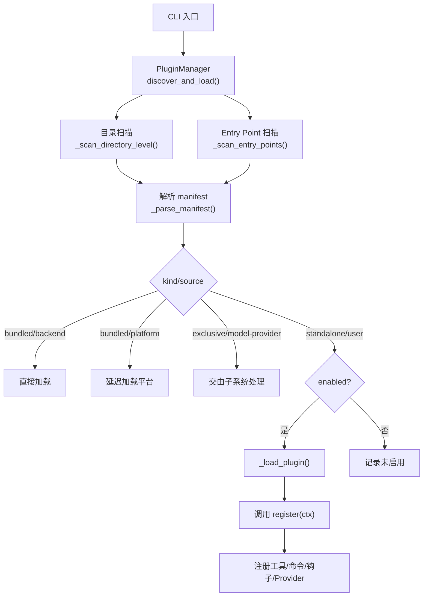
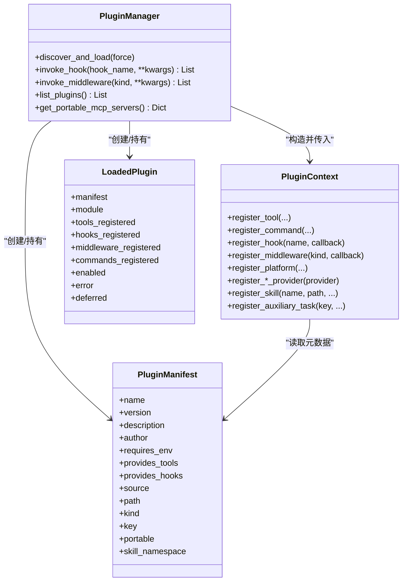
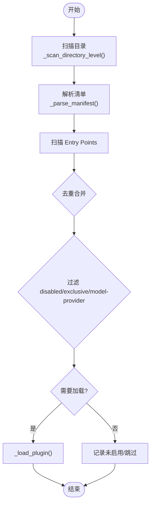
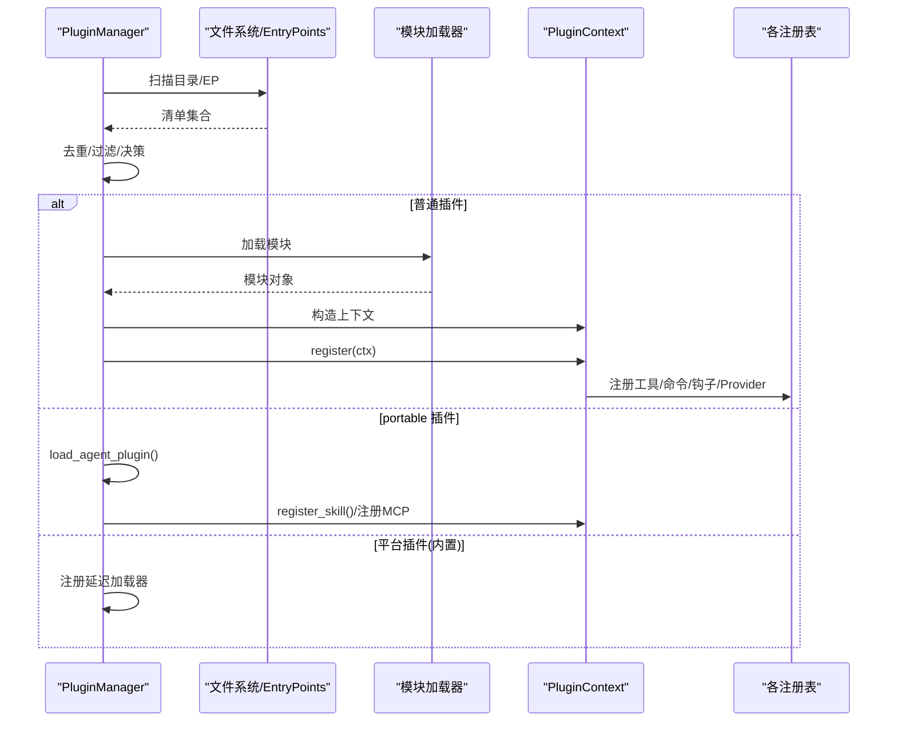
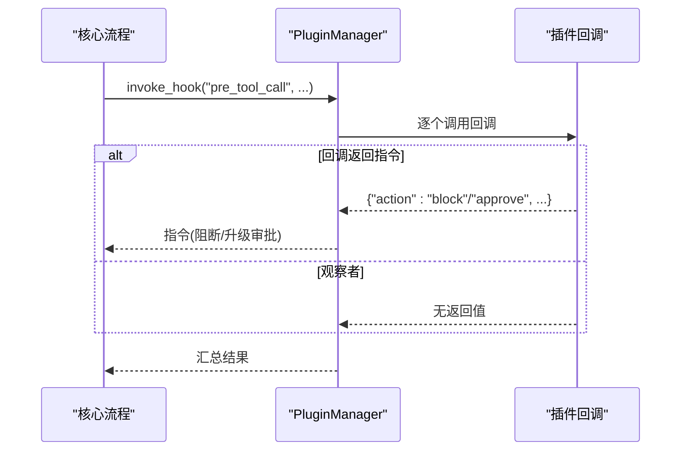
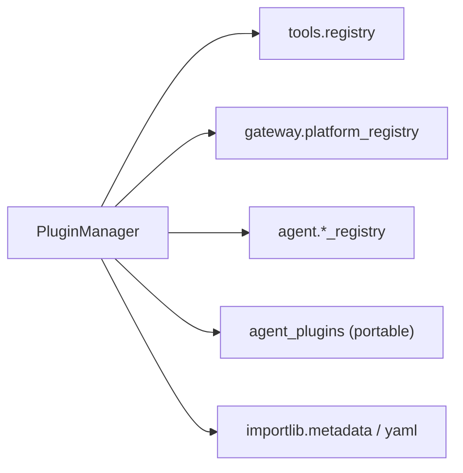

# 插件架构设计

<cite>
**本文引用的文件**
- [sparkii_cli/plugins.py](file://sparkii_cli/plugins.py)
- [sparkii_cli/agent_plugins.py](file://sparkii_cli/agent_plugins.py)
- [plugins/plugin_utils.py](file://plugins/plugin_utils.py)
- [plugins/disk-cleanup/plugin.yaml](file://plugins/disk-cleanup/plugin.yaml)
</cite>

## 目录
1. [简介](#简介)
2. [项目结构](#项目结构)
3. [核心组件](#核心组件)
4. [架构总览](#架构总览)
5. [详细组件分析](#详细组件分析)
6. [依赖关系分析](#依赖关系分析)
7. [性能考虑](#性能考虑)
8. [故障排查指南](#故障排查指南)
9. [结论](#结论)
10. [附录](#附录)

## 简介
本文件系统性阐述该仓库的插件架构设计与实现，覆盖插件发现、生命周期管理、依赖解析与版本控制、接口规范（元数据、配置 Schema、事件钩子与扩展点）、加载流程（启动扫描到运行时动态加载）、隔离机制（命名空间、权限与资源限制），以及开发工具链与示例。目标是帮助读者从零理解并安全地扩展系统能力。

## 项目结构
插件系统围绕以下关键位置组织：
- 插件发现与加载：由 CLI 层的插件管理器统一负责，支持多来源（内置、用户、项目、pip entry point）与可移植包格式。
- 插件接口与扩展点：通过 PluginContext 暴露注册工具、命令、钩子、中间件、平台适配器、各类 Provider 等。
- 可移植插件兼容层：对 v1 格式的 portable 插件进行只读校验与组件翻译（技能、MCP 服务器）。
- 并发与单例工具：为插件作者提供线程安全的懒加载与单例槽，避免常见并发陷阱。

图表来源
- [sparkii_cli/plugins.py:1341-1487](file://sparkii_cli/plugins.py#L1341-L1487)
- [sparkii_cli/plugins.py:1496-1545](file://sparkii_cli/plugins.py#L1496-L1545)
- [sparkii_cli/plugins.py:1607-1716](file://sparkii_cli/plugins.py#L1607-L1716)
- [sparkii_cli/plugins.py:1718-1807](file://sparkii_cli/plugins.py#L1718-L1807)
- [sparkii_cli/plugins.py:1813-1837](file://sparkii_cli/plugins.py#L1813-L1837)
- [sparkii_cli/plugins.py:1903-1989](file://sparkii_cli/plugins.py#L1903-L1989)

章节来源
- [sparkii_cli/plugins.py:1-32](file://sparkii_cli/plugins.py#L1-L32)
- [sparkii_cli/plugins.py:1341-1487](file://sparkii_cli/plugins.py#L1341-L1487)
- [sparkii_cli/plugins.py:1496-1545](file://sparkii_cli/plugins.py#L1496-L1545)
- [sparkii_cli/plugins.py:1607-1716](file://sparkii_cli/plugins.py#L1607-L1716)
- [sparkii_cli/plugins.py:1718-1807](file://sparkii_cli/plugins.py#L1718-L1807)
- [sparkii_cli/plugins.py:1813-1837](file://sparkii_cli/plugins.py#L1813-L1837)
- [sparkii_cli/plugins.py:1903-1989](file://sparkii_cli/plugins.py#L1903-L1989)

## 核心组件
- PluginManifest：描述插件元数据（名称、版本、描述、作者、requires_env、provides_tools/hooks、source/path/kind/key/portable/skill_namespace）。
- LoadedPlugin：运行时实例状态（模块引用、已注册的工具/钩子/中间件/命令、是否启用、错误信息、是否延迟加载）。
- PluginContext：插件注册门面，提供注册工具、命令、钩子、中间件、平台、Provider、技能、辅助任务等能力。
- PluginManager：插件发现、加载、钩子/中间件调度、可移植包集成、平台延迟加载、插件清单列表等。
- Agent Plugins v1 兼容层：对 portable 插件的 plugin.json/SKILL.md/mcp.json 进行只读校验与转换，不导入 Python 代码。
- 并发工具：lazy_singleton 与 SingletonSlot，用于线程安全的懒初始化与单例槽。

章节来源
- [sparkii_cli/plugins.py:307-362](file://sparkii_cli/plugins.py#L307-L362)
- [sparkii_cli/plugins.py:368-1303](file://sparkii_cli/plugins.py#L368-L1303)
- [sparkii_cli/plugins.py:1309-2258](file://sparkii_cli/plugins.py#L1309-L2258)
- [sparkii_cli/agent_plugins.py:47-77](file://sparkii_cli/agent_plugins.py#L47-L77)
- [plugins/plugin_utils.py:43-136](file://plugins/plugin_utils.py#L43-L136)

## 架构总览
插件系统采用“声明式清单 + 运行时注册”的模式：
- 清单驱动：每个插件提供 manifest（plugin.yaml 或 portable 的 plugin.json），声明能力与依赖。
- 分层发现：按优先级收集内置、用户、项目、entry point 的清单，去重后决定最终加载目标。
- 类型化加载：根据 kind/source 分流到不同路径（后端自动加载、平台延迟加载、专属类别独立激活、模型提供者由子系统管理）。
- 扩展点丰富：工具、命令、钩子、中间件、平台适配器、多种 Provider、技能、辅助任务、MCP 服务器等。
- 安全与隔离：命名空间隔离、工具覆盖白名单、可选启用/禁用、异常隔离、延迟加载降低启动成本。

图表来源
- [sparkii_cli/plugins.py:307-362](file://sparkii_cli/plugins.py#L307-L362)
- [sparkii_cli/plugins.py:368-1303](file://sparkii_cli/plugins.py#L368-L1303)
- [sparkii_cli/plugins.py:1309-2258](file://sparkii_cli/plugins.py#L1309-L2258)

## 详细组件分析

### 插件发现与清单解析
- 多来源扫描：内置目录、用户目录、项目目录（需显式开启）、pip entry points。
- 目录扫描支持扁平与分类两种布局，深度限制为两层；同时识别 portable 插件的 plugin.json。
- 清单解析将 YAML/JSON 转换为 PluginManifest，包含 kind/source/key/portable 等字段，并对未知 kind 做降级处理。
- 去重策略：以 key/name 为键合并，后续来源覆盖先前来源。

图表来源
- [sparkii_cli/plugins.py:1496-1545](file://sparkii_cli/plugins.py#L1496-L1545)
- [sparkii_cli/plugins.py:1607-1716](file://sparkii_cli/plugins.py#L1607-L1716)
- [sparkii_cli/plugins.py:1718-1807](file://sparkii_cli/plugins.py#L1718-L1807)
- [sparkii_cli/plugins.py:1813-1837](file://sparkii_cli/plugins.py#L1813-L1837)
- [sparkii_cli/plugins.py:1380-1487](file://sparkii_cli/plugins.py#L1380-L1487)

章节来源
- [sparkii_cli/plugins.py:1380-1487](file://sparkii_cli/plugins.py#L1380-L1487)
- [sparkii_cli/plugins.py:1496-1545](file://sparkii_cli/plugins.py#L1496-L1545)
- [sparkii_cli/plugins.py:1607-1716](file://sparkii_cli/plugins.py#L1607-L1716)
- [sparkii_cli/plugins.py:1718-1807](file://sparkii_cli/plugins.py#L1718-L1807)
- [sparkii_cli/plugins.py:1813-1837](file://sparkii_cli/plugins.py#L1813-L1837)

### 插件加载流程
- 非 portable 插件：按 source 选择目录模块或 entry point 模块加载，注入 PluginContext 并调用 register(ctx)。
- portable 插件：仅读取清单与资源，注册技能与 MCP 服务器配置，不导入 Python 代码。
- 平台插件：内置平台采用延迟加载，首次使用时才真正导入模块，减少冷启动开销。
- 模型提供者/专属类别：由各自子系统管理加载与激活，通用管理器仅记录清单。

图表来源
- [sparkii_cli/plugins.py:1903-1989](file://sparkii_cli/plugins.py#L1903-L1989)
- [sparkii_cli/plugins.py:1991-2041](file://sparkii_cli/plugins.py#L1991-L2041)
- [sparkii_cli/plugins.py:1862-1901](file://sparkii_cli/plugins.py#L1862-L1901)

章节来源
- [sparkii_cli/plugins.py:1903-1989](file://sparkii_cli/plugins.py#L1903-L1989)
- [sparkii_cli/plugins.py:1991-2041](file://sparkii_cli/plugins.py#L1991-L2041)
- [sparkii_cli/plugins.py:1862-1901](file://sparkii_cli/plugins.py#L1862-L1901)

### 插件接口规范
- 元数据定义：
  - plugin.yaml：name/version/description/author/requires_env/provides_tools/provides_hooks/kind/source/path/key/portable/skill_namespace。
  - portable plugin.json：遵循 v1 schema，包含 name/version/description/author/homepage/repository/license/keywords/extensions。
- 配置 Schema：
  - 各 Provider 通过自身类名/名称在配置中路由（如 image_gen.provider、tts.provider、stt.provider、web.search_backend 等）。
  - 辅助任务通过 auxiliary.<key> 配置块，默认 provider/model/base_url/api_key/timeout 等字段。
- 事件钩子：
  - VALID_HOOKS 定义了所有可用钩子（如 pre_tool_call、post_tool_call、transform_llm_output、on_session_start/end、pre_gateway_dispatch、approval 相关、kanban 任务生命周期等）。
- 扩展点：
  - 工具注册、斜杠命令、CLI 子命令、中间件、平台适配器、图像/视频/TTS/STT/Web 搜索/Browser 等 Provider、Secret Source、上下文引擎、技能、辅助任务、MCP 服务器。

章节来源
- [sparkii_cli/plugins.py:136-221](file://sparkii_cli/plugins.py#L136-L221)
- [sparkii_cli/plugins.py:307-362](file://sparkii_cli/plugins.py#L307-L362)
- [sparkii_cli/plugins.py:368-1303](file://sparkii_cli/plugins.py#L368-L1303)
- [sparkii_cli/agent_plugins.py:21-45](file://sparkii_cli/agent_plugins.py#L21-L45)
- [plugins/disk-cleanup/plugin.yaml:1-8](file://plugins/disk-cleanup/plugin.yaml#L1-L8)

### 生命周期管理与钩子执行
- 钩子注册：通过 ctx.register_hook(hook_name, callback) 注册，未知钩子会警告但保留以实现前向兼容。
- 钩子调用：PluginManager.invoke_hook 遍历回调，捕获异常不影响主循环，返回非 None 结果列表。
- 中间件：类似钩子，但用于改写请求/包装执行，支持未知 kind 的前向兼容。
- 工具调用前置拦截：pre_tool_call 可返回 block/approve 指令，结合审批流与线程级工具白名单实现细粒度控制。

图表来源
- [sparkii_cli/plugins.py:2103-2138](file://sparkii_cli/plugins.py#L2103-L2138)
- [sparkii_cli/plugins.py:2326-2399](file://sparkii_cli/plugins.py#L2326-L2399)

章节来源
- [sparkii_cli/plugins.py:2103-2138](file://sparkii_cli/plugins.py#L2103-L2138)
- [sparkii_cli/plugins.py:2326-2399](file://sparkii_cli/plugins.py#L2326-L2399)

### 依赖解析与版本控制
- 依赖声明：manifest 中的 requires_env 声明所需环境变量；Provider 可通过 check_fn 探测依赖可用性。
- 版本控制：
  - 清单 version 字段用于展示与审计。
  - portable 插件强制使用 v1 schema，确保向后兼容与严格校验。
  - 平台/Provider 选择通过配置项路由，避免硬耦合。
- 冲突与覆盖：
  - 同名工具覆盖需显式授权（allow_tool_override），内置工具覆盖受信任来源保护。
  - 平台/Provider 注册时进行类型检查与重复检测，失败则告警忽略。

章节来源
- [sparkii_cli/plugins.py:307-362](file://sparkii_cli/plugins.py#L307-L362)
- [sparkii_cli/plugins.py:439-520](file://sparkii_cli/plugins.py#L439-L520)
- [sparkii_cli/plugins.py:696-786](file://sparkii_cli/plugins.py#L696-L786)
- [sparkii_cli/plugins.py:895-975](file://sparkii_cli/plugins.py#L895-L975)
- [sparkii_cli/plugins.py:979-1040](file://sparkii_cli/plugins.py#L979-L1040)
- [sparkii_cli/agent_plugins.py:97-155](file://sparkii_cli/agent_plugins.py#L97-L155)

### 隔离机制
- 命名空间隔离：
  - 插件模块以 sparkii_plugins.<slug> 命名空间动态加载，避免全局污染。
  - portable 插件的技能命名空间基于 key 生成稳定 slug。
- 权限控制：
  - 工具覆盖需 allow_tool_override 显式授权，内置工具覆盖默认拒绝。
  - 线程级工具白名单可在特定上下文中限制可调用的工具集合。
- 资源限制：
  - 平台插件延迟加载，减少内存/CPU 占用。
  - 钩子/中间件异常隔离，单个插件失败不影响整体。
  - portable 插件仅读取清单与资源，不执行任意代码。

章节来源
- [sparkii_cli/plugins.py:1903-1989](file://sparkii_cli/plugins.py#L1903-L1989)
- [sparkii_cli/plugins.py:1862-1901](file://sparkii_cli/plugins.py#L1862-L1901)
- [sparkii_cli/plugins.py:2326-2399](file://sparkii_cli/plugins.py#L2326-L2399)
- [sparkii_cli/agent_plugins.py:451-475](file://sparkii_cli/agent_plugins.py#L451-L475)

### 插件开发基础框架与工具链
- 脚手架建议：
  - 目录型插件：创建 <plugin>/plugin.yaml 与 __init__.py，实现 register(ctx)。
  - portable 插件：创建 plugin.json、skills/<name>/SKILL.md、mcp.json（可选）。
- 调试工具：
  - SPARKII_PLUGINS_DEBUG=1 输出详细发现日志至 stderr。
  - PluginManager.list_plugins() 查看已发现插件及注册情况。
- 测试框架：
  - 使用 pytest 编写单元测试，借助 fixtures 与 fakes 模拟外部依赖。
  - 针对 Provider/平台/钩子的行为进行断言。

章节来源
- [sparkii_cli/plugins.py:83-130](file://sparkii_cli/plugins.py#L83-L130)
- [sparkii_cli/plugins.py:2191-2211](file://sparkii_cli/plugins.py#L2191-L2211)
- [plugins/disk-cleanup/plugin.yaml:1-8](file://plugins/disk-cleanup/plugin.yaml#L1-L8)

### 完整插件开发示例
- 简单命令插件：
  - 在 __init__.py 中实现 register(ctx)，通过 ctx.register_command 注册斜杠命令，或通过 ctx.register_tool 注册工具。
  - 参考路径：[sparkii_cli/plugins.py:577-629](file://sparkii_cli/plugins.py#L577-L629)、[sparkii_cli/plugins.py:439-494](file://sparkii_cli/plugins.py#L439-L494)。
- 复杂业务逻辑插件：
  - 注册 Provider（如图像/视频/TTS/STT/Web 搜索/Browser），通过 ctx.register_*_provider 完成。
  - 注册平台适配器，通过 ctx.register_platform 完成。
  - 注册辅助任务，通过 ctx.register_auxiliary_task 完成。
  - 参考路径：[sparkii_cli/plugins.py:696-786](file://sparkii_cli/plugins.py#L696-L786)、[sparkii_cli/plugins.py:895-975](file://sparkii_cli/plugins.py#L895-L975)、[sparkii_cli/plugins.py:979-1040](file://sparkii_cli/plugins.py#L979-L1040)、[sparkii_cli/plugins.py:1103-1212](file://sparkii_cli/plugins.py#L1103-L1212)。

章节来源
- [sparkii_cli/plugins.py:439-494](file://sparkii_cli/plugins.py#L439-L494)
- [sparkii_cli/plugins.py:577-629](file://sparkii_cli/plugins.py#L577-L629)
- [sparkii_cli/plugins.py:696-786](file://sparkii_cli/plugins.py#L696-L786)
- [sparkii_cli/plugins.py:895-975](file://sparkii_cli/plugins.py#L895-L975)
- [sparkii_cli/plugins.py:979-1040](file://sparkii_cli/plugins.py#L979-L1040)
- [sparkii_cli/plugins.py:1103-1212](file://sparkii_cli/plugins.py#L1103-L1212)

## 依赖关系分析
- 内部依赖：
  - PluginManager 依赖目录扫描、清单解析、模块加载、各注册表（工具、平台、Provider）。
  - PluginContext 依赖具体子系统（tools.registry、gateway.platform_registry、agent.*_registry 等）。
- 外部依赖：
  - PyYAML（可选，缺失时跳过 YAML 清单解析）。
  - importlib.metadata（用于 entry points 扫描）。
  - 各 Provider SDK（按需 lazy 导入）。
- 耦合与内聚：
  - 高内聚：每个 Provider/平台/工具职责单一，通过注册表解耦。
  - 低耦合：PluginManager 仅负责发现与调度，不关心具体实现细节。

图表来源
- [sparkii_cli/plugins.py:1903-1989](file://sparkii_cli/plugins.py#L1903-L1989)
- [sparkii_cli/plugins.py:1813-1837](file://sparkii_cli/plugins.py#L1813-L1837)
- [sparkii_cli/plugins.py:1718-1807](file://sparkii_cli/plugins.py#L1718-L1807)

章节来源
- [sparkii_cli/plugins.py:1718-1807](file://sparkii_cli/plugins.py#L1718-L1807)
- [sparkii_cli/plugins.py:1813-1837](file://sparkii_cli/plugins.py#L1813-L1837)
- [sparkii_cli/plugins.py:1903-1989](file://sparkii_cli/plugins.py#L1903-L1989)

## 性能考虑
- 延迟加载：内置平台插件延迟导入，显著降低冷启动时间。
- 轻量清单扫描：portable 插件仅读取 JSON/YAML，不执行 Python 代码。
- 缓存与复用：懒加载单例与线程安全槽避免重复初始化。
- 异常隔离：钩子/中间件异常被捕获，避免影响主循环。

章节来源
- [sparkii_cli/plugins.py:1862-1901](file://sparkii_cli/plugins.py#L1862-L1901)
- [sparkii_cli/plugins.py:1991-2041](file://sparkii_cli/plugins.py#L1991-L2041)
- [plugins/plugin_utils.py:43-136](file://plugins/plugin_utils.py#L43-L136)
- [sparkii_cli/plugins.py:2103-2138](file://sparkii_cli/plugins.py#L2103-L2138)

## 故障排查指南
- 插件未显示：
  - 检查是否在 plugins.enabled 列表中或被 disabled 列表排除。
  - 确认 plugin.yaml/plugin.json 格式正确且位于预期目录。
  - 启用 SPARKII_PLUGINS_DEBUG=1 查看详细日志。
- 加载失败：
  - 查看 LoadedPlugin.error 字段定位错误原因。
  - 检查 register(ctx) 是否抛出异常，或 Provider/平台 check_fn 是否失败。
- 工具覆盖被拒：
  - 如需覆盖内置工具，需在配置中设置 allow_tool_override: true。
- 钩子无效：
  - 确认钩子名称在 VALID_HOOKS 中，或至少未被拼写错误。
  - 检查回调签名与参数是否符合约定。

章节来源
- [sparkii_cli/plugins.py:247-274](file://sparkii_cli/plugins.py#L247-L274)
- [sparkii_cli/plugins.py:83-130](file://sparkii_cli/plugins.py#L83-L130)
- [sparkii_cli/plugins.py:2191-2211](file://sparkii_cli/plugins.py#L2191-L2211)
- [sparkii_cli/plugins.py:439-520](file://sparkii_cli/plugins.py#L439-L520)
- [sparkii_cli/plugins.py:2103-2138](file://sparkii_cli/plugins.py#L2103-L2138)

## 结论
该插件系统以清单驱动、分层发现、类型化加载为核心，提供了丰富的扩展点与安全隔离机制。通过延迟加载、异常隔离、权限控制与可移植包支持，系统在可扩展性与稳定性之间取得良好平衡。开发者可基于清晰的接口规范快速构建从简单命令到复杂业务的插件，并通过调试与测试工具保障质量。

## 附录
- 常用配置键：
  - plugins.enabled/disabled：启用/禁用插件列表。
  - plugins.entries.<id>.allow_tool_override：允许覆盖内置工具。
  - auxiliary.<key>.*：辅助任务的 provider/model/base_url/api_key/timeout 等。
- 推荐实践：
  - 明确声明 requires_env，避免运行时缺失。
  - 使用 check_fn 探测依赖，提供安装提示。
  - 谨慎使用工具覆盖，优先新增而非替换。
  - 利用延迟加载与轻量清单，优化启动性能。