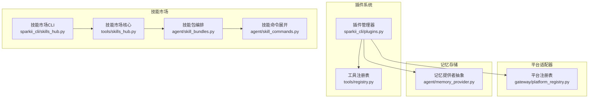
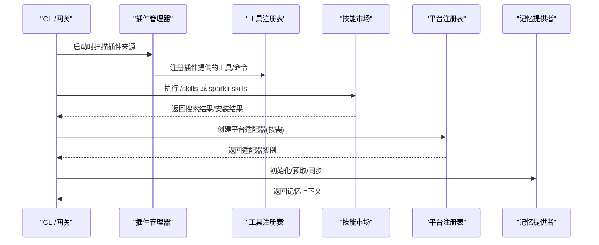
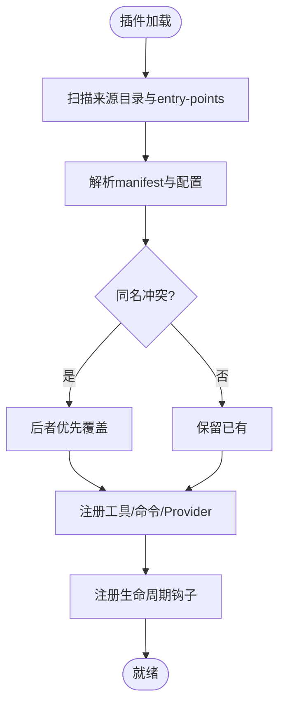
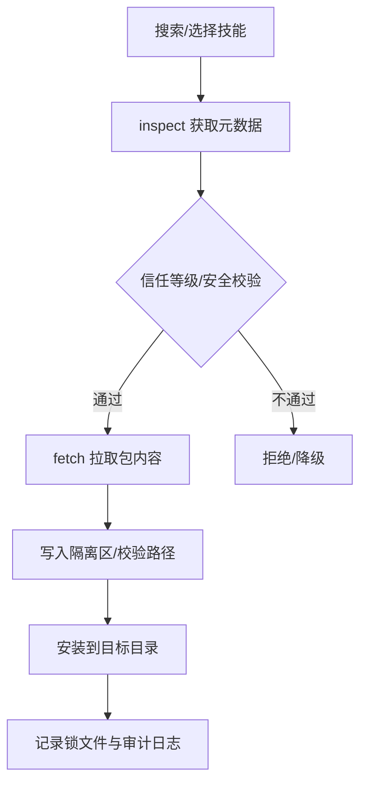
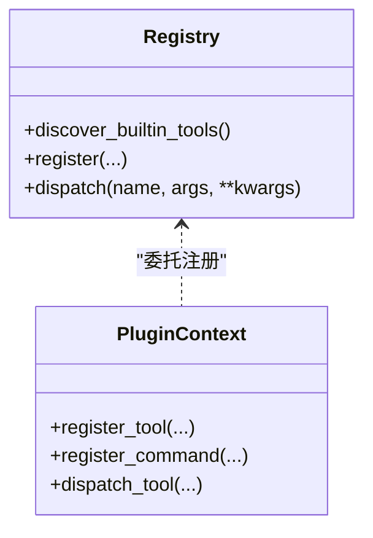
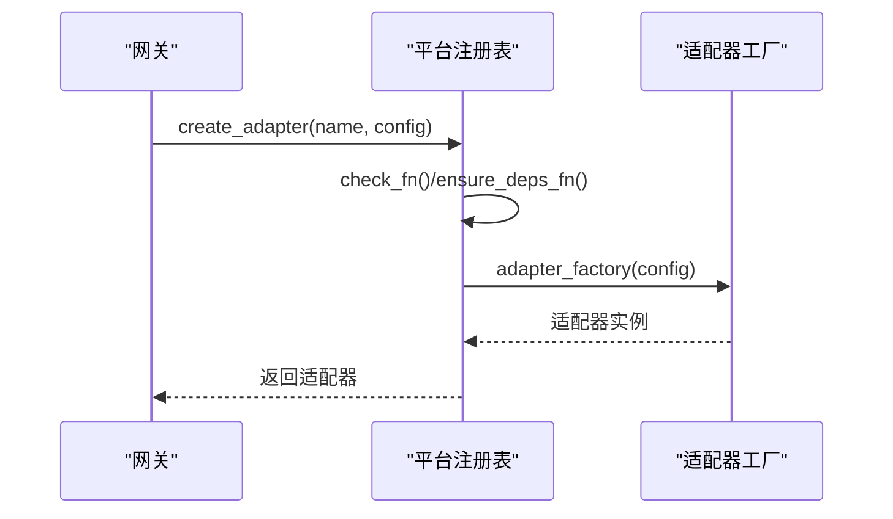
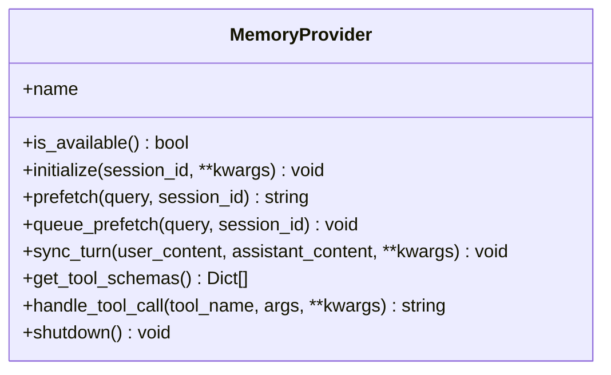
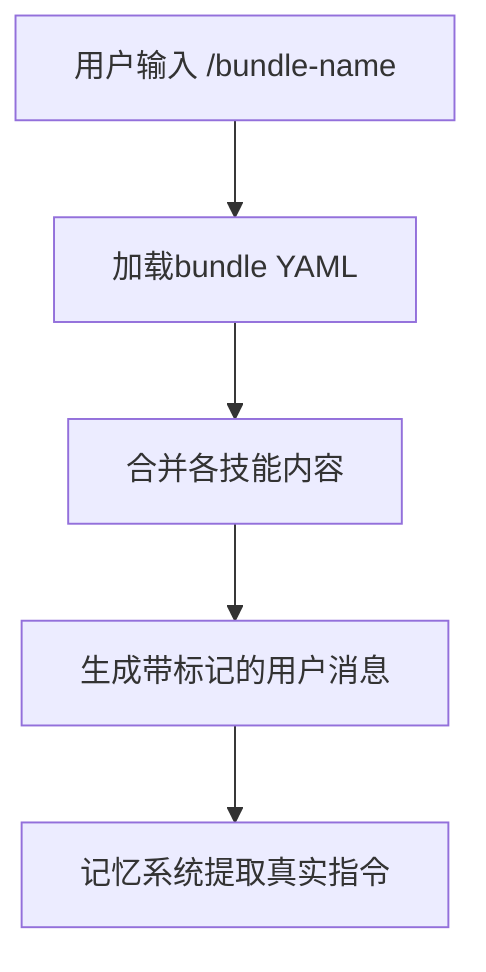
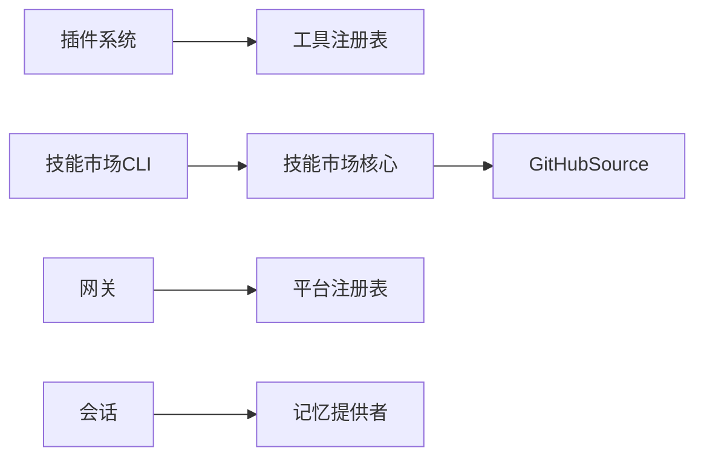

# 插件生态系统

<cite>
**本文引用的文件**
- [sparkii_cli/plugins.py](file://sparkii_cli/plugins.py)
- [agent/skill_bundles.py](file://agent/skill_bundles.py)
- [tools/skills_hub.py](file://tools/skills_hub.py)
- [sparkii_cli/skills_hub.py](file://sparkii_cli/skills_hub.py)
- [gateway/platform_registry.py](file://gateway/platform_registry.py)
- [tools/registry.py](file://tools/registry.py)
- [agent/memory_provider.py](file://agent/memory_provider.py)
- [agent/skill_commands.py](file://agent/skill_commands.py)
</cite>

## 目录
1. [简介](#简介)
2. [项目结构](#项目结构)
3. [核心组件](#核心组件)
4. [架构总览](#架构总览)
5. [详细组件分析](#详细组件分析)
6. [依赖关系分析](#依赖关系分析)
7. [性能考量](#性能考量)
8. [故障排查指南](#故障排查指南)
9. [结论](#结论)
10. [附录](#附录)

## 简介
本文件系统性地梳理并文档化该仓库的“插件生态系统”，覆盖以下关键主题：
- 插件发现机制、生命周期管理与依赖解析
- 技能市场（Skills Hub）工作原理：技能包结构、元数据定义与版本管理
- 工具集管理系统：动态加载、热插拔与权限控制
- 平台适配器开发规范：消息格式转换、认证机制与错误处理
- 记忆存储后端扩展接口：多数据库与缓存策略
- 插件分发机制：本地安装、远程下载与自动更新
- 插件开发示例：从简单命令到复杂业务逻辑

## 项目结构
围绕插件生态的核心代码分布在如下模块中：
- 插件系统：插件发现、注册、生命周期钩子、工具与命令注入
- 技能市场：统一入口 CLI 与共享实现，支持 GitHub 等源搜索、拉取、安装与审计
- 工具注册表：集中式工具注册与分发，支持 AST 扫描加速发现
- 平台适配器：可插拔的消息通道适配层，延迟加载与依赖按需安装
- 记忆提供者：抽象基类与生命周期，支持多种后端

图表来源
- [sparkii_cli/plugins.py:1-800](file://sparkii_cli/plugins.py#L1-L800)
- [tools/registry.py:108-159](file://tools/registry.py#L108-L159)
- [tools/skills_hub.py:1-200](file://tools/skills_hub.py#L1-L200)
- [agent/skill_bundles.py:1-200](file://agent/skill_bundles.py#L1-L200)
- [gateway/platform_registry.py:1-180](file://gateway/platform_registry.py#L1-L180)
- [agent/memory_provider.py:1-200](file://agent/memory_provider.py#L1-L200)

章节来源
- [sparkii_cli/plugins.py:1-800](file://sparkii_cli/plugins.py#L1-L800)
- [tools/registry.py:108-159](file://tools/registry.py#L108-L159)
- [tools/skills_hub.py:1-200](file://tools/skills_hub.py#L1-L200)
- [agent/skill_bundles.py:1-200](file://agent/skill_bundles.py#L1-L200)
- [gateway/platform_registry.py:1-180](file://gateway/platform_registry.py#L1-L180)
- [agent/memory_provider.py:1-200](file://agent/memory_provider.py#L1-L200)

## 核心组件
- 插件管理器：负责从内置、用户、项目与 pip entry-points 四个来源发现插件；解析 manifest；按优先级覆盖同名插件；提供上下文对象供插件注册工具、命令、中间件与各类 Provider。
- 工具注册表：集中维护所有工具的定义与调度，支持 AST 快速发现自注册模块，避免全量导入开销。
- 技能市场：统一的 skills 搜索/安装/管理入口，封装 GitHub 等源的认证、拉取、安全校验与安装路径保护。
- 平台适配器注册表：以延迟加载方式注册消息通道适配器，按需安装依赖，构造适配器实例。
- 记忆提供者：抽象出跨会话持久化的能力边界与生命周期，限制同时仅一个外部提供者运行。

章节来源
- [sparkii_cli/plugins.py:1-800](file://sparkii_cli/plugins.py#L1-L800)
- [tools/registry.py:108-159](file://tools/registry.py#L108-L159)
- [tools/skills_hub.py:1-200](file://tools/skills_hub.py#L1-L200)
- [gateway/platform_registry.py:183-382](file://gateway/platform_registry.py#L183-L382)
- [agent/memory_provider.py:1-200](file://agent/memory_provider.py#L1-L200)

## 架构总览
下图展示了插件生态在启动与运行时的主要交互：插件发现→注册工具/命令→技能市场检索与安装→平台适配器按需加载→记忆提供者初始化。

图表来源
- [sparkii_cli/plugins.py:1-800](file://sparkii_cli/plugins.py#L1-L800)
- [tools/registry.py:108-159](file://tools/registry.py#L108-L159)
- [tools/skills_hub.py:1-200](file://tools/skills_hub.py#L1-L200)
- [gateway/platform_registry.py:183-382](file://gateway/platform_registry.py#L183-L382)
- [agent/memory_provider.py:1-200](file://agent/memory_provider.py#L1-L200)

## 详细组件分析

### 插件发现、生命周期与依赖解析
- 发现来源与优先级
  - 内置插件、用户插件、项目插件、pip entry-points；同名冲突时后者优先覆盖。
  - 每个目录插件需包含清单与注册函数。
- 生命周期钩子
  - 提供丰富的钩子点，如工具调用前后、LLM 调用前后、会话生命周期、网关前置分发、审批流程、看板任务状态变更等。
- 依赖解析与信任门控
  - 工具覆盖内置工具需要显式授权；LLM 访问与子代理生命周期通过受控门面暴露。
  - 平台适配器支持被动探测与主动依赖安装分离，避免误触发安装。

图表来源
- [sparkii_cli/plugins.py:1-800](file://sparkii_cli/plugins.py#L1-L800)
- [gateway/platform_registry.py:183-382](file://gateway/platform_registry.py#L183-L382)

章节来源
- [sparkii_cli/plugins.py:1-800](file://sparkii_cli/plugins.py#L1-L800)
- [gateway/platform_registry.py:183-382](file://gateway/platform_registry.py#L183-L382)

### 技能市场：包结构、元数据与版本管理
- 包结构与元数据
  - 技能包由 SKILL.md 等文件组成，支持 references/templates/scripts/assets/examples 等受支持的辅助目录。
  - 元数据来自 SKILL.md frontmatter，包含名称、描述、标签、sparkii.metadata.tags 等。
- 版本与溯源
  - 从 GitHub 拉取时记录 source_url 与 source_revision；锁文件记录安装位置与来源，防止路径逃逸。
- 安全与信任
  - 对 URL 进行 SSRF 防护与重定向限制；对本地引用进行路径规范化与白名单校验；区分 builtin/trusted/community 信任等级。
- 安装与隔离
  - 安装路径强制位于技能根目录下并以技能名结尾；拒绝符号链接/目录硬链接跳转；提供隔离区与审计日志。

图表来源
- [tools/skills_hub.py:130-343](file://tools/skills_hub.py#L130-L343)
- [tools/skills_hub.py:559-754](file://tools/skills_hub.py#L559-L754)

章节来源
- [tools/skills_hub.py:130-343](file://tools/skills_hub.py#L130-L343)
- [tools/skills_hub.py:559-754](file://tools/skills_hub.py#L559-L754)

### 工具集管理系统：动态加载、热插拔与权限控制
- 动态加载
  - 通过 AST 扫描工具模块中的顶层 registry.register 调用，惰性导入已注册的模块，减少启动成本。
- 热插拔
  - 插件可在运行时注册新工具与命令；同一工具名可通过配置允许覆盖内置工具。
- 权限控制
  - 工具覆盖需显式授权；工具错误输出有长度上限，避免污染模型上下文。

图表来源
- [tools/registry.py:108-159](file://tools/registry.py#L108-L159)
- [sparkii_cli/plugins.py:439-500](file://sparkii_cli/plugins.py#L439-L500)

章节来源
- [tools/registry.py:108-159](file://tools/registry.py#L108-L159)
- [sparkii_cli/plugins.py:439-500](file://sparkii_cli/plugins.py#L439-L500)

### 平台适配器开发规范：消息格式、认证与错误处理
- 注册与延迟加载
  - 通过 PlatformEntry 声明适配器工厂、依赖探测、配置校验、环境提示、独立发送器等；支持 deferred 注册，首次使用时才导入重型 SDK。
- 认证与环境
  - 支持 required_env、setup_fn、apply_yaml_config_fn 等将 YAML 配置桥接到环境变量或直接注入 extra。
- 错误处理
  - check_fn/ensure_deps_fn 分离，避免在状态展示时触发安装；create_adapter 中捕获异常并给出友好提示。

图表来源
- [gateway/platform_registry.py:183-382](file://gateway/platform_registry.py#L183-L382)

章节来源
- [gateway/platform_registry.py:183-382](file://gateway/platform_registry.py#L183-L382)

### 记忆存储后端扩展接口：多数据库与缓存策略
- 抽象与生命周期
  - MemoryProvider 定义了 initialize、prefetch、sync_turn、get_tool_schemas、handle_tool_call、shutdown 等生命周期方法。
- 单提供者约束
  - 仅允许一个外部提供者运行，避免工具 schema 膨胀与后端冲突。
- 可选钩子
  - 支持 on_turn_start、on_session_end、on_memory_write 等扩展点，便于集成第三方存储与缓存策略。

图表来源
- [agent/memory_provider.py:81-200](file://agent/memory_provider.py#L81-L200)

章节来源
- [agent/memory_provider.py:81-200](file://agent/memory_provider.py#L81-L200)

### 技能包编排与命令展开
- 技能包（Bundle）
  - 通过 YAML 聚合多个技能，一键加载为单条用户消息；支持指令注入与缺失/禁用技能的提示。
- 命令展开
  - 将 /skill 或 /bundle 展开为带标记的结构化消息，便于记忆系统提取真实用户指令，避免将技能正文存入记忆。

图表来源
- [agent/skill_bundles.py:168-369](file://agent/skill_bundles.py#L168-L369)
- [agent/skill_commands.py:73-166](file://agent/skill_commands.py#L73-L166)

章节来源
- [agent/skill_bundles.py:168-369](file://agent/skill_bundles.py#L168-L369)
- [agent/skill_commands.py:73-166](file://agent/skill_commands.py#L73-L166)

## 依赖关系分析
- 插件系统与工具注册表
  - 插件通过 PluginContext 将工具注册到全局注册表，并在运行时调度。
- 技能市场与技能编排
  - CLI 层调用共享实现，后者对接 GitHubSource 等适配器，完成搜索、拉取与安装。
- 平台适配器与网关
  - 网关通过平台注册表按需创建适配器，支持依赖检测与安装。
- 记忆提供者与会话
  - 会话启动时初始化记忆提供者，每轮对话前预取、结束后同步。

图表来源
- [sparkii_cli/plugins.py:1-800](file://sparkii_cli/plugins.py#L1-L800)
- [tools/registry.py:108-159](file://tools/registry.py#L108-L159)
- [tools/skills_hub.py:559-754](file://tools/skills_hub.py#L559-L754)
- [gateway/platform_registry.py:183-382](file://gateway/platform_registry.py#L183-L382)
- [agent/memory_provider.py:1-200](file://agent/memory_provider.py#L1-L200)

章节来源
- [sparkii_cli/plugins.py:1-800](file://sparkii_cli/plugins.py#L1-L800)
- [tools/registry.py:108-159](file://tools/registry.py#L108-L159)
- [tools/skills_hub.py:559-754](file://tools/skills_hub.py#L559-L754)
- [gateway/platform_registry.py:183-382](file://gateway/platform_registry.py#L183-L382)
- [agent/memory_provider.py:1-200](file://agent/memory_provider.py#L1-L200)

## 性能考量
- 插件与工具发现
  - 使用 AST 扫描与磁盘缓存避免重复解析；延迟导入重型模块，降低冷启动时间。
- 平台适配器
  - 延迟加载与被动探测分离，避免在状态检查时触发网络或安装操作。
- 技能市场
  - 索引缓存与树缓存减少 API 调用；SSRF 与重定向限制提升安全性与稳定性。
- 记忆提供者
  - 预取队列与异步写入降低主循环阻塞；对 trivial 提示跳过预取节省开销。

[本节为通用指导，不直接分析具体文件]

## 故障排查指南
- 插件未生效
  - 检查是否被禁用列表排除；确认 manifest 与注册函数存在；启用调试日志定位扫描与加载过程。
- 工具覆盖失败
  - 若尝试覆盖内置工具，需在配置中显式授权；否则抛出权限错误。
- 平台适配器无法连接
  - 检查依赖是否满足；必要时触发 ensure_deps_fn；查看 validate_config 返回值与错误日志。
- 技能安装失败
  - 关注安全校验（路径、符号链接、重定向）、网络超时与速率限制；查看隔离区与审计日志。
- 记忆提供者异常
  - 确认 is_available 与 initialize 成功；检查 per-session 参数与并发场景下的资源隔离。

章节来源
- [sparkii_cli/plugins.py:1-800](file://sparkii_cli/plugins.py#L1-L800)
- [gateway/platform_registry.py:183-382](file://gateway/platform_registry.py#L183-L382)
- [tools/skills_hub.py:130-343](file://tools/skills_hub.py#L130-L343)
- [agent/memory_provider.py:81-200](file://agent/memory_provider.py#L81-L200)

## 结论
该插件生态系统通过清晰的职责划分与严格的信任门控，实现了：
- 可扩展的插件体系：多来源发现、丰富钩子、可控的工具与命令注入
- 强大的技能市场：安全的远程拉取、可信度分级、完善的溯源与审计
- 灵活的平台适配：延迟加载、按需安装、健壮的初始化流程
- 可靠的记忆后端：抽象统一、生命周期清晰、可扩展钩子
整体设计兼顾了易用性、安全性与性能，适合构建复杂的 AI 助手应用。

[本节为总结性内容，不直接分析具体文件]

## 附录
- 插件开发要点
  - 提供 plugin.yaml 与 register(ctx)；通过 ctx 注册工具、命令与 Provider；遵循权限门控与错误处理约定。
- 技能包编写要点
  - 明确 SKILL.md 元数据；合理使用 references/templates 等受支持目录；注意路径安全与引用完整性。
- 平台适配器开发要点
  - 实现 check_fn/ensure_deps_fn/validate_config；提供 standalone_sender_fn 以支持独立进程发送；妥善处理认证与错误。
- 记忆提供者开发要点
  - 实现必要生命周期方法；谨慎处理并发与资源释放；利用可选钩子增强可观测性与备份能力。

[本节为补充说明，不直接分析具体文件]