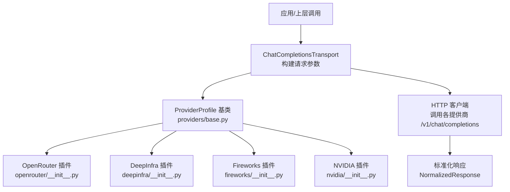
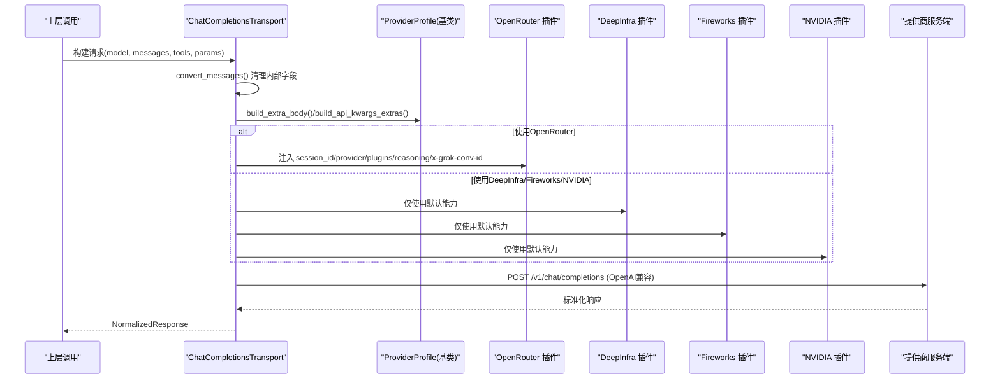
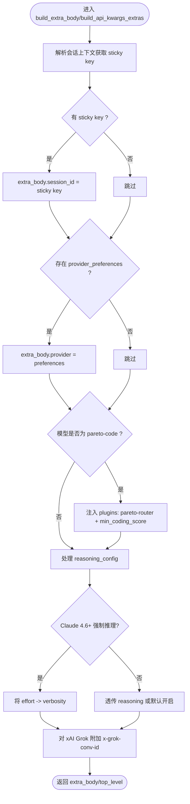
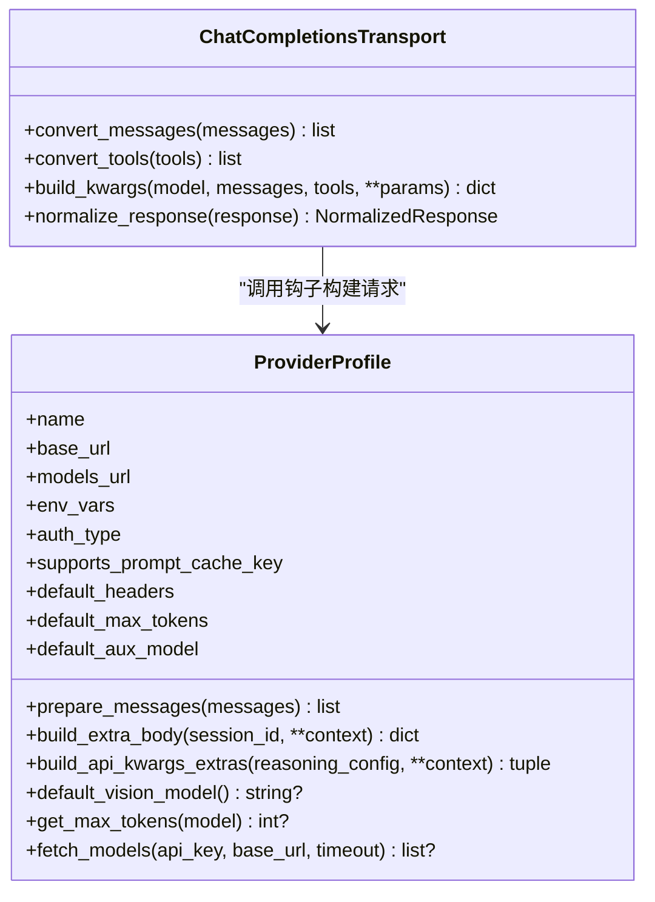
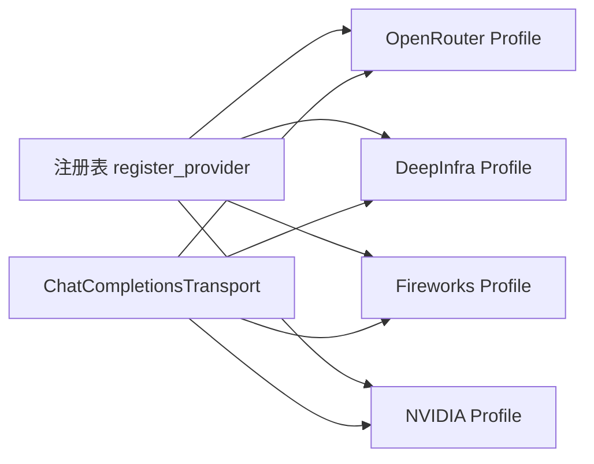

# OpenAI兼容提供商

<cite>
**本文引用的文件**
- [plugins/model-providers/README.md](file://plugins/model-providers/README.md)
- [providers/base.py](file://providers/base.py)
- [agent/transports/chat_completions.py](file://agent/transports/chat_completions.py)
- [plugins/model-providers/openrouter/__init__.py](file://plugins/model-providers/openrouter/__init__.py)
- [plugins/model-providers/deepinfra/__init__.py](file://plugins/model-providers/deepinfra/__init__.py)
- [plugins/model-providers/fireworks/__init__.py](file://plugins/model-providers/fireworks/__init__.py)
- [plugins/model-providers/nvidia/__init__.py](file://plugins/model-providers/nvidia/__init__.py)
</cite>

## 目录
1. [简介](#简介)
2. [项目结构](#项目结构)
3. [核心组件](#核心组件)
4. [架构总览](#架构总览)
5. [详细组件分析](#详细组件分析)
6. [依赖关系分析](#依赖关系分析)
7. [性能与成本优化](#性能与成本优化)
8. [故障排查指南](#故障排查指南)
9. [结论](#结论)
10. [附录：配置示例与使用场景](#附录：配置示例与使用场景)

## 简介
本文件面向需要在系统中接入“OpenAI兼容”第三方模型提供商的用户与开发者，聚焦以下目标：
- 说明支持的提供商（OpenRouter、DeepInfra、Fireworks、NVIDIA）及其认证方式、API端点与参数映射。
- 解释统一接口适配机制：如何将不同提供商的API请求转换为标准OpenAI Chat Completions格式，并在响应侧进行标准化。
- 提供模型选择、价格优化与性能调优的实践建议。
- 梳理错误处理策略与重试机制，确保服务稳定性。

## 项目结构
系统通过“插件化”的ProviderProfile声明式描述各提供商能力，传输层按统一契约调用。关键路径如下：
- 提供商插件注册与发现：位于 plugins/model-providers/*，每个子目录是一个自包含的ProviderProfile定义。
- 基础抽象与通用能力：providers/base.py 定义了ProviderProfile基类及默认行为（如模型列表拉取、消息预处理、extra_body组装等）。
- 统一传输层：agent/transports/chat_completions.py 负责将内部消息与工具调用转为OpenAI Chat Completions请求，并聚合各ProviderProfile的钩子以生成最终请求体。

图表来源
- [agent/transports/chat_completions.py:356-747](file://agent/transports/chat_completions.py#L356-L747)
- [providers/base.py:38-255](file://providers/base.py#L38-L255)
- [plugins/model-providers/openrouter/__init__.py:49-214](file://plugins/model-providers/openrouter/__init__.py#L49-L214)
- [plugins/model-providers/deepinfra/__init__.py:15-82](file://plugins/model-providers/deepinfra/__init__.py#L15-L82)
- [plugins/model-providers/fireworks/__init__.py:17-47](file://plugins/model-providers/fireworks/__init__.py#L17-L47)
- [plugins/model-providers/nvidia/__init__.py:6-22](file://plugins/model-providers/nvidia/__init__.py#L6-L22)

章节来源
- [plugins/model-providers/README.md:1-71](file://plugins/model-providers/README.md#L1-L71)

## 核心组件
- ProviderProfile（基础抽象）
  - 声明式描述提供商身份、认证方式、端点、默认头、最大输出长度、辅助模型、是否支持提示缓存键等。
  - 提供可覆写钩子：prepare_messages、build_extra_body、build_api_kwargs_extras、default_vision_model、get_max_tokens、fetch_models。
- ChatCompletionsTransport（统一传输）
  - 负责消息清洗、工具定义转换、参数构建（含温度、max_tokens、reasoning/thinking、extra_body、prompt_cache_key等）、以及响应标准化。
  - 当存在ProviderProfile时，走“单一路径”构建请求；否则回退到基于标志位的旧路径。
- 各提供商插件
  - OpenRouter：注入session_id粘性路由、provider偏好、Pareto Code插件、reasoning_config透传与x-grok-conv-id头部。
  - DeepInfra：动态发现视觉模型、设置辅助模型、开放模型目录作为唯一事实源。
  - Fireworks：固定默认头（引用/标题/UA），指定辅助模型与回退模型。
  - NVIDIA：设置base_url、默认最大输出长度与回退模型。

章节来源
- [providers/base.py:38-255](file://providers/base.py#L38-L255)
- [agent/transports/chat_completions.py:207-747](file://agent/transports/chat_completions.py#L207-L747)
- [plugins/model-providers/openrouter/__init__.py:49-214](file://plugins/model-providers/openrouter/__init__.py#L49-L214)
- [plugins/model-providers/deepinfra/__init__.py:15-82](file://plugins/model-providers/deepinfra/__init__.py#L15-L82)
- [plugins/model-providers/fireworks/__init__.py:17-47](file://plugins/model-providers/fireworks/__init__.py#L17-L47)
- [plugins/model-providers/nvidia/__init__.py:6-22](file://plugins/model-providers/nvidia/__init__.py#L6-L22)

## 架构总览
下图展示了从上层调用到具体提供商请求的完整链路，包括ProviderProfile钩子的参与位置。

图表来源
- [agent/transports/chat_completions.py:356-747](file://agent/transports/chat_completions.py#L356-L747)
- [providers/base.py:133-195](file://providers/base.py#L133-L195)
- [plugins/model-providers/openrouter/__init__.py:78-192](file://plugins/model-providers/openrouter/__init__.py#L78-L192)

## 详细组件分析

### OpenRouter 插件
- 认证与端点
  - 环境变量：OPENROUTER_API_KEY
  - base_url：https://openrouter.ai/api/v1
  - models_url：https://openrouter.ai/api/v1/models（公开目录，无需鉴权）
- 关键行为
  - 会话粘性路由：通过session_id注入extra_body.session_id，提升缓存命中与路由一致性。
  - 提供商偏好：通过extra_body.provider传递provider_preferences。
  - Pareto Code插件：当模型为 openrouter/pareto-code 且满足分数范围时，注入plugins数组。
  - reasoning_config透传：对Anthropic Claude 4.6+强制推理模型，避免发送禁用thinking导致400；将effort映射到verbosity。
  - xAI Grok缓存：对x-ai/grok-或xai/grok-前缀模型，附加x-grok-conv-id头部保持后端亲和。
- 回退模型：内置若干常用模型ID，便于目录不可用时兜底。

图表来源
- [plugins/model-providers/openrouter/__init__.py:78-192](file://plugins/model-providers/openrouter/__init__.py#L78-L192)

章节来源
- [plugins/model-providers/openrouter/__init__.py:49-214](file://plugins/model-providers/openrouter/__init__.py#L49-L214)

### DeepInfra 插件
- 认证与端点
  - 环境变量：DEEPINFRA_API_KEY、DEEPINFRA_BASE_URL
  - base_url：https://api.deepinfra.com/v1/openai
- 关键行为
  - 视觉模型默认值：在具备密钥时，从目录中筛选带“chat”标签且含“vision”能力的模型作为默认视觉模型。
  - 辅助模型：固定一个低成本模型用于压缩、搜索、视觉等辅助任务。
  - 模型目录：以远程目录为唯一事实来源，无本地回退模型，网络失败时选择器不显示选项，避免路由到已下线模型。
  - 最大输出：未设置全局默认，交由上游按模型文档限制。

章节来源
- [plugins/model-providers/deepinfra/__init__.py:15-82](file://plugins/model-providers/deepinfra/__init__.py#L15-L82)

### Fireworks 插件
- 认证与端点
  - 环境变量：FIREWORKS_API_KEY
  - base_url：https://api.fireworks.ai/inference/v1
- 关键行为
  - 默认头：HTTP-Referer、X-Title、User-Agent 随请求发送，便于追踪与合规。
  - 辅助模型：指定一个低成本模型用于辅助任务。
  - 回退模型：当目录拉取失败时，提供若干可用模型供选择器展示。

章节来源
- [plugins/model-providers/fireworks/__init__.py:17-47](file://plugins/model-providers/fireworks/__init__.py#L17-L47)

### NVIDIA 插件
- 认证与端点
  - 环境变量：NVIDIA_API_KEY
  - base_url：https://integrate.api.nvidia.com/v1
- 关键行为
  - 默认最大输出：设置为16384，避免超长输出造成资源浪费。
  - 回退模型：提供两个NVIDIA托管模型ID，便于目录不可用时的兜底。

章节来源
- [plugins/model-providers/nvidia/__init__.py:6-22](file://plugins/model-providers/nvidia/__init__.py#L6-L22)

### 统一传输层（ChatCompletionsTransport）
- 消息清洗：移除内部字段（如codex_reasoning_items、tool_name、时间戳、_前缀标记等），并对tool_calls中的extra_content做条件保留（仅Gemini家族需要）。
- 参数构建：
  - 温度：支持固定温度或透传调用方温度。
  - max_tokens：优先级 ephemeral > 用户 > 提供者默认（可通过get_max_tokens覆盖）。
  - reasoning/thinking：根据模型与提供商特性进行规范化（例如GPT-5.6的effort映射、Gemini的thinking_config、Kimi/Moonshot的特殊处理）。
  - extra_body：合并ProviderProfile提供的额外字段（如OpenRouter的provider、plugins、reasoning等）。
  - prompt_cache_key：仅在明确支持时注入，基于静态指令与工具的哈希，结合会话作用域。
- 响应标准化：提取finish_reason、tool_calls（携带provider_data）、usage等，封装为统一的NormalizedResponse。

图表来源
- [providers/base.py:38-255](file://providers/base.py#L38-L255)
- [agent/transports/chat_completions.py:207-747](file://agent/transports/chat_completions.py#L207-L747)

章节来源
- [agent/transports/chat_completions.py:207-747](file://agent/transports/chat_completions.py#L207-L747)

## 依赖关系分析
- 插件注册与发现
  - 系统首次调用get_provider_profile/list_providers时会扫描plugins/model-providers目录，导入各__init__.py并执行register_provider(profile)。
  - 用户可在$HERMES_HOME/plugins/model-providers下放置同名插件覆盖内置实现（后写入优先）。
- 传输层依赖
  - ChatCompletionsTransport依赖ProviderProfile的钩子完成请求拼装；当存在profile时，不再使用遗留的flag分支。
- 外部依赖
  - 各提供商通过各自的base_url暴露OpenAI兼容端点；部分提供商提供独立models_url（如OpenRouter）。

图表来源
- [plugins/model-providers/README.md:17-27](file://plugins/model-providers/README.md#L17-L27)
- [providers/base.py:197-255](file://providers/base.py#L197-L255)
- [agent/transports/chat_completions.py:599-747](file://agent/transports/chat_completions.py#L599-L747)

章节来源
- [plugins/model-providers/README.md:17-27](file://plugins/model-providers/README.md#L17-L27)

## 性能与成本优化
- 模型选择
  - 优先使用提供商目录（Live Catalog）获取最新可用模型，避免使用已下线模型。
  - 对DeepInfra：启用视觉模型自动发现，减少硬编码带来的维护成本。
  - 对Fireworks/NVIDIA：利用回退模型保障可用性。
- 价格优化
  - 使用default_aux_model承担压缩、标题生成、视觉等轻量任务，降低主对话成本。
  - 合理设置max_tokens：遵循提供商文档上限，避免超额计费。
- 性能调优
  - OpenRouter：启用session_id粘性路由与Pareto Code插件（代码能力评分阈值可调），提高缓存命中与质量。
  - 对xAI Grok：附加x-grok-conv-id头部，保持后端亲和，减少冷启动延迟。
  - 提示缓存：仅在明确支持时注入prompt_cache_key，避免未知字段导致的400错误。

[本节为通用指导，不直接分析具体文件]

## 故障排查指南
- 常见错误与定位
  - 400/422“未知字段”：检查消息中是否残留内部字段（如tool_name、timestamp、_前缀标记），传输层会尝试清理，但需确认下游严格模式。
  - Gemini家族thought_signature丢失：若下游要求extra_content，请确保模型为Gemini家族且未被剥离。
  - OpenRouter Claude 4.6+ 400：避免发送禁用thinking的请求；系统已针对强制推理模型调整verbosity映射。
- 诊断步骤
  - 确认环境变量与base_url是否正确。
  - 检查models_url是否可达（OpenRouter公开目录无需鉴权）。
  - 查看日志中fetch_models异常信息，必要时切换到回退模型。
- 重试与容错
  - 目录拉取失败时，使用fallback_models或提示用户切换模型。
  - 对网络抖动与DNS问题，建议在调用层增加超时与重试策略（由上层业务逻辑控制）。

章节来源
- [agent/transports/chat_completions.py:217-350](file://agent/transports/chat_completions.py#L217-L350)
- [plugins/model-providers/openrouter/__init__.py:142-192](file://plugins/model-providers/openrouter/__init__.py#L142-L192)
- [providers/base.py:197-255](file://providers/base.py#L197-L255)

## 结论
本系统通过ProviderProfile声明式描述各OpenAI兼容提供商，并由ChatCompletionsTransport统一拼装请求与标准化响应。OpenRouter、DeepInfra、Fireworks、NVIDIA等提供商均能以最小配置接入，并通过钩子机制处理各自差异（如粘性路由、思考模式、默认头、辅助模型等）。在生产环境中，建议充分利用目录发现、辅助模型与提示缓存，并结合提供商文档进行max_tokens与reasoning/thinking参数的精细调优。

[本节为总结性内容，不直接分析具体文件]

## 附录：配置示例与使用场景
以下为各提供商的关键配置项与典型使用场景（以字段名与端点为主，不含具体代码片段）：

- OpenRouter
  - 环境变量：OPENROUTER_API_KEY
  - base_url：https://openrouter.ai/api/v1
  - models_url：https://openrouter.ai/api/v1/models
  - 典型场景：多模型聚合、代码能力路由（Pareto Code插件）、xAI Grok缓存亲和（x-grok-conv-id）
- DeepInfra
  - 环境变量：DEEPINFRA_API_KEY、DEEPINFRA_BASE_URL
  - base_url：https://api.deepinfra.com/v1/openai
  - 典型场景：开源模型聚合、视觉模型自动发现、低成本辅助任务
- Fireworks
  - 环境变量：FIREWORKS_API_KEY
  - base_url：https://api.fireworks.ai/inference/v1
  - 典型场景：生产级推理、稳定低延迟、附带引用与标题头
- NVIDIA
  - 环境变量：NVIDIA_API_KEY
  - base_url：https://integrate.api.nvidia.com/v1
  - 典型场景：加速推理、受控输出长度（默认16384）

[本节为配置概览，不直接分析具体文件]