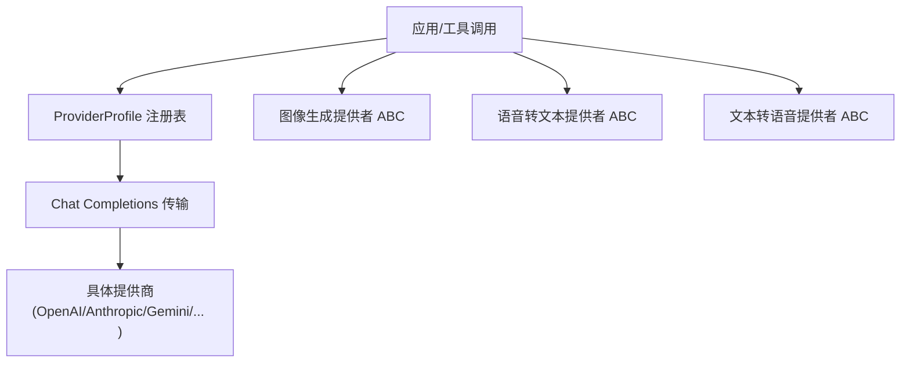
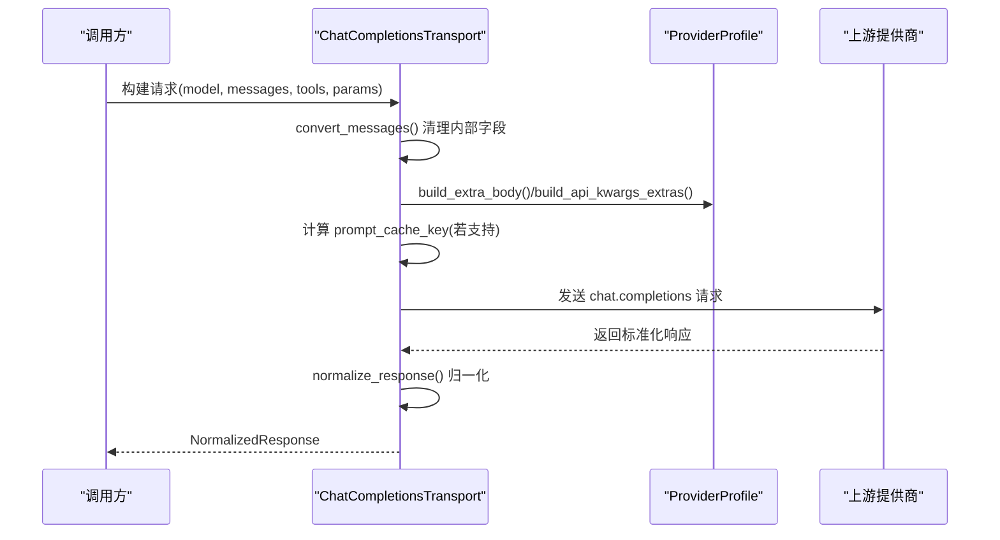
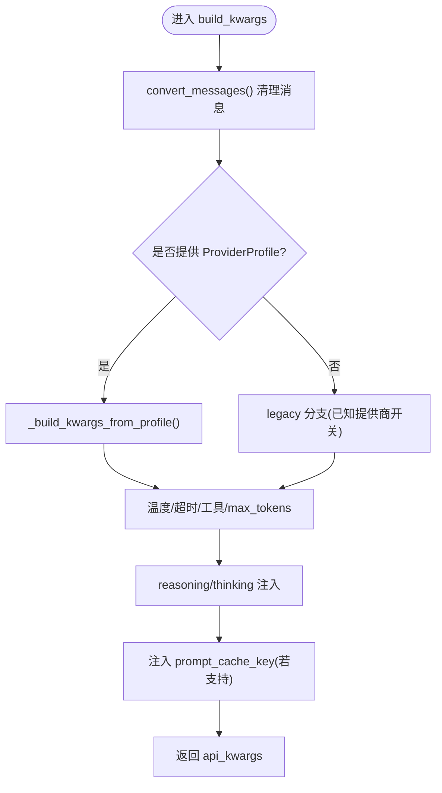
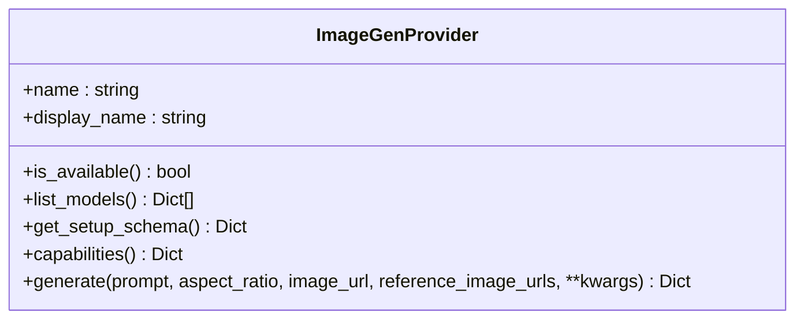
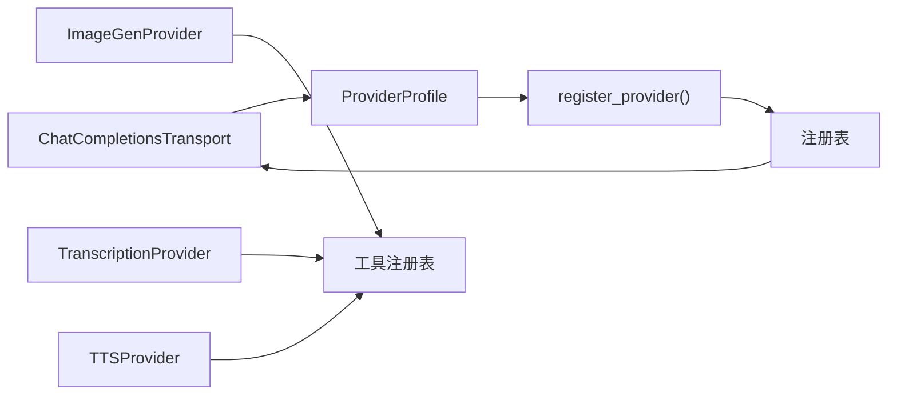

# 模型提供商

<cite>
**本文引用的文件**
- [providers/base.py](file://providers/base.py)
- [agent/transports/chat_completions.py](file://agent/transports/chat_completions.py)
- [plugins/model-providers/README.md](file://plugins/model-providers/README.md)
- [plugins/model-providers/openai-codex/__init__.py](file://plugins/model-providers/openai-codex/__init__.py)
- [plugins/model-providers/anthropic/__init__.py](file://plugins/model-providers/anthropic/__init__.py)
- [plugins/model-providers/gemini/__init__.py](file://plugins/model-providers/gemini/__init__.py)
- [agent/image_gen_provider.py](file://agent/image_gen_provider.py)
- [agent/transcription_provider.py](file://agent/transcription_provider.py)
- [agent/tts_provider.py](file://agent/tts_provider.py)
</cite>

## 目录
1. [简介](#简介)
2. [项目结构](#项目结构)
3. [核心组件](#核心组件)
4. [架构总览](#架构总览)
5. [详细组件分析](#详细组件分析)
6. [依赖关系分析](#依赖关系分析)
7. [性能考虑](#性能考虑)
8. [故障排查指南](#故障排查指南)
9. [结论](#结论)
10. [附录](#附录)

## 简介
本文件面向“模型提供商集成”的完整说明，覆盖统一接口规范（聊天完成、图像生成、语音识别与合成）、认证机制（API Key、OAuth、企业授权等）、模型路由与负载均衡策略（多提供商切换与故障转移）、能力检测与兼容性检查、自定义提供商开发指南（协议适配、错误处理、性能优化），以及主流AI提供商的配置示例与最佳实践。

## 项目结构
系统通过“声明式 ProviderProfile + 插件化注册”的方式组织模型提供商：
- 基础抽象与元数据：在 providers/base.py 中定义 ProviderProfile，描述名称、模式、端点、鉴权类型、能力标志、请求级钩子等。
- 传输层：agent/transports/chat_completions.py 实现 OpenAI Chat Completions 兼容的传输，负责消息清洗、参数组装、响应归一化，并支持按 ProviderProfile 构建请求。
- 插件目录：plugins/model-providers/* 下每个子目录是一个自包含的提供商配置插件，通过 __init__.py 注册到全局注册表；README 说明了发现与扩展方式。
- 其他模态：图像生成、语音转文本、文本转语音分别提供独立的 ABC 与工具调用入口，形成统一的插件化后端体系。

**图示来源**
- [providers/base.py:38-255](file://providers/base.py#L38-L255)
- [agent/transports/chat_completions.py:207-747](file://agent/transports/chat_completions.py#L207-L747)
- [plugins/model-providers/README.md:17-62](file://plugins/model-providers/README.md#L17-L62)

**章节来源**
- [providers/base.py:38-255](file://providers/base.py#L38-L255)
- [plugins/model-providers/README.md:17-62](file://plugins/model-providers/README.md#L17-L62)

## 核心组件
- ProviderProfile（声明式提供商档案）
  - 标识与元数据：name、display_name、description、signup_url、aliases
  - 端点与鉴权：base_url、models_url、auth_type、env_vars、supports_health_check
  - 能力标志：supports_vision、supports_vision_tool_messages、supports_prompt_cache_key
  - 模型目录：fallback_models、hostname
  - 请求级钩子：prepare_messages、build_extra_body、build_api_kwargs_extras、get_max_tokens、fetch_models、default_vision_model
- ChatCompletionsTransport（聊天完成传输）
  - 消息清洗：去除内部字段、工具调用额外字段、严格提供商不兼容字段
  - 参数构建：温度、max_tokens、reasoning/thinking、extra_body、prompt_cache_key
  - 响应归一化：finish_reason、tool_calls、usage
- 图像/语音提供者 ABC
  - ImageGenProvider：generate、capabilities、list_models、get_setup_schema
  - TranscriptionProvider：transcribe、list_models、get_setup_schema
  - TTSProvider：synthesize/stream、list_voices/list_models、get_setup_schema

**章节来源**
- [providers/base.py:38-255](file://providers/base.py#L38-L255)
- [agent/transports/chat_completions.py:217-747](file://agent/transports/chat_completions.py#L217-L747)
- [agent/image_gen_provider.py:64-194](file://agent/image_gen_provider.py#L64-L194)
- [agent/transcription_provider.py:61-194](file://agent/transcription_provider.py#L61-L194)
- [agent/tts_provider.py:64-255](file://agent/tts_provider.py#L64-L255)

## 架构总览
下图展示从工具调用到具体提供商的端到端流程，包括消息预处理、参数构建、可选提示缓存键注入、以及响应归一化。

**图示来源**
- [agent/transports/chat_completions.py:217-747](file://agent/transports/chat_completions.py#L217-L747)
- [providers/base.py:133-195](file://providers/base.py#L133-L195)

## 详细组件分析

### 聊天完成（Chat Completions）传输
- 消息清洗：移除 Codex/内部字段、工具调用 extra_content（非 Gemini 目标时）、Hermes 内部标记等，避免严格提供商拒绝。
- 参数构建：
  - 温度：支持固定温度或完全省略（OMIT_TEMPERATURE）。
  - max_tokens：优先级 ephemeral > 用户 > profile.get_max_tokens()。
  - reasoning/thinking：按提供商差异注入 top-level 或 extra_body.reasoning/thinking_config。
  - prompt_cache_key：仅在显式支持的端点注入，基于会话与作用域内容哈希。
- 响应归一化：统一 finish_reason、tool_calls.provider_data（保留 provider 特定字段）、usage。

**图示来源**
- [agent/transports/chat_completions.py:356-747](file://agent/transports/chat_completions.py#L356-L747)

**章节来源**
- [agent/transports/chat_completions.py:217-747](file://agent/transports/chat_completions.py#L217-L747)

### 提供商档案（ProviderProfile）与钩子
- 端点与鉴权：
  - base_url/models_url：推理与模型目录端点。
  - auth_type：api_key | oauth_device_code | oauth_external | copilot | aws_sdk。
  - env_vars：所需环境变量名列表。
- 能力与行为：
  - supports_vision / supports_vision_tool_messages：多模态能力。
  - supports_prompt_cache_key：是否接受 prompt_cache_key。
  - default_aux_model/fallback_models：辅助模型与离线模型清单。
- 钩子方法：
  - prepare_messages：消息预处理。
  - build_extra_body/build_api_kwargs_extras：请求体与顶层参数拼装。
  - get_max_tokens：按模型输出上限控制。
  - fetch_models：拉取在线模型目录（可被重写以适配不同鉴权与格式）。

**章节来源**
- [providers/base.py:38-255](file://providers/base.py#L38-L255)

### 主流提供商配置示例
- OpenAI Codex（OAuth External）
  - 使用 OAuth 外部登录，无 API Key；base_url 指向后端 API。
  - 适合需要浏览器会话授权的场景。
- Anthropic（API Key）
  - 使用 x-api-key 与 anthropic-version 头；提供 fetch_models 重写以适配其目录端点。
- Google Gemini（API Key）
  - 将 Hermes reasoning_config 翻译为 thinking_config（原生或 OpenAI 兼容路径）。
  - 默认辅助模型与 base_url 已内置。

**章节来源**
- [plugins/model-providers/openai-codex/__init__.py:1-16](file://plugins/model-providers/openai-codex/__init__.py#L1-L16)
- [plugins/model-providers/anthropic/__init__.py:14-55](file://plugins/model-providers/anthropic/__init__.py#L14-L55)
- [plugins/model-providers/gemini/__init__.py:18-62](file://plugins/model-providers/gemini/__init__.py#L18-L62)

### 图像生成（Image Generation）
- 统一接口：image_generate 工具同时支持文生图与图生图/编辑，依据 image_url/reference_image_urls 路由。
- 提供商契约：
  - generate(prompt, aspect_ratio, image_url, reference_image_urls, **kwargs) -> 标准成功/失败信封。
  - capabilities/modalities 声明支持的输入模态与参考图数量上限。
  - list_models/get_setup_schema 用于工具选择器与设置向导。
- 工具函数：save_b64_image/save_url_image 用于本地缓存图片，避免临时链接过期。

**图示来源**
- [agent/image_gen_provider.py:64-194](file://agent/image_gen_provider.py#L64-L194)

**章节来源**
- [agent/image_gen_provider.py:64-194](file://agent/image_gen_provider.py#L64-L194)

### 语音转文本（Transcription）
- 统一接口：transcribe(file_path, model, language, **extra) -> 标准信封。
- 提供商契约：
  - name/display_name/is_available/list_models/default_model/get_setup_schema。
  - 内置提供商优先于插件注册，防止同名冲突。
- 错误处理：实现不应抛出异常，应返回 success=False 的错误信封。

**章节来源**
- [agent/transcription_provider.py:61-194](file://agent/transcription_provider.py#L61-L194)

### 文本转语音（TTS）
- 统一接口：synthesize(text, output_path, voice, model, speed, format, **extra) -> 输出路径；可选 stream() 流式合成。
- 提供商契约：
  - list_voices/list_models/get_setup_schema/default_voice/default_model。
  - voice_compatible 指示是否适合语音气泡投递。
- 错误处理：实现应抛出异常，由调度器转换为标准信封。

**章节来源**
- [agent/tts_provider.py:64-255](file://agent/tts_provider.py#L64-L255)

## 依赖关系分析
- 传输层对 ProviderProfile 的强依赖：所有请求级差异通过 profile 钩子集中管理，降低硬编码分支。
- 提供商插件通过 register_provider 注册到全局，运行时根据 name/alias 解析。
- 各模态提供者（图像/语音）通过独立 ABC 解耦，便于按需启用与替换。

**图示来源**
- [agent/transports/chat_completions.py:207-747](file://agent/transports/chat_completions.py#L207-L747)
- [providers/base.py:38-255](file://providers/base.py#L38-L255)
- [plugins/model-providers/README.md:17-62](file://plugins/model-providers/README.md#L17-L62)

**章节来源**
- [agent/transports/chat_completions.py:207-747](file://agent/transports/chat_completions.py#L207-L747)
- [providers/base.py:38-255](file://providers/base.py#L38-L255)
- [plugins/model-providers/README.md:17-62](file://plugins/model-providers/README.md#L17-L62)

## 性能考虑
- 提示缓存键：仅在显式支持的端点注入 prompt_cache_key，减少重复静态前缀的冷启动开销。
- 温度与 max_tokens：通过 ProviderProfile 与传输层协作，避免不必要的参数下发与重试。
- 模型目录拉取：fetch_models 带超时与异常保护，失败时回退到静态 fallback_models，保障可用性。
- 图片下载：限制最大字节数与超时，避免大文件或恶意响应拖慢流程。

[本节为通用指导，无需列出具体文件]

## 故障排查指南
- 严格提供商 400/422 错误
  - 现象：携带内部字段或 extra_content 导致拒绝。
  - 处理：确保 convert_messages 已清理；非 Gemini 目标时剥离 extra_content。
- 提供商目录不可达
  - 现象：fetch_models 失败。
  - 处理：检查网络、鉴权头（如 Anthropic 的 x-api-key）、UA 头；回退到 fallback_models。
- 图像下载失败
  - 现象：URL 过期或内容类型非图片。
  - 处理：捕获异常并降级为返回 URL 或提示错误；确认 Content-Type 与大小限制。
- 语音/文本转换错误
  - 现象：提供商返回错误信封。
  - 处理：读取 error/error_type 定位问题；检查模型/语言/文件格式。

**章节来源**
- [agent/transports/chat_completions.py:217-350](file://agent/transports/chat_completions.py#L217-L350)
- [providers/base.py:197-255](file://providers/base.py#L197-L255)
- [agent/image_gen_provider.py:278-344](file://agent/image_gen_provider.py#L278-L344)
- [agent/transcription_provider.py:151-194](file://agent/transcription_provider.py#L151-L194)

## 结论
本系统通过 ProviderProfile 与传输层解耦，实现了多提供商的统一接入与灵活扩展。聊天完成传输具备完善的消息清洗、参数构建与响应归一化能力；图像与语音模态提供一致的 ABC 契约，便于插件化集成。结合能力检测、兼容性检查与错误处理，可在多提供商环境下稳定运行并提供良好的用户体验。

[本节为总结性内容，无需列出具体文件]

## 附录

### 自定义模型提供商开发指南
- 创建插件目录：plugins/model-providers/<your_provider>/__init__.py 与 plugin.yaml。
- 注册 ProviderProfile：填写 name、aliases、display_name、description、signup_url、env_vars、base_url、auth_type、默认辅助模型等。
- 覆盖钩子：
  - prepare_messages：按提供商要求预处理消息。
  - build_extra_body/build_api_kwargs_extras：注入 reasoning/thinking/tags/provider 等字段。
  - fetch_models：适配提供商的模型目录端点与鉴权。
  - get_max_tokens：按模型设置输出上限。
- 错误处理：保持健壮，异常时返回 None 或空列表，让上层回退。
- 性能优化：缓存模型目录、复用连接、合理超时与重试。

**章节来源**
- [plugins/model-providers/README.md:28-71](file://plugins/model-providers/README.md#L28-L71)
- [providers/base.py:104-195](file://providers/base.py#L104-L195)

### 认证机制与兼容性
- API Key：常见于 OpenAI/Anthropic/Gemini 等，通过环境变量注入并在请求头中携带。
- OAuth：如 OpenAI Codex 使用外部 OAuth，无需 API Key。
- 企业授权：可通过 auth_type 与自定义 fetch_models/headers 适配企业内部网关。
- 兼容性检查：
  - supports_vision/supports_vision_tool_messages：控制多模态消息构造。
  - supports_prompt_cache_key：控制是否注入提示缓存键。
  - default_vision_model：为视觉任务提供默认模型。

**章节来源**
- [providers/base.py:52-80](file://providers/base.py#L52-L80)
- [plugins/model-providers/anthropic/__init__.py:14-55](file://plugins/model-providers/anthropic/__init__.py#L14-L55)
- [plugins/model-providers/openai-codex/__init__.py:1-16](file://plugins/model-providers/openai-codex/__init__.py#L1-L16)

### 模型路由与负载均衡策略
- 路由选择：通过 ProviderProfile.name/alias 与运行时配置决定目标提供商。
- 负载均衡：可在上层编排多个提供商实例，按权重或健康状态分发请求。
- 故障转移：当主提供商失败时，自动切换到备用提供商或回退到本地/低成本模型。
- 健康检查：supports_health_check 控制是否探测 /models 端点；失败时跳过或降级。

[本节为概念性说明，未直接分析具体文件]

### 主流提供商配置要点
- OpenAI/Codex：注意 OAuth 外部登录与后端 base_url。
- Anthropic：使用 x-api-key 与 anthropic-version 头；模型目录需单独适配。
- Gemini：将 reasoning_config 映射为 thinking_config；区分原生与 OpenAI 兼容路径。
- 其他 OpenAI 兼容提供商：遵循 Chat Completions 传输的参数约定，必要时通过 ProviderProfile 钩子注入厂商特有字段。

**章节来源**
- [plugins/model-providers/openai-codex/__init__.py:1-16](file://plugins/model-providers/openai-codex/__init__.py#L1-L16)
- [plugins/model-providers/anthropic/__init__.py:14-55](file://plugins/model-providers/anthropic/__init__.py#L14-L55)
- [plugins/model-providers/gemini/__init__.py:18-62](file://plugins/model-providers/gemini/__init__.py#L18-L62)
- [agent/transports/chat_completions.py:356-747](file://agent/transports/chat_completions.py#L356-L747)